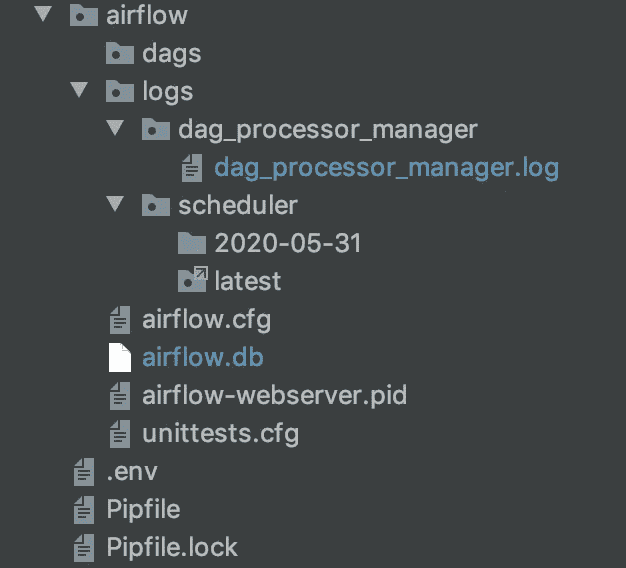

# 阿帕奇气流公司简介

> 原文：<https://towardsdatascience.com/a-complete-introduction-to-apache-airflow-b7e238a33df?source=collection_archive---------3----------------------->

## 关键概念、安装和一个真实世界的 DAG 示例


照片由[ahin yeilirapak](https://unsplash.com/@byadonia?utm_source=unsplash&utm_medium=referral&utm_content=creditCopyText)在 [Unsplash](https://unsplash.com/s/photos/air?utm_source=unsplash&utm_medium=referral&utm_content=creditCopyText) 上拍摄

气流是一种自动化和计划任务和工作流的工具。如果您想以数据科学家、数据分析师或数据工程师的身份高效工作，拥有一个能够定期自动化您想要重复的过程的工具是至关重要的。这可以是从为常规分析报告提取、转换和加载数据到自动重新训练机器学习模型的任何操作。

气流使您能够轻松地自动化主要用 Python 和 SQL 编写的简单到复杂的过程，并拥有丰富的 web UI 来可视化、监控和解决任何可能出现的问题。

下面的文章是对该工具的完整介绍。我已经包括了从在虚拟环境中安装到运行你的第一个 dag 的所有简单步骤。

我把教程分成了 6 个部分，这样更容易理解，你可以跳过你可能已经熟悉的部分。包括以下步骤:

1.  基本气流概念。
2.  如何在虚拟环境中设置气流安装。
3.  运行气流网络用户界面和计划程序。
4.  常见 CLI 命令的列表。
5.  网络用户界面之旅。
6.  创建一个真实世界的 DAG 示例。

# 1.基本概念

在介绍气流的安装和使用之前，我将简要介绍该工具的几个核心概念。

## 熟练的技艺

该工具的核心是 DAG(有向无环图)的概念。DAG 是您希望作为工作流的一部分运行的一系列任务。这可能包括通过 SQL 查询提取数据，用 Python 执行一些计算，然后将转换后的数据加载到一个新表中。在《气流》中，这些步骤将被写成 DAG 中的单独任务。

您还可以通过气流指定任务之间的关系、任何依赖关系(例如，在运行任务之前已加载到表中的数据)以及任务的运行顺序。

DAG 是用 Python 编写的，并保存为`.py`文件。工具广泛使用 **DAG_ID** 来协调 DAG 的运行。

## DAG 运行

我们具体说明了 DAG 应该在什么时候通过执行日期自动运行。DAG 按照指定的时间表(由 CRON 表达式定义)运行，可以是每天、每周、每分钟或几乎任何其他时间间隔

## 经营者

运算符将每个任务中要执行的操作封装在 DAG 中。Airflow 有各种各样的内置操作符，可以执行特定的任务，其中一些是特定于平台的。此外，还可以创建自己的自定义操作符。

# 2.装置

我将给你我个人在一个隔离的[管道](https://pypi.org/project/pipenv/)环境中的气流设置。如果您使用不同的虚拟环境工具，这些步骤可能会有所不同。这种设置很大程度上受到了这种优秀的 [Stackoverflow 线程](https://stackoverflow.com/questions/56890937/how-to-use-apache-airflow-in-a-virtual-environment)的启发。

对你的 Airflow 项目使用版本控制是一个好主意，因此第一步是在 Github 上创建一个资源库。我把我的名字叫做`airflow_sandbox`。一旦您使用`git clone "git web url"`在本地环境中创建了存储库克隆。

从终端导航到目录，例如`cd /path/to/my_airflow_directory`。

在正确的目录中，我们安装 pipenv 环境以及特定版本的 Python、Airflow 本身和 Flask，后者是运行 Airflow 所必需的依赖项。为了让一切都正常工作，为所有安装指定特定的版本是一个好主意。

```
pipenv install --python=3.7 Flask==1.0.3 apache-airflow==1.10.3
```

Airflow 需要在您的本地系统上运行一个名为 **AIRFLOW_HOME** 的位置。如果我们不指定它，它将默认为您的路由目录。我更喜欢通过在. env 文件中指定气流来设置我正在工作的项目目录的路径。为此，只需运行以下命令。

```
echo "AIRFLOW_HOME=${PWD}/airflow" >> .env
```

接下来，我们初始化 pipenv 环境。

```
pipenv shell
```

Airflow 需要一个数据库后端来运行。默认设置使用 SQLite 数据库，这对于学习和实验来说很好。如果你想建立自己的数据库后端，airflow 文档有一个很好的[指南](https://airflow.apache.org/docs/stable/howto/initialize-database.html)。初始化数据库类型。

```
airflow initdb
```

最后，我们创建一个目录来存储我们的 Dag。

```
mkdir -p ${AIRFLOW_HOME}/dags/
```

这就是最初的基本设置完成。您现在应该有一个如下所示的项目结构。



# 3.运行气流

气流有一个优秀的网络用户界面，您可以查看和监控您的 Dag。要启动 web 服务器查看 UI，只需运行以下 CLI 命令。默认情况下，Airflow 将使用端口 8080，因为我已经使用它来运行我指定的 8081。

```
airflow webserver -p 8081
```

我们还需要启动调度程序。

```
airflow scheduler
```

现在如果我们导航到[http://localhost:8081/admin/？showPaused=True](http://localhost:8081/admin/?showPaused=True) 。我们将看到以下屏幕。


Airflow 有一组显示在用户界面中的示例 Dag。一旦您开始创建自己的 Dag，您可以通过点按屏幕底部的“隐藏暂停的 Dag”来隐藏它们。

# 4.基本 CLI 命令

让我们使用这些示例 Dag 来浏览一些常见的 Airflow CLI 命令。

让我们从教程 dag 运行睡眠任务。

```
airflow run tutorial sleep 2020-05-31
```

我们可以在教程 DAG 中列出任务。

```
bash-3.2$ airflow list_tasks tutorial
```

暂停这个 DAG。

```
airflow pause tutorial
```

Unpause 教程。

```
airflow unpause tutorial
```

回填(在过去的日期执行任务)。指定 dag_id(教程)、开始日期(-s)和结束日期(-e)。

```
airflow backfill tutorial -s 2020-05-28 -e 2020-05-30
```

有关 CLI 命令的完整列表，请参见文档中的第[页](https://airflow.apache.org/docs/stable/cli-ref#backfill)。

# 5.网络用户界面

我们可以从 web UI 监控、检查和运行任务。如果我们回到 web 服务器，我们可以看到我们在教程 DAG 上运行的 CLI 命令的效果。为了便于查看，我隐藏了暂停的 Dag。


我们有许多方法可以检查 DAGS 的运行情况。

如果我们选择树形视图。


我们可以轻松查看哪些任务已经运行、正在运行或已经失败。


我们还可以通过点击小方块来运行、清除或标记特定的任务。


如果我们单击 Rendered 按钮，我们可以查看已经运行的代码或命令。


代码视图让我们看到组成 DAG 的代码。


图表视图是可视化任务如何排序或关联的好方法。


web UI 中的另一个重要区域是管理。在这里，您可以定义到其他平台(如数据库)的连接，并定义可重用的变量。


# 6.第一个 DAG

在这里，我将尝试给出一个接近真实世界的 DAG 示例，以说明至少一种使用气流的方法，并介绍随之而来的一些复杂性。

我将编写一个 Airflow DAG，它首先检查 BigQuery 公共数据集中是否存在感兴趣的日期的数据，然后将每天的数据加载到我自己的私人项目的一个表中。

BigQuery 有一个免费的使用层，允许您每月查询 1TB 的数据，因此如果您想亲自尝试，您将能够零成本地做到这一点。

## BigQuery 设置

为了一起使用 Airflow 和 BigQuery，我们需要先完成一些额外的设置步骤。

为了能够通过 Airflow 在 BigQuery 中查询和加载数据，我们需要首先给予 Airflow 所需的安全权限。

为此，你需要在谷歌云平台上创建一个服务账户。这有点像创建一个有权限访问您的帐户的用户，但旨在允许其他平台访问。

首先从谷歌云控制台导航到[服务账户](https://console.cloud.google.com/iam-admin/serviceaccounts)。然后点击**创建服务账户**按钮。

接下来填写显示的表单。


在下一页，您需要选择想要授予的访问级别。我在所有资源中选择了**编辑**，因为这是我的个人账户，这里没有存储任何敏感数据。如果我更关心潜在的安全问题，那么我会授予更细粒度的权限。

接下来，您需要创建一个私钥，您可以通过选择**创建密钥**来完成。选择 JSON，因为这是你需要的气流。私钥将被下载到您的本地系统，您需要安全地存储它。

我们现在需要返回到 Airflow Web UI，用这个 JSON 文件的输出更新 bigquery_default 连接。您还需要添加一个默认的项目 id，如下所示。


我们还需要在 pipenv 环境中安装一些 Google Cloud 依赖项。我已经安装了以下软件。

```
pipenv install google-cloud-storage httplib2 google-api-python-client google-cloud-bigquery pandas_gbq
```

## 创建 DAG

下面是将执行上述步骤的 DAG 的代码。这应该作为一个`.py`文件保存在我们之前创建的 dags 目录中。

在 DAG 的顶部是必需的导入。Airflow 提供了一系列操作人员来执行谷歌云平台上的大多数功能。我已经导入了用于运行查询和加载数据的 **BigQueryOperator** ，以及用于检查特定日期的数据是否存在的 **BigQueryCheckOperator** 。

在 dag 的下一部分，我们定义 dag_args，然后创建 DAG，它提供诸如 dag_id、start_date 和任务运行频率等信息。Airflow 使用 CRON 表达式来定义时间表，有关这些表达式的更多信息，请访问此[页面](https://airflow.apache.org/docs/stable/scheduler.html)。

然后，我们将每个步骤定义为一个任务，我将它们定义为变量 t1 和 t2。这些任务各自执行工作流中的特定步骤。在 DAG 的最底部可以找到它们的运行顺序。

我们现在可以转到 web 用户界面，运行 DAG。


如果我们转到 BigQuery 控制台，我们还会看到 Airflow 创建并加载了数据的表。


本文旨在全面介绍如何使用气流创建第一个 DAG。有关更详细的使用指南，可在[这里](https://airflow.apache.org/docs/)找到气流文件。

文章中详细描述的完整项目的链接可以在这个 [Github 资源库](https://github.com/rebecca-vickery/airflow_sandbox)中找到。

感谢阅读！

我每月都会发一份简讯，如果你想加入，请点击此链接注册。期待成为您学习旅程的一部分！