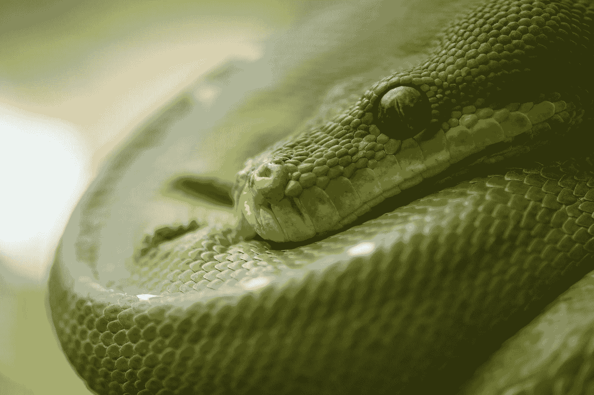
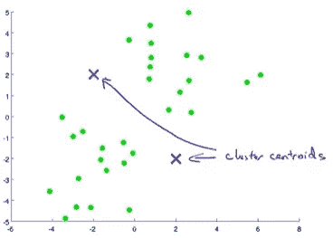
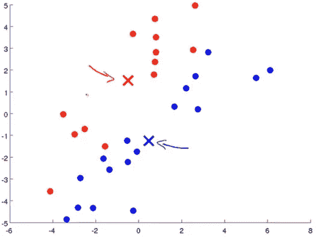
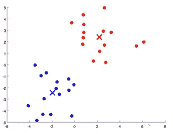
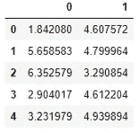
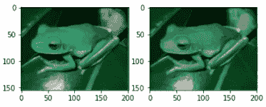

# Python 中从头开始的完整 K 均值聚类算法:分步指南

> 原文：<https://towardsdatascience.com/a-complete-k-mean-clustering-algorithm-from-scratch-in-python-step-by-step-guide-1eb05cdcd461?source=collection_archive---------1----------------------->



彼得·诺伊曼在 [Unsplash](https://unsplash.com?utm_source=medium&utm_medium=referral) 上的照片

## 还有，如何使用 K 均值聚类算法对图像进行降维

> **什么是 K 均值聚类？**

k 均值聚类是最流行和最广泛使用的无监督学习模型。它也称为聚类，因为它通过对数据进行聚类来工作。与监督学习模型不同，非监督模型不使用标记数据。

> 该算法的目的不是预测任何标签。取而代之的是更好地了解数据集并给它们贴上标签。

在 k 均值聚类中，我们将数据集聚类成不同的组。

> **下面是 k 均值聚类算法的工作原理**

1.  第一步，随机初始化几个点。这些点被称为簇形心。



在上图中，红色和蓝色的点是星团的质心。

可以选择任意数量的簇质心。但是聚类质心的数量必须少于数据点的总数。

2.第二步是集群分配步骤。在这一步，我们需要遍历每个绿点。根据这个点是靠近红点还是蓝点，我们需要把它分配给其中一个点。

换句话说，根据绿点是更接近蓝色簇形心还是红色簇形心，将绿点涂成红色或蓝色。



3.下一步是移动簇的质心。现在，我们必须取分配给红色聚类质心的所有红点的平均值，并将红色聚类质心移动到该平均值。我们需要对蓝色星团的质心做同样的操作。

现在，我们有了新的簇形心。我们必须回到第二步，集群分配步骤。我们需要将这些点重新排列成新的簇形心。在重复第三遍之后。

数字 2 和 3 需要重复几次，直到两个簇的质心都在合适的位置，如下图所示。



看，我们只是根据它们被分配到的簇质心给所有的绿点着色。蓝色群集质心位于蓝色群集的中心，而红色群集质心位于红色群集的中心。

当我们开发算法的时候，事情会变得更加清楚。我们将对此进行更详细的讨论。

# 开发算法

我将用于该算法的数据集是从 Coursera 的[吴恩达的机器学习课程中获得的。以下是开发 k 均值算法的逐步指南:](https://www.coursera.org/learn/machine-learning/)

> **1。导入必要的包和数据集**

```
import pandas as pd
import numpy as np
df1 = pd.read_excel('dataset.xlsx', sheet_name='ex7data2_X', header=None)
df1.head()
```



数据集只有两列。我选择了两个特色数据集，因为它易于可视化。当你看到视觉效果时，你会更容易理解这个算法。但是同样的算法也适用于多维数据集。

我将把数据帧 df1 转换成一个 Numpy 数组，因为我们将在这个过程中处理其他数组:

```
X = np.array(df1)
```

现在，我将遵循我上面讨论的三个步骤。

> **2。第一步是随机初始化质心。**

我将从数据集中随机初始化三个点。首先，我将在 0 和数据集长度之间选择三个数字。

```
import random
init_centroids = random.sample(range(0, len(df1)), 3)
init_centroids
```

输出:

```
[95, 30, 17]
```

以这三个数为指标，得到这些指标的数据点。

```
centroids = []
for i in init_centroids:
    centroids.append(df1.loc[i])
centroids
```

输出:

```
[0    3.907793
 1    5.094647
 Name: 95, dtype: float64,
 0    2.660466
 1    5.196238
 Name: 30, dtype: float64,
 0    3.007089
 1    4.678978
 Name: 17, dtype: float64]
```

这三个点是我们的初始质心。

我会把它们转换成二维数组。因为我更熟悉这种格式。

```
centroids = np.array(centroids)
```

输出:

```
array([[3.90779317, 5.09464676],
       [2.66046572, 5.19623848],
       [3.00708934, 4.67897758]])
```

> **3。实施集群分配步骤。**

在这一步中，我们将遍历数据集中的所有数据点。

> 一个数据点意味着一行数据

让我们以单行数据为例，了解如何将该数据分配给一个集群。

我们将计算该数据到所有三个质心的距离。然后将该数据点分配给与它距离最小的质心。

正如我们看到的，我们必须计算两点之间的距离。让我们开发一个函数来计算距离。

```
def calc_distance(X1, X2):
    return(sum((X1 - X2)**2))**0.5
```

开发一个函数，将每个数据点分配给一个质心。我们的“质心”数组只有三个值。所以我们有三个指数:0，1，2。我们将这些指数中的一个分配给每个数据点。

```
def findClosestCentroids(ic, X):
    assigned_centroid = []
    for i in X:
        distance=[]
        for j in ic:
            distance.append(calc_distance(i, j))
        assigned_centroid.append(np.argmin(distance))
    return assigned_centroid
```

这是将数据点分配给聚类的功能。让我们使用这个函数来计算每个数据点的质心:

```
get_centroids = findClosestCentroids(centroids, X)
get_centroids
```

部分输出:

```
[2,
 0,
 0,
 2,
 1,
 2,
 2,
 2,
 1,
 1,
 2,
 2,
 2,
 2,
 2,
 2,
 0,
```

总输出长。我在这里展示了部分输出。输出中的第一个质心是 2，这意味着它被分配给质心列表的索引 2。

***4。最后一步是根据数据点的平均值*** 移动质心

在这一步中，我们将取每个质心的所有数据点的平均值，并将质心移动到该平均值。

例如，我们将找到在索引 2 处分配给质心的所有点的平均值，并将质心 2 移动到平均值。对索引 0 和 1 处的质心做同样的操作。

让我们定义一个函数来做这件事:

```
def calc_centroids(clusters, X):
    new_centroids = []
    new_df = pd.concat([pd.DataFrame(X), pd.DataFrame(clusters, columns=['cluster'])],
                      axis=1)
    for c in set(new_df['cluster']):
        current_cluster = new_df[new_df['cluster'] == c][new_df.columns[:-1]]
        cluster_mean = current_cluster.mean(axis=0)
        new_centroids.append(cluster_mean)
    return new_centroids
```

这些都是我们需要开发的功能。

正如我之前讨论过的，我们需要重复这个聚类分配和移动质心的过程几次，直到质心在一个合适的位置。

对于这个问题，我选择重复这个过程 10 次。我将在每次迭代后继续绘制质心和数据，直观地向您展示它是如何工作的。

```
for i in range(10):
    get_centroids = findClosestCentroids(centroids, X)
    centroids = calc_centroids(get_centroids, X)
    #print(centroids)
    plt.figure()
    plt.scatter(np.array(centroids)[:, 0], np.array(centroids)[:, 1], color='black')
    plt.scatter(X[:, 0], X[:, 1], alpha=0.1)
    plt.show()
```


经过五次迭代后，质心被设置到它们的最佳位置。所以在那之后他们没有改变立场。

> 我建议，在尝试降维之前，请运行上面的所有代码并学好它。

否则你可能会不知所措！此外，我现在将移动得更快一点，因为我们已经详细解释了算法。

# 维度缩减

我想至少解释一下这个算法的一个用例。一个非常有用的用例是降维。

想一个形象。一幅图像中可能有许多不同的像素。在任何计算机视觉问题中，如果我们能够降低图片的尺寸，设备读取该图片的速度将会快很多！不是吗？

我们可以使用我们刚刚开发的算法来降低图片的尺寸。

我将用一只青蛙的图片来演示这一点:


作者图片

我把这张照片上传到了我笔记本的同一个文件夹里。让我们导入这个:

```
import cv2
im = cv2.imread('frog.png')
im
```

输出:

```
array([[[  2,  57,  20],
        [  2,  57,  20],
        [  2,  57,  21],
        ...,
        [  0,   5,   3],
        [  8,  12,  11],
        [ 91,  94,  93]],       [[  2,  56,  20],
        [  1,  54,  20],
        [  1,  56,  19],
        ...,
        [  0,   2,   1],
        [  7,   9,   8],
        [ 91,  92,  91]],       [[  2,  55,  20],
        [  2,  53,  19],
        [  1,  54,  18],
        ...,
        [  2,   4,   2],
        [  8,  11,   9],
        [ 91,  93,  91]],       ...,       [[  6,  76,  27],
        [  6,  77,  26],
        [  6,  78,  28],
        ...,
        [  6,  55,  18],
        [ 13,  61,  25],
        [ 94, 125, 102]],       [[  9,  79,  31],
        [ 11,  81,  33],
        [ 12,  82,  32],
        ...,
        [  6,  56,  19],
        [ 14,  61,  27],
        [ 96, 126, 103]],       [[ 43, 103,  63],
        [ 44, 107,  66],
        [ 46, 106,  66],
        ...,
        [ 37,  81,  50],
        [ 47,  88,  59],
        [118, 145, 126]]], dtype=uint8)
```

检查阵列的形状，

```
im.sgape
```

输出:

```
(155, 201, 3)
```

我将整个数组除以 255，使所有的值从 0 到 1。

然后将其整形为 155*201 x 3，使其成为二维数组。因为我们之前为二维数组开发了所有的函数。

```
im = (im/255).reshape(155*201, 3)
```

正如你在上面看到的，这么多不同的像素值。我们想减少它，只保留 10 像素的值。

让我们初始化 10 个随机索引，

```
random_index = random.sample(range(0, len(im)), 10)
```

现在，像我们在前面的例子中做的那样找到质心:

```
centroids = []
for i in random_index:
    centroids.append(im[i])
centroids = np.array(centroids)
```

输出:

```
array([[0.00392157, 0.21176471, 0.06666667],
       [0.03529412, 0.2627451 , 0.09803922],
       [0.29411765, 0.3254902 , 0.26666667],
       [0.00784314, 0.18431373, 0.05882353],
       [0.29019608, 0.49411765, 0.28235294],
       [0.5254902 , 0.61176471, 0.48627451],
       [0.04313725, 0.23921569, 0.09803922],
       [0.00392157, 0.23529412, 0.0745098 ],
       [0.00392157, 0.20392157, 0.04705882],
       [0.22352941, 0.48235294, 0.40784314]])
```

现在我也要把' im '转换成一个数组，

```
im = np.array(im)
```

数据准备好了。现在我们可以继续我们的聚类过程。但这一次，我不会把它形象化。因为数据不再是二维的了。所以，可视化并不容易。

```
for i in range(20):
    get_centroids = findClosestCentroids(centroids, im)
    centroids = calc_centroids(get_centroids, im)
```

我们现在得到了更新的质心。

```
centroids
```

输出:

```
[0    0.017726
 1    0.227360
 2    0.084389
 dtype: float64,
 0    0.119791
 1    0.385882
 2    0.247633
 dtype: float64,
 0    0.155117
 1    0.492051
 2    0.331497
 dtype: float64,
 0    0.006217
 1    0.048596
 2    0.019410
 dtype: float64,
 0    0.258289
 1    0.553290
 2    0.406759
 dtype: float64,
 0    0.728167
 1    0.764610
 2    0.689944
 dtype: float64,
 0    0.073519
 1    0.318513
 2    0.170943
 dtype: float64,
 0    0.035116
 1    0.273665
 2    0.114766
 dtype: float64,
 0    0.010810
 1    0.144621
 2    0.053192
 dtype: float64,
 0    0.444197
 1    0.617780
 2    0.513234
 dtype: float64]
```

这是最后一步。我们只会保留这 10 个点。

如果您也打印 get_centroids，您将看到集群分配。

现在，我们要遍历整个数组' im ',并将数据更改为其对应的聚类质心值。这样，我们将只有这些质心值。

我不想改变原来的数组，而是想做一个拷贝并在那里进行修改。

```
im_recovered = im.copy()
for i in range(len(im)):
    im_recovered[i] = centroids[get_centroids[i]]
```

正如你所记得的，我们改变了图像的维度，在开始时，使它成为一个二维数组。我们现在需要把它改成原来的形状。

```
im_recovered = im_recovered.reshape(155, 201, 3)
```

在这里，我将并排绘制原始图像和缩小图像，向您展示两者的区别:

```
im1 = cv2.imread('frog.png')
import matplotlib.image as mpimg
fig,ax = plt.subplots(1,2)
ax[0].imshow(im1)
ax[1].imshow(im_recovered)
```



作者图片

看，我们把图像的尺寸缩小了很多。尽管如此，它看起来像一只青蛙！但是电脑阅读的速度会快得多！

# 结论

在本文中，我解释了 k 均值聚类是如何工作的，以及如何从头开始开发 k 均值聚类算法。我还解释了，如何使用这种算法来降低图像的维度。请尝试使用不同的图像。

这是我在本文中使用的数据集的链接。

[](https://github.com/rashida048/Machine-Learning-With-Python/blob/master/kmean.xlsx) [## rashida 048/用 Python 进行机器学习

### 此时您不能执行该操作。您已使用另一个标签页或窗口登录。您已在另一个选项卡中注销，或者…

github.com](https://github.com/rashida048/Machine-Learning-With-Python/blob/master/kmean.xlsx) 

以下是完整代码的 GitHub 链接:

[](https://github.com/rashida048/Machine-Learning-With-Python/blob/master/k_mean_clustering_final.ipynb) [## rashida 048/用 Python 进行机器学习

### permalink dissolve GitHub 是超过 5000 万开发人员的家园，他们一起工作来托管和审查代码，管理…

github.com](https://github.com/rashida048/Machine-Learning-With-Python/blob/master/k_mean_clustering_final.ipynb) 

# 阅读推荐:

[](/basic-linear-regression-algorithm-in-python-for-beginners-c519a808b5f8) [## Python 中的线性回归算法:一步一步

### 学习线性回归的概念，并使用 python 从头开始开发一个完整的线性回归算法

towardsdatascience.com](/basic-linear-regression-algorithm-in-python-for-beginners-c519a808b5f8) [](/multivariate-linear-regression-in-python-step-by-step-128c2b127171) [## Python 中多元线性回归的逐步实现

### 学习用 Python 从头开始开发任意数量变量的多元线性回归。

towardsdatascience.com](/multivariate-linear-regression-in-python-step-by-step-128c2b127171) [](/multiclass-classification-algorithm-from-scratch-with-a-project-in-python-step-by-step-guide-485a83c79992) [## 使用 Python 从零开始的多类分类算法:分步指南

### 本文介绍两种方法:梯度下降法和优化函数法

towardsdatascience.com](/multiclass-classification-algorithm-from-scratch-with-a-project-in-python-step-by-step-guide-485a83c79992) [](/polynomial-regression-from-scratch-in-python-1f34a3a5f373) [## Python 中从头开始的多项式回归

### 学习用一些简单的 python 代码从头开始实现多项式回归

towardsdatascience.com](/polynomial-regression-from-scratch-in-python-1f34a3a5f373) [](https://medium.com/towards-artificial-intelligence/build-a-neural-network-from-scratch-in-python-f23848b5a7c6) [## 用 Python 从头开始构建神经网络

### 神经网络的详细说明和逐步实现

medium.com](https://medium.com/towards-artificial-intelligence/build-a-neural-network-from-scratch-in-python-f23848b5a7c6) [](/a-complete-anomaly-detection-algorithm-from-scratch-in-python-step-by-step-guide-e1daf870336e) [## Python 中从头开始的完整异常检测算法:分步指南

### 基于概率的异常检测算法

towardsdatascience.com](/a-complete-anomaly-detection-algorithm-from-scratch-in-python-step-by-step-guide-e1daf870336e) [](/great-quality-free-courses-to-learn-machine-learning-and-deep-learning-1029048fd0fc) [## 学习机器学习和深度学习的优质免费课程

### 顶级大学高质量免费课程的链接

towardsdatascience.com](/great-quality-free-courses-to-learn-machine-learning-and-deep-learning-1029048fd0fc)