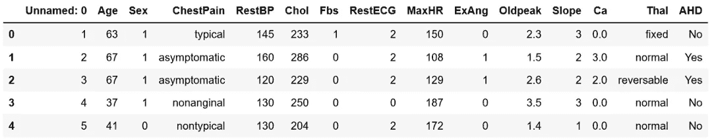
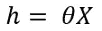
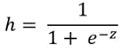
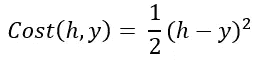
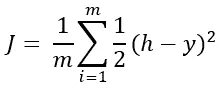
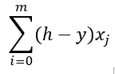
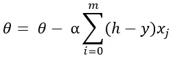
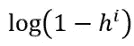
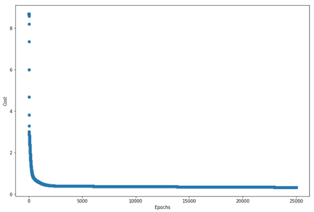

# Python 中从头开始的完整逻辑回归算法:一步一步

> 原文：<https://towardsdatascience.com/a-complete-logistic-regression-algorithm-from-scratch-in-python-step-by-step-ce33eae7d703?source=collection_archive---------5----------------------->


爱丽丝·华生在 [Unsplash](https://unsplash.com?utm_source=medium&utm_medium=referral) 上拍摄的照片

## 使用真实世界的数据集开发算法

逻辑回归是上个世纪以来流行的一种方法。它建立了分类变量和一个或多个自变量之间的关系。这种关系在机器学习中用于预测分类变量的结果。它广泛应用于许多不同的领域，如医疗领域、贸易和商业、技术等。

> 本文解释了开发二元分类算法的过程，并在 Kaggle 的心脏病数据集上实现了该算法。

# 问题陈述

在本文中，我们将使用来自 Kaggle 的数据集，其中包含人口的健康数据。它的最后有一栏包含一个人是否有心脏病。我们的目标是看看我们是否能利用表格中的其他列来预测一个人是否患有心脏病。

在这里，我将加载数据集。为此，我将使用熊猫:

```
import pandas as pd
import numpy as np
df = pd.read_csv('Heart.csv')
df.head()
```

数据集如下所示:



Haert.csv 数据集的前五行

查看数据集的最后一列。它是“AHD”。这表示有心脏病。我们将使用其余的专栏来预测心脏病。因此，在未来，如果我们有了所有的数据，我们将能够预测一个人是否患有心脏病，而无需医学检查。

我们的输出将是 0 或 1。如果一个人有心脏病，我们的算法将返回 1，如果一个人没有心脏病，算法将返回 0。

# 重要方程式

记住线性回归公式。直线的最基本公式:

Y= A+BX

其中 A 是截距，B 是斜率。如果我们避开等式中的“截距”A，则公式变为:

Y = BX

传统上，在机器学习中，它被表示为，



这里，“h”是假设或预测值，X 是预测值或输入变量。θ在开始时被随机初始化，随后被更新。

对于逻辑回归，我们需要使用一个返回从 0 到 1 的值的 **sigmoid 函数**来转换这个简单的假设。sigmoid 函数也可以称为逻辑函数。逻辑回归使用 sigmoid 函数来预测输出。这是 sigmoid 激活函数:



z 是输入特征乘以随机初始化项θ。


这里，X 是输入特征，θ是将在该算法中更新的随机初始化值。

我们需要使用逻辑函数的原因是，逻辑函数的曲线看起来像这样:


作者图片

从上图可以看出，它返回 0 到 1 之间的值。所以，对分类很有帮助。因为我们今天将研究二元分类，

> 如果逻辑函数返回的值小于 0.5，我们将返回零；如果逻辑函数返回的值大于或等于 0.5，我们将返回 1

> **成本函数**

成本函数为您提供了预测输出(计算的假设“h”)与原始输出(数据集中的“AHD”列)之间的距离。

在深入研究逻辑回归的成本函数之前，我想提醒你一下线性回归的成本函数，它要简单得多。线性回归的成本是:



在哪里，

y 是原始标签(数据集的“AHD”列)

平均成本函数是:



在哪里，

m 是训练数据的数量

上面的等式首先取预测标签“h”和原始标签“y”之间的差。该公式包括平方以避免任何负值，并使用 1/2 来优化该平方。

这个简单明了的方程适用于线性回归，因为线性回归使用一个简单的线性方程:(Y= A+BX)。

> 但是逻辑回归使用的是非线性的 sigmoid 函数。

我们不能在这里使用简单成本函数，因为它不会收敛到全局最小值。为了解决这个问题，我们将使用日志来正则化成本函数，以便它收敛到全局最小值。

下面是我们将用来保证全局最小值的成本函数:

如果 y = 1，

成本(h，y) = -log(h)

如果 y = 0，

Cost(h，y) = -log(1 — h)

> **简化组合成本函数:**

下面是成本函数表达式:


为什么是这个等式？看，我们只能有两种情况 y = 0 或 1。在上面的成本函数等式中，我们有两项:

1.  y*logh 和
2.  (1-y)*对数(1-h)。

如果 y = 0，第一项变为 0，第二项变为 log(1-h)。在等式中，我们已经在开头加了一个负号。

如果 y = 1，第二项变为零，只剩下 y 长项，开头是负号。

希望现在有意义！

> **梯度下降**

我们需要更新随机初始化的θ值。梯度下降方程就是这样。如果我们对成本函数相对于θ取偏导数:



使用上面的这个表达式，梯度下降公式变成:



这里，α是学习率。

使用这个等式，θ值将在每次迭代中更新。你什么时候用 python 实现 thin，你就更清楚了。

这是使用上述所有等式来开发算法的时候了

# 模型开发

> 第一步:提出假设。

该假设只是 sigmoid 函数的实现。

```
def hypothesis(X, theta):
    z = np.dot(theta, X.T)
    return 1/(1+np.exp(-(z))) - 0.0000001
```

我从这里的输出中减去了 0.0000001，因为成本函数中有这样一个表达式:



如果假设表达式的结果是 1，那么这个表达式将是 0 的对数。为了减轻这一点，我在最后用了这个很小的数字。

> **第二步:确定成本函数。**

```
def cost(X, y, theta):
    y1 = hypothesis(X, theta)
    return -(1/len(X)) * np.sum(y*np.log(y1) + (1-y)*np.log(1-y1))
```

这只是上面的成本函数等式的简单实现。

> **第三步:更新θ值。**

θ值需要不断更新，直到成本函数达到最小值。我们应该得到最终的θ值和每次迭代的成本作为输出。

```
def gradient_descent(X, y, theta, alpha, epochs):
    m =len(X)
    J = [cost(X, y, theta)] 
    for i in range(0, epochs):
        h = hypothesis(X, theta)
        for i in range(0, len(X.columns)):
            theta[i] -= (alpha/m) * np.sum((h-y)*X.iloc[:, i])
        J.append(cost(X, y, theta))
    return J, theta
```

> **第四步:计算最终预测和精度**

使用“gradient_descent”函数得出的θ值，并使用 sigmoid 函数计算最终预测值。然后，计算精度。

```
def predict(X, y, theta, alpha, epochs):
    J, th = gradient_descent(X, y, theta, alpha, epochs) 
    h = hypothesis(X, theta)
    for i in range(len(h)):
        h[i]=1 if h[i]>=0.5 else 0
    y = list(y)
    acc = np.sum([y[i] == h[i] for i in range(len(y))])/len(y)
    return J, acc
```

最终输出是每个时期的成本列表和精确度。让我们实现这个模型来解决一个实际问题。

# 数据预处理

我已经在开始展示了数据集。但是为了您的方便，我在这里再次包括它:


请注意，数据集中有一些分类要素。我们需要将它们转换成数字数据。

```
df["ChestPainx"]= df.ChestPain.replace({"typical": 1, "asymptomatic": 2, "nonanginal": 3, "nontypical": 4})
df["Thalx"] = df.Thal.replace({"fixed": 1, "normal":2, "reversable":3})
df["AHD"] = df.AHD.replace({"Yes": 1, "No":0})
```

**为偏差添加一个额外的列。这应该是一列 1，因为任何实数乘以 1 都保持不变。**

```
df = pd.concat([pd.Series(1, index = df.index, name = '00'), df], axis=1)
```

定义输入特征和输出变量。输出列是我们要预测的分类列。输入特征将是除了我们之前修改的分类列之外的所有列。

```
X = df.drop(columns=["Unnamed: 0", "ChestPain", "Thal"])
y= df["AHD"]
```

# 获得准确性结果

最后，在一个列表中初始化 theta 值，并预测结果和计算精度。这里我初始化θ值为 0.5。它可以初始化为任何其他值。由于每个特征应该具有相应的θ值，所以应该为 X 中的每个特征初始化一个θ值，包括偏差列。

```
theta = [0.5]*len(X.columns)
J, acc = predict(X, y, theta, 0.0001, 25000)
```

最终准确率为 84.85%。我用 0.0001 作为学习率，25000 次迭代。

> 我运行了几次这个算法来确定。

请检查下面提供的这个项目我的 GitHub 链接。

“预测”函数还会返回每次迭代的成本列表。在一个好的算法中，成本应该在每次迭代中保持下降。绘制每一次迭代的成本，以可视化趋势。

```
%matplotlib inline
import matplotlib.pyplot as plt
plt.figure(figsize = (12, 8))
plt.scatter(range(0, len(J)), J)
plt.show()
```



成本在开始时下降很快，然后下降的速度慢了下来。这是一个完美的成本函数的行为！

## 结论

我希望这是有帮助的。如果你是一个初学者，一开始要掌握所有的概念会有点难。但是我建议请你在笔记本上自己运行所有代码，仔细观察输出。这将非常有帮助。这种类型的逻辑回归对于许多现实世界的问题是有帮助的。我希望，你会用它来开发一些很酷的项目！

如果您在运行任何代码时遇到问题，请在评论部分告诉我。

在这里您可以找到完整的代码:

[](https://github.com/rashida048/Machine-Learning-With-Python/blob/master/LogisticRegressionWithHeartDataset.ipynb) [## rashida 048/用 Python 进行机器学习

### permalink dissolve GitHub 是超过 5000 万开发人员的家园，他们一起工作来托管和审查代码，管理…

github.com](https://github.com/rashida048/Machine-Learning-With-Python/blob/master/LogisticRegressionWithHeartDataset.ipynb) 

> **更多阅读:**

[](/basic-linear-regression-algorithm-in-python-for-beginners-c519a808b5f8) [## Python 中的线性回归算法:一步一步

### 学习线性回归的概念，并使用 python 从头开始开发一个完整的线性回归算法

towardsdatascience.com](/basic-linear-regression-algorithm-in-python-for-beginners-c519a808b5f8) [](/a-complete-recommender-system-from-scratch-in-python-step-by-step-6fc17a4da054) [## 一个完整的推荐系统从零开始:一步一步

### 基于用户评分的线性回归电影推荐系统

towardsdatascience.com](/a-complete-recommender-system-from-scratch-in-python-step-by-step-6fc17a4da054) [](/a-complete-anomaly-detection-algorithm-from-scratch-in-python-step-by-step-guide-e1daf870336e) [## Python 中从头开始的完整异常检测算法:分步指南

### 基于概率的异常检测算法

towardsdatascience.com](/a-complete-anomaly-detection-algorithm-from-scratch-in-python-step-by-step-guide-e1daf870336e) [](/multiclass-classification-algorithm-from-scratch-with-a-project-in-python-step-by-step-guide-485a83c79992) [## 使用 Python 从零开始的多类分类算法:分步指南

### 本文介绍两种方法:梯度下降法和优化函数法

towardsdatascience.com](/multiclass-classification-algorithm-from-scratch-with-a-project-in-python-step-by-step-guide-485a83c79992) [](/clear-understanding-of-a-knn-classifier-with-a-project-for-the-beginners-865f56aaf58f) [## 学习使用 Python 的 Scikit_learn 库通过项目开发 KNN 分类器

### 适合机器学习新手

towardsdatascience.com](/clear-understanding-of-a-knn-classifier-with-a-project-for-the-beginners-865f56aaf58f) [](/a-complete-guide-to-hypothesis-testing-for-data-scientists-using-python-69f670e6779e) [## 数据科学家使用 Python 进行假设检验的完整指南

### 用样本研究问题、解决步骤和完整代码清楚地解释

towardsdatascience.com](/a-complete-guide-to-hypothesis-testing-for-data-scientists-using-python-69f670e6779e)