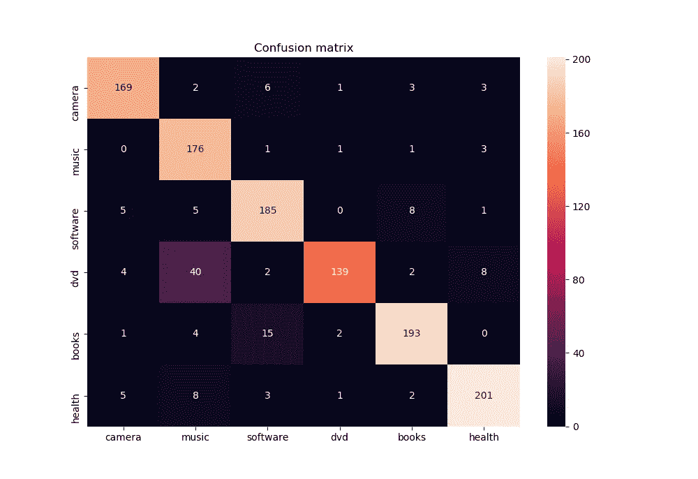

# scikit-learn 中完整的 NLP 分类管道

> 原文：<https://towardsdatascience.com/a-complete-nlp-classification-pipeline-in-scikit-learn-bf1f2d5cdc0d?source=collection_archive---------15----------------------->



六路分类的混淆矩阵(TF-IDF 与朴素贝叶斯分类器)

## 使用这个自然语言处理分类管道的完整指南，从语料库到分类。

我们将在这个故事中讲述的内容:

*   阅读文集
*   基本脚本结构包括`logging`、`argparse`和`ifmain`。
*   训练/测试分割
*   先验和后验类概率
*   基线分类
*   用`FeatureUnion`链接多个特征
*   在一只熊猫`DataFrame`和一个困惑矩阵中显示结果

这个故事最重要的部分是 scikit-learn/sklearn 的`Pipeline`、`FeatureUnion`、`TfidfVectorizer`和一个使用`seaborn`包的`confusion_matrix` 的可视化，但也包括更多的一般内容，如`ifmain`、`argparse`、`logging`、`zip`和`*args`。

## 资料组

我们将使用亚马逊评论的数据集和简单而有效的朴素贝叶斯进行分类。`trainset.txt`包含取自[约翰霍普金斯大学多领域情感数据集](https://www.kaggle.com/jeromeblanchet/multidomain-sentiment-analysis-dataset)的评论集，并在空格分隔的`.csv`文件中转换为以下格式。

```
music neg 575.txt the cd came as promised and in the condition promised . i 'm very satisfied
```

正如你所看到的，评论已经用来自`nltk`包的空白标记符进行了标记。每个评论占一行，前面有两个标签和评论的标识符:

*   指定六个主题之一的标签:`books`、`camera`、`dvd`、`health`、`music`、`software`。
*   用正值或负值表示评论所表达的情绪的标签:`pos`、`neg`。

该数据集使我们能够对评论的情感进行二元分类或多类分类，并以这样一种方式创建我们的脚本，即用户可以指定要处理的分类任务。

## 脚本结构:导入、日志和 argparse

我们正在使用`argparse`和函数标志(如`use_sentiment`)设置我们的管道，以便我们能够从命令行执行二进制(`pos` | `neg`)分类任务和多类分类任务(`book` | `camera` | `dvd` | `health` | `music` | `software`)。

对于那些不熟悉的人来说，`argparse`是一个非常有用的包，它支持用户友好的命令行界面。如果缺少必需的参数，它会显示一个错误，并显示所有可以使用的不同参数。参数前面有参数标签`--input`和一个空格:

`$ python3 pipeline.py --input trainset.txt --binary`。


我们还添加了一个`verbosity`标志`--v`，并使用 Python 的`logging`功能来输出警告、错误或信息。用`args = parser.parse_args()`解析完参数后，你可以在脚本中用`args.input`和`args.verbosity`使用这些参数的输入。

**注意** `argparse`没有`type=bool`，这意味着所有 get 都被解析为`str`。为了添加布尔标志，可以设置`action="store_true"`，默认为`False`布尔，如果包含标志`--binary`，将自动产生`True`布尔。

我们将把这个故事中的所有函数链接到一个`main()`函数中，这个函数将被`if __name__ == '__main__'`语句自动调用。在命令行中调用这个文件时，Python 解释器读取源文件，并将`__name__`变量设置为`'__main__'`。这样，我们可以读取源文件并执行其中的函数，但也可以将该文件用作其他脚本的`module`到`import` ，而无需自动执行`main()`中的语句。

## 阅读语料库

首先我们需要阅读我们的文集。这个函数将利用来自我们的`argparse`函数的`--binary`标志来确定我们是在做二元分类还是多类分类。

## **训练/测试分割**

现在我们在`documents`有了我们的评论，在`labels`有了我们的类，我们将把它们分成训练集和测试集，用于我们的分类器。我们将使用`slice notation [:]`进行 80%的培训和 20%的测试。首先，我们需要调整我们的数据，以确保这一部分不会影响结果:由于我们不知道语料库中的文档是如何排序的，因此在训练/测试集中，类可能会过多。例如，它们可以按字母顺序排序，这可能导致在我们的训练集中只有类别`book` | `camera` | `dvd` | `health`。

因为我们正在创建一个这样的元组列表`[(doc1, 'neg'), (doc2, 'pos')]`，所以我们可以使用一个简洁的 python 函数`zip`和`*`来遍历这个列表，并将元组分隔在一个文档列表`[doc1, doc2, doc3]`和一个标签列表`['pos', 'neg', 'pos']`中。

**注**:虽然这个函数看起来有点冗长，但我还是把它包括在内了，因为这样可以很好地看到这个函数背后发生了什么。您也可以使用 sklearn 的`train_test_split`函数，它的功能基本相同，或者使用`k-fold cross-validation`:在训练和测试中分割数据集`k`次，并取每个分类的平均值，以确保分割对分数的影响尽可能小。

## 先验和后验类概率

对于手头的分类任务，我们将使用朴素贝叶斯分类器，它利用了[贝叶斯定理](https://en.wikipedia.org/wiki/Bayes%27_theorem):计算结合了分类器中包括的特征(如 tf-idf 或 counts)的类的新概率分布，这将使新的概率分布更能代表数据。

为了理解后验概率，将它们与先验分布进行比较是有用的。因此，我们将首先计算我们的语料库中所有文档的类别的先验概率，或者反过来:我们的语料库中的一个文档具有某个类别的概率。后验概率可以用`classifier.predict_proba`来计算。

## 基线分类

为了比较评估度量(准确性)和朴素贝叶斯分类器的混淆矩阵，我们将创建一个非常简单的基线:使用`random`包，我们将从一组可能的标签中为每个文档随机分配一个标签。我们还可以创建一个基线，将每个类别的先验概率考虑在内。

## 具有 FeatureUnion 的多个功能

对于此分类任务，我们将添加分类器中包含的三个功能:

1.  计数向量器，在每个标记后附加位置标签
2.  TF-IDF 矢量器(在文档频率中使用非常强大的[术语频率)](http://www.tfidf.com/)
3.  特征工程的一个例子，特征长度包含在管道中，特征值映射到`DictVectorizer`中的向量。

现在这段代码有点复杂，但它只是一个示例，说明了如何在一个 FeatureUnion 管道中追加多个功能，甚至包括(. 3)中的管道。

我在函数`feature_union()`中为每个特性添加了一个标志，这样你就可以相应地打开和关闭特性。

## 显示结果

现在我们也要展示我们的成果。我们可以使用 sklearn 的`classification_report`、`accuracy_score`和`confusion_matrix`以及最后一个的`seaborn`包。

`tabular_results()`用标记化的句子、实际标签、预测标签和先验/后验概率创建熊猫数据帧。`class_report()`显示分类器的准确度分数，并有一个标志`show_matrix`，用于使用`vis()`功能显示混淆矩阵的美丽可视化。

## 把管道拼起来！

我们阅读我们的语料库>分割训练/测试中的数据>计算先验概率>创建我们三个特征的特征联合>使分类器适合数据>进行预测>计算后验概率>创建数据帧>报告基线结果>报告朴素贝叶斯的结果。

对于我们的六类分类，基线的准确度分数保持在大约`0.16/0.17`左右，对于我们的二类分类，准确度分数保持在大约`0.5`左右，这是合乎逻辑的，因为它是类的概率/数量。对于所有三个特征的组合，朴素贝叶斯准确度得分为`0.685`，仅使用 tf-idf 向量时得分最高`0.901`。这表明特征工程并不总是产生更好的结果！

完整的脚本和数据集可以在[这里](https://github.com/LouisdeBruijn/Medium/tree/master/NLP%20pipeline)找到。记住，您可以使用`--v`将二进制分类的`--binary`标志和详细度标志设置为不同的级别(`4`用于调试)，以查看分类器的`classification_report`。此外，`feature_union()`具有开启/关闭不同功能的标志，`class_report()`具有显示混淆矩阵的标志。