# 完整的熊猫指南

> 原文：<https://towardsdatascience.com/a-complete-pandas-guide-2dc53c77a002?source=collection_archive---------12----------------------->

## 构建强大的数据分析流程

数据科学项目中最耗时的部分是数据清理和准备。Pandas 是一个非常强大和通用的 Python 数据分析库，可以加速项目的预处理步骤。在这篇文章中，我将通过许多例子来介绍 Pandas 的许多功能，这些例子可以帮助您构建一个健壮而高效的数据分析过程。


在 [Unsplash](https://unsplash.com/s/photos/complete-guide?utm_source=unsplash&utm_medium=referral&utm_content=creditCopyText) 上由 [threeedil](https://unsplash.com/@threeedil?utm_source=unsplash&utm_medium=referral&utm_content=creditCopyText) 拍摄的照片

这些主题按如下顺序排列:

1.  **输入数据**
2.  **数据概述**
3.  **处理缺失值**
4.  **组合数据帧**
5.  **选择数据帧上的数据**
6.  **重塑数据帧**
7.  **其他熊猫功能**

> Pandas 的基本数据结构是 **DataFrame** ，它以表格的形式表示数据，带有标记的行和列。

一如既往，我们从进口熊猫开始。

```
import numpy as np
import pandas as pd
```

# **1。输入数据**

**从文件中读取**

在大多数情况下，我们从文件中读取数据并转换成数据帧。Pandas 提供了从许多不同的文件类型中读取数据的功能。最常用的是 **read_csv** 。其他类型也有，比如 read_excel，read_json，read_html 等等。让我们来看一个使用 **read_csv** 的例子:

```
df = pd.read_csv("Churn_Modelling.csv")
df.head()
```

我们需要指定文件的位置。在文件位于同一个工作目录或文件夹中时，你可以只写文件名。df.head()显示前 5 行。

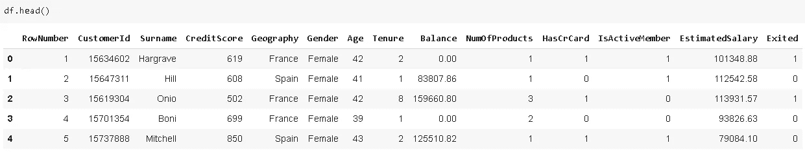

如果我们只需要数据帧的一部分，而不想读取全部，我们可以用 **usecols** 参数指定列:

```
cols = ['CustomerId','CreditScore','NumOfProducts']
df = pd.read_csv("Churn_Modelling.csv", usecols=cols)
df.head()
```

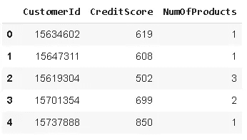

我们还可以使用 **nrows** 参数选择要读取多少行。这在处理非常大的文件时非常有用:

```
df.shape
(10000, 3)df = pd.read_csv("Churn_Modelling.csv", usecols=cols, nrows=500)
df.shape
(500, 3)
```

原始数据帧有 10000 行，通过将 nrows 设置为 500，我们只读取前 500 行。

[read_csv](https://pandas.pydata.org/pandas-docs/stable/reference/api/pandas.read_csv.html) 函数还有许多其他参数，这使它变得强大而方便。

**创建数据帧**

在现实生活中，我们通常从文件中读取数据，而不是创建数据帧。Pandas 提供了[函数](https://pandas.pydata.org/pandas-docs/stable/user_guide/io.html)来通过从各种文件类型中读取数据来创建数据帧。在这篇文章中，我将使用字典来创建一个示例数据帧。

```
df = pd.DataFrame({'a':np.random.rand(10),
                 'b':np.random.randint(10, size=10),
                 'c':[True,True,True,False,False,np.nan,np.nan,
                      False,True,True],
                 'b':['London','Paris','New York','Istanbul',
                      'Liverpool','Berlin',np.nan,'Madrid',
                      'Rome',np.nan],
                 'd':[3,4,5,1,5,2,2,np.nan,np.nan,0],
                 'e':[1,4,5,3,3,3,3,8,8,4]})
df
```

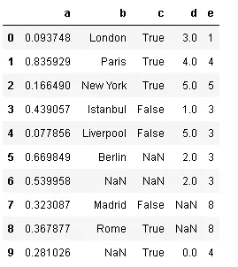

# **2。数据概述**


照片由[马库斯·温克勒](https://unsplash.com/@markuswinkler?utm_source=unsplash&utm_medium=referral&utm_content=creditCopyText)在 [Unsplash](https://unsplash.com/s/photos/complete-guide?utm_source=unsplash&utm_medium=referral&utm_content=creditCopyText) 上拍摄

Pandas **describe** 函数为数值(int 或 float)列提供汇总统计。它计算值的数量，并显示平均值、标准差、最小值和最大值以及 25%、50%和 75%的分位数。


```
df.describe()
```

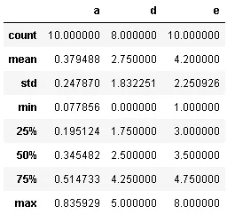

虽然所有的列都有相同的行数，但是 d 列的计数不同，因为 describe 函数不计算 NaN(缺失)值。

**value_counts()** 以出现次数显示列中的值:

```
df.c.value_counts()
True     5
False    3
Name: c, dtype: int64
```

value_counts()不计算 NaN(缺失)值。

我们还应该检查数据类型，并在我们的分析中考虑它们。有些功能只能在某些数据类型上执行。我们可以使用 **dtypes** 轻松检查数据类型:

```
df.dtypes
a    float64
b     object
c     object
d    float64
e      int64
dtype: object
```

“d”和“e”列都有整数，但“d”列的数据类型是 float。原因是列 d 中的 NaN 值。NaN 值被认为是浮点型的，因此该列中的整数值被向上转换为浮点数据类型。

Pandas 1.0.1 允许使用 NaN 作为整数数据类型。我们只需要显式地将 dtype 表示为 **pd。Int64Dtype():**

```
pd.Series([1, 2, 3, np.nan], dtype=pd.Int64Dtype())
0      1
1      2
2      3
3    NaN
dtype: Int64
```

如果 pd。不使用 Int64Dtype()，整数值被强制转换为浮点数:

```
pd.Series([1, 2, 3, np.nan])
0    1.0
1    2.0
2    3.0
3    NaN
dtype: float64
```

# **3。处理缺失值**


照片由[法鲁尔·阿兹米](https://unsplash.com/@fahrulazmi?utm_source=unsplash&utm_medium=referral&utm_content=creditCopyText)在 [Unsplash](https://unsplash.com/s/photos/select?utm_source=unsplash&utm_medium=referral&utm_content=creditCopyText) 拍摄

处理缺失值是数据清理和准备过程中必不可少的一部分，因为现实生活中几乎所有的数据都带有一些缺失值。

让我们先创建一个缺少值的数据帧。

```
df = pd.DataFrame({
'column_a':[1, 2, 4, 4, np.nan, np.nan, 6],     
'column_b':[1.2, 1.4, np.nan, 6.2 ,None, 1.1, 4.3],
'column_c':['a', '?', 'c', 'd', '--', np.nan, 'd'],
'column_d':[True, True, np.nan, None, False, True, False]
})df
```

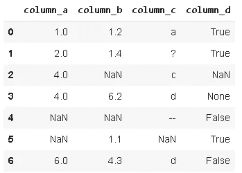

np.nan、None 和 NaT(对于 datetime64[ns]类型)是熊猫的标准缺失值。

> **注意:**Pandas 1.0 中引入的一种新的缺失数据类型(< NA >)，它是一种整数类型的缺失值表示。

np.nan 是一个浮点数，所以如果你在一列整数中使用它们，它们将被转换成浮点数据类型，正如你在我们创建的数据帧的“column_a”中看到的。但是，<na>可以和整数一起使用，不会导致向上转换。让我们使用<na>向 dataframe 再添加一列，可以通过显式请求 dtype Int64Dtype()来使用它。</na></na>

```
new_column = pd.Series([1, 2, np.nan, 4, np.nan, 5], dtype=pd.Int64Dtype())df['column_e'] = new_column
df
```

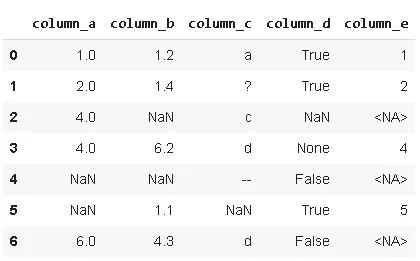

熊猫提供了 **isnull()** 、 **isna()** 函数来检测缺失值。他们俩做着同样的事情。

**df.isna()** 返回带有布尔值的 dataframe，该值表示缺少的值。

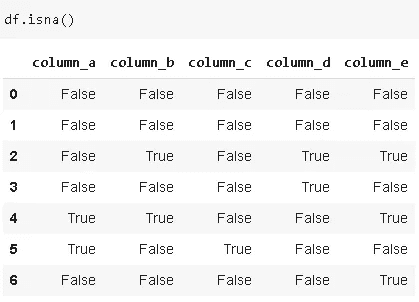

也可以选择使用与 isna()正好相反的 **notna()** 。

**df.isna()。any()** 为每一列返回一个布尔值。如果该列中至少有一个值缺失，则结果为真。

**df.isna()。sum()** 返回每列中缺失值的数量。

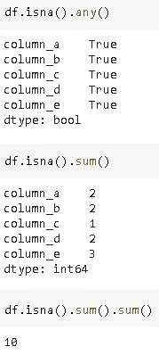

并非所有缺失的值都是简洁明了的 np.nan 或 None 格式。比如，“？”数据帧 c 列中的“---”字符没有给我们任何有价值的信息或见解，因此本质上它们是缺失值。但是，这些字符无法被熊猫检测为缺失值。

如果我们知道哪种字符用作数据集中的缺失值，我们可以在使用 **na_values** 参数创建数据帧时处理它们:

```
missing_values = ['?', '--']
df_test = pd.read_csv('filepath.csv', na_values = missing_values)
```

另一种选择是在创建数据帧后使用 pandas **replace()** 函数来处理这些值:

```
df.replace(['?','--'],np.nan, inplace=True)
df
```

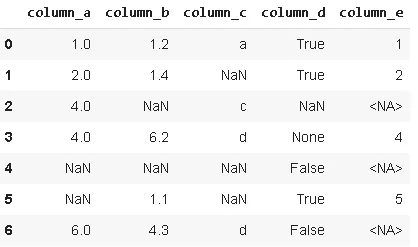

我们已经用 NaN 值替换了非信息单元格。**就地**参数保存数据帧中的变化。inplace 的默认值为 False，因此如果将其设置为 True，将不会保存更改。

没有处理缺失值的最佳方法。根据数据集和任务的特征，我们可以选择:

*   删除缺少的值
*   替换丢失的值

**丢弃缺失值**

我们可以使用 **dropna()** 函数删除缺少值的行或列。**如何使用**参数将条件设置为下降。

*   how='any ':如果有任何缺少的值，则删除
*   how='all ':如果所有值都丢失，则删除

此外，使用 **thresh** 参数，我们可以为丢失的值设置一个阈值，以便删除一行/一列。

```
df.dropna(axis=0, how='all', inplace=True)
df
```

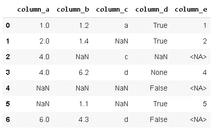

**轴**参数用于选择行(0)或列(1)。

我们的 dataframe 没有一行充满缺失值，因此设置 how='all '不会删除任何行。缺省值是' any '，所以如果我们想使用 how='any '，就不需要指定它:

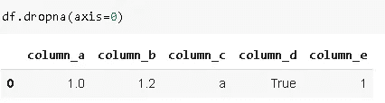

> **注意:** **原位**参数用于保存对原始数据帧的更改。默认值为 false，因此如果我们不将其设置为 True，我们所做的更改将不会保存在原始数据帧中。

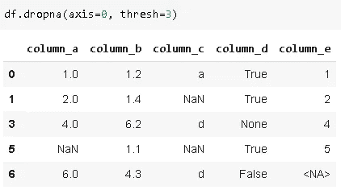

将 thresh 参数设置为至少缺少 3 个值的 3 个丢弃行。

数据是宝贵的资产，所以我们不应该轻易放弃它。此外，机器学习模型几乎总是倾向于在更多数据的情况下表现更好。因此，根据具体情况，我们可能更喜欢替换丢失的值，而不是丢弃。

**替换缺失值**

**fillna()** 熊猫函数方便处理缺失值。使用 fillna()，缺失值可以由特殊值或聚合值(如平均值、中值)替换。此外，缺失的值可以用它之前或之后的值替换，这对时间序列数据集非常有用。

*   用标量替换丢失的值:

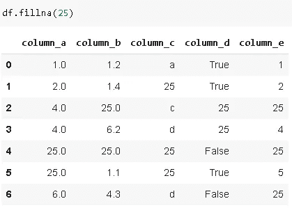

*   fillna()也可以用于特定的列:

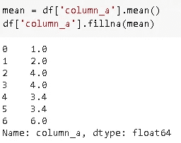

*   使用**方法**参数，缺失的值可以用它们之前或之后的值替换。

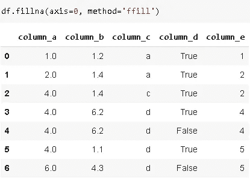

**ffill** 代表“向前填充”用前一行中的值替换缺失的值。您也可以选择 **bfill** 代表“反向填充”。

如果一列或一行中有许多连续的缺失值，您可能希望**限制**向前或向后填充的缺失值的数量。

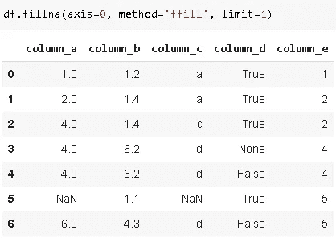

极限参数设置为 1，因此只有一个缺失值被向前填充。

# **4。组合数据帧**


Denys Nevozhai 在 [Unsplash](https://unsplash.com/s/photos/look-for?utm_source=unsplash&utm_medium=referral&utm_content=creditCopyText) 拍摄的照片

数据科学项目通常需要我们从不同的来源收集数据。因此，作为数据准备的一部分，我们可能需要组合数据框架。在这一部分，我将讨论以下主题:

*   串联
*   合并

# **串联**

让我们首先创建两个数据帧:

```
df1 = pd.DataFrame({
'column_a':[1,2,3,4],
'column_b':['a','b','c','d'],
'column_c':[True,True,False,True]
})df2 = pd.DataFrame({
'column_a':[1,2,9,10],
'column_b':['a','k','l','m'],
'column_c':[False,False,False,True]
})
```

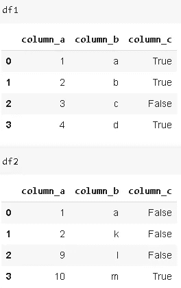

组合或连接数据帧的一种方法是 **concat()** 函数。通过改变**轴**参数，它可用于沿行或列连接数据帧。axis 参数的默认值为 0，表示沿行组合。

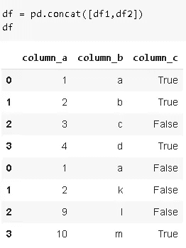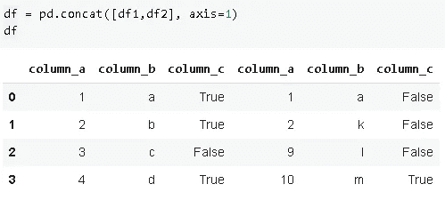

正如您在上面的第一张图中所看到的，保留了各个数据帧的索引。为了改变它并重新索引组合数据帧， **ignore_index** 参数设置为真。

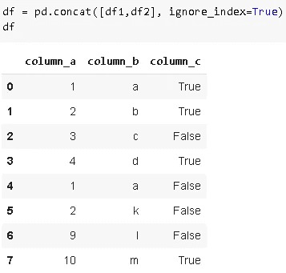

concat()函数的 **join** 参数决定了如何组合数据帧。默认值为“outer ”,返回两个数据帧中的所有索引。如果选择了' inner '选项，则只返回具有共享索引的行。我将改变 df2 的索引，以便您可以看到“内部”和“外部”的区别。

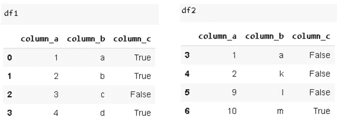

```
df = pd.concat([df1,df2], axis=1, join='inner')
df
```

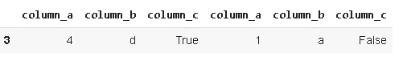

```
df = pd.concat([df1,df2], axis=1, join='outer')
df
```

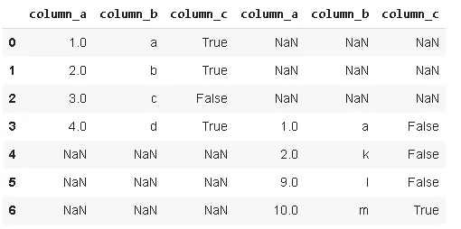

Pandas 还提供了标记数据帧的方法，以便我们知道哪个部分来自哪个数据帧。我们只是使用**键**参数按顺序传递组合数据帧列表。

```
df = pd.concat([df1, df2], keys=['df1', 'df2'])
df
```

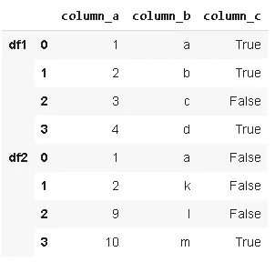

它还使得方便地访问数据帧的不同部分变得更加容易:

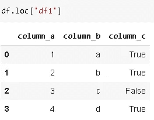

> 关于 concat()函数的一个重要注意事项是，它制作了数据的副本。为了防止进行不必要的复印，需要将**复印**参数设置为假。默认值为 True。

**append()** 函数也用于组合数据帧。它可以被看作是 concat()函数的一个特例(axis=0，join='outer ')，所以我不会详细讨论它，而只是给出一个例子来展示语法。

```
df = df1.append(df2)
df
```

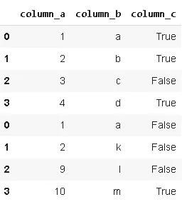

# **合并**

组合数据帧的另一个广泛使用的函数是 **merge()** 。Concat()函数只是将数据帧一个接一个地相加或并排相加。它更像是附加数据帧。Merge()根据共享列中的值组合数据帧。与 concat()函数相比，Merge()函数提供了更多的灵活性。看到例子就清楚了。

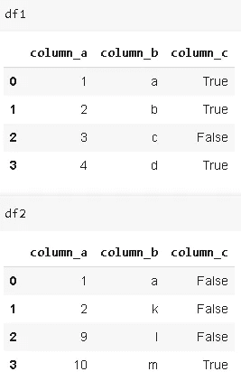

参数上的**选择用于合并的列或索引级别。**

```
df_merge = pd.merge(df1, df2, on='column_a')
df_merge
```

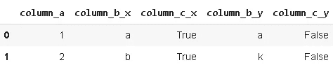

列名不必相同。我们关注的是列中的值。假设两个数据帧在一个列中有共同的值，您希望使用该列来合并这些数据帧，但是列名不同。在这种情况下，可以使用 **left_on** 和 **right_on** 参数代替 **on** 参数。为了显示差异，我将在 df2 中更改列名，然后使用 merge:

```
df2.rename(columns={'column_a':'new_column_a'}, inplace=True)
df2
```


```
df_merge = pd.merge(df1, df2, left_on='column_a', right_on='new_column_a')df_merge
```


尽管 column_a 和 new_column_a 中的返回值是相同的，但由于具有不同的名称，合并的数据帧包括这两个列。

您也可以将多个值传递给参数上的**。返回的数据帧仅包括在所有传递给**参数上的**的列中具有相同值的行。**

```
df2.rename(columns={'new_column_a':'column_a'}, inplace=True)df_merge = pd.merge(df1, df2, on=['column_a','column_b'])
df_merge
```

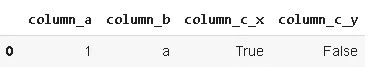

df1 和 df2 是根据 column_a 中的公共值合并的，是时候介绍一下**how**merge()的参数了。顾名思义，表示你想怎么组合。how 的可能值为“内部”、“外部”、“左侧”、“右侧”。

*   inner:只有在参数**指定的列中有相同值的行( **how** 参数的默认值)**
*   外部:所有行
*   左侧:左侧数据帧中的所有行
*   右侧:右侧数据帧中的所有行

“如何”的概念在下图中更加清晰。如果您熟悉 SQL，其逻辑与 SQL 连接相同。

下面的数字更清楚地代表了参数的概念。


outer '，' left '和' right '选项包括不在其中一个数据帧中的数据。缺少的部分自动用 **NaN** 值填充。NaN 是熊猫缺失价值观的典型代表。

how 的默认值是“inner ”,因此您不必在函数中显式编写。“Inner”只返回 column_a 中具有公共值的行。

当 how 参数选择' outer '时，合并的数据帧包括两个数据帧中 column_a 的所有值。但是，公共值(column_a = 1 和 column_a = 2)不会重复。

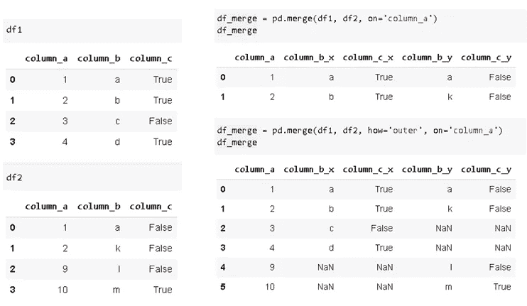

当 how 参数选择' left '时，合并数据帧包括左侧数据帧中所有行。如果 column_a(传递给 on 参数的列)中的值不在右数据帧中，则右数据帧中的列将填充 NaN 值。很少使用“right”选项，因为您只能在 merge 函数中更改数据帧的顺序(而不是(df1，df2)使用(df2，df1))。

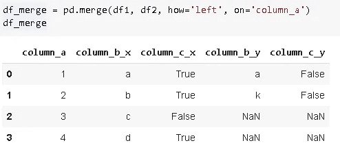

您可能已经注意到，两个数据帧中相同的列名会添加一个后缀。区分哪一列来自哪一个数据帧是很有用的。您可以使用**后缀**参数指定要添加的后缀。

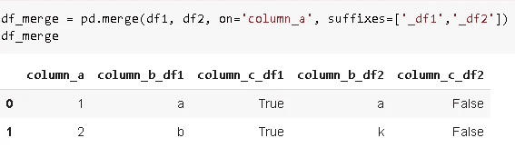

# **5。选择数据帧上的数据**


照片由 [Bodie Pyndus](https://unsplash.com/@bpyndus?utm_source=unsplash&utm_medium=referral&utm_content=creditCopyText) 在 [Unsplash](https://unsplash.com/s/photos/select?utm_source=unsplash&utm_medium=referral&utm_content=creditCopyText) 上拍摄

**iloc** 和 **loc** 允许选择数据帧的一部分。

*   iloc:按职位选择
*   loc:按标签选择

让我们来看一些例子，因为一如既往，熟能生巧。在本节的示例中，我将使用以下数据帧:

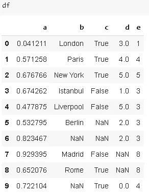

# **iloc**

选择第二行:

```
df.iloc[1] 
a    0.571258
b       Paris
c        True
d           4
e           4
Name: 1, dtype: object
```

选择第一行，第二列(即第一行中的第二个值):

```
df.iloc[0,1] 
'London'
```

所有行，第三列(与选择第二列相同，但我只想展示':'的用法):

```
df.iloc[:,2]
0     True
1     True
2     True
3    False
4    False
5     True
7    False
8     True
9     True
Name: c, dtype: bool
```

前两行，第二列:

```
df.iloc[:2,1]
0    London
1     Paris
Name: b, dtype: object
```

# **loc**

最多 2 行，列“b”:

```
df.loc[:2,'b']
0      London
1       Paris
2    New York
Name: b, dtype: object
```

最多 2 行和最多“b”列:

```
df.loc[:2, :'b']
```


第“2”行和第“b”列:

```
df.loc[2, :'b']
a     0.16649
b    New York
Name: 2, dtype: object
```

> 您可能想知道为什么我们在 loc 和 iloc 中对行使用相同的值。原因是数字指数。Loc 按位置选择，但行的位置与索引相同。

让我们创建一个带有非数字索引的新数据帧，这样我们就可以看到不同之处:

```
index = ['aa','bb','cc','dd','ee']
df2 = pd.DataFrame({'a':np.random.rand(5),
                 'b':np.random.randint(10, size=5)},
                   index = index)
df2
```

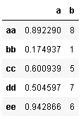

```
df2.loc['bb','b']
1df2.loc[:'cc','a']
aa    0.892290
bb    0.174937
cc    0.600939
Name: a, dtype: float64
```

# **6。重塑数据帧**

有多种方法可以重塑数据帧。我们可以选择最适合手头任务的一个。重塑数据帧的函数:

*   **融化**
*   **堆叠和拆分**

# 熔化

Melt 用于将宽数据帧转换为窄数据帧。我所说的宽是指具有大量列的数据帧。一些数据帧的结构是连续的测量值或变量用列来表示。在某些情况下，将这些列表示为行可能更适合我们的任务。

考虑以下数据帧:

```
df1 = pd.DataFrame({'city':['A','B','C'],
                   'day1':[22,25,28],
                   'day2':[10,14,13],
                   'day3':[25,22,26],
                   'day4':[18,15,17],
                   'day5':[12,14,18]})
```


我们有三个不同的城市，在不同的日子进行测量。我们决定用一列中的行来表示这些日子。还会有一列显示测量结果。我们可以通过使用**融化**功能轻松实现这一点:

```
df1.melt(id_vars=['city'])
```


默认情况下，变量和值列的名称是给定的。我们可以使用 melt 函数的参数 **var_name** 和 **value_name** 来指定新的列名。如果我们按城市列对数据进行排序，效果会更好:

```
df1.melt(id_vars=['city'], var_name = 'date', value_name = 'temperature').sort_values(by='city').reset_index(drop=True)
```


# 堆叠和取消堆叠

堆栈函数增加了数据帧的索引级别。我所说的提高水平是指:

*   如果 dataframe 有一个简单的列索引，stack 返回一个系列，其索引由原始 dataframe 的行列对组成。
*   如果数据帧有多级索引，stack 增加索引级别。

用例子解释更好。考虑以下数据帧:

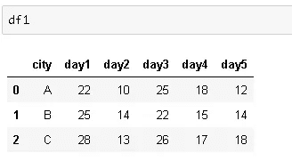

df1 有 3 行 6 列，具有简单的整数列索引。如果将 stack 函数应用于 df1，它将返回 3 x 6 = 18 行的序列。序列的索引将是[(0，'城市')，(0，'第 1 天')，…，(2，'第 5 天')]。


让我们也检查一下形状和指数:

```
df1.shape
(3,6)
df1.stack().shape
(18,)
df1.stack().index[0] #multilevel index
(0, 'city')
```

栈和非栈功能更常用于具有多级索引的数据帧。让我们创建一个具有多级索引的数据框架:

```
tuples = [('A',1),('A',2),('A',3),('B',1),('A',2)]index = pd.MultiIndex.from_tuples(tuples, names=['first','second'])df2 = pd.DataFrame(np.random.randint(10, size=(5,2)), 
                   index=index, columns=['column_x', 'column_y'])
```


如果我们对该数据帧应用堆栈功能，索引级别将会增加:

```
df_stacked = df2.stack().to_frame()
df_stacked
```


现在，列名(column_x 和 column_y)是多级索引的一部分。因此得到的数据帧有一列和一个 3 级多索引。

```
len(df_stacked.index.levels)
3len(df2.index.levels)
2
```

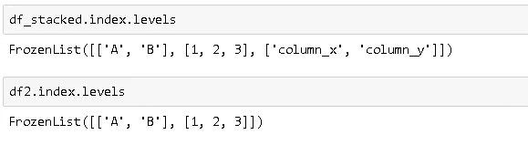

**拆堆**与**堆堆**正好相反。如果我们对堆叠的数据帧应用拆分，我们将得到原始的数据帧:

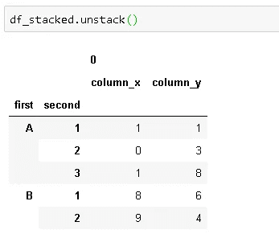

```
df_stacked.unstack().index
MultiIndex(levels=[['A', 'B'], [1, 2, 3]],
           codes=[[0, 0, 0, 1, 1], [0, 1, 2, 0, 1]],
           names=['first', 'second'])df2.index
MultiIndex(levels=[['A', 'B'], [1, 2, 3]],
           codes=[[0, 0, 0, 1, 1], [0, 1, 2, 0, 1]],
           names=['first', 'second'])
```


# 7.熊猫的其他功能

本部分涵盖的功能:

*   激增
*   努尼克岛
*   检查
*   在哪里
*   推断对象


安德烈·费塔多在 [Unsplash](https://unsplash.com/s/photos/select?utm_source=unsplash&utm_medium=referral&utm_content=creditCopyText) 上拍摄的照片

# 激增

假设您的数据集在单个观测值(行)中包含一个要素的多个条目，但您希望在单独的行中对它们进行分析。

```
df = pd.DataFrame({'ID':['a','b','c'],
                  'measurement':[4,6,[2,3,8]],
                  'day':1})
df
```

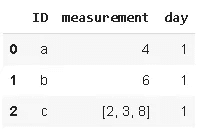

我们希望在单独的行上看到第“1”天“c”的测量值，使用 **explode** 很容易做到这一点:

```
df.explode('measurement').reset_index(drop=True)
```


最好也重置索引:

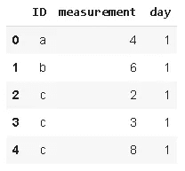

我们也可以在两列上使用爆炸作为一个链:

```
df2 = pd.DataFrame({'ID':['a','b','c'],
                   'measurement_1':[4,6,[2,3,8]],
                   'measurement_2':[1,[7,9],1],
                   'day':1})
df2
```


```
df2.explode('measurement_1').reset_index(drop=True).explode('measurement_2').reset_index(drop=True)
```

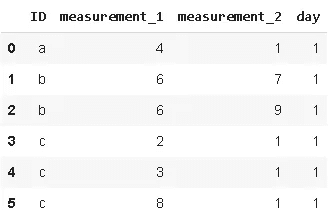

确保在第一次分解后使用 reset_index，否则会得到如下意外结果:

```
df2.explode('measurement_1').explode('measurement_2').reset_index(drop=True)
```


# 努尼克岛

Nunique 计算列或行中唯一条目的数量。它在分类特征中非常有用，尤其是在我们事先不知道类别数量的情况下。


由[凯尔·格伦](https://unsplash.com/@kylejglenn?utm_source=unsplash&utm_medium=referral&utm_content=creditCopyText)在 [Unsplash](https://unsplash.com/s/photos/unique?utm_source=unsplash&utm_medium=referral&utm_content=creditCopyText) 上拍摄

假设我们有以下数据帧:


要查找列中唯一值的数量:

```
df.name.nunique()
5
```

我们可以用稍微复杂一点的语法使用 **value_counts** 获得相同的结果:

```
df.name.value_counts().shape[0]
5
```

然而， **nunique** 允许我们同时对所有的列或行执行这个操作:

```
df.nunique()  #columns
ID              8 
name            5 
measurement1    7 
measurement2    5 
measurement3    6dtype: int64df.nunique(axis=1) #rows
0    3 
1    4 
2    4 
3    5 
4    5 
5    3 
6    4 
7    4 
dtype: int64
```

# 检查

它可用于根据其他行、列对上的值在数据帧中查找值。这个函数最好通过一个例子来解释。假设我们有以下数据帧:


对于每一天，我们有 4 个人的测量值和一个包含这 4 个人的名字的列。我们希望创建一个新列，在“选择”列中显示该人的测量值:

```
df['Person_point'] = df.lookup(df.index, df['Person'])
df
```

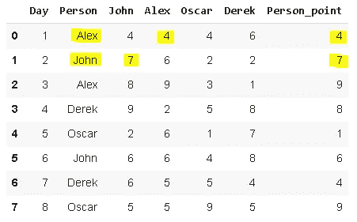

我们不必对所有数据点都进行这种操作。只要行标签和列标签具有相同的大小，我们就可以使用特定的范围:

```
df.lookup(df.index[:5], df['Person'][:5])
array([4, 7, 9, 8, 1])
```

# 在哪里

“Where”用于根据条件替换行或列中的值。您还可以指定要替换的值。默认值为 NaN。让我们复习一个例子，这样就清楚了。


```
df['Person_point'].where(df['Person_point'] > 5)0    NaN 
1    7.0 
2    9.0 
3    8.0 
4    NaN 
5    6.0 
6    NaN 
7    9.0 
Name: Person_point, dtype: float64
```

我们可以指定替换值:

```
df['Person_point'].where(df['Person_point'] > 5, 'Not_qualified', inplace=True)df
```


# 推断对象

Pandas 支持广泛的数据类型，其中之一是**对象**。对象包含文本或混合(数字和非数字)值。但是，如果有不同的选项可用，则不建议使用对象数据类型。使用更具体的数据类型可以更快地执行某些操作。例如，我们更喜欢用整数或浮点数据类型来表示数值。

**infer_objects** 尝试为对象列推断更好的数据类型。我们来看一个例子。

```
df = pd.DataFrame({'A': ['a', 1, 2, 3],
                   'B':['b',2.1,1.5,2],
                   'C':['c',True,False,False],
                   'D':['a','b','c','d']})
df
```

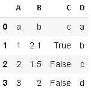

```
df = df[1:]df.dtypes
A    object 
B    object 
C    object 
D    object 
dtype: object
```

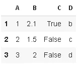

```
df.infer_objects().dtypesdf.dtypes
A      int64 
B    float64 
C       bool 
D     object 
dtype: object
```

感谢您的阅读。如果您有任何反馈，请告诉我。