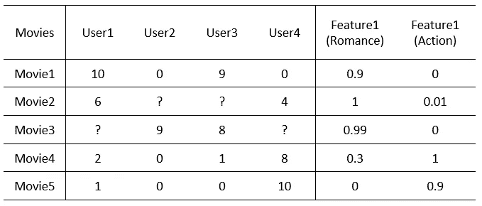
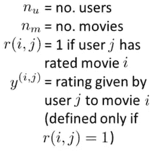
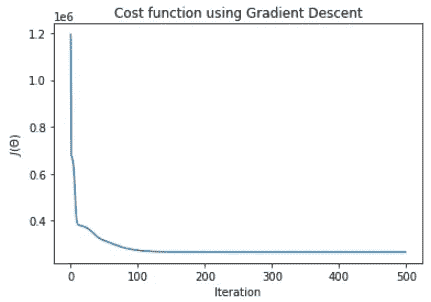

# 一个完整的推荐系统从零开始:一步一步

> 原文：<https://towardsdatascience.com/a-complete-recommender-system-from-scratch-in-python-step-by-step-6fc17a4da054?source=collection_archive---------23----------------------->


卡米洛·希门尼斯在 [Unsplash](https://unsplash.com?utm_source=medium&utm_medium=referral) 上拍摄的照片

## [入门](https://towardsdatascience.com/tagged/getting-started)

## 基于用户评分的线性回归电影推荐系统

如今，我们到处都能看到推荐系统。当你在亚马逊、易贝或任何其他地方的在线市场买东西时，他们会推荐类似的产品。在网飞或 youtube 上，你会在你的主页上看到与你之前的活动或搜索相似的建议。他们是如何做到的？他们都遵循这个想法。也就是说，他们从您以前的活动中获取数据，并进行相似性分析。基于这种分析，他们会推荐更多你可能喜欢的产品、视频或电影。

## 概观

在本文中，我将解释一个使用相同思想的推荐系统。以下是将在此涉及的主题列表:

1.  推荐系统的思想和公式。
2.  从头开始开发推荐系统算法
3.  用那个算法给我推荐电影。

我将使用 Python 的一些库，如 Numpy、Pandas 和 Matplotlib，以提高计算效率和速度。尽管我们的数据集并不太大。但是我们想开发一些适用于更大数据集的东西。我用的是 Jupyter 笔记本环境。随意使用你选择的任何其他笔记本。

## 这个推荐系统是如何工作的？

在这一节中，我将提供该过程的高级概述。如果你不能完全理解，请继续看下面的章节。因为在接下来的部分中，我将用 python 代码实现所有这些想法。这样，就更清楚了。

让我们开始吧。假设我们的数据集看起来像这样:



这里，我们有五部电影、四个用户和两个特性。每个用户都为每部电影提供了一些反馈或评级。当然，每个用户并没有看完所有的电影。因此，有时评级是不可用的。

最后我们有两个特点:浪漫和动作。他们让你知道这部电影有多浪漫或者有多刺激。此评级介于 0 和 1 之间。0 浪漫意味着没有浪漫，1 浪漫意味着充满浪漫。

这个算法将被开发成使用用户评分的推荐系统。

> 如果一个用户看了很多电影，并对它们进行了评级，这个算法将最适合这个用户。

但是，如果某个用户没有提供任何评级，他或她将获得基于其他用户评级的推荐。

> **丢失的电影评分怎么办？**

这是一个合理的问题。不是所有的用户都观看所有的电影，有时他们只是在观看后不对电影进行评级。所以，有很多缺失数据是正常的。在这种情况下，我们需要找到一种方法来填补那些缺失的数据。

线性回归法可以用来填补那些缺失的数据。提醒一下，下面是线性回归的公式:

Y = C + BX

我们在高中都学过这个直线方程。这里，Y 是因变量，B 是斜率，C 是截距。传统上，对于线性回归，相同的公式被写成:


这里，“h”是假设或预测值，X 是输入特征，θ0 和θ1 是系数。

如果您以前没有研究过线性回归，请先阅读这篇关于线性回归的文章:

[](/basic-linear-regression-algorithm-in-python-for-beginners-c519a808b5f8) [## Python 中的线性回归算法:一步一步

### 学习线性回归的概念，并使用 python 从头开始开发一个完整的线性回归算法

towardsdatascience.com](/basic-linear-regression-algorithm-in-python-for-beginners-c519a808b5f8) 

在这个推荐系统中，我们将使用同一部电影的其他评级作为输入 X，并预测缺失值。我们将避免偏差项θ0。


这里，θ1 在开始时随机初始化，并像线性回归算法一样通过迭代来细化。

> **如何细化 Theta1 的值？**

与线性回归一样，我们将使用已知值来训练算法。以一部电影的已知收视率为例。然后使用上面的公式预测那些已知的评级。预测评级值后，将其与原始评级进行比较，以找出误差项。这是一个等级的误差。


同样，我们需要找出所有评级的误差。在此之前，我想介绍一下我将在整个教程中使用的符号，



这是总成本函数的公式，它将指示预测评级和原始评级之间的距离。


该公式的第一项表示误差项的平方。我们用正方形来避免任何负值。使用 1/2 来优化平方，我们计算误差项，其中 r(i，j) = 1。因为 r(i，j) =1 意味着用户提供了评级。

上述等式的第二项是正则化项。调整任何过拟合或欠拟合问题是有用的。

> **总成本函数？**

如何知道一部电影是爱情片、喜剧片还是动作片？一直这样看完所有的电影，找出它的特点，真的会很费时间，很费钱。

所以，我们可以从用户的评分中得到启发。我们随机初始化θ值并通过迭代慢慢优化它的方式，我们可以对查找特征 x 做同样的事情。公式应该几乎类似于上面的成本函数。

在这两种情况下，都会有相同的误差项。我们可以添加θ和 x 的成本函数，如下所示:


> **梯度下降**

梯度下降在每次迭代中更新θ和 X。以下是梯度下降的公式:


在这个公式中，α是学习率。在每次迭代中，θ和 X 值将被更新，并最终变得稳定。

## 电影推荐算法的实现

我将使用 Coursera 中的 [Andrew Ngs 机器学习课程的数据集。他是把一个机器学习问题分解成碎片的最佳人选。请随意从该链接下载数据集并跟随:](https://www.coursera.org/learn/machine-learning/home)

[](https://github.com/rashida048/Recommender-System) [## rashida 048/推荐系统

### 此时您不能执行该操作。您已使用另一个标签页或窗口登录。您已在另一个选项卡中注销，或者…

github.com](https://github.com/rashida048/Recommender-System) 

> 唯一的办法就是按照这个代码，边读边跑，如果你读这个是为了学习的话。

> **第一步:**

导入必要的包和数据集。

```
import numpy as np
import pandas as pd
```

第一个数据集包含所有用户对所有电影的评级。

```
y = pd.read_excel('ex8_movies.xlsx', sheet_name = 'y', header=None)
y.head()
```


如果用户提供了评级，则下一个数据集包含 true，如果用户没有提供评级，则包含 False。

```
r = pd.read_excel('ex8_movies.xlsx', sheet_name='R', header=None)
r.head()
```


我们需要将这些布尔值转换成数值。我将用 1 代替 True，用 0 代替 False。

```
for i in range(len(r.columns)):
    r[i] = r[i].replace({True: 1, False: 0})
```


该数据集中有特征 X:

```
X = pd.read_excel('movie_params.xlsx', sheet_name='X', header=None)
X.head()
```


θ值存储在这里，

```
theta = pd.read_excel('movie_params.xlsx', sheet_name='theta', header=None)
theta.head()
```


让我们检查数据集的形状。

输入:

```
y.shape
```

输出:

```
(1682, 943)
```

这意味着我们有 1682 部电影和 943 个用户。

输入:

```
X.shape
```

输出:

```
(1682, 10)
```

正如你所记得的，X 包含了特性。该数据集中有 10 个要素。

输入:

```
theta.shape
```

输出:

```
(943, 10)
```

输入:

```
r.shape
```

输出:

```
(1682, 943)
```

这是这个算法需要的所有数据集。x 和θ可以随机初始化。我们将在最后看到它。现在，我们将使用这个 X 和θ。

现在，我们将开发所有必要的功能。

> **成本函数**

非常简单，我们将使用上面描述的总成本函数。它将 X，y，r，theta 和 Lambda 作为输入，并返回成本和梯度。

```
def costfunction(X, y, r, theta, Lambda):
    predictions = np.dot(X, theta.T)
    err = predictions-y
    J = 1/2 * np.sum((err**2) * r)
    reg_x = Lambda/2 * np.sum(np.sum(theta**2))
    reg_theta = Lambda/2 * np.sum(np.sum(X**2))
    grad = J + reg_x + reg_theta
    return J, grad
```

> **梯度下降**

在这个函数中，我们将使用上面讨论的梯度下降公式。它将 X，y，r，theta，Lambda，alpha 和迭代次数作为参数。我们将使用成本函数记录每次迭代的成本，并将返回更新后的 X、theta 和成本列表。

```
def gradientDescent(X, y, r, theta, Lambda, num_iter, alpha):
    J_hist = []
    for i in range(num_iter):
        cost, grad = costfunction(X, y, r, theta, Lambda)
        X = X -  alpha*(np.dot(np.dot(X, theta.T) - y, theta) + Lambda*X)
        theta = theta - alpha*(np.dot((np.dot(X, theta.T) - y).T, X) + Lambda*theta) 
        J_hist.append(cost)
    return X, theta, J_hist
```

> **正常化**

在此函数中，我们将对评级“y”进行标准化。首先，我们将计算每部电影的平均收视率。为此，我们将对每部电影的评分进行求和，然后除以该电影的“r”的总和。请记住，如果用户提供评级，则“r”数据集包含 1，如果用户未提供评级，则包含 0。

标准化 y 将是 y(如果用户提供了评级)减去平均值“y”的总和。

```
def normalizeRatings(y, r):
    ymean = np.sum(y, axis=1)/np.sum(r, axis=1)
    ynorm = np.sum(y, axis=1)*np.sum(r, axis=1) - ymean
    return ymean, ynorm
```

所有的功能都是为了执行建议而开发的。现在，让我们使用这些函数。

## 给我推荐电影

为了给我推荐电影，我需要提供一些动作的评分。

```
my_ratings = np.zeros((1682,1))my_ratings[5] = 5 
my_ratings[50] = 1
my_ratings[9] = 5
my_ratings[27]= 4
my_ratings[58] = 3
my_ratings[88]= 2
my_ratings[123]= 4
my_ratings[165] = 1
my_ratings[187]= 3
my_ratings[196] = 2
my_ratings[228]= 4
my_ratings[258] = 5 
my_ratings[343] = 4
my_ratings[478] = 1
my_ratings[511]= 4
my_ratings[690] = 5
my_ratings[722]= 1
my_ratings[789]= 3
my_ratings[832] = 2
my_ratings[1029]= 4
my_ratings[1190] = 2
my_ratings[1245]= 5
```

我现在将在“y”数据框中添加我的评分。

```
y1 = np.hstack((my_ratings, y))
```

还需要添加“r”数据帧。这有点不同。因为“r”数据帧只显示我是否提供了电影的分级。然后，我将在索引中我的评级列表为 0 的地方放置 0，在我的评级列表有值的地方放置 1。

```
my_r = np.zeros((1682,1))
for i in range(len(r)):
    if my_ratings[i] !=0:
        my_r[i] = 1
```

现在，将这个 my_r 列表添加到“r”数据帧中，并将其命名为 r1。

```
r1 = np.hstack((my_r, r))
```

我们需要使用新的 y1 和 r1 找到一个归一化的 y 值。

```
ymean, ynorm = normalizeRatings(y1, r1)
```

你还记得吗，我在开始的时候说过，我们将在最后使用随机初始化的 X 和θ。

是时候了。我们试试用随机初始化的 theta 和 x 给我推荐电影吧。

```
num_users = y1.shape[1]
num_movies = y1.shape[0]
num_features = 10X1= np.random.randn(num_movies, num_features)
Theta1 = np.random.randn(num_users, num_features)
Lambda=10x_up, theta_up, J_hist = gradientDescent(X1, y1, r1, Theta1, 10, 500,0.001)
```

因此，我们得到了每次迭代的成本数据。我们来画一下。

```
import matplotlib.pyplot as plt
plt.figure()
plt.plot(J_hist)
plt.xlabel("Iteration")
plt.ylabel("$J(\Theta)$")
plt.title("Cost function using Gradient Descent")
```



看啊！经过几次迭代，代价函数变得稳定了！这意味着 X 和θ值在该点是稳定的。

> **推荐电影**

使用我在开头提到的简单线性回归公式，我们来预测一下收视率。注意，我没有给所有的电影打分。因此，这里使用更新的参数，我们将预测所有用户的所有电影的评级。

```
p = np.dot(x_up, theta_up.T)
```

现在，当我使用 np.hstack 添加时，我的评分在第一列中。只分离我的评分，并使用上面的“normalizeRatings”函数中的“ymean”将其标准化。

```
my_predictions = p[:, 0] + ymean
my_predictions = pd.DataFrame(my_predictions)
```

现在，我将把这些评分添加到电影列表中。首先导入电影列表。

```
movies = open('movie_ids.txt', 'r').read().split("\n")[:-1]df = pd.DataFrame(np.hstack((my_predictions,np.array(movies)[:,np.newaxis])))
```

我们现在在一个数据框中并排显示电影列表和我的评分。如果我们只是对这个数据框架“我的评分”进行排序，我会找到最值得推荐的电影。根据我的评分，这里是我推荐的 10 部电影:

```
df.sort_values(by=[0],ascending=False,inplace=True)
df.head(10)
```


这些是根据我提供的评分推荐给我的电影。

## 结论

该算法使用用户的评级来工作。基于以前的购买记录、搜索记录或观看记录，可以开发一个类似的推荐系统。希望这对你有帮助。如果有任何问题，请不要犹豫在评论区提问。

欢迎在[推特](https://twitter.com/rashida048)上关注我，并喜欢我的[脸书](https://www.facebook.com/rashida.smith.161)页面。

您可以在这里找到本文的完整代码:

[](https://github.com/rashida048/Recommender-System/blob/main/movie_recommendation1.ipynb) [## rashida 048/推荐系统

### permalink dissolve GitHub 是超过 5000 万开发人员的家园，他们一起工作来托管和审查代码，管理…

github.com](https://github.com/rashida048/Recommender-System/blob/main/movie_recommendation1.ipynb) 

更多阅读:

[](/a-complete-recommendation-system-algorithm-using-pythons-scikit-learn-library-step-by-step-guide-9d563c4db6b2) [## 使用 Python 的 Scikit-Learn 库的完整推荐系统算法:分步指南

### 一个简单、容易、有用的算法，只有几行代码

towardsdatascience.com](/a-complete-recommendation-system-algorithm-using-pythons-scikit-learn-library-step-by-step-guide-9d563c4db6b2) [](/a-complete-anomaly-detection-algorithm-from-scratch-in-python-step-by-step-guide-e1daf870336e) [## Python 中从头开始的完整异常检测算法:分步指南

### 基于概率的异常检测算法

towardsdatascience.com](/a-complete-anomaly-detection-algorithm-from-scratch-in-python-step-by-step-guide-e1daf870336e) [](/polynomial-regression-from-scratch-in-python-1f34a3a5f373) [## Python 中从头开始的多项式回归

### 学习用一些简单的 python 代码从头开始实现多项式回归

towardsdatascience.com](/polynomial-regression-from-scratch-in-python-1f34a3a5f373) [](/a-complete-logistic-regression-algorithm-from-scratch-in-python-step-by-step-ce33eae7d703) [## Python 中从头开始的完整逻辑回归算法:一步一步

### 使用真实世界的数据集开发算法

towardsdatascience.com](/a-complete-logistic-regression-algorithm-from-scratch-in-python-step-by-step-ce33eae7d703) [](https://medium.com/towards-artificial-intelligence/build-a-neural-network-from-scratch-in-python-f23848b5a7c6) [## 用 Python 从头开始构建神经网络

### 神经网络的详细说明和逐步实现

medium.com](https://medium.com/towards-artificial-intelligence/build-a-neural-network-from-scratch-in-python-f23848b5a7c6) [](/logistic-regression-in-python-to-detect-heart-disease-2892b138d0c0) [## Python 中用于检测心脏病的逻辑回归

### 发展逻辑回归演算法的重要方程式和如何发展逻辑回归演算法

towardsdatascience.com](/logistic-regression-in-python-to-detect-heart-disease-2892b138d0c0) [](/multiclass-classification-algorithm-from-scratch-with-a-project-in-python-step-by-step-guide-485a83c79992) [## 使用 Python 从零开始的多类分类算法:分步指南

### 本文介绍两种方法:梯度下降法和优化函数法

towardsdatascience.com](/multiclass-classification-algorithm-from-scratch-with-a-project-in-python-step-by-step-guide-485a83c79992) [](/a-complete-k-mean-clustering-algorithm-from-scratch-in-python-step-by-step-guide-1eb05cdcd461) [## Python 中从头开始的完整 K 均值聚类算法:分步指南

### 还有，如何使用 K 均值聚类算法对图像进行降维

towardsdatascience.com](/a-complete-k-mean-clustering-algorithm-from-scratch-in-python-step-by-step-guide-1eb05cdcd461)