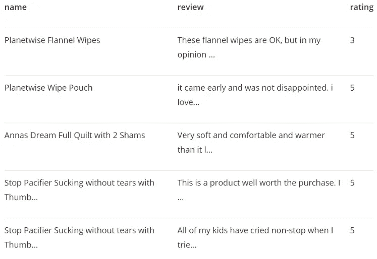
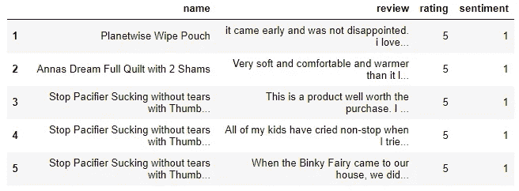
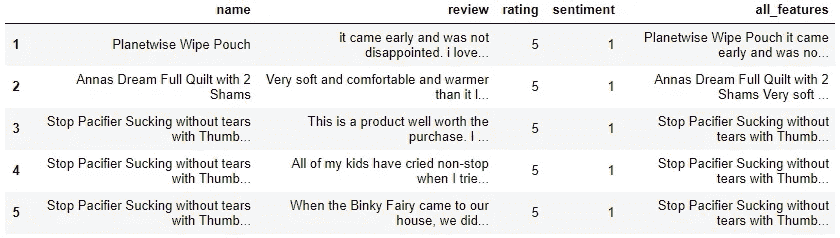

# 一个完整的带有亚马逊产品评论数据的 Python 情感分析算法:一步一步

> 原文：<https://towardsdatascience.com/a-complete-sentiment-analysis-algorithm-in-python-with-amazon-product-review-data-step-by-step-2680d2e2c23b?source=collection_archive---------7----------------------->


Samuele Giglio 在 [Unsplash](https://unsplash.com?utm_source=medium&utm_medium=referral) 上拍摄的照片

## 使用 Python 的 Scikit_learn 库的 NLP 项目

在当今世界，情绪分析在任何行业都可以发挥至关重要的作用。使用自动化系统对推文、脸书评论或产品评论进行分类可以节省大量时间和金钱。同时出错的概率更低。在本文中，我将解释一个使用亚马逊产品评论数据集的情感分析任务。

我将使用 python 和一些 python 库。即使你以前没用过这些库，你也应该能很好地理解它。如果这对您来说是新的，请将每一步代码复制到您的笔记本上，并查看输出以便更好地理解。

# 使用的工具

1.  计算机编程语言
2.  熊猫图书馆
3.  sci kit-学习库
4.  作为 IDE 的 Jupyter 笔记本。

# 数据集和任务概述

我将使用我前面提到的产品评论数据集。该数据集包含亚马逊婴儿产品评论。

**如果你想用它练习**，请从这个 [**链接**](https://www.kaggle.com/bittlingmayer/amazonreviews) **为自己下载数据集。**

它有三列:名称、评论和评级。评论是文本数据，评级从 1 到 5，其中 1 是最差的评论，5 是最好的评论。

我们的工作是分析正面和负面的评论。让我们来看看数据集。这里我们使用前五个条目来检查数据。

```
import pandas as pd
products = pd.read_csv('amazon_baby.csv')
products.head()
```



作者图片

# 数据预处理

在现实生活中，数据科学家很少能获得非常干净并且已经为机器学习模型做好准备的数据。几乎每个项目，你都要花时间清理和处理数据。所以，让我们先清理数据集。

一个重要的数据清理过程是去除空值。让我们检查一下数据集中有多少空值。

在这个数据集中，我们必须处理这三列，这三列都很重要。如果数据在一列的任何一行中都不可用，则该行是不必要的。

```
len(products) - len(products.dropna())
```

我们在 1147 行中有空值。现在，检查一下我们总共有多少数据。

```
len(products)
```

我们总共有 183531 个数据。因此，如果我们删除所有的空值，我们仍然会有相当大的数据来训练算法。因此，让我们放弃空值。

```
products = products.dropna()
```

我们需要在 review 列中包含所有的字符串数据。如果有任何数据具有其他类型，将在后面的步骤中造成麻烦。

现在，我们将检查每一行的评审数据的数据类型。如果有任何一行的数据不是 string 类型的，我们将把它改为 string。

```
for i in range(0,len(products)-1):
    if type(products.iloc[i]['review']) != str:
        products.iloc[i]['review'] = str(products.iloc[i]['review'])
```

当我们进行情绪分析时，告诉我们的模型什么是积极情绪，什么是消极情绪是很重要的。

在我们的评级栏中，我们有从 1 到 5 的评级。我们可以定义 1 和 2 为差评，4 和 5 为好评。

**3 呢？**

3 在中间。不好也不坏。只是一般。但是我们要对好评和差评进行分类。所以，我决定去掉所有的 3。

这取决于雇主或你对好坏的看法。如果你认为你会把 3 放在好的评论位置，那就去做吧。但是我正在摆脱他们。

```
products = products[products['rating'] != 3]
```

我们将正面情绪记为 1，负面情绪记为 0。让我们写一个函数“情绪”,如果评分为 4 或更高，则返回 1，否则返回 0。然后，应用函数“情绪”并创建一个新列，将积极和消极情绪表示为 1 或 0。

```
def sentiment(n):
    return 1 if n >= 4 else 0
products['sentiment'] = products['rating'].apply(sentiment)
products.head()
```



作者图片

看，我们现在在末尾增加了“情感”一栏！

首先，我们需要准备培训功能。将“姓名”和“评论”列合并为一列。首先，编写一个函数“combined_features”来合并这两列。然后，应用该函数并创建一个新列“all_features ”,它将包含来自 name 和 review 列的字符串。

```
def combined_features(row):
    return row['name'] + ' '+ row['review']products['all_features'] = products.apply(combined_features, axis=1)
products.head()
```



作者图片

您可以在结尾处看到“所有功能”一栏。现在，我们准备开发情感分类器！

# 开发情感分类器

下面是一步一步的过程。

我们需要定义输入变量 X 和输出变量 y。

x 应该是“所有功能”列，y 应该是我们的“情感”列

```
X = products['all_features']
y = products['sentiment']
```

我们需要拆分数据集，以便有一个训练集和一个测试集。

scikit-learn 库中的“train_test_split”函数很有帮助。将使用训练数据集来训练该模型，并且可以使用测试数据集来测试该模型的性能。

“train_test_split”自动按 75/25 的比例分割数据。75%用于培训，25%用于测试。如果你想比例不同，你需要定义。

```
from sklearn.model_selection import train_test_splitX_train, X_test, y_train, y_test = train_test_split(X, y, random_state=0)
```

我将使用 scikit-learn 库中的'[计数矢量器](https://scikit-learn.org/stable/modules/generated/sklearn.feature_extraction.text.CountVectorizer.html)。CountVectorizer 生成字符串中所有单词的向量。导入 CountVectorizer，并将我们的训练和测试数据放入其中。

```
from sklearn.feature_extraction.text import CountVectorizercv = CountVectorizer()
ctmTr = cv.fit_transform(X_train)
X_test_dtm = cv.transform(X_test)
```

让我们深入到最初的模型部分。这是最好玩的部分。我们将使用逻辑回归，因为这是一个二元分类。让我们进行必要的导入，并将我们的训练数据放入模型中。

```
from sklearn.linear_model import LogisticRegression
from sklearn.metrics import accuracy_score
model = LogisticRegression()
model.fit(ctmTr, y_train)
```

用训练数据训练逻辑回归模型。

# 结果

使用上面训练好的模型来预测测试数据的情绪。如果我们通过测试特征，它将预测输出 y，即情感数据。

```
y_pred_class = model.predict(X_test_dtm)
```

输出:

```
array([1, 1, 1, ..., 1, 1, 0], dtype=int64)
```

这是测试数据的输出。如你所知，我们用 1 表示好评，用 0 表示差评。

使用 accuracy_score 函数获得测试数据的 accuracy_score。因此，它会将预测的“情绪”与原始的“情绪”数据进行比较，以计算准确性的百分比。

```
accuracy_score(y_test, y_pred_class)
```

**这个数据我在测试集上得到的准确率分数是 84%，非常好。**

## 结论

这个简单的情感分析分类器在许多其他类型的数据集中也很有用。它也可以用于现实世界的项目和业务。我们在这里使用的数据集类似于真实的业务数据集。请在其他数据集上尝试这种技术。

欢迎在[推特](https://twitter.com/rashida048)上关注我，并喜欢我的[脸书](https://www.facebook.com/rashida.smith.161)页面。

## 更多阅读:

[](/great-quality-free-courses-to-learn-machine-learning-and-deep-learning-1029048fd0fc) [## 学习机器学习和深度学习的优质免费课程

### 顶级大学高质量免费课程的链接

towardsdatascience.com](/great-quality-free-courses-to-learn-machine-learning-and-deep-learning-1029048fd0fc) [](/multiclass-classification-algorithm-from-scratch-with-a-project-in-python-step-by-step-guide-485a83c79992) [## 使用 Python 从零开始的多类分类算法:分步指南

### 本文介绍两种方法:梯度下降法和优化函数法

towardsdatascience.com](/multiclass-classification-algorithm-from-scratch-with-a-project-in-python-step-by-step-guide-485a83c79992) [](/a-complete-understanding-of-precision-recall-and-f-score-concepts-23dc44defef6) [## 完全理解精确度、召回率和 F 分数的概念

### 机器学习中如何处理倾斜数据集

towardsdatascience.com](/a-complete-understanding-of-precision-recall-and-f-score-concepts-23dc44defef6) [](/all-the-datasets-you-need-to-practice-data-science-skills-and-make-a-great-portfolio-857a348883b5) [## 练习数据科学技能和制作优秀投资组合所需的所有数据集

### 一些有趣的数据集提升你的技能和投资组合

towardsdatascience.com](/all-the-datasets-you-need-to-practice-data-science-skills-and-make-a-great-portfolio-857a348883b5) [](/your-everyday-cheatsheet-for-pythons-matplotlib-c03345ca390d) [## Python Matplotlib 的日常备忘单

### 完整的可视化课程

towardsdatascience.com](/your-everyday-cheatsheet-for-pythons-matplotlib-c03345ca390d) [](/want-to-become-a-data-scientist-in-12-weeks-3926d8eacee2) [## 想在 12 周内成为数据科学家？

### 花钱前再想一想

towardsdatascience.com](/want-to-become-a-data-scientist-in-12-weeks-3926d8eacee2)