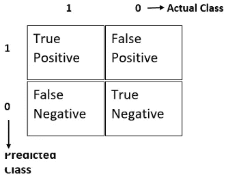
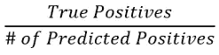
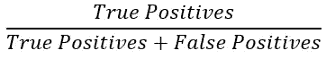
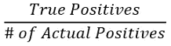
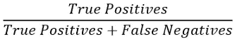
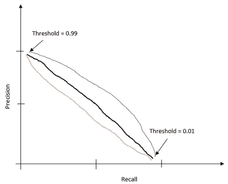
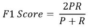

# 完全理解精确度、召回率和 F 分数的概念

> 原文：<https://towardsdatascience.com/a-complete-understanding-of-precision-recall-and-f-score-concepts-23dc44defef6?source=collection_archive---------13----------------------->

[李中清](https://unsplash.com/@picsbyjameslee?utm_source=medium&utm_medium=referral)在 [Unsplash](https://unsplash.com?utm_source=medium&utm_medium=referral) 上拍照

## 机器学习中如何处理倾斜数据集

用倾斜的数据集开发有效的机器学习算法可能会很棘手。例如，数据集是关于银行欺诈活动或癌症检测的。你会在数据集中看到，99%的情况下没有欺诈活动，或者没有癌症。你可以很容易地作弊，只要一直预测 0(如果有癌症预测 1，如果没有癌症预测 0)就可以获得 99%的准确率。如果我们这样做，我们将有 99%准确的机器学习算法，但我们永远不会检测到癌症。如果某人患有癌症，她/他将永远得不到治疗。在银行里，不会有针对欺诈行为的行动。因此，对于这样一个有偏差的数据集来说，光靠准确性是无法决定算法是否有效的。

## 背景

有不同的评估矩阵可以帮助处理这些类型的数据集。这些评估指标被称为精确召回评估指标。

要了解精度和召回率，您需要理解下表及其所有术语。考虑二进制分类。它将返回 0 或 1。对于给定的训练数据，如果实际类为 1，预测类也为 1，则称为**真正**。如果实际类别为 0，而预测类别为 1，则这是一个**假阳性**。如果实际类别为 1，但预测类别为 0，则称为**假阴性**。如果实际类别和预测类别都是 0，则这是**真否定**。

利用这些，我们将计算精度和召回率。

## 精确

Precision 计算我们预测为欺诈的交易(预测类别 1)中有多少部分实际上是欺诈的。**精度可以用下面的公式**计算:

进一步分解，这个公式可以写成:

从公式中可以看出，精度越高越好。因为更高的精度意味着更多的真阳性。这意味着当我们说这笔交易是欺诈性的，这是真的。

## 回忆

回忆告诉我们，所有最初是欺诈性的交易中有多少部分被检测为欺诈性的。这意味着当一笔交易实际上是欺诈性的，如果我们告诉适当的银行当局采取行动。当我第一次读到精确和回忆的定义时，我花了一些时间才真正理解它们的区别。我希望你越来越快。如果没有，那也不用担心。你并不孤单。

召回率可通过以下公式计算:

用上面 2 x 2 表中定义的术语表示:

## 根据精确度和召回率做出决策

精确度和召回率让我们更好地了解算法实际上是如何工作的，尤其是当我们有一个高度倾斜的数据集时。如果我们一直预测 0，并且得到 99.5%的准确率，那么召回率和准确率都是 0。因为没有真正的阳性。所以，你知道分类器不是一个好的分类器。当精确度和召回率都很高时，这表明该算法做得非常好。

假设我们只在高度自信的情况下，想预测 y = 1。因为有些情况下它非常重要。尤其是当我们处理医疗数据时。假设我们正在检测某人是否患有心脏病或癌症。预测假阳性会给一个人的生活带来很多痛苦。提醒一下，一般来说，如果假设大于或等于 0.5，逻辑回归预测 1，如果假设小于 0.5，逻辑回归预测 0。

如果假设≥ 0.5，则预测 1

如果假设< 0.5，则预测为 0

但是，当我们处理上述一些敏感情况时，我们希望对我们的结果更加确定，如果假设≥ 0.7，我们预测 1，如果假设< 0.7，我们预测 0。如果你想对你的结果更有信心，你可以看到像 0.9 这样的值。所以你可以 90%确定某人是否患有癌症。

现在，看看精度和召回公式。真阳性和假阳性都会降低。所以，精度会更高。但另一方面，假阴性会更高，因为我们现在会预测更多的阴性。那样的话，召回会更高。但是太多的假阴性也不好。如果某人确实患有癌症，或者某个账户有欺诈活动，但我们告诉他们，他们没有癌症，或者该账户没有欺诈活动，这可能会导致灾难。

为了避免假阴性并获得更高的召回率，我们需要将阈值更改为如下所示:

如果假设≥ 0.3，预测 1

如果假设< 0.3，则预测为 0

与前一种情况相反，我们将有更高的召回率和更低的准确率。

那么门槛怎么定呢？这将取决于你的要求是什么。根据您的数据集，您必须决定是需要更高的精度还是更高的召回率。这是精确回忆曲线:

精确召回曲线可以是任何形状。所以，我在这里展示了三种不同的形状。如果您不能自己决定是否需要更高的精确度或更高的召回率，您可以使用 F1 分数。

## F1 分数

F1 得分是准确率和召回率的平均值。但是平均的公式是不同的。常规的平均公式在这里不起作用。看平均公式:

(精度+召回)/ 2

即使精度是 0 或者召回率是 0，平均值仍然是 0.5。记住我们之前的讨论，精度为零是什么意思。我们总是可以预测 y = 1。因此，这是不可接受的。因为精确回忆的目的就是避免这种情况。F1 方程式的分数是:

这里，P 是精度，R 是召回率。如果精度为零或召回为零，F1 分数将为零。所以，你会知道分类器没有像我们想要的那样工作。当精确度和召回率都达到完美时，这意味着精确度是 1，召回率也是 1，F1 的分数也将是 1。所以，完美的 F1 分数是 1。**尝试不同的阈值并计算精确度、召回率和 F1 分数，以找出您的机器学习算法的最佳阈值，这是一个好主意。**

## 结论

在本文中，您了解了如何处理有偏差的数据集。如何使用 F1 分数在精确度和召回率之间做出选择？我希望它有帮助。

## 更多阅读

 [## 使用 Python 从零开始的多类分类算法:分步指南

### 本文介绍两种方法:梯度下降法和优化函数法

towardsdatascience.com](/multiclass-classification-algorithm-from-scratch-with-a-project-in-python-step-by-step-guide-485a83c79992)  [## 用 Python 从头开始构建神经网络

### 神经网络的详细说明和逐步实现

medium.com](https://medium.com/towards-artificial-intelligence/build-a-neural-network-from-scratch-in-python-f23848b5a7c6)  [## Python 中用于检测心脏病的逻辑回归

### 发展逻辑回归演算法的重要方程式和如何发展逻辑回归演算法

towardsdatascience.com](/logistic-regression-in-python-to-detect-heart-disease-2892b138d0c0)  [## 用几行代码在 Python 中搜索相似的文本:一个 NLP 项目

### 使用 Python 中的计数矢量器和最近邻法查找类似的维基百科简介，这是一个简单而有用的…

medium.com](https://medium.com/towards-artificial-intelligence/similar-texts-search-in-python-with-a-few-lines-of-code-an-nlp-project-9ace2861d261)  [## 练习数据科学技能和制作优秀投资组合所需的所有数据集

### 一些有趣的数据集提升你的技能和投资组合

towardsdatascience.com](/all-the-datasets-you-need-to-practice-data-science-skills-and-make-a-great-portfolio-857a348883b5)