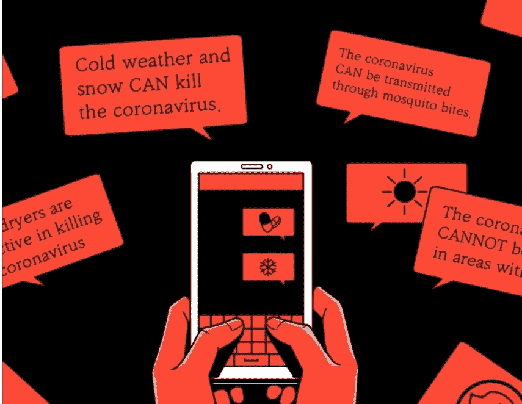
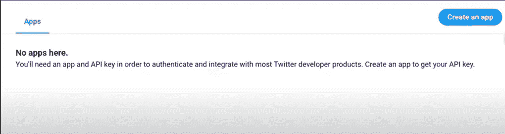
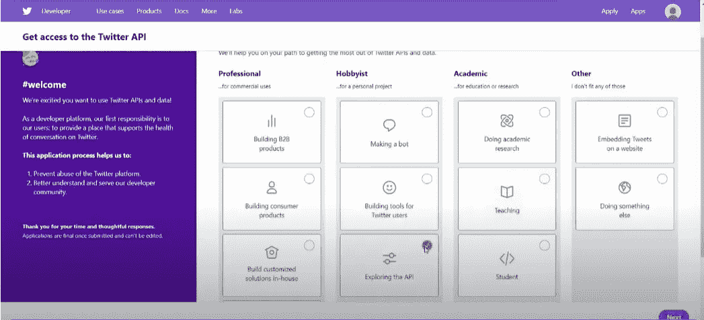
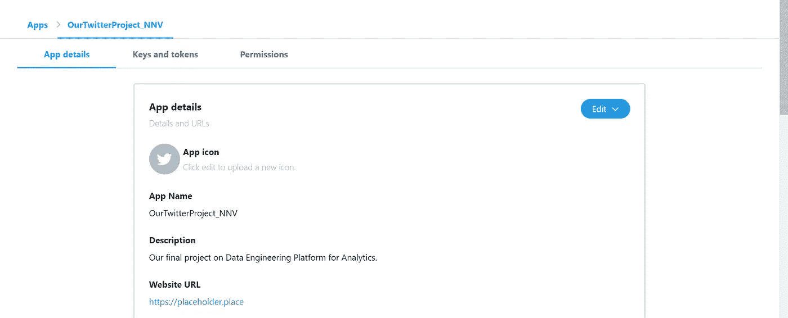
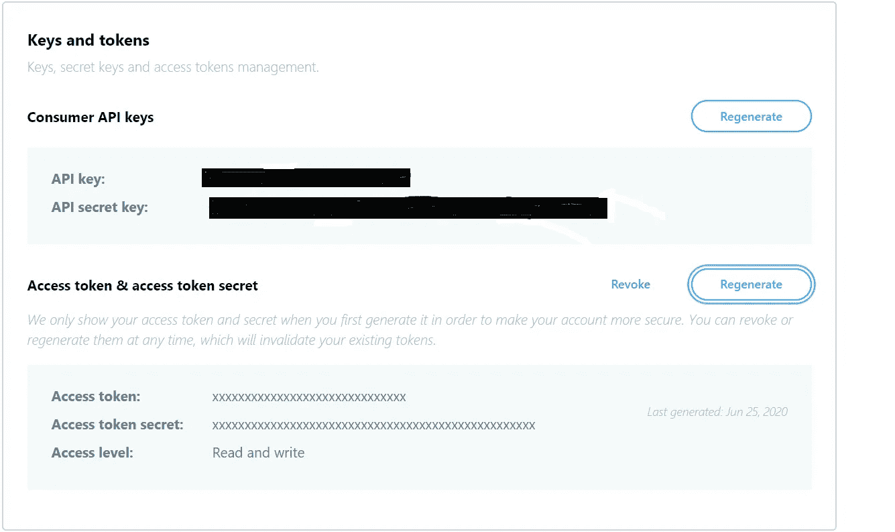
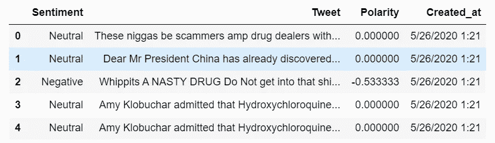
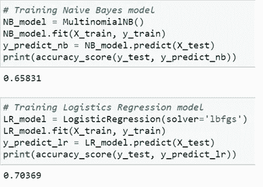
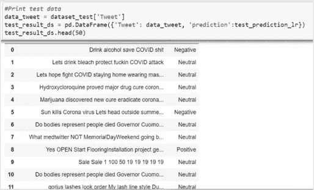

# 解决文本分类问题的初学者综合指南

> 原文：<https://towardsdatascience.com/a-comprehensive-beginners-guide-to-tackle-text-classification-problems-e39a8ce22cff?source=collection_archive---------31----------------------->

## 利用文本分类方法分析 Twitter 数据中的错误信息

*作者* [*尼基尔·乔希*](https://www.linkedin.com/in/nikhil-joshi-344b9aa7/) *和* [*纳拉辛哈·卡马特·阿迪*](https://www.linkedin.com/in/narasimha-kamath-ardi-133169132/)*—2020 年 6 月 26 日*


**简介**

众所周知，对数据科学家的需求一直在稳步上升。我们辞去了一份高薪的咨询工作，去追求数据科学领域的职业生涯。当我们作为学生开始我们的旅程时，我们真的不知所措，不知道如何开始学习过程。作为一个不断发展的领域，互联网上有很多内容/平台。当已经有这么多可能的事情时，一个人自然会发现很难找到一个完美的开始，我们在第一季度的前两个月面临同样的问题。

当我们在网上寻找内容时，他们大多专注于机器学习算法，NLP 概念，一开始看起来超级令人兴奋。此外，当我们开始了解 Python 及其内置库的重要性时，我们对自己的职业选择非常着迷。然而，作为一个初学者，我们面临着如此多的困惑，我们将在这个博客中讨论。这篇文章是有意针对新手候选人的，我们将尝试详细说明应该注意的每一点，以便在这一流程中建立一个坚实的基础。

**数据科学不是闹着玩的！**

这是一个极具挑战性的领域，需要纯粹的统计学知识来理解基本概念。ML 看起来很吸引人，Python 也做对了你的大部分工作，那为什么还要学统计学呢？这是我们关于数据科学的第一个流言被终结的地方。我们遇到了各种旨在通过将大部分精力集中在构建模型上来解决问题的帖子/项目，并得出结论，它对给定的用例执行准确！！这是我们大多数人出错的地方。你还在迷茫吗，别急！请允许我们通过考虑一个经典的文本分类问题来阐述这一点；我们的第一个数据科学项目教会了我们很多在学习阶段从未预料到的事情。

**预测全球疫情期间推特上的错误信息**



啊！众所周知，Twitter 是数据科学项目的金矿。但是我们应该用 Twitter 做什么项目呢？当我们在 GitHub 上寻找几个项目来获得灵感时，我们发现大多数项目都倾向于情感分析。等等，我们要进行情感分析吗？选择一个项目主题是我们作为初学者面临的首要挑战。

提示 1:一开始就着手一个复杂的项目是绝对不行的。要脚踏实地！一步一步来！

像其他人一样，我们在开始时太受驱动了，想做一个复杂的项目。然而，我们意识到这不是正确的方法。我们想先搞清楚基本情况，经过几天的头脑风暴，我们敲定了几个有趣的话题。最后，我们决定对 twitter 上有关抗病毒药物、消毒剂和冠状病毒预防措施的错误信息进行分析。此外，选择这一主题的动机是为了理解实现解决方案背后的数学原理，以减少 Twitter 上的有害内容。

**我们是如何解决这个问题的？**

大多数像我们这样的新手在项目期间犯的主要错误是直接跳到项目要使用的 ML 算法的类型上！

**提示 2:控制你的肾上腺素分泌！先看问题。请不要忽视数据工程部分。分析问题陈述，看看在你目前的知识水平下是否可行。**

谢谢你走了这么远。从这里开始，我们将解释解决这个问题的逐步方法。

**第一步:获取 TWITTER 开发者账户访问权限**

为了使用 twitter 数据，我们需要一个 twitter 开发者帐户。这将为我们提供通过 TweePy 获取 tweets 的授权。但是，我们是如何创建 twitter 开发者账户的呢？

遵循以下步骤:

a.登录开发者账号，点击**“创建 app”**。



b.将出现一个弹出窗口。点击**‘应用’**并从下面的仪表板中选择相关选项。



c.填写所需的详细信息，并获取访问密钥和令牌



呜哇！！！第一步现已完成。获得访问权限后，请确保点击**“密钥和令牌”**选项卡，并复制所提供的令牌。它将进一步用于通过 TweePy 访问 REST API。

**第二步:数据收集和存储**

我们通过 TweePy 使用 REST API 抓取推文。在这篇文章中，我们假设我们所有的读者都已经有了很好的 Python 实践经验。如果没有，我们强烈建议访问任何免费的 Python 在线课程，让自己熟悉该语言的语法。



一旦从 Twitter 收到令牌和密钥并安装了 TweePy，就可以开始通过 Twitter API 提取数据了。您可以通过 [**Twitter 标准 API 搜索字段**](https://developer.twitter.com/en/docs/tweets/search/api-reference/get-search-tweets) 找到不同的可用数据字段。

技巧 3:永远不要仅仅为了完成任务而写脚本。优化它以执行多个操作。下面的代码片段一次性完成了管道的获取和清理。编码是一门艺术！练习直到你做对为止！

首先，让我们导入所需的库:

```
**# Data extraction & exploratory analysis**
import tweepy
from textblob import TextBlob
from tweepy import OAuthHandler
import pandas as pd
import numpy as np 
import re**#NLP**
from textblob import TextBlob
import nltk
from nltk.corpus import stopwords
from nltk.tokenize import word_tokenize
from sklearn.feature_extraction.text import TfidfVectorizer
from sklearn.model_selection import train_test_split
from nltk.stem import PorterStemmer
from nltk.stem import WordNetLemmatizer
nltk.download('punkt')
from nltk.corpus import words
nltk.download('stopwords')**#ML Libraries for text classification**
from sklearn.metrics import accuracy_score
from sklearn.naive_bayes import MultinomialNB
from sklearn.linear_model import LogisticRegression
```

一旦你的申请被批准，使用下面的脚本添加你自己的个性化 tokes。

```
**# Removed access keys and tokens for the sake of security**access_token = ''
access_token_secret = ''
consumer_key = ''
consumer_secret = ''
```

如前所述，现在是我们开始从 Twitter API 中提取数据的时候了。

```
**# authorize access to TweePy**auth = tweepy.OAuthHandler(consumer_key,consumer_secret)
auth.set_access_token(access_token,access_token_secret)
api = tweepy.API(auth,wait_on_rate_limit=True, wait_on_rate_limit_notify=True)**# Fetch tweets**tweets = []
sentiments =[]
count = 1
query = "#hydroxychloroquine OR #remdesivir OR #Remdesivir OR hydroxychloroquine OR remdesivir OR #GileadSciences OR GileadSciences OR #drug OR drug OR #antiviral OR antiviral OR #Antibiotic OR antibiotic"for tweet in tweepy.Cursor(api.search,q=query,count=450).items(50000):
    print(count)
    count+=1

    try:
        data = [tweet.created_at,tweet.id,tweet.text,tweet.source,tweet.retweet_count,tweet.user._json['screen_name'],tweet.user._json['created_at'],tweet.user._json['location'],tweet.coordinates,tweet.entities['urls']]
        data = tuple(data)
        tweets.append(data)

    except tweepy.TweepError as e:
        print(e.reason)
        continue

    try:
        sentiment_data = [tweet.created_at,tweet.text]
        sentiment_data = tuple(sentiment_data)
        textWords=sentiment_data[1].split()
        #clean tweets
        cleanedTweet=' '.join(re.sub("(@[A-Za-z0-9]+)|([^0-9A-Za-z \t])|(\w+:\/\/\S+)|(RT)", " ", sentiment_data[1]).split())
        analysis= TextBlob(cleanedTweet)
        polarity = 'Positive'
        if(analysis.sentiment.polarity < 0):
            polarity = 'Negative'
        if(0<=analysis.sentiment.polarity <=0.2):
            polarity = 'Neutral'
        #print (polarity)
        dic={}
        dic['Sentiment']=polarity
        dic['Tweet']=cleanedTweet
        dic['Polarity'] = analysis.sentiment.polarity
        dic['Created_at'] = sentiment_data[0]
        sentiments.append(dic)

    except tweepy.TweepError as e:
        print(e.reason)
        continue

    except StopIteration:
        break

df_analysis = pd.DataFrame(tweets, columns = ['created_at','tweet_id','tweet_text','tweet_source','retweet_count','screen_name','account_creation_date','location','coordinates','urls'])df_analysis.to_csv('File Path')df_sentiment=pd.DataFrame(sentiments)df_sentiment.to_csv('File Path'
```

我们使用查询字符串来添加我们正在寻找的任何标签、关键字、关键短语或句柄(例如 query = " #羟氯喹" )，然后使用。items()功能。

在上面的脚本中， [**文本 Blob**](https://textblob.readthedocs.io/en/dev/) 将我们的文本分类为阳性、阴性和中性标签(基于极性)。但是，我们为什么要使用 [**NLTK**](https://www.nltk.org/) 呢？使用这两个库的唯一目的是理解每个包如何以自己的方式对文本处理做出贡献。此外，我们还强烈推荐浏览 [**SpaCy**](https://spacy.io/) ，这是一个高级自然语言处理的开源软件库。

此外，我们可以设置自定义日期过滤器(since 和 until 参数)来查询给定日期范围内的 tweets。在执行此脚本之前，请确保添加您的文件路径来存储原始数据集和干净数据集。

```
tweepy.Cursor(api.search,q=query,since=2020-06-26 count=450).items(50000)
```

但是，请记住，Twitter 标准 API 搜索只能追溯到当前日期的 7 天之后。此外，计数参数指的是速率限制，请保持不变，即 450。

除了下载我们在上面实现的历史推文，我们还可以使用流 API 下载实时推文。请 [**查看**](https://developer.twitter.com/en/docs/tutorials/consuming-streaming-data)Twitter 开发者手册了解更多信息。

**第三步:分析并理解我们如何应用分类方法**

文本分类是一个有监督的学习问题，它在机器学习和自然语言处理的帮助下将文本/标记分类到有组织的组中。 [**点击这里**](https://www.analyticsvidhya.com/blog/2018/04/a-comprehensive-guide-to-understand-and-implement-text-classification-in-python/) 了解更多详情。另外，情绪分析的基础知识可以在 [**这里找到**](https://monkeylearn.com/sentiment-analysis/#:~:text=Sentiment%20analysis%20is%20the%20interpretation,in%20online%20conversations%20and%20feedback.) **。**

下面是我们的干净数据集后处理的快照:

```
df = pd.read_csv("text_analysis_antiviral.csv")
df.head()
```



清理数据集快照

如果您仔细观察数据集，会发现添加了 2 个新属性，其中包括情感和极性。它们说明了什么？好吧，我们假设你已经浏览了我上面附加的链接，这些链接有助于你理解分类方法的基础。

我们如何使用机器学习将这些文本分类为正面、负面和中性标签？在此之前，为什么我们甚至把他们排到上述标签？由于 TextBlob 已经按照极性对数据进行了分类，我们将使用它作为机器学习分类器的训练数据集。NLTK 在这里的工作是删除停用词并将句子分解成标记。然后，这些标记将经历词干化或词汇化的过程。

```
**# Perform text processing operations on the cleaned tweets**
def preprocess_tweet_text(tweet):
    tweet.lower()

  **  # Remove urls**
    tweet = re.sub(r"http\S+|www\S+|https\S+", '', tweet, flags=re.MULTILINE)

    **# Remove stopwords**
    stop = stopwords.words('english')

    **#Tokenization**
    tweet_tokens = word_tokenize(tweet)
    filtered_words = [w for w in tweet_tokens if not w in stop]

    **# Stemming**
    ps = PorterStemmer()
    stemmed_words = [ps.stem(w) for w in filtered_words]

    **#Lemmatization**
    lemmatizer = WordNetLemmatizer()
    lemma_words = [lemmatizer.lemmatize(w, pos='a') for w in stemmed_words]

    return " ".join(filtered_words)
```

**提示 4:在阅读下面的内容之前，请仔细阅读上面的链接，以便对主题有一个清晰的了解。**

这里的第一种方法是找到包含虚假声明/信息的推文，并将它们贴上负面标签。但是，TextBlob 不是已经这样做了吗？为什么要走这么远，还要用 ML 分类器？这是一种我们一开始就在谈论的自省。数据科学不仅仅是建模和准确性！它有很多方面，但不幸的是大多数时候都被低估了。

以“孙杀”为例。你认为这篇文章的标签应该是什么？TextBlob 会将其识别为中性，这是绝对正确的，因为它预测了这里的情绪。然而，我们的问题声明指出，错误信息应被视为负面标签。请不要混淆:)我们使用 TextBlob 来减少准备带有标签的训练数据集的负担。但是，TextBlob 可能无法正确识别标签。现在这完全没问题，因为我们都刚刚步入数据科学的世界！因此，随着我们的前进，我们可以创建自己的带有所需标签的训练数据，并针对各种用例进行测试！

步骤 4:让我们应用期待已久的 ML 分类器来训练数据集！

在应用模型之前，我们使用 [**TF-IDF**](https://en.wikipedia.org/wiki/Tf%E2%80%93idf#:~:text=In%20information%20retrieval%2C%20tf%E2%80%93idf,in%20a%20collection%20or%20corpus.) 技术为提取的记号分配加权因子。下面的代码片段还将数据分为训练和测试。此外，我们的火车数据集中有大约 **76000** 条推文。

```
tf_vector = get_feature_vector(np.array(dataset_train.iloc[:, 0]).ravel())
X = tf_vector.transform(np.array(dataset_train.iloc[:, 0]).ravel())
y = np.array(dataset_train.iloc[:, 1]).ravel()
X_train = X
y_train = y
X_test = tf_vector.transform(np.array(dataset_test.iloc[:, 0]).ravel())
y_test = np.array(dataset_test.iloc[:, 1]).ravel()
```

你们不要担心！我们还将附上 GitHub 资源库的链接，该资源库将包含本项目中使用的所有 Python 笔记本。现在请把注意力集中在正确的概念上！

我们应该考虑应用哪种 ML 模型？我们使用流行的 [**朴素贝叶斯分类器**](https://en.wikipedia.org/wiki/Naive_Bayes_classifier) 和 [**逻辑回归**](https://en.wikipedia.org/wiki/Logistic_regression#:~:text=Logistic%20regression%20is%20a%20statistical,a%20form%20of%20binary%20regression).) 进行分类。请点击 [**链接**](https://dataespresso.com/en/2017/10/24/comparison-between-naive-bayes-and-logistic-regression/#:~:text=Na%C3%AFve%20Bayes%20is%20a%20classification,being%20associated%20with%20a%20label.&text=Logistic%20regression%20is%20a%20linear,belonging%20to%20a%20certain%20class.) 了解这些型号之间的更多差异。

对 TextBlob 生成的数据集进行后训练，我们实现了 LR 模型 70%的准确率和 NB 模型 66%的准确率。



模特培训

第五步:测试时间到了！！

当我们将测试数据集输入 LR 模型时，我们发现了一些非常有趣的见解！！



根据 LR 模型测试数据集

哇哦。你们有没有看到《孙杀》已经被正确的认定为阴性了？？在训练数据集时，除了 TextBlob 生成的数据之外，我们还包含了另外 300 个数据点！通过这种方式，它正确地将一些错误信息文本标记为负面的。不过，推文“我们喝漂白剂吧”还是中性的。有趣的是，我们训练过的模型错误标记了一些文本。这是我们作为数据科学家必须开始思考的地方。如前所述，我们刚刚开始我们的旅程。作为初学者完成这些步骤本身就是一项值得称赞的工作。因此，我们强烈建议正确理解这些概念。此外，一旦基础得到加强，高级思维的范围总是存在的！


如前所述，下面是[**GitHub 资源库链接**](https://github.com/TeamHiddenLeaf/text_classifier_python) 供大家参考！

谢谢大家！

如有任何问题或疑虑，您也可以发电子邮件给我们:

**nikhiljoshi19@uchicago.edu&nkamathardi@uchicago.edu**

**参考**

[https://first draft news . org/latest/how-to-investigation-health-misinformation-and-any-otherwise-using-twitters-API/](https://firstdraftnews.org/latest/how-to-investigate-health-misinformation-and-anything-else-using-twitters-api/)