# WhatsApp 群聊的综合数据分析

> 原文：<https://towardsdatascience.com/a-comprehensive-data-analysis-on-a-whatsapp-group-chat-25d9535f3c65?source=collection_archive---------8----------------------->

## 有没有想过你的哪个朋友发短信骂人最多？

照片由[于切尔·莫兰](https://unsplash.com/@yucelmoran?utm_source=unsplash&utm_medium=referral&utm_content=creditCopyText)在 [Unsplash](https://unsplash.com/s/photos/whatsapp?utm_source=unsplash&utm_medium=referral&utm_content=creditCopyText) 上拍摄

在考虑我的下一个项目时，我的脑海中突然冒出了一个想法。为什么不对大学生的 WhatsApp 群聊进行数据分析，找出有趣的见解，如使用最多的表情符号，每个人的情绪得分，谁说的脏话最多，一天中最活跃的时间，或者该群体在大学教学时间使用手机吗？这些肯定会是一些有趣的见解，对我来说比对你更有意义，因为这次聊天的人是我个人认识的人。

*注意:我用两个字母代表我的每个朋友，这是他们名字的缩写，以保持匿名。*

# 数据检索和预处理

第一步是收集数据。WhatsApp 允许你通过. txt 格式导出聊天内容。打开这个文件，您会得到如下格式的消息:

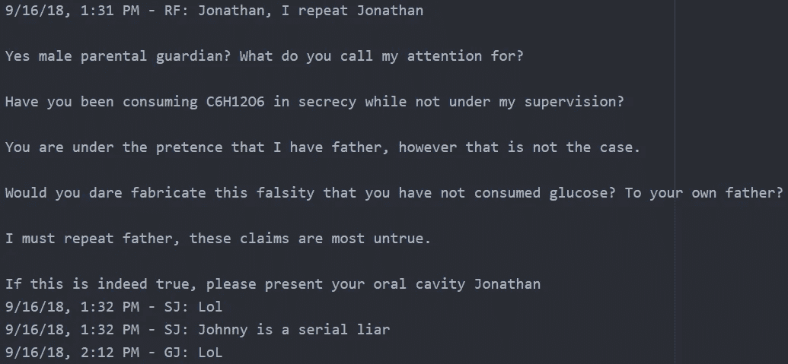

说假话？不，爸爸！

由于 WhatsApp 的文本是多行的，你不能一行一行地阅读文件，然后得到你想要的每条信息。相反，您需要一种方法来识别一行是新消息还是旧消息的一部分。您可以使用正则表达式来实现这一点，但是我使用了一个更简单方法。我创建了一个名为 vali_date()的函数，如果传递的参数是有效的日期，它将返回 True。

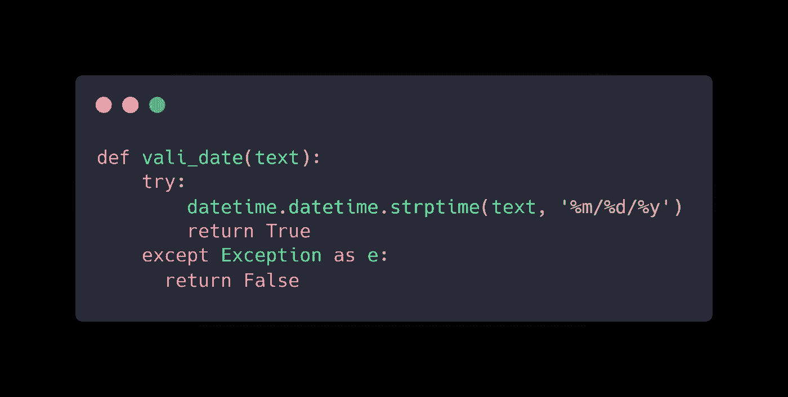

我对自己如何命名这个函数感到非常自豪。

在读取每一行时，我根据逗号将其拆分，并获取 split()函数返回的第一项。如果该行是新消息，第一项将是有效日期，它将作为新消息附加到消息列表中。如果不是，则该消息是前一条消息的一部分，因此将作为一条连续消息附加到前一条消息的末尾。

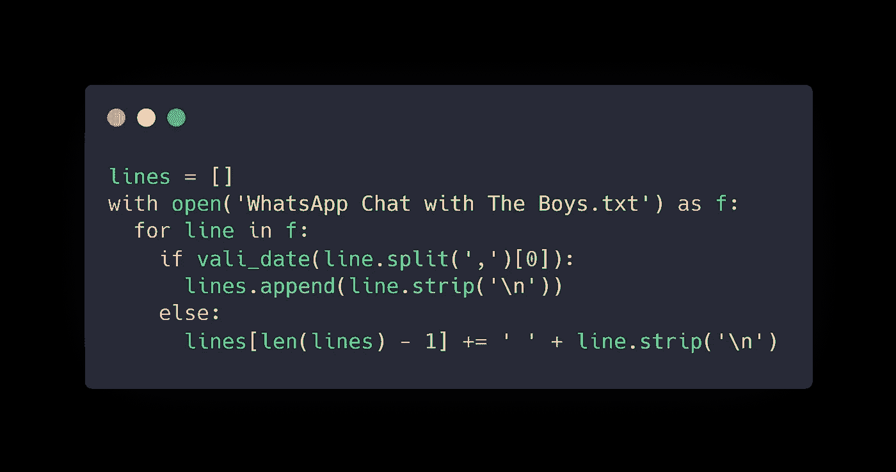

从这里开始，只需要从每一行中提取必要的细节:发送日期、发送时间、发送者和消息本身。这只是使用一些简单的字符串处理函数，主要是 split()，然后用它制作一个数据帧。如果您使用相同的方法，请确保正确指定日期和时间格式。

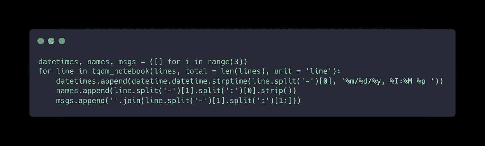

该导出还包含人员何时被移除、人员何时被提升为管理员以及其他对我们没有用处的功能性消息。用我写的代码，这些消息被设置为带有空白消息的发送者姓名。为了过滤掉这些关键字，我使用了一个非常简单的函数来检查发件人的姓名是否包含这些关键字。为了说明没有硬编码到 if 条件中的其他消息，我检查了发件人姓名的字数。在我使用的导出中，我没有一个人的名字超过 3 个单词，但是如果你在做这样的事情，你必须考虑不同的名字。我还删除了一个朋友的旧号码，它不能通过上面的 if 条件，所以我必须用另一个条件来解释。如果你想避免这个痛苦的过程，你应该使用正则表达式，我很尴尬的没有这样做。

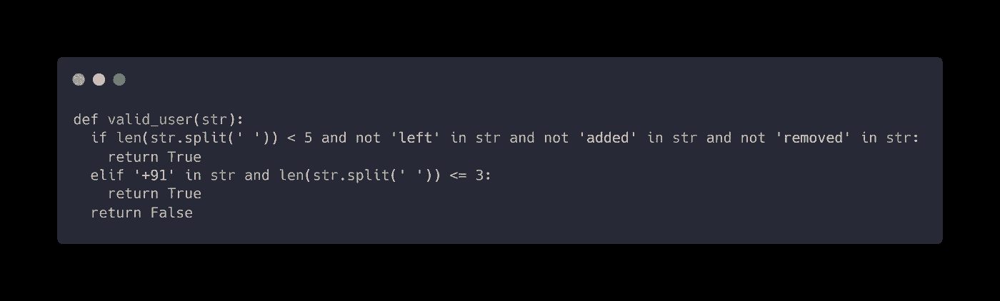

由于我以单一的 DateTime 格式加载了日期和时间，因此我可以轻松地从中提取特定的信息，比如发送日期或月份，这对热图很有用。

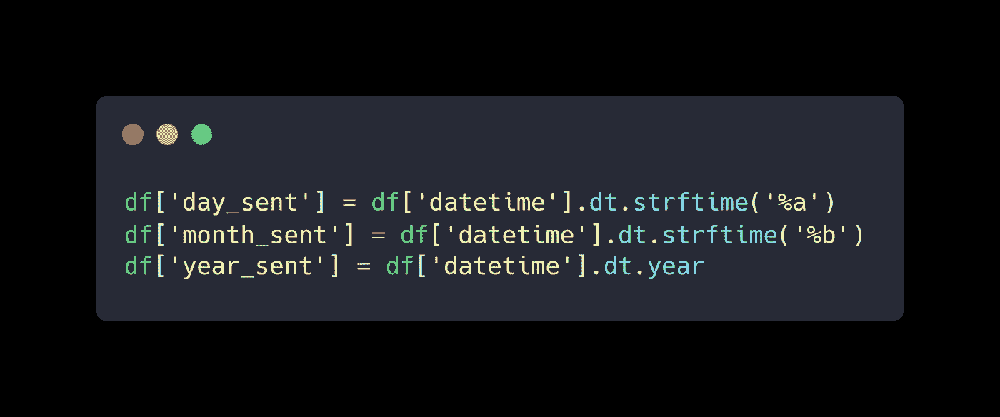

此时，我想我已经准备好开始分析了，所以我绘制了一个简单的线图来查看这些年来消息的频率。这个群是 2017 年最后一个季度创建的，聊天是 2020 年导出的。我希望看到一个漂亮的线图，在奇怪的地方有波峰和波谷。但是当我看剧情的时候，我看到了一些奇怪的东西。

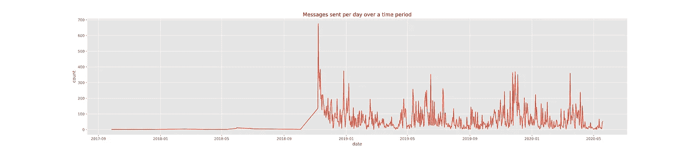

请注意，导出的前半部分没有消息。这似乎很奇怪。起初，我以为是我的文本处理出了问题，但我最终发现，WhatsApp 聊天导出是有限制的，它们可以导出多少条消息。这个限制大约是 40，000，这解释了为什么导出的前半部分没有很多消息。观察数据帧的形状，它有 39，489 行。在这一点上，我感到失望的是，我几乎一半的数据都无法访问。

但是等等！

隧道尽头的光来了。我的朋友也在这个小组中，他提到他可以使用他的旧手机。他把旧手机里的聊天记录导出来，发了过去。我应用了与第一次导出时相同的提取技术，尽管由于不同的日期表示和不同的联系人姓名，我对代码做了一些小的修改，但这次新的导出有令人惊讶的 68，584 条消息(我不确定它怎么会超过 40，000 条)。我合并了这两个数据帧，删除了重复的，最终得到了总计 74，357 条消息，时间跨度超过 2.5 年。线图现在看起来好多了。

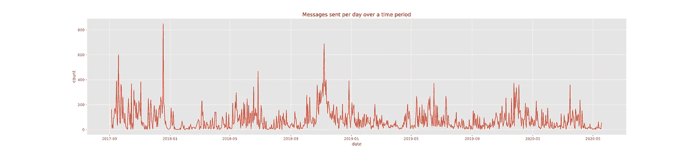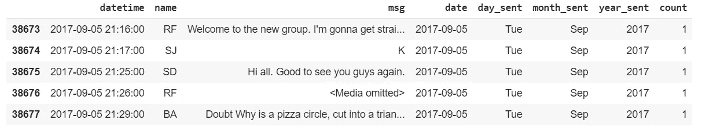

# 探索性数据分析

现在我们有了一个干净的数据框架，是时候对它进行分析了。首先，由于几乎所有的情节都是将一个人与另一个人进行比较，我将为每个人指定一种特定的颜色，这样就可以很容易地在多个情节中识别每个人。我从这个网站上选择了我的调色板。

接下来，我制作了一个字典，其中每个键都是名称，每个键的值都是分配给它们的颜色。我创建了一个函数，它给定一个名称列表，对颜色进行重新排序，以匹配绘图的顺序。这个函数将有序的名称作为输入，并返回一个重新排序的颜色列表。这个列表必须被传递到 seaborn 绘图函数的`pallete`参数中。

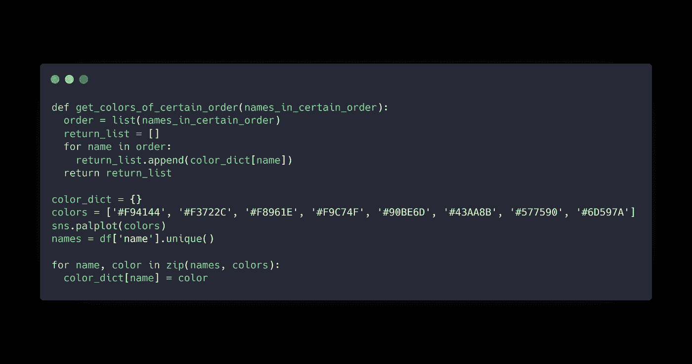

现在我们为每个人准备了一套很好的颜色，我们可以用触须来可视化。

我的第一个图是每个人发送的消息总数。为此，一个简单的 seaborn countplot 就足够了。下一个是每个人的平均消息长度。为此，我创建了一个名为`msg_length`的新列，它包含每条消息的长度，这是我通过使用 lambda 函数得到的，该函数返回给定消息的长度。我只是按名称对数据帧进行分组，然后对返回的 groupby 对象应用`mean()`。

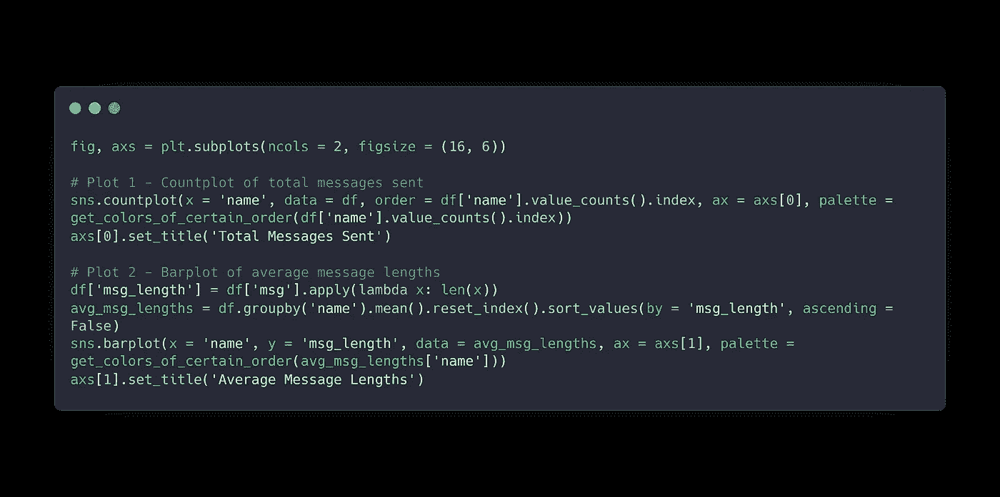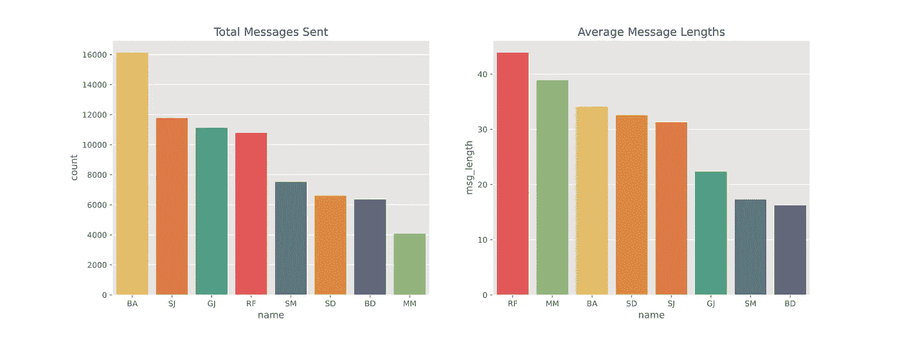

看到这样的剧情并排真的很有意思。例如，发短信最少的人，MM，平均打出了第二长的信息。这意味着这个人不会发送很多 WhatsApp 消息，但如果他们发送了，也很长。我们可以看到 BA 发送的消息最多，但消息长度相对较长。RF 似乎在平均消息长度上击败了所有人，但仔细观察，这是由于一些“异常值”，如下所示:

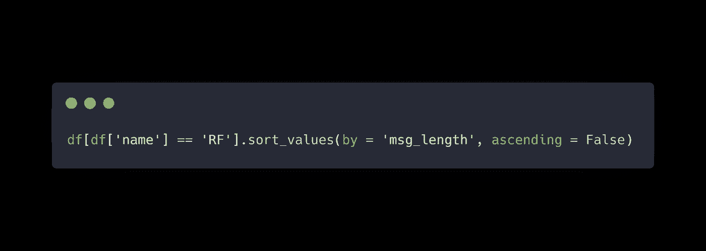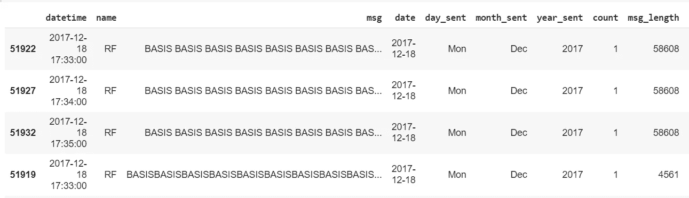

有人真的很执着。

由于这里没有关于什么是真正的消息的规则，我将把这些消息放在里面，不把它当作离群值。 *WhatsApp 是野生的。*

导出的聊天在导出时没有任何媒体文件。任何包含媒体的消息都用“<media omitted="">”表示。我们可以用这个过滤掉，看看谁发的媒体最多。</media>

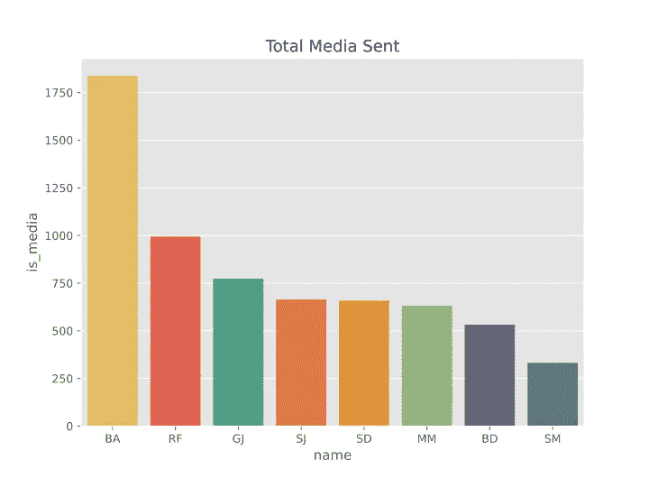

巴遥遥领先于所有人。他在总消息数上排名第一，在平均消息长度上排名第三。最具奉献精神的贡献者奖授予 BA！

不是说它值多少钱。

# 时间

接下来我们可以检查从每条消息的日期时间戳中提取的月份。我们可以使用这些来制作热图，以检查最活跃的时间段。我会把两块地并排放在一起。

我按月份对数据帧进行分组，并对返回的对象应用 sum 函数。为了统计 groupby 的每个组中的消息数量，我已经创建了一个名为`count`的列，其中每条消息的编号为 1。因为月份是有序的，所以我传递了一个包含月份的字符串列表，以便传递给绘图函数的`order`参数。

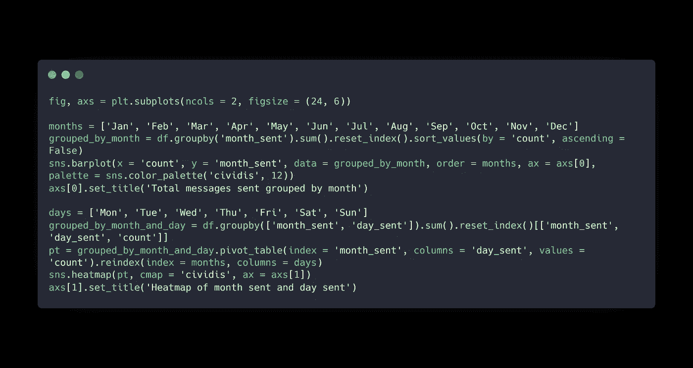

我们可以看到，一年中的最后 3 个月比其他月份活跃得多。最活跃的日子是 11 月的星期五和 12 月的星期一，然而，我们不能从中推断出太多。这可能是由于某些日子，而不是重复模式。为了证明这一点，我们可以检查最活跃的日期，看看它们是在一周的哪几天。

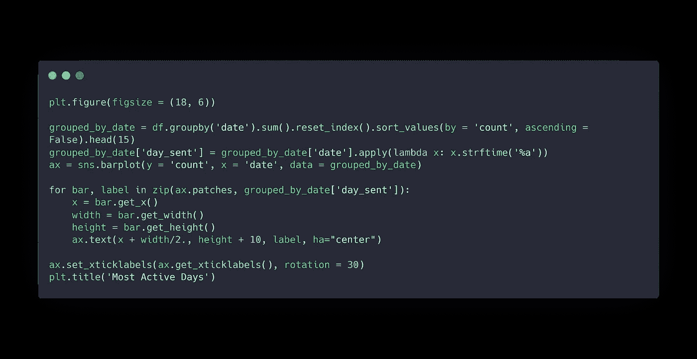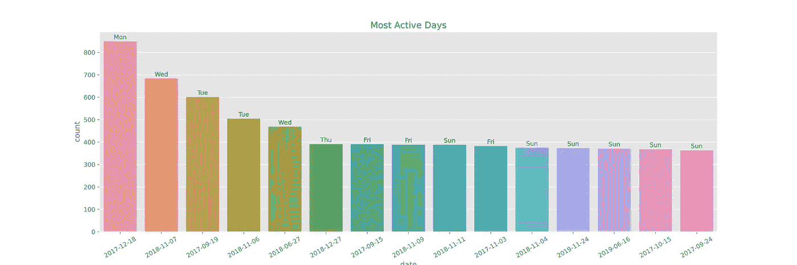

最高的两天是在 11 月和 12 月，这导致了这几个月的高平均值。

为了清楚地了解不同日期的活动，我们通过汇总一周 7 天中每一天的消息计数来绘制一个单独的图。为了更进一步，我们可以查看一天中每个小时的聚合。

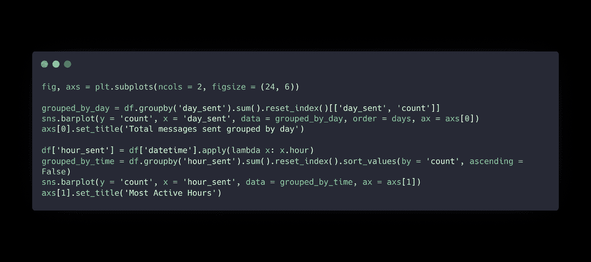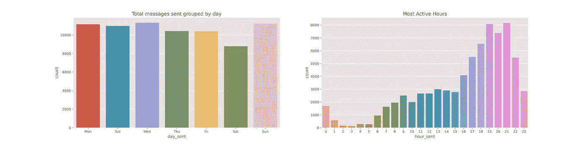

看起来除了星期六之外，这一天本身没有什么变化。这可能是因为周六是周五后的第一个周末，人们通常会休息并做其他活动，而不是在手机上发消息。

观察每小时的活动，我们可以看到大多数的群体活动发生在晚上。一些其他有趣的事情发生了:

*   从上午 9 点到 10 点的秋天。上午 9 点是开始上课的时间，没有多少学生倾向于在这个时间使用手机，因为他们要么赶去上课，要么和朋友聊天。
*   下午 1 点的小高峰。这是在大学的午餐时间，因为下课了，人们更倾向于使用手机。然而，从上午 11 点到 12 点只有轻微的增加，这一事实表明我们在教学时间积极参与小组活动。用数据证明这种行为并不令人惊讶，但仍然令人着迷。
*   从下午 3 点跳到下午 4 点。这是因为群里每个人都是大学生。大学在下午 3:30 结束，我们所有人都开始回家——在此期间，我们要么在回家的路上睡在公交车上，要么忙于做其他事情。

# 表情符号

使用 Python 的`emoji`库，我们能够从短信中提取表情符号。

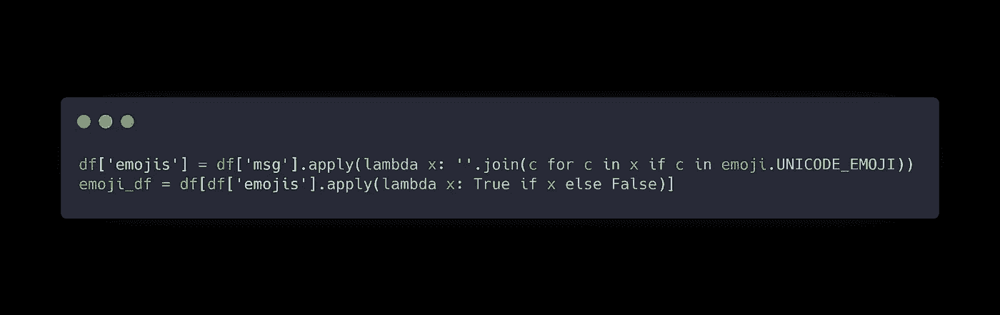

对于小组中的每个人，我将创建一个字典，其中包含作为关键字的表情符号和作为其值的出现次数。我试图让字典包含至少出现 1 次的表情符号，但我的代码中有些东西不起作用，所以我为小组中每个人的每个可用表情符号初始化了计数 0。效率低下，我知道，但很有效。

我遍历数据帧中的每一行，对于每条消息，我用消息中的表情符号索引字典，并将计数加 1。然后我把字典按降序排序，得到每个人最常用的表情符号。

还绘制了一个柱状图，给出了每个人的表情符号总数。

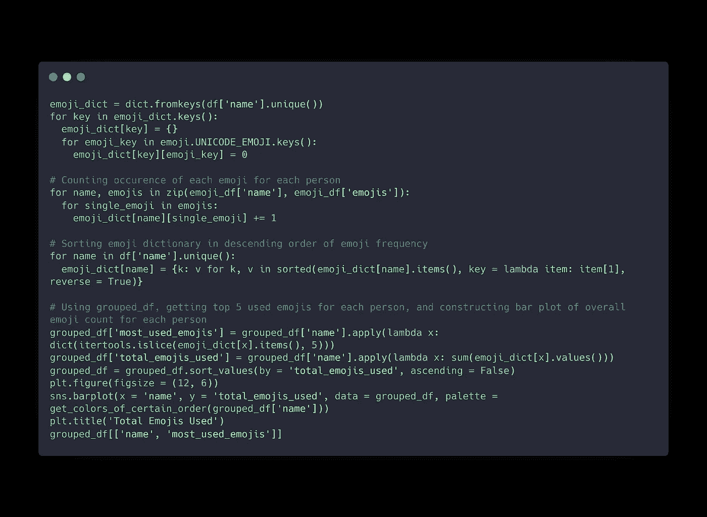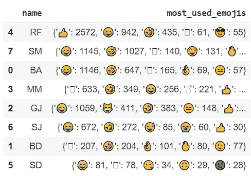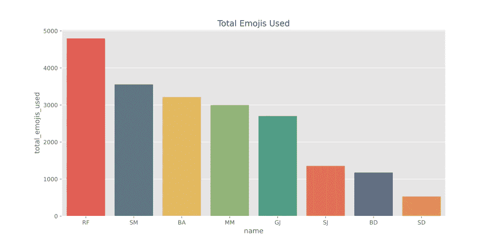

我们可以看到，最常见的表情符号是哭笑表情符号，这与 Unicode 协会的[报告](https://home.unicode.org/the-most-frequent-emoji/)一致，该报告称😂是最常用的表情符号。

有一些表情符号不是由 Google Colab 提供的。这些可能是较新的表情符号。RF 似乎使用最多的表情符号，尤其是👍表情符号，有点可疑。我们可以看到，这是由于单一的信息，而不是他们的集体短信习惯。

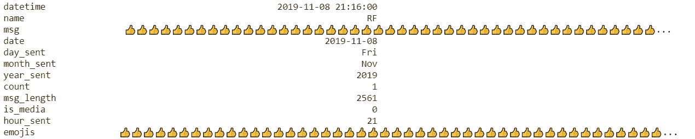

# 脏话&情感

一些真正令人兴奋的事情！有一个名为`profanity_check`的库可以检查给定的消息是否包含脏话。我想知道脏话对信息的情绪有多大影响。

首先，我创建了一个新列，如果消息包含脏话，则包含 1，如果不包含，则包含 0。这是使用前面提到的库中的`predict`函数来完成的。然后，我们可以按姓名对数据帧进行分组，并获得骂人列的平均值，这就给出了每个人在邮件中含有脏话的百分比。

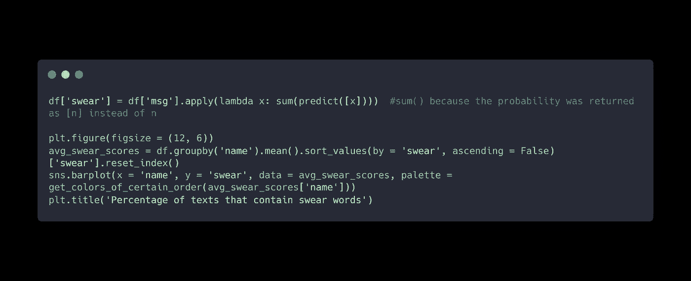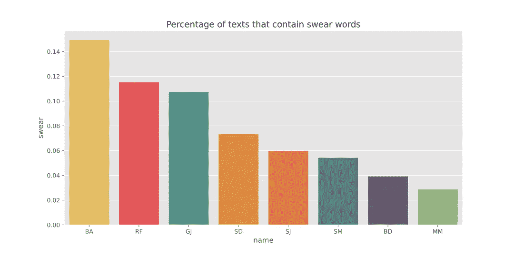

我们可以看到 BA，RF 和 GJ 说脏话最多。因为事实证明他从来没有做出多大贡献。其他人则介于两者之间。

现在，为了测试脏话是否会影响情绪，我需要找到每条信息的情绪。为此，我将使用两个不同的分析器:NTLK 的 VADER(价感知词典和情感推理器)和 TextBlob。首先是 VADER。`polarity_scores`函数返回一个字典，其中有许多关键字，如正面情绪、负面情绪和整体/复合情绪。我将在这里使用复合情绪，它可以给出范围从-1 到+1 的值，前者表示最消极，后者表示最积极。从 TextBlob 库中，`TextBlob`函数返回一个情感，该情感被分类为两极性和主观性。这里，我们将再次使用范围从-1 到+1 的极性。

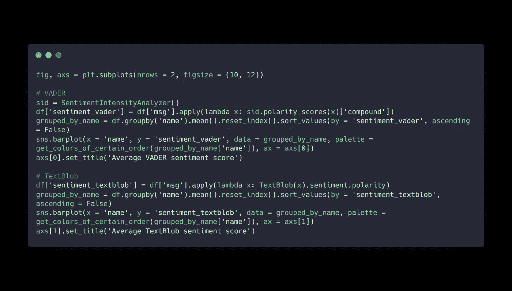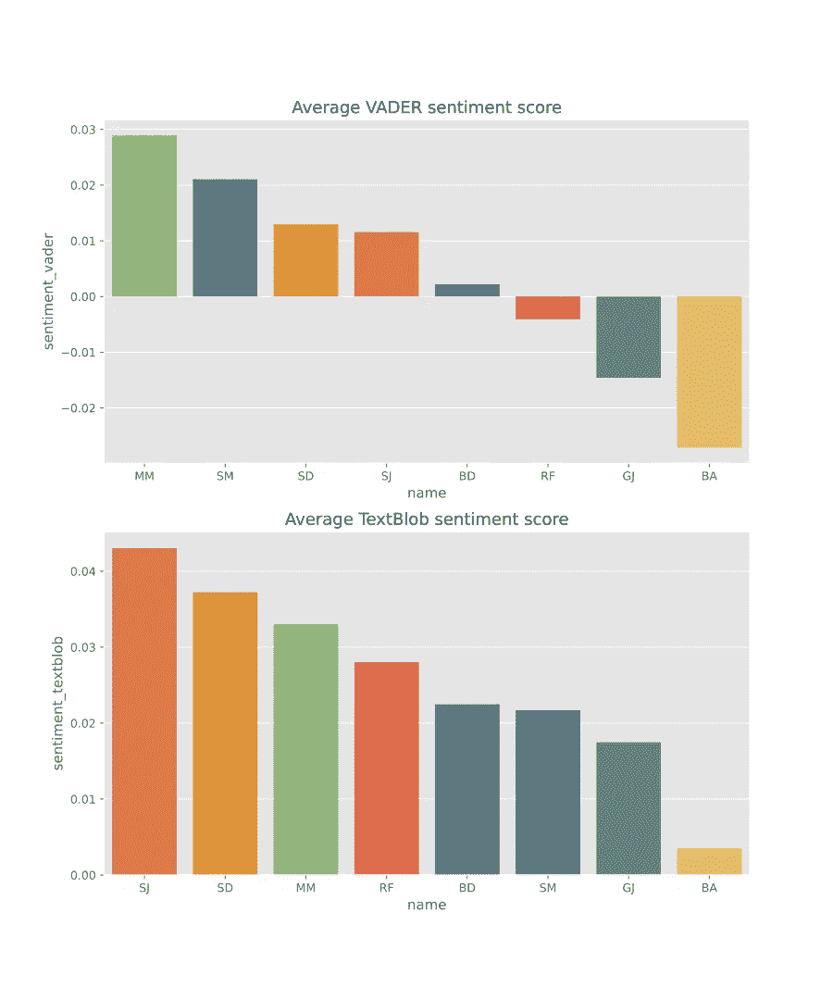

对于 VADER 来说，因为我们取情感的平均值，所以条平均在零左右，因为在有情感的文本中有许多中性文本。我们可以看到，骂人最多的巴，平均情绪最消极。RF 和 GJ 是第二和最渴望骂人的用户，然而，GJ 的负面情绪比 RF 多，这表明单单脏话并不能决定信息的负面情绪。VADER 对社交媒体上表达的情绪特别敏感，因为 WhatsApp 是一款社交媒体应用，我们可以相信这些情绪在某种程度上是准确的。

有趣的是，除了、巴和得分最低的前两名，TextBlob 对所有人进行了完全不同的情感排名。尽管 VADER 将 3 个人归类为平均负面情绪，但 TextBlob 返回的平均情绪都是正面的。

为了更深入地了解哪一个更准确，我们可以查看根据 VADER 和 TextBlob 的极性得分排序的消息，并直观地检查这些消息，以查看给出的情绪是否有意义。

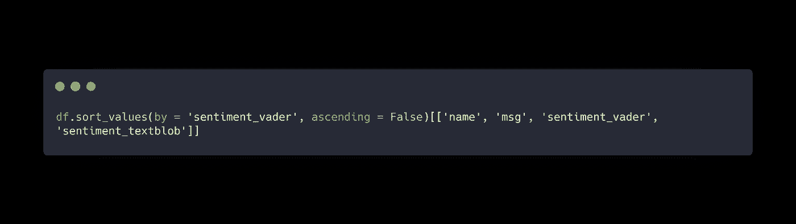

第一条消息看起来很有趣。让我们仔细看看。

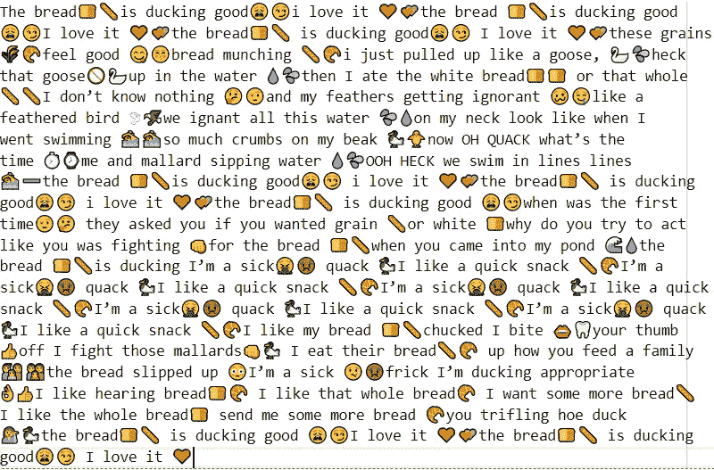

这是一个带有大量心形表情符号的表情符号，VADER 将其归类为具有最高积极情绪的表情符号，这是理所当然的。邮件的长度可能是造成这种情况的原因之一。然而，TextBlob 似乎只给了它一点积极的情绪。

上面列表中的第五条消息是一家公司的促销活动:

> 嗨，来自<redacted>的问候。这是关于那些参加过我们项目的人的新会员计划。我们正在为我们的公司寻找“学生大使”。如果你有兴趣，请通过 WhatsApp 或致电@<number>*对了，谁是学生大使？*他/她将在各自的机构中代表<redacted>。*他/她的职责是什么？*代表<redacted>在其机构内组织研讨会/竞赛/速成班/客座讲座。*作为大使，你得到了什么？*您可以免费参加我们的所有项目/活动。如果发现你有才华，你将被录用为实习生。最重要的是对你的研究或项目工作的支持和指导。在你完成学业后，你将继续成为<redacted>团队的一员。</redacted></redacted></redacted></number></redacted>

这一信息显然没有积极的基调，但 VADER 却给了它很高的极性分数。

让我们看看按 TextBlob 极性得分降序排序的消息。

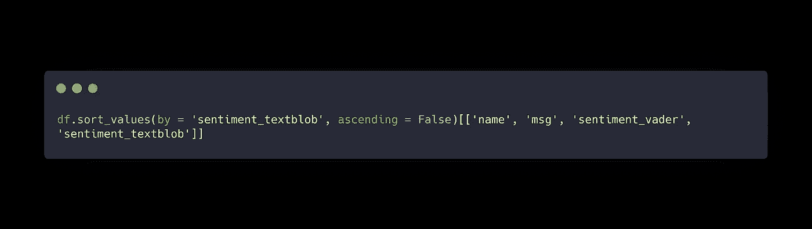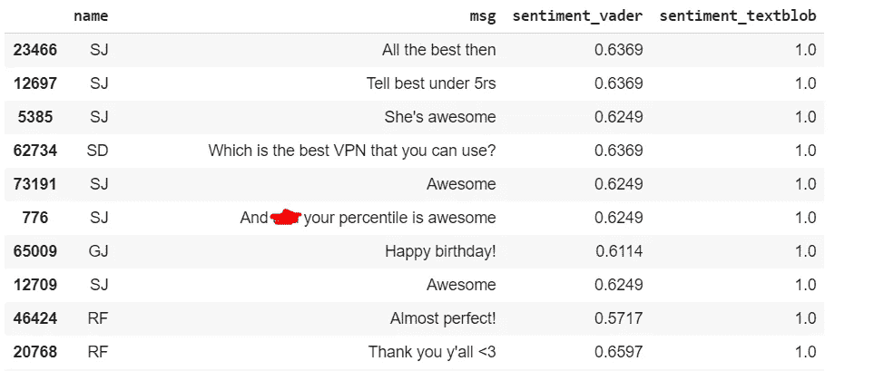

看起来 TextBlob 更适合短消息，因为它对短消息的积极情绪评分为 1.0。在所有邮件中，有 251 封邮件的正面情绪得分为 1.0。

总的来说，我认为我更喜欢 VADER 的观点，因为它似乎更适合长消息，并且特别适合社交媒体上表达的观点。

# 结论

那很有趣！看到人们的短信习惯和日常生活中的事件反映在文本中真的很有趣。我建议你看看我的代码，并将其应用到你自己的群聊中。然而，必须在数据帧创建部分进行一些修改。如果你有兴趣，给我发消息，我会帮你分类。

*感谢您的阅读！让我知道你对这篇文章的看法。*

# 密码