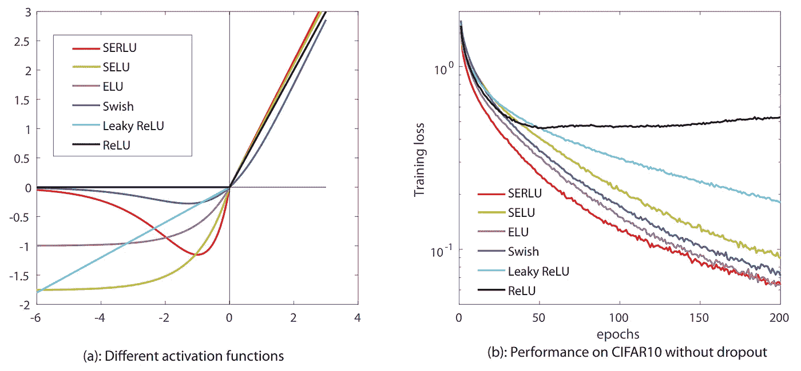

# 激活功能综合指南

> 原文：<https://towardsdatascience.com/a-comprehensive-guide-on-activation-functions-b45ed37a4fa5?source=collection_archive---------26----------------------->

## 对数据科学的许多曲线进行现代考察

自 2012 年以来，神经网络研究的进展主导了大多数人工智能(AI)文献，模型迅速接管了各种主题的基准。在这些创新的核心，激活函数在神经网络的效率和稳定性方面起着至关重要的作用。在这篇文章中，激活功能研究的最新发展水平将尽可能简要地概述，并清晰、实际地关注它们为什么被发明以及何时应该被应用。

paweczerwi ski 在 [Unsplash](https://unsplash.com?utm_source=medium&utm_medium=referral) 上的照片

# 目录

*   **为什么激活功能？** :
    -强制非线性
    -强制特殊数字属性
*   **雷鲁家族
    ——整流器:** [雷鲁](https://www.tensorflow.org/api_docs/python/tf/nn/relu)、 [LeakyReLU](https://www.tensorflow.org/api_docs/python/tf/nn/leaky_relu) 和 PReLU **——指数运算:** [ELU](https://www.tensorflow.org/api_docs/python/tf/nn/elu) 和[SELU](https://www.tensorflow.org/api_docs/python/tf/nn/selu) **——非单调运算:** [嗖嗖](https://www.tensorflow.org/api_docs/python/tf/nn/swish)和[塞鲁](https://arxiv.org/abs/1807.10117)
*   **特殊族
    -** [**线性**](https://www.tensorflow.org/api_docs/python/tf/keras/activations/linear) **:** 需要原始输出或融合运算时会用到 **-**[**Tanh**](https://www.tensorflow.org/api_docs/python/tf/math/tanh)**:**归一化回归+L1/L2 **-**[**Sigmoid**](https://www.tensorflow.org/api_docs/python/tf/math/sigmoid)**:**二元分类+二元交叉熵。 **-**[**soft max**](https://www.tensorflow.org/api_docs/python/tf/nn/softmax)**:**范畴分类+范畴交叉熵
*   **关闭**

# 为什么要激活函数？

简而言之，激活函数解决了神经网络中的两个关键问题:

1.  确保激活图是非线性的，因此是相互独立的；和
2.  确保某些输出具有基本的数字属性，例如，在[-1，1]范围内或者是有效的概率分布。

## 非线性

为了理解非线性激活图的需要，考虑下面两个函数: *f(x) = ax + b* 和 *g(x) = (c+d)x + (e + f)* 。前者只有两个常数，而后者有四个。问题是:它们实际上是两种不同的功能吗？

答案是否定的，“*(c+d)”*和“*a”*的表现力是一样的。如果你选择 *c = 10* 和 *d = 2* ，我可以选择 *a = 12，*我们会得到相同的结果。“(e + f)”和“b”也是如此。为了有效地拥有四个独立参数，它们必须不能组合。在数学术语中，这意味着参数之间的关系必须是*非线性的*。例如， *h(x) = sin(cx + d) + fx + e* 是一个有四个参数的非线性模型。

在神经网络中，如果层是线性的，两个连续的层将是可组合的。因此，它们实际上只是一层伪装。为了不是线性的，所有层都被传递到非线性函数中，例如 ReLU 和 Tanh 函数，将它们隔离到单独的功能单元中。

## 数字属性

当回答“是”或“否”的问题时，例如“图像中是否有人脸”，false 被建模为 0，true 被建模为 1。给定一个图像，如果网络输出是 0.88，我们说网络回答为真，因为 0.88 更接近于 1 而不是 0。然而，网络的输出可以是 2 或-7。怎么能保证它的答案会在[0，1]范围内呢？

为此，设计了几个激活函数来保证某些数值特性。对于二进制分类情况， *sigmoid* 函数( *σ(x)* )接受范围[-∞，∞]内的输入，并输出范围[0，1]内的值。同样，*双曲正切*函数( *tanh(x)* )将[-∞，∞]映射到[-1，1]。对于独热编码的分类数据， *softmax* 函数将所有值压缩到[0，1]区间，并确保它们的总和为 1。

通常，这些“数字属性”激活用于网络的最后一层，称为输出层，因为这通常是唯一需要特殊处理的层。对于所有其它的，使用更简单的非线性，例如 ReLU 族。虽然存在网络中间需要特殊激活的情况，例如在[对象检测](https://arxiv.org/abs/1506.02640)模型和[注意层](https://arxiv.org/abs/1706.03762)上使用的情况，但这些并不是标准情况，不在本文的讨论范围之内。

# 雷鲁家族

在上一节中，我们看到了为什么需要激活以及激活可以解决哪些问题。此外，我们注意到所有层都要求激活功能独立，但只有少数层需要特殊功能。对于所有普通层，通常使用 ReLU 系列的激活。

在进入肮脏的细节之前，我想强调的是，在 ReLU 类激活的领域中，使用其中一个而不是另一个并没有太多特定问题的理由。实际上，人们只是在一个循环中尝试十几个时期，看看哪个在他们的任务中表现最好。

也就是说，一个经验法则是在开发期间尽可能长时间地坚持原始的 ReLU 激活，如果您的模型表现不佳，请按照 [Tensorflow 2 文档](https://www.tensorflow.org/api_docs/python/tf/keras/activations/selu)中给出的建议跳到 SELU 激活(即使对于 PyTorch 用户也是如此)，并取消所有的批处理规范化。我知道这听起来有点刺耳，但它确实有效，可能会给你带来 5%到 10%的提升。

作为总结，下图总结了 ReLU 系列中最著名的激活，以及它们的图(左)和它们在 CIFAR-10 数据集上的性能(右)。

图 ReLU 系列中最广为人知的函数(左)及其在 CIFAR10 数据集上 200 个时期内各自的性能图(无遗漏)。摘自:[缩放的指数正则化线性单元(SERLUs)的有效性](https://arxiv.org/pdf/1807.10117.pdf)

## 整流器线性单元(ReLU)

整流器的数学定义是:

*ReLU(x) = max(0，x)*

在英文中，如果是正数，返回 *x* ，如果是负数，返回 0。

这是可能的最简单的非线性之一；计算最大值函数非常简单。ReLU 函数的早期用途之一来自于 [AlexNet 架构](http://papers.nips.cc/paper/4824-imagenet-classification-with-deep-convolutional-neural-networ)，它使用这种激活方式的训练速度几乎是更传统的 Tanh 函数的八倍。出于这个原因，直到今天，ReLU 系列激活是大多数层的事实上的选择，因为它们计算简单，但有效。双赢的局面。

此外，早期的神经网络被一个称为爆炸/消失梯度的问题所困扰。总之，在反向传播过程中，当您移回网络时，梯度会彼此相乘，因此具有大梯度的大梯度会使信号爆炸，而具有近零梯度的近零梯度会使信号消失。使用 ReLU 激活，只有两种可能的梯度:一是正部分，零是负部分。因此，关于激活函数在该问题上的作用，整流器有效地解决了爆炸问题，这可能是最糟糕的，同时产生了死梯度问题。

## 泄漏单元

大多数人第一次看到 ReLU 函数时提出的第一个顾虑是:负的部分真的被扔掉了吗？是的，它是。研究人员对此感到困惑，提出了 LeakyReLU。不要扔掉消极的部分，而是返回一个减少的版本。数学上:

*LeakyReLU(x) = max(0，x) + min(0.01⋅ x，0)*

这样，信号不会完全丢失，但会因*泄漏因子*而显著减弱。在实践中，这在某些情况下证明是有效的。此外，它还缓解了死梯度问题，允许至少一部分信号通过。在接下来的激活中，玩消极的部分是一个反复出现的主题。

下一次迭代是参数 ReLU，简称 PReLU。基本原理是:为什么是 0.01？相反，让我们引入一个α变量，让它是可训练的。这样，我们不需要自己定义泄漏系数；我们让网络自己学习最合适的值。在表达形式上:

*PReLU(x) = max(0，x) + min(αx，0)*

请记住，α变量不是全局变量。每个单位都有它的可训练α。这种激活展示了数据科学的思维方式:*如果可以让模型决定什么是最好的，为什么要自己设置呢？*

## 指数单位

继续追求更好的激活性能，2015 年底在[产生了对负部分使用指数函数的想法。*指数函数对于负值*是饱和的，这意味着它平滑地趋向于一个固定常数。使用它，我们可以更接近地模拟原始的 ReLU 函数，它在零处饱和，同时仍然在某种程度上保留负的部分。这是它的数学公式:](https://arxiv.org/abs/1511.07289)

*ELU(x) = max(0，x) + min(eˣ — 1，0)*

在许多情况下，ELU 函数是对原始 ReLU 函数的明显改进。相比之下，漏变量并不总是更好。

该领域的最新进展之一被称为缩放指数线性单元，或 SELU，其主要创新是*自规范化*。这意味着，当训练时，它将向输出零均值和单位方差的结果收敛。实际上，这使得批量规范化层变得过时。因此，使用 SELU 激活的模型更简单，需要的操作更少。最后，通过用神奇的常数简单地缩放正负部分，就可以实现自规范化属性。形式上:

*⋅最大值(0，x)+1.7580⋅min(eˣ-1，0)卢瑟(x)≈1.0507*

有关使用该激活函数和推导神奇常数的更多详细信息，请考虑阅读[论文](https://arxiv.org/abs/1706.02515)和[张量流文档](https://www.tensorflow.org/api_docs/python/tf/keras/activations/selu)。上面提到的常数是通过把原来的 SELU 表达式简化成更紧凑的形式而得到的。

## 非单调激活

到目前为止，ReLU 家族的所有激活都是单调递增的。在英语中，这意味着函数值只会增长。标志性的非单调函数有抛物线( *x* )和正弦函数( *sin(x)* )，抛物线上下周期性变化。

非单调激活的第一个成功提案是谷歌大脑团队的 [Swish 函数](https://arxiv.org/abs/1710.05941)，它被简单地定义为:

*F(x) = x ⋅ σ(x)*

σ(x)是 sigmoid 函数。虽然该表达式与 ReLU 函数不相似，但它们的图非常相似，正部分接近相同，负部分在零处饱和，负部分在零附近出现“凹陷”或“腹部”(图 1，蓝色)。这是通过“*自门控*机制实现的。基本上， *x* 是“信号”， *σ(x)* 是“选通函数”(在零点饱和的函数)，将 *σ* 应用于 *x* 并乘以 *x* 就是取信号并自己选通，这样，一个自选通操作。在团队实验中，他们发现对于非常深的网络(30+层)，这种激活优于 ReLU 功能。

最后， [SERLU 激活](https://arxiv.org/pdf/1807.10117.pdf)是对 SELU 函数的改进，保留了自归一化属性，同时包括一个自门控机制，以便在负值时在零处饱和。作者通过使用指数函数作为门控操作，而不是 sigmoid，并重新计算魔法常数来实现这一点。这导致函数的负端出现一个大的“下降”，类似于 Swish 函数，但更明显(图 1，红色部分)。形式上，SERLU 被定义为:

*塞卢(x) ≈ 1.0786 ⋅最大值(0，x) + 3.1326 ⋅ min(x⋅ eˣ — 1，0)*

注意 *x ⋅ eˣ* 和 *x ⋅ σ(x)* 之间的相似性。两者都是自门控机制。

截至 2020 年，现在判断这些非单调函数是否能够经受住时间的考验，并取代 ReLU 或 SELU 成为一个良好的通用替代方案还为时过早。然而，如果可以的话，我敢打赌，自规范化特性将会一直存在。

# 特殊家庭

如前所述，有些层需要特殊处理，超出了 ReLU 类激活所能提供的范围。对于这些层，使用线性、sigmoid、tanh 和 softmax 激活，其用例如下:

*   **线性**:当你需要网络的原始输出时使用。这对于融合运算很有用，例如 [sigmoid-crossentropy](https://www.tensorflow.org/api_docs/python/tf/nn/sigmoid_cross_entropy_with_logits) 和 [softmax-crossentropy](https://www.tensorflow.org/api_docs/python/tf/nn/softmax_cross_entropy_with_logits) ，它们在数值上更稳定，并且用于非标准化回归。此外，在理论分析中，这种激活对于调试和简化是有用的。
*   **Tanh** :用于归一化回归问题，其输出在[-1，1]范围内。通常与 L2 损失一起使用。
*   **Sigmoid** :见于二进制分类问题将输出压缩到[0，1]范围。几乎总是与二元交叉熵损失一起使用。
*   **Softmax** :在范畴分类上下文中看到，以强制网络输出是有效的概率分布。这意味着所有值都在[0，1]范围内，并且总和为 1。与分类交叉熵损失一起使用。

如您所见，给定一个问题，选择您应该使用哪个激活是很简单的。此外，所选函数提示了应该使用/考虑哪些损失函数。虽然这是一种简化，但作为一个起点是有用的。如前所述，一个经验法则是始终使用 ReLU 激活，为最后一层选择最合适的特殊函数，并在以后的迭代中，扩展这些初始选择并尝试替代公式。

最后，值得一提的是，对于某些问题，类并不是互斥的。在这种特殊情况下，单个输入可能会被标记为多个类。在这些情况下，每个类使用 sigmoid，而不是 softmax 激活。通过这种方式，所有输出都被压缩到[0，1]范围内，但不会强制累加到 1。

# 关闭

在这篇文章中，国家的最先进的激活功能进行了审查，与实际指导，使用和为什么。总之，激活用于使网络非线性化，并对输出图层实施特殊属性。对于内部层，使用 ReLU 系列，并且作为一个经验法则，尽可能长时间地坚持 ReLU 激活，然后切换到 SELU 激活，并移除所有批处理规范化操作。对于输出图层，考虑对非标准化/标准化回归使用线性/双曲正切激活，对二元/分类使用 sigmoid/softmax。

正如在任何指南中一样，总会缺少一些东西。在这里，我故意跳过了不太为人所知/使用过的选项，比如 *softplus* 、 *softsign* 和 relu6 函数。我选择这样做是为了让文章尽可能简短，而不影响流行的文章。如果您错过了正在讨论的任何激活功能，不同意某些东西或希望看到一些概念的扩展，请在评论部分让我知道，我将尽我所能保持这份文件的最新:)

如果您对本文有任何问题，请随时发表评论或与我联系。如果你刚接触媒体，我强烈推荐[订阅](https://ygorserpa.medium.com/membership)。对于数据和 IT 专业人士来说，中型文章是 [StackOverflow](https://stackoverflow.com/) 的完美搭档，对于新手来说更是如此。注册时请考虑使用[我的会员链接。](https://ygorserpa.medium.com/membership)

感谢阅读:)