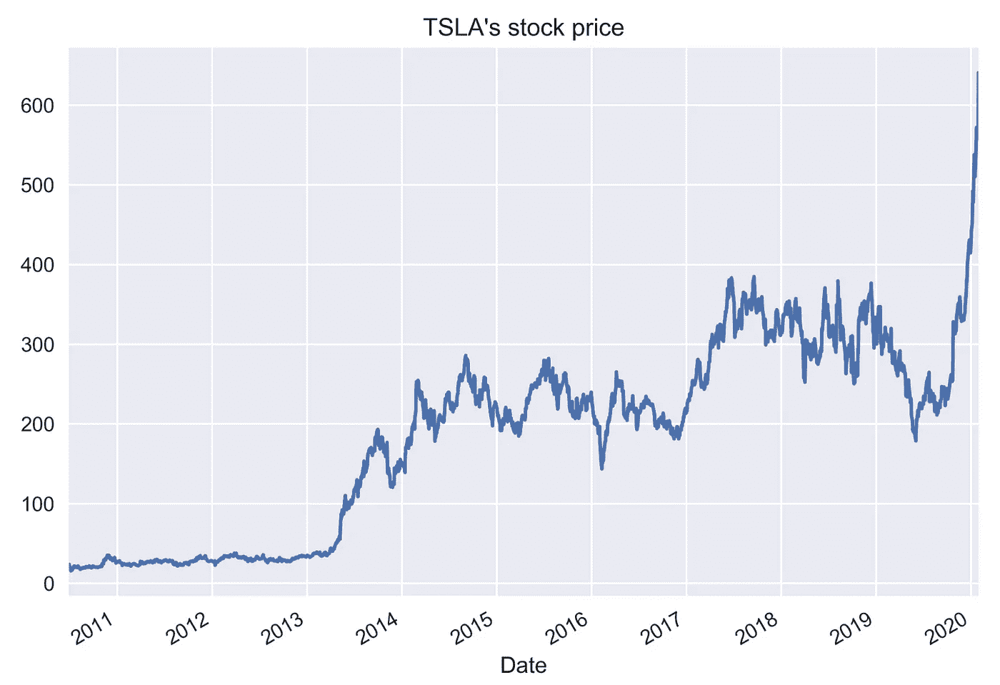

# 用 Python 下载股票价格的综合指南

> 原文：<https://towardsdatascience.com/a-comprehensive-guide-to-downloading-stock-prices-in-python-2cd93ff821d4?source=collection_archive---------0----------------------->


来源: [Unsplash](https://unsplash.com/photos/4fsCBcZt9H8)

## 下载历史股票价格，只有一行代码！

这篇短文的目的是展示用 Python 下载股票价格(和股票相关的数据)是多么容易。在本文中，我介绍了两种方法，都使用 Yahoo Finance 作为数据源。有许多替代产品(Quandl、Intrinion、AlphaVantage、Tiingo、IEX 云等)。)，然而，雅虎财经可以被认为是最受欢迎的，因为它是最容易访问的(免费且无需注册)。

第一种方法使用一个名为`yfinance`的库，这绝对是我所知道的最简单的方法。第二个是`yahoofinancials`，稍微复杂一点，但是，由于我们在下载数据方面付出了额外的努力，我们收到了更多与股票相关的数据。

让我们开始吧！

# 设置

我们需要加载以下库:

```
import pandas as pd
import yfinance as yf
from yahoofinancials import YahooFinancials
```

你可以`pip install`你错过的图书馆:)

# 使用 yfinance 下载股票价格

`yfinance`是一个非常方便的库，是我下载股票价格的必去库。它以前被称为`fix_yahoo_finance`。这个库的简短历史是作为对流行的`pandas_datareader`库的修复而开始的。随着时间的推移，Yahoo Finance 改变了 API，相关的功能被弃用。这时候`fix_yahoo_finance`被引入，再次使从雅虎财经下载数据成为可能。它既是`pandas_datareader`的补丁，也是一个独立的库。

事不宜迟，下面我展示如何快速下载特斯拉的股票价格:

运行代码会产生下表:


默认情况下，该函数下载每日数据，但是我们可以将`interval`指定为以下之一:1m、5m、15m、30m、60m、1h、1d、1wk、1mo 等等。下载数据的命令可以简化为一行:

```
tsla_df = yf.download('TSLA')
```

然而，我想展示如何使用函数的参数。我提供了所考虑的时间范围的开始和结束日期，并禁用了进度条(对于如此少量的数据，显示它没有意义)。我们可以通过提供一个列表(比如`[‘TSLA', ‘FB', ‘MSFT']`)作为`tickers`参数，一次性下载多种资产的股票价格。此外，我们可以设置`auto_adjust = True`，这样所有显示的价格都会针对潜在的公司行为进行调整，比如拆分。

除了`yf.download`函数，我们还可以使用`Ticker()`模块。下面我给出一个下载特斯拉股票价格全部历史的简短例子:

运行代码会生成以下图形:



使用`Ticker`模块的好处是我们可以利用连接到它的多种方法。我们可以使用的方法包括:

*   `info` —打印出一个 JSON，其中包含许多有趣的信息，比如公司的全名、业务摘要、所处的行业、上市的交易所(还有国家、时区)等等。同样值得一提的是，JSON 包括一些财务指标，如 [beta](https://en.wikipedia.org/wiki/Beta_(finance)) 系数。
*   `recommendations` —包含分析师提出的建议的历史列表
*   `actions` —显示股息和拆分等操作
*   `major_holders` —顾名思义，显示主要持有人
*   `institutional_holders` —显示机构持有人，如下图所示:


*   `calendar` —显示传入事件，如收益。我写了一篇关于从雅虎下载完整收益日历的最简单方法的文章。金融。

有关可用方法的更多信息，请务必查看`yfinance`的 [GitHub 资源库](https://github.com/ranaroussi/yfinance)。

# 使用 yahoofinancials 下载股价

本文中我想提到的第二个[库](https://github.com/JECSand/yahoofinancials)是`yahoofinancials`。虽然我发现使用这个库要求有点高，但是它提供了很多在`yfinance`中没有的信息。让我们从下载特斯拉的历史股价开始:

我们首先通过传递 Tesla 的 ticker 实例化了一个`YahooFinancials`类的对象。这样做了之后，我们就可以用各种方法提取有用的信息。我们从历史股票价格开始。这个方法的用法是不言自明的。需要注意的一点是，结果是一个 JSON。这就是为什么我必须运行一系列操作来提取相关信息并将 JSON 转换成一个`pandas`数据帧。运行该代码片段会导致:


获得历史股票价格的过程比`yfinance`的情况要长一点。现在是时候展示`yahoofinancials`的光芒了。我简要描述一下最重要的方法:

*   `get_stock_quote_type_data` —返回股票的大量一般信息，类似于`yfinance`的`info`。使用方法返回以下内容:


*   `get_key_statistics_data` / `get_summary_data` —这两种方法返回许多统计数据(如 beta、市净率等。)
*   `get_stock_earnings_data` —返回收益信息(年度和季度)以及公司将报告收益的下一个日期:


这种形式的 JSON 可能不是最易读的，但是它适合屏幕:)

*   `get_financial_stmts` —获取公司财务报表信息的有用方法

我展示了一个使用这个库下载单个公司信息的例子。然而，我们可以很容易地提供一个公司列表，这些方法将返回适当的 JSONs，其中包含每个公司所请求的信息。让我们看一个下载多家公司调整后收盘价的示例:

将数据放入`pandas` DataFrame 需要多一点的努力，然而，代码可以很容易地重用(对于`YahooFinancials`类的不同方法也有轻微的修改)。

# 结论

在本文中，我展示了如何轻松地从 Yahoo Finance 下载历史股票价格。我从使用`yfinance`库的一行程序开始，然后逐渐深入提取更多关于股票(和公司)的信息。使用上面提到的库，我们可以在雅虎财经网站上下载几乎所有可用的信息。

您可以在我的 [GitHub](https://github.com/erykml/medium_articles/blob/master/Quantitative%20Finance/downloading_stock_prices.ipynb) 上找到本文使用的代码。一如既往，我们欢迎任何建设性的反馈。你可以在[推特](https://twitter.com/erykml1?source=post_page---------------------------)或评论中联系我。

喜欢这篇文章吗？成为一个媒介成员，通过无限制的阅读继续学习。如果你使用[这个链接](https://eryk-lewinson.medium.com/membership)成为会员，你将支持我，而不需要额外的费用。提前感谢，再见！

我最近出版了一本关于使用 Python 解决金融领域实际任务的书。如果你有兴趣，我贴了一篇文章介绍这本书的内容。你可以在亚马逊或者 Packt 的网站上买到这本书。