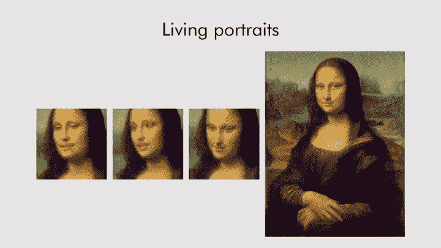
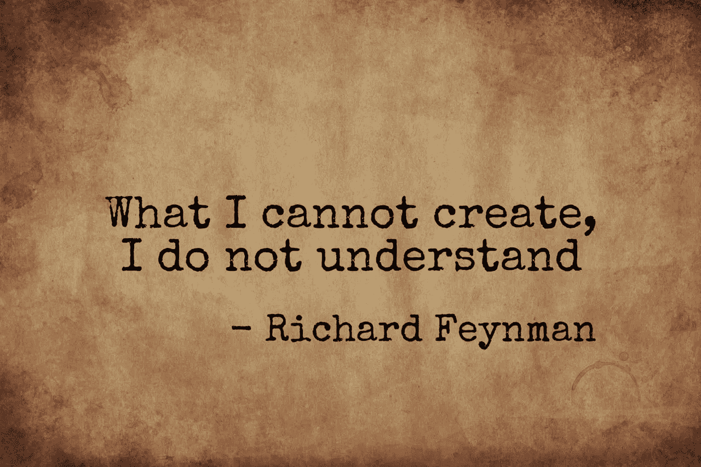
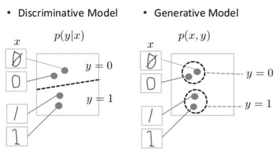
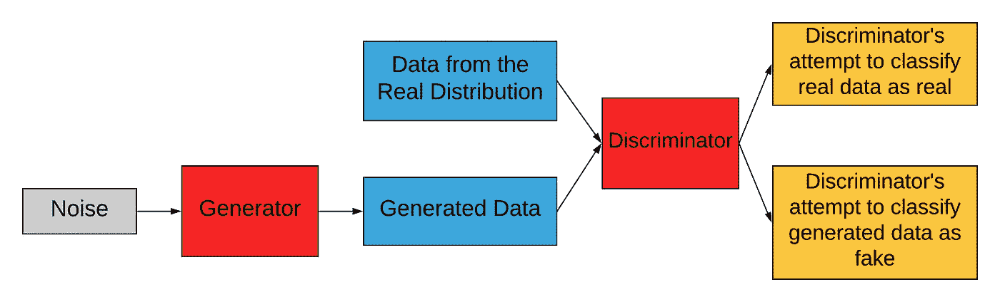
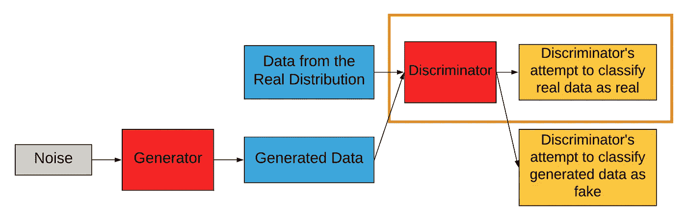
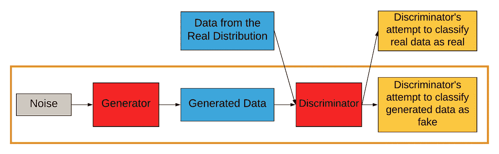
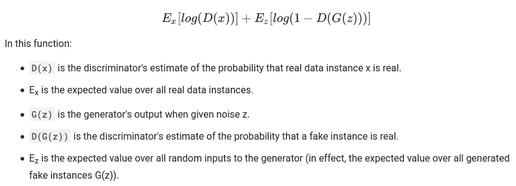

# 生成对抗网络综合指南

> 原文：<https://towardsdatascience.com/a-comprehensive-guide-to-generative-adversarial-networks-gans-fcfe65d1cfe4?source=collection_archive---------20----------------------->

## 从噪音中产生有意义的数据

《活的蒙娜丽莎》来自[现实神经说话头部模型的少数镜头对抗学习](https://arxiv.org/abs/1905.08233)

> 在我看来，这个(GANs)以及现在被提出的变体是 ML 过去 10 年中最有趣的想法
> 
> ——Yann le Cun(脸书副总裁兼首席人工智能科学家)在他的 [Quora 会议上](https://www.quora.com/What-are-some-recent-and-potentially-upcoming-breakthroughs-in-deep-learning)

gan 是深度学习的最新奇迹之一。这些能够*从垃圾数据中产生智慧*。他们可以用来生成图像，视频，改变图像和更多！GANs 最近的研究集中在制造[(人类的)深度赝品](https://www.youtube.com/watch?v=l82PxsKHxYc)并检测它们。

GAN 本质上是一种神经网络架构(与其说是架构，不如说是框架)，其中生成性模型与非生成性模型配对；生成模型因生成质量差而受到惩罚，而另一个模型因生成模型生成质量好而受到惩罚。所以在某种程度上，这些模特**竞争**来实现他们各自的目标。原文[论文](https://arxiv.org/abs/1406.2661)建议，

> 生成对抗网络只不过是一个通过对抗过程来估计生成模型的框架。

在本文中，我们将了解什么是 GANs，它们是如何工作的，并浏览一些它的用例。让我们先来看看主要内容:

# 内容

1.  **创成式 v/s 判别建模**
2.  **生成性对抗性**
3.  **几个使用案例(让你思考)**
4.  **结论**

# **生成式 v/s 判别建模**

图片由作者提供，背景由[像素提供](https://www.google.com/url?sa=t&rct=j&q=&esrc=s&source=web&cd=1&cad=rja&uact=8&ved=2ahUKEwiN9qm0sbjpAhWmxTgGHZF8AukQFjAAegQIDBAC&url=https%3A%2F%2Fwww.pexels.com%2F&usg=AOvVaw2VZkY_KeNePG2iFmQi8Fwl)

## 生成建模

任何涉及学习给定数据分布的趋势并生成非常类似或属于该分布的样本的建模都可以称为生成式建模。生成模型的一个非常常见的例子是根据前面的单词预测句子中的下一个单词。

关于文本生成的更多内容，你可以参考我的关于文本生成的文章

> 生成模型是具有联合概率分布 **P(X，Y)** ( **或者如果没有**Y**就只有 P(X)** )的统计模型，其中 X 是自变量，Y 是因变量。
> 
> **P(X，Y)** 可以读作变量 X **和** Y 的概率分布。

甘也是生殖模型。但与其他的不同，新颖之处在于它的训练评估手段，也就是对手。

## 判别建模

而判别模型是对来自给定分布的数据进行判别(分类)的模型。辨别一幅给定的图片中有一只猫还是一只狗是辨别建模最简单的例子。

> 判别模型可以正式表示为 **P(Y|X)** ，其中 X 为自变量，Y 为因变量。
> 
> **P(Y|X)** 可以解释为“给定事件 X 已经发生，事件 Y 发生的概率”。

在 GANs 中，歧视者引入了我们将在下一节讨论的“敌对”性质。

通过[谷歌开发者博客](https://developers.google.com/machine-learning/gan/generative)生成式 v/s 判别建模

# **生成性对抗性**

在这里，我们讨论 GANs 的实际架构，看看它是如何工作的。

典型的甘

甘人就是这样被训练的。借助一个例子，我们将一个接一个地处理这个架构。假设我们想从随机数据中生成**狗**的图像。

## 噪音

这是随机分布的数据。这是转换成所需分布的分布(是的！在后台，GANs 将一个分布转换成另一个分布(即，他们将一个统计函数映射到另一个)。

## 来自真实分布的数据

这是实际的、期望的分布。GAN 的最终目标是从前面小节提到的噪声中产生(转换)属于该分布的数据。在我们的示例中，这是一组真实的狗图像，我们在这些图像上训练模型。

## 鉴别器

鉴别器

这是 GANs 区别于其他生成模型的地方。将一个生成模型与一个鉴别模型结合起来就是 GANs 的全部内容。让我们看看它是如何工作的。

鉴别器的唯一目的是将图像分类为真或假。所以，鉴别器有两个功能:

1.  准确地将真实图像分类为真实的。
2.  准确地将假图像分类为假的。

在我们的例子中，鉴别器可以是一个基本的**基于 CNN 的二值图像分类器**。

> 但这里有一个问题，当我们训练鉴别器从假图像中“辨别”真实图像时，生成器被训练来欺骗鉴别器，使其落入陷阱，将生成的图像分类为真实图像。

是的，我在暗示，鉴别器只不过是一个可训练的评估指标，它告诉我们生成的数据质量有多好/多差。

好吧，我想现在你对两家网队是如何竞争的有所了解了。我们将在下一小节讨论发电机的工作原理。

## 发电机

发电机

这是氮化镓的主要成分。这里，生成网络试图学习分布的趋势，并生成属于该分布的数据。

那么我们如何做到这一点呢？这要看情况。在我们的例子中，为了生成狗的图像，我们的噪声将经历一些去卷积层，最后，输出将是一个图像，希望是一只狗的。生成的图像将被鉴别器分类为真或假。如果生成的图像远非“真实”,则生成器将受到损失更大的惩罚，并且随着它在欺骗鉴别器方面取得进展，损失将会减少。

这是发电机网络背后的基本思想。架构可能因用例而异。有一些 GAN 架构是有条件的，也就是说，除了噪声之外，还有一些生成数据的条件。这样的添加可能会改变一点架构，但对手的基本思想仍然存在。

我们现在继续发电机和鉴别器的集体训练。

## 将发生器和鉴别器组合训练为“GAN”

所以，甘是伟大的！但是生成器和鉴别器的组合训练带来了收敛问题。让我们看看 GAN 是如何训练的。

训练时，发生器应与鉴别器隔离，反之亦然。简而言之，首先对鉴别器进行几个时期的训练，然后对发生器进行训练，这一序列反复进行。这就保证了训练的方向是正确的。否则，同时训练这两者就像击中一个移动的目标，失败的可能性更大。

> 如果你不能训练一个分类器来区分真实数据和生成数据，甚至是初始的随机生成器输出，你就不能开始 GAN 训练。
> 
> — [谷歌开发者博客](https://developers.google.com/machine-learning/gan/generative)

此外，随着生成器越来越擅长欺骗鉴别器，作为一个推论，鉴别器的准确性会降低。当鉴别器达到精度 0.5 时，这表明鉴别器已经开始随机预测，即在掷硬币时(这显然是不应该的)。这对发电机培训没有任何帮助，反而可能降低其性能。

因此，GANs 的收敛并不稳定，这是一个主要问题。

## **培训损失**

GANs [论文](https://arxiv.org/abs/1406.2661)将培训损失定义为:

通过[谷歌开发者博客](https://developers.google.com/machine-learning/gan/generative)的 Minimax 损失

这是最小最大损失，鉴别器试图使其最大化，发生器试图使 *log(1 - D(G(z)))* 最小化，因为它不能触及 *log(D(x))。*

然而，[论文](https://arxiv.org/abs/1406.2661)还建议修改发电机的这一损耗，以使 *log(D(G(z))最大化。*

# 几个用例(让你思考)

*   普通的 GAN(GAN[论文](https://arxiv.org/abs/1406.2661)中描述的那些)可用于在不平衡或数据较少的情况下增加数据用于训练。
*   [深度卷积生成对抗网络或 DCGAN](https://arxiv.org/abs/1511.06434) 是具有用于图像生成的卷积层的普通 GAN
*   [pix2pix](https://arxiv.org/abs/1611.07004) 模型可用于将结构的线框作为输入，并生成完整的结构作为输出。其他应用包括黑白图像着色。
*   [CycleGAN](https://arxiv.org/abs/1703.10593) 用于将图像从一个域转换到另一个域，无需任何成对的训练样本
*   [DeepFake](https://arxiv.org/abs/1909.11573) 生成和检测是 GANs 的最新研究课题之一，本质上是生成经过编辑或篡改的图像，肉眼看起来很逼真。这可以在照片/视频编辑软件的帮助下很容易地手动完成，因此很容易被误用。DeepFake 检测可以作为生成的一个推论。

我将在以后的文章中尝试介绍其中一些 gan 的实现。敬请关注！

# 结论

这篇文章的主要内容是生成模型的对抗性训练评估的概念。这为研究人员提供了许多分支，以提出类似的评估器来获得更好的模型性能。

我们还看到了生成式和判别式建模的概念，以及它们之间的区别。

我们研究了 gan 的工作原理及其背后的想法。总的来说，我们采取了务实的方法；我们讨论了 GANs 的培训方面以及实际培训网络时出现的问题。

最后，我们谈了一些众所周知的甘斯风味。

# 参考资料:

原文：<https://arxiv.org/abs/1406.2661>

有关 GANs 的数学转换方面的更多信息，请参考:

 [## 理解生成敌对网络(GANs)

### 一步一步地建立导致 GANs 的推理。

towardsdatascience.com](/understanding-generative-adversarial-networks-gans-cd6e4651a29)  [## 简介|生成性对抗网络|谷歌开发者

### 生成对抗网络(GANs)是机器学习领域一项令人兴奋的最新创新。甘是生殖的…

developers.google.com](https://developers.google.com/machine-learning/gan)