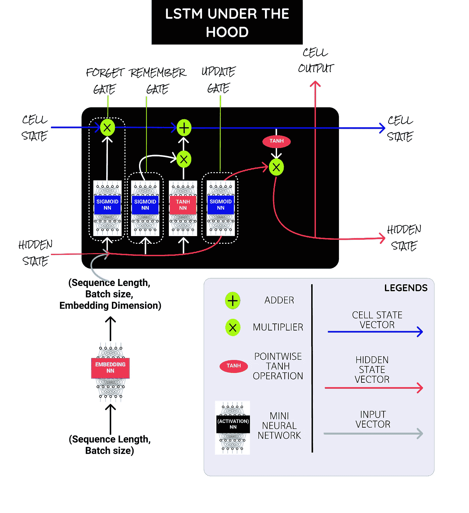
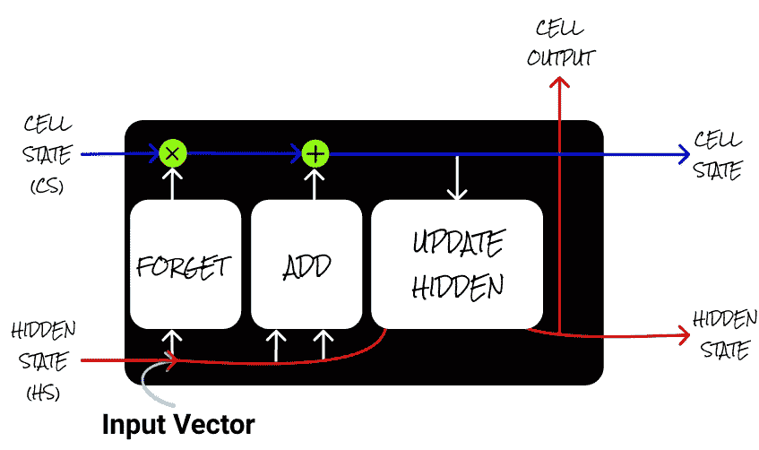
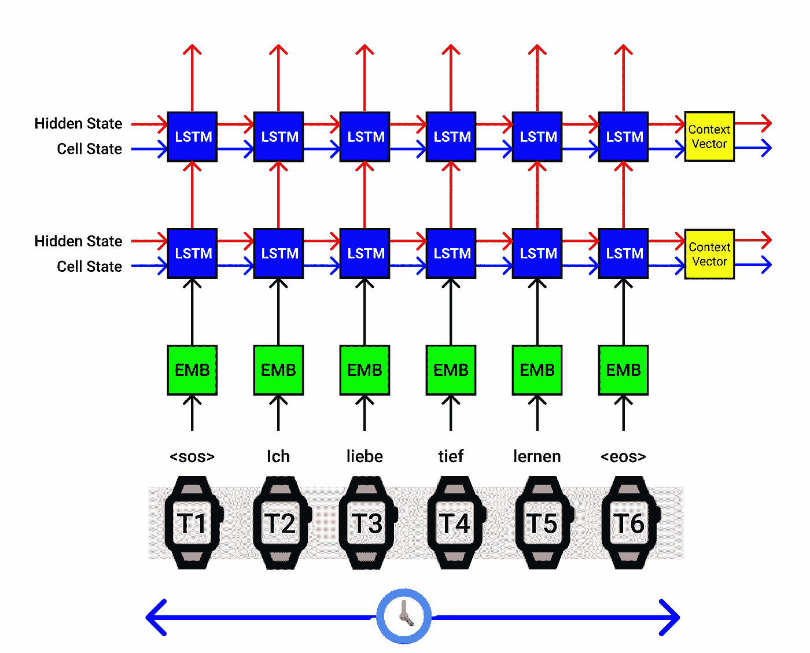
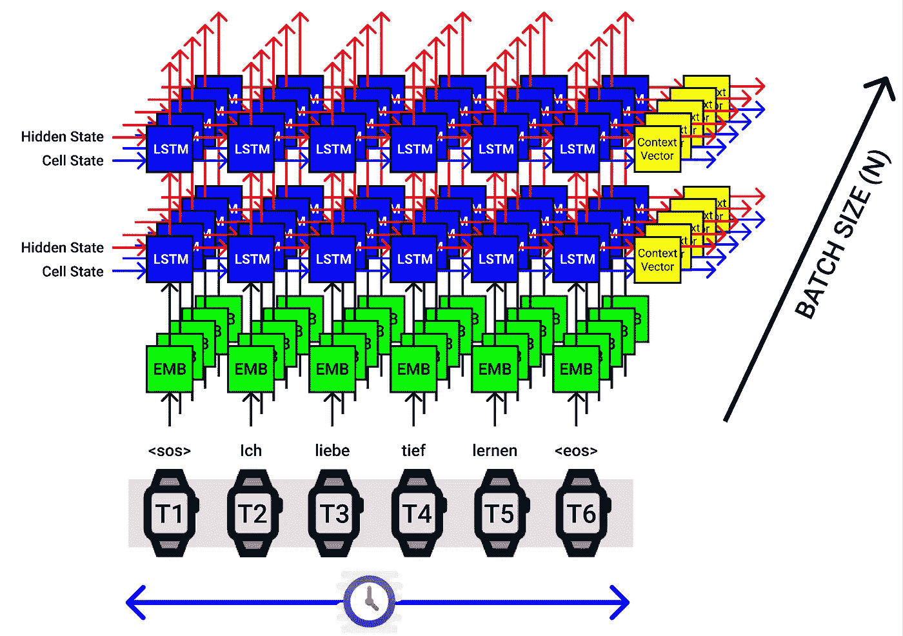
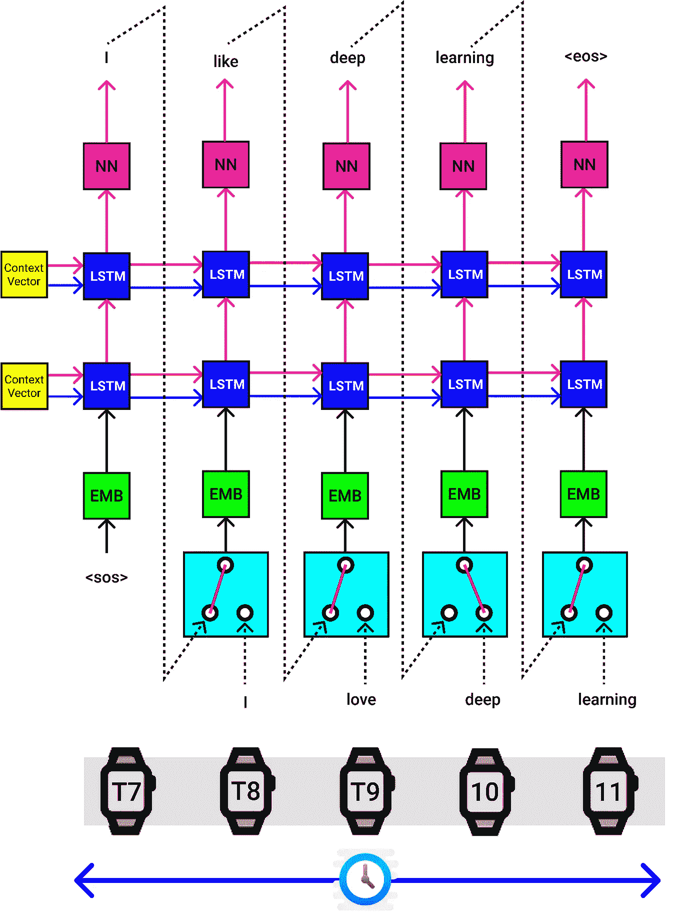
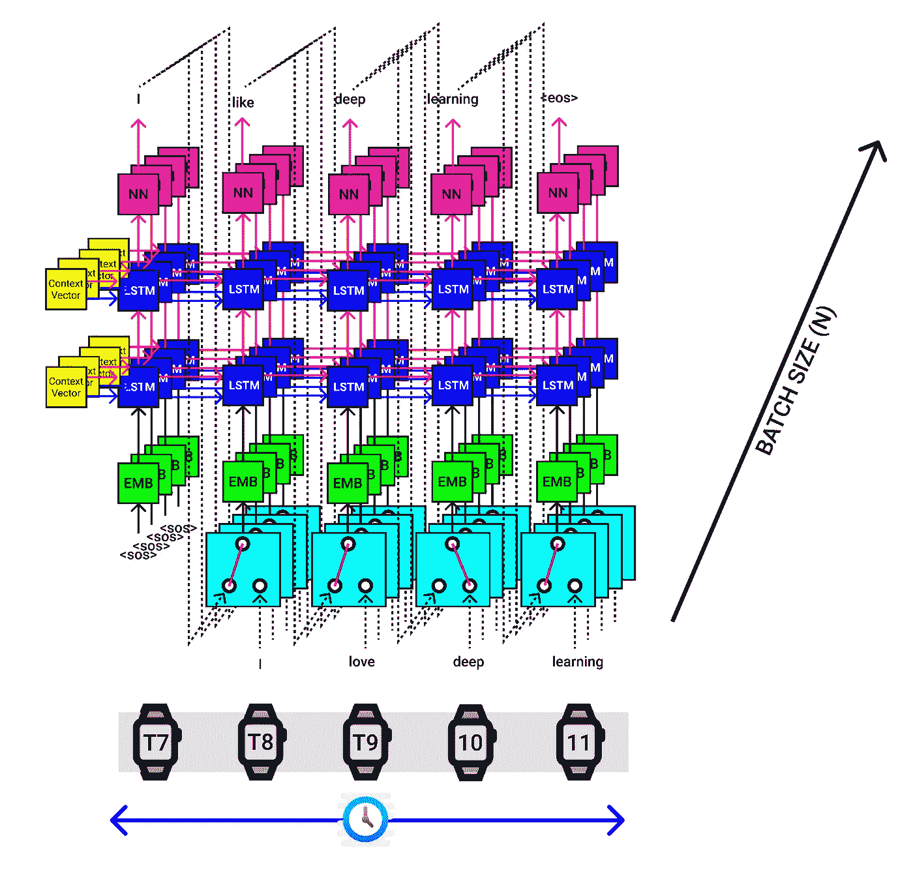
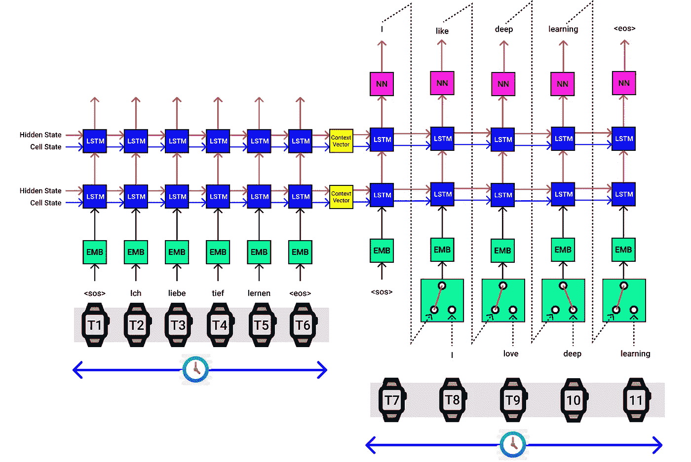
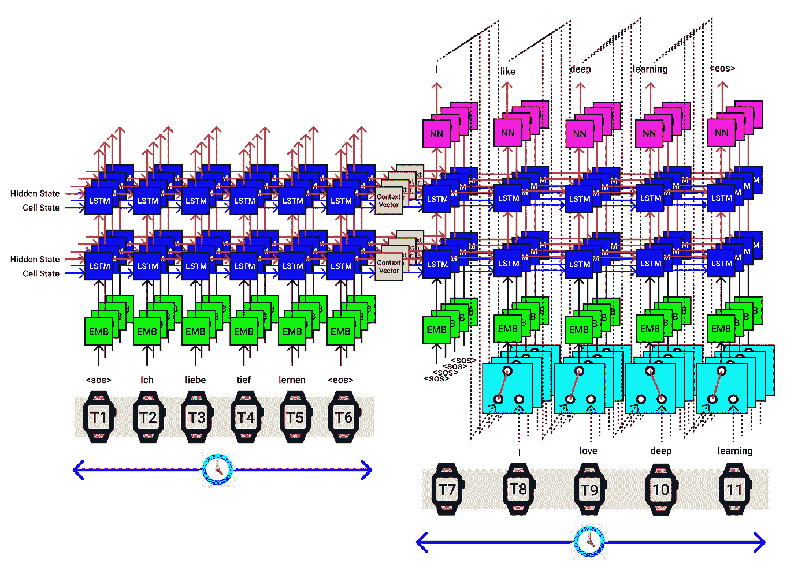
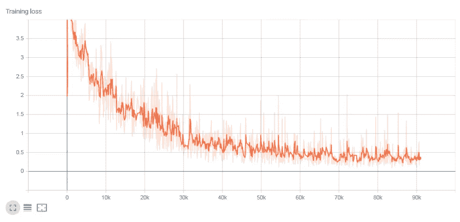

# 使用 PyTorch 进行 Seq2Seq 建模的神经机器翻译综合指南。

> 原文：<https://towardsdatascience.com/a-comprehensive-guide-to-neural-machine-translation-using-seq2sequence-modelling-using-pytorch-41c9b84ba350?source=collection_archive---------11----------------------->

## 在本帖中，我们将构建一个基于 LSTM 的 Seq2Seq 模型，该模型采用编码器-解码器架构，用于无注意机制的机器翻译。

# **目录:**

1.  [简介 ](#bfab)
2.  [*数据准备和预处理*](#a269)
3.  [*长短期记忆(LSTM) —引擎盖下*](#b0e2)
4.  [*编码器模型架构(Seq2Seq)*](#6756)
5.  [*编码器代码实现(Seq2Seq)*](#4ad4)
6.  [*解码器模型架构(Seq2Seq)*](#3dc9)
7.  [*解码器代码实现(Seq2Seq)*](#983a)
8.  [*Seq2Seq(编码器+解码器)接口*](#48ce)
9.  [*Seq2Seq(编码器+解码器)代码实现*](#2c97)
10.  [*Seq2Seq 模型训练*](#ebac)
11.  [*seq 2 seq*模型推断](#30b6)
12.  [资源&参考文献](#b38b)

# 1.介绍

> N **eural 机器翻译** (NMT)是一种机器翻译方法，它使用人工神经网络来预测单词序列的可能性，通常在一个单一的集成模型中建模整个句子。

对于计算机来说，用简单的基于规则的系统将一种语言翻译成另一种语言是最困难的问题之一，因为它们无法捕捉到翻译过程中的细微差别。然后不久，我们使用统计模型，但在深度学习进入后，该领域被统称为神经机器翻译，现在它已经取得了最先进的成果。

我希望这篇帖子对初学者友好，所以一种特定的架构(Seq2Seq)显示了成功的良好迹象，这就是我们在这里要实现的。

因此，本文中的序列到序列(seq2seq)模型使用一种编码器-解码器架构，该架构使用一种称为 LSTM(长短期记忆)的 RNN，其中编码器神经网络将输入语言序列编码为单个向量，也称为 ***上下文向量*** 。

这个 C ***上下文向量*** 据说包含了输入语言序列的抽象表示。

这个向量然后被传递到解码器神经网络，用于输出相应的输出语言翻译句子，一次一个单词。

我正在做一个德语到英语的神经机器翻译。但是同样的概念可以扩展到其他问题，例如命名实体识别(NER)，文本摘要，甚至其他语言模型等。

# 2.数据准备和预处理

为了以我们想要的最佳方式获取数据，我使用了 SpaCy(词汇构建)、TorchText(文本预处理)库和包含英语、德语和法语翻译序列的 multi30k 数据集

***Torch text*** 是一个强大的库，用于为各种 NLP 任务准备文本数据。它拥有对文本数据进行预处理的所有工具。

让我们看看它能做的一些过程，

1. ***训练/有效/测试分割*** :将你的数据分割到指定的训练/有效/测试集中。

2. ***文件加载*** :加载各种格式的文本语料库(。txt，。json，。csv)。

3. ***标记化*** :将句子拆分成单词列表。

4. ***Vocab*** :从文本语料库中生成词汇列表。

5. ***单词到整数映射器*** :将整个语料库的单词映射成整数，反之亦然。

6. ***词向量*** :将一个词从高维转换到低维([词嵌入](https://medium.com/towards-artificial-intelligence/create-your-own-mini-word-embedding-from-scratch-c7b32bd84f8e))。

7.*:生成样本的批次。*

*所以一旦我们理解了在 torch text 中可以做什么，让我们来讨论一下如何在 torch text 模块中实现它。这里我们将利用火炬文本下的 3 个类。*

*1. ***字段*** :*

*   *这是 torch text 下的一个类，在这里我们指定应该如何对我们的数据语料库进行预处理。*

*2.***tabular dataset***:*

*   *使用这个类，我们实际上可以定义以 CSV、TSV 或 JSON 格式存储的列的数据集，还可以将它们映射成整数。*

*3.*:**

*   **使用这个类，我们可以填充我们的数据以进行近似，并用我们的数据进行批处理以进行模型训练。**

**这里，我们的源语言(SRC —输入)是德语，目标语言(TRG —输出)是英语。我们还添加了 2 个额外的标记“序列开始”<sos>和“序列结束”<eos>，用于有效的模型训练。</eos></sos>**

**在设置了语言预处理标准之后，下一步是使用迭代器创建成批的训练、测试和验证数据。**

**创建批处理是一个详尽的过程，幸运的是我们可以利用 TorchText 的迭代器库。**

**这里我们使用 BucketIterator 来有效填充源句子和目标句子。我们可以使用。属性及其对应的(英语)数据批。trg 属性。此外，我们可以在标记数据之前看到数据。**

**我刚刚试验了 32 个批次的大小，下面显示了一个样本批次。句子被标记成单词列表，并根据词汇进行索引。“填充”令牌的索引为 1。**

**每一列对应一个句子，用数字索引，我们在单个目标批次中有 32 个这样的句子，行数对应于该句子的最大长度。短句用 1 填充以弥补长度。**

**下表(Idx.csv)包含该批次的数字索引，这些数字索引随后会被输入到 word embedding 中，并转换为密集表示以供 Seq2Seq 处理。**

**带索引的样本目标批次**

**下表(Words.csv)包含与批次的数字索引相对应的单词。**

**带单词的样本目标批次**

# **3.长短期记忆(LSTM)**

****

**LSTM——引擎盖下。来源—作者**

**上图显示了单个 LSTM 单元下的单元。我会在最后添加一些参考资料来学习更多关于 LSTM 的知识，以及为什么它对长序列很有效。**

**但是简单地说，香草 RNN，门控递归单元(GRU)由于其设计的性质而不能捕获长期依赖性，并且严重地受到消失梯度问题的影响，这使得权重和偏差值的变化率可以忽略，从而导致较差的泛化能力。**

**在 LSTM 单元中，我们有一组小型神经网络，在最后一层有 sigmoid 和 TanH 激活，以及一些向量加法、连接和乘法操作。**

*****Sigmoid NN****→压扁 0 和 1 之间的值。比方说，一个更接近 0 的值意味着忘记，一个更接近 1 的值意味着记住。***

******嵌入 NN*** →将输入的单词索引转换成[单词嵌入](https://medium.com/towards-artificial-intelligence/create-your-own-mini-word-embedding-from-scratch-c7b32bd84f8e)。***

*****TanH NN*** →挤压-1 和 1 之间的值。有助于调节向量值，使其不会爆炸到最大值或收缩到最小值。**

## **大门:**

****

**GATES 盖茨。来源—作者**

**但是 LSTM 有一些特殊的单元，称为门(记住(添加)门，忘记门，更新门)，这有助于克服前面提到的问题。**

1.  *****遗忘门*** →其中有 sigmoid 激活，取值范围在(0–1)之间，它在单元状态上乘以**以遗忘某些元素。(“向量”* 0 = 0)****
2.  *******添加门*** →其中有 TanH 激活，取值范围在
    (-1 到+1)之间，在单元状态上添加**以记住一些元素。(" Vector" * 1= "Vector ")******
3.  *********更新隐藏*** →根据单元格状态更新隐藏状态。******

******隐藏状态和单元状态在这里被称为 ***上下文向量*** ，其是来自 LSTM 单元的输出。输入是输入到嵌入神经网络的句子的数字索引。******

# ******4.编码器模型架构(Seq2Seq)******

******在开始构建 seq2seq 模型之前，我们需要创建编码器、解码器，并在 seq2seq 模型中创建它们之间的接口。******

******让我们通过德语输入序列“***Ich Liebe Tief Lernen***”翻译成英语的“ ***我爱深度学习*** ”。******

************

******LSTM 编码器架构。X 轴对应于时间步长，Y 轴对应于批量大小。来源—作者******

******为了更轻松，我们来解释一下上图中发生的过程。Seq2Seq 模型的编码器一次接受一个输入。我们输入的德语单词序列是“ich Liebe Tief Lernen”。******

******此外，我们在输入句子的开始和结尾添加了序列“SOS”的开始标记**和句子“EOS”的结束标记**。**********

********因此在********

1.  ********在时间步骤 0，发送“SOS”令牌，********
2.  ********在时间步骤 1，发送令牌“ich ”,********
3.  ********在时间步骤 2，发送令牌“Liebe ”,********
4.  ********在时间步骤 3，发送令牌“Tief ”,********
5.  ********在时间步骤 4，发送令牌“Lernen ”,********
6.  ********在时间步骤 4，发送令牌“EOS”。********

********编码器架构中的第一个模块是单词嵌入层(绿色模块所示)，它将输入索引单词转换为称为单词嵌入的密集矢量表示(大小为 100/200/300)。********

********然后，我们的字嵌入向量被发送到 LSTM 单元，在那里它与隐藏状态(hs)和前一时间步的单元状态(cs)组合，并且编码器块输出新的 hs 和 cs，其被传递到下一个 LSTM 单元。据了解，到目前为止，hs 和 cs 捕获了句子的一些矢量表示。********

********在时间步长-0，隐藏状态和单元状态或者完全由零或者随机数初始化。********

********然后在我们发送了 pass 我们输入的所有德语单词序列后，最终得到一个 ***上下文向量*** 【黄色块中所示】(hs，cs)，这是单词序列的密集表示，可以发送到解码器的第一个 LSTM (hs，cs)进行相应的英语翻译。********

******在上图中，我们使用 2 层 LSTM 架构，其中我们将第一个 LSTM 连接到第二个 LSTM，然后我们获得堆叠在顶部的 2 个 ***上下文向量*** 作为最终输出。这纯粹是实验性的，你可以操纵它。******

******我们必须在 seq2seq 模型中设计相同的编码器和解码器模块。******

******上述可视化适用于一批句子中的单个句子。******

******假设我们的批量大小为 5(实验性的)，那么我们将一次一个单词的 5 个句子传递给编码器，如下图所示。******

************

******批量大小为 5 的 LSTM 编码器。X 轴对应于时间步长，Y 轴对应于批量大小。来源—作者******

# ******5.编码器代码实现(Seq2Seq)******

# ******6.解码器模型架构(Seq2Seq)******

************

******LSTM 解码器架构。X 轴对应于时间步长，Y 轴对应于批量大小。来源—作者******

******解码器也是一次做一步。******

******来自编码器块的 ***上下文向量*** 被提供作为解码器的第一个 LSTM 块的隐藏状态(hs)和单元状态(cs)。******

*********句首“SOS”***令牌被传递到嵌入 NN，然后传递到解码器的第一个 LSTM 单元，最后，它通过一个线性层【显示为粉红色】，该层提供一个输出英语令牌预测概率( **4556 个概率**)【4556—如在英语语言的总词汇量中】、隐藏状态(hs)、单元状态(cs)。******

******从 4556 个值中选择具有最高概率的输出字，隐藏状态(hs)和单元状态(cs)作为输入被传递到下一个 LSTM 单元，并且这个过程被执行，直到它到达句子“EOS”的 ***结尾。*********

******后续层将使用先前时间步长的隐藏和单元状态。******

## ******示教力比率:******

******除了其他模块，您还可以在 Seq2Seq 架构的解码器中看到如下所示的模块。******

******在模型训练时，我们发送输入(德语序列)和目标(英语序列)。从编码器获得 ***上下文向量*** 后，我们将它们向量和目标发送给解码器进行翻译。******

******但是在模型推断期间，目标是基于训练数据的概括从解码器生成的。因此输出预测字作为下一个输入字被发送到解码器，直到获得<eos>令牌。</eos>******

******所以在模型训练本身中，我们可以使用**教导力比(tfr)** ，在这里我们可以实际控制输入单词到解码器的流动。******

************

******讲授力比法******

1.  *********我们可以在训练的时候把实际的目标词发送到解码器部分(以绿色显示)。*********
2.  *********我们还可以发送预测的目标词，作为解码器的输入(以红色显示)。*********

******发送单词(实际目标单词或预测目标单词)中的任何一个都可以用 50%的概率来调节，所以在任何时间步长，训练时都是通过其中一个。******

******这种方法的作用类似于正则化。以便模型在此过程中高效快速地训练。******

******上述可视化适用于一批句子中的单个句子。假设我们的批处理大小为 4(实验性的)，那么我们一次向编码器传递 4 个句子，编码器提供 4 组 ***、*** 上下文向量，它们都被传递给解码器，如下图所示。******

************

******批量大小为 4 的 LSTM 解码器。X 轴对应于时间步长，Y 轴对应于批量大小。来源—作者******

# ******7.解码器代码实现(Seq2Seq)******

# ******8.Seq2Seq(编码器+解码器)接口******

******单个输入句子的最终 seq2seq 实现如下图所示。******

1.  ******提供输入(德语)和输出(英语)句子。******
2.  ******将输入序列传递给编码器，并提取 ***上下文向量。*********
3.  ******将输出序列传递给解码器，来自编码器的*上下文向量产生预测的输出序列。*******

**************

*******单句 Seq2Seq 数据流图。来源—作者*******

*******上述可视化适用于一批句子中的单个句子。假设我们的批处理大小为 4(实验性的)，那么我们一次传递 4 个句子给编码器，编码器提供 4 组 ***、*** 上下文向量，它们都被传递给解码器，如下图所示。*******

************

******批量大小为 4 的 Seq2Seq。来源—作者******

# ******9.Seq2Seq(编码器+解码器)代码实现******

# ******10.Seq2Seq 模型训练******

## ******例句的训练进度:******

## ******培训损失:******

************

******培训流失呈现良好趋势。******

# ******11.Seq2Seq 模型推断******

******现在让我们比较我们的训练模型和 SOTA 谷歌翻译。******

************

******模型推理样本******

******不错，但是很明显这个模型不能理解复杂的句子。因此，在接下来的一系列帖子中，我将通过改变模型的架构来增强上述模型的性能，如使用双向 LSTM，添加注意力机制，或者用变形金刚模型替换 LSTM 来克服这些明显的缺点。******

# ******12.资源和参考******

******我希望我能够对 Seq2Seq 模型如何处理数据提供一些直观的理解，请在评论部分告诉我您的想法。******

******查看包含全部代码实现的笔记本，并随意破解它。******

******完整的代码实现可从以下网址获得:******

********@*GitHub*********

****** [## 巴拉语代码/自然语言处理

### permalink dissolve GitHub 是超过 5000 万开发人员的家园，他们一起工作来托管和审查代码，管理…

github.com](https://github.com/bala-codes/Natural-Language-Processing-NLP/blob/master/Neural%20Machine%20Translation/1.%20Seq2Seq%20%5BEnc%20%2B%20Dec%5D%20Model%20for%20Neural%20Machine%20Translation%20%28Without%20Attention%20Mechanism%29.ipynb) 

@**Colab**

 [## 谷歌联合实验室

### 编辑描述

colab.research.google.com](https://colab.research.google.com/github/bala-codes/Natural-Language-Processing-NLP/blob/master/Neural%20Machine%20Translation/1.%20Seq2Seq%20%5BEnc%20%2B%20Dec%5D%20Model%20for%20Neural%20Machine%20Translation%20%28Without%20Attention%20Mechanism%29.ipynb) 

@

* [## 神经机器翻译的 Seq2Seq 模型

### 使用 Kaggle 笔记本探索和运行机器学习代码|使用来自非数据源的数据

www.kaggle.com](https://www.kaggle.com/balakrishcodes/seq2seq-model-for-neural-machine-translation#12.-Seq2Seq-Model-Inference)* 

*对于那些好奇的人来说，本文中的*可视化是由[Figma](https://www.figma.com/)&[Google Drawing](https://docs.google.com/drawings/)实现的。**

*****完成可视化文件*** 在 ***Figma* 上创建(。图)**【LSTM，编码器+解码器，SEQ2SEQ】可用@ Github。**

** [## 巴拉语代码/自然语言处理

### 此时您不能执行该操作。您已使用另一个标签页或窗口登录。您已在另一个选项卡中注销，或者…

github.com](https://github.com/bala-codes/Natural-Language-Processing-NLP/blob/master/Neural%20Machine%20Translation/Visualizations_Figma_Files/FIGURES%20OF%20LSTM%2C%20ENCODER%2C%20DECODER%2C%20SEQ2SEQ.fig)** 

> **参考资料: [LSTM](https://colah.github.io/posts/2015-08-Understanding-LSTMs/) ，[文字 _ 嵌入](https://medium.com/towards-artificial-intelligence/create-your-own-mini-word-embedding-from-scratch-c7b32bd84f8e)，[深度 _ 学习 _ 模型 _ 部署 _ON_AWS](https://medium.com/datadriveninvestor/deployment-of-deep-learning-models-in-aws-using-aws-lambda-aws-api-gateway-aws-elastic-file-a48fdeb2c140)**

**在那之前，下次见。**

****文章作者:****

****BALAKRISHNAKUMAR V**********