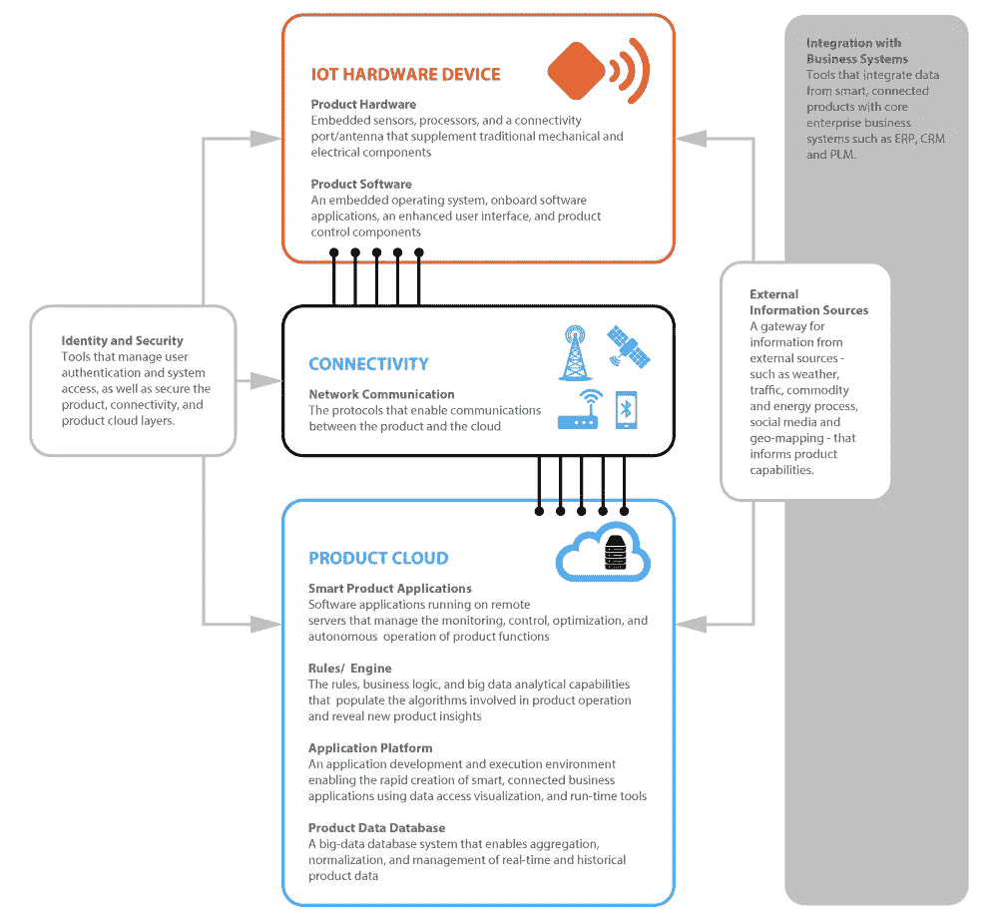
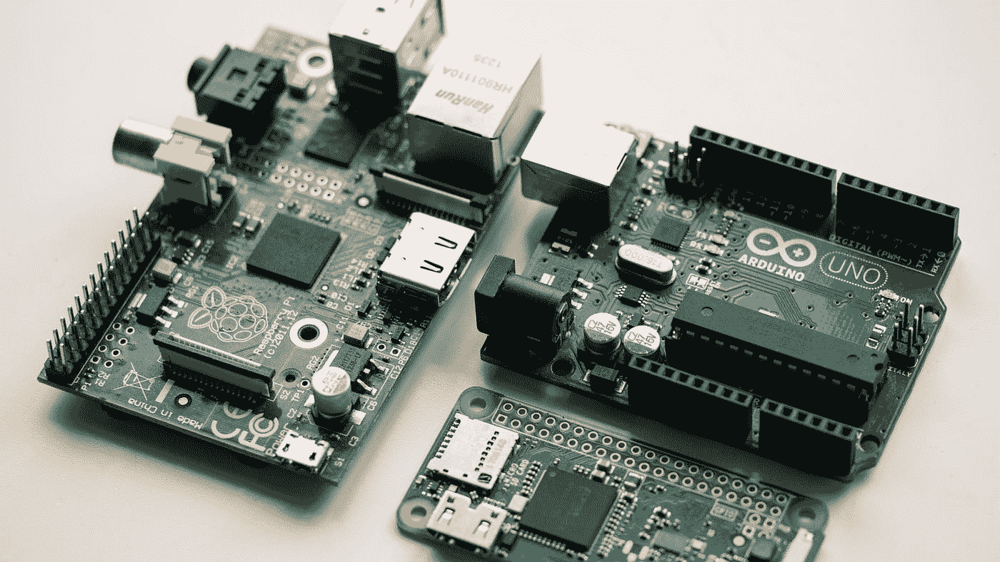

# 开始构建物联网产品的全面指南

> 原文：<https://towardsdatascience.com/a-comprehensive-guide-to-start-building-an-iot-product-ba32dfb91c7a?source=collection_archive---------7----------------------->

罗宾·格劳泽在 [Unsplash](https://unsplash.com?utm_source=medium&utm_medium=referral) 上的照片

## 当我开始开发我的第一个物联网项目时，我希望我有这样的指南

## **什么是物联网？**

我们举个简单的例子。**你的手机**。在它连接到互联网之前，它是哑的，真的是哑的。它只能播放你放在里面的歌曲。它只能给你有联系号码的人打电话。

> 然后神奇的事情发生了。我们把它连上了互联网

现在它可以播放任何歌曲。你不仅仅局限于一个联系号码来联系某人。您可以访问手中放不下数 TB 数据存储的信息。这就是连接互联网的力量。

互联网和智能手机，电脑确实是强大的工具，但智能手机不会给你的植物浇水，它不会打开你的门。这些设备的体能非常有限。

物联网旨在将互联网的力量从计算机和智能手机扩展到一系列其他事物、流程和环境。

## 我们如何做到这一点？我们如何将力量延伸到互联网？

通过在你周围的世界中放置能与物理世界互动和感知的组件，并将它们连接到互联网。这些组件是传感器和致动器的组合。

## **什么是传感器？**

简单来说，传感器测量的是一种物理属性。像温度传感器测量温度。

## **什么是执行器？**

你可以把执行器理解为传感器的对立面。就像传感器将外部变化转化为信号一样，执行器将信号转化为行动。就像打开门锁一样。

当然，对于这些传感器和致动器，您需要一些额外的硬件来控制它们，如果需要，还可以传输信息。

# **物联网改变世界**

物联网使您能够比以往更密切地监控联网设备并对其采取行动。无论是管理机器的行业、检查庄稼的农民、管理边境的政府，还是监控空气或水质的管理部门，都不需要每周手动检查一次或两次。

一切都是实时发生的！

想想当你没有牛奶时会提醒你的智能冰箱，或者当它们干了时会提醒你浇水的智能植物，这些可能性只限于你的想象。

我们已经看到物联网带来了如此巨大的变化

*   自动驾驶汽车
*   智能家居和工业安全
*   家庭自动化
*   健身追踪器、智能手表和可穿戴设备
*   自主高效农业

理解并想象一个物联网世界会是什么样子非常重要。这里有两个非常好的 Ted 演讲，可以帮助你想象物联网的未来世界

物联网:TEDxCIT 的约翰·贝瑞塔博士

物联网设计| Rodolphe el-Khoury | TEDxToronto

# 物联网项目的架构

物联网项目的架构

物联网项目有三个主要组成部分

*   **物联网硬件设备**:与环境交互的物理设备
*   **连接**:你的设备和云之间的链接
*   **产品云**:服务器获取数据，处理数据，存储在数据库中，发出命令，执行分析，以一种有用的方式向所有不同的参与者提供数据

您可能熟悉连接和云，因为它与任何网站和应用程序都一样。但在这里，您还将管理设备的硬件，这带来了额外的复杂性。

# 物联网硬件设备

这是物联网产品中最复杂、最独特的部分。您可能希望根据自己的需要创建一个特定于设备的。

对于智能灌溉系统，您必须添加传感器来检测湿度水平并与泵进行交互，但对于家庭安全系统，您需要传感器来检测运动或摄像头，并对入侵者进行处理，然后发出警报或通知。

人们需要选择或定制硬件组件来服务于特定的使用情形以及将在该硬件上运行的软件。

## 产品硬件

硬件将有一个负责逻辑执行的中央处理器/控制器，以及收集数据并根据命令行动的传感器和致动器。

将这个中央处理器/控制器视为负责所有逻辑的大脑，皮肤、眼睛、手、腿作为传感器和致动器，感知并向大脑报告，大脑发出命令，然后在此基础上执行一些操作。

基于这个中央单元，有基于微控制器的物联网板和基于微处理器的板。

**基于微控制器的**

*   **Arduino Uno，Mega** :易于开发，大量引脚可连接外设，非常适合原型开发
*   **ESP8266 / ESP32 板**:具有 WiFi 和蓝牙连接，低成本(ESP8266 成本约为 3 美元)，大量开发资源
*   **STM32F 系列板**:开发复杂，生产友好，易于制造，在生产中应用最广泛

**基于微处理器:**

*   **树莓派**:很棒的社区，容易开发，可以运行像 Linux，windows 这样的 OS
*   **小猎犬骨**:开源板，可以放 android、ubuntu 等 Linux，内置 flash 存储

raspberry pi model b、raspberry pi zero 和 Arduino Uno |照片由[哈里森·布罗德本特](https://unsplash.com/@harrisonbroadbent?utm_source=medium&utm_medium=referral)在 [Unsplash](https://unsplash.com?utm_source=medium&utm_medium=referral) 上拍摄

在这些板上，你会看到一个微控制器和微处理器(中间的大黑芯片)。此外，还有许多标有数字的别针。这些引脚是 IO 引脚，用于连接您想要使用的任何传感器或执行器。此外，如果您需要使用多个微控制器/微处理器，也可以设置它们之间的通信。

因此，只需选择适合您要求的电路板，使用这些 IO 引脚，您就可以随心所欲地使用任何传感器。你选择的任何传感器都可能与所有的电路板兼容。

传感器和致动器的一些例子是:

*   温度和湿度传感器
*   压力传感器
*   接近传感器
*   气敏元件
*   烟雾传感器
*   酒精传感器
*   超声波传感器
*   继电器:以电子方式闭合和断开电路(开关)
*   发动机

所以，假设你想建立一个火灾响应系统，你可以选择任何物联网板(Arduino，ESP8266)，连接烟雾传感器和洒水器的继电器开关。每当烟雾传感器探测到烟雾时，发出继电器命令启动喷水器。

当然你需要把这个逻辑写在某个地方。这就是产品软件出现的原因。

## 产品软件

由于代码需要专门针对微控制器或微处理器进行编译，并且由于缺少像 Linux、Windows 这样的操作系统(它抽象了硬件变量),用于开发的软件和工具在很大程度上取决于您选择的芯片。尽管有多种框架试图支持大量芯片。

你需要检查的东西

*   **Arduino 框架**:支持多种板卡和芯片，如所有 Arduino、ESP8266、ESP32、STM32 芯片
*   FreeRTOS :非常流行的微控制器操作系统，轻量级，支持多种芯片
*   **Amazon FreeRTOS** :亚马逊版本的免费 RTOS，无缝连接到 AWS 物联网云，并支持许多其他功能，如空中更新、供应
*   **Apache Mynewt** :专注于基于无线的物联网产品开发

此外，您选择的芯片制造商可能也有一些开发工具，如 STM 提供自己的开发工具，也可以在其芯片上进行开发。一定要检查一下。

如果您使用的是功能更强大的物联网主板，如 raspberry pi，它可以运行 Linux、Windows 等成熟的操作系统，那么当然可以归结为开发 Linux 或 Windows 应用程序。尽管你仍然需要做一些硬件交互来从传感器获取数据。

# 连通性

连接技术的选择取决于产品所处的环境。例如，大多数家庭物联网将使用 wifi，因为每个家庭都可以使用 WiFi，但如果您在城市中建立空气质量测量仪，WiFi 可能不可用，您可能会决定使用 GSM/GPRS。

现在，对于农业来说，你有数百个传感器分布在大片土地上，你会希望使用一些无线电通信到中央控制中心，然后在需要时将所有数据传输到互联网。

所以通信技术是基于用例来选择的。一些通信技术是:

*   **WiFi** :适用于家庭和办公室物联网设备等室内设施
*   **RFID/NFC** :最常见的使用案例是基于卡的访问控制
*   **GSM/GPRS** :用于户外独立设备
*   **蓝牙**:可穿戴设备和可使用智能手机控制的设备的最常见选择，也用于 wifi 配置(*为设备配置 wifi 凭证*)，还可以为多个设备创建蓝牙网格
*   **LoRaWAN** :适用于 3-5 公里范围通信的工业和公共基础设施产品，专为物联网设备设计，可在大范围内创建网关网络
*   **NB-IoT** :窄带物联网是一种蜂窝通信技术，专为物联网通信设计，功耗极低

接下来是**通信协议**，将用于设备和云之间的通信。

**消息通信协议**

*   **HTTP** :最容易获取，有很多开销，不同步，非常适合单个请求，不连续通信
*   HTTP WebSockets :基于 HTTP 因此开销很大，但是支持连续通信
*   **MQTT** :最常用的物联网协议(亚马逊 FreeRTOS 等大多数解决方案默认使用这个)，基于发布/订阅模型，非常轻量级，没有不必要的占用空间，非常灵活
*   **AMQP** :开源，面向消息，排队，路由，支持点对点和发布订阅模式

# 产品云

云是所有处理、分析和数据库驻留的地方。当云从数以千计的设备接收原始数据时，它需要转换数据、应用业务逻辑、以有利于检索的方式存储数据，并为物联网产品的应用提供动力。它还应该维护所有现场设备的状态和健康。推送空中更新以了解任何所需的更改，并跟踪哪些设备被更新，哪些设备被保留。

云还负责应用程序(应用程序和网站)与设备之间的交互。如果应用程序给出任何任务或命令，云负责将这些命令/任务发送到设备，并且还应该跟踪命令是否被成功执行。

要设计云架构，应该考虑这些因素

*   将消息接收层与处理层分开，以避免任何消息节流
*   始终考虑设备离线和故障
*   为空中更新做好准备(需求中总会有错误和变化)
*   所有通信都应该是安全的
*   设置一个认证系统，以便一旦设备不能发布另一个设备的消息，也不能订阅不允许它的频道
*   保持云中每个设备的当前状态
*   因为数据的大小很快就会变得巨大，所以选择一个伸缩性好的数据库

有许多云解决方案可供使用:

*   微软 Azure 物联网套件
*   谷歌云的物联网平台
*   AWS 物联网平台:与亚马逊 FreeRTOS 集成良好
*   沃森物联网平台

使用云将非常有益，因为它将防止许多设计错误，并且是在牢记最佳实践的基础上构建的。

你将被来自设备硬件、传感器、软件和通信的选择轰炸。你可以选择你想要的和你需要的。刚开始可能会有些不知所措，但是真的很有趣。