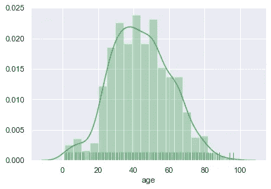

# Seaborn 数据可视化综合介绍:分布图

> 原文：<https://towardsdatascience.com/a-comprehensive-intro-to-data-visualization-with-seaborn-distribution-plots-888ff3436f36?source=collection_archive---------27----------------------->

## 基于 Python 的新冠肺炎疫情数据可视化

欢迎大家来到海波恩。在接下来的系列文章中，我将介绍 Seaborn 库的核心概念、它的优点以及如何和何时使用它。


[粘土银行](https://unsplash.com/@claybanks?utm_source=medium&utm_medium=referral)在 [Unsplash](https://unsplash.com?utm_source=medium&utm_medium=referral) 拍摄的照片

整个系列基于来自世界各地的不同冠状病毒数据集。我们将探索时间序列数据、人口统计数据、Corona 对不同行业的经济影响等等！所有数据集都是公开的。我们将一个接一个地探索它们，并熟悉如何探索个体变量之间关系的不同方法。

## 海生的

Python 中的库非常丰富，它们经常相互重叠。那么我们现在在哪里？Seaborn 构建在 Matplotlib 之上，它们在可视化地探索数据时可以很好地合作。该软件包以统计图形为导向，提供许多从置信区间或核密度估计开始的功能，称为 KDE。我们将在后面解释这些术语。除此之外，Seaborn 与熊猫合作得很好，它的数据帧结构。

我们可以说 Seaborn 是 Matplotlib 的统计扩展。该库提供了许多功能，旨在帮助您更好地理解您的数据。该图书馆将可视化和数据探索置于数据分析的中心。使该软件包与众不同的一点是，它提供了广泛的图表来分析多个变量之间的关系。Seaborn 还可以很好地处理分类变量，并显示聚合统计数据和计数图。
其他很酷的特性是二元图和多点网格。这些都是很好的工具，使您能够理解表格数据中看不到的潜在关系。您可以立即看到多个变量之间的相关性。
值得一提的还有分析数据集的样式和整体外观。各种不同的背景样式、调色板和其他自定义功能将增强您的受众对数据的理解。为了让你的见解更有影响力，你需要准确恰当地传达你的发现。Seaborn 有实用的工具来支持你。

## 海牛和熊猫

Seaborn 的设计可以很好地处理熊猫数据帧。值得一提的是，熊猫的数据集必须组织有序。在一个整洁的数据集中，每一行代表一个观察值，每一列都是可变的，通常称为要素。如果我们希望库正常运行，对数据的第一印象和理解是至关重要的。要确定数据集是否整洁，请尝试使用。头()和。tail()方法。

## Seaborn 对 Matplotlib

如果你在 python 代码中见过缩写 SNS，它指的就是 Seaborn。导入它和导入任何其他 python 库一样简单。与 seaborn 一起，我们还需要导入 Matplotlib lib Pyplot 来利用两者的协同作用。尽管大部分工作可能由 seaborn 完成，但 Matplotlib 增加了一些功能:

导入库:

```
import pandas as pd
import matplotlib.pyplot as plt
import seaborn as sns
import numpy as np
```

## 加载数据

主要数据源可从 Kaggle 获得:

[](https://www.kaggle.com/sudalairajkumar/novel-corona-virus-2019-dataset) [## 新型冠状病毒 2019 数据集

### 新冠肺炎受影响病例的日水平信息

www.kaggle.com](https://www.kaggle.com/sudalairajkumar/novel-corona-virus-2019-dataset) 

我们将从“COVID19_open_line_list.csv”开始，它包含冠状病毒个案的全球信息:

```
#loading the data
df = pd.read_csv("novel-corona-virus-2019-dataset 2/COVID19_open_line_list.csv")
```

让我们看看数据集是什么样子的:

```
#checking the structure
df.head()
```

输出:


```
#checking the shape
df.shape
```

输出:

```
(14126, 45)
```

让我们看看这些列:

```
#checking the columns
df.columns
```

输出:

```
Index(['ID', 'age', 'sex', 'city', 'province', 'country',
       'wuhan(0)_not_wuhan(1)', 'latitude', 'longitude',     'geo_resolution',
       'date_onset_symptoms', 'date_admission_hospital', 'date_confirmation',
       'symptoms', 'lives_in_Wuhan', 'travel_history_dates',
       'travel_history_location', 'reported_market_exposure',
       'additional_information', 'chronic_disease_binary', 'chronic_disease',
       'source', 'sequence_available', 'outcome', 'date_death_or_discharge',
       'notes_for_discussion', 'location', 'admin3', 'admin2', 'admin1',
       'country_new', 'admin_id', 'data_moderator_initials', 'Unnamed: 33',
       'Unnamed: 34', 'Unnamed: 35', 'Unnamed: 36', 'Unnamed: 37',
       'Unnamed: 38', 'Unnamed: 39', 'Unnamed: 40', 'Unnamed: 41',
       'Unnamed: 42', 'Unnamed: 43', 'Unnamed: 44'],
      dtype='object')
```

Dataframe 包含 45 列，具有许多不同的格式和数据类型。它以时间序列分析为导向，逐例描述冠状病毒。除了那些我们不确定它们代表什么的变量，我们也有明确的变量，我们在分析中探索这些变量。

重要的是，seaborn 的数据集必须整洁。因此，我们执行基本的数据转换:删除年龄的 nan 值，我们将绘制这些值，并删除范围和所有非数字值:

```
#keeping only numeric, not nan values and casting to integer type
df_age = df[df['age'].notna()]
df_age = df_age[df_age['age'].str.isnumeric()]
df_age['age'] = df_age['age'].astype(str).astype(int)
```

让我们从绘图开始:

## 有 Seaborn 的分布图

分析数据集时，您将一次从一个变量开始。查看数据的分布是单变量分析的一部分。为此，有分布图、散点图或直方图。

让我们绘制我们的第一个分布图，或者像在 Seaborn 中那样称为 distplot(年龄):

```
sns.distplot(df_age['age'])
plt.show()
```

输出:


为了比较 Seaborn 和 Matplotlib，让我们绘制相同的图形:

```
#plot the same histogram with matplotlib
df_age['age'].plot.hist()#show the plot
plt.show()
```

输出:


乍一看，我们可以看出 Seaborn 和 Matplolib 之间的区别。颜色是柔和的；我们在 Seaborn 中标记了 x 轴和更多有机定义的箱。除此之外，请看一条描述我们的分布的线，叫做核密度估计(KDE):

> 在统计学中，**核密度估计** ( **KDE** )是一种估计随机变量概率密度函数的非参数方法。核密度估计是一个基本的数据平滑问题，其中基于有限的数据样本做出关于总体的推断。

来源:https://en.wikipedia.org/wiki/Kernel_density_estimation

基于可视化，我们可以说大多数确诊病例在 35-55 岁之间。

在 Seaborn 中，您可以随时添加一些自定义内容:

*   设置样式
*   移除 KDE 图，因为 kde=False
*   或者改变颜色

```
#set sns style as sns.set()
sns.set()#create distplot without kde:
sns.distplot(df_age[‘age’], kde=False, color = 'y')#show the plot()
plt.show()
```

输出:


…或者将参数‘vertical’= True，使绘图垂直

```
#create vertical ditplot
sns.distplot(df_age['age'], kde = False, vertical=True, color="y")#show the plot()
plt.show()
```

输出:


如果你想从不同的角度看分布，Seaborn 还提供了一个 rub plot，它画出小垂直线来代表每个观察值。

```
#create ditplot with rugplot and 
sns.distplot(df_age['age'], rug=True, color="g")#show the plot()
plt.show()
```



一旦你完成了单变量分析，下一步就是理解两个或更多变量之间的关系。

理解两个变量之间分布的最常见图表是:

*   线形图
*   散点图
*   或配对图

在下一个练习中，我们将使用与已确诊、已康复和已死亡病例总数相关的数据集。同样来自 Kaggle- 'covid_19_data.csv '。

经过一些数据转换步骤后，我们得到了以下数据框架:

```
df_cases_a.head()
```


这些要素代表一个国家、一个大洲、观察日期、确诊病例、死亡病例和恢复病例。除了观察日之外，我们还对数据集进行了转换，以获得首例确诊病例的起始日。

如前所述，还有更多绘制图表的方法—在大多数情况下，您将使用。relplot()

该函数提供了对几个不同的轴级函数的访问，这些轴级函数通过子集的语义映射来显示两个变量之间的关系。`kind`参数选择要使用的底层轴级函数:

*   `**scatterplot()**`(同`kind="scatter"`；默认)
*   `**lineplot()**`(与`kind="line"`

## 线形图

让我们从折线图开始—折线图以直线连接的点的形式显示信息。折线图通常用于时间序列可视化或显示连续变量的趋势。让我们在这里画一个:

```
#create lineplot of ’day_since_first_confirmed’ and ’Confirmed’sns.relplot(x=’day_since_first_confirmed’, y=’Confirmed’,kind = ‘line’, data=df_cases_a)
```

输出:


我们在这里看到的是一条线，它连接了自全球范围内第一个患者被诊断患有新冠肺炎以来每天确诊的病例数。阴影区域是每次观察汇总数据时绘制的置信区间的大小。默认情况下，它是平均值，但可能会被标准偏差代替，设置 estimator=' std ':

```
#change estimator parameter to std
sns.relplot(x=’day_since_first_confirmed’, y=’Confirmed’,kind = ‘line’, data=df_cases_a, estimator = ‘std’)#show the plot
plt.show()
```


我们可以看到绝对值发生了变化，因为后台的计算发生了变化。我们将在下一个统计学系列中讨论标准差。

通常情况下，您希望在可视化中看到更多的值。您可以始终以颜色、标记和其他参数的形式添加尺寸:

```
#set hue=‘continent’ parameter and set ci=None
sns.relplot(x=’day_since_first_confirmed’, y=’Confirmed’,kind = ‘line’, data=df_cases_a, hue=’continent’, ci = None)#show the plot()
plt.show()
```

输出:


```
#set hue=‘continent’ parameter and set ci=None
sns.relplot(x=’day_since_first_confirmed’, y=’Confirmed’,kind = ‘line’, data=df_cases_a, hue=’continent’, ci = None)#show the plot()
plt.show()
```

我们看到的是，大多数确诊病例发生在北美，远远领先于任何其他大陆。

如果您想自定义您的绘图，您可以随时添加标记:

```
#set marker='o'.
sns.relplot(x='day_since_first_confirmed', y='Confirmed',kind = 'line', data=df_cases_a, hue='continent', marker='o', ci = None)#show the plot
plt.show()
```

输出:


为了更好地在图表中导航，在适当的位置放置标记通常是有用的。在这种情况下，由于极值，图表中的可见性和方向很麻烦。为了避免这种情况，我们可以使用对数函数，并为大陆的每个值添加不同的标记。设置 marker=True，style = ' continental'。

```
#add log_value of confirmed cases for all 3 variables
df_cases_a['log_value_confirmed'] = np.log(df_cases_a['Confirmed'])
df_cases_a['log_value_deaths'] = np.log(df_cases_a['Deaths'])
df_cases_a['log_value_recovered'] = np.log(df_cases_a['Recovered'])#set parameter markers to True and style='continent'
sns.relplot(x='day_since_first_confirmed', y='log_value_confirmed',kind = 'line', data=df_cases_a, hue='continent', style = 'continent', ci = None, markers = True)#show the plot
plt.show()
```

输出:


每个洲变量的值都得到了它的标记，以及确诊病例的规模，现在彼此之间是可比较的。当我们有强烈的*偏斜*分布时，应用对数变换。它有助于预测建模，以找到模式或使数据更好地解释。

## 散点图

让我们来看看两个变量之间的关系。比较两个变量及其分布的简便方法是用散点图。每个点代表一个观察。我们将看看 50 个国家中确诊、死亡和康复病例的最高值。要显示散点图，请设置 kind=' scatter ':

```
#plot a scatterplot with 'Confirmed' on x and 'Deaths' on y-axis
sns.relplot(x = 'Confirmed', y= 'Deaths', kind='scatter', data=df_cases_scatter)#show the plot()
plt.show()
```


散点图的解释相当简单。我们可以对死亡和确诊病例之间的关系做出假设。我们可以肯定地说，确诊病例越多，死亡就越多。我们将再次应用对数变换，因为我们仍然有偏斜的数据，并且大多数情况在左下角。

除了对数变换，我们再来增加维度。使用“col”参数，您可以单独显示变量的值。让我们将 col = ' continental '和 col_wrap=3 设置为每行只有三个图:

```
#plot a scatterplot with 'Confirmed' on x and 'Deaths' on y-axis
sns.relplot(x = 'log_value_confirmed', y= 'log_value_deaths', kind='scatter', 
            data=df_cases_scatter, col='continent', col_wrap=3)
#show the plot()
plt.show()
```

输出:


在分析中包含维度可以帮助您获得对数据的全面理解。我们可以假设为什么大洋洲的数字如此之低，为什么美国和欧洲受到如此严重的影响，等等。

通过设置 hue = ' continental '，size='log_value_recovered '或设置 markers=True 和 style = ' continental ',可以获得简化但信息更丰富的图，同时具有更多维度:

```
#assign 'continent' to hue and log_value_recovered to size
sns.relplot(x = 'log_value_confirmed', y= 'log_value_deaths', kind='scatter', 
            data=df_cases_scatter, hue ='continent', size = 'log_value_recovered')#show the plot
plt.show()
```

输出:


此外，设置标记=真，样式=“大陆”和 alpha=0.8 (80%)以获得更好的可解释性:


对群体观察应用不同的颜色或标记来提供更详细的信息是很常见的。我们还可以根据具体值给出每个点的大小，并创建一个气泡图。

## 联合地块

Seaborn library 还提供了下一级分布图——联合图。联合阴谋。Seaborn 的联合图显示了两个变量之间的关系以及它们的共同分布和个别分布。要创建一次，只需使用。接合图():

```
#jointplot of log_value_confirmed and log_value_deaths
sns.jointplot(x=’log_value_confirmed’,y=’log_value_deaths’,
data=df_cases_scatter)#show the plot
plt.show()
```


默认情况下，联合图显示为散点图，分布为 log_value_confirmed 和 log_value_deaths。当你想在一个图表中检查单个分布和所有分布时，这是很方便的。

有几种不同的联合绘图图表样式，如:

*   reg 图
*   十六进制图
*   KDE 图

```
#jointplot of log_value_confirmed and log_value_deaths, regression
sns.jointplot(x=’log_value_confirmed’,y=’log_value_deaths’,data=df_cases_scatter, kind=’reg’, color=’y’)#show the plot
plt.show()
```


```
#jointplot of log_value_confirmed and log_value_deaths, hex
sns.jointplot(x=’log_value_confirmed’,y=’log_value_deaths’,data=df_cases_scatter, kind=’hex’, color=’b’)#show the plot
plt.show()
```


```
#jointplot of log_value_confirmed and log_value_deaths, kde
sns.jointplot(x=’log_value_confirmed’,y=’log_value_deaths’,data=df_cases_scatter, kind=’kde’, color=’g’)#show the plot
plt.show()
```


密度图是直方图的升级版。如果您有相当多的观察值，并且散点图绘制过多，建议使用密度图，它在较小的区域内计算观察值的数量。该区域通常由六边形、正方形等形状定义。另一种更先进的方法是绘制 KDE 并显示其轮廓。

我们已经介绍了如何可视化变量分布的大多数方法。对于一些具体的案例，我们将在下一篇文章中详细讨论，比如回归图。

***编者按:*** [*走向数据科学*](http://towardsdatascience.com/) *是一份以数据科学和机器学习研究为主的中型刊物。我们不是健康专家或流行病学家，本文的观点不应被解释为专业建议。想了解更多关于疫情冠状病毒的信息，可以点击* [*这里*](https://www.who.int/emergencies/diseases/novel-coronavirus-2019/situation-reports) *。*

在 LinkedIn 上关注我

[](https://www.linkedin.com/in/filipdzuroska/) [## Filip Dzuroska —数据科学家—第一集团 IT | LinkedIn

### 在世界上最大的职业社区 LinkedIn 上查看 Filip Dzuroska 的个人资料。菲利普有一份工作列在他们的…

www.linkedin.com](https://www.linkedin.com/in/filipdzuroska/) 

还有推特:

[](https://twitter.com/filipdzuroska) [## 菲利普·朱罗斯卡

### 菲利普·祖罗斯卡(@菲利普·祖罗斯卡)的最新推文。数据科学家，加州大学洛杉矶分校机器方面的研究生研究员…

twitter.co](https://twitter.com/filipdzuroska) 

来源:

[](https://seaborn.pydata.org/index.html) [## seaborn:统计数据可视化— seaborn 0.10.0 文档

### Seaborn 是一个基于 matplotlib 的 Python 数据可视化库。它为绘图提供了一个高级接口…

seaborn.pydata.org](https://seaborn.pydata.org/index.html) [](https://www.kaggle.com/sudalairajkumar/novel-corona-virus-2019-dataset) [## 新型冠状病毒 2019 数据集

### 新冠肺炎受影响病例的日水平信息

www.kaggle.com](https://www.kaggle.com/sudalairajkumar/novel-corona-virus-2019-dataset) [](http://python-graph-gallery.com/) [## Python 图表库

### 欢迎来到 Python 图表库。该网站展示了数百张图表，始终提供可复制的 python…

python-graph-gallery.com](http://python-graph-gallery.com/)