# 神经网络综合介绍

> 原文：<https://towardsdatascience.com/a-comprehensive-introduction-to-neural-networks-291ce078442f?source=collection_archive---------35----------------------->

## 从零到工作实现

在 Flickr 上由[迈克·麦肯齐](https://www.flickr.com/photos/mikemacmarketing/)拍摄的图片

人工神经网络，我们文章的主题，是受生物神经网络启发并试图模仿它们的数学模型。由于生物神经网络是针对特定任务的更多神经元的组合，因此人工神经网络是通常称为人工神经元或感知器的更多线性模型的组合。如果你想了解更多关于感知器，这是最简单的神经网络，你可以在这里阅读更多关于它的[。](/perceptron-explanation-implementation-and-a-visual-example-3c8e76b4e2d1)

神经网络通常直观地表示为类似图形的结构，如下所示:

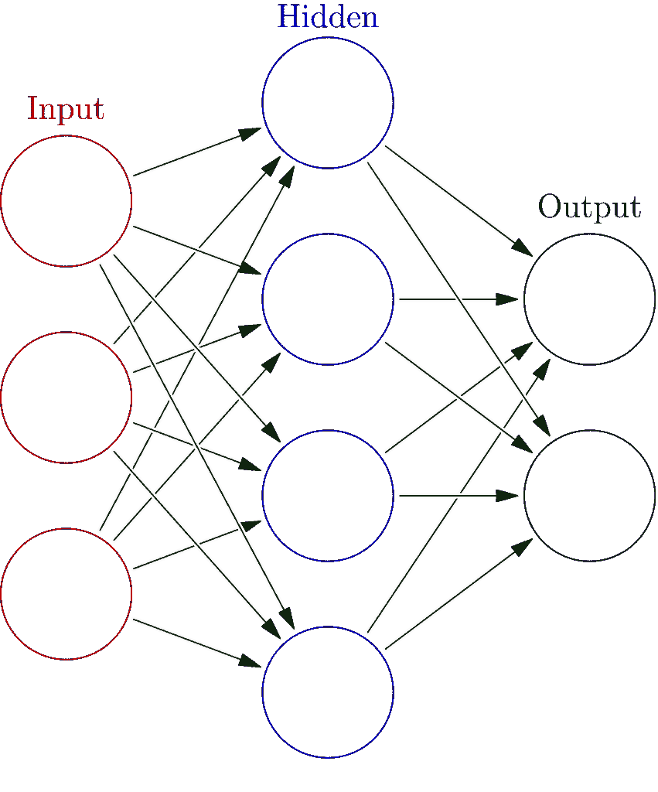

[图片](https://commons.wikimedia.org/wiki/File:Colored_neural_network.svg)由 Glosser.ca / CC BY-SA 在[维基共享](https://commons.wikimedia.org/)

上面是一个有 3 层的神经网络:输入层、隐藏层和输出层，由 3、4 和 2 个神经元组成。
输入图层的结点数量与数据集的要素数量相同。对于隐藏层，你可以自由选择你想要多少个节点，你可以使用多个隐藏层。那些具有一个以上隐藏层的网络被称为**深度神经网络**，并且是**深度学习**领域的主要特征。只有一个隐藏层的网络通常被称为**浅层神经网络**。输出层的神经元数量应该与您想要预测的变量数量一样多。

还有更多种类的神经网络:卷积、递归、脉冲神经网络等等。但这里我们将只讨论简单的前馈神经网络或多层感知器。

神经网络可用于广泛的问题，包括分类和回归任务。为简单起见，在本文的大部分内容中，我们将只关注分类任务，正如我们将在后面看到的，我们通过本文了解到的关于神经网络的东西可以很容易地转化为回归问题。

除了输入层中的神经元之外，网络中的每个神经元都可以被认为是一个线性分类器，它将前一层中神经元的所有输出作为输入，并计算这些输出加上一个偏差项的加权和。然后，下一层中的神经元将把前一层线性分类器计算的值作为输入，然后计算这些值的加权和，等等。我们的希望是，通过以这种方式组合线性分类器，我们能够构建更复杂的分类器，可以表示我们数据中的非线性模式。

让我们看看下面的例子:

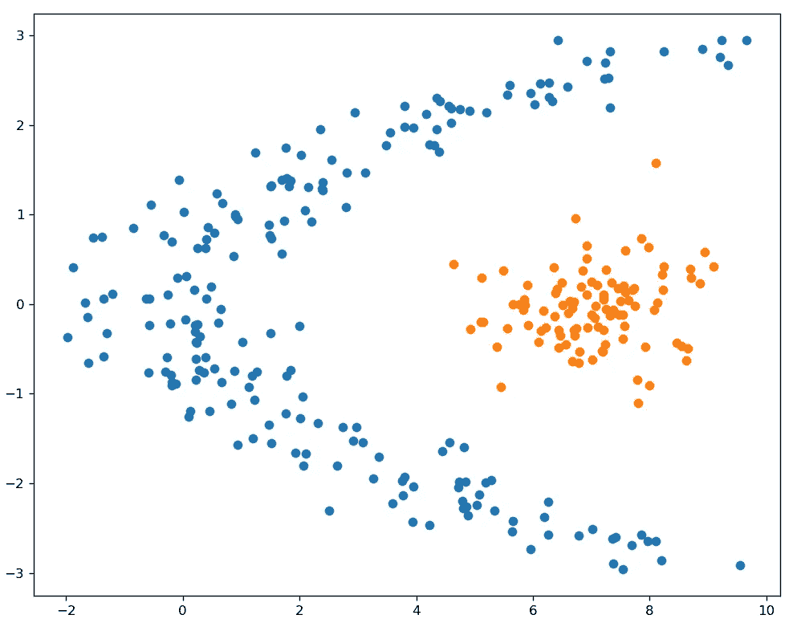

这个数据集显然不是线性可分的，我们不能用一条线将一个类与另一个类分开。但是我们可以通过使用 2 条线作为判定边界来进行这种分离。

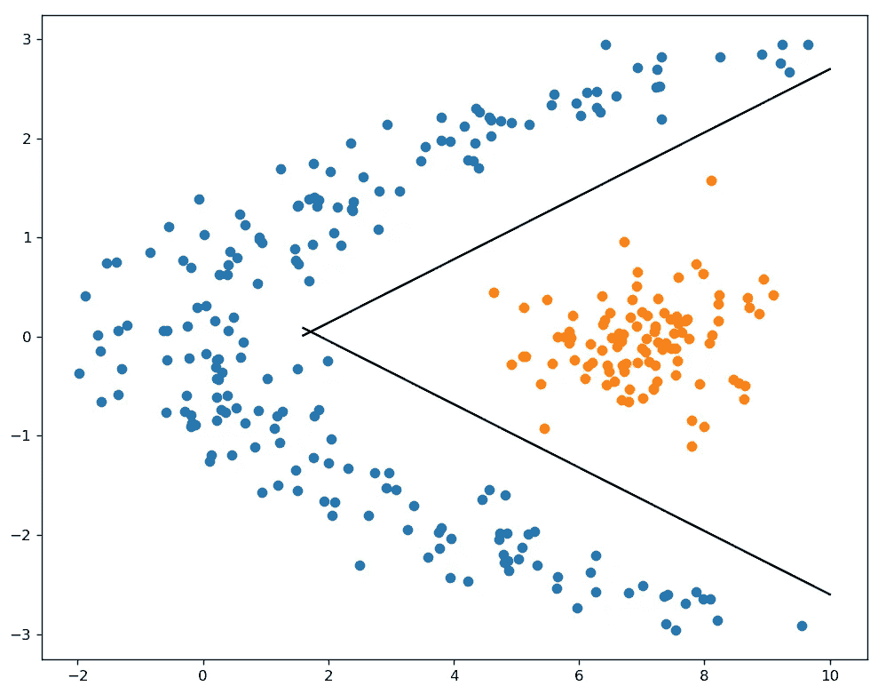

因此，我们可能认为两个中间神经元可以完成这项工作。这两个神经元将学习上图中的两条分隔线。然后，我们将需要一个输出神经元，它将把这两个先前的神经元作为输入，然后它将能够正确地进行分类。

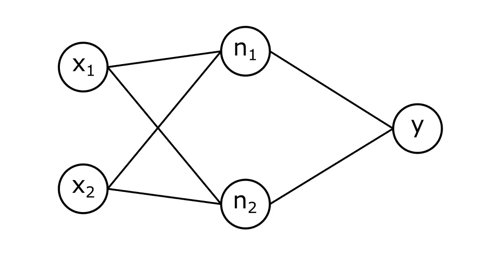

为了使最后一个神经元正确分类，如果我们将 n1 和 n2 个隐藏神经元绘制在 2d 平面上，则它们的输出需要是线性可分的。上面绘制的 2 条线具有以下等式:

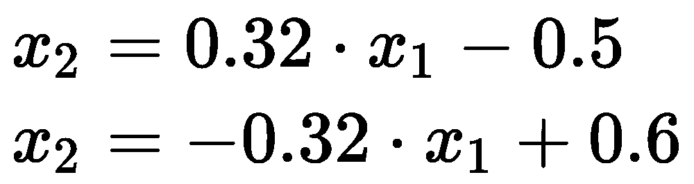

这意味着 2 个隐藏神经元正在计算输入 x1 和 x2 的以下线性组合:

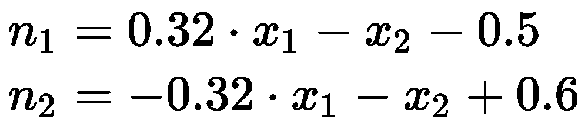

让我们现在画出 n1 和 n2，看看它们是否帮助了我们。

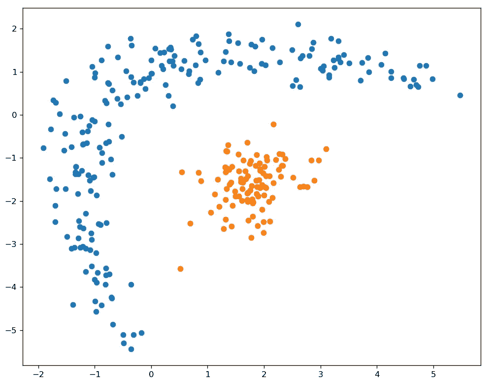

我们对我们小小的神经网络感到失望。n1 和 n2 的输出仍然不是线性可分的，因此输出神经元不能正确分类。
那么，问题出在哪里？事情是，任何线性函数的线性组合仍然是线性的，并不难在一张纸上说服自己这是正确的。因此，无论我们使用多少层或多少个神经元，到目前为止，我们的神经网络仍然只是一个线性分类器。我们需要更多的东西。我们需要将每个神经元计算出的加权和传递给一个非线性函数，然后将这个函数的输出视为该神经元的输出。这些函数被称为**激活函数**，正如你在我们的例子中看到的，它们对于神经网络学习数据中的复杂模式非常重要。已经证明[1]具有 2 层(除了输入层)和非线性激活函数的神经网络能够逼近任何函数，只要它在那些层中具有足够大数量的神经元。那么，如果只有两层就足够了，为什么现在人们使用更深的网络呢？嗯，仅仅因为这些 2 层网络“能够”学习任何东西，并不意味着它们很容易优化。实际上，如果我们让我们的网络**产能过剩**，他们会给我们足够好的解决方案，即使他们没有优化到他们能做到的程度。

还有更多种类的激活函数，其中两种我们想在上面的例子中使用。它们是 ReLU(**Re**ctived**L**linear**U**nit)和 tanh(双曲正切)，如下所示。

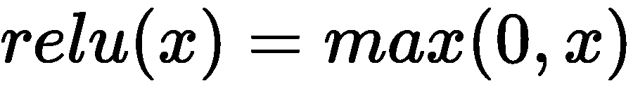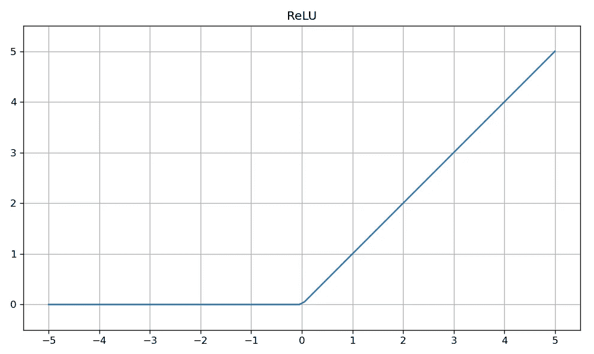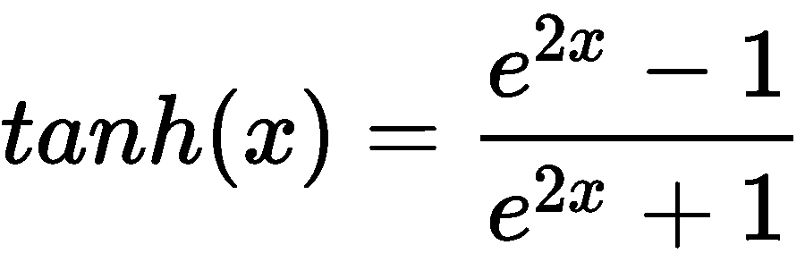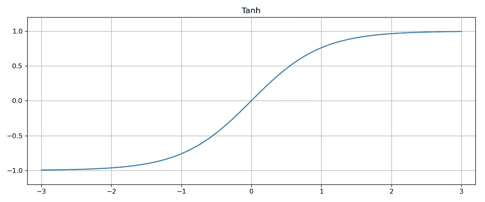

思考神经网络的另一种方式是，它们试图同时学习分类和特征表示。如果你读过我的关于[感知器](/perceptron-explanation-implementation-and-a-visual-example-3c8e76b4e2d1)的文章，你会在文章的最后看到我们如何通过向输入向量添加非线性特征，使用线性分类器来解决非线性分类问题。但是，为了获得好的结果，您如何总是知道将哪些额外的特性添加到输入向量中呢？神经网络试图通过学习什么样的特征表示是好的来解决这个问题。在隐藏层中，神经网络实际上学习输入数据的最佳表示，以便在进行实际分类的最后一层中表现良好。

现在，让我们继续我们的例子。如果我们在例子中使用 ReLU 激活，会发生什么？下面绘制了施加 ReLU 激活后神经元 n1 和 n2 的输出。

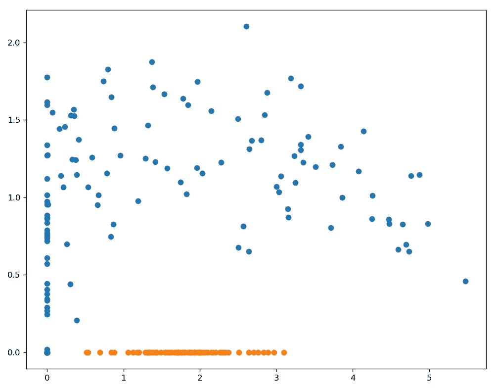

现在我们的两类点可以由一条线分开，因此输出神经元可以正确地对它们进行分类。

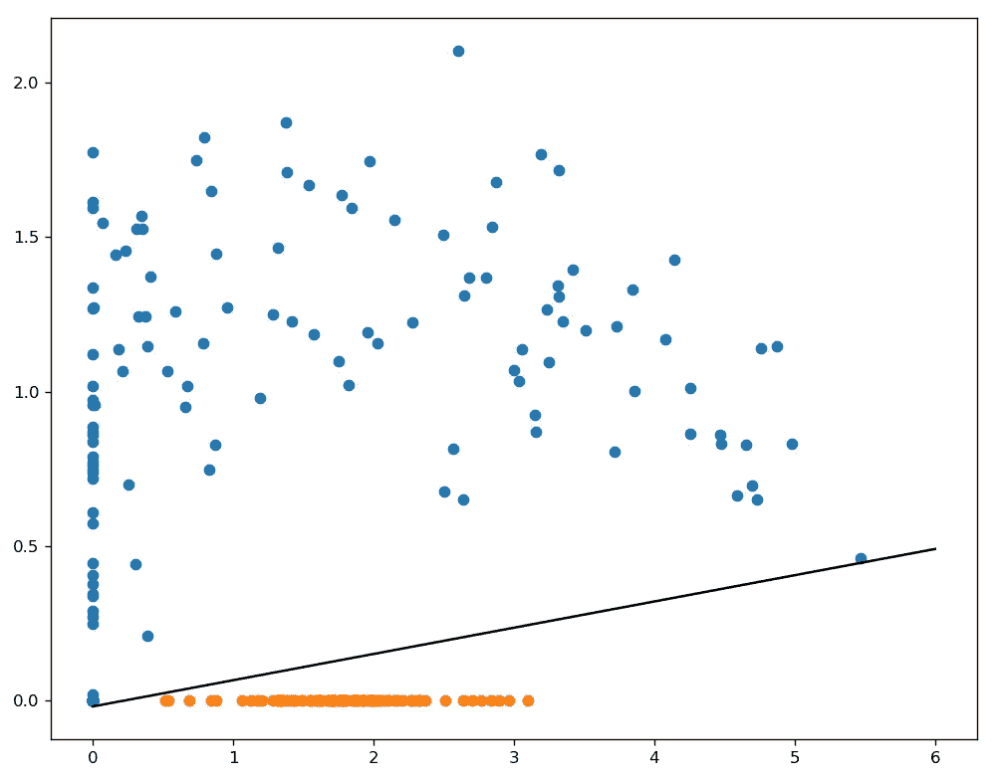

如果我们使用 tanh 激活，会发生类似的事情，但这次我们的点被更大的余量分开得更好。

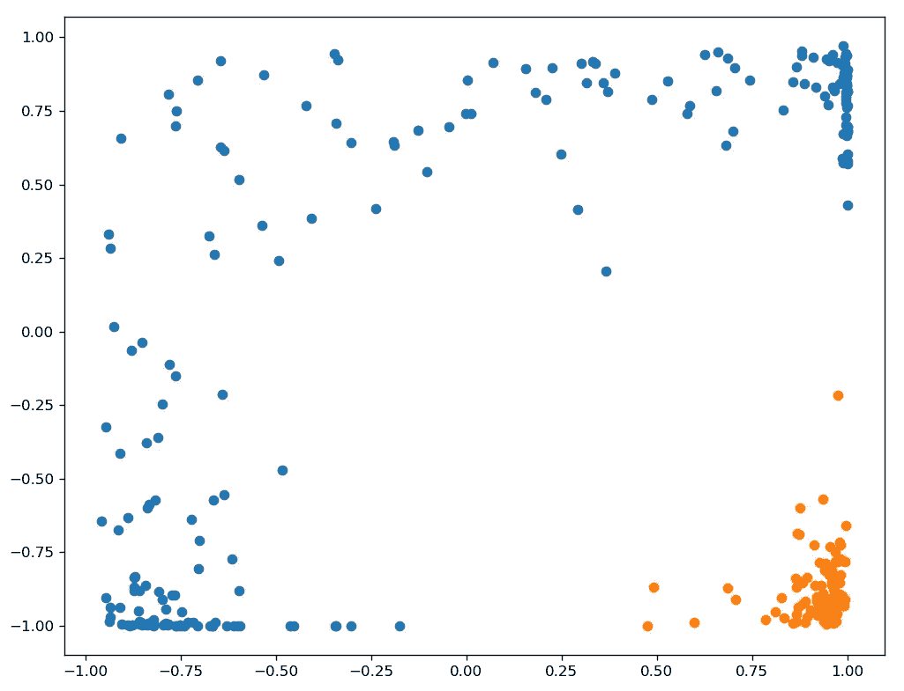

同样，输出神经元可以正确分类这些点。

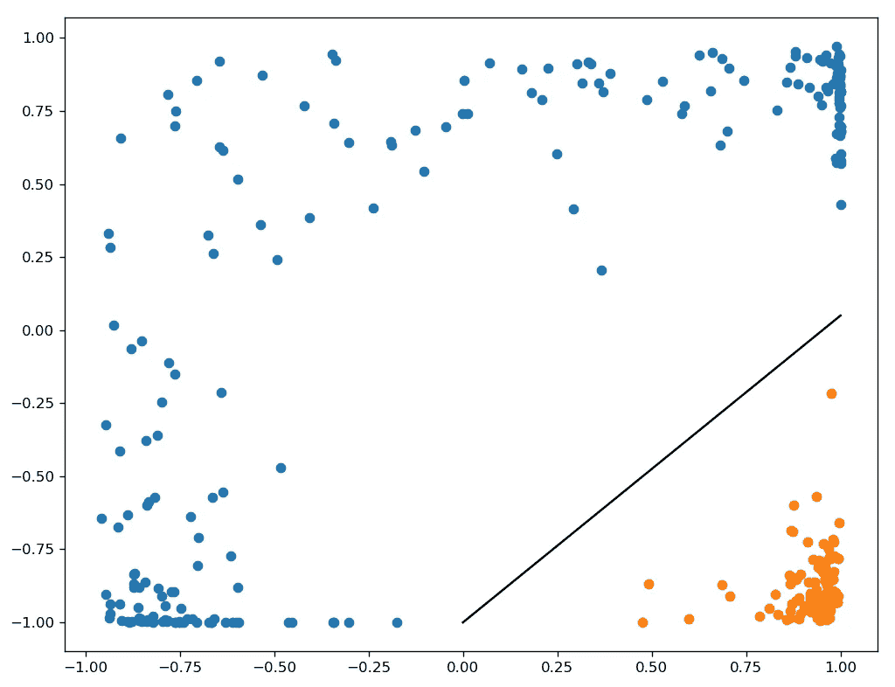

在我看来，神经网络的常见视觉表示，即讨厌的图形结构，可能有点令人困惑。尤其是如果你想实现它，就更难考虑你需要用那些到处浮动的连接和权重来做什么。在参数层次上思考可能很麻烦，但是在网络中进行的向量和矩阵运算的更高层次上思考更清晰，至少对我来说是这样。将神经网络视为函数的组合，向量函数的链，在我所做的实现中帮助了我，我希望它也能帮助你。请看下图:

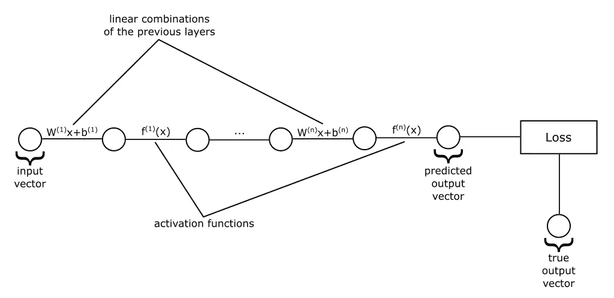

如果我们将每一层的输入和输出值表示为向量，将权重表示为矩阵，将偏差表示为向量，那么我们将得到上面的神经网络的扁平化视图，它只是一系列向量函数应用。这些函数将向量作为输入，对它们进行一些变换，然后输出其他向量。在上图中，每一行代表一个函数，可以是矩阵乘法加偏置向量，也可以是激活函数。圆圈代表这些函数操作的向量。例如，我们从输入向量开始，然后将它输入第一个函数，该函数计算其分量的线性组合，然后我们获得另一个向量作为输出。我们将最后一个向量作为激活函数的输入，依此类推，直到到达序列中的最后一个函数。最后一个函数的输出将是我们网络的预测值。

这种表示也更接近我们实际要实现的东西。为了实现神经网络，我们实际上不需要存储通常用图像表示的图形。一个神经网络所做的一切就是**矩阵运算**，既用于预测，也用于训练。

我们已经看到了神经网络如何获得我们感兴趣的输出，它只是通过一系列函数传递其输入向量。但是这些函数依赖于一些参数:权重和偏差。

*为了获得好的预测，我们实际上如何学习*这些参数？

好吧，让我们回忆一下神经网络实际上是什么:它只是一个函数，一个由按顺序应用的较小函数组成的大函数。这个函数有一组参数，因为一开始我们不知道它们应该是什么，我们只是随机初始化它们。所以，一开始我们的网络只会给我们随机的值。我们如何改进它们？在尝试改进它们之前，我们首先需要一种评估网络性能的方法。如果我们没有一种方法来衡量我们的模型做得有多好或有多差，我们应该如何改进它的性能呢？为此，我们需要设计一个函数，将网络预测和数据集中的真实标签作为参数，并给出一个代表网络性能的数字。那么我们就可以把学习问题变成一个寻找这个函数的最小值或者最大值的优化问题。在机器学习社区中，这个函数通常衡量我们的预测有多糟糕，因此它被命名为**损失函数**。我们的问题是找到使这个损失函数最小的网络参数。

# 随机梯度下降

你可能熟悉微积分课上的求函数最小值的问题。在那里，你通常取函数的梯度，将其设为 0，找到所有的解(也称为临界点)，然后从中选择一个使你的函数具有最小值的解。这是全球最小值。我们能做同样的事情来最小化我们的损失函数吗？不完全是。问题是神经网络的损失函数不像你通常在微积分教科书中找到的那样好和紧凑。它是一个非常复杂的函数，有几千、几十万甚至几百万个参数。甚至不可能找到这个问题的封闭解。这个问题通常通过迭代方法来解决，这种方法不试图找到一个直接的解决方案，而是从一个随机的解决方案开始，并试图在每次迭代中改进它。最终，在大量的迭代之后，我们会得到一个非常好的解决方案。

一种这样的迭代方法是**梯度下降**。你们可能知道，函数的梯度给了我们最陡上升的方向，如果我们取梯度的负值，就会给我们最陡下降的方向，也就是我们可以最快到达最小值的方向。因此，在每次迭代中，也称为历元，我们计算损失函数的梯度，并从旧参数中减去它(乘以称为*学习速率*的因子)，以获得我们网络的新参数。

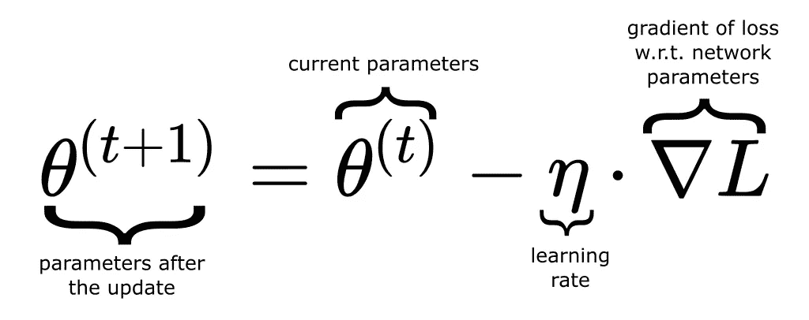

其中θ表示包含所有网络参数的向量。

在标准梯度下降法中，梯度是在考虑整个数据集的情况下计算的。通常这是不希望的，因为它可能在计算上很昂贵。在实践中，数据集被随机划分成更多的块，称为批，并且对这些批中的每一个进行更新。这被称为**随机梯度下降**。

上述更新规则在每一步仅考虑在当前位置评估的梯度。这样，在损失函数表面上移动的点的轨迹对任何扰动都是敏感的。有时，我们可能希望让这个轨迹更加稳健。为此我们使用了一个来自物理学的概念:**动量**。这个想法是，当我们进行更新时，也要考虑以前的更新，这就累积成一个变量δθ。如果更多的更新是在同一个方向上完成的，那么我们会“更快”地向那个方向前进，不会因为任何微小的扰动而改变我们的轨迹。想象一下速度。

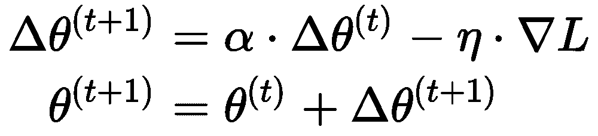

其中α是确定过去梯度贡献的非负因子。当它为 0 时，我们就不用动量了。

# 反向传播

我们如何计算梯度呢？回想一下，神经网络和损失函数只是函数的组合。我们如何计算复合函数的偏导数？使用链式法则。让我们来看下图:

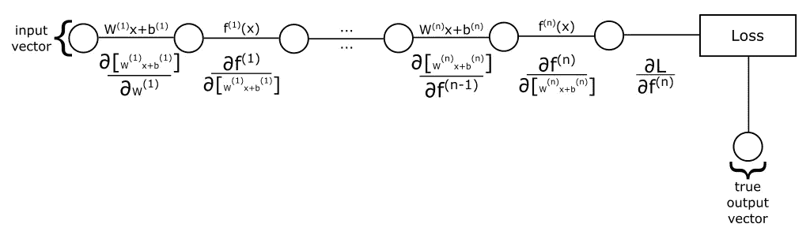

如果我们想要计算第一层权重的损失 w.r.t. ( *相对于*)的偏导数:我们取第一个线性组合 w.r.t .的导数，然后我们乘以下一个函数(激活函数)w.r.t .的导数，再乘以前一个函数的输出，等等，直到我们乘以损失 w.r.t .的导数，最后一个激活函数。如果我们想计算第二层重量的导数呢？我们必须执行相同的过程，但这一次我们从第二个线性组合函数的导数 w.r.t .及其权重开始，之后，当我们计算第一层权重的导数时，我们必须相乘的其余项也存在。因此，我们不会一遍又一遍地计算这些术语，而是将**倒推**，因此得名**反向传播**。

我们将首先计算损耗对网络输出的导数，然后通过保持导数的连续乘积将这些导数向后传播到第一层。注意，我们有两种导数:一种是计算函数对输入的导数。我们将这些乘以导数的乘积，目的是跟踪网络从输出到算法中当前点的误差。第二种导数是那些我们想要优化的参数。我们不将它们与导数乘积的其余部分相乘，而是将它们存储为梯度的一部分，稍后我们将使用它来更新参数。

因此，在反向传播时，当我们遇到没有可学习参数的函数(如激活函数)时，我们只对第一类函数求导，只是为了反向传播误差。但是，当我们遇到具有可学习参数的函数时(如线性组合，我们有想要学习的权重和偏差)，我们对两种类型都进行求导:第一种是误差传播的输入，第二种是权重和偏差，并将它们存储为梯度的一部分。我们从损失函数开始做这个过程，直到我们到达第一层，在那里我们没有任何要添加到梯度的可学习参数。这是反向传播算法。

# 生产能力过剩

在开始下一步之前，我想谈一点关于神经网络的能力过剩。回想一下我们之前的例子:

如你所见，解决这个分类任务所需的隐藏层中的神经元的最小数量是 2，上面两行中的每一行一个。在神经网络中，增加一些过剩的能力是一个好主意，即增加比解决特定问题所需的最少数量更多的神经元和/或层。这是因为添加更多的参数将使优化问题变得更容易。在上面的例子中，如果我们只使用 2 个隐藏的神经元，我们将需要它们中的每一个学习一条“几乎完美”的线，以便最终的结果是好的。但是，如果我们给我们的网络更多的自由，并在隐藏层中添加更多的神经元，它们就不需要完美。如果它们中的大多数至少对我们的分类任务有用，我们将能够得到好的结果。然后，我们可以认为最后一个神经元平均了每个神经元的决策边界。

思考为什么添加更多参数会使优化任务更容易的另一种方式是想象当我们添加更多参数时损失函数的“表面”会发生什么。在 2d 情况下，只有 2 个方向可以移动我们的(单个)参数，如果在这两个方向上损失函数的高度都比当前点大，那么我们将陷入局部最小值，并且我们可能完全错过全局最小值。现在，让我们想象一下，我们再增加一个参数，这样我们的图就变成了 3d 空间中的一个曲面。在这种情况下，我们有无限多的方向可以选择，并且有更多的机会在所有的方向中找到至少一个方向，使我们向下到达损失面上的一个更低的点。因此，陷入局部最小值的机会更少(至少与 2d 情况相比)。

增加我们网络的参数数量总是更好的？不。参数太多会使我们的网络更容易超载。因此，在使优化问题更容易和保持网络不过度拟合之间有一个权衡。

# Softmax 激活和交叉熵损失

分类任务中最后一层常用的激活函数是 softmax 函数。

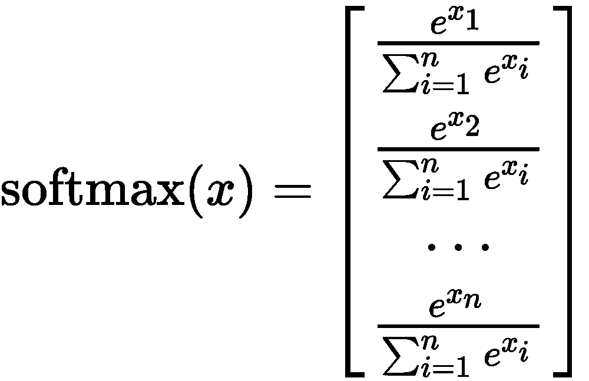

softmax 函数将其输入向量转换为概率分布。如果你看上面，你可以看到 softmax 的输出向量的元素都是正的，它们的和是 1。当我们使用 softmax 激活时，我们在最后一层创建与数据集中的类数量一样多的节点，softmax 激活将为我们提供可能的类的概率分布。因此，网络的输出将给出输入向量属于每一个可能类别的概率，我们选择具有最高概率的类别，并将其报告为我们网络的预测。

当 softmax 被用作输出层的激活时，我们通常使用交叉熵损失作为损失函数。交叉熵损失衡量两个概率分布的相似程度。我们可以将输入 x 的真实标签表示为概率分布:其中真实类别标签的概率为 1，其他类别标签的概率为 0。这种标签表示也称为一键编码。然后，我们使用交叉熵来衡量我们网络的预测概率分布与真实概率分布的接近程度。

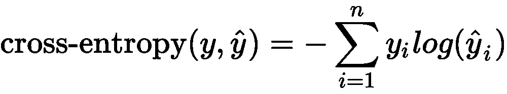

其中 y 是真实标签的独热编码，y hat 是预测的概率分布，yi，yi hat 是那些向量的元素。

如果预测的概率分布接近真实标签的独热编码，那么损失将接近于 0。否则，如果它们非常不同，损失可能会增长到无穷大。

# 均方误差损失

到目前为止，我们专注于分类任务。但是，通过使用适当的损失函数，神经网络可以很容易地适应回归任务。例如，如果我们有一个想要近似的数字列表，我们可以使用均方误差(简称 MSE)损失来代替类别标签作为基本事实。通常当我们使用 MSE 损失时，我们在最后一层使用身份激活。

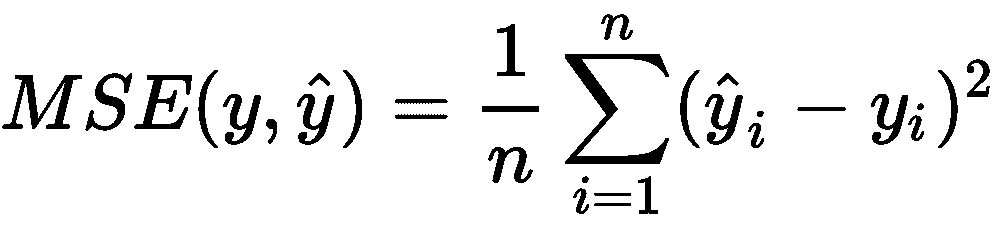

# 用 python 实现这个

现在是时候用 python 实际实现一个神经网络了，然后用几个例子来测试它，看看它的表现如何。

我认为真正理解神经网络如何工作的最好方法是从头开始实现一个神经网络。我向你挑战靠你自己去实现它。当你完成后，回到这里，与我的代码进行比较，做我在本文末尾做的例子，看看你是否得到类似的结果。如果你在某个时候遇到困难，可以来这里看看我是怎么做的。

我将创建一个 NeuralNetwork 类，我希望以这样一种方式设计它，使它更加灵活。我不想在其中硬编码特定的激活或损失函数，或优化器(即 SGD，Adam 或其他基于梯度的方法)。我将把它设计成从类外部接收这些，这样人们就可以获取类的代码，并传递给它他想要的任何激活/丢失/优化器。因此，我将实现激活和丢失函数，以及优化器类，我们希望在这里将它们与 NeuralNetwork 类分开使用。我们需要激活/损失函数及其导数。

为了允许批量大于 1，我们的激活和损失函数应该处理矩阵输入。这些矩阵中的行代表数据样本，列代表特征。我们的网络将允许两种激活功能:隐藏层和输出层。隐藏层激活应该对它们的输入向量进行元素方式的操作，因此它们的导数也将是元素方式的，为每个样本返回一个向量。但是输出激活允许基于输入向量中的所有元素来计算输出向量中的每个元素。这是为了能够使用 softmax 激活。正因为如此，它们的导数需要返回一个雅可比矩阵(一个由每个输出函数对每个输入分量的偏导数组成的矩阵；你可以在这里阅读更多关于每个样品的[。](https://en.wikipedia.org/wiki/Jacobian_matrix_and_determinant)

这里我们将只使用 ReLU 作为隐藏激活；identity 和 softmax 将用作输出激活。

我们使用 EPS 变量，它是 float64 类型的最小正表示数，以避免被 0 除。为了避免 softmax 函数中的溢出错误，我们从输入中减去了每个样本的最大值。我们被允许这样做，因为它不会改变函数的输出，因为它的效果和分数的两项除以相同的量是一样的。

损失函数应该将两个矩阵作为输入:预测的 y 和真实的 y，它们的形式与激活函数中的相同。这些损失函数应该为每个样本输出一个数字。它们的导数应该为每个样本输出一个行向量，所有样本都堆叠成一个 3 维的数组。为了能够使用 numpy 的`matmul()`函数乘以输出激活的导数，需要该输出形状。注意下面的`expand_dims()`函数的使用，该函数用于返回所需的形状。

这里我们将只使用带动量的随机梯度下降作为优化方法，但是还有更多基于梯度的方法。一些流行的选择是:亚当，RMSprop，阿达格拉德。为了让我们的神经网络类能够处理所有这些，我们将把优化器作为一个单独的类来实现，使用一个返回更新参数的`.update(old_params, gradient)`方法。神经网络类将接收一个优化器作为参数。因此，想使用其他优化方法的人可以创建一个具有所需接口的类，并在实例化时将其传递给我们的神经网络类。

下面是新币+动量优化器:

为了将分类任务中的分类标签转换为一键编码，我们将使用`to_categorical()`实用函数:

现在，让我们从 NeuralNetwork 类的代码开始。实例化方法需要以下参数:

*   **层**:由每层(包括输入和输出层)的节点数组成的列表
    例如:【5，10，2】表示 5 个输入，10 个隐层节点，2 个输出节点
*   **隐藏 _ 激活**:激活隐藏层；一个形式的元组(activation_function，its_derivative)
    这个激活函数和它的导数应该在输入数组
    上按元素执行它们的任务，例如:(relu，d_relu)
*   **output_activation** :输出层激活；一个形式元组(activation_function，its_derivative)
    这个激活函数将一个形状数组(n，m)作为输入；n 个样本，输出层 m 个神经元；并返回 shape (n，m)数组；输出数组中一行上的每个元素都是输入数组中该行上所有元素的函数输出。
    它的导数将一个类似于激活所采用的数组作为输入，但它返回一个 shape (n，m，m)数组，该数组是一堆雅可比矩阵，每个样本一个。
*   **损失**:形式的元组(loss_function，its_derivative)
    损失函数将形状(n，m)的两个数组(预测 y 和真实 y)作为输入；n 个样本，输出层 m 个神经元；并返回 shape (n，1)数组，其元素是每个样本的损失。
    它的导数将 shape (n，m)的数组作为输入，并返回 shape (n，1，m)的一个数组，该数组是由 m 个输入变量的导数 w.r.t .组成的行向量的堆栈。
    例如:(分类 _ 交叉熵，d _ 分类 _ 交叉熵)
*   **优化器**:有方法的对象。update(old_params，gradient)返回新的参数
    ，例如:SGD()

然后，它使用 Xavier 初始化方法的变体初始化其权重和偏差。也就是说，我们从均值为 0 且标准差为的正态分布中得出权重和偏差:

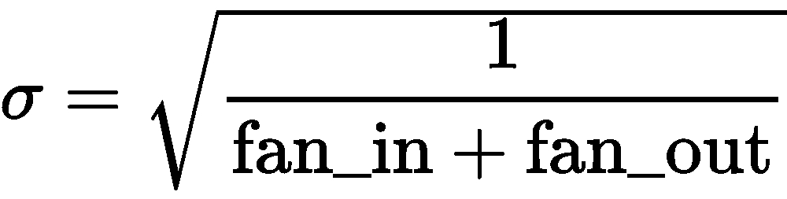

其中 fan_in 和 fan_out 分别是前一层中的节点数和下一层中的神经元数。权重矩阵中的行数与前一层中的节点数相匹配，列数与下一层中的节点数相匹配。偏差是行向量，其元素数量与下一层中的节点数量相匹配。

为了方便地执行参数更新过程，我们将创建一个`.__flatten_params(weights, biases)`方法，将权重矩阵列表和作为输入接收的偏差向量转换为扁平向量。我们还需要一个`.__restore_params(params)`方法，将参数的扁平向量转换回权重和偏差列表。注意，方法名前面的 2 个下划线仅仅意味着该方法在 OOP 术语中是私有的。这只是意味着该方法应该只在类内部使用。

`.__forward(x)`方法通过网络传递输入数组 x，在这样做的同时，它跟踪每层的输入和输出数组。然后，它将此作为一个列表返回，其中第 I 个元素是一个形式为[第 I 层的输入，第 I 层的输出]的列表。我们将需要这些数组来计算后向传递中的导数。

`.__backward(io_arrays, y_true)`方法计算梯度。它将一个由`.__forward(x)`方法返回的表单列表和一个包含基本事实 y 的数组作为输入。它使用本文前面描述的反向传播算法计算权重和偏差的梯度。然后它返回一个元组(d_weights，d _ biases)。

实际协调所有培训的方法是`.fit(x, y, batch_size, epochs, categorical)`，其中:

*   x 是输入数据
*   y 是基本事实
*   batch_size 是一批数据的大小
*   epochs 是遍历所有输入数据的次数
*   categorical 是一个可选参数，当设置为 true 时，会将 y 转换为一键编码

对于每批数据，它使用`.__forward()`和`.__backward()`方法计算梯度，然后使用`.__flatten_params()`拉平网络的当前参数和梯度。之后，使用`self.optimizer.update()`计算新的参数，然后使用`__restore_params()`将返回的向量恢复为正确的格式，并将其分配给`self.weights, self.biases`。每批结束时，打印进度和平均损失。维护并返回每个时期结束时所有损失值的列表。

默认情况下，`.predict()`方法将在输入 x 通过网络后返回输出节点中的精确值。如果 labels 参数设置为 true，则返回预测标签；这大概就是你在一个分类问题中想要的。
`.score()`方法默认返回平均损失。如果 accuracy 设置为 true，那么将返回精度。请注意，在分类问题中，如果您想要损失，那么 y 应该以一键编码格式提供，否则，如果您想要返回准确性，那么 y 应该只是常规的类标签。

最后，我们希望能够在本地保存参数，这样我们就不必在每次想要进行预测时训练我们的模型。请注意，以下方法只能保存和加载权重和偏差，而不能保存和加载关于层、激活、损失函数和优化器的全部信息。因此，您还应该保存用于实例化神经网络的代码。

以下是完整代码:

# 例子

下面我们将展示两个例子，其中我们使用了刚刚实现的 NeuralNetwork 类。

第一个例子包括对 MNIST 数据库中的手写数字图像进行分类。该数据集由 60，000 个训练和 10，000 个 28 x 28 像素的测试灰度图像组成。

我们使用 mnist 包(`pip install mnist`)来加载这个数据集。

然后我们构建一个神经网络，训练 100 个历元。

我们来绘制训练损失图。

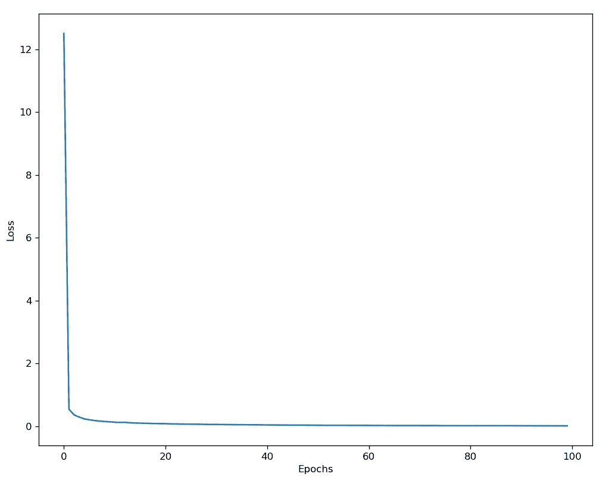

让我们看看我们在训练集和测试集上获得的准确性:

并且得到了 **99.8%** 的训练和 **95.9%** 的测试精度。这对我们自制的神经网络来说相当不错。

现在我们来看第二个例子，在这个例子中，我们用神经网络来解决一个回归问题。
这次我们将使用 sklearn 软件包附带的加州住房数据集。该数据集由 8 个预测属性的 20640 个样本和目标变量 ln(房屋价值中位数)组成。该数据集来自 1990 年美国人口普查，每个人口普查区块组使用一行。街区组是美国人口普查局发布样本数据的最小地理单位。

这次我们将使用均方误差作为损失函数。

让我们画出训练时的损失。

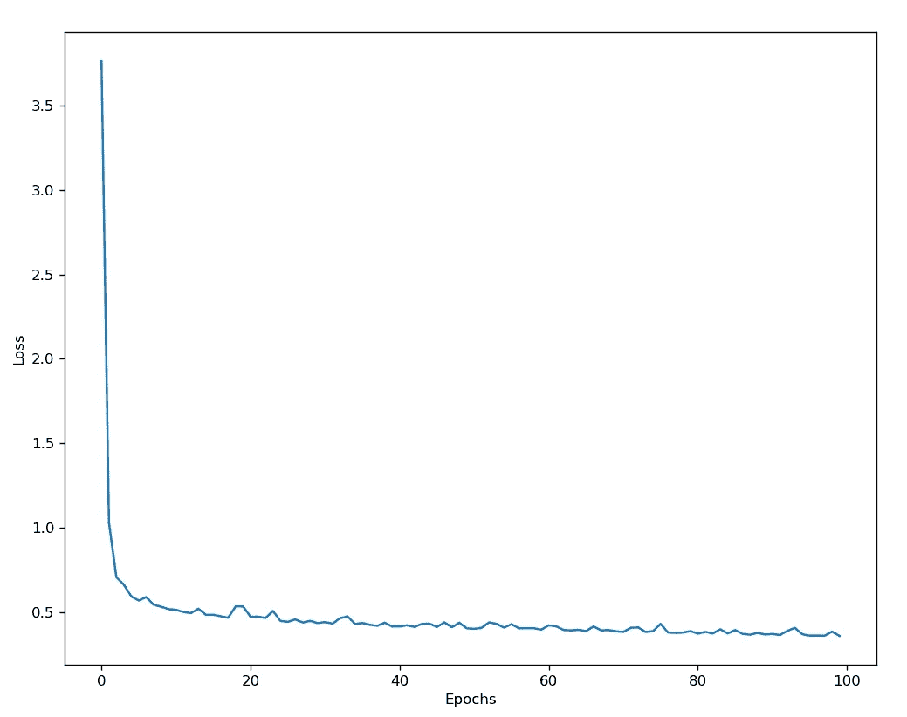

让我们看看训练集和测试集的最终损失值是多少。

对于训练和测试，我们都损失了大约 **0.36** 。请注意，目标变量是对数标度。所以，这里对均方误差的解释有点不直观。我们通常说预测值平均相差+/-MSE 的平方根。现在，在我们的情况下，我们的网络预测的中值房屋价值平均偏离 e 的平方根一个因子(而不是+/-我们有乘/除)(在我们的情况下，这个因子大约是 **1.83** )。

# 参考

[1] Cybenko，G.V. (2006 年)。“通过叠加 s 形函数进行近似”。在范舒彭，简 h(编辑。).控制、信号和系统数学。斯普林格国际公司。第 303-314 页。

你可以在 Github [这里](https://github.com/lazuxd/neural_networks_from_scratch)找到笔记本和 python 文件。

我希望这些信息对您有用，感谢您的阅读！

这篇文章也贴在我自己的网站[这里](https://www.nablasquared.com/a-comprehensive-introduction-to-neural-networks/)。随便看看吧！