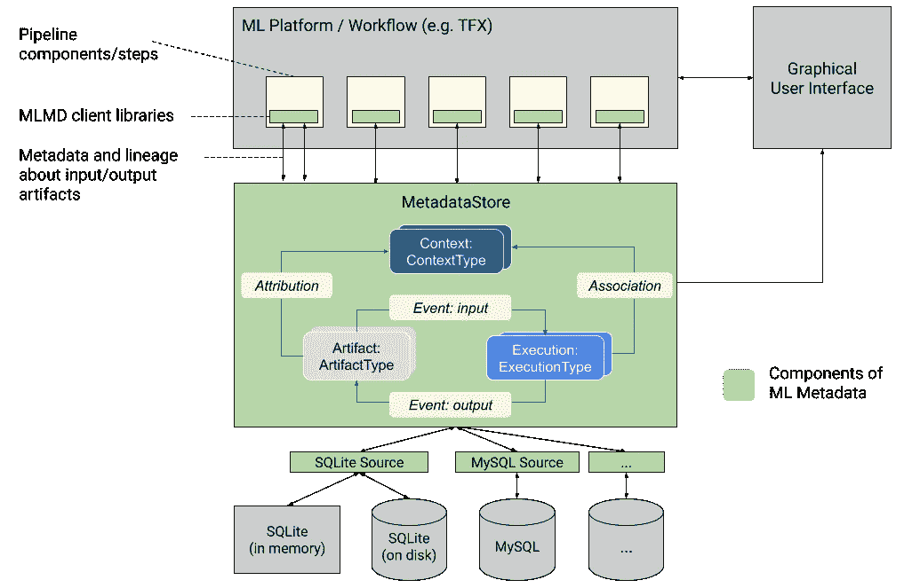
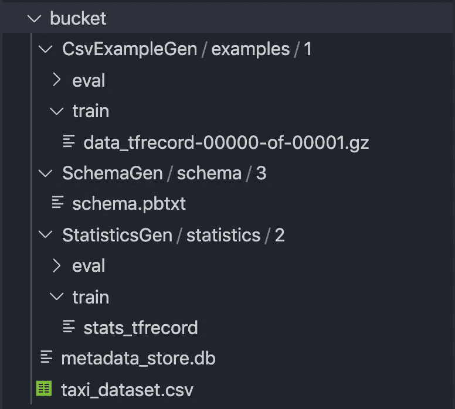
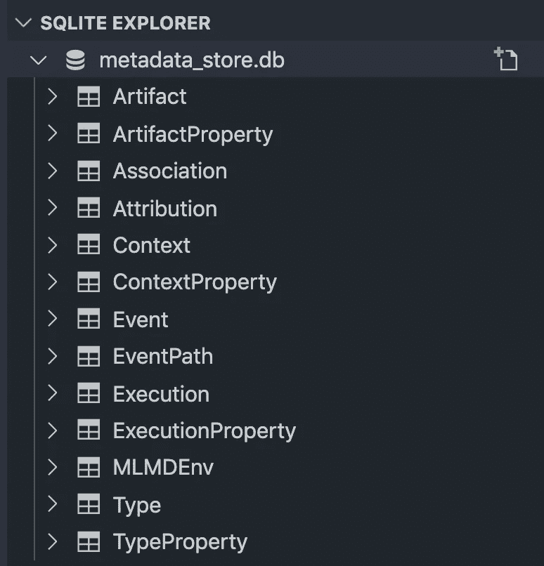
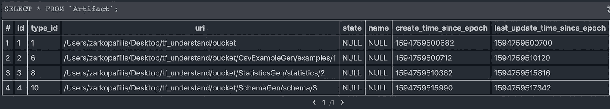
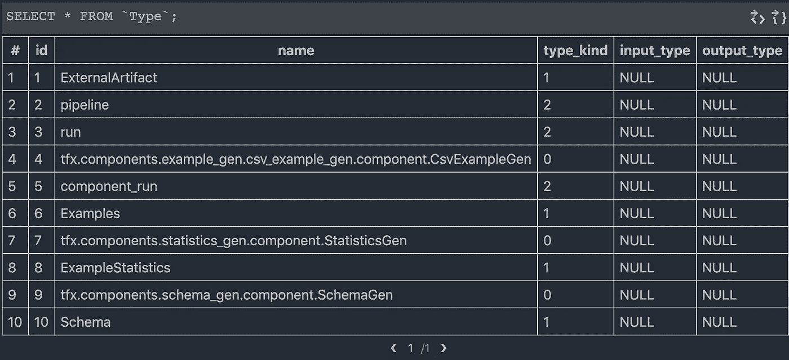
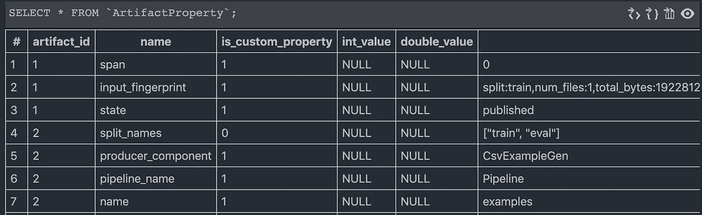

# Tensorflow Extended 的全面 ML 元数据演练

> 原文：<https://towardsdatascience.com/a-comprehensive-ml-metadata-walkthrough-for-tensorflow-extended-953230770867?source=collection_archive---------28----------------------->

## 它存在的原因以及它在 Beam 管道组件中的使用方式

图片来自[https://www.tensorflow.org/tfx/guide/mlmd](https://www.tensorflow.org/tfx/guide/mlmd)

> [*ML 元数据(MLMD)* 是一个用于记录和检索与 ML 开发人员和数据科学家工作流相关的元数据的库。](https://github.com/google/ml-metadata)
> 
> [TensorFlow Extended (TFX)是一个用于部署生产 ML 管道的端到端平台](https://www.tensorflow.org/tfx)

在本文发布时，ML 元数据的当前版本是 v0.22(tfx 也是 v 0.22)。该 API 已经足够成熟，可以在公共云上进行主流使用和部署。Tensorflow Extended 将其广泛用于组件-组件通信、沿袭跟踪和其他任务。

我们将运行一个非常简单的管道，该管道将为著名的芝加哥出租车旅行数据集的样本 csv 生成统计数据和模式。这是一个大约 10mb 的小文件，管道可以在本地运行。

生成的工件列表

运行一次，打开`metadata_store.db`文件进行检查。

ML 元数据生成的表

ML 元数据[存储关于 **3** 事物的信息:](https://www.tensorflow.org/tfx/guide/mlmd)

*   **关于生成的工件的元数据**
*   **关于这些组件执行的元数据—步骤**
*   **关于管道和相关沿袭信息的元数据**

Apache Beam Pipeline TFX 组件不会将整个二进制工件(由具有多个 io 的`[ParDo](https://beam.apache.org/releases/javadoc/2.1.0/org/apache/beam/sdk/transforms/ParDo.html)`处理)传递给下一个节点。相反，URIs 的神器被传来传去。工件通常存储在某种云文件系统上，如[云存储桶](https://cloud.google.com/storage/docs/json_api/v1/buckets)。

*甚至* ***TFRecord tf。示例*** *保存的文件作为中间阶段工件处理。它们被压缩以节省空间。*

`> SELECT * FROM `Artifact`;`

被储存的藏物

您可以看到，所有这些生成的工件父目录都被存储了起来，还有一个数字(稍后将详细介绍这个数字)、创建和更新时间。

在`CsvExampleGen/examples/1`的例子中，我们得到了两个子目录，`train`和`eval`，它们被存储为同一个工件。该路径的 **/examples** 部分是`example_gen`产生的工件的名称(查看管道代码)，`statistics_gen`将其作为输入。

空值可能是正在进行的工作，因为商店是 v0.xx 版本。你可以在[源代码协议缓冲区声明中看到](https://github.com/google/ml-metadata/blob/b4891cf4f00a6d6d4b6a28a69c5601f1a48cd9f1/ml_metadata/proto/metadata_store.proto) n 可以是`UNKNOWN — PENDING — LIVE — MARKED_FOR_DELETION — DELETED`并且名字很好，这个名字，除了`type_id`之外。

`Types`工作台与`type_id`如预期的一样:

类型

工件也支持属性映射。这些总结在`ArtifactProperty`表中。(例如，保存的 TFRecord 文件的校验和。它们通过 TFX 缓存中间步骤。)

工件属性图

*   一个**上下文**包含多个工件、执行和事件
*   一个**事件**包含工件和执行
*   一个**执行**通常是一个独立的流水线步骤

对于工件的执行跟踪和沿袭跟踪功能(例如，告诉哪个模型或统计对应于哪个数据集或管道运行)，我们必须处理**事件、上下文和执行。**

*   **事件**关联`artifact_ids`和`execution_ids`
*   **执行**只跟踪`type_ids`和时间戳
*   **上下文**将`type_ids`与管道运行和时间戳信息相关联

表**执行**属性和**上下文**属性包含键值形式的额外数据。

*   **ExecutionProperties** 包含传递给每个组件的输入和输出配置，以及管道和步骤根目录，以及工件的 IO 位置。
*   **上下文属性**将`context_ids`与管道组件名称和时间戳相关联

> 对于更大的管道的其他步骤，如模型验证和祝福，产生的工件或多或少采用相同的格式。

## 访问数据

有大量的信息可用，仅仅是在本地运行的简单的 3 步管道。例如，这个管道可以在云中的`Dataflow` runner 上运行，只需对配置进行最小的更改。

在这种情况下，使用存储在数据库中的数据要比浏览服务器场上的云存储桶和虚拟机容易得多。

从这一点开始，您可以通过直接 SQL 连接或 gRPC(通过存根或普通的旧调用)连接到 ML 元数据存储。然后，就是选择您想要手动检查的数据类型的问题。例如，这可以是模式或统计 protobuf。

通常，您只需要访问资源的资源标识符。如果您在相同的环境中，您应该能够仅通过 URI 访问它们(例如 GCP 项目 VM 内的笔记本)。

## 示例使用案例

假设您有一个管道在某个时间间隔(或基于事件的触发)运行，并且有时您想要查看最新管道运行与前一次运行的数据统计。

*   您需要两个不同管道运行的**statistics gen/statistics**工件(这些是 **ExampleStatistics** 类型，带有`type_id` 8)。这些可以在`Artifact`的桌子上找到。
*   您还需要从正确的管道运行中访问工件。`Attribution`表格将`context_id`与`artifact_id`相关联。唯一缺少的是精确定位您需要的 2 个`context_id`,以便进行简单的选择查询。
*   `Context`表还包含时间戳信息。例如，行`Pipeline .2020–07–14T23:45:00.508181.StatisticsGen`有一个`context_id` 5。

上下文 Id 5 对应于属性表中的工件 Id 3。工件 Id 3 确实是我们需要的统计工件。

**幸运的是，kubeflow 管道** [**已经自动做到了这一点**](https://www.kubeflow.org/docs/pipelines/sdk/output-viewer/)

# 结论

现在，您应该对 ML 元数据存储确切包含的内容以及为什么它是 TFX 生态系统中如此有用的组件有了一个明确的理解。

感谢一路读到最后！

## 定制工件

[支持自定义工件。我们不会在这里深入探讨，因为这主要是针对 TFX 的生态系统。更多信息请看这里。](https://github.com/google/ml-metadata/blob/master/g3doc/get_started.md)