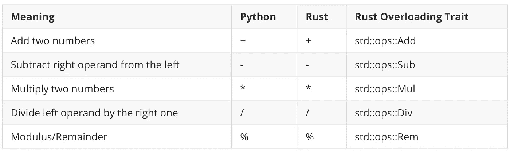
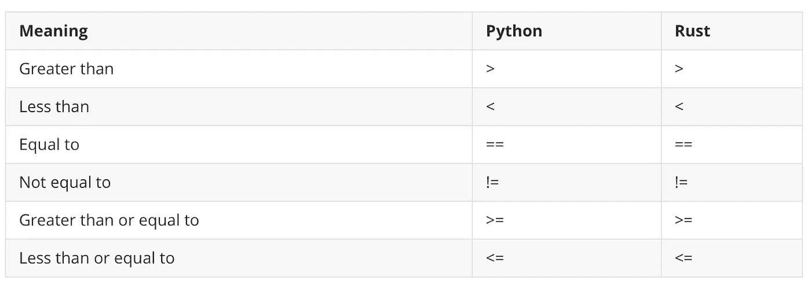
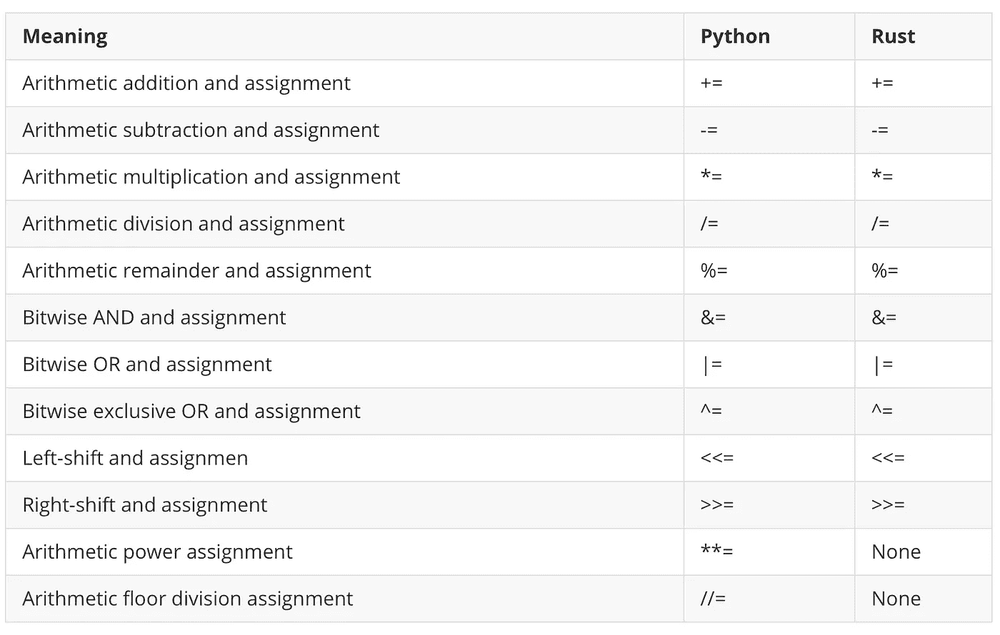
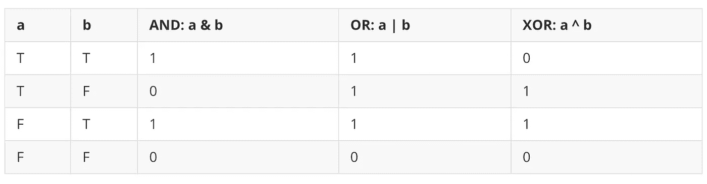
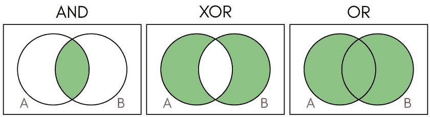
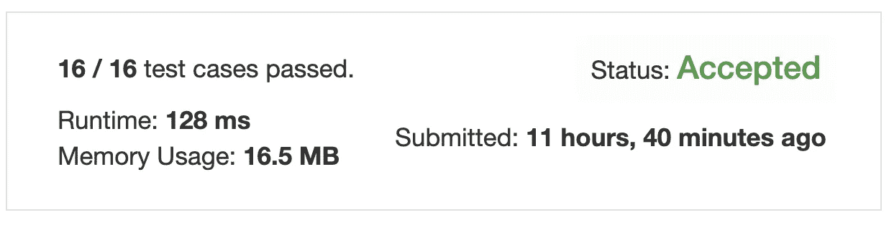
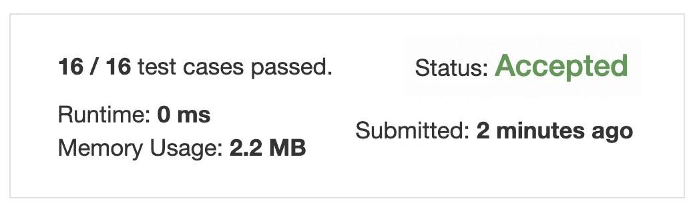
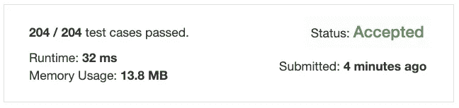
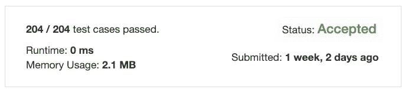

# 一个全面的教程，以信任运营商的初学者

> 原文：<https://towardsdatascience.com/a-comprehensive-tutorial-to-rust-operators-for-beginners-11554b2c64d4?source=collection_archive---------23----------------------->

## 方法、相关函数、将 Python 转换成 Rust 等等


由 pikisuperstar 创建的健康矢量—[www.freepik.com](http://www.freepik.com)

```
**Table of Contents**[**Introduction**](#f77d)🦀 [Arithmetic Operators](#7b55)
🦀 [Comparison Operators](#ec1d)
🦀 [Logical Operators](#71e3)
🦀 [Bitwise Operators](#b809)
🦀 [Compound Assignment Operators](#06a0)
🦀 [Operator Overloading](#de94)
🦀 [XOR and Bitwise Operators Truth Table](#f515)
🦀 [Problem 1: Single Number](#bb38)
🦀 [Python Solution](#6fa3)
🦀 [Rust Code](#0af4)
🦀 [Method and Associated Functions](#c7fe)
🦀 [Solution Using an Associated Function](#7878)
🦀 [Problem 2: Number of Steps to Reduce a Number to Zero](#a615)[**Conclusion**](#678b)
```

[更新于 2020 年 2 月 18 日。代码更改为要点并添加了链接]

# 介绍

运算符告诉编译器或解释器执行特定的数学、关系或逻辑运算。许多编程语言都使用类似的操作符。

我们将讨论 Rust 中重要的算术、关系和逻辑操作符，并将它们与 Python 进行比较。

我们将学习方法和相关函数之间的区别。

我们还将两个简单的 Python 代码转换成 Rust 代码，以了解更多关于 Rust 编程的知识。

我们开始吧！

[](/learning-rust-by-converting-python-to-rust-259e735591c6) [## 通过将 Python 转换成 Rust 来学习 Rust

### Rust 基础入门教程

towardsdatascience.com](/learning-rust-by-converting-python-to-rust-259e735591c6) 

# 算术运算符



Rust 和 Python 算术运算符。图片由作者提供。

Python 和 Rust 共享相同的算术符号，如上表所示。锈称`%`为 ***余数*** 而不是 ***模数*** 。

我们将在后面的[操作符过载](/a-comprehensive-tutorial-to-rust-operators-for-beginners-11554b2c64d4#de94)中讨论“生锈过载特性”。

[网上试试这个 Rust lang 代码。](https://tech.io/snippet/DgvhrO7)

输出:

```
a: 20, b: 20+1=21, c: 20-2=18, d: 20*3=60, e: 20/4=5, f: 20%3=2
```

在 Rust 中，不能在一个操作中使用不同的**数据** **类型**。例如，如果你试图从一个 [**有符号整数**](/unsinged-signed-integers-and-casting-in-rust-9a847bfc398f#3e54) 中减去一个 [**无符号整数**](/unsinged-signed-integers-and-casting-in-rust-9a847bfc398f#f4ce) ，就会失败:

```
// This will fail.
fn main() {
    let a = 8u8;
    let b = 2i32;
    println!("{}", a - b);
}
```

Rust 使用`[**as**](https://doc.rust-lang.org/std/keyword.as.html)` [关键字](https://doc.rust-lang.org/std/keyword.as.html)在**原语类型**之间进行强制转换。请点击阅读更多关于《铁锈》剧组[的内容。](/unsinged-signed-integers-and-casting-in-rust-9a847bfc398f#0883)

在线试用这个 Rust lang 代码。

输出:

```
6
```

**指数** Python 使用`**`符号表示指数:

[网上试试这个锈郎代码。](https://tech.io/snippet/Sxrd9HE)

输出:

```
2^3 is  8
3^3 is  27
3^3.2 is  33.63473536961897
```

锈的用途`**pow**`、`**powi**`、`**powf**`、**、**取决于类型:

[网上试试这个 Rust lang 代码。](https://tech.io/snippet/0kq8GOD)

输出:

```
2 ^ 3 in Rust: 2u8.pow(3) = 8
2 ^ 3 in Rust: 2i32.pow(3) is 8
3.0 ^ 3 in Rust: 3.0f32.powi(3) 27
3.0 ^ 3.2 in Rust: 3.0_f32.powf(3.2) is 33.63474
a = 3, a ^ 3 in Rust: i32::pow(a,3) = 27
b = 3.1, b ^ 3 in Rust: f64::powi(b, 3) = 29.791000000000004
b = 3.1, b ^ PI in Rust: std::f64::consts::PI) = 34.96699308140392
```

在 Rust 中，您可以注释类似于`2u8`或`2_u8`的数字类型。`u8`是一个[无符号 8 位整数类型](/unsinged-signed-integers-and-casting-in-rust-9a847bfc398f#f4ce)而`i32`是一个[有符号整数类型](/unsinged-signed-integers-and-casting-in-rust-9a847bfc398f#3e54)。

`[i32](https://doc.rust-lang.org/std/primitive.i32.html)`和`[f32](https://doc.rust-lang.org/std/primitive.f32.html)`有一组内置方法。所有的整数类型`u8`、`u16`、`u32`、`u64`、`u128`、`i16`、`i32`、`i64`、`i128`、`isize`、`usize`都有`[**pow**](https://doc.rust-lang.org/std/primitive.i32.html#method.pow)`方法。

```
pub fn pow(self, exp: u32) -> i32
```

上面的定义告诉你，使用`pow`方法将 self 提升到`exp`(也就是`u32`)的幂，并返回`i32`(有符号整数)。

**浮点类型**、`f32`和`f64`有`[**powi**](https://doc.rust-lang.org/std/primitive.f32.html#method.powi)`和`[**powf**](https://doc.rust-lang.org/std/primitive.f32.html#method.powf)`方法。

`**powi**`对一个数字进行整数幂运算，而`**powf**`对一个数字进行浮点幂运算。

```
pub fn powi(self, n: i32) -> f32
pub fn powf(self, n: f32) -> f32
```

**楼层划分** 在 Python 中，我们用`//`来找一个楼层划分。比如`5//2=2`。

[网上试试这个 Rust lang 代码。](https://tech.io/snippet/Oph8VrM)

输出:

```
5 // 2 is  2
-5 // 2 is  -3
```

[Rust 的浮点类型](https://doc.rust-lang.org/book/ch03-02-data-types.html#floating-point-types)使用 [floor 方法](https://doc.rust-lang.org/std/primitive.f64.html#method.floor)。

[试试这个 Rust lang 在线代码。](https://tech.io/snippet/gVdlQlz)

输出:

```
2
-3
```

# 比较运算符

Python 和 Rust 共享所有比较运算符的相同符号。



Rust 和 Python 比较运算符。图片由作者提供。

[网上试试这个 Rust lang 代码。](https://tech.io/snippet/7rIY3ZZ)

输出:

```
 a: 7, b: 4, 
    c: 7 == 4 is false, 
    d: 7 != 4 is true, 
    e: 7<4 is false, 
    f: 7>4 is true, 
    g: 7<=7 is true, 
    h: 7>=7 is true
```

# 逻辑运算符

Rust 逻辑运算符符号不同于 Python 符号。


Rust 和 Python 逻辑运算符。图片由作者提供。

[网上试试这个锈郎代码。](https://tech.io/snippet/aYZheXe)

输出:

```
 a: true, b: false, 
    c: !true is false, 
    d: true && false is false, 
    e: true || false is true
```

# 按位运算符

所有 Rust 和 Python 按位运算符共享相同的按位运算符符号，除了按位 NOT。


Rust 和 Python 按位运算符。图片由作者提供。

[网上试试这个 Rust lang 代码。](https://tech.io/snippet/hFNtUaq)

输出:

```
 a: 1, b: 2, 
    c: 1 & 2 is 0, 
    d: 1 | 2 is 3, 
    e: 1 ^ 2 is 3,
    f: 1 << 2 is 4,
    f2: 1 << 4 is 16,
    g: 1 >> 2 is 0,
    g2: 1 >> 2 is 1,
    h: !1 = -2
```

[**按位求反**](/unsinged-signed-integers-and-casting-in-rust-9a847bfc398f#108b) `!1`返回`-2`。Rust 使用二进制补码来查找有符号类型的按位求反。Rust 的有符号整数类型被称为**有符号二进制补码整数类型**。

可以用`1 << n`求出 2 的指数。

[网上试试这个 Rust lang 代码。](https://tech.io/snippet/IxBOL73)

输出:

```
2 ^ 3 = 8
2 ^ 4 = 16
2 ^ 5 = 32
```

# 复合赋值运算符

所有 Rust 和 Python 复合赋值运算符具有相同的符号，除了 Rust 不具有幂赋值`**=`和楼层划分赋值`//=`的等价性。



Rust 和 Python 复合赋值运算符

[网上试试这个 Rust lang 代码。](https://tech.io/snippet/OkhjR8Q)

输出:

```
a is 2
1: a += 5 is 7
2: a -= 2 is 5
3: a *= 5 is 25
4: a /= 2 is 12
5: a %= 5 is 2
6: a &= 2 is 2
7: a |= 5 is 7
8: a ^= 2 is 5
9: a <<= 1 is 10
10: a >>= 2 is 2
```

# 运算符重载

运算符重载就是在同一个范围内为一个运算符指定多个定义。 [Python](https://www.programiz.com/python-programming/operator-overloading) 和 [Rust](https://doc.rust-lang.org/book/ch19-03-advanced-traits.html#default-generic-type-parameters-and-operator-overloading) 提供操作符重载。你可以在[标准库 ops 模块](https://doc.rust-lang.org/std/ops/index.html)中找到 Rust 重载运算符。

[网上试试这个 Rust lang 代码。](https://tech.io/snippet/DfobnuL)

输出:

```
Point { x: 3, y: 3 }
```

# XOR 和按位运算符真值表

正如我们之前看到的，Python 和 Rust 对位符号`AND`、`OR`和`XOR`使用相同的符号。

`&`是按位`AND`，`|`是按位`OR`，`^`是按位异或(异或)。下面可以看到真值表和维恩图。



与、或和异或的真值表。



与、异或或文氏图

当您将`XOR`用于相同数字的偶数时，输出始终为 0。

在 Rust 中，可以用`{:#b}`打印[二进制](https://doc.rust-lang.org/std/fmt/trait.Binary.html)。

[网上试试这个 Rust lang 代码。](https://tech.io/snippet/g16peM6)

输出:

```
0 ^ 0 = 0
Binary: 0 ^ 0 = 0b0
1 ^ 1 = 0
Binary: 1 ^ 1 = 0b0
2 ^ 2 = 0
Binary: 2 ^ 2 = 0b0
3 ^ 5 ^ 3 ^ 5 = 0
Binary: 3 ^ 5 ^ 3 ^ 5 = 0b0
1 ^ 1 ^ 1 = 1
Binary: 1 ^ 1 ^ 1 = 0b1
1 ^ 1 ^ 5 = 5
Binary: 1 ^ 1 ^ 5 = 0b101
```

你可以在这里找到 Python 代码[。](https://tech.io/snippet/EwQF2dO)

# 问题一:单号

我们要用这个`XOR`来解决叫做[单号](https://leetcode.com/problems/single-number/)的 LeetCoder 问题。

在这个问题中，一个数组输入有一对数字，除了一个，例如`[1, 1, 5, 5, 2]`。你需要从这个数组中找到一个 sing 数，在这种情况下，输出应该是`2`。

更多例子:输入为`[2, 2, 1]`时，输出应为`1`。当输入为`[4, 1, 2, 1, 2]`时，输出应为`4`。

这是一个使用`XOR`操作符的好例子。

# Python 解决方案

我们简单地浏览一下 Python 解决方案，看看这个问题是如何解决的。

在线尝试这段 Python 代码。

输出:

```
4
```

第 1 行:我们使用的 Python `typing`是从 v3.5 引入的[。](https://docs.python.org/3/library/typing.html)

第 3–4 行:导入`List`后，我们创建了一个名为`Solution`的类和一个名为`singleNumber`的方法。

使用 [Python 类型提示](https://mypy.readthedocs.io/en/stable/cheat_sheet_py3.html)，我们将类型的名称大写，并将集合中的类型名称放在括号中，如上所示`num: List[int]`。

第 5–8 行:我们将变量`ans`设置为 0。使用一个`for`循环，我们使用`XOR`复合赋值`ans ^= n`迭代输入数组`nums`。这将从数组中输出一个数字。

第 10–11 行:我们实例化类`Solution`并调用方法`singleNumber`。

(如果您对[感兴趣](https://tech.io/snippet/ak3wW3m)，您可以在没有类型符号的情况下运行这段 Python 代码。)

以下是 LeetCode 环境的解决方案:

```
class Solution:
    def singleNumber(self, nums: List[int]) -> int:
        ans = 0
        for n in nums:
            ans ^= n
        return ans
```



Python 结果。

# 生锈代码

Rust [*结构*](/learning-rust-by-converting-python-to-rust-259e735591c6#27aa) 包含命名字段。我们使用关键字`struct`并在花括号内设置字段类型。我们把方法放到一个`impl`块中。

**起始代码**

[试试这个 Rust lang 在线代码。](https://tech.io/snippet/zHoobRv)

输出:

```
1
```

第 1 行:我们取消`dead_code`警告。

第 2–4 行:创建一个名为`Solution`的`struct`,它接受一个类型为`Vec<i32>`的字段`nums` 。(更多关于[向量](/learning-rust-by-converting-python-to-rust-259e735591c6#bac7)。)

第 6–10 行:我们在`impl Solution`中创建了一个方法`single_number`。`single_number`取第一个参数`&self` ( [详见](/learning-rust-by-converting-python-to-rust-259e735591c6#f6fb) `[self](/learning-rust-by-converting-python-to-rust-259e735591c6#f6fb)` [](/learning-rust-by-converting-python-to-rust-259e735591c6#f6fb))。)而我们现在只是返回`1`。

第 12–17 行:在 main 函数中，我们创建了一个实例并使用方法打印了`1`。

看起来一切正常，所以我们接下来要完成`single_number`方法。

# 方法和相关功能

> 方法是在一个结构的上下文中定义的，它们的第一个参数总是`self`，它代表调用方法的结构的实例。Rust 编程语言

关联函数不把`self`作为参数，它们也不是方法，因为它们没有可以使用的结构实例。

一个很好的例子就是`String::from`函数。

我们使用带有结构名的`::`语法来调用这个关联的函数，而当我们调用一个方法时，我们使用`.`。

一个常见的关联函数是`new`函数，它返回与关联函数相关联的类型的值。

[网上试试这个 Rust lang 代码。](https://tech.io/snippet/a5eUfxW)

输出:

```
x: 5, y: 4
x: 8, y: 9
```

**最终代码**

[网上试试这个 Rust lang 代码。](https://tech.io/snippet/FeScAHr)

第 7–11 行:我们创建了一个类型为`i32`的可变变量`ans`。使用`for`循环，我们使用`ans ^=n`迭代`&self.nums`。

输出:

```
5
```

我们根据 LeetCode 环境调整上面的代码。

```
impl Solution {
    pub fn single_number(nums: Vec<i32>) -> i32 {
        let mut ans: i32 = 0;
        for n in nums {
            ans ^= n;
        }
        ans        
    }
}
```



铁锈导致了 LeetCode

内存使用在 Rust 中是 2.2 MB，在 Python 中是 16.5 MB。([更多关于运行时&内存使用量](/learning-rust-by-converting-python-to-rust-259e735591c6#7e45))

# 使用关联函数的解决方案

既然学了关联函数，那就把它应用到这个问题上吧。

[网上试试这个 Rust lang 代码。](https://tech.io/snippet/ndXlJXg)

输出:

```
1
4
```

第 6–10 行:我们创建一个关联函数，`new`，就像我们之前做的那样。这个`new`函数采用一个参数`nums`，该参数是一个带有`i32`项的向量。

当参数名和 struct 字段名完全相同时，我们可以使用 ***字段初始化简写*** 语法作为`nums`而不是`nums: nums`。

在 main 函数中，我们调用一个关联函数`new`，并将`nums`作为参数传递。我们使用*方法语法*来调用`ans3`实例上的`single_number`方法。

# 问题 2:将一个数化为零的步骤数

在[这个问题](https://leetcode.com/problems/number-of-steps-to-reduce-a-number-to-zero/)中，你输入一个非负整数`num`，返回步数使其降为零。如果当前数是偶数，你就要把它除以 2，否则，你就要从中减去 1。

例如:

```
Input: num = 14
Output: 6
Explanation: 
Step 1) 14 is even; divide by 2 and obtain 7\. 
Step 2) 7 is odd; subtract 1 and obtain 6.
Step 3) 6 is even; divide by 2 and obtain 3\. 
Step 4) 3 is odd; subtract 1 and obtain 2\. 
Step 5) 2 is even; divide by 2 and obtain 1\. 
Step 6) 1 is odd; subtract 1 and obtain 0.Input: num = 8
Output: 4
Explanation: 
Step 1) 8 is even; divide by 2 and obtain 4\. 
Step 2) 4 is even; divide by 2 and obtain 2\. 
Step 3) 2 is even; divide by 2 and obtain 1\. 
Step 4) 1 is odd; subtract 1 and obtain 0.
```

这是一个很好的例子，我们可以使用模数/余数运算符和复合赋值运算符。

**Python 解决方案**

在线尝试这段 Python 代码。

输出:

```
6
4
```

第 3–10 行:我们对`num > 0`使用了一个`while`循环。如果模数是 0，那么它一定是一个偶数，所以我们使用复合赋值`/=2`将`num`除以 2，否则，我们使用复合赋值`-=1`减去 1。我们将`steps`增加 1。最后，我们返回`steps`。

我们根据 LeetCode 环境调整上面的代码。

```
class Solution:
    def numberOfSteps (self, num: int) -> int:
        steps = 0
        while num > 0:
            if num % 2 == 0:
                num //= 2 
            else:
                num -=1 
            steps += 1
        return steps
```



LeetCode 的 Python 结果。

**防锈液**

[网上试试这个 Rust lang 代码。](https://tech.io/snippet/G2gbuse)

输出:

```
6
4
```

在 Rust 中，我们采取了与 Python 相同的步骤。

第 7–16 行:我们将 0 赋给一个可变变量`steps`。当`self.num`大于 0 时，如果`self.num`的余数为 0，我们使用复合赋值`/=2`，否则，我们减去 1，并将步数增加 1。

我们根据 LeetCode 环境调整上面的代码。

```
impl Solution {
    pub fn number_of_steps (mut num: i32) -> i32 {
        let mut steps = 0;
        while num > 0 {
            if num % 2 == 0 {
                num /= 2;
            } else {
                num -=1;
            }
            steps += 1;
        }
        steps
    }
}
```



生锈是由漏电引起的

# 结论

我们在 Rust 中学习了算术、比较、逻辑、按位和复合赋值操作符。我们还学习了操作符重载、关联函数和方法之间的区别，以及如何通过将简单的 Python 代码转换为 Rust 来使用 Rust 中的操作符。

我希望你学到了一些东西，并为下一步做好了准备。请继续关注下一篇文章。

**通过** [**成为**](https://blog.codewithshin.com/membership) **的会员，可以完全访问媒体上的每一个故事。**


[https://blog.codewithshin.com/subscribe](https://blog.codewithshin.com/subscribe)

# 参考

以下资源用于编写这篇文章:

*   [https://doc . rust-lang . org/book/appendix-02-operators . html # operators](https://doc.rust-lang.org/book/appendix-02-operators.html#operators)
*   [https://www.programiz.com/python-programming/operators](https://www.programiz.com/python-programming/operators)

[](/unsinged-signed-integers-and-casting-in-rust-9a847bfc398f) [## 无符号、有符号整数和 Rust 初学者的造型

### 理解符号和幅度、一的补码和二的补码

towardsdatascience.com](/unsinged-signed-integers-and-casting-in-rust-9a847bfc398f)