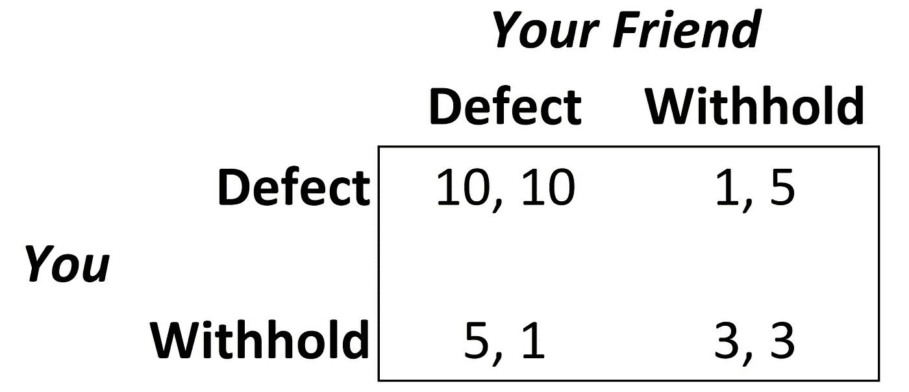
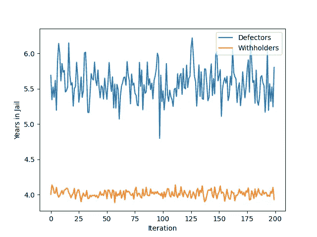
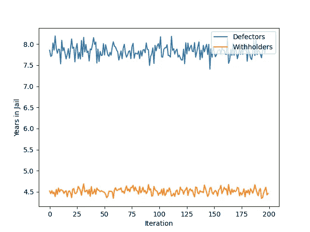
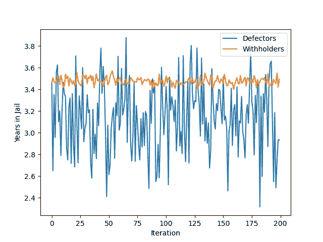

# 囚徒困境的计算方法

> 原文：<https://towardsdatascience.com/a-computational-approach-to-the-prisoners-dilemma-837a799cedf0?source=collection_archive---------41----------------------->

## 在这种充满犯罪的“棘手情况”下，最好的决定是什么

你和你的朋友犯了谋杀罪。几天后，警察把你们两个带走，把你们放在两个独立的审讯室里，这样你们就不能互相交流了。你认为你的生活结束了，但是警察提出了一个交易:

> 出卖你的朋友，你的刑期会轻一些。

比尔·牛津在 [Unsplash](https://unsplash.com/s/photos/crime?utm_source=unsplash&utm_medium=referral&utm_content=creditCopyText) 上的照片

关键是你的朋友也能得到这笔交易。

更具体地说，如果你出卖了你的朋友，但你的朋友什么也没说，他们会被判重刑，而你会被判轻刑。如果你们出卖对方，双方都会受到重罚。如果你们两个都保持沉默，对你和你的朋友来说，判决都是轻的。

这些决定必须在彼此不沟通的情况下做出，你和你的朋友只有两个选择:“叛逃”并告发他们，或者“隐瞒”信息，保持沉默。

看看下面的图表，它描述了你的选择和句子:

给你和你朋友的惩罚图。

**矩阵描述了根据你和你的朋友独立选择做的事情，你们两个人得到的年数。第一个数字代表你的入狱时间，第二个代表你朋友的。**

例如，如果你向警察隐瞒信息，但你的朋友选择出卖你，你会在最高安全监狱服刑五年，但你的朋友只服刑一年。

> 在这种情况下，你会怎么做？
> 
> 在这种情况下，你应该做什么？

这个问题没有简单的解决办法，对此有很多解释。功利主义者可能会说，扣留是更好的选择，因为它可以最大限度地减少两个人在监狱里度过的总年数(5 + 1 或 3 + 3，而不是 10 + 10)。概率怎么说？

# 解决困境

我创造了一群 1000 名囚犯，每个人都有 50-50 的机会成为叛逃者或扣留者。然后，我模拟了 500 对囚犯的互动，并记录了结果。这个实验我重复了 200 次。

叛逃者与扣留者(对半分)。

如你所见，如果叛逃者和扣留者的数量大致相同，那么试图扣留信息要好得多。大多数时候，回报会对你有利。叛逃者在监狱度过的平均年数是 5.75 年，而扣留者是 4.01 年。

我们可以通过改变叛逃者和扣留者的比例来让这变得更有趣一点。假设你在一个国家，每个人都不信任对方，75%的人是叛逃者，25%的人不信任对方。

叛逃者与扣留者(75-25 分)。

你最好的办法是向警方隐瞒信息。这是有道理的，因为如果你也背叛了，你很有可能以游戏中最糟糕的选择结束——10 年一件。

让我们再试一次。假设每个人都过度信任他人(尽管事实上他们刚刚犯了一桩谋杀案)。

叛逃者与扣留者(25-75 人)。

这个更有趣。**看起来你隐瞒信息会稍微好一点，但是回报是非常不一致的(在某些情况下，结果比背叛还要糟糕！).**这是因为在其他缺陷的情况下，扣留的刑期可能是三年或五年，而在其他缺陷的情况下，叛逃的刑期可能是一年或十年。3 和 5 之间的差异比 1 和 10 之间的差异要小得多，所以在后一种情况下差异要大得多。

在这种特殊情况下，你会怎么做？

如果你喜欢这篇文章，你可以在 Medium 上关注我，了解更多类似的内容。感谢阅读！