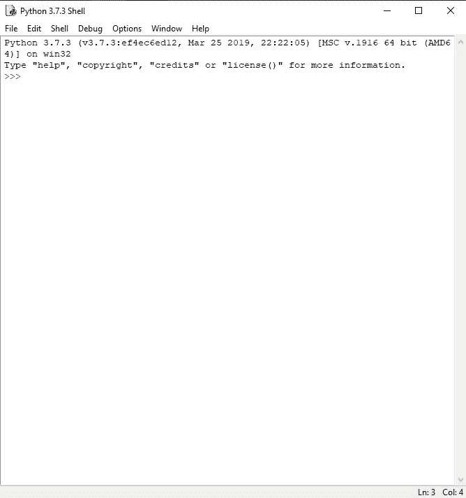
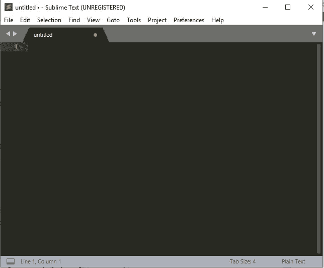
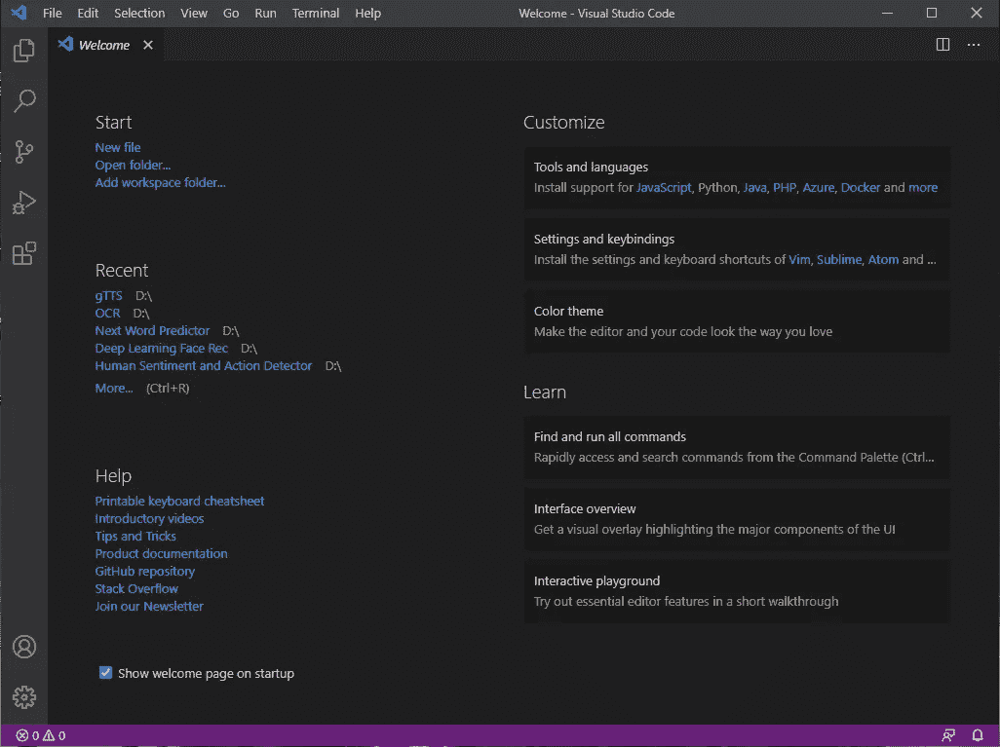
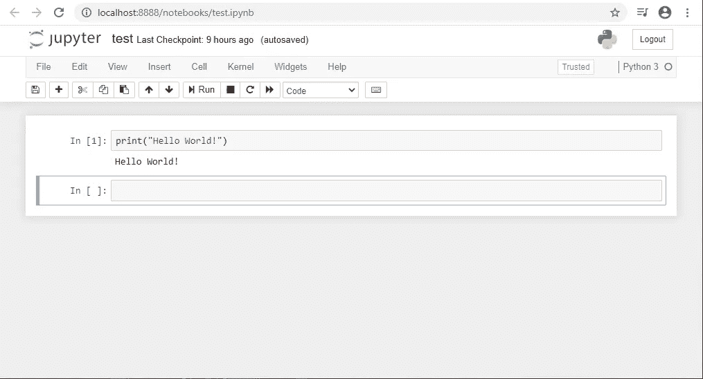
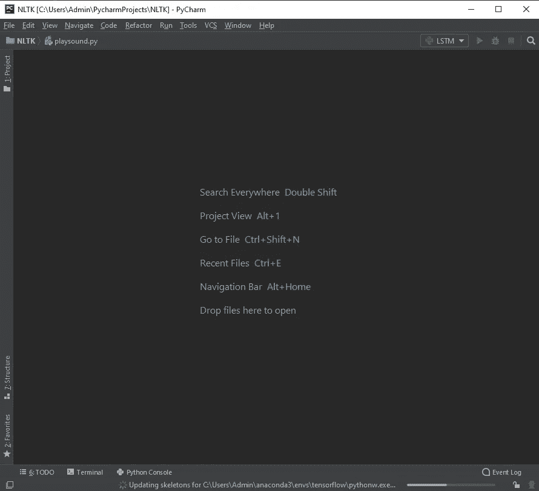
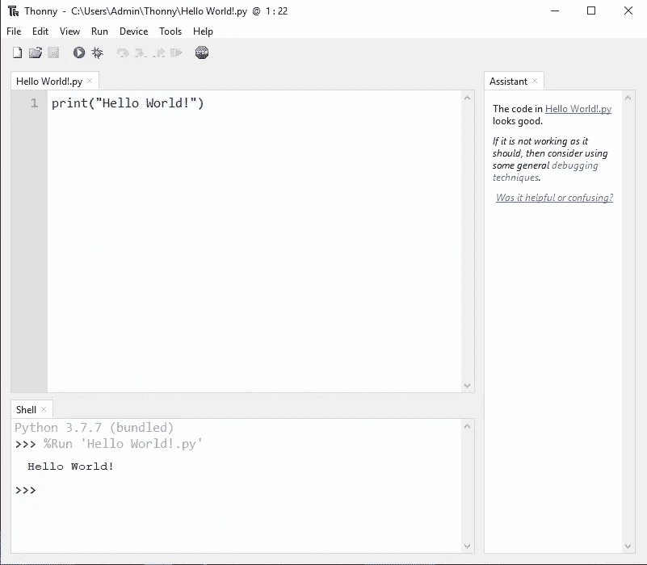
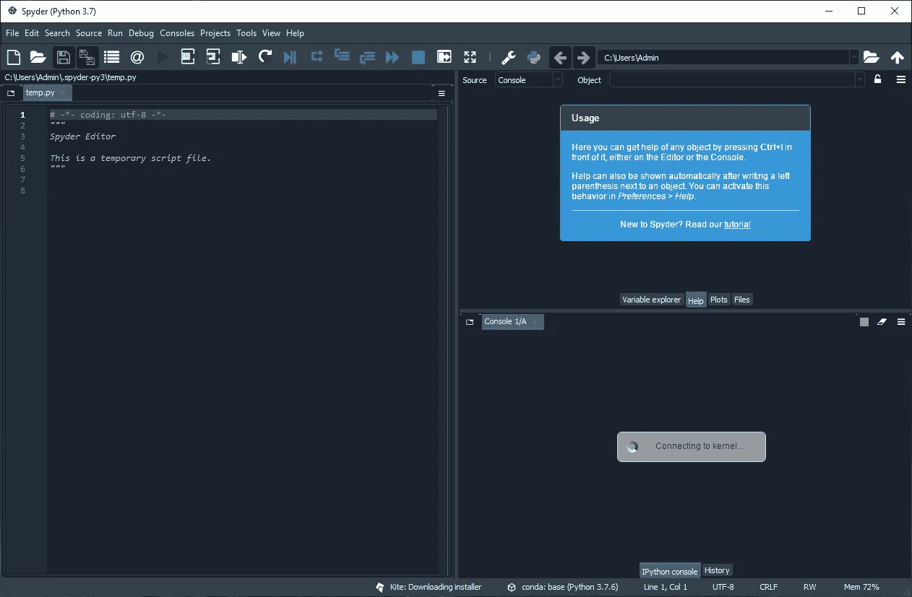
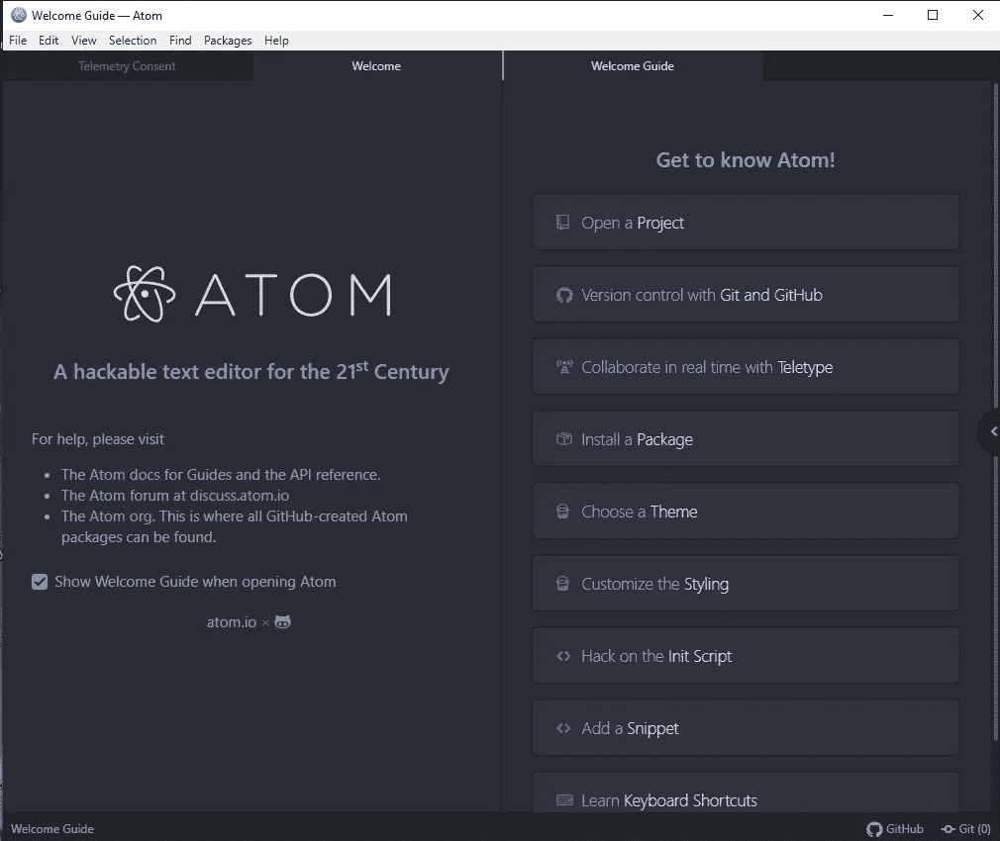
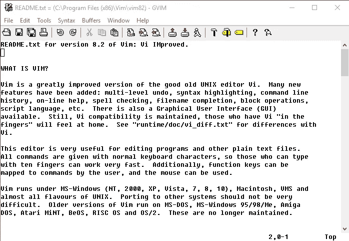
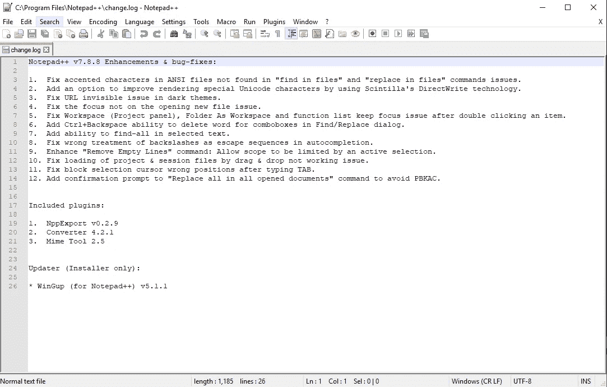

# 10+牛逼 Python 编辑器的简明指南，以及如何选择最适合你的编辑器:有利弊！

> 原文：<https://towardsdatascience.com/a-concise-guide-of-10-awesome-python-editors-and-how-to-choose-which-editor-suits-you-the-best-465c9b232afd?source=collection_archive---------29----------------------->

## 帮助您在各种 python 开发环境中进行选择的简明指南

罗布·兰伯特在 [Unsplash](https://unsplash.com/s/photos/technology?utm_source=unsplash&utm_medium=referral&utm_content=creditCopyText) 上拍摄的照片

# 简介:

集成开发环境(IDE)是一种软件，它为程序的编译和解释提供了全面的工具。它为编码人员、爱好者和开发人员提供了一个平台，通过源代码编辑器、自动化工具和调试器来试验和解释代码/程序。IDE 既可以支持单一的编程语言，如 Python 独有的 Pycharm，也可以支持多种编程语言，如 Visual Studio 代码。

因为 python 是现代的流行语言，所以它有很多可用的开发软件，如 Pycharm、visual studio code、Jupyter notebooks 等。让我们对每个编辑器做一个完整的分解，以及你应该考虑什么时候使用它们。我将提供更详细的指南，介绍我更熟悉的编辑，以及我认为更有吸引力的内容。然而，我也将给出一些我不太熟悉的编辑器的概要。

> **注:**文中提到的每一位编辑都绝对是梦幻般的牛逼。这个列表根据我个人的使用经验提供了一个简明的指南。你可能比其他人更喜欢一些。最终选择挑编辑器还是开发环境，完全是你自己的事情，不存在选择的对错。这些都有它的优点和缺点，每件事都以自己的方式令人惊叹。

# 5 个我最有经验并且经常使用的编辑器

## 1.Python 空闲

作者截图

这是在系统上安装 python 后得到的默认安装。这是编写 python 程序的最基本和最简单的模式。但是对于初学者来说，入门编程，了解 python 的基础知识，还是一个不错的选择。它附带了一些特性，比如 python shell，这是一个交互式解释器。它具有广泛的特性，如自动完成、语法高亮、智能缩进和一个基本的集成调试器。

## 优点:

*   轻量级。
*   适合初学者。

## 缺点:

*   不适合复杂的项目。
*   缺少高级功能。

## 2.崇高的文本

作者截图

Sublime Text 是一款免费软件，拥有广泛的社区支持，能够运行多种编程语言，包括 python。您可以在大多数情况下使用未注册的 Sublime Text，但偶尔您会收到一个弹出窗口，要求您注册该产品并获得许可证。它是高度可定制的，可以添加各种安装来提高 python 语言的工作质量，如调试、自动完成、代码林挺等。

## 优点:

*   易于使用并且大部分是免费的。
*   高度可定制。
*   紧凑有效。

## 缺点:

*   需要额外安装才能获得更好的 Python 体验。

## 3.Visual Studio 代码

作者截图

Visual Studio Code 是微软为 Windows、Linux 和 macOS 开发的免费源代码编辑器。特性包括对调试、语法高亮、智能代码完成、代码片段、代码重构和嵌入式 Git 的支持。它支持包括 python 在内的各种编程语言。您可能需要一些额外的安装来开始使用 Python，但是这非常简单。它不断更新，是 Python 和其他编程语言的最佳平台之一。我经常使用它，也强烈推荐它。

## 优点:

*   不断更新的奇妙平台。
*   与其他庞大的开发工具相比，软件内存的消耗非常低。
*   控制台终端集成，易于使用。

## 缺点:

*   有时，终端会变得有点问题，不能按预期运行。

## 4.Jupyter 笔记本

作者截图

Jupyter Notebook 是一个开源的 web 应用程序，允许您创建和共享包含实时代码、等式、可视化和叙述性文本的文档。用途包括:数据清理和转换、数值模拟、统计建模、数据可视化、机器学习等等。Jupyter 笔记本绝对是开始学习数据科学和机器学习的绝佳选择。这些笔记本可以与任何人共享，有助于更高效地协作编写代码。我强烈推荐使用 Jupyter 笔记本，因为你可以单独使用每个代码块，也可以选择使用降价。它被广泛应用于许多盈利的公司。

## 优点:

*   数据科学入门的最佳平台。
*   易于共享笔记本和可视化。
*   降价和其他附加功能的可用性。

## 缺点:

*   缺少一些 IDE 中包含的强大功能。

## 5.皮查姆

作者截图

PyCharm 是一个用于计算机编程的集成开发环境，专门用于 Python 语言。它是由捷克公司 JetBrains 开发的。因为这是专门为 Python 开发的，所以它拥有你想要的所有广泛的特性和额外的支持。这些包括代码完成、代码检查、错误突出显示、修复、调试、版本控制系统和代码重构。它可以在多种平台上使用，例如 Microsoft Windows、Linux 和 macOS。它有免费版和付费专业版。付费专业版有一些额外的功能，但免费版对于大多数编码和编程相关的活动来说已经足够了。如果你有至少 8GB 的内存和一台高质量的电脑，我会强烈推荐 Pycharm。

## 优点:

*   惊人的内置功能。
*   由对 python 支持最好的顶尖公司开发。
*   也支持 anaconda 虚拟环境。

## 缺点:

*   Pycharm 的主要问题是，如果你有一台个人电脑或笔记本电脑是低端的，没有至少 8 GB 的内存，会有点滞后，速度很慢。

# 其他优秀的编辑:

## 1.Thonny 编辑

作者截图

Thonny 集成开发环境(IDE)，预安装在 Linux 和基于 Linux 的平台上。但是，您必须在 Windows 平台上手动安装它。我对 Thonny 编辑器的体验主要是在树莓 Pi 上。这是一个很好的开发环境，初学者很容易上手。对于树莓 Pi 项目来说是极其牛逼的。它的一些特性包括语法错误突出显示、调试器、代码完成、单步执行表达式求值等。

## 优点:

*   互动环境。
*   适合初学者。
*   可用于树莓 Pi 项目。

## 缺点:

*   有时容易出问题。
*   没有广泛的功能。

## 2.Spyder

作者截图

Spyder 是用 Python 语言进行科学编程的开源跨平台集成开发环境。Spyder 是一个强大的科学环境，它用 Python 编写，面向 Python，由科学家、工程师和数据分析师设计，并为他们服务。它将综合开发工具的高级编辑、分析、调试和分析功能与科学包的数据探索、交互式执行、深度检查和漂亮的可视化功能进行了独特的结合。在任何 Spyder 支持的平台上启动和运行 Spyder 的简单方法是下载它作为 Anaconda 发行版的一部分，并使用 conda 包和环境管理器来保持它和其他包的安装和更新。开发人员推荐最新的 64 位 Python 3 版本，除非您有特别的要求。

## 优点:

*   anaconda 提供的免费编辑器。
*   很好的工作环境，可以并排看到解释和代码。
*   拥有 python 独有的大量选项。

## 缺点:

*   界面略显生疏。

## 3.原子

作者截图

这个 IDE 类似于 Sublime 文本编辑器，但对 Python 有额外的要求。它是高度可定制的，并支持 python 所需的许多包。这是崇高文本的另类选择。我在这方面的经验比较少，所以我会推荐 sublime text 而不是 Atom，但是对这两者都比较有经验的观众，请让我知道你更喜欢哪一个。Atom 中用于 Python 开发的一些常用包有 autocomplete-python、linter-flake8、python-debugger 等。

## 优点:

*   好用。
*   通过附加安装支持 python。

## 缺点:

*   需要额外的 python 插件。
*   更适合 git 应用。

## 4.精力

作者截图

Vim 是预装在 macOS 和 UNIX 系统中的文本编辑器。但是，您需要在 Windows 平台上手动下载它。由于 vim 的高计算能力和轻量级紧凑开发工作环境，大多数专家都非常喜欢它。不建议初学者使用它，因为它有一个陡峭的学习曲线，你必须花费额外的时间和精力来理解 VIM 软件。您可以添加插件来突出语法、代码完成、调试、重构等。到 Vim，并将其用作 Python IDE。

## 优点:

*   轻量级。
*   有效。
*   富有成效。

## 缺点:

*   你必须花费专门的时间来学习整个编辑器，它有一个陡峭的学习曲线。

## 5.记事本++

作者截图

Notepad++是一个文本和源代码编辑器，用于 Microsoft Windows。它支持选项卡式编辑，允许在一个窗口中处理多个打开的文件。项目的名字来自 C 增量运算符。Notepad++作为免费软件分发。notepad ++支持各种编程语言的许多开发环境，是一个值得考虑的选择。在我看来，有更好的选择，你也需要做一些额外的安装，以使它完全适用于 python。

## 优点:

*   易于使用类似于记事本。
*   可用于包括 python 在内的多种编程语言。

## 缺点:

*   需要更多的设置和调整来运行 python。
*   不在我的首选名单上，因为有很多更好的选择。

## 6.其他在线编辑

Programiz、tutorials point、w3schools 和其他一些网站为在线编辑提供了一些很棒的选择。我已经错过了一些，但检查了所有的在线编辑器，因为他们大多数都是免费的，玩起来很有趣。如果你懒得完成 python 的所有设置过程，那么就跳进在线编辑器的世界去探索吧。

## 优点:

*   没有额外的安装或额外的设置程序。
*   简单的代码可以轻松运行，没有太多的麻烦。

## 缺点:

*   不如其他 IDE 强大。

由 [Unsplash](https://unsplash.com?utm_source=medium&utm_medium=referral) 上的[窗口](https://unsplash.com/@windows?utm_source=medium&utm_medium=referral)拍摄

# 结论:

唷！那是一个很长的名单。我已经介绍了几乎所有我使用过的 python 编辑器。然而，有趣的是，我可能错过了一些甚至很多，因为有太多的开发环境。也有大量的编辑器正在构建中，以使用户体验更加可定制和有趣。我希望这本简明指南能够帮助观众。如果我错过了什么，请随时告诉我。有这么多选择，但不要不知所措。我想重申，选择没有对错之分。

最后，选择你觉得最舒服、最喜欢的编辑器。

查看我最近的一篇文章，关于几乎任何人都可能犯的 5 个常见 python 错误以及如何避免它们。

 [## 5 个常见的 Python 错误以及如何避免它们！

### 从初学者到专家，每个人在 python 和机器学习中都容易出现这些错误。

towardsdatascience.com](/5-common-python-errors-and-how-to-avoid-them-63d9afc1a58f) 

请随意查看下面的文章系列，这些文章将从头开始涵盖对机器学习的全部掌握。它们将不断更新，本系列将从头开始涵盖与 python 进行机器学习相关的每个主题和算法。

 [## 开始使用 Python 掌握机器学习的旅程

### 了解精通机器学习的基本要求

towardsdatascience.com](/starting-your-journey-to-master-machine-learning-with-python-d0bd47ebada9)  [## 机器学习所需的 Python 基础知识及其库模块

### 学习 python 数据结构的基础知识，对机器所需的每个库有直观的理解…

towardsdatascience.com](/basics-of-python-and-its-library-modules-required-for-machine-learning-51c9d26026b8) 

感谢大家阅读这篇文章。祝大家度过美好的一天！

## 参考资料:

1.  【https://www.spyder-ide.org/ 
2.  [https://www.programiz.com/python-programming/ide](https://www.programiz.com/python-programming/online-compiler/)
3.  [https://notepad-plus-plus.org/downloads/](https://notepad-plus-plus.org/downloads/)
4.  [https://www.vim.org/](https://www.vim.org/)
5.  [www.trustradius.com](http://www.trustradius.com)
6.  [https://en.wikipedia.org/wiki/Wiki](https://en.wikipedia.org/wiki/Wiki)