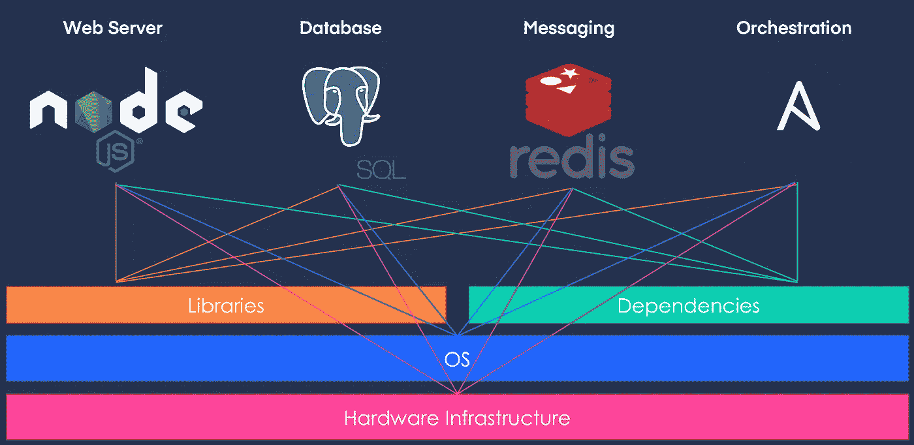
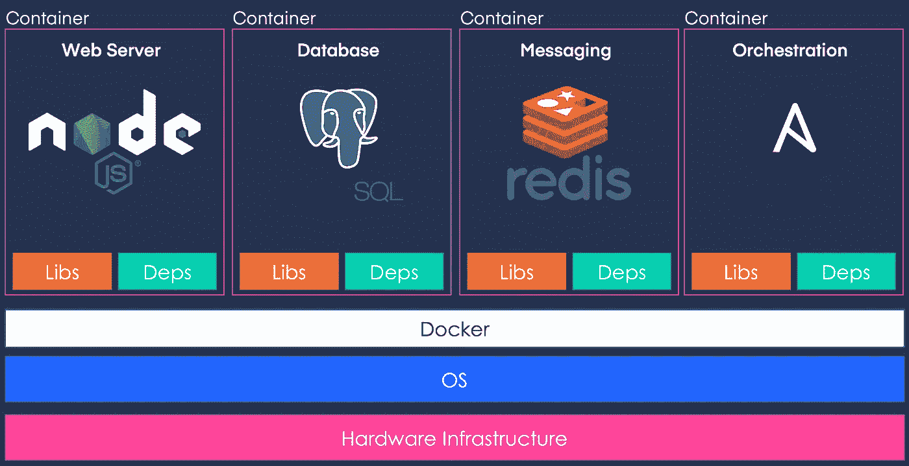
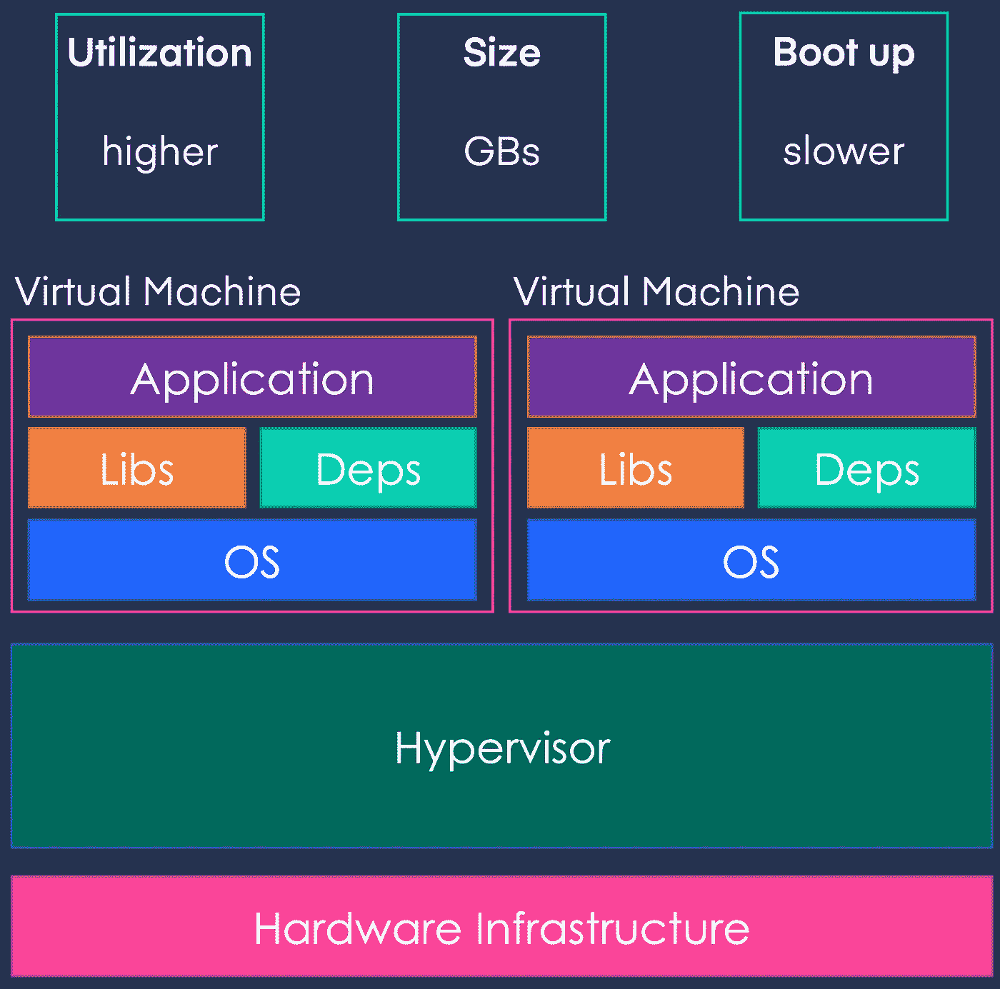
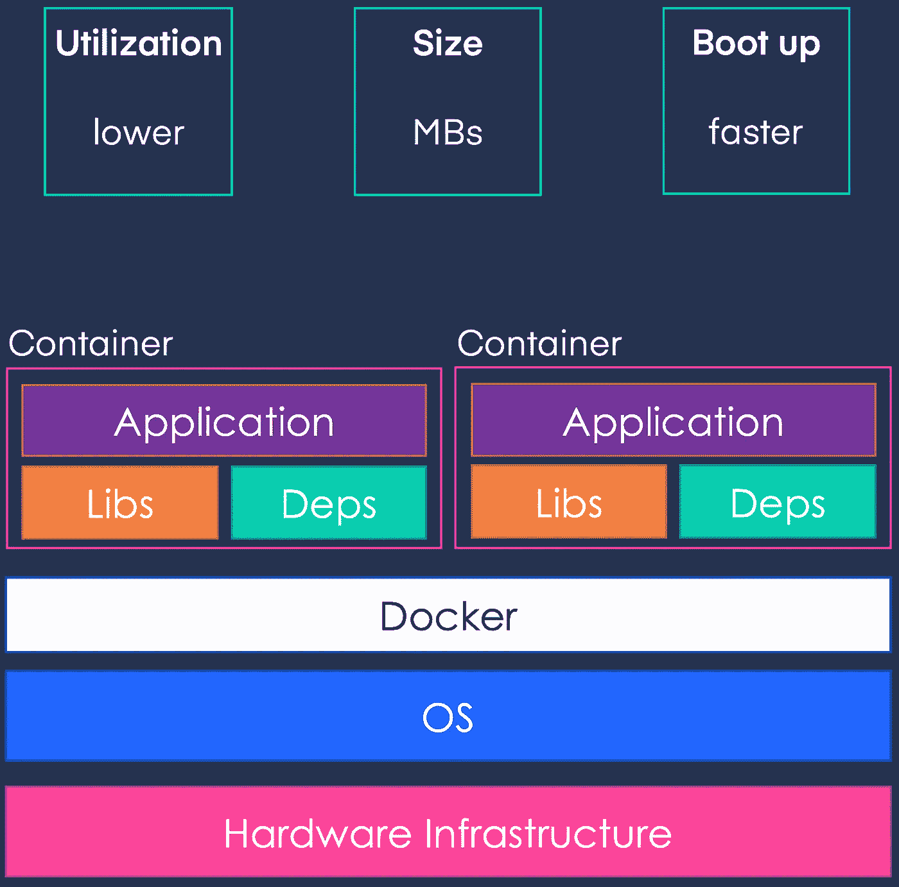
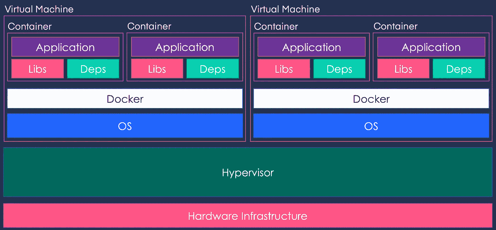
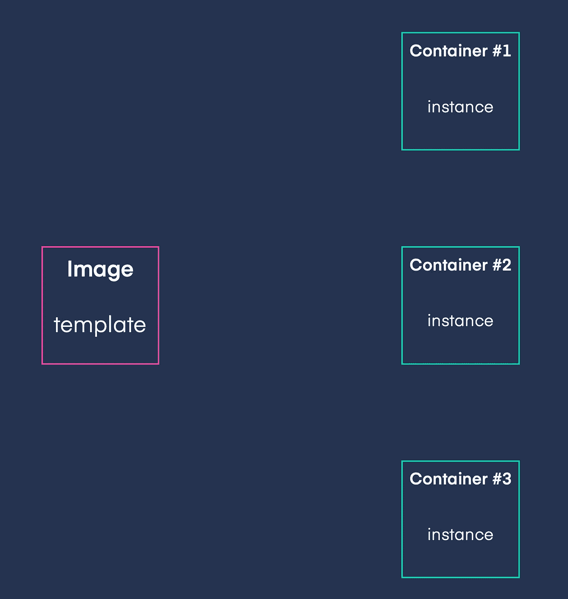

# 码头工人手册

> 原文：<https://towardsdatascience.com/a-concise-guide-to-docker-f6b6d5fb56f4?source=collection_archive---------47----------------------->

## 码头工人简明指南

有几门关于这个主题的课程。有些非常短，除了“入门课程”之外没有任何其他用途，而另一些则非常长，需要你花几天时间来学习和理解一切。我写这篇教程的目的是在简洁和详尽之间找到平衡。

接下来的部分更多的是 Docker 的欣赏部分。如果你已经知道 Docker 是什么以及它是如何有用的，你可以跳到下一节来节省一些时间。

1.  简介(你来了！)
2.  [Docker 文件](https://medium.com/@gyani91/docker-file-179b5e3d9171)
3.  [基本对接命令](https://medium.com/@gyani91/docker-commands-bbf02780b785)
4.  [端口和卷映射](https://medium.com/@gyani91/port-and-volume-mapping-c8bb09221f82)
5.  [Docker 联网](https://medium.com/@gyani91/docker-networking-919461b7f498)
6.  [码头仓库](https://medium.com/@gyani91/docker-storage-598e385f4efe)
7.  [Docker 撰写](https://medium.com/@gyani91/docker-compose-44a8112c850a)
8.  [删除 Docker 实体](https://medium.com/@gyani91/deleting-docker-entities-2f90e4a0a765)

Docker 是一个工具，旨在通过使用容器更容易地创建、部署和运行应用程序。容器允许开发人员将应用程序所需的所有部分打包，如库和其他依赖项，并作为一个包发送出去。

当您的应用程序需要多个组件相互交互时，通常会出现依赖库的版本需求冲突。一旦所有组件之间就其依赖关系的版本达成一致，添加另一个组件或甚至升级其中一个组件都会破坏这一协议。

没有码头工人的生活

Docker 解决这个问题的方法是将这些组件放入单独的隔离环境中，称为“容器”,并带有各自的依赖关系。所有这些容器仍然共享同一个内核。

简单的 docker 示例

与虚拟机相比，Docker 容器更轻(尺寸更小)，启动时间更短，并且不是完全隔离的。

虚拟机架构

码头建筑

问题不在于使用虚拟机还是 Docker 容器。现代生产部署同时使用这两者。这种体系结构允许您减少虚拟机数量，从而减少资源消耗并加快启动速度。

docker-虚拟机架构

简单地说，docker 映像是应用程序及其环境的模板。我们可以从一个图像中旋转出多个容器。映像包含运行应用程序所需的一切，包括源代码、库、配置文件和环境变量。docker 容器是这个映像的运行时实例。

Docker 图像及其容器

Docker image 是一个超级强大的机制，可以扩展您的应用程序。您可以从单个映像运行任意数量的容器，所有容器都将支持完全相同的依赖关系。如果你正在使用一个容器编制器，像 [Kubernetes](https://kubernetes.io) 一样，你只需要说明你想要多少容器用于一个特定的图像，编制器就会在你所有的 Docker 服务器上创建和维护它们。

如果您使用 Docker 容器并且没有停机时间，那么升级生产系统是无缝的！您只需指示 orchestrator 您想要运行一个新的映像版本，它就会逐渐用运行新版本的容器替换每个容器。

在[的下一节](https://medium.com/@gyani91/docker-file-179b5e3d9171)中，我们将看到什么是 Dockerfile 以及如何编写 docker file？

参考:

[1] Docker， [Docker 概述](https://docs.docker.com/get-started/overview/) (2020)，Docker 文档

[2]穆姆沙德·曼南贝斯，[为绝对初学者准备的 Docker](https://kodekloud.com/p/docker-for-the-absolute-beginner-hands-on)(2020)，KodeKloud.com