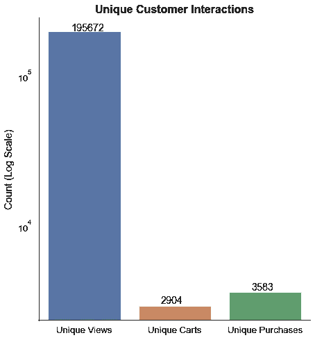
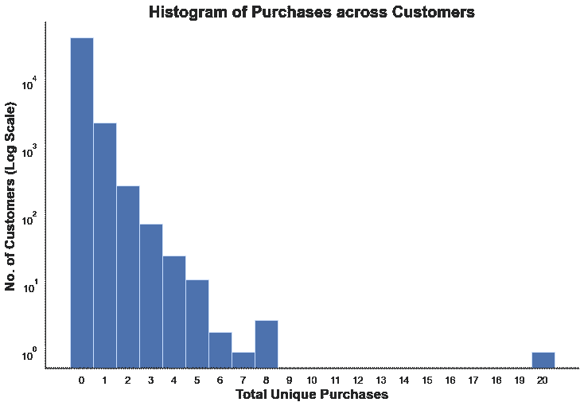
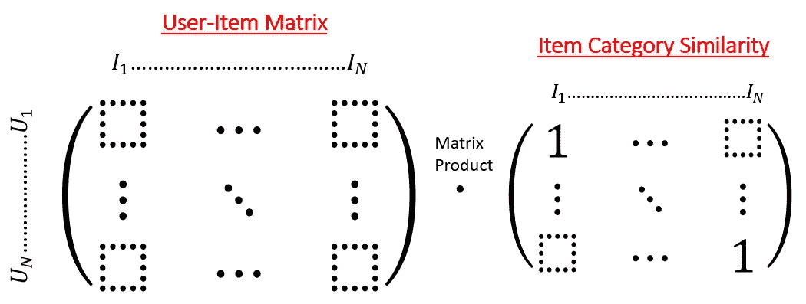
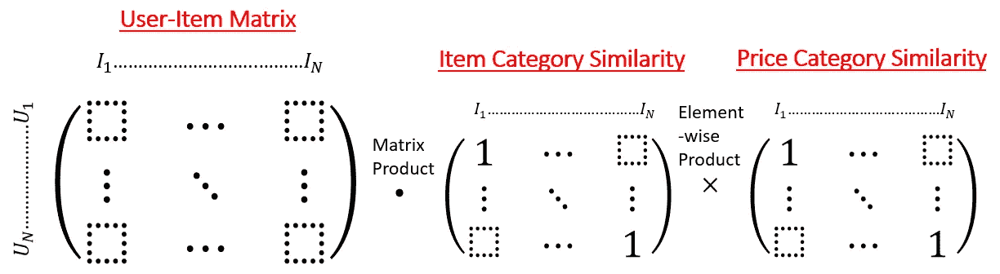
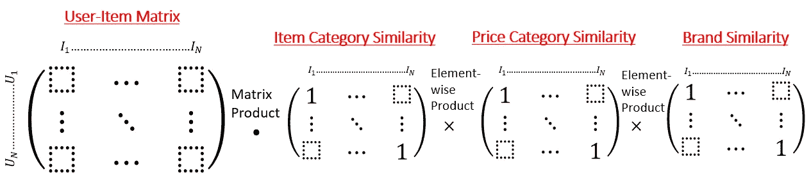
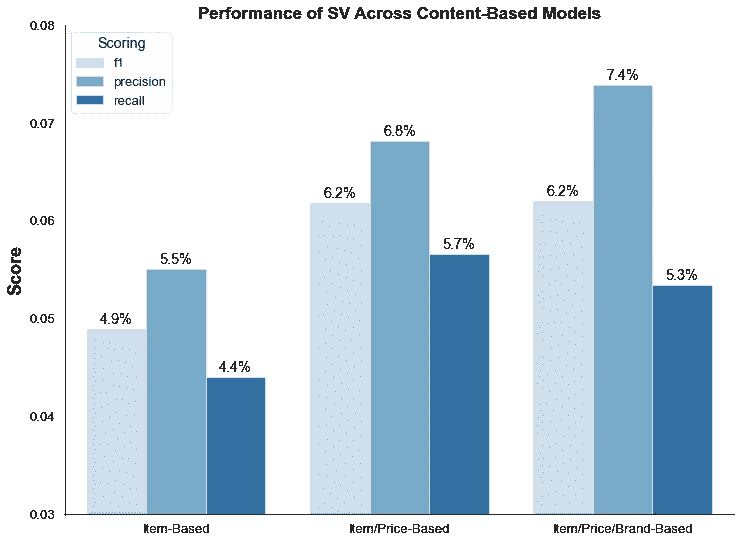
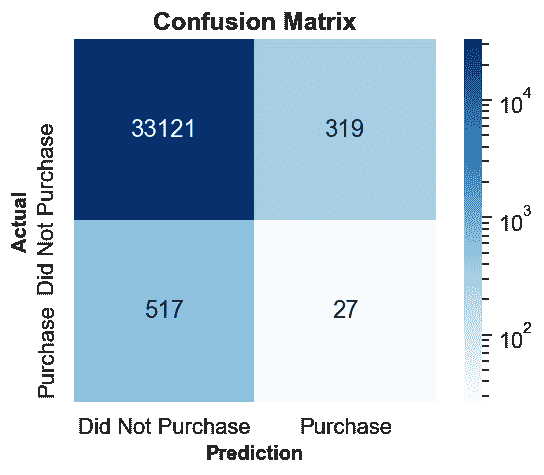
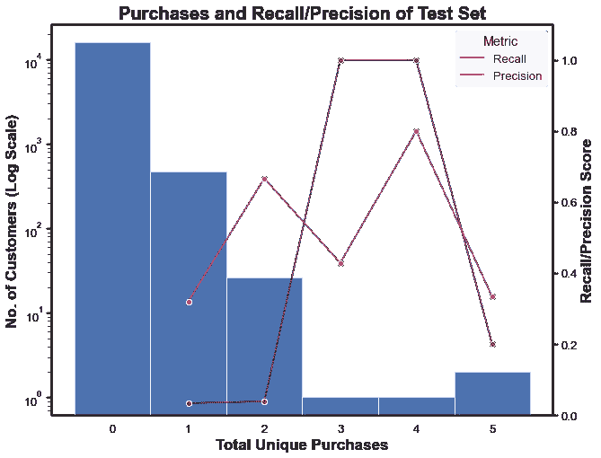

# 一种基于内容的电子商务网站推荐系统

> 原文：<https://towardsdatascience.com/a-content-based-recommender-for-e-commerce-web-store-7554b5b73eac?source=collection_archive---------4----------------------->

## 矩阵相乘和余弦相似的简单算法实例研究

[rupixen.com](https://unsplash.com/@rupixen)在 [Unsplash](https://unsplash.com/) 上拍照

从电子商务、社交媒体到新闻媒体，推荐系统在消费者日常生活的在线平台上已经无处不在。我们的偏好和偏见被机器学习算法超级充电，这些算法从我们的口味中学习，并推荐更多我们希望看到的东西。因为推荐系统对我们的生活，进而对社会有着如此深远的影响，我决定将 Metis 数据科学训练营(新加坡，第 5 批)的最后一个项目用于为电子商务网络商店创建一个简单的推荐算法。在我们开始我的项目之前，我想给你一个关于两种推荐系统的概述:

**基于内容的过滤推荐器**:顾名思义，这种推荐器利用项目或用户背景信息之间的相似性向用户提出推荐。例如，如果用户 A 通常给科幻电影一个好的评级，推荐系统将向用户 A 推荐更多的科幻类型的电影。在另一个例子中，如果用户 B 是较高收入群体的个人，银行推荐系统可能将用户 B 标记为额外投资计划的潜在客户。

*   **优点**:容易克服冷启动问题——当没有或很少有用户-项目交互时，推荐器仍然能够向用户提供好的推荐。
*   **缺点:**需要物品/用户的背景信息。每当有新的项目/用户时，这些背景信息必须被编目和添加进去。

**协同过滤推荐器**:这种类型的推荐器识别先前和其他用户-项目交互中的趋势和模式，并基于当前用户现有的交互向他建议类似的推荐。核心思想是基于将相似口味的消费者聚集在一起。例如，一个新闻推荐器检测到，消费支持唐纳德·特朗普的新闻的用户也对阴谋论相关的新闻感兴趣。因此，如果有用户最近对特朗普新闻感兴趣，他也将被推荐与阴谋论相关的新闻。

*   **优点**:利用用户-项目交互背后隐藏的相关性，不需要大量的手工映射和数据编目。
*   **缺点**:容易出现冷启动问题，在能够向现有用户提供有意义的推荐之前，需要现有的用户-项目交互库。

还有混合推荐系统，它结合了基于内容的过滤和协同过滤，实现了两个世界的最佳效果。然而，这种推荐系统通常是先进的，并且需要设计神经网络。

对于这个项目，由于短时间内数据的稀疏性，我决定采用基于内容的过滤来推荐电子商务网上商店的产品，方法是定制一个算法来处理不同类别的产品信息。

# 1.数据转换

从 [Kaggle](https://www.kaggle.com/mkechinov/ecommerce-behavior-data-from-multi-category-store) 开始，我在 2 个多月的时间里获得了一个电子商务网店大约 1.1 亿的用户-产品交互数据。由于数据量巨大，我决定将数据缩减到大约 5 天，并且只从产品类别中过滤“计算机”,这样就剩下大约 35 万个用户-产品交互数据。原始数据集如下所示:

列特性‘event _ type’将作为我的推荐器模型的目标，它有 3 个类别:视图、购物车和购买。然后，我根据这些用户-商品交互提供一个用户分数——查看:1，购物车:10，购买:50。此外，我还将物品分为 5 个不同的价格类别。稍后讨论的一些模型中的假设是，客户倾向于购买低端或高端产品。代码和生成的数据帧如下所示:

注意，每个用户项目条目被记录用于一个用户会话，因此每个用户每个项目可能有多个交互。因此，我进一步执行了一个 groupby 操作，以发现每个独特的用户-项目交互的用户得分总和。这形成了用于稍后建模的用户项目矩阵的“评级”。此外，我将 MinMaxScaler 应用于用户分数，以获得一个介于 0 和 1 之间的交互分数。高于 0.5 的交互分数指示发生购买的概率非常高，而低于 0.5 的阈值则没有购买发生。代码和生成的分组数据帧如下所示:

# 2.探索性数据分析

用条形图和直方图剖析数据集的目标(查看/购物车/购买)(图片由作者提供)

在模型选择和开发之前，我深入研究了推荐系统目标的数据可视化(查看/购物车/购买)。不出所料，这个目标高度失衡，从观看到购买的转化率约为 1.8%。此外，根据直方图，大多数顾客根本没有购买任何东西。正如我们将看到的，这表明推荐系统准确预测购买是具有挑战性的。

# 3.型号选择

继续进行模型选择，我首先使用一个简单的验证范例将所有“组”数据集分为训练、验证和测试数据集:

将数据集分成 60%的训练、20%的验证和 20%的测试。(图片由作者提供)

随后，我将训练集转换成一个稀疏的用户项目矩阵，将空条目填充为零作为用户得分:

现在，我将考虑 3 种不同的基于内容的过滤模型:

*   按项目类别过滤
*   按项目类别和价格类别过滤
*   按项目类别、价格类别和品牌过滤

对于每个模型，我将根据下面所示的算法在用户-项目矩阵和项目-项目相似性矩阵之间应用矩阵乘积:

模型 1:按项目类别过滤(图片按作者)

模型 2:按项目类别和价格类别过滤(图片按作者)

模型 3:按商品类别、价格类别和品牌过滤(按作者分类的图片)

一旦矩阵乘法完成，就再次应用最小最大缩放器来获得预测交互得分的训练的用户-项目矩阵。为了简化说明，我将演示模型 3 的代码，如下所示:

然后，经过训练的用户项目矩阵被重新转换回数据框，然后与验证数据集合并。同样，预测交互得分高于 0.5 的项目被标记为客户的预测购买。

现在，比较客户对三个模型的实际购买和预测购买，模型 3 似乎是最有希望的，具有最高的精确度，与模型 2 相比，在召回方面没有牺牲太多。尽管如此，所有模型的精度和召回率都非常低，正如我在 EDA 过程中的分析所预期的那样。

三种基于内容的推荐模型在简单验证中的性能。(图片由作者提供)

# 4.模型评估

选择模型 3 作为我的推荐系统的最终模型，我继续一起重新训练训练和验证数据集，然后在测试数据集上进行评估，实现了 5.0%的召回率和 7.8%的精确度。

测试集的混淆矩阵，显示召回率和精确度。(图片由作者提供)

然而，当我根据独特购买的数量来评估精确度和召回率时，一个有趣的趋势是显而易见的。对于至少购买过一次的客户来说，模型的精确度实际上要高得多！因此，这意味着当模型向购买的顾客作出推荐时，我们更有信心顾客会实际购买该产品。因此，最终没有购买的客户的预测购买的假阳性降低了模型的整体精度。

此外，据观察，购买更多产品的客户召回率更高。这可能是因为衡量模型的方式更偏向于购买客户。因此，可以做进一步的调优和调整来提高模型的召回率。

# 5.模型演示

在这一部分中，我将演示在训练/验证数据集和测试数据集内特定客户(用户 ID: 518044530)的用户-项目交互，以及模型将为客户提供的潜在建议。在训练/验证数据集中捕获以下用户-项目交互:

训练/验证数据集中的客户(用户 ID: 518044530)。

在测试数据集中，我们看到模型准确地预测了用户购买。这是因为在训练/验证数据集中，客户对类似项目的互动得分很高。

测试数据集中的客户(用户 ID: 518044530)。

从这位客户(用户 ID: 518044530)的热门推荐中随机抽取一个样本，我们看到该模型产生了与他/她之前互动过的相似类别、价格范围和品牌的产品:

针对客户的随机前 10 项建议(用户 ID: 518044530)

# 6.结论

该项目详细介绍了执行基于内容的推荐系统的端到端管道，并作为 Metis 数据科学训练营最终项目的一部分完成。尽管这个模型远非完美，但它展示了一个基于内容的推荐器是如何过滤多个类别的产品信息的。在未来，理想情况下，可以通过建立深度神经网络来尝试更有效的混合推荐系统。

在这次为期 12 周的训练营结束之际，我真的要衷心感谢我的天才导师尼奥·韩伟，他让我学到了很多东西，我还要感谢我的队友，特别是丹尼尔·张和李心妮，他们给予了我精神和情感上的支持，使这次学习之旅成为可能。

另外，如果你感兴趣，下面是我在训练营期间精心制作的一些其他项目的链接:

## 项目 3

 [## 用分类预测航空旅客的满意度

### 案例研究与 KNN，逻辑回归，高斯 NB，决策树和随机森林。

towardsdatascience.com](/predicting-satisfaction-of-airline-passengers-with-classification-76f1516e1d16) 

## 项目 2

 [## 回归预测国际足联足球运动员的市场价值

### 线性、套索、岭、弹性网和多项式回归的案例研究。

towardsdatascience.com](/predicting-market-value-of-fifa-soccer-players-with-regression-5d79aed207d9) 

## 项目 1

 [## 探索性数据分析 Data 十字转门街道交通分析

### Metis 数据科学训练营的一个简单的探索性数据分析项目

towardsdatascience.com](/mta-turnstile-traffic-analysis-to-optimize-street-engagements-a7391adc4d45) 

*P.S .如果你对* ***加速学习数据科学*** *感兴趣，这里还有一篇关于养成良好学习习惯的极其有用的文章:*

 [## 数据科学有效学习完全指南

### 让你在数据科学(或任何学科)领域飞速发展的基本指南

towardsdatascience.com](/a-brief-guide-to-effective-learning-in-data-science-637de316da0e) 

> 最后，非常感谢您的阅读！这里是到我的 GitHub 的[链接](https://github.com/tanpengshi/Metis_Project_5_Ecommerce)，它包含了这个项目的所有代码和演示幻灯片。也可以通过我的 [LinkedIn](https://www.linkedin.com/in/tanpengshi/) 联系我或者在下面评论来讨论！
> 
> ***支持我！*** —如果你*没有*订阅 Medium，并且喜欢我的内容，请考虑通过我的[推荐链接](https://tanpengshi.medium.com/membership)加入 Medium 来支持我。

 [## 加入我的介绍链接媒体-谭师鹏阿尔文

### 阅读谭·师鹏·阿尔文(以及媒体上成千上万其他作家)的每一个故事。您的会员费直接…

tanpengshi.medium.com](https://tanpengshi.medium.com/membership)