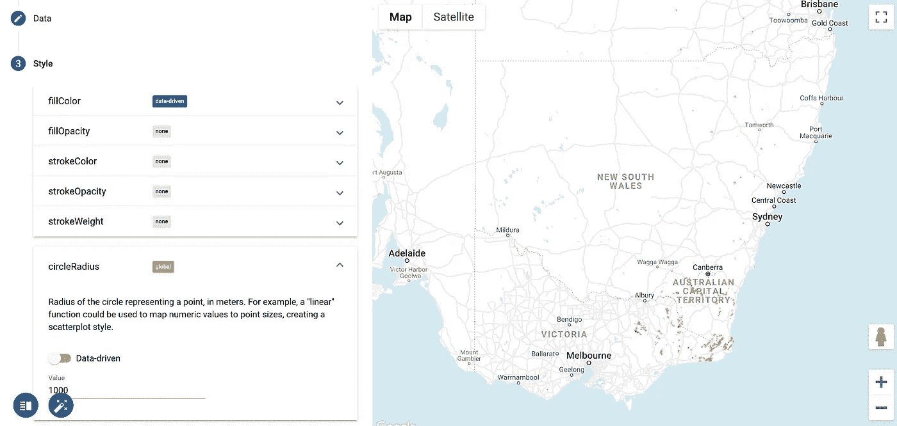
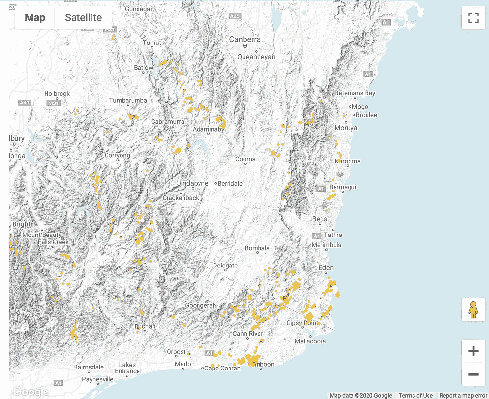
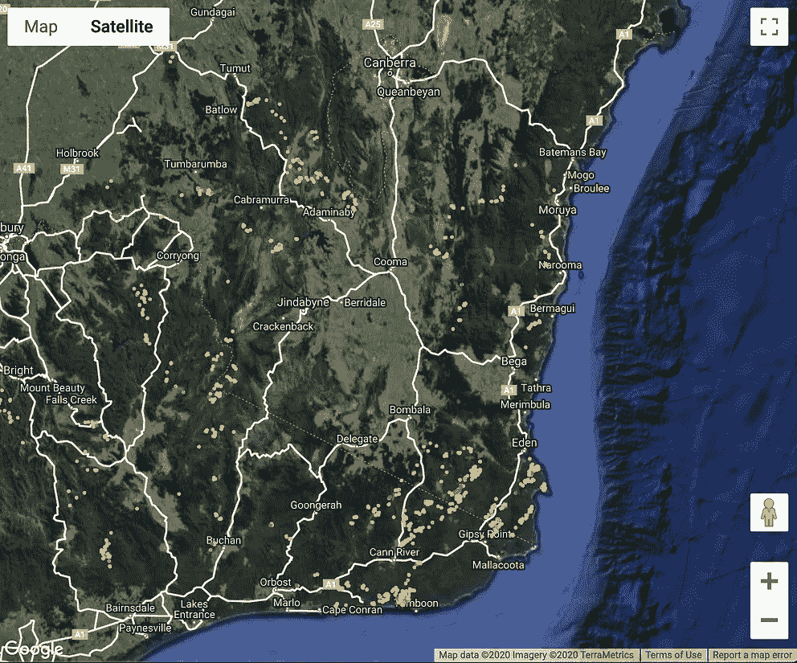
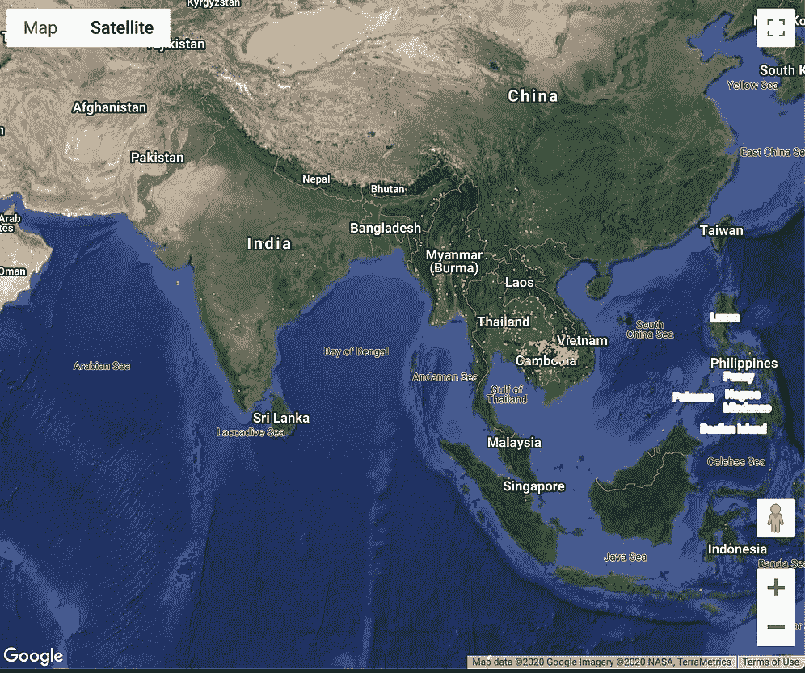
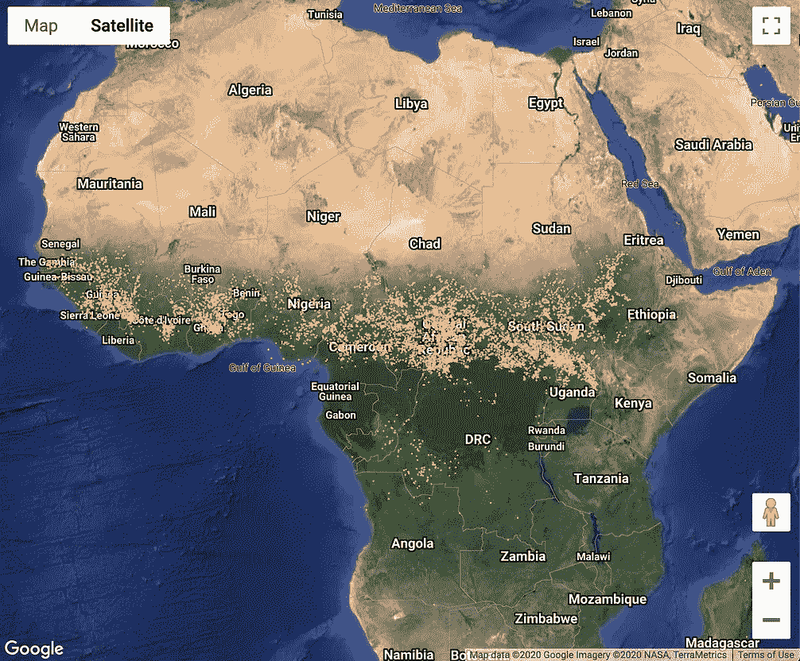

# 着火的大陆

> 原文：<https://towardsdatascience.com/a-continent-on-fire-a8cc7b47e0f2?source=collection_archive---------50----------------------->

## 使用 BigQuery Geo Viz 可视化野火


*这张图片是在* [*知识共享*](https://commons.wikimedia.org/wiki/File:Bush_fire_at_Captain_Creek_central_Queensland_Australia..JPG#metadata) *许可*下授权的

澳大利亚的野火已经烧毁了超过 1070 万公顷的土地。客观地说，这比苏格兰或韩国的面积还要大。破坏的规模确实是空前的。这场大火已经夺去了几十条生命和五亿多只动物的生命。

这个周末，当我看着悉尼港上空的雨时，我不禁想知道是否有一种方法可以让我成为这个挑战的长期解决方案的一部分。火灾一直是这片土地的特色，而且只会越来越严重。作为小小的第一步，我想至少想象一下这些火灾发生在哪里。

进入 BigQuery 的魔力。

# 构建数据管道

BigQuery 托管各种不同的数据集，这些数据集可以公开访问。这是一个很好的数据探索资源。在这个存储库中，我找到了一个来自 NASA 的数据集，它提供了关于全球野火位置的数据。

该数据集涵盖了位置(纬度和经度)，以及上周检测到的火灾的各种属性。对于那些希望更深入了解的人，我从下面的 NASA 网站上剽窃了广告词。我说得再好不过了。

> 可见红外成像辐射计套件(VI IRS)375m([vnp 14 imgtdl _ NRT](https://earthdata.nasa.gov/earth-observation-data/near-real-time/firms/v1-vnp14imgt))主动火力产品是最新加入公司的产品。它提供来自 NASA/NOAA Suomi 国家极地轨道伙伴关系(Suomi NPP)和 NOAA-20 卫星上的 VIIRS 传感器的数据。375 m 数据补充了中分辨率成像光谱仪(MODIS)火灾探测；它们在热点探测方面都表现出良好的一致性，但 375 米数据的空间分辨率的提高对相对较小区域的火灾提供了更大的响应，并提供了较大火灾周界的改进绘图。375 米的数据也提高了夜间性能。因此，这些数据非常适合用于支持火灾管理(例如，近实时警报系统)，以及需要改进火灾绘图保真度的其他科学应用。推荐阅读: [VIIRS 375 m 主动火力算法用户指南](https://viirsland.gsfc.nasa.gov/PDF/VIIRS_activefire_User_Guide.pdf)

数据集的大小约为 40mb。与 Bigquery 能够处理的万亿字节和千兆字节规模的数据集相比，这实在是小得可笑。

我决定用一个简单的 SQL 语句将所有数据复制到一个项目中。

```
CREATE OR REPLACE TABLE
 `as-ghcn.nasa_wildfire.past_week` AS
SELECT
 ST_GEOGPOINT(longitude,
 latitude) AS longlat,
 *
FROM
 `bigquery-public-data.nasa_wildfire.past_week`
```

我需要将纬度和经度数据(`FLOAT`值)转换成`GEOGRAPHY`数据类型。这是形成数据并为 BigQuery Geo Viz 做好准备所需的唯一一点预处理。我将查询安排在每周一运行，并用 NASA 的最新数据更新数据集。

# 探索数据

BigQuery Geo Viz 是一个使用 Google Maps APIs 在 BigQuery 中可视化地理空间数据的 web 工具。您可以运行 SQL 查询并在交互式地图上显示结果。这是一个轻量级工具，允许您快速、交互式地浏览空间数据。我无法强调这有多痛苦。没有基本地图的配置或加载。

下面的查询加载了数据集中被高置信度检测到的所有火灾。我放大了澳大利亚的东海岸来提供一个可行的例子。该样式仅用于示例目的。



澳大利亚东海岸的野火

由于底层的基本地图是由谷歌地图支持的，因此有许多丰富的纹理特征可供用户使用，例如提供地形和卫星信息的视图。



澳大利亚维多利亚州的大火

你应该知道这个工具有一些限制。

*   Geo Viz 在地图上最多只能显示 2，000 个结果。
*   Geo Viz 支持众所周知的文本(WKT)格式的几何输入(点、线和多边形)，存储在`STRING`列中。您可以使用 BigQuery 的地理功能将纬度和经度转换为 WKT。
*   实时、交互式分析由您的浏览器在本地处理，并受浏览器功能的限制。
*   Geo Viz 不支持与其他人共享可视化、保存可视化或下载可视化进行离线编辑。

我发现最后一个限制非常令人失望，我希望产品团队将来能让 GCP 的客户也能使用它。

# 展望未来

放眼澳大利亚之外，我想看看世界其他地方是否有大火在燃烧。乍一看，中非和东南亚的大部分地区似乎都着火了。这肯定会成为全球新闻吧？



我在网上简单查了一下，你看到的火灾很可能是低强度的农业火灾。农民们通常会点燃农田，烧掉剩余的草和灌木。这种燃烧有助于保持肥沃的土壤。我记得我在坦桑尼亚的时候。

虚惊一场？也许吧，但我们无法确定，因为世界上许多地方都没有报道或报道不足。