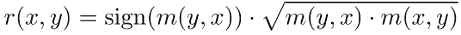

# 基于 Theil-Sen 回归的相关性度量

> 原文：<https://towardsdatascience.com/a-correlation-measure-based-on-theil-sen-regression-31b8b9ed64f1?source=collection_archive---------27----------------------->

来源:https://www.tylervigen.com/spurious-correlations

A 关联和相关测量是描述性统计和探索性数据分析的重要工具。它们为变量之间的函数关系提供了统计证据。

一个流行的测量方法是皮尔逊相关系数 **r(⋅，⋅**。对于度量数据样本 **x** 和 **y** ，给出如下:

其中 **s(⋅，⋅)** 是样本协方差， **s(⋅)** 是样本标准差。

如果我们把 **n** 观测值 **x** 和 **y** 的序列看作欧几里得空间 **ℝⁿ** 中的向量，那么相关系数就可以被几何解释。首先，我们通过重新调整 **x** 和 **y** 来标准化样本，如下所示:

其中 **μ(⋅)** 是算术平均值(从每次观察中减去)。这里我们假设使用无偏样本协方差，即因子为 **1/(n - 1)** 的样本协方差。然后，我们发现归一化样本位于单位球面上，相关系数是它们的点积:

这种高维几何解释有助于理解皮尔逊相关的一些重要性质。例如，我们立即理解，该度量允许我们比较归一化样本所指向的方向: **r(x，y) = 1** 表示它们指向相同的方向， **r(x，y) = -1** 表示它们指向相反的方向。如果 **r(x，y)** 消失，则矢量 **z(x)** 和 **z(y)** 正交。我们甚至可以通过关系式 **r(x，y) = cos(φ)** 计算归一化样本之间的“关联角度” **φ** 。

# 相关和回归

皮尔逊相关系数的另一个有用解释来自基于最小二乘法的简单线性回归。(其他解释见[罗杰斯和尼斯旺 1988](https://doi.org/10.2307%2F2685263) 。)在最后一段中，我们将两个样本视为两个维度为 **n** 的向量。我们现在要把它们看成是二维的 **n** 个数据点。如果我们使用最小二乘法来确定通过这些数据点的最佳拟合直线，其中我们将 **y** 视为响应变量，将 **x** 视为解释变量，则该直线的斜率为 **m(y，x) = s(x，y) / (s(x))** 。反之，如果我们把 **x** 作为响应变量，把 **y** 作为解释变量，回归线就会有斜率 **m(x，y) = s(x，y) / (s(y))** 。首先，我们观察到，无论哪个变量被视为因变量或自变量，回归线的斜率都不会改变符号。这一点，再加上一点代数，让我们得出结论:

简而言之:皮尔逊系数是最佳拟合直线斜率的(带符号)几何平均值，您可以通过最小二乘法绘制数据点。这个等式非常清楚地表明，皮尔逊系数测量了 **x** 和 **y** 线性*相关的程度。它还表明，皮尔逊系数与最小二乘法一样容易受到异常值的影响:它通常不被认为是稳健的统计量。Anscombe quartet 是一个旨在展示此类漏洞的合成测试数据集。尽管四个数据集以散点图的形式呈现非常不同，但基于最小二乘法的回归线是相同的:*

来源:[维基百科](https://en.wikipedia.org/wiki/Anscombe%27s_quartet)

简单线性回归的最小二乘法的另一种选择是 Theil-Sen 估计。这种更稳健的方法通过所有可通过数据点绘制的直线的斜率的中值来确定回归线的斜率:

因此，使用皮尔逊相关系数和最小二乘回归之间的上述关系，我们现在可以制定一个与泰尔-森估计相关的变量:

如果中值斜率具有相同的符号，否则为零。然而，在斜率的符号改变时将测量值设置为零的条件可能看起来是人为的:

*   当交换 **x** 和 **y** 时，中间坡度**通称为**不改变符号，
*   当它出现时， **x** 和 **y** 之间的肯德尔等级相关性消失。

这可以看如下。假设单个斜率的 **K** 为负，N-K**为正。交换 **x** 和 **y** 意味着取斜率的倒数。对斜率排序以计算其中值揭示了以下关系:**

我们可以看到，只有当负斜率和正斜率一样多时，中间值的符号才会发生变化。然而，这意味着肯德尔等级相关性τ消失，这可以从该度量的以下重写中看出:

我们可以在 Anscombe 四重奏上评估这个基于 Theil-Sen 的相关系数，并将其与 Pearson 系数进行比较。下表显示了这种比较，以及基于等级统计的另外两种流行的度量，Spearman 的ρ和已经提到的 Kendall 的τ:

可能有点令人惊讶的是，对于 Anscombe 4 数据集，Theil-Sen、Spearman 和 Kendall 相关性测量被证明是高度**不稳定的**:即使是最小幅度的任何噪声添加到数据点都会产生任意的相关性值。对于基于等级的 Spearman 和 Kendall 测量，这可以很容易地解释:如果大多数的 **x** 值是相同的或几乎相同的，数据中的微小变化可以产生任意的等级。

另一方面，Theil-Sen 估计器对回归线 **m(y，x)** 的斜率产生任意大的值，对 **m(x，y)** 产生任意接近于零的值，这导致在受到噪声影响时产生不明确的乘积。

一般来说，如果至少有一个要比较的样本只显示出很小的离差，那么相关测量将变得不可靠。对于稳健的相关性测量，这种离差应该通过稳健的方法来测量。Anscombe 4 数据集内的 **x** 值的中值绝对偏差消失，因此 Theil-Sen 估计相关性和等级相关性度量不明确也就不足为奇了。

# 摘要

稳健简单线性回归的 Theil-Sen 估计可用于定义相关性度量，类似于 Pearson 相关系数与最小二乘回归的关系。在 Anscombe 四重奏上进行评估，它显示出类似于等级相关性度量的特征，例如 Spearman 的ρ或 Kendall 的τ。

**参考文献**

安斯科姆，F. J. (1973)。“统计分析中的图表”。美国统计学家。27 (1): 17–21.

[罗杰斯；西弗吉尼亚州尼斯旺德(1988 年)。“看相关系数的十三种方法”。美国统计学家。42 (1): 59–66.](https://doi.org/10.2307%2F2685263)

[森·p·k .(1968)。“基于肯德尔τ的回归系数估计值”。美国统计协会杂志。63 (324): 1379–1389.](https://doi.org/10.2307%2F2285891)

希尔，H. (1950 年)。“线性和多项式回归分析的秩不变方法”。内德尔。阿卡德。韦滕施。，继续。53: 386–392.