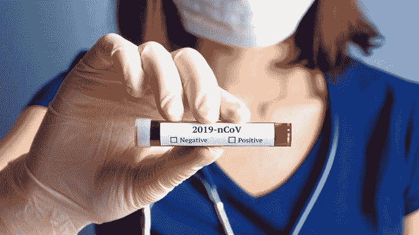
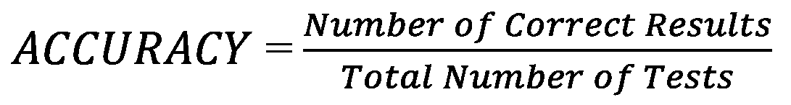
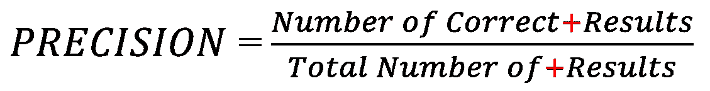
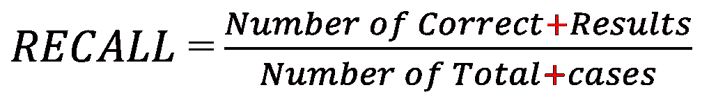
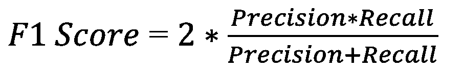

# 在 1 毫秒内达到 99.9%准确率的 COVID 测试——如何实现？

> 原文：<https://towardsdatascience.com/a-covid-test-that-is-99-9-accurate-in-under-1-millisecond-how-47a935d536b9?source=collection_archive---------34----------------------->

## 你甚至不需要去看医生。这项测试结果总是阴性。

来源:Getty Images

截至目前，美国有超过 43.5 万例 COVID 病例，美国人口为 3.27 亿。这大约是感染 COVID 人口的 0.13%，相当于每 1000 人中有 1.3 人受到影响。虽然这听起来确实是一个相当大的百分比，但是一个一直显示阴性的测试只有 0.13%的情况是错误的，或者对其余的 99.87%是正确的！

塞犍陀·维韦克

或者，公式中正确结果的数量将是(327，000，000–435，000 ),用这个数字除以美国人口=327，000，000 得出 0.9987 或 99.87%。这告诉我们**准确性**可能不是衡量测试有效性的最佳方式。那还有什么？

> 统计数据不会说谎。但是统计数据可能会被曲解。

# **精密**

假设我有一个更好的测试。如果你超过 85 岁，有潜在的疾病，正在经历咳嗽，发烧，疲劳，呼吸困难，需要尽快接上呼吸机，你可能患有 COVID，你不需要我告诉你去医院并被隔离。这个测试比总是阴性的测试更加精确。

塞犍陀·维韦克

再次以美国的 Covid 案例为例。在[疾控中心昨天发布的数据](https://www.cdc.gov/mmwr/volumes/69/wr/mm6915e3.htm)中，住院病例比例最大的来自于>85；85 岁以上的 10 万人中有 17 人住院。这如何转化为 85 岁以上住院的美国人总数？根据老龄管理局的数据，2016 年 85 岁以上的美国人有 640 万。这相当于大约(17/100，000)*6，400，000 = 1，088 名 COVID 超过 85 岁的住院患者。假设我有一个测试，说这 1088 人有 COVID。尽管它遗漏了具有 COVID 的(435，000–1，088)中的其余部分，但它非常精确。虽然这比显示所有人都是阴性的测试稍微好一点，但也没有好到哪里去。那么我的统计工具箱里还有什么呢？

# **召回**

我检测了美国所有人的 COVID，只发现 1088 人呈阳性(85 岁以上和住院)，这意味着我错过了所有其他人。然后我把测试结果为阴性的放回他们的社区，不进行隔离。后来，我发现我的测试遗漏了大量受感染的人。我该怎么办？我应该召回那些人，直到他们开始出现更严重的症状，或者直到我确定他们不会传染给其他人。同时希望能有更好的测试。对这些我最初遗漏的阳性病例，错误地标记为阴性的测量被称为*召回，顾名思义就是*。它与召回被认为是好的设备或汽车有关，但结果证明是有问题的，如电池烧毁或安全气囊问题。

塞犍陀·维韦克

在测试的例子中，精确地确定 1088 名患者为阳性，但忽略了其余的阳性人，则召回将是 1088/(435000)= 0.002 或 0.2%。这太令人沮丧了。所以这很好地确定了我们的测试没有那么好。理想的情况是，我们希望所有的阳性患者都被立即确认，以及我们社区中所有其他的阳性患者，我们不知道。但那是不可能的。相反，统计学家试图在精确度(**我应该相信多少阳性结果**)和回忆(**被正确识别的感染百分比**)这两个最重要的因素之间找到平衡。

# F1 分数

精确度和召回率之间的平衡是两者之间的调和平均值，称为 *F1 得分*。

塞犍陀·维韦克

在上面的例子中，对于精确测量的 1088 名患者，precision=1，recall=0.002。F1 得分=2*(1*0.002)/(1+0.002)=0.004。这表明测试做得不好，但比仅仅回忆好一点。

然而，这绝不是全部情况。考虑相反的情况。天理不容；美国有 3 亿人患有 COVID。记住美国人口是 3.27 亿。让我们考虑相反的第一个例子:一个分类器，说每个人都是积极的——并迅速重新计算所有的分数:

1.  **准确度。**我已经正确识别了 300，000，000 个具有 COVID 的。然而，我错误地将 27，000，000 个额外病例识别为阳性，尽管它们是阴性的。精度为 300，000，000/327，000，000 **=0.92** 。
2.  **精度。**这种情况下精度相同 **=0.92** *(感谢@lena 的修正)*。
3.  **回忆。**我不需要回忆任何积极的东西，因为我现在正确地识别了所有积极的东西+ 27，000，000。召回 **=1**
4.  **F1 比分。**由于 F1 得分只是精度和召回率的组合，所以 F1 得分= 2 *(1 * 0.92)/(1+0.92)**= 0.96**

奇怪的是，在这个例子中，当我们面对相反的问题时，所有的测试似乎都失败了！然而，这并不是最糟糕的情况——更多的人被隔离总比没有好。这说明了阶层不平衡的问题。更高级的测试包括[马修斯相关系数](https://en.wikipedia.org/wiki/Matthews_correlation_coefficient)，这是一个更复杂的公式。该系数是一个平衡的度量，即使班级大小相差很大也可以使用。

总之，我已经展示了统计数据是如何经常误导人和难以解释的。简单的测试准确度是不够的，要谨防社交媒体上传播虚假信息和神奇测试的文章。流行病学家、疾控中心的人、医生以及医院都应该得到掌声。他们必须收集数据，进行统计分析，并以清晰、易懂的方式同时以正确的方式传达所有这些信息；因此，我们不会错误地解读数据显示的内容。下一次有人说某项测试有 90%的准确率时，想想为什么它可能没有那么有用。

***编者按:*** [*走向数据科学*](http://towardsdatascience.com/) *是一份以数据科学和机器学习研究为主的中型刊物。我们不是健康专家或流行病学家，本文的观点不应被解释为专业建议。想了解更多关于疫情冠状病毒的信息，可以点击* [*这里*](https://www.who.int/emergencies/diseases/novel-coronavirus-2019/situation-reports) *。*

来源:

1.  [https://en . Wikipedia . org/wiki/2019% E2 % 80% 9320 _ 冠状病毒 _ 疫情 _ 按国家和地区](https://en.wikipedia.org/wiki/2019%E2%80%9320_coronavirus_pandemic_by_country_and_territory)
2.  [https://www.cdc.gov/mmwr/volumes/69/wr/mm6915e3.htm](https://www.cdc.gov/mmwr/volumes/69/wr/mm6915e3.htm)
3.  [https://ACL . gov/sites/default/files/Aging % 20 和% 20 disability % 20 in % 20 America/2017 olderamericansprofile . pdf](https://acl.gov/sites/default/files/Aging%20and%20Disability%20in%20America/2017OlderAmericansProfile.pdf)