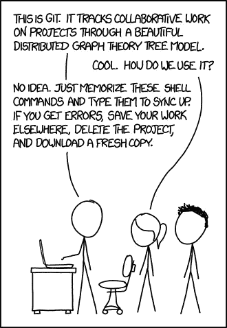

# 版本控制和 Git & GitHub 速成班

> 原文：<https://towardsdatascience.com/a-crash-course-on-version-control-and-git-github-5d04e7933070?source=collection_archive---------47----------------------->

## 约翰·霍普斯金 DS 专业化系列

## 关于版本控制系统、Git & GitHub 和 VCS 的最佳实践


由 [Unsplash](https://unsplash.com?utm_source=medium&utm_medium=referral) 上 [Greg Rakozy](https://unsplash.com/@grakozy?utm_source=medium&utm_medium=referral) 拍摄的照片

```
[Full series](https://towardsdatascience.com/tagged/ds-toolbox)[**Part 1**](/the-data-scientists-toolbox-part-1-c214adcc859f) - What is Data Science, Big data and the Data Science process[**Part 2**](/how-to-learn-r-for-data-science-3a7c8326f969) - The origin of R, why use R, R vs Python and resources to learn[**Part 3**](/a-crash-course-on-version-control-and-git-github-5d04e7933070) - Version Control, Git & GitHub and best practices for sharing code.[**Part 4**](/the-six-types-of-data-analysis-75517ba7ea61) - The 6 types of Data Analysis[**Part 5**](/designing-experiments-in-data-science-23360d2ddf84) - The ability to design experiments to answer your Ds questions[**Part 6**](/what-is-a-p-value-2cd0b1898e6f) - P-value & P-hacking[**Part 7**](/big-data-its-benefits-challenges-and-future-6fddd69ab927) - Big Data, it's benefits, challenges, and future
```

*本系列基于约翰·霍普斯金大学在 Coursera 上提供的* [*数据科学专业*](https://www.coursera.org/specializations/jhu-data-science) *。本系列中的文章是基于课程的笔记，以及出于我自己学习目的的额外研究和主题。第一门课，* [*数据科学家工具箱*](https://www.coursera.org/learn/data-scientists-tools) *，笔记会分成 7 个部分。关于这个系列的注释还可以在这里找到*[](http://sux13.github.io/DataScienceSpCourseNotes/)**。**

# *介绍*

*如果你是计算机科学的初学者，或者你是一个刚刚开始学习编程基础的初学程序员，无论你是在学习 C、Swift、Python 还是 JavaScript，你肯定会在你的在线课程或 YouTube 视频教程中遇到版本控制。一开始，Git 和 GitHub 这两个词对你来说可能是陌生的，但是一旦你开始编写代码并在线分享，你就会在日常生活中使用它们。这里有一个版本控制和 Git 的快速介绍，以及学习它们的资源。*

# *Git & GitHub*

**

*Git 和 GitHub 是每个程序员、数据科学家、机器学习工程师、web 开发者、全栈开发者等事实上的版本控制工具。用途。*

## *Git 是什么？*

*由于它的速度和灵活性，Git 基本上是一个非常强大的源代码控制系统。虽然您可以通过使用 Git 的基本命令来完成这项工作，但是对于初学者来说，这可能是相当具有挑战性的，*

*虽然 Git 的名字是 GitHub，但它们是两个独立的东西，因为 Git 在 GitHub 之前就存在了。还有其他地方可以托管您的 Git 存储库，但是 GitHub 是最受欢迎和使用最广泛的站点。*

## *什么是 GitHub？*

*因此 GitHub 只是一个让你管理你的 git 仓库的网站，还有很多其他的平台，像 BitBucket，Digital Ocean，Azure DevOps，但是 GitHub 有漂亮的用户界面并且很容易使用。*

## *一个人能做什么 GitHub？*

*在 GitHub 上，您可以:*

1.  *在线共享代码，并在改进程序时不断更新它，不受本地机器的限制，*
2.  *为你的雇主创造一个震撼的投资组合，让他们惊叹你的能力。*
3.  *它也是一个充满学习资源、解决方案和在线课程笔记等的地方。*
4.  *为开源项目做贡献，培养你的技能。*
5.  *与其他开发人员合作开发酷项目*
6.  *叉很酷的项目，并以此为乐*
7.  *等等。*

*为了有效地一起使用 GitHub 和 Git，您必须理解版本控制到底是什么，以及最常用的命令来增强您的工作流，使您成为一个更有效的程序员。*

# *版本控制*

**

*卢克·切瑟在 [Unsplash](https://unsplash.com?utm_source=medium&utm_medium=referral) 上的照片*

## *什么是 VCS？*

*版本控制系统(VCS)顾名思义很直观，它基本上是一个帮助你**跟踪源代码或文件变更的工具集合。它维护了**变更**的历史，并促进了**与其他开发人员的协作**。***

*你可以把 VCS 的工作想象成对你的代码和文件中的**变更**进行快照，并把信息存储为解释为什么做出变更以及是谁做出变更的消息。*

## *为什么用 VCS*

*也就是说，VCS 非常乐于助人，主要有三个原因。*

1.  ***你的作品历史快照**。—如果您想回顾项目的旧快照，以了解为什么进行了更改，同时像 Google Drive 一样作为备份存储。它还允许你在任何地方搜索你的代码或项目，只要你能登录到你的 GitHub 账户。*
2.  ***允许协作并处理冲突** —编程时协作是巨大的。协作时的一个主要问题是冲突，当两个人处理同一个文件，并上传他们各自的更改时，只有一个更改会被做出，而另一个会丢失。像这样的问题由 Git 处理，你可以在 GitHub 干净的 UI 上查看所有的问题和请求。*
3.  ***分支实验** —有时你想尝试一些新的东西，所以你会想复制你的代码，改变一些东西，而不影响你的原始源代码。这叫做分支，和 app 向公众发布 beta 程序一样，是主程序的分支。*

## *基本 VC 词汇*

*   ***Repository** —项目文件夹或目录，所有 VC 文件都在这里*
*   ***提交—** 保存所做的编辑和更改(文件快照)*
*   ***推送** —用您的编辑更新存储库*
*   ***拉** —将您的本地版本的回购更新到当前版本*
*   ***暂存** —准备提交文件*
*   ***分支** —具有两个同步副本的相同文件，创建一个分支以进行尚未与主回购共享的编辑*
*   ***合并** —分支合并回主回购，同一文件的独立编辑合并成一个统一的文件*
*   ***冲突** — 当两个人编辑同一行代码时，就会发生冲突，要么保留其中一个，要么保留另一个*
*   ***克隆(仅在本地机器上)** —制作包含所有跟踪变更的 repo 副本*
*   ***Fork(保留在 GitHub 中)** —另一个人的回购的副本，编辑记录在您的回购上，而不是他们的*

*所以，VCS 的一个基本流程是——文件存放在与其他编码者在线共享的仓库里。你**克隆**你的回购，让本地拷贝编辑它。在做出更改之后，您存放文件并**提交**它。然后，你**推动**提交共享回购协议，在那里新文件在线，并有消息解释什么改变了，为什么改变，由谁改变。*

# *Git 命令*

*如果有一天你想成为一名优秀的程序员，你应该记住一些基本的 git 命令。*

*以下是将 repos 克隆到本地机器时将使用的命令列表。*

*如果你还没有把你的机器连接到你的 GitHub 账户，那么在学习 Git 之前先这样做。这里有一篇约瑟夫·罗宾逊写的关于如何做到的文章。*

## *基础*

```
*git help  (get help for a command)# creating a new repo1\. git init  (let's you create a new git repo, stored in .git.)
2\. git add . (add your files)
3\. git commit -m "message"
4\. git push # cloning from repo on GitHub1\. **git clone** "url" 
2\. git status (tell's you which files have been staged)
3\. **git add .** (use . to add all unstaged files, specify files with <filename>)
4\. **git commit -m "message"** 5\. **git push*** 
```

*这些命令是非常基本的，如果你想了解更多，可以参考这个[神奇的网站](/git-mac-setup-be1d16162e79)。*

*大多数人使用终端来运行这些命令，但也有其他选择来做 VCS，比如如果你喜欢点击而不是打字，可以使用 GitHub 桌面。ide 也很有用，因为它们内置了 Git 和 GitHub 特性，你可以无缝地使用它们。*

## *VCS 的最佳实践*

*当你刚开始使用 VCS 时，你可能不知道什么时候提交代码，或者如何最好地使用 VCS，所以这里有一些有用的提示。*

1.  ***有目的地提交** —你的提交应该是有目的的，而不是琐碎的，它应该对你的代码做出实质性的改变。例如，键入一行新代码并提交是无效的，并且会妨碍您的工作效率。*
2.  ***关于提交的信息性消息** —您的提交应该有充分解释为什么做出某个更改的消息，以便将来您可以回去参考它。这也有助于其他人合作理解这些变化。*
3.  ***经常拉和推** —在进行公开回购时，拉是很重要的，这样你就可以随时了解最新的变化，你也应该经常推，让你的变化在 GitHub 上得到更新。*
4.  *更多提示[此处](https://www.perforce.com/blog/vcs/8-version-control-best-practices)*

# *摘要*

**

*照片由 [Fotis Fotopoulos](https://unsplash.com/@ffstop?utm_source=medium&utm_medium=referral) 在 [Unsplash](https://unsplash.com?utm_source=medium&utm_medium=referral) 上拍摄*

*获得并掌握 Git 对你成为程序员、数据科学家、web 开发人员等非常有帮助。*

*编写程序、创建游戏、网站、个人作品集、机器学习模型、移动应用程序等，所有这些都需要版本控制系统来帮助你有效地管理它们，当你开始与他人合作时，你会发现这是多么重要。*

*Github 是一个令人惊叹的网站，它不仅可以作为你的作品集，GitHub 上有大量的宝石，共享一个巨大的资源列表，这对初学者特别有帮助。*

*如果你正在寻找很酷的东西，GitHub [收藏](https://github.com/collections)是一个很好的起点。*

*如果您正在寻找数据科学资源，请查看我的[文章](/top-10-popular-github-repositories-to-learn-about-data-science-4acc7b99c44)。*

*感谢阅读，我希望你学到了一些东西。一定要看下一部分，记得注意安全。*

# *学习 Git 的资源*

*[](https://git-scm.com/book/en/v2) [## 书

### 由斯科特·沙孔和本·施特劳布撰写并由 Apress 出版的 Pro Git 整本书可以在这里找到。所有内容…

git-scm.com](https://git-scm.com/book/en/v2) [](https://stackoverflow.com/questions/315911/git-for-beginners-the-definitive-practical-guide) [## 给初学者的 Git:权威实用指南

### 锁住了。这个问题和它的答案被锁定是因为这个问题跑题了但是有历史意义。它…

stackoverflow.com](https://stackoverflow.com/questions/315911/git-for-beginners-the-definitive-practical-guide) [](https://missing.csail.mit.edu/2020/version-control/) [## 版本控制

### 版本控制系统(VCS)是用来跟踪源代码(或其他文件和…

missing.csail.mit.edu](https://missing.csail.mit.edu/2020/version-control/) [](https://www.fullstackpython.com/git.html) [## 饭桶

### Git 是一个分布式开源源代码控制(也称为“版本控制”)系统，通常用于跟踪…

www.fullstackpython.com](https://www.fullstackpython.com/git.html) [](https://learngitbranching.js.org) [## 学习 Git 分支

### 一个交互式 Git 可视化工具，用于教育和挑战！

learngitbranching.js.org](https://learngitbranching.js.org) [](https://www.atlassian.com/git) [## 了解 Git- Git 教程、工作流和命令| Atlassian Git 教程

### 定义:一个分支代表一个独立的开发路线。分支是对…的抽象

www.atlassian.com](https://www.atlassian.com/git) 

## 如果您对学习数据科学感兴趣，请查看“超学习”数据科学系列！

[](https://medium.com/better-programming/how-to-ultralearn-data-science-part-1-92e143b7257b) [## 如何“超级学习”数据科学—第 1 部分

### 这是一个简短的指南，基于《超学习》一书，应用于数据科学

medium.com](https://medium.com/better-programming/how-to-ultralearn-data-science-part-1-92e143b7257b) 

## 查看这些关于数据科学资源的文章。

[](/top-20-youtube-channels-for-data-science-in-2020-2ef4fb0d3d5) [## 2020 年你应该订阅的 25 大数据科学 YouTube 频道

### 以下是你应该关注的学习编程、机器学习和人工智能、数学和数据的最佳 YouTubers

towardsdatascience.com](/top-20-youtube-channels-for-data-science-in-2020-2ef4fb0d3d5) [](/top-20-free-data-science-ml-and-ai-moocs-on-the-internet-4036bd0aac12) [## 互联网上 20 大免费数据科学、ML 和 AI MOOCs

### 以下是关于数据科学、机器学习、深度学习和人工智能的最佳在线课程列表

towardsdatascience.com](/top-20-free-data-science-ml-and-ai-moocs-on-the-internet-4036bd0aac12) [](https://medium.com/swlh/top-20-websites-for-machine-learning-and-data-science-d0b113130068) [## 机器学习和数据科学的 20 大网站

### 这里是我列出的最好的 ML 和数据科学网站，可以提供有价值的资源和新闻。

medium.com](https://medium.com/swlh/top-20-websites-for-machine-learning-and-data-science-d0b113130068) [](/the-best-book-to-start-your-data-science-journey-f457b0994160) [## 开始数据科学之旅的最佳书籍

### 这是你从头开始学习数据科学应该读的书。

towardsdatascience.com](/the-best-book-to-start-your-data-science-journey-f457b0994160) [](/top-20-podcasts-for-data-science-83dc9e07448e) [## 数据科学 20 大播客

### 面向数据爱好者的最佳数据科学播客列表。

towardsdatascience.com](/top-20-podcasts-for-data-science-83dc9e07448e) 

# 连接

如果你想了解我的最新文章[，请通过媒体](https://medium.com/@benthecoder07)关注我。

也关注我的其他社交资料！

*   [领英](https://www.linkedin.com/in/benthecoder/)
*   [推特](https://twitter.com/benthecoder1)
*   [GitHub](https://github.com/benthecoder)
*   [Reddit](https://www.reddit.com/user/benthecoderX)

请关注我的下一篇文章，记得**保持安全！***