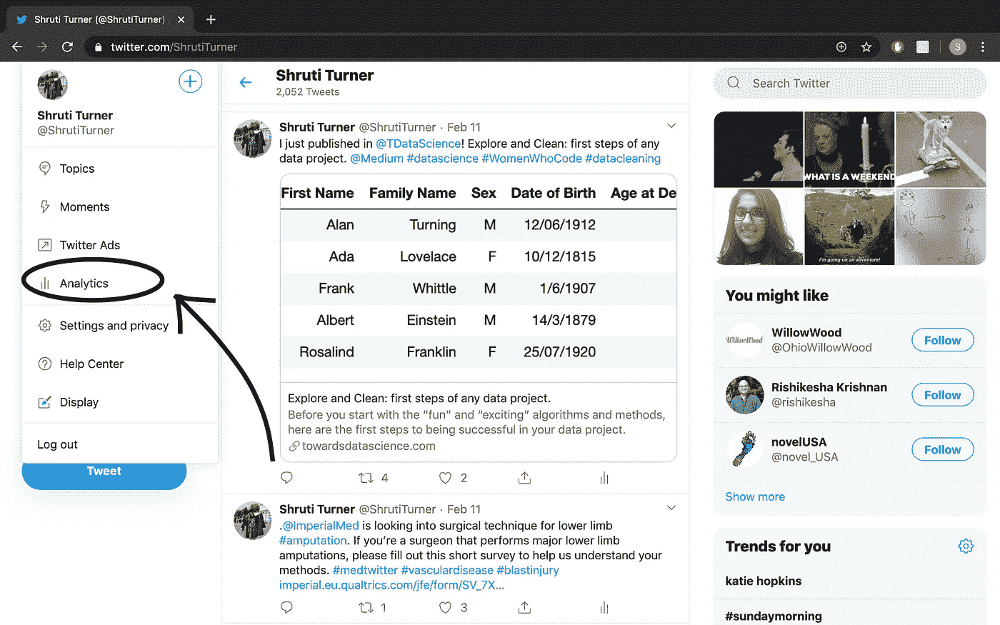
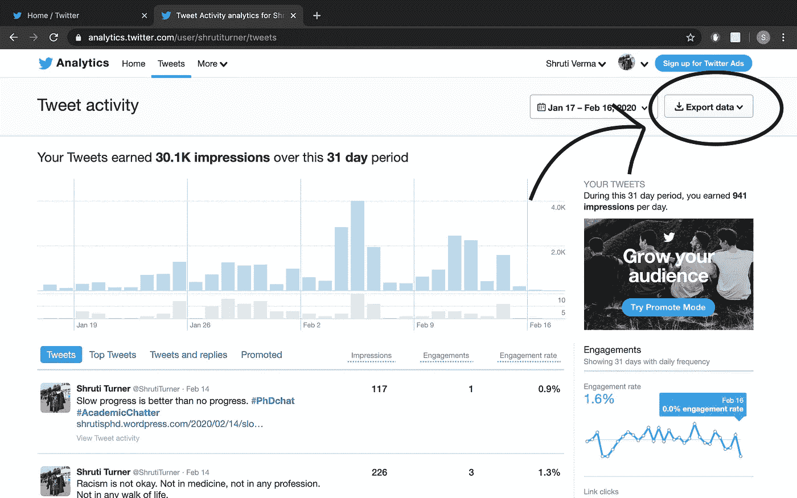
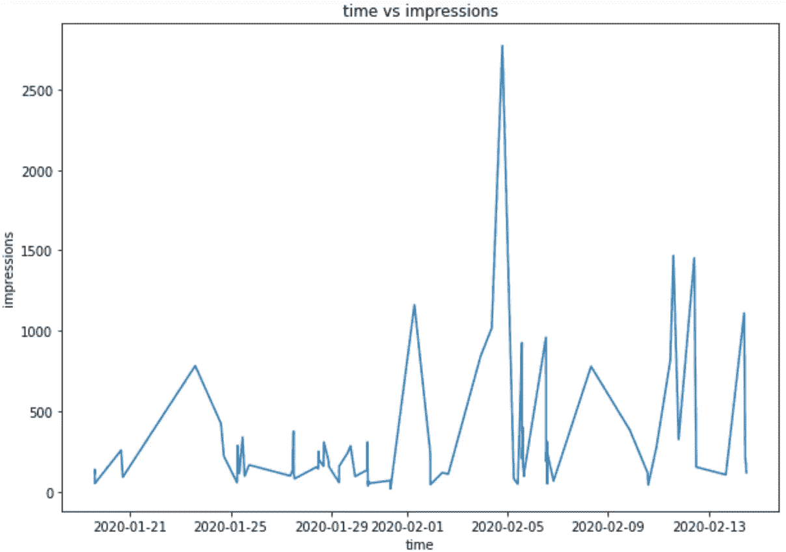
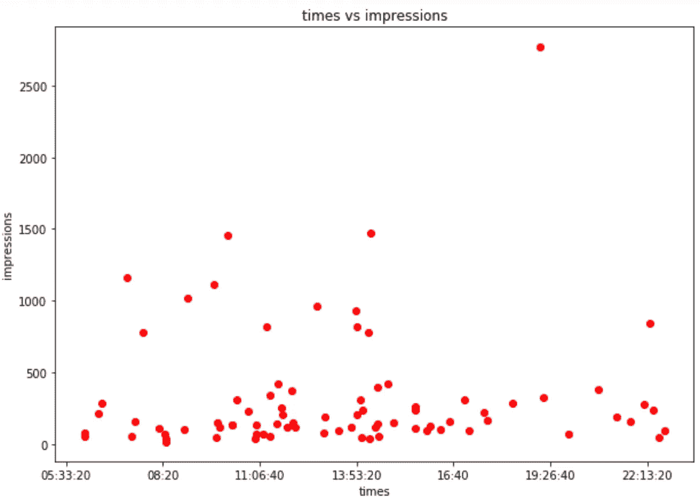
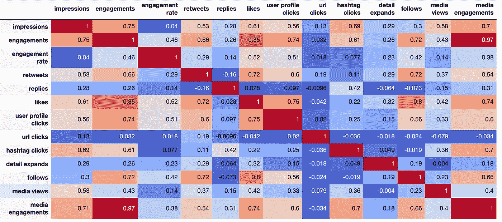
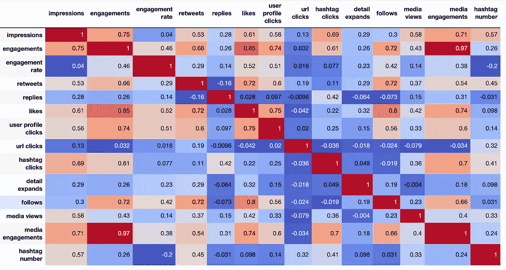
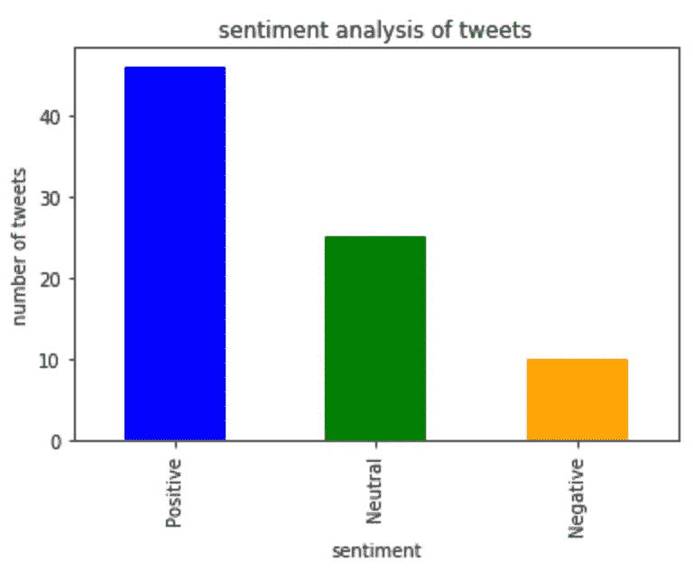
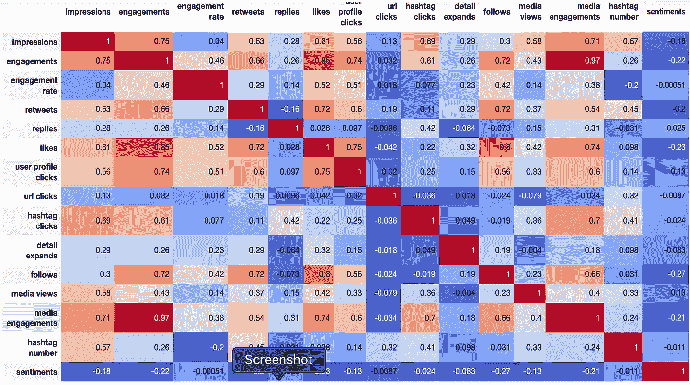

# 涉足推特分析

> 原文：<https://towardsdatascience.com/a-dabble-into-tweet-analysis-a-beginners-approach-6079ad4b23f9?source=collection_archive---------29----------------------->

## 快速探索 Twitter 上容易获得的数据，使用数据科学方法优化您的推文:一些可视化、相关性和 NLP。

发微博是我们很多人都在做的事情，但是我们当中有多少人真正去探究是什么让我们的微博成功了呢？我想相对于那些知道的人来说，相对来说很少。我一直在自学一些数据科学技能，我想在一些真实数据上测试我的技能。

我想，我感兴趣的东西会是一个很好的开始:我经常使用 Twitter，大部分时间都在发推特，所以在我看来尝试一下是有意义的。另一个关键点是，我最近发现我可以点击一个按钮导出我的推文数据，这样有助于决定做什么！

我敢肯定，我不是一个人说，我听到很多人说，如果你有更多的标签，你会得到更大的影响，或者如果你在你的推文中加入媒体，人们更有可能参与进来。我想弄清楚这是不是真的，但也想利用我已经开始掌握的一些数据科学技能。

现在，我肯定还有更详细的分析，来告诉你你的推文表现，在这里我将告诉你我的思考过程和我的发现。

## 获取数据

我没有注册 Twitter 的开发者账户，我使用的数据对所有用户开放。在你的电脑上，打开 Twitter，点击左侧面板中的“更多”，然后选择“分析”。

指向分析的 Twitter 截图

一旦你这样做了，一个新的标签将会打开。点击页面顶部的“tweets”链接，它会告诉你你的 Tweets 表现如何，最重要的是一个导出数据的按钮。我导出了按“Tweets”而不是“Day”分类的数据，因为这是我更感兴趣的。

Twitter 的屏幕截图，用于指导导出数据

这里要注意一点:虽然你可以在 Twitter 分析界面上查看长达 3 个月的数据，但你只能导出其中的 28 天。很遗憾，但不是世界末日。

## 初始清洁和探索

与所有数据项目的开始一样，我们需要知道我们已经获得了哪些数据，并对其进行清理，以便它处于适合我们使用的状态。一开始，我有许多列数据，其中许多我并不关心。

我删除了所有只包含空值的数据，以及所有与“推广”推文相关的列。我不推广我的任何推文，所以这与我无关。我期望所有这些都是 null，但是数据在那里放了一个'-'，所以我最初的删除没有影响这些列。在我最初的筛选和清理之后，我只剩下了下面这些我想要的格式的专栏。主要是，这意味着丢掉我不感兴趣的东西，确保数字就是数字，日期就是日期。我做的唯一更复杂的操作是将给定的“时间”列分成日期和时间部分。

## 初步查看我的数据

过去，关于我的推文的影响范围，我想到了几个问题:是否有一天/一个月的某个时间意味着我的推文会更成功？我发现一个快速的情节是获得正在发生的事情的快照的最简单的方法。

绘图显示几天内的印象数

事实证明，绘制每条推文在一段时间内获得的印象数并没有多大帮助。我认为这是由多种因素造成的:上个月我只发了大约 80 条微博，而我只有这么短时间的数据。更有用的数据表示可能是查看一天中每个小时的印象数:

绘图显示一天中不同时间的印象数

现在，这更有趣了——我可以看到我在上午和下午之间最频繁地发微博，而在晚上很少。通常(除了这里的一个异常)在这段时间的推文。这很可能是因为在这段时间里，我的目标受众中有更多的人是清醒和活跃的。我知道我在世界各地都有联系人——我在学术 Twitter 环境中特别活跃，所以理论上说，一天到晚都有观众！如果你发微博的频率比我高，或许一天中比我多一点，这个图可能对你更有用。

**剩下的数据呢？**

上面，我只看了其中的两列，但是其他的呢？比较两列的所有组合效率太低。回顾这些数据，我想看的东西和变量有很多，它们可能彼此相关，因此相关矩阵似乎有助于这种情况:

数值数据的相关图

在开始看矩阵之前，在你的头脑中有一个好主意，你的因变量和自变量是什么。这将帮助你看到你可以改变和影响什么来创造你想要的效果。

看这个相关图，互动和媒体互动之间有很高的相关性(0.97)。这意味着人们越来越多地参与媒体的推文，但这是有意义的参与吗，即我关心的参与，即喜欢/回复/关注等。查看媒体参与栏，媒体参与与除 url 点击之外的所有点击都呈正相关(这是意料之中的，因为 twitter 显示推文的方式:媒体优先于 URL)。我的推文中的媒体与我最关心的参与度的喜欢和关注度最高。

URL 点击与数据中的所有其他属性具有低相关性或负相关性。看起来带 url 的推文最有可能被转发，而不是其他任何东西。

## 自然语言处理

如果我想了解我的实际推文在说什么，就需要进行一些文本分析。我想看看标签的影响，以及它们如何影响我的推文的“成功”。我还想看看我的推文的情绪是否与它们的成功有任何关系，即我快乐的推文是否比我不快乐的推文更成功？

为了解决第一点，我收集了所有的推文，并计算了每条推文中的标签数量。我将这个值作为一个新列添加进来，并重新运行我的相关矩阵。

数字数据的相关图，加上标签数

标签的数量与印象的数量最相关，其次是转发和标签点击。一般来说，更多的标签意味着更高的印象，这是有道理的，但由于这不是一个高相关性，这表明并不是所有的标签都对印象有用。

考虑到我的推文的情感，我使用了一个内置函数来为推文文本赋值。在大约 80 条推文中，超过一半是正面的，最少的是负面的:

显示发送的推文的情绪的图

但这对我在推特上获得的印象和有意义的参与有什么影响呢？

带有数字数据的关联图，包括标签号和推文情感值

简而言之:不太多。所有的价值观和情绪之间都有轻微的负相关，除了一个:回复。然而，这里的相关性是如此之小，以至于我发送的推文数量不太可能对我的推文成功产生重大影响。

我发现了什么？

从这个初步的分析中，我想我发现了以下几点:

1.  我发推特的时间可能是“成功”的标志，但我需要更多的数据来确定这一点。从我有限的数据来看，上午晚些时候到下午三点钟似乎得到了最多的印象。
2.  媒体可能会增加我的推文的参与度。
3.  仅仅增加一条推文中的标签数量并不能保证这条推文更“成功”——关键是要仔细挑选标签。
4.  我的推文有多开心对它们的“成功”没有重大影响。

最重要的是，我已经很好地利用了我的数据大脑，将我的知识应用到现实世界的例子中，并有可能提出一个更“有效”的推特策略。

基于这一分析，我不能说我会在如何发推特上有很大的改变:我会更肯定地包括媒体，我会对我使用的标签很挑剔——无论如何我都会尝试这样做。

毫无疑问，更深入的分析可能会提供更多关于我如何才能更成功的信息。或许我可以看看“最成功”的标签？或者我可以收集更多的数据来观察一段时间内的模式。当然，有许多选择可以探索。目前，这个初步的分析，使用了我一直在学习的一些技巧，给了我 Twitter 性能的一个基本指标。

如果你对我如何实现我的分析感兴趣，请随时联系/评论，我很乐意分享。我用 Python 做了所有的事情，因为它是我的首选语言，但毫无疑问还有其他的方法。