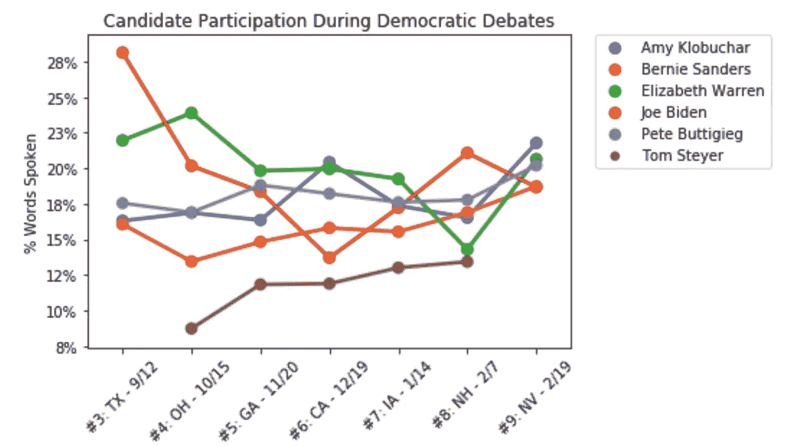
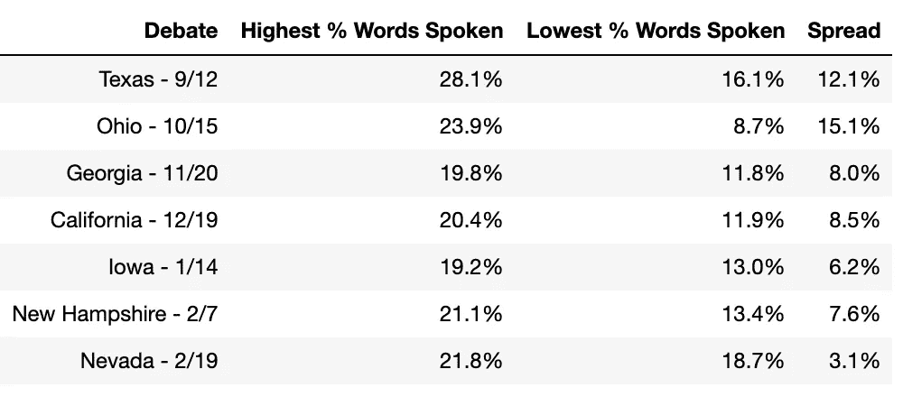
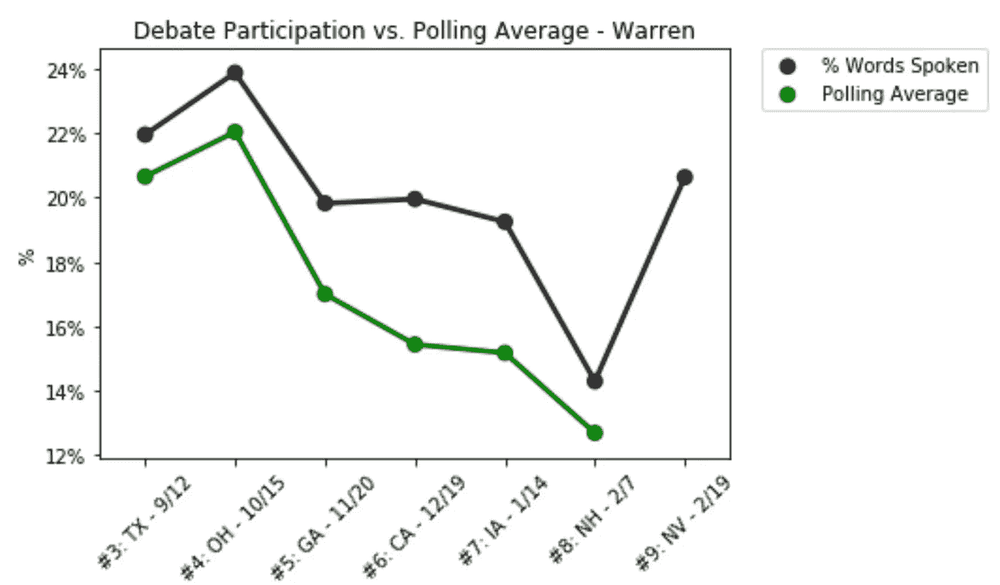
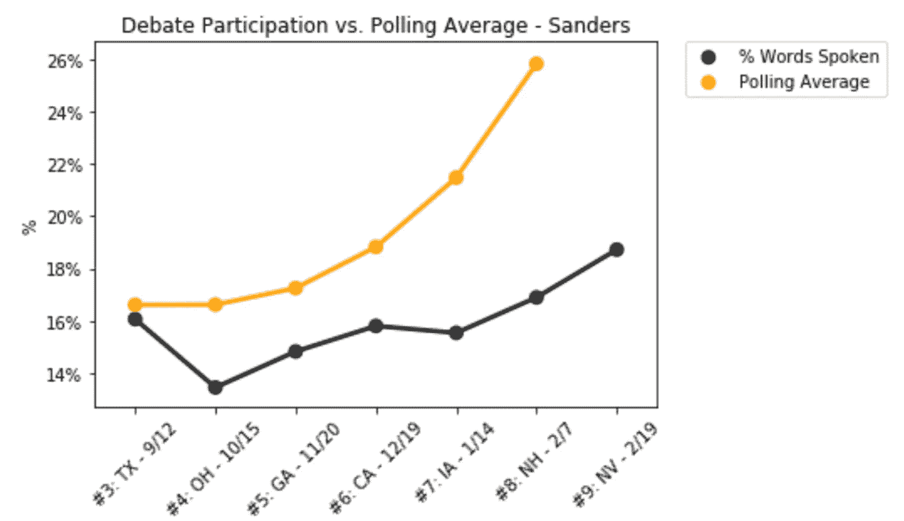
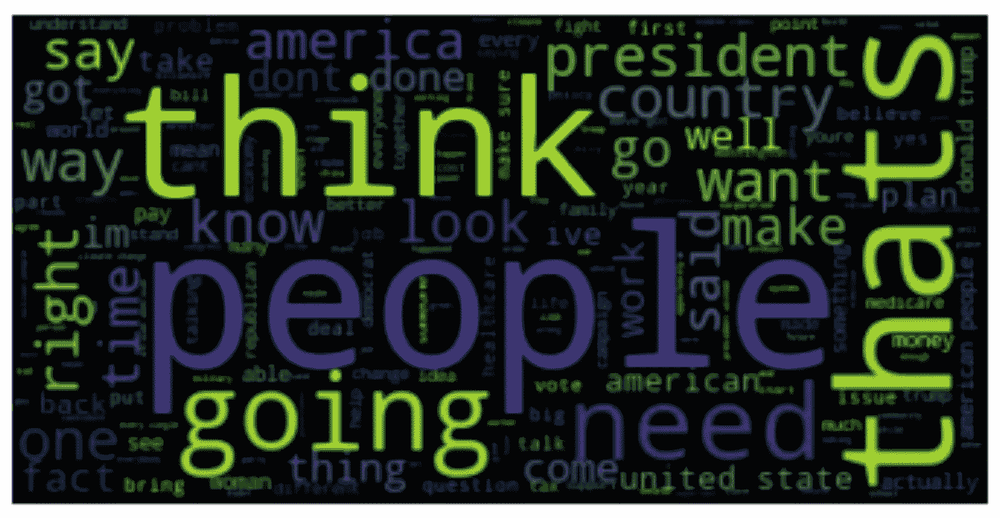
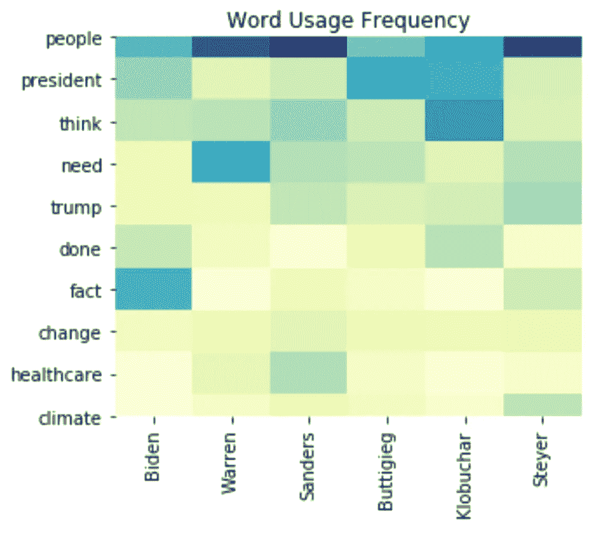

# 民主辩论的数据分析

> 原文：<https://towardsdatascience.com/a-data-analysis-of-the-democratic-debates-670926568b16?source=collection_archive---------31----------------------->

戴维·拉古萨在 [Unsplash](https://unsplash.com/s/photos/debate?utm_source=unsplash&utm_medium=referral&utm_content=creditCopyText) 上的照片

## 谁在说话，他们在说什么？

随着民主党初选的升温和辩论人数的增加，很难理解候选人在说什么。然而，由于有了在线辩论记录，检索曾经说过的每一句话变得相当容易。

让我们处理和分析文本数据，探索到目前为止发生了什么，而不是进行阅读这些文字记录的枯燥练习。

# 数据采集和处理

以下是我获取和处理分析数据的 5 个步骤。我建议您跳过这一部分，除非您对技术细节感兴趣:

1.  从一个名为 Rev.com[的网站复制每场辩论的文本，并将数据存储在一个 python 字符串中。](https://www.rev.com/blog/transcripts)
2.  在空白处拆分每个辩论字符串，并为发言者创建一个列表，为他们的相关引用创建一个列表。
3.  将演讲者和引语列表压缩在一起，并将其转换为熊猫数据帧，其中每行代表候选人的一个不间断行。
4.  将辩论数据帧结合在一起，为每个辩论添加一个标识符。
5.  清理和规范候选人姓名。

# 分析

## 谁在说话？

让我们先来看看每位候选人在整个辩论中的参与程度。为了衡量参与度，我们将计算每位候选人的发言占总字数的百分比。我们将只包括出现在大多数辩论中的参与者，并排除前两次辩论，因为它们都发生在两个晚上。

首先映入我眼帘的是大量的辩论。在总共近 4000 名代表中，只有 65 名代表获奖，候选人已经 9 次登上舞台。同样值得注意的是，速度已经从 2019 年底的每月一场辩论增加到 2020 年的每两周一场。

随着辩论频率的加快，发言的分布更加紧张。在第三场辩论中，领先的候选人(拜登)和落后的候选人(桑德斯)之间的差距为 12%。到第九次辩论时，这一比例仅为 3%——基本上是五方平手。

这可能是两种情况的产物。首先，范围缩小了，主持人更容易确保候选人有平等的发言时间。其次，随着最近几周赌注的增加，候选人变得更加直言不讳。

另一个有趣的趋势是——对于许多候选人来说——所说的单词的%与主要表现相关。

这方面最强有力的例子是伊丽莎白·沃伦，她的平均民调支持率从 10 月份的 22%骤降至 2 月份的不到 13%,这反映了她说的话的百分比从 24%降至 14%。

虽然很难确定其中的因果关系，但这种相关性可能有几个原因。也许主持人会根据谁在民意调查中领先来调整他们的提问行为。或者可能是候选人缺乏攻击性让潜在选民望而却步。最后，候选人可能倾向于挑战和激怒他们认为最大威胁的竞争对手。

不管原因是什么，沃伦的团队很可能在内华达州之前发现了这一趋势——在内华达州，她是所有候选人中发言次数第二多的。

另一方面，从 9 月到 2 月，随着他的辩论参与率稳步上升，伯尼·桑德斯在全国民调中的平均支持率呈指数上升:

## 他们都说了些什么？

既然我们已经看了谁在讲话，让我们感受一下他们都在谈些什么。

首先，我们来看一个单词云，它向我们展示了候选人辩论中最常用的单词。我已经排除了[停用词](https://medium.com/@makcedward/nlp-pipeline-stop-words-part-5-d6770df8a936)——没有太多语义价值的常用词——并采用了一种叫做[词条化](/stemming-lemmatization-what-ba782b7c0bd8)的方法来将单词简化到它们的核心意思，而不管它们的词性。

这里没有什么大的惊喜——候选人试图吸引 ***人*** ，并解释他们 ***认为*** 什么，他们 ***打算*** 做什么，作为 ***总统*** 让这个 ***国家*** 变得更好。

也许更有见地的分析应该是看看候选人的用词是如何变化的。下面，我创建了一些更频繁出现的单词以及每个候选人使用它们的频率的热图。颜色越深，候选人使用的单词越多。

让我们浏览一下 10 个最有趣的单词和要点:

1.  **人物:**桑德斯用这个词最多。这是有道理的，因为他被视为一个平民主义候选人，期待开始一场政治革命。
2.  总统:Buttigieg 使用“总统”这个词的频率最高——也许是作为一种被认为是最“总统化”的策略
3.  想一想:克洛布查尔以压倒性优势赢得了这场比赛。她经常以“我认为”作为自己观点的开头。我认为这与其说是缺乏自信，不如说是一种风格上的问题。
4.  **需要**:沃伦把自己定位成一个能干的、解决问题的人，她知道这个国家及其人民**需要什么***。也许这也是她使用“家庭”和“工作”这两个词最多的原因。*
5.  *特朗普:沃伦和拜登最少提到总统的名字。我想知道这是否是一个有意的举动，因为特朗普似乎受益于降名，有好有坏。*
6.  ***完成:**拜登和克洛布查尔谈了很多关于他们所做的*。这是有道理的，因为他们的吸引力很大一部分是经验。拜登从 1972 年到 2008 年担任了 8 年的副总统和参议员。Klobuchar 在明尼苏达州担任了三届参议员，是参议院中最活跃的人之一。这是与 Buttigieg 或 Steyer 等传统经验较少的候选人的一大区别。**
7.  ****事实:**拜登使用填充短语“事实上”的频率很高，是第二名的两倍多。**
8.  **气候:对于那些不太熟悉斯泰尔的人来说，这可能是一个惊喜，但是这位亿万富翁民主党人说他的首要问题是气候变化，并且他在辩论中支持这一点。**
9.  **医疗保健:桑德斯在这一领域领先。他是拥有最独特的医疗保健计划(全民医保)的候选人，而且他不得不花大部分时间来捍卫其成本和可行性。使用“医疗保健”一词第二多的沃伦也同意桑德斯的计划，但自[以来，她的立场已经软化](https://www.latimes.com/politics/story/2019-11-20/elizabeth-warren-medicare-all-healthcare-democrats)。**
10.  **变革:这一点非常接近，因为大多数民主党人认为自己是变革的代表。但同样，桑德斯是最有兴趣改变政党和国家政治方向的候选人。**

# **后续步骤**

**我在上面所做的仅仅触及了辩论笔录的表面。以下是扩展这一分析的三个想法:**

1.  **探究候选人的词汇用法是如何随着时间的推移而变化的。**
2.  **使用像 [word2vec](/an-intuitive-explanation-of-word2vec-208bed0a0599) 这样的单词嵌入来衡量每个候选人之间的差异。**
3.  **建立一个“谁说的”分类模型来预测哪个候选人说了给定的报价。**