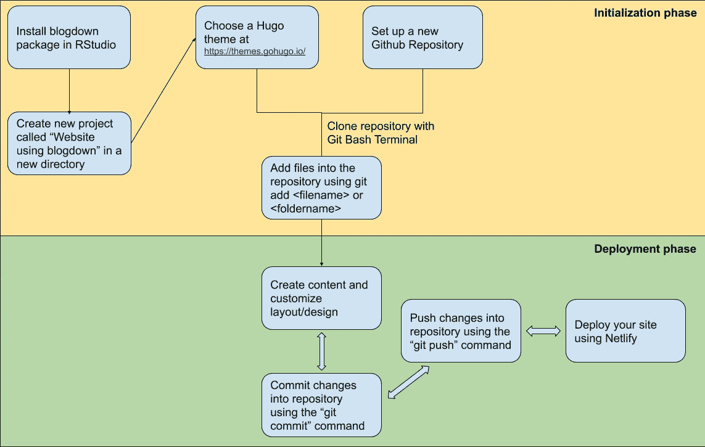
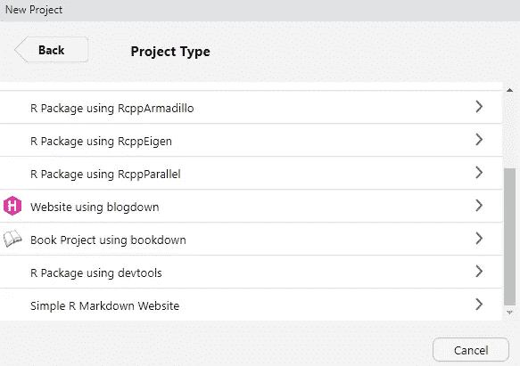
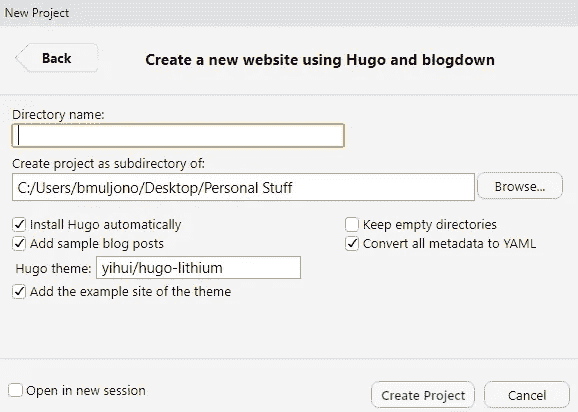
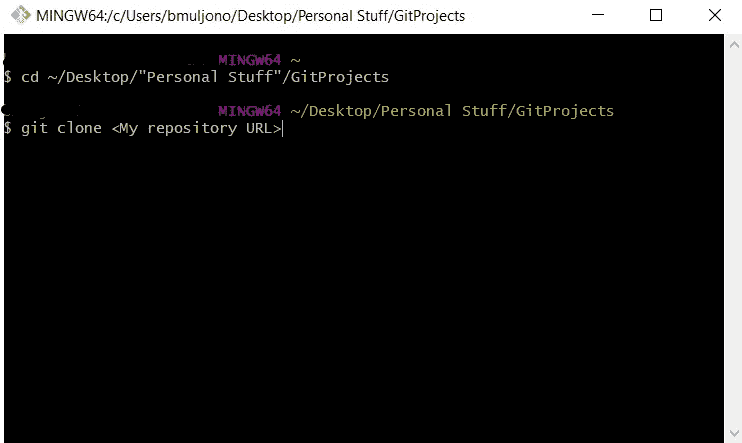
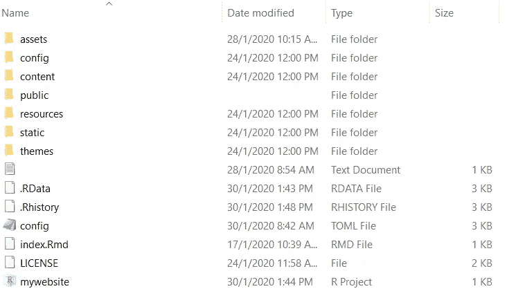
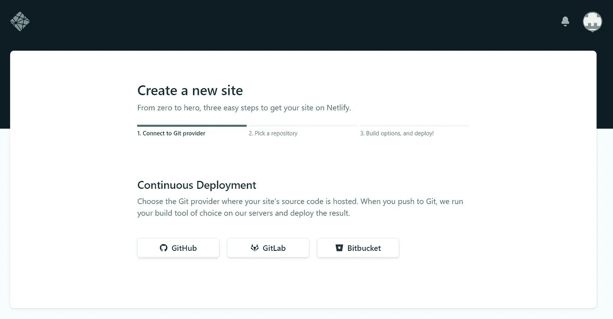
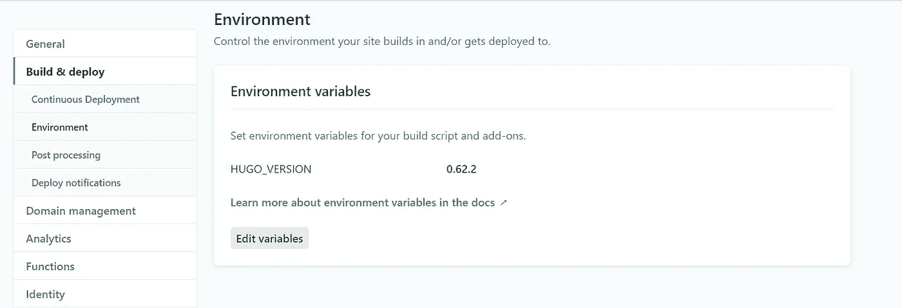
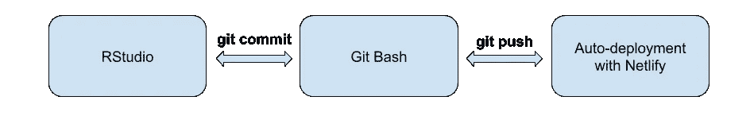

# 用 R 创建个人网站的数据分析师指南

> 原文：<https://towardsdatascience.com/a-data-analysts-guide-to-creating-your-personal-website-with-r-f0079ba9b81c?source=collection_archive---------3----------------------->

## 忘记 Wix 或 WordPress，利用你已经知道的东西来编写你自己的站点

如果你看这篇文章有困难，你可以通过下面的链接访问我的网站，绕过 Medium 的付费墙。尽情享受吧！

[](https://www.bobbymuljono.com) [## 鲍比·马尔乔诺

### 数据分析师

www.bobbymuljono.com](https://www.bobbymuljono.com) 

李·坎贝尔在 [Unsplash](https://unsplash.com?utm_source=medium&utm_medium=referral) 上的照片

# 你个人网站的重要性

对数据科学工作的需求一直在上升，申请人也加入了这一行列。由于硕士或博士是最主要的筛选条件，人力资源经理会毫不犹豫地拒绝简历平平的申请人。

一个展示你处理数据科学或分析项目能力的网站是从其他申请者中脱颖而出的一个很好的方式，尤其是如果你没有任何高等学位。

## 但是打住，我不知道 HTML/CSS/JS 建一个网站

如果你正在阅读这篇文章，那么你可能对数据分析感兴趣，或者你已经在处理大量的数据管理工作，并且你不会以任何特定的方式处理 HTML/CSS 代码。

无论您是数据分析师还是数据科学家，我们都同意一件事:我们的一般工作包括理解业务问题，使用定制的 SQL 查询提取必要的数据，使用 Python/R 清理和验证它们，最后可视化它们或执行某种预测以增强运营业务决策。

通常这个过程就是我们所说的**模型级**分析。这是大多数公司在将数据转化为可操作的见解时所寻求的基本要求。在这种情况下，您可能只需要处理很少的文件和脚本来提取和处理数据。

然而，当我们想到在移动中实现数据科学时，如 Youtube 的推荐系统，我们需要开始研究**协作和** **生产级**脚本。这就是当您与一组数据科学家一起工作时，文件管理和版本控制变得非常重要的地方，这些科学家在一个给定的项目中分担他们的工作量。

当您构建网站时(我不是在说 Wix 或 WordPress 这样的高级网站构建者)，您将处理大量 HTML/CSS 文件，这些文件将存储在您的计算机或 Github 存储库中以供部署。这是习惯生产级脚本的好方法。

好消息是。

你不需要知道任何 HTML/CSS 来用我们很多人都熟悉的东西，R 编程或 Python 来构建网站。然而，某些布局定制可能需要用户冒险进入 HTML 并修改几行代码。

# 你将学到什么

1.  基本 Git 和 Github 导航
2.  基本的 RStudio IDE(真见鬼，你甚至不需要接触任何 R 代码)
3.  创建具有预定义主题的内容(这是困难的，但是一旦你习惯了，就可以管理)
4.  网站部署和维护

在我开始之前，我必须表扬该表扬的地方。在我建立自己的网站之前，我从来没有想过用 R 来做这件事是可能的，因为 R 不是为建立网站而设计的。我只是浏览了 TDS 上的几篇文章，偶然发现了叶君写的这篇文章，他用 r

[](/get-your-own-website-online-in-four-steps-adef65abe8bd) [## 用四个步骤让你自己的网站上线

### 使用 R Blogdown 的简单指南

towardsdatascience.com](/get-your-own-website-online-in-four-steps-adef65abe8bd) 

我从他的教程中得到了一些提示，但是我用一个稍微不同的工作流程建立了我的网站:



记住整个工作流程，你应该能够创建一个自己的网站。

# 步骤 1–1:设置 R、RStudio 和您的项目

如果您的桌面上还没有 RStudio，那么像大多数其他程序一样，将它安装到您的系统中是非常容易和直观的。但是不要忘记在获得 IDE 之前下载 R GUI。您可以通过下面的链接获得该软件:

[](https://rstudio.com/) [## RStudio |面向数据科学团队的开源专业软件

### 控制你的 R 代码一个集成的 R 开发环境，有一个控制台，语法高亮编辑器…

rstudio.com](https://rstudio.com/) 

启动并运行 RStudio 后，转到 console 选项卡并输入以下代码:

```
#To install blogdown package
install.packages("blogdown")#To install hugo within blogdown
blogdown::install_hugo()
```

然后，转到 IDE 的左上角，单击以下内容:

文件→新项目→新目录→使用 blogdown 的网站



在这个窗口中，你可以指定你的目录名，我把它叫做‘git projects’。接下来，您需要从这里选择一个 hugo 主题:

[](https://themes.gohugo.io/) [## 一览表

### 编辑描述

themes.gohugo.io](https://themes.gohugo.io/) 

在 Hugo theme 文本框中，您需要指定所选主题的 Github 存储库，例如，上面的图片链接到 github.com/**易慧/hugo-lithium** 。

完成后,‘git projects’文件夹将被主题源代码和 RProject 可执行文件填充。**稍后这将被手动转移到克隆的 Github 存储库文件夹中。**

# 步骤 1–2:设置 g ithub 存储库并将其与 Git 集成

我没有必要重复从以下链接中的其他人那里获得的任务:

[](https://medium.com/@aklson_DS/how-to-properly-setup-your-github-repository-windows-version-ea596b398b) [## 如何正确设置您的 Github 资源库— Windows 版本

### 作为一名数据科学家，我经常与有志于成为数据科学家的人打交道，通常我的一个…

medium.com](https://medium.com/@aklson_DS/how-to-properly-setup-your-github-repository-windows-version-ea596b398b) 

总之，你需要设置一个 **Github 库**并安装 **Git Bash 终端**，以实现从桌面到库的源代码变更的无缝管道。

不过，有些事情我做得有点不同。不要键入命令:

```
mkdir ~/Desktop/projects
```

在文件夹‘Git projects’下，我已经有了要克隆存储库的目录，所以我在 Git Bash 终端中键入了以下内容:

```
cd ~/Desktop/"Personal Stuff"/GitProjects
```

之后，我使用新的 Github 库提供的链接克隆了我的库。



一旦完成，一个与你的 Github 库同名的新文件夹将出现在“GitProjects”文件夹中。

但是记得我把所有的主题源代码和 RProject 文件放在同一个文件夹里，**把所有的东西都移到新创建的文件夹**，我的 Github 文件夹叫做**“my website”**，在成功地把所有东西都移过来之后，继续把目录换到新的文件夹里，如下所示:


当您在目录末尾看到(主)分支时，您就知道您已经连接到 Github 存储库了。

此时，您已经成功地用 Git 连接到 Github，但是您新导入的文件还没有被识别。

# 步骤 2:将主题源代码添加到 Github 存储库中

现在，您需要将主题源代码添加到 Github 存储库中。您的本地文件夹应该如下所示:



在您的 **Git Bash 终端**中使用以下命令将所有文件添加到您的存储库中:

```
git add <foldername>
```

某些文件不是必须添加的，但是如果是，就在你的**中添加。gitignore** 文件，以便网站部署引擎不会将它们应用到您的网站上:

```
.Rproj.user
.Rhistory
.RData
.Ruserdata
public
```

最后，您现在可以开始为您的站点创建内容了！

# 步骤 3:创建/定制内容和布局

这是最难的部分！每个主题都应该有一个文档来导航整个源代码。您可以在 **Rstudio** 控制台中键入以下代码，在 Rstudio 的**“查看器”**选项卡中预览您的站点:

```
blogdown::serve_site()
```

对于初学者来说，最受欢迎的主题是“学术”主题，它有全面的文档，并得到了社区的大力支持。对于简历展示和个人博客来说，这是一个非常通用的主题。事实上，您可以查看下面的视频，了解 Rstudio 中“学术”主题的详细介绍:

请注意，视频有点过时，某些代码被放在不同的文件中。我最初选择这个主题是为了练习，但后来为了更好的布局，我换了另一个主题。我不会深入到关于内容创建和布局定制的教程中，因为它应该在主题文档中有清楚的解释。

# **步骤 4:提交您的变更，并将变更推送到您的存储库中**

一旦您对微小的更改感到满意，在 Git Bash 终端中使用以下命令将您的更改提交到 Github 存储库中:

```
git commit <foldername or filename> -m "Your update message here"
```

当您对所有的更改感到满意后，在 Git Bash 终端中输入以下代码，以使更改在 Github 存储库中发生:

```
git push
```

就是这样！每次在 RStudio 中对网站进行更改时，您只需在 Git Bash 终端中重新输入这些命令。

# 步骤 5:使用 Netlify 部署您的网站

Netlify 是一个万无一失的网站部署解决方案，它可以自动将您的文件从 Github 存储库转换为网站。



只需确保您连接到了正确的存储库，并且准备就绪。但是在部署成功之前，您需要为 Netlify 设置正确的环境变量来识别文件结构。

为此，请转到 Netlify 仪表板，转到设置→构建和部署→环境，并设置以下环境变量。



不过，你的雨果版本可能和我的不一样。要检查您的 hugo 版本，请返回 RStudio 并在控制台中键入以下命令:

```
blogdown::hugo_version()
```

# 最后一步:自定义域名

部署附带的免费域名是 ***.netlify.com** 格式。如果不介意子域挂在身边，可以跳过这一步。否则，您可以从 DNS 提供商(如 NameCheap)注册您的域名。对我来说，我坚持使用 Netlify，因为这是一个更便宜的选择。com 扩展名。但是你应该总是做你的研究，找到什么是最适合你的网站。您可以在此阅读更多关于您网站的域名注册信息:

[](https://bookdown.org/yihui/blogdown/domain-name.html) [## c 域名| blogdown:用 R Markdown 创建网站

### 虽然您可以使用 GitHub 或 Netlify 提供的免费域名，但拥有一个

bookdown.org](https://bookdown.org/yihui/blogdown/domain-name.html) 

# 摘要

随着您不断使用 Git 和 RStudio 更新您的站点，您的后续工作流应该如下所示:



正如承诺的那样，对于一个有预定义主题的基本网站，你不需要了解 HTML/CSS/JS 的广泛知识，尽管如果你想改变字体、重新定位某些单词和自定义颜色，这样做是有帮助的。

对于我(一个 Windows 用户)来说，我总是使用友好的“F12”按钮来检查元素并找到负责该特定布局的文件。通过这种方式，我学会了阅读一些 HTML 代码，并做了一些修改，这样我的网站看起来比原来更加个性化。

最后但并非最不重要的一点，我鼓励你向你选择的主题的所有者进行小额捐赠。一些主题创作者允许你把他们的名字从版权标志上去掉，只要你为他们的主题捐款，这样你就可以把你的网站称为你自己的创作。同时，这也是对他们辛勤工作的一种感谢，这样你的网站才能看起来漂亮。

编码快乐！