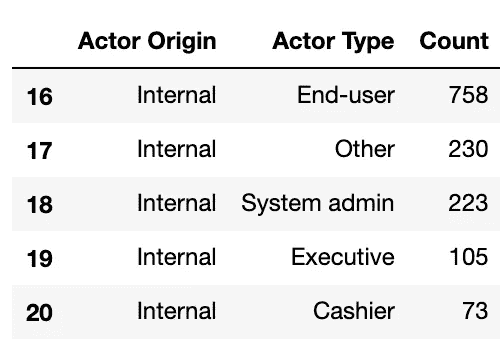
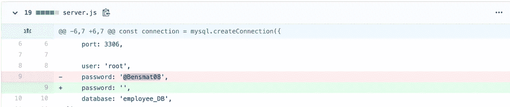
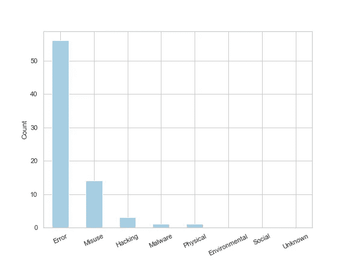
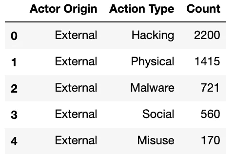
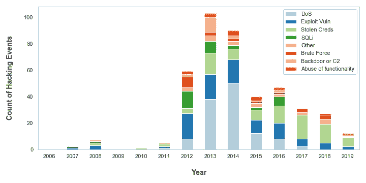
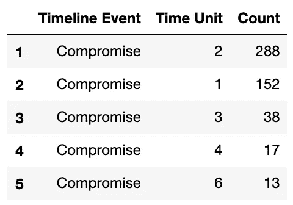
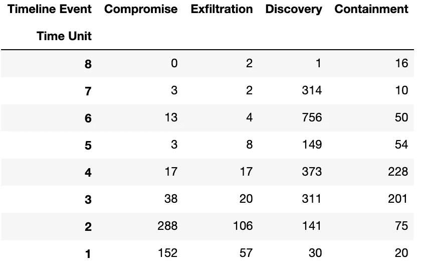
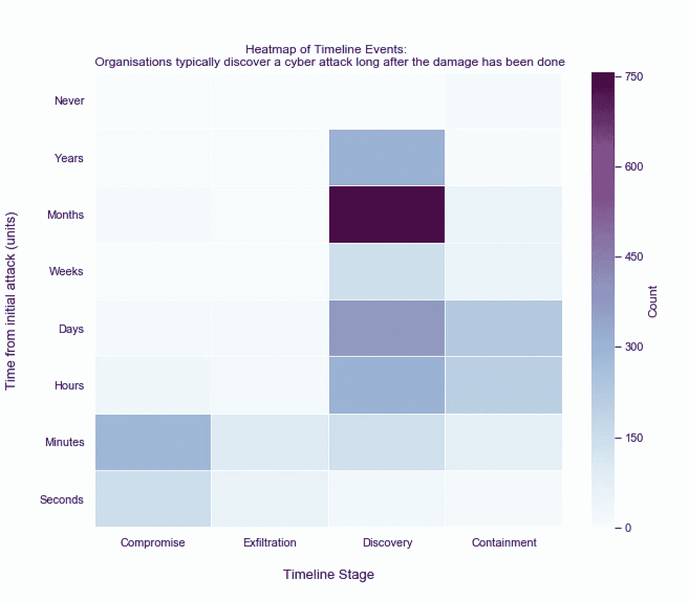

# 理解网络攻击的数据驱动方法

> 原文：<https://towardsdatascience.com/a-data-driven-approach-to-understanding-cyber-attacks-5cd8b5f91abe?source=collection_archive---------26----------------------->

## 在 VERIS 社区数据集上使用 Pandas 的探索性指南


照片**马库斯·斯皮斯克**上[**下**](https://unsplash.com/@markusspiske)

保护让社会正常运转的数字系统、应用和网络免受有意和无意的伤害是一个非常复杂的问题，仅靠人类的直觉是无法实现的。

网络安全领域正在发生一场觉醒，这种觉醒是由同样的商品推动的，这种商品曾导致亚马逊、脸书和谷歌等公司成为世界上最强大的私营公司: ***Data*** 。

数据科学在网络安全领域的应用为组织更好地保护自己免受网络威胁提供了重要的机会。一个常见的用例是实现机器学习模型来监控恶意用户行为，这是一个不适合人类分析师执行的任务，尤其是对于拥有数千名员工的大型组织。

在本文中，我使用 Python 和 Pandas 来探索由大约 8500 个真实世界网络事件组成的 [VERIS 社区数据集](http://veriscommunity.net/index.html)，以回答一个广泛的研究问题:“网络事件的共同属性是什么？”。通过回答这个简单的问题，我希望展示如何利用数据将一个复杂的问题分解成微小而可行的见解。

# 导入和配置数据

我通过将 GitHub 上的整个 VERIS repo 克隆到我的本地环境来导入数据。因为每个事件都存储在一个单独的 JSON 对象中，所以我使用了有用的 [verispy](https://pypi.org/project/verispy/) 包将数千个 JSON 对象提取到一个 pandas 数据帧中:

```
import pandas as pd
from verispy import VERISdata_dir = '/Users/danielharrison/VCDB-master/data/json/validated'
v =  VERIS(json_dir=data_dir) #creates a veris objectFound 8539 json files.veris_df = v.json_to_df(verbose=True) #creates a dataframe from the veris object
```

检查数据框架揭示了 VERIS 社区数据集的范围(截至 2020 年 1 月):

```
veris_df.shape()
(8539, 2347)
```

# 1.谁在引发网络事件？

了解谁会有意或无意地对数字资产造成潜在损害，是解决研究问题和探索数据的自然起点。

VERIS 数据库将网络威胁因素分为三类:

1.外部-组织之外的任何人，例如黑客、国家和前雇员

2.内部-受托访问内部系统的任何人，例如全职员工、承包商和实习生

3.合作伙伴——受影响组织的第三方供应商，通常对内部系统有一些可信的访问权限。

为了按参与者类型分解事件，我利用了 verispy 软件包提供的`enum_summary`函数:

```
df_actors_internal = v.enum_summary(veris_df, 'actor.internal.variety', by='actor')df_actors_external = v.enum_summary(veris_df, 'actor.external.variety', by='actor')
```

*注意:我忽略了包括合作伙伴行动者类型，因为由合作伙伴引起的事件总数很低，这影响了以后的可视化。*

在对`df_actors_internal`和`df_actors_external` 数据帧进行了一些清理之后(更多信息参见我的 [GitHub 代码](https://github.com/87bdharr/VERIS-Data-Analysis)，我将它们连接成一个数据帧`df_actors_combined`:

```
df_actors_combined = pd.concat([df_actors_internal, df_actors_external])df_actors_combined.head()
```



串联数据帧 df_actors_combined 包含内部和外部参与者

由于 Plotly express 图形库，以视觉上令人惊叹的交互式方式呈现这些数据变得非常容易。我选择用一个旭日图来展示内部和外部参与者是如何被进一步分解成他们的参与者类型的:

```
import plotly.express as pxfig_1 = px.sunburst(df_actors_combined, path=['Actor Origin', 'Actor Type'], values='Count')fig_1.update_layout(uniformtext_minsize=12)plot(fig_1, filename = 'Actor Origin', auto_open=True)
```

内部和外部参与者被进一步分解为他们的角色或联盟

关于在页面中嵌入可视化的更多信息，我推荐下面的 [*文章*](/how-to-create-a-plotly-visualization-and-embed-it-on-websites-517c1a78568b) *。*

显而易见的是，由内部和外部行为者引起的事件几乎是平均分布的，52%是外部的，47%是内部的(大约 1%是合作伙伴&未知)。

## **赛博域深度挖掘 1**

组织不能低估内部威胁带来的风险，他们对内部系统的特权访问和工作知识使他们很容易造成伤害-无论他们是否有意。

对于内部参与者的已知数据，很大一部分可归因于“最终用户”，VERIS 文档将其描述为应用程序的最终用户或正式员工。我将此解释为拥有系统标准访问权限并在日常工作中使用该系统的员工。

有趣的是，根据我在 DevOps 环境中的经验，考虑到软件开发人员所拥有的高级访问和工作知识，我预计由他们引起的事故数量会高得多。例如，开发人员可以修改软件应用程序的底层源代码，以某种方式为自己谋利，或者干脆将密码和 API 密钥等秘密暴露在 GitHub 上托管的代码中:



在 Github 上搜索“删除密码”会发现很多秘密被留在源代码中的例子

为了了解开发人员是恶意行为还是仅仅是犯了错误，我通过过滤内部开发人员的`veris_df`数据框架和他们的行为进一步分析了数据:

```
df_actors_developers = v.enum_summary(veris_df, 'action', by='actor.internal.variety')df_actors_developers = df_actors_developers[df_actors_developers['by'] == 'actor.internal.variety.Developer']df_actors_developers.plot(kind='bar', x='enum', y='x', legend=False)plt.xticks(rotation=25)
plt.ylabel('Count')
plt.savefig('df_actors_developers')
```



大多数由开发引起的事件是由错误引起的，很少是恶意的

生成的条形图显示，在 73 起与开发人员相关的事件中，56 起是错误(即意外)，其余 17 起与误用、黑客攻击和恶意软件(即恶意软件)有关。有帮助的是，VERIS 提供了一个事件摘要，我从 14 个标记为“误用”的事件中提取了该摘要，并将其输出到一个 csv 文件中，以便于阅读:

```
df_actors_developers_misuse = veris_df.loc[(veris_df['actor.internal.variety.Developer'] == True) & (veris_df['action.Misuse'] == True)]df_actors_developers_misuse['summary'].to_csv('developers_misuse_summary.csv', index=False, header=False)
```

一个特殊的事件是由美国的一名高级 IT 主管引起的，他也是一名开发人员。该开发商:

> *“2005 年，他在“随机”数字生成计算机软件中添加了一个秘密代码，使他能够将多场比赛的中奖概率从高达 500 万分之一缩小到 200 分之一……他在科罗拉多州、威斯康星州、爱荷华州、堪萨斯州和俄克拉荷马州劫持了至少五张中奖彩票，奖金总额超过 2400 万美元”*

确实非常淘气。[我已经将剩余的摘要上传到了我的 GitHub

**本次网络领域深度探讨展示了我们如何从询问“谁造成了网络事件”这一非常普通的问题，一直到发现源代码完整性的价值。**

# 2.什么样的行为会导致网络事故？

在探讨了开发人员通常如何引发网络事件后，我后退一步，分析了所有外部、内部和合作伙伴可能采取的威胁行动。这是很有用的，因为组织需要知道他们的内部和外部威胁可能如何实现，这样他们就可以实施足够的保护控制。

我想用更多的 Plotly 的交互式图表来形象化这种洞察力，并决定 Sankey 图将优雅地显示演员和动作之间的关系和流动。为了创建一个 Sankey，我过滤了 actor 和 action 上的`veris_df` 数据帧:

```
df_action_actor = v.enum_summary(veris_df, 'action', by='actor')
```

稍微整理了一下生成的数据帧:

```
df_action_actor.drop(['n', 'freq'], axis=1, inplace=True)df_action_actor.columns = ['Actor Origin', 'Action Type', 'Count']df_Unknown_3 = df_action_actor[df_action_actor['Actor Origin'] == 'actor.Unknown']df_action_actor.drop(df_Unknown_3.index, inplace=True)
```

并使用映射函数来阻止代码在每个单词前输出“actor ”,即“actor”。外在，演员。内部，演员。合作伙伴':

```
map_origin = {'actor.External':'External', 'actor.Internal':'Internal', 'actor.Partner':'Partner'}df_action_actor['Actor Origin'] = df_action_actor['Actor Origin'].map(map_origin)df_action_actor.head()
```

生成的数据帧现在可以生成桑基图，如下所示:



df_action_actor 数据帧存储了 actor 源和它们可能的动作类型之间的关系

我将上面的`df_action_actor`数据帧传递给了[预建函数](https://medium.com/kenlok/how-to-create-sankey-diagrams-from-dataframes-in-python-e221c1b4d6b0) `gen_Sankey`，指定了生成桑基图中的级别和值的列，并通过调用`plot`输出了结果图:

```
fig_4 = genSankey(df_action_actor, cat_cols=['Actor Origin', 'Action Type'], value_cols='Count', title='Sankey Diagram for Veris Community Database')plot(fig_4, filename = 'Cyber Actions Sankey Diagram', auto_open=True)
```

Sankey 图表明，数据集中的一些事件被分配了多种操作类型，因为内部、外部和合作伙伴事件的数量与之前的图表相比略有增加(按操作类型划分数据时，记录的事件有约 12%的差异)。

## **赛博域深潜 2**

该图显示，约 90%与内部行为者相关的事件是由错误或误用造成的。这种洞察力告诉我们，安全部门可以预期内部威胁会以用户行为的形式出现，而不是恶意软件或黑客活动，后者通常需要略有不同的监控技术。这就是为什么用户行为分析(UBA)领域最近出现了爆炸式增长，并使组织能够检测到用户在一段时间内相对于其他用户或自己的异常行为。

与外部行为者相关的事件是由一系列更加多样化的行为引起的。这是有意义的，因为参与者必须采用更具创造性的方法来获得对系统的访问，以实现他们的结果。“黑客”行动似乎有点模糊:黑客到底意味着什么？我们能分离出黑客攻击的一些趋势吗？为了回答这些问题，我必须向数据帧添加一个日期时间索引，并过滤由黑客行为引起的事件(产生的数据帧称为`combined`)。有关我如何做到这一点的更多信息，请参考[我的 GitHub](https://github.com/87bdharr/VERIS-Data-Analysis) ，因为它太长了，无法包含在本文中。

清理数据集后，我能够提取以下图形:

```
ax1 = combined.iloc[:, 2:10].plot(kind='bar', stacked=True, figsize=(10,5))
```



2006-2019 年黑客活动导致的网络事件频率

图表显示了更多关于什么行为构成“黑客攻击”的细节。拒绝服务(DoS)攻击在 2013 年和 2014 年困扰着组织，但最近，对数据集中的组织来说，威胁似乎已经变得不那么大了。这可能是因为反 DoS 技术近年来变得更加先进和流行:web 应用程序防火墙(waf)能够对传入的 Web 流量进行速率限制，通常由云供应商在内容分发网络(cdn)、应用程序负载平衡器和 API 网关上作为标准提供。

然而，VERIS 数据集现在可能会过时，因为数据表明自 2013 年以来黑客攻击一直在稳步下降。有大量其他数据集和统计数据表明情况并非如此。事实上，作为一个从事网络安全工作并对各种组织有看法的人，我可以凭第一手经验说，网络攻击的数量正在上升。

# 3.组织检测和响应网络事件需要多长时间？

能够及时检测和响应网络事件可以拯救整个组织免于破产。检测和响应网络事件花费的时间越长，组织面临的风险就越大，潜在的危害也就越大。

VERIS 将网络事件分为 4 个阶段，并记录组织达到该阶段所需的时间单位:


*   妥协:参与者已经获得对信息资产的访问权或妥协，例如获得对销售数据库的访问权
*   泄露:参与者从受害者组织获取非公开数据的点(不适用于所有事件)
*   发现:组织意识到事件已经发生的时间点
*   遏制:组织阻止事故发生或恢复正常业务的点。

*N.B. VERIS 仅记录到达每个阶段的时间单位，即秒、分、小时，出于保密原因，不记录实际时间戳。*

我想了解组织检测和响应网络事件需要多长时间，并使用热图表示这些信息。

为此，我首先必须从数据集中提取时间轴信息。我编写了一个函数(`get_timeline_df(x, event)`)，该函数根据事件的特定阶段过滤数据集，并为下一阶段的处理格式化结果数据帧。关于`get_timeline_df`功能的更多详情，请参见 [my GitHub](https://github.com/87bdharr/VERIS-Data-Analysis) 。我调用了这个函数 4 次，事件的每个阶段调用一次:

```
compromise_time = get_timeline_df(‘timeline.compromise.unit’, ‘Compromise’)discovery_time = get_timeline_df('timeline.discovery.unit', 'Discovery')exfiltration_time = get_timeline_df('timeline.exfiltration.unit', 'Exfiltration')containment_time = get_timeline_df('timeline.containment.unit', 'Containment')
```

然后将 4 个数据帧连接成一个:

```
timeline_df = pd.concat([compromise_time, discovery_time, exfiltration_time, containment_time])
timeline_df.head()
```

生成的数据帧如下所示:



串联时间轴 _ 测向数据帧

在`get_timeline_df`函数中，我将字符串时间单位映射到一个从 1 到 8 的整数值，即‘秒’:1、…、‘天’:4、…、‘从不’:8，这样我就可以从最长到最短的时间跨度对值进行排序。

通过以矩阵形式传递数据，可以在 seaborn 中创建热图。我使用`pd.pivot()`函数将`timeline_df`数据帧转换成矩阵，根据事件的 4 个阶段重新索引数据，并将数据从最长时间单位到最短时间单位排序:

```
timeline_matrix = timeline_df.pivot('Time Unit', 'Timeline Event', 'Count')timeline_matrix.columnscolumns_matrix_titles = ["Compromise","Exfiltration", "Discovery", "Containment"]timeline_matrix = timeline_matrix.reindex(columns=columns_matrix_titles)timeline_matrix.sort_index(ascending=False, inplace=True)
```

生成的矩阵如下所示:



根据 VERIS，时间轴矩阵按网络事件的四个阶段进行索引

现在，我简单地将矩阵传递给 seaborn 的热图函数，并将时间单位重新标记为字符串值，以便于理解:

```
import seaborn as snsfig_heatmap = plt.figure(figsize=(10,8))r = sns.heatmap(timeline_matrix, cmap='BuPu', cbar_kws={'label': 'Count'}, linewidths=.05)plt.yticks([7.5,6.5,5.5,4.5,3.5,2.5,1.5,0.5], ['Seconds', 'Minutes', 'Hours', 'Days', 'Weeks', 'Months', 'Years', 'Never'], rotation=0)
```

产生了以下热图:



热图显示了网络事件在最初发生数月后才被发现的总体趋势

## 赛博域深度潜水 3

从热图中显而易见的是，与组织意识到发生了任何事情相比，危害和泄露数据所需的时间更短。根据 [FireEye](https://www.fireeye.com/content/dam/fireeye-www/services/pdfs/ig-mtrends-2018.pdf) 的数据，在首次攻击数月后发现的大量事件与公认的 2017 年行业平均 *101 天*发现网络事件有很好的相关性。

网络专业人士通常将最初的妥协和发现之间的时间称为“停留时间”。驻留时间数字如此之高的一个原因可能是因为被称为“高级持续威胁”或“APTs”的特定网络事件子集。apt 喜欢在一个组织的系统上长时间不被注意。留在那里有助于威胁参与者了解组织如何工作，以实现他们的目标，例如窃取数据。

为什么停留时间很重要？T4 最近的一篇论文指出，停留时间和网络攻击的平均成本之间存在关联。 ***停留时间越长，攻击的代价就越大。***

组织可以使用平均停留时间作为 KPI 来衡量威胁检测控制的有效性。只有通过测量，组织才能真正了解他们的网络风险。

## 网络安全是一个数据问题

数字世界里发生的一切都会被记录下来。用户点击浏览器中的链接、员工三次输错密码、文件从一个网络位置传输到另一个网络位置，都是以数字格式记录的事件。这些数字事件可以用来保护组织免受网络事件的影响，但前提是用户、员工和系统每天产生的海量数据可以作为一种有益的工具来使用。

VERIS 社区数据集只是应用数据分析来保护数字系统的一个用例。通过观察数以千计的事件的总体趋势，组织可以了解威胁最有可能来自哪里，以及他们可能如何试图造成伤害。

正如杰弗里·摩尔所说-

> *没有大数据分析，公司就像瞎子和聋子，像高速公路上的小鹿一样在网络上游荡。*