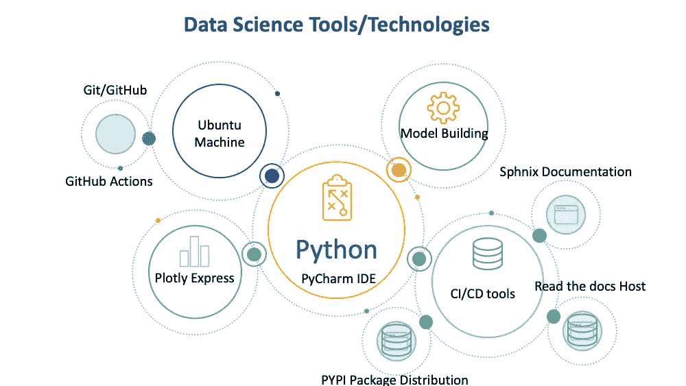

# 管理 ML 项目的数据工程方法

> 原文：<https://towardsdatascience.com/a-data-engineer-approach-to-managing-an-ml-project-7bbfb6efd2df?source=collection_archive---------49----------------------->

## 使用 DevOps 电池的数据科学项目

## 项目管理技能的展示

最近， [**劳伦斯·莫罗尼**](https://www.linkedin.com/in/laurence-moroney/) 建议专业人士通过在 GitHub 上发起一个涵盖你投资组合相关方面的项目来展示你的技能，并通过工作让你的专业网络了解你。我采纳了他的建议，在 GitHub 上做了一个项目。我写这篇文章是为了激励他人，也是为了建立我自己的投资组合。我将介绍这个项目的主要组成部分。下面是我的 GitHub 项目的链接。

 [## amjadraza/零售销售预测

### 用机器学习预测零售店销售额的 Python 项目。这个项目是基于提供的数据…

github.com](https://github.com/amjadraza/retail-sales-prediction) 

# 零售预测

有了数据工程和科学背景，我从 Kaggle 竞赛中选择了一个问题来预测一家零售店的销售额。

任务是使用厄瓜多尔的 [**Corporación Favorita 杂货店**](http://www.corporacionfavorita.com/) 连锁店提供的数据建立零售预测。数据是为 Kaggle 比赛提供的。我按照以下步骤来执行数据工程和建模。出于研究目的，我使用了 Jupyter 笔记本和 PyCharm IDE。

以下是我在这个项目中遵循的一些步骤。

1.  关于[法乌瑞塔杂货店的简要信息](http://www.corporacionfavorita.com/)
2.  探索性数据分析
3.  特征工程和选择
4.  模型训练和选择
5.  准备/部署销售预测模型

我已经包括了用于探索性数据分析、特性工程和模型构建的 Jupyter 笔记本。

除了研究部分，我还使用 PyCharm IDE 和[audreyr](https://github.com/cookiecutter/cookiecutter)的[python Project cooki cutter](https://github.com/audreyr)建立了 Python 项目。Cookiecutter 项目包括 DevOps 所需的大部分电池，但我也包括了一些自定义数据。我的项目的一些特点是

1.  使用 Sphinx 和 readthedocs 模板的文档
2.  Jupyter 笔记本
3.  使用 CLI 命令参数的运行程序
4.  模块结构
5.  自动测试
6.  版本控制

# DevOps 工具

一旦项目建立起来，就应该添加一些 DevOps 工具来构建和部署文档，运行测试，创建 PyPi 包，并在 PyPi 上部署。通常，这些步骤对数据科学家来说似乎很陌生，但是任何人只要稍加努力就能学会。

## 文档构建和部署

在本地测试完文档后，我在 [readthedocs](https://readthedocs.org/) 服务器上创建了一个免费账户，并与 GitHub 链接。只需点击几下鼠标，即可构建和部署文档。下面是我的项目文档的链接。

 [## 欢迎阅读零售预测文档！-零售预测文档

### 欢迎阅读零售预测文档！

-零售预测文档欢迎使用零售预测文档！零售销售预测](https://retail-sales-prediction.readthedocs.io/en/latest/) 

## Python 包自动测试

当构建大型项目时，无论是 PR、MR 还是 Push，只要有活动就运行自动测试是至关重要的。我已经使用 GitHub actions 设置了管道，以便在有推送时进行自动测试。目前，我只有演示测试，但它可以很容易地扩展。

## 创建一个 Python 包并部署在 PyPi 上

项目的最后一部分是创建一个可安装的 python 包，并在 PyPi 包发行版上发布。为此，我在 https://pypi.org/的[上创建了一个免费账户。发布已经在 GitHub 上准备好了，使用 GitHub actions 工作流，我已经将包部署到 https://pypi.org/的](https://pypi.org/)。下面是我的包的链接。

 [## 零售销售预测

### 用机器学习预测零售店销售额的 Python 项目。这个项目是基于提供的数据…

pypi.org](https://pypi.org/project/retail-sales-prediction/) 

# 演示台

一个好的演示文稿是成功交付任何项目的关键技能。我准备了一套幻灯片来展示我的工作。您可以在 Slideshare 上的以下位置找到我的幻灯片。

# 结束语

在这篇文章中，我写了数据工程/科学项目的概述，包括项目所需的模型构建和 DevOps 工具。这个项目结构是可扩展的，并且以一种只需很少修改就可以用于生产的方式进行设置。

# 未来作品

这个项目可以增加很多东西

1.  探索张量流模型
2.  添加 docker 支持并发布 Docker 图像
3.  用于模型开发的 Spark 集成
4.  远程机器的可行部署
5.  投稿指南和 Git 工作流程
6.  创建和部署 Conda 包
7.  云服务上的最终模型部署，例如 GCP