# Go 与 Python 的数据工程观点(第 1 部分)

> 原文：<https://towardsdatascience.com/a-data-engineering-perspective-on-go-vs-python-part-1-5dfb8bc08e7?source=collection_archive---------22----------------------->

# 介绍

> *探索 golang——我们能放弃 Python 吗？我们(比如“经常处理大量数据的人”)最终找到 go 的用例了吗？第 1 部分探讨了 Python 和 go 之间的高级差异，并给出了这两种语言的具体示例，旨在基于 Apache Beam 和 Google Dataflow 作为真实示例来回答这个问题。*

[Apache Beam](https://beam.apache.org/) 是我以前在这个博客上使用过几次的东西:它是一个针对批处理和流用例的统一编程模型，可以处理[令人愉快的并行工作负载](https://en.wikipedia.org/wiki/Embarrassingly_parallel)，允许许多自定义 I/O 和其他连接器，并运行在多种执行平台上，最著名的是 Flink、Spark 和 Google Cloud 的数据流。

您可以使用它来传输或批处理数据，以分析数据、运行 ETL、丰富数据——应有尽有。我其实几年前就用过`Beam`[这里](https://chollinger.com/blog/2018/06/analyzing-reddits-top-posts-images-with-google-cloud-part-1/#introducing-data-flow)。

现在，如果你去 Beam 的网站，你会发现这个奇妙的图形:

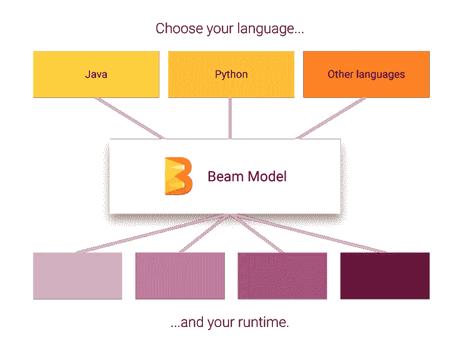

[https://beam.apache.org/](https://beam.apache.org/)

它告诉你 Beam 要么用`Java`要么用`Python`来写，其他的都属于“其他语言”。

然而，有一个“实验性的”( [GitHub](https://github.com/apache/beam/tree/master/sdks/go) )承诺我们使用`go`而不是`Python`——这让我很兴奋。

下一节将尝试对`go`做一个“简短的”(~3，000 字)介绍，并根据不同的处理数据工程特定用例以及在使用多线程应用时，将其与`Python`进行比较。请注意，这绝不是完全的比较。

> *这是第 1 部分，共 2 部分，重点介绍两种语言和 Apache Beam SDK 的当前状态。在第 2 部分(即将推出)，我们将探索如何使用* `*Beam*` `*go*` *SDK，我们将在 GCP 面临哪些限制，以及数据工程师的* `*go*` *之旅将走向何方。*

*所有示例代码在* [*GitHub*](https://github.com/otter-in-a-suit/chollinger-blog/tree/master/content/posts/2020/06/a-data-engineering-perspective-on-go-vs-python-part-1/code) *上都有。*

*最初发表于*[*https://chollinger.com*](https://chollinger.com/blog/2020/06/a-data-engineering-perspective-on-go-vs.-python-part-1)

# Go vs. Python

如果你不熟悉，让我引用维基百科:

> Go 是一种静态类型的编译编程语言，由 Robert Griesemer、Rob Pike 和 Ken Thompson 在 Google 设计。Go 在语法上类似于 C，但是具有内存安全、垃圾收集、结构化类型和 CSP 风格的并发性。
> 
> [*https://en . Wikipedia . org/wiki/Go _(编程 _ 语言)*](https://en.wikipedia.org/wiki/Go_(programming_language))

`Go`有许多概念，应该会让您对处理数据的并行执行框架感到兴奋。在接下来的几节中，我们将探索一些精选的概念和示例，并以一个更长、更深入的并发示例结束。

# 速度

`go`是一种编译语言，而不是解释语言，[应该比 Python](https://benchmarksgame-team.pages.debian.net/benchmarksgame/fastest/go-python3.html) 快。它还倾向于非常快速地编译东西，将编译好的代码发送给最终用户要比试图用 Python 做同样的事情容易几个数量级。

你可以在下面找到一些实际操作的例子。

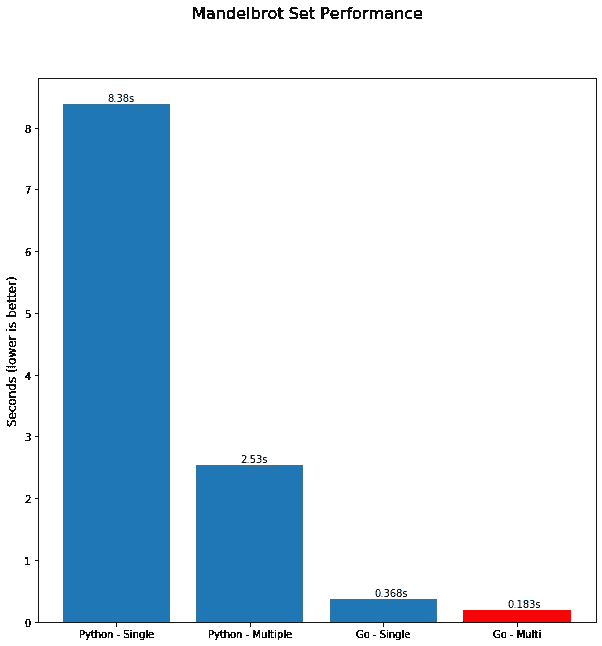

使用 matplotlib 生成；CC BY-SA 3.0

# 静态打字

与`Python`的动态类型相反，静态避免了在正确的时刻使用正确的数据类型带来的许多类型问题。

> 我并不想对静态和动态类型以及 Python 的复杂性进行一般性的比较，而只是从我的经验来看，特别是在数据空间中，每天都是如此。

在数据驱动的项目中，您会经常发现自己在处理非常严格的数据类型定义，这通常是某个领域的一个工件(理所当然如此),在这个领域中，所有公司数据都不可避免地存储在大型 RDMBs 中，例如 Oracle，强制执行严格的类型。

基于 Python 的框架，比如`pySpark`甚至`pandas`，都自带了提供类型的抽象层。

以这段代码为例，它是为`pySpark`编写的，这是一个流行的数据处理框架，在 Python(以及其他语言)中可用，使用了 NYC Yellow Cab 数据[0]。

首先，将一个 CSV 文件读入一个`RDD`，一个“有弹性的分布式数据集”，并对数据集中的每一行应用一些转换 lambdas。

```
# Read data
rdd = sc.textFile('data/yellow_tripdata_2019-01.csv')
# Parse the RDD
rdd = rdd.map(lambda r: r.split(','))\
         .map(lambda r: (r[10],r[13])) # Take 'fare_amount' and 'tip_amount'
rdd = rdd.filter(lambda r: 'fare_amount' not in r) # filter header
rdd.take(1)
```

这产生了:

```
[('7', '1.65'), ('14', '1'), ('4.5', '0'), ('3.5', '0'), ('52', '0')]
```

如果我们研究其中一个元组:

```
type(rdd.take(1)[0][0])
```

我们将把`str`视为数据类型。

现在，如果我们要减少这个数来合计出租车费和小费金额:

```
def sum_fares(fare, tip):
    return fare + tip

rdd.map(lambda r: sum_fares(*r)).take(5)
```

正如上面输出中的引号所示，结果是一个串联的`strings`列表。

```
['71.65', '141', '4.50', '3.50', '520']
```

而不是数学上正确的:

```
rdd.map(lambda r: sum_fares(*[float(x) for x in r])).take(5)
# [8.65, 15.0, 4.5, 3.5, 52.0]
```

新版本的 Python 支持`type hints`，Python 解释器跟踪变量类型。然而，正如上面的例子所强调的，我个人发现很难维护一个一致的、可读的、可维护的代码库，尤其是在复杂的应用程序上。

另一方面，`go`是静态类型的。

```
package main

import (
	"fmt"
	"reflect"
)

func main() {
    // Implicit
	str := "A String"
	fmt.Printf("%s is %s\n", str, reflect.TypeOf(str))

    // Explicit
	var x float64 = 3.14
	fmt.Printf("%v is %s\n", x, reflect.TypeOf(x))
}
```

将产生:

```
go run test.go
A String is string
3.14 is float64
```

鉴于此:

```
str = x
```

不会编译:

```
go run testvar.go
# command-line-arguments
./test.go:15:6: cannot use x (type float64) as type string in assignment
```

Go 不支持`Generics`，但`Python`也不支持。

> *我跳过了*`*go*`*`*empty interface{}*`*的概念，以支持任意值和处理未知类型；在需要弱类型抽象的情况下，可以使用这个概念**

**【0】*`*Spark*`*的 SQL 接口将推断字符串类型，并允许对字符串进行数学运算，如果它们一致**

# *接口和结构*

*`Python`确实有一个`class`结构(我已经广泛使用过了)，而`go`使用了`structs`和`interfaces`(这是一个可怕的简化)。`go`没有继承，依赖于接口和组合。*

*在数据世界中，拥有严格的类结构，例如抽象转换、统计模型或简单的旧数据结构，可能既是痛苦也是诅咒。*

*`Python`广泛使用了`dicts`,它可以保存任意的键值对和嵌套结构，在语法上类似于`JSON`,并且为数据的结构化抽象定义了`class`。几乎每个数据框架都有自己的`schema`类。从理论上讲，`go`可以通过组合`interfaces`(用于标准)、静态类型(确保在正确的时刻使用正确的数据类型)和`structs`来定义结构和逻辑，从而避免这种情况。*

*这里有一个非常有用的例子，它使用接口`CoordinateData`和函数`calculateDistance`，在世界上最差的 GIS 分析平台上计算两个坐标元组之间的距离:)*

```
*package main

import (
	"fmt"
	"math"
)

// A Resource we're trying to access
type CoordinateData interface {
	calculateDistance(latTo, lonTo float64) float64
}*
```

*然后，我们实现地理空间数据和哈弗辛函数(以近似地球上的距离):*

```
*type GeospatialData struct {
	lat, lon float64
}

const earthRadius = float64(6371)
func (d GeospatialData) calculateDistance(latTo, lonTo float64) float64 {
	// Haversine distance
	var deltaLat = (latTo - d.lat) * (math.Pi / 180)
	var deltaLon = (lonTo - d.lon) * (math.Pi / 180)

	var a = math.Sin(deltaLat / 2) * math.Sin(deltaLat / 2) + 
		math.Cos(d.lat * (math.Pi / 180)) * math.Cos(latTo * (math.Pi / 180)) *
		math.Sin(deltaLon / 2) * math.Sin(deltaLon / 2)
	var c = 2 * math.Atan2(math.Sqrt(a),math.Sqrt(1-a))

	return earthRadius * c
}*
```

*在一个简单的二维平面上也是如此:*

```
*type CartesianPlaneData struct {
	x, y float64
}

func (d CartesianPlaneData) calculateDistance(xTo, yTo float64) float64 {
	// Simple 2-dimensional Euclidean distance 
	dx := (xTo - d.x)
	dy := (yTo - d.y)
	return math.Sqrt( dx*dx + dy*dy )
}*
```

*在这种情况下，`main()`函数只计算两种完全不同的距离:*

```
*func main() {
	atlanta := GeospatialData{33.753746, -84.386330}
	distance := atlanta.calculateDistance(33.957409, -83.376801) // to Athens, GA
	fmt.Printf("The Haversine distance between Atlanta, GA and Athens, GA is %v\n", distance)

	pointA := CartesianPlaneData{1, 1}
	distanceA := pointA.calculateDistance(5, 5) 
	fmt.Printf("The Pythagorean distance from (1,1) to (5,5) is %v\n", distanceA)
}*
```

*当然，这是一个非常简单的例子，简单地将结构强加到你的结构上。然而，与 Python 相比，我的选择有限:*

```
*class CoordinateData:
    def calculateDistance(self, latTo, lonTo):
        pass 

class GeospatialData(CoordinateData):
    def __init__(self, lat, lon):
        self.lat = lat
        self.long = lon

    def calculateDistance(self, latTo, lonTo):
        # Haversine goes here :)
        return 95.93196816811724

class CartesianPlaneData(CoordinateData):
    def __init__(self, x, y):
        self.x = y
        self.x = y

    # Let's not implement calculateDistance()

if __name__ == "__main__":
    atlanta = GeospatialData(33.753746, -84.386330)
    distance = atlanta.calculateDistance(33.957409, -83.376801) # to Athens, GA
    print('The Haversine distance between Atlanta, GA and Athens, GA is {}'.format(distance))

    pointA = CartesianPlaneData(1,1)
    distanceA = pointA.calculateDistance(5, 5)
    print('The Pythagorean distance from (1,1) to (5,5) is {}'.format(distanceA))
    print('pointA is of type {}'.format(pointA.__class__.__bases__))*
```

*这是有效的 Python — `CartesianPlaneData`是`CoordinateData`的子类(*不是接口*—Python 使用 duck-typing)，因此，简单地使用没有返回类型的`calculateDistance`方法(参见上面的静态与动态类型)，运行并返回:*

```
*python3 interface_example.py
The Haversine distance between Atlanta, GA and Athens, GA is 95.93196816811724
The Pythagorean distance from (1,1) to (5,5) is None
pointA is of type (<class '__main__.CoordinateData'>,)*
```

*Python 仍然允许接口抽象，你完全可以使用类来定义层次和逻辑，正如我在下面的`PluginInterceptor`中所做的，来确定一个定制插件是否是一个已定义基类的一部分；然而，这并不是在运行时强制执行的，如果您不正确地实现它，可能会失败。*

```
*class PluginInterceptor:
    """Loads all allowed plugins, when they are a subclass of `BasePlugin` and have the constant `name` set (not `__name__`)
    """
    def __init__(self):
        self.cls = BasePlugin
        self.allowed_plugins = self.__load__allowed_plugins__()

    def __get_all_subclasses__(self, cls):
        return set(cls.__subclasses__()).union(
            [s for c in cls.__subclasses__() for s in self.__get_all_subclasses__(c)]) 

    def __load__allowed_plugins__(self):
        __allowed_plugins__ = {}
        for cls in self.__get_all_subclasses__(self.cls):
            if cls.name:
                __allowed_plugins__[cls.name] = cls
        return __allowed_plugins__*
```

*[https://github . com/otter-in-a-suit/稻草人/blob/master/plugin _ base/interceptor . py # L5](https://github.com/otter-in-a-suit/scarecrow/blob/master/plugin_base/interceptor.py#L5)*

*您还可以在下面的 Mandelbrot 示例中找到一个结构示例。*

# *两颗北极指极星*

*`go`懂指针，不懂指针算术。`go`中的指针用于按指针传递操作，与按值传递相反。我不会深入讨论这个问题，给你一个来自`go`的例子，你可以参考[这篇关于 Python 的精彩文章](https://robertheaton.com/2014/02/09/pythons-pass-by-object-reference-as-explained-by-philip-k-dick/)。*

```
*package main

import "fmt"

func main() {
	i, j := 42, 2701

	p := &i         // point to i
	fmt.Println(*p) // read i through the pointer
	*p = 21         // set i through the pointer
	fmt.Println(i)  // see the new value of i

	p = &j         // point to j
	*p = *p / 37   // divide j through the pointer
	fmt.Println(j) // see the new value of j
}*
```

*(来自[https://tour.golang.org/moretypes/1](https://tour.golang.org/moretypes/1)*

*我对`go`的简短总结是:作为一名开发人员，我能够控制我是喜欢标准的`C`风格的行为——按值传递——还是一个指针，我仍然按值传递——但是在这种情况下，一个指向值的*指针作为函数参数。**

# *Mandelbrot 集的并发性*

*简单、开箱即用、易于使用的并发是`go`中最精彩的事情之一。从同步到并发总共需要两个字母- `go`。*

*让我们使用一种“令人愉快的并行”算法，即**曼德尔布罗集合**。*

> ***Mandelbrot 集合**是函数`f_c(z) = z² + c`从`z = 0`开始迭代时不发散的复数`c`的集合，即序列`f_c(0, f_c(f_c(0))`等。，保持绝对值有界。*
> 
> *[https://en.wikipedia.org/wiki/Mandelbrot_set](https://en.wikipedia.org/wiki/Mandelbrot_set)*

*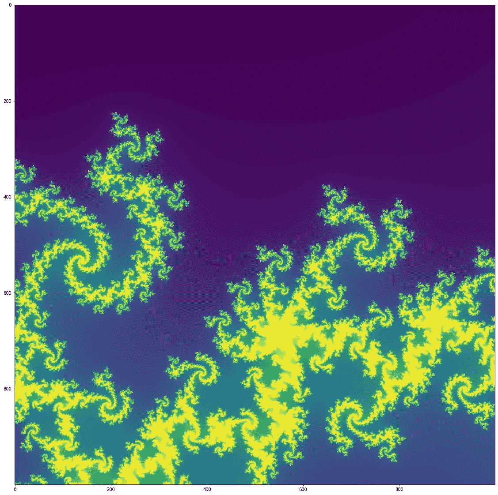*

*Mandelbrot 算法的输出；CC BY-SA 3.0*

# *计算机编程语言*

*我们先来看 Python。*

*Python 提供了多种方式来表达并发性——`threading`、`multiprocessing`、`subprocesses`、`concurrent.futures`等等——但是选择正确的方式*和*编写清晰的代码是一个挑战。请允许我引用文件:*

> **本章描述的模块为代码的并发执行提供支持。工具的适当选择将取决于要执行的任务(CPU 受限与 IO 受限)和首选的开发风格(事件驱动的协作多任务与抢占式多任务)*[](https://docs.python.org/3/library/concurrency.html)*

**我不会详细讨论什么情况下什么是正确的选择，全球 Python 解释器(GIL)如何影响它，或者一切是如何工作的，因为在网上可以很容易地找到数百篇关于这个主题的文章。然而，我想关注的是代码风格、易用性和性能。**

## **单线程的**

**这可以这样表达(由 [danyaal](https://github.com/danyaal/mandelbrot) 作出，由你真正调整):**

> ***请记住，有更多、更快、优化的版本，但也有更多*复杂的*版本；下面的例子应该是简单明了的&，并且可以在* `*go*` *和* `*Python*`之间几乎 1:1 地翻译**

**首先，我们定义算法的迭代。这是可以并行运行的部分，我们马上就会看到。**

```
**import numpy as np
import matplotlib.pyplot as plt

# counts the number of iterations until the function diverges or
# returns the iteration threshold that we check until
def countIterationsUntilDivergent(c, threshold):
    z = complex(0, 0)
    for iteration in range(threshold):
        z = (z*z) + c

        if abs(z) > 4:
            break
            pass
        pass
    return iteration**
```

**下一个函数有点庞大，但最后，它简单地创建了实轴和虚轴，将它们分配给一个二维数组，然后运行循环。**

```
**def mandelbrot(threshold, density):
    # location and size of the atlas rectangle
    # realAxis = np.linspace(-2.25, 0.75, density)
    # imaginaryAxis = np.linspace(-1.5, 1.5, density)
    realAxis = np.linspace(-0.22, -0.219, 1000)
    imaginaryAxis = np.linspace(-0.70, -0.699, 1000)
    realAxisLen = len(realAxis)
    imaginaryAxisLen = len(imaginaryAxis)

    # 2-D array to represent mandelbrot atlas
    atlas = np.empty((realAxisLen, imaginaryAxisLen))

    print('realAxisLen: {}, imaginaryAxisLen: {}'.format(realAxisLen, imaginaryAxisLen))

    # color each point in the atlas depending on the iteration count
    for ix in range(realAxisLen):
        for iy in range(imaginaryAxisLen):
            cx = realAxis[ix]
            cy = imaginaryAxis[iy]
            c = complex(cx, cy)

            atlas[ix, iy] = countIterationsUntilDivergent(c, threshold)
            pass
        pass

    return atlas.T**
```

**计算在单个线程上进行，如下所示:**

**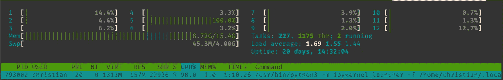**

**htop**

## **多线程**

**现在，为了在多线程中运行它，我们可以使用`multiprocessing`模块并像这样运行它。**

**`calc_row()`函数可以简化，但它指出了我们的不同之处:逐行计算图像，而不是一次一个点。**

```
**import multiprocessing as mp
import itertools

def calc_row(cx, cy, threshold=120):
    c = complex(cx[1], cy[1])
    return (cx[0], cy[0], countIterationsUntilDivergent(c, threshold))**
```

**接下来，我做了一个有问题的决定，通过使用`starmap`和`Pool`来简化循环，直接将嵌套循环的排列作为参数。**

**换句话说，无论我们给进程池多少个进程，我们都在运行`calc_row(cx, cy, threshold)`。`multiprocessing`库负责分别传递来自`list`或`iterator`的参数。**

**我们还返回了一个看起来很奇怪的元组，所以我们可以跟踪图像中的索引。**

```
**def mandelbrot_multi(threshold, density, cpus=4):
    realAxis = np.linspace(-0.22, -0.219, 1000)
    imaginaryAxis = np.linspace(-0.70, -0.699, 1000)
    realAxisLen = len(realAxis)
    imaginaryAxisLen = len(imaginaryAxis)
    atlas = np.empty((realAxisLen, imaginaryAxisLen))

    # Create list of permutations
    realAxis = [(i,e ) for i,e in enumerate(realAxis)] 
    imaginaryAxis = [(i,e ) for i,e in enumerate(imaginaryAxis)] 

    paramlist = list(itertools.product(realAxis, imaginaryAxis))
    paramlist = list(map(lambda t: t + (threshold,),paramlist))

    # Create a multiprocessing pool
    pool = mp.Pool(cpus)

    n = pool.starmap(calc_row, paramlist)
    pool.close()
    pool.join()
    return n, atlas**
```

**它更巧妙的利用了我们现有的资源:**

**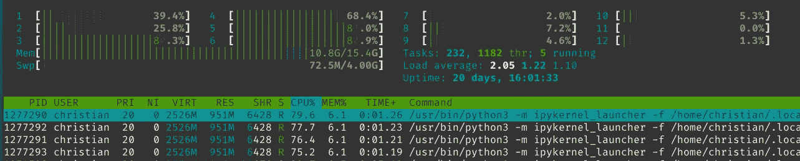**

**htop**

**从性能的角度来看，我们在单个 CPU 上同时使用了 **8.4s** 和 **2.53s** ，由于使用了`mutliprocessing`模块，内存开销很大。**

> ***当然，有很多不同的方法可以加速这一过程，比如*`*Cython*`*`*numpy*`*`*tensorflow*`*，等等，但是看看现成的并发，让我们将它与* `*go*` *进行比较。我不擅长选择例子，分形很漂亮。:)*****

# **去**

**让我们看看它在`go`是什么样子。**

## **单线程的**

**单线程版本没有太大的不同。我重复使用了相同的代码，但是简单地在`go`中重写了它。**

> ***大多数* `*go*` *实现都使用* `*Image*` *包来生成 go 中的映像——这对于一个独立的项目来说是有意义的。然而，在这里，我将数组写到磁盘并在* `*numpy*` *中读取，因此，* `*Python*` *，以保持代码简洁。* `*Python*` *和* `*go*` *的性能数字都是* ***只是计算*** *，不是 I/O 或绘图像素！***

**首先，我们导入所需的包并编写一个`np.linespace()`等价物，它返回指定间隔内的均匀分布的数字。**

```
**package main

import (
	"bytes"
	"fmt"
	"log"
	"math/cmplx"
	"os"
	"strings"
	"time"

	"encoding/binary"
)

func linspace(start, end float64, num int) []float64 {
	result := make([]float64, num)
	step := (end - start) / float64(num-1)
	for i := range result {
		result[i] = start + float64(i)*step
	}
	return result
}**
```

**代码的其余部分应该看起来很熟悉——注意非常具体的强类型数据类型和返回类型。**

```
**func countIterationsUntilDivergent(c complex128, threshold int64) int64 {
	z := complex(0, 0)
	var ix int64 = 0
	for i := int64(0); i < threshold; i++ {
		ix = i
		z = (z * z) + c
		if cmplx.Abs(z) > 4 {
			return i
		}
	}
	return ix
}

func mandelbrot(threshold, density int64) [][]int64 {
	realAxis := linspace(-0.22, -0.219, 1000)
	imaginaryAxis := linspace(-0.70, -0.699, 1000)
	fmt.Printf("realAxis %v\n", len(realAxis))
	fmt.Printf("imaginaryAxis %v\n", len(imaginaryAxis))
	atlas := make([][]int64, len(realAxis))
	for i := range atlas {
		atlas[i] = make([]int64, len(imaginaryAxis))
	}
	fmt.Printf("atlas %v\n", len(atlas))
	for ix, _ := range realAxis {
		for iy, _ := range imaginaryAxis {
			cx := realAxis[ix]
			cy := imaginaryAxis[iy]
			c := complex(cx, cy)
			//fmt.Printf("ix, iy: %v %v\n", ix, iy)
			atlas[ix][iy] = countIterationsUntilDivergent(c, threshold)
		}
	}
	return atlas
}**
```

## **多线程**

**通过使用一个叫做`goroutines`的概念，Go 使这变得容易多了。我们可以简单地使用`go`指令，而不必处理 Python `mutltiprocessing`模块、`pools`、`map` vs. `starmap`以及 Python 解释器的复杂性。**

> ***正如我前面提到的，这里的代码是有意简单的，可以进行简单的优化，但是我尽量让* `*go*` *代码尽可能接近* `*Python*` *代码。请原谅任何简化。***

**首先，我们将从 Python 中重新创建`calc_row`方法，这一次使用一个`struct`来返回索引和值，因为我们将在第二步中使用的`channel`不会采用多种返回类型:**

```
**type triple struct {
	ix, iy int64
	c      int64
}

func calcRow(ix, iy int64, c complex128, threshold int64) triple {
	return triple{ix, iy, countIterationsUntilDivergent(c, threshold)}
}**
```

**我们的主要功能将使用两个概念:`channels`和前面提到的`goroutine`。**

**一个 [goroutine](https://golang.org/doc/effective_go.html#goroutines) 有一个简单的模型:它是一个与相同地址空间中的其他 goroutine 同时执行的函数。go 文档将其与 Unix shell `&`操作符进行了比较，我发现这是一个很好的类比。**

**我们正在使用的[通道](https://golang.org/doc/effective_go.html#channels)是一个*缓冲*通道，其作用类似于我们并发函数的管道，因为非缓冲通道天生就是阻塞的。**

**这导致了下面的代码，该代码包装了内部循环(见上面关于琐碎优化的评论和这里的缺乏——我相信甚至一个指向`goroutine`中的`WaitGroup`和一个更小的`channel buffer`的指针可能会加速这个过程，但是我还没有测试过它)。**

```
**func mandelbrot(threshold, density int64) [][]int64 {
	realAxis := linspace(-0.22, -0.219, 1000)
	imaginaryAxis := linspace(-0.70, -0.699, 1000)
	atlas := make([][]int64, len(realAxis))
	for i := range atlas {
		atlas[i] = make([]int64, len(imaginaryAxis))
	}
	// Make a buffered channel
	ch := make(chan triple, int64(len(realAxis))*int64(len(imaginaryAxis)))

	for ix, _ := range realAxis {
		go func(ix int) {
			for iy, _ := range imaginaryAxis {
				cx := realAxis[ix]
				cy := imaginaryAxis[iy]
				c := complex(cx, cy)
				res := calcRow(int64(ix), int64(iy), c, threshold)
				ch <- res
			}
		}(ix)
	}

	for i := int64(0); i < int64(len(realAxis))*int64(len(imaginaryAxis)); i++ {
		select {
		case res := <-ch:
			atlas[res.ix][res.iy] = res.c
		}
	}
	return atlas
}**
```

**现在，对于`go`，我们看到的是在单个 CPU 上的**0.38 秒**和代码中的**0.18 秒**，虽然相似，但要简洁得多。**

# **最终性能**

**我要把这个留在这里。正如我之前概述的那样，`go`和`Python`代码都可以进一步优化，但是我们仍然可以获得大约 45 倍的加速**

****

**使用 matplotlib 生成；CC BY-SA 3.0**

# **现实生活中的考虑**

**谈论理论概念可能很有趣，但这只是难题中相对较小的一部分。虽然我确信 2020 年将是`Haskell`被广泛用于生产的一年，但我选择、使用和推荐人们学习一门语言的方法主要是基于现实生活中的使用，而不是学术理想。**

# **语言流行度**

**这总是一个有趣的问题。**

**根据 [StackOverflow](https://insights.stackoverflow.com/trends?tags=go%2Cpython) 的说法，围棋相关问题的受欢迎程度甚至还赶不上主要玩家 Python。**

**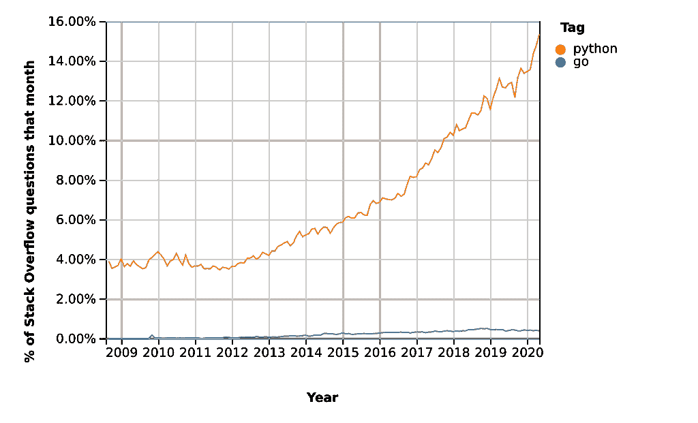**

**[https://insights.stackoverflow.com/trends?tags=go%2Cpython](https://insights.stackoverflow.com/trends?tags=go%2Cpython)**

**将此与其他一些大大小小的玩家——Java、Haskell、Scala、Lisp——进行对比，结果相似:**

**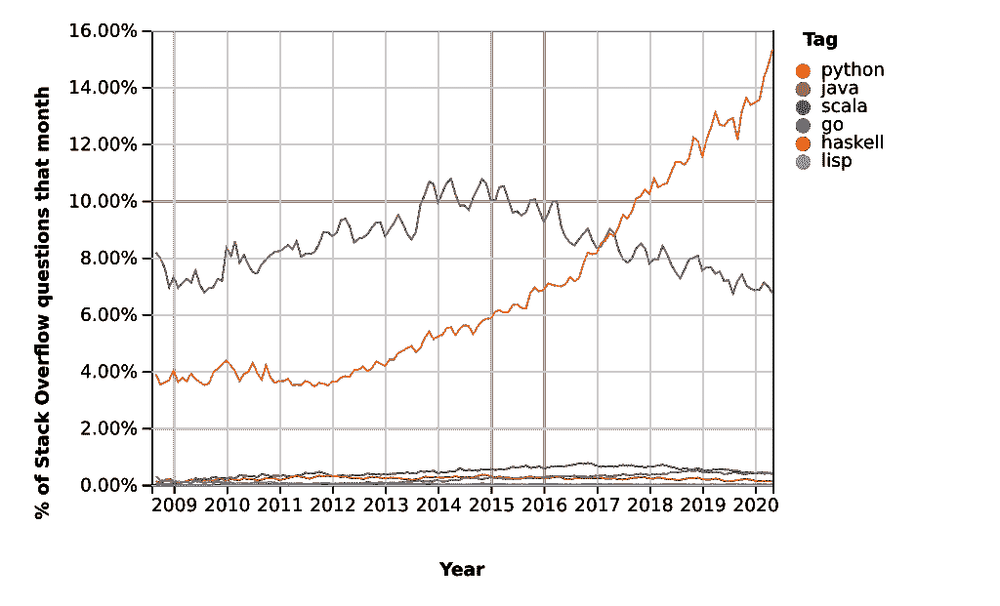**

**[https://insights.stackoverflow.com/trends?tags = go % 2c python % 2c Java % 2c Scala % 2c haskell % 2c lisp](https://insights.stackoverflow.com/trends?tags=go%2Cpython%2Cjava%2Cscala%2Chaskell%2Clisp)**

**现在:提问的百分比是一个很好的衡量标准吗？大概不会。Python 是一门非常受欢迎的学习语言——我自己刚刚参与了它的培训准备——自然会吸引大量的初学者和经验丰富的专业人士。**

**谷歌趋势显示了一个类似的故事:**

**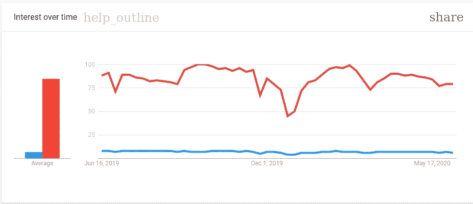**

**[https://trends.google.com](https://trends.google.com)**

**(红色—`Python`；蓝色- `go`)**

**我认为可以公平地说 Python 更受欢迎——但是`go`至少有一个利基市场，如果不是一个上升轨道的话。借助欺骗性可视化的力量，我们可以放大上面的 StackOverflow 图:**

**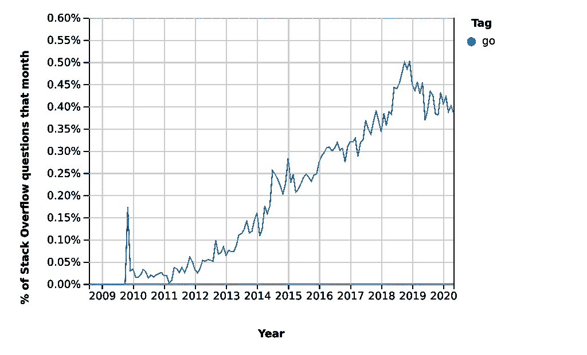**

**[https://insights.stackoverflow.com/trends?tags=go](https://insights.stackoverflow.com/trends?tags=go)**

**事实上，找到了一个上升的轨迹。**

**此外，如果 StackOverflow 的年度[开发者调查](https://insights.stackoverflow.com/survey/2019#most-popular-technologies)可信，当被问及“最受欢迎的技术”时，`go`从 2018 年的 7.2%上升到 2019 年的 8.8%，并在 [2020 年](https://insights.stackoverflow.com/survey/2020#technology-programming-scripting-and-markup-languages-professional-developers)上升到 9.4%。**

**根据[的同一项调查](https://insights.stackoverflow.com/survey/2020#technology-what-languages-are-associated-with-the-highest-salaries-worldwide-united-states)，美国`go`的程序员也以每年 14 万美元的薪酬排名第二(高于 2019 年的第三)，仅次于`Scala`(15 万美元)。**

**有希望！:)**

# **生态系统**

**解释前两张图的部分原因是 Python 的巨大生态系统——后端、前端、统计、机器学习、深度学习、图形分析、GIS、机器人——它就在那里，它将有成千上万的贡献者和成千上万的用户。**

**这里有对应的词，我试着总结了它们，以及它们在 GitHub 上的相对受欢迎程度:**

**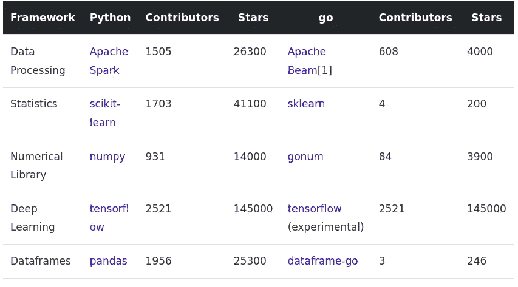**

**此处链接:[https://CHOL linger . com/blog/2020/06/a-data-engineering-perspective-on-go-vs .-python-part-1/#生态系统](https://chollinger.com/blog/2020/06/a-data-engineering-perspective-on-go-vs.-python-part-1/#ecosystem)**

**很明显，至少从数据工程和数据科学的角度来看，围棋生态系统还有很长的路要走。**

***【1】阿帕奇光束不能替代 Spark***

# **学习曲线**

**这个是主观的——我个人觉得`Python`只在表面上更容易学。如果你真的想理解底层的概念、架构和库，`Python`真的是一个兔子洞，不像`Java`。**

**另一方面，`go`是一种相当简单的语言，它关注于某些元素。请允许我引用:**

> ***设计 Go 的时候，Java 和 C++是编写服务器最常用的语言，至少在 Google 是这样。我们觉得这些语言需要太多的记账和重复。一些程序员以效率和类型安全为代价，转向更动态、更流畅的语言，如 Python。我们觉得在单一语言中实现高效、安全和流畅应该是可能的。***
> 
> ***Go 试图在单词的两个意义上减少打字量。在整个设计过程中，我们努力减少混乱和复杂性。没有转发声明，也没有头文件；所有东西都声明一次。初始化是富于表现力的、自动的和易于使用的。语法干净，关键字少。口吃(foo。Foo* myFoo = new(foo。Foo))通过使用:= declare-and-initialize 构造的简单类型派生来减少。也许最根本的是，没有类型层次结构:类型就是类型，它们不需要声明它们之间的关系。这些简化使得 Go 既有表现力又易于理解，同时又不牺牲复杂性。***
> 
> ***另一个重要原则是保持概念的正交性。可以为任何类型实现方法；结构代表数据，而接口代表抽象；诸如此类。正交性使得更容易理解当事物组合时会发生什么。***
> 
> **[*https://golang.org/doc/faq#creating_a_new_language*](https://golang.org/doc/faq#creating_a_new_language)**

**快速浏览一下`LinkedIn Learning`就会发现`go`总共有 4 道菜`Python`有 168 道菜。**

**在我自己的经验中，最有帮助的事情是通过[逐个例子](https://gobyexample.com/)并真正阅读文档。另一方面，Python 作为更广泛层次的外部教程、课程、认证、博客帖子[&mldr；]来自我这样的人，大学，大公司。**

> ***在谷歌上查询“go 语言教程”会返回 17 亿条结果，而“python 语言教程”会返回 1620 亿条结果***

# **阿帕奇波束**

**现在，我们已经讨论了很多关于`go`和`Python`的一般性问题。但是这个帖子的开篇是什么——`Beam`和`Dataflow`在哪里？**

> ***这一部分将在本文的第 2 部分进行简要阐述***

**一般来说，`beam` `go` SDK 确实提供了运行相对简单的任务所需的核心功能。然而，在撰写本文时(2020-06-11)，它确实有一系列的缺点。**

# **转换**

**让我们看看跨`beam`语言的可用转换。我挑选了几个，但是请随意参考所有的文档以获得完整的图片:**

**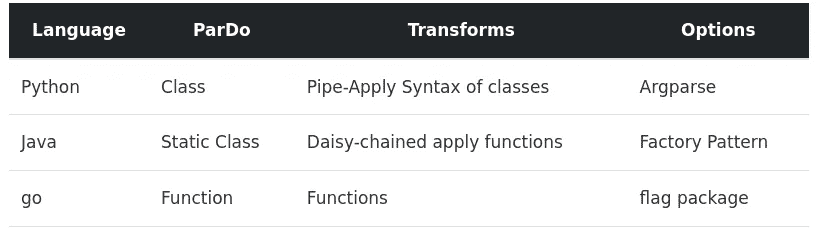**

**[https://CHOL linger . com/blog/2020/06/a-data-engineering-perspective-on-go-vs .-python-part-1/# transformations](https://chollinger.com/blog/2020/06/a-data-engineering-perspective-on-go-vs.-python-part-1/#transformations)**

**对于来自`Python`的人来说，最显著的不同将是管道的整体外观。**

**这是在`Python`中如何完成的(旁注:没有什么可以阻止你调用`data.apply(func)`，因为操作符只是过载了):**

```
**class CountWords(beam.PTransform):
  def expand(self, pcoll):
    return (
        pcoll
        # Convert lines of text into individual words.
        | 'ExtractWords' >>
        beam.FlatMap(lambda x: re.findall(r'[A-Za-z\']+', x))

        # Count the number of times each word occurs.
        | beam.combiners.Count.PerElement())

counts = lines | CountWords()**
```

**在`go`中，它看起来更像一个常规的旧函数:**

```
**func CountWords(s beam.Scope, lines beam.PCollection) beam.PCollection {
	s = s.Scope("CountWords")

	// Convert lines of text into individual words.
	col := beam.ParDo(s, extractFn, lines)

	// Count the number of times each word occurs.
	return stats.Count(s, col)
}**
```

> **我们将在第二部分探讨这些细节**

# **输入－输出**

**I/O 可能是`go` sdk 中最受限制的部分，有许多连接器不可用于 go。**

> ***请参见* [*此链接*](https://beam.apache.org/documentation/io/built-in/) *了解最新概况。***

**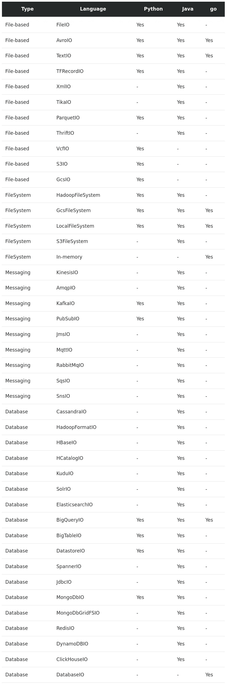**

**[https://beam.apache.org/documentation/io/built-in/](https://beam.apache.org/documentation/io/built-in/)**

**如果要我总结的话:`beam`上的`go`支持基本的`Google Cloud`服务和地方发展，而`Java`则涵盖了几乎所有情况。[2]**

***[2]请记住，一些连接器，如* `*DatabaseIO*` *，本质上是特定于语言的***

# **滑行装置**

**最后，看看可用的运行器，`go`或多或少地受限于`Direct`和`Dataflow`，这符合我在 I/O 上的声明。**

**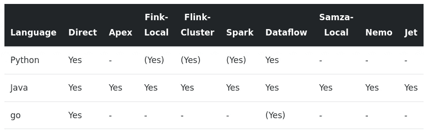**

**[https://CHOL linger . com/blog/2020/06/a-data-engineering-perspective-on-go-vs .-python-part-1/# runners](https://chollinger.com/blog/2020/06/a-data-engineering-perspective-on-go-vs.-python-part-1/#runners)**

> ***答(是)表示这些跑步者有局限性***

# **逐行示例**

**我建议通过`[WordCount](https://beam.apache.org/get-started/wordcount-example/#minimalwordcount-example)`。**

**`WordCount`是一个很好的例子，因为它展示了以下概念:**

*   **创建管道**
*   **将转换应用于管道**
*   **阅读输入**
*   **应用帕尔多变换**
*   **应用 SDK 提供的转换**
*   **写入输出(在本例中:写入文本文件)**
*   **运行管道**

**为了简洁起见，我不会在这一点上深入那些细节。**

# **结论**

**首先要问的问题之一应该是:比较这两种语言有意义吗？我的答案可能是显而易见的——虽然`go`可能是为不同的用例设计的(通用脚本和机器学习用例与系统/“云”编程)，但从数据工程的角度来看，上面概述的概念仍然让我兴奋不已。**

**`go`有许多概念，不需要庞大的`pip`依赖树就能工作，产生干净的代码，易于编译，非常快，而且(在我看来)对未来的数据和 ML 用例有很大的潜力。**

****总之:** `**go**` **和** `**Python**` **显然是非常不同的语言——正如我在上面的**中用我精选的例子成功概括的那样。**

# **后续步骤**

**由于我在这篇文章中只浏览了`Apache Beam`的表面，下一篇文章将关注以下问题，以将`Dataflow`用作“野外的`go`”的真实示例:**

*   **`go` Beam SDK 有多成熟？**
*   **它支持什么？少了什么？**
*   **什么是根本区别？**
*   **(如何)我们可以在`GCP`运行`Dataflow`作业？**

**所有的开发和基准测试都是在 GNU/Linux [PopOS！内核 5.4 上的 19.10]在 2019 System76 Gazelle 笔记本电脑上使用 12 个英特尔 i7–9750h v cores @ 4.5 GHz 和 16GB RAM**

***原载于 2020 年 6 月 11 日 https://chollinger.com**的* [*。*](https://chollinger.com/blog/2020/06/a-data-engineering-perspective-on-go-vs.-python-part-1)**