# 从数据工程的角度看 Go 与 Python(第 2 部分——数据流)

> 原文：<https://towardsdatascience.com/a-data-engineering-perspective-on-go-vs-python-part-2-dataflow-472b42a14f9?source=collection_archive---------60----------------------->

## 使用 Apache Beam & Dataflow 探索、剖析和基准测试 go SDK

# 介绍

在我们从数据工程的角度比较 Python 和 go 的第 2 部分中，我们将最终看一下 Apache Beam 和 Google Dataflow，以及 go SDK 和 Python SDK 的不同之处，我们正在处理的缺点，通过运行大量基准测试它有多快，以及进行转换的可行性。

你可以在这里找到《T4》第一部。

# 阿帕奇光束和谷歌数据流

虽然我们已经在之前的[中多次使用过](https://chollinger.com/blog/2018/06/analyzing-reddits-top-posts-images-with-google-cloud-part-1/#introducing-data-flow)[阿帕奇光束](https://beam.apache.org/)，请允许我再简单介绍一下。

> *Apache Beam 是一个开源的统一模型，用于定义批处理和流数据并行处理管道。使用一个开源的 Beam SDKs，您可以构建一个定义管道的程序。然后，管道由 Beam 支持的分布式处理后端之一执行，包括 Apache Flink、Apache Spark 和 Google Cloud Dataflow。*
> 
> [*https://beam.apache.org/get-started/beam-overview/*](https://beam.apache.org/get-started/beam-overview/)

Beam 可以用于各种数据用例，就像 Apache Spark 一样——ETL(提取、转换、加载)管道、流分析，或者从文件系统到 RDMBS 的简单数据移动。

# 为什么梁是有趣的

我得到的最好的专业建议之一是问“那又怎样？”。话虽如此:那又怎样，我为什么关心梁？

对我来说，Beam 模型最有趣的方面之一是管道逻辑、语言和执行环境的解耦。我可以在一张纸上设计我的逻辑(例如，用一些`Beam`-特定术语画一个`DAG`-我们马上就可以完成)，用任何主要语言实现它-甚至是多种语言-并在任何支持的`Runners`上运行它。

上次我们在这个博客上使用它时，我们用它编写了一个管道来分析 reddit 帖子，并在`Dataflow` runner 上执行，如下所示:

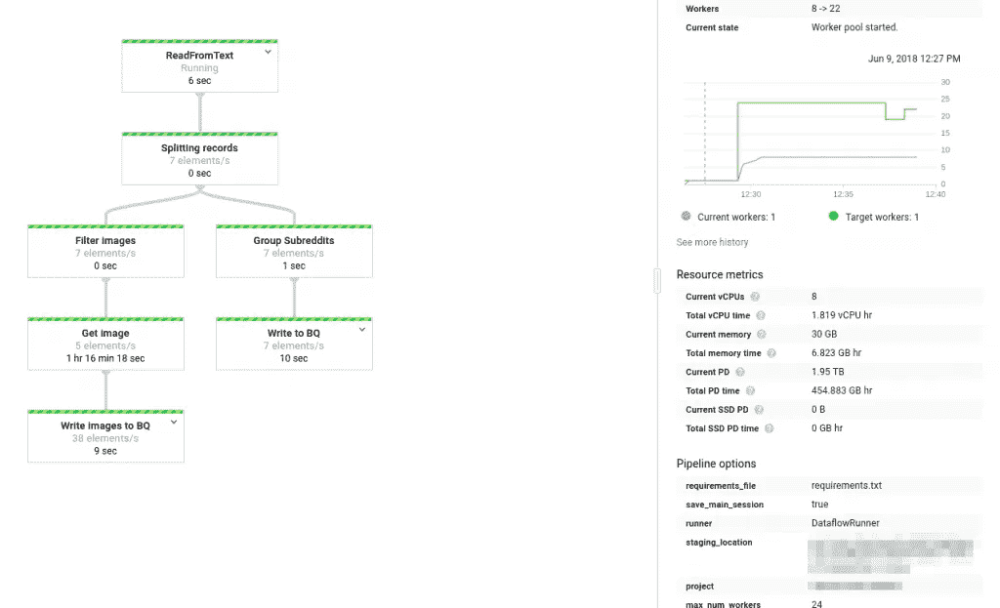

因为这条管道是用 Python 编写的，所以没有什么可以阻止我们在本地 Hadoop 集群、AWS EMR 上运行*完全相同的作业*，或者只是使用`DirectRunner`在本地运行它。这种水平的可移植性，结合我碰巧发现比`Spark`更精简的编程模型，使得`Beam`成为一个非常有趣的框架。

实际上，我们将在本文的示例部分中这样做，并设计一个管道，用`Python`和`go`编写它，并在不同的`Runners`上运行它。

# 核心概念

`Beam`中的一切都始于`Pipeline.``Beam`编程模型的工作原理是通过代码暴露高级抽象，允许您的`Pipeline`在给定数据集上执行`PTransforms`的图形，这在术语上是在不可变集合上操作，称为`PCollections`，可以通过`IO`操作将其移动到持久状态。作业可以在不同的`Runners`上执行，以提供一个(分布式)执行环境。

在我们看一个真实世界的例子之前，让我们深入研究一下这些概念。

> *这是一个浓缩版的* [*官方阿帕奇光束文档*](https://beam.apache.org/documentation/programming-guide/) *，建议你完整阅读以获得更深入的观点*

# 管道

一个`Pipeline`对象是任何作业的起点，它通常由一个`configuration`对象初始化，该对象定义了*如何*和*你的管道在哪里*运行。

# p 收藏

与 Spark `RDD`或`DataFrame`不同的是，`PCollection`是不可变的数据集合，可以通过管道的生命周期在内存中修改。

一个`PCollection`中的数据可以是任意类型，只要元素可以被编码为`string`以便在工人之间序列化它们。

可以是任意大小的，但是如果集合太大而不适合单个工作节点上的内存，它们的元素可能由不同的工作节点处理。此外，它们可以是*有界的*(即，具有固定的大小)或者是*无界的*(即，是“开放式的”，就像在流场景中一样)。

# 转换

`Transforms`通过`apply`运算用户代码和逻辑，在`PCollection`的单个元素上应用逻辑，并返回可在后续步骤中使用的完整的`PCollection`。

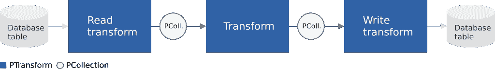

[https://beam . Apache . org/documentation/programming-guide/# applying-transforms](https://beam.apache.org/documentation/programming-guide/#applying-transforms)

还可以通过将 DAG 分成多个独立的步骤来`branch`流水线:

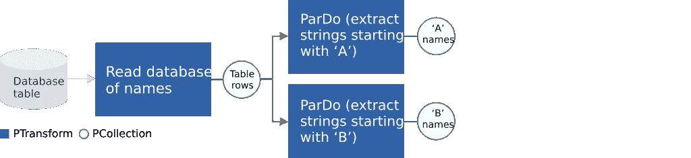

[https://beam . Apache . org/documentation/programming-guide/# applying-transforms](https://beam.apache.org/documentation/programming-guide/#applying-transforms)

自定义`transforms`需要遵守一些规则，最显著的是**可串行化**(因为数据需要在工作线程之间传输)**单线程执行**(因为每个元素都应该在自己的线程中工作，由底层运行器协调)，以及**等幂**(因为可能会发生重试)。

`Beam`提供了几个可以开箱即用的内核`transforms`:

*   `ParDo`
*   `GroupByKey`
*   `CoGroupByKey`
*   `Combine`
*   `Flatten`
*   `Partition`

## 帕尔多

`ParDo`转换可能是最常见的一种，因为它类似于`map`操作:将逻辑应用于`PCollection`的每个元素，并返回所述元素(或者不返回它，因此，`filtering`返回集合)。

将`ParDo`作为构建博客的基础，在平面数据流上应用逻辑，然后可以通过`grouping`、`flattening`和其他聚合逻辑进一步增强。

为了理解一个`ParDo`实际上做什么，`Beam`文档对一个`ParDo`的生命周期提供了很好的解释:

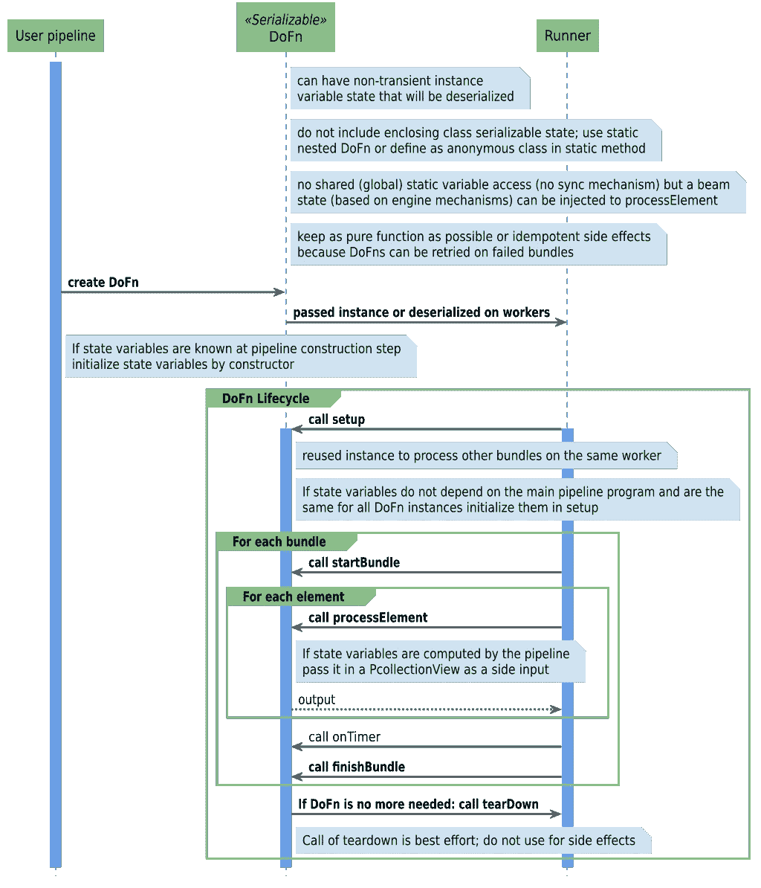

[https://beam . Apache . org/documentation/programming-guide/# applying-transforms](https://beam.apache.org/documentation/programming-guide/#applying-transforms)

## CoGroupByKey

`CoGroupByKey`通过多个输入集合中的键聚集所有输入元素。CoGroupByKey 执行两个或更多具有相同键类型的键/值 p 集合的关系连接——这是一个非常有用的东西，我们将在下面的例子中使用。

# 计划

一个`Schema`定义了一个`PCollection`中元素的逻辑结构和数据类型。`Beam Schemas`类似于`parquet`或`database`模式，应该定义`names`、`types`，以及关于字段是否可以是`NULL`的信息。

Beam 支持以下基本类型:

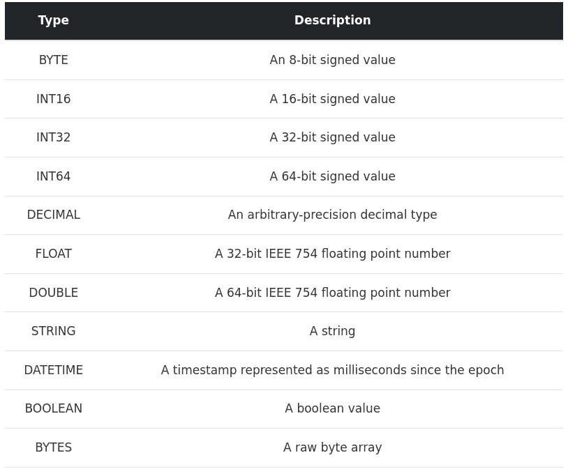

[https://CHOL linger . com/blog/2020/07/a-data-engineering-perspective-on-go-vs .-python-part-2-data flow/# schemas](https://chollinger.com/blog/2020/07/a-data-engineering-perspective-on-go-vs.-python-part-2-dataflow/#schemas)

# 输入－输出

`I/O`用于提供输入数据，并为管道提供一个或多个定义的输出。我将参考[第 1 部分](https://chollinger.com/blog/2020/06/a-data-engineering-perspective-on-go-vs.-python-part-1/#io)以获得 SDK 提供的所有`I/O`连接器的完整列表。

`I/O`还可以定制连接器，通过从现有基类继承来读取不支持的文件类型。这可能很有挑战性(因为您希望能够分割一个文件源，这样它就可以被多个工作人员处理)，但是过一会儿，这就变得非常简单了。

# 滑行装置

`Runners`定义哪个系统执行流水线，例如通过本地运行(`DirectRunner`)、在`Google Dataflow`上运行或通过`Apache Spark`。

与`I/O`类似，请参考[第 1 部分](https://chollinger.com/blog/2020/06/a-data-engineering-perspective-on-go-vs.-python-part-1/#runners)进行概述。

# 一个示例作业的用例

为了展示一些基本的区别，让我们定义一个可以在`Python`和`go`中实现的用例。

在这个例子中，我们遵循这个简单的用户故事:“作为一个*电影爱好者*，我想*找到符合我喜好的电影*，这样*我就可以看一部新电影了”*。

我们的*偏好*应为:

1.  我们希望解析标题和评级(*读取数据*)
2.  我们只对电影感兴趣，对电视剧不感兴趣；此外，电影应该在 1970 年之后制作，以获得一些更可靠的元数据作为我们决策的基础，因为旧的电影通常只有基本信息(*过滤数据*)
3.  我们既要基本标题，也要来自不同来源的评级信息(*组合数据*)
4.  我们想要可用格式的数据(*写数据* ) [0]

为此，我们将使用 [IMDb 数据集](https://www.imdb.com/interfaces/)，它可用于非商业用途，并且每天更新。

*完整的源代码可以在*[*GitHub*](https://github.com/chollinger93/beam-examples)*上获得。*

到现在为止，您可能已经知道这些“偏好”是为了展示各种 `*Beam*` *功能——这不是一个花哨的推荐引擎，我们并不真正关心输出*

# 绘制设计

正如我在引言中所说的，我们可以先从设计管道开始，然后再讨论特定于语言的逻辑。

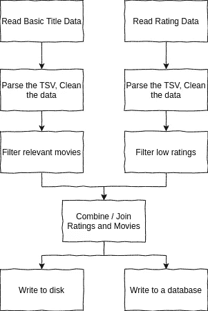

[https://CHOL linger . com/blog/2020/07/a-data-engineering-perspective-on-go-vs .-python-part-2-data flow/# drawing-the-design](https://chollinger.com/blog/2020/07/a-data-engineering-perspective-on-go-vs.-python-part-2-dataflow/#drawing-the-design)

这里我们有两个主要的流程，它们做类似的事情:它们读取数据，解析数据格式，并对数据应用自定义过滤器。接下来，它们被组合成一个一致的集合，并写入一个或多个 I/O 目标。

让我们来看看如何把它翻译成代码。

# 获取数据

如果你同意 IMDb 的许可证，你可以在这里找到数据。

我们将从基本的标题数据开始，并确保我们从一个小的测试集开始，这样我们就可以在没有集群的情况下进行本地开发。为了做到这一点，我们将获取随机测试数据，以及一部我们知道符合我们标准的电影，1971 年的经典“消失点”，id 为`tt0067927`(因为我们不太可能在我们将使用的 2 个数据集之间找到更多匹配，否则，鉴于体积)。

```
wget https://datasets.imdbws.com/title.basics.tsv.gz && gunzip title.basics.tsv.gz 
# Create a small test file
head -1 title.basics.tsv > title.basics.100.tsv
shuf -n 100 title.basics.tsv >> title.basics.100.tsv
grep "tt0067927" title.basics.tsv >> title.basics.100.tsv
```

## `title.basics`

该数据集包含基本标题信息，并且是一个 *564MB 制表符分隔文件*。

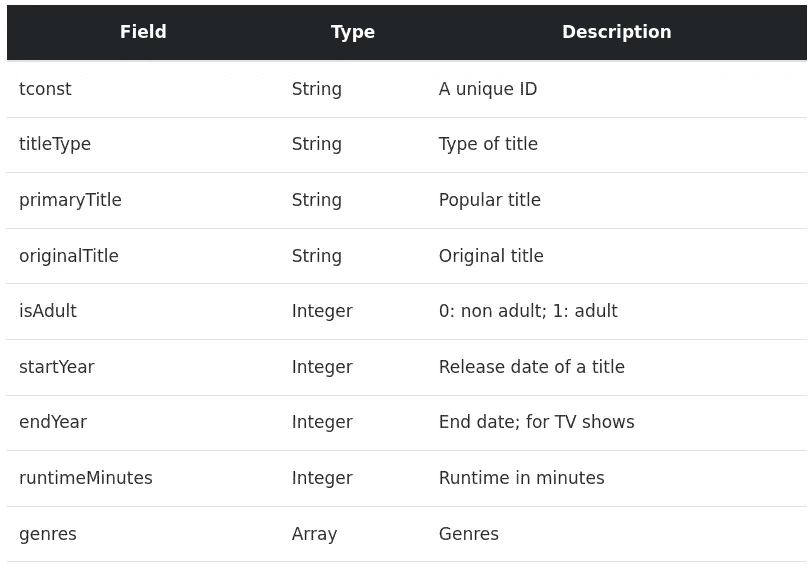

[https://CHOL linger . com/blog/2020/07/a-data-engineering-perspective-on-go-vs .-python-part-2-data flow/# getting-data](https://chollinger.com/blog/2020/07/a-data-engineering-perspective-on-go-vs.-python-part-2-dataflow/#getting-data)

我们将用它来过滤大部分记录。

## `title.ratings`

该数据集包含所有标题的评级，并且是一个 *18MB 制表符分隔文件*。

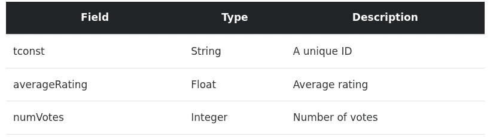

[https://CHOL linger . com/blog/2020/07/a-data-engineering-perspective-on-go-vs .-python-part-2-data flow/# getting-data](https://chollinger.com/blog/2020/07/a-data-engineering-perspective-on-go-vs.-python-part-2-dataflow/#getting-data)

# 创建管道

我们的 Beam 管道的第一步是创建一个创建`Pipeline`对象的框架代码，解析参数，并设置一个记录器。

# 计算机编程语言

我们首先需要通过运行`pip3 install --upgrade pip`和`pip3 install apache-beam==2.22.0 --upgrade`来安装 Beam。

我们的框架使用`Python`的标准`logger`模块来记录日志，使用`argparse`来读取将要传递给管道的参数。

```
from __future__ import absolute_import

import argparse
import logging
import apache_beam as beam
from apache_beam.io import ReadFromText
from apache_beam.io import WriteToText
from apache_beam.options.pipeline_options import PipelineOptions, GoogleCloudOptions
from apache_beam.options.pipeline_options import SetupOptions

def run(argv=None):
    # Parse arguments
    parser = argparse.ArgumentParser()
    parser.add_argument('--input-ratings',
                        dest='input_ratings',
                        required=True,
                        help='Input rating file to process.')
    parser.add_argument('--input-titles',
                        dest='input_titles',
                        required=True,
                        help='Input title file to process.')
    parser.add_argument('--output',
                        dest='output',
                        required=True,
                        help='Output to write results to.')
    known_args, pipeline_args = parser.parse_known_args(argv)

    pipeline_options = PipelineOptions(pipeline_args)
    pipeline_options.view_as(SetupOptions).save_main_session = True

    # Create the pipeline
    with beam.Pipeline(options=pipeline_options) as p:
        # TODO: Run it
        pass

if __name__ == '__main__':
    # Set the logger
    logging.getLogger().setLevel(logging.INFO)
    logging.basicConfig(format='%(asctime)s,%(msecs)d %(levelname)-8s [%(filename)s:%(lineno)d] %(message)s',
        datefmt='%Y-%m-%d:%H:%M:%S',
        level=logging.INFO)
    # Run the core pipeline
    logging.info('Starting')
    run()
```

这里没有太多需要注意的地方——我们所有的管道代码都在`with`块下，一旦我们编写了自己的步骤，它将定义我们刚刚设计的`DAG`。

# 去

对于`go`，我们可以通过`go get`安装`beam`，而不是通过`go get -u github.com/apache/beam/sdks/go/...`安装`pip`

接下来，我们的管道框架将使用`flags`包作为参数，使用`log`作为日志。

```
package main

import (
	"context"
	"flag"
	"log"

	"github.com/apache/beam/sdks/go/pkg/beam"
	"github.com/apache/beam/sdks/go/pkg/beam/io/textio"
	"github.com/apache/beam/sdks/go/pkg/beam/x/beamx"
)

func main() {
	// Define arguments
	var inputBasePath = flag.String("input-basics", "", "Input base file")
	var inputRatingsPath = flag.String("input-ratings", "", "Input ratings file")
	var outputPath = flag.String("output", "", "Output path")
	// Parse flags
	flag.Parse()

	// Initialize Beam
	beam.Init()

	// Input validation. Must be after Init().
	if *inputBasePath == "" || *inputRatingsPath == "" || *outputPath == "" {
		log.Fatal("Usage: movie_pipeline --input-basics $PATH, --input-ratings $PATH --output $PATH")
	}

	// Create a Pipeline
	p := beam.NewPipeline()
	s := p.Root()

    // Pipeline code

	// Concept #1: The beamx.Run convenience wrapper allows a number of
	// pre-defined runners to be used via the --runner flag.
	if err := beamx.Run(context.Background(), p); err != nil {
		log.Fatalf("Failed to execute job: %v", err)
	}
}
```

这里有几个值得注意的地方。首先，`flags`包不支持强制属性，因此我们必须手动检查由`flag.Parse()`传递的字符串指针。你会在整个代码中发现类似的块，因为`go`不知道`Exception`的概念，因此，错误是返回元素(例如，一个函数可能返回一个数据元组和一个可选错误)，需要手动检查。

此外，注意如何在输入验证之前调用`beam.Init()`。

# 读取和解析数据

接下来，我们需要读取数据并解析`TSV`格式。我们可以使用我们的第一个`ParDo`调用来实现这一点。

# 计算机编程语言

首先，让我们通过创建`beam.DoFn`的子类来定义`ParDo`操作，如下所示:

```
class ParseCsv(beam.DoFn):
    def __init__(self, col_names: list):
        self.col_names = col_names

    def process(self, string: str):
        reader = csv.DictReader(string.splitlines(), fieldnames=self.col_names, delimiter='\t')
        for row in reader:
            yield row
```

这个类将简单地把我们的 CSV 从行`str`解析成一个`dict`，给我们`dict`作为单独的元素在下一个`transforms`中使用。

对于自定义`ParDo`，方法`process`必须被覆盖。`process`应该是一个`generator`并因此，不得不`yield`单独记录。对于 `*PCollection*`中的每条记录，该函数将被调用*。如果我们用`return`代替`yield`，你马上就会看到会发生什么。*

自定义参数可以通过覆盖`__init__()`中的`constructor`传递给类。

为了将它与管道集成，我们需要定义流程。在`Beam Python SDK`中，`>>`和`|`操作符在`PCollection`之上定义了我们单独的加工(`apply`)步骤。

对于每个步骤，我们可以调用`beam.ParDo`并提供一个`DoFn`子类的实例。

```
with beam.Pipeline(options=pipeline_options) as p:
    (p  | 'Read data' >> beam.io.ReadFromText(known_args.input_titles, skip_header_lines=1)
        | 'Parse CSV' >> beam.ParDo(ParseCsv(['titleId', 'ordering','title','region','language','types','attributes','isOriginalTitle']))
        | 'Print' >> beam.Map(print)
    )
```

这将读取文本文件，解析`TSV`，产生一个`PCollection`，并使用`map`简单地打印值。

输出如下所示:

```
{'titleId': 'tt0000001', 'ordering': '1', 'title': 'Карменсіта', 'region': 'UA', 'language': '\\N', 'types': 'imdbDisplay', 'attributes': '\\N', 'isOriginalTitle': '0'}
{'titleId': 'tt0000001', 'ordering': '2', 'title': 'Carmencita', 'region': 'DE', 'language': '\\N', 'types': '\\N', 'attributes': 'literal title', 'isOriginalTitle': '0'}
```

这个简单的起点展示了`Beam`与`Python`一起使用的非常具体的语法。虽然它确实创建了一个清晰易读的逻辑，但它肯定比常规的方法链接方法更容易让人混淆。

# 去

在这里，我们可能会看到`Python`和`go`之间一些最显著的差异——但正如我所发现的，也有同样显著的相似之处。

读取数据并应用下一个`ParDo`并不遵循`Python`的重载语法(使用`>>`和`|`)*，而是导致在每个步骤*后返回各种 `*PCollections*` *:*

```
// Parse the movies file
	lines_movies := textio.Read(s, *inputBasePath)
	base_movies := beam.ParDo(s, &movieFn{}, lines_movies)
```

虽然这可能看起来与`Python`非常不同，但从根本上来说，发生了同样的事情:图形的每一步都返回一个*新的* `*PCollection*`，下一步可以对其进行处理。

这里要提到的另一件事是指针的使用。`*inputBasePath`是指向我们之前给出的`flags`参数的指针。在`go`中，一个`*string`可以是`nil`，而普通的字符串则不能(因为`go`中的`nil`表示“它不指向任何东西”，而`string`只能是空的或者被字符填充——下面会详细介绍)。众所周知，`Python`没有暴露的指针(T21 的另一种主要语言`Java`也没有)。

下一个看起来非常不同的东西是实际的`ParDo`。我们来分析一下。

`Beam`的泛型`ParDo`函数签名如下:

```
func ParDo(s Scope, dofn interface{}, col PCollection, opts ...Option) PCollection {
	ret := MustN(TryParDo(s, dofn, col, opts...))
	if len(ret) != 1 {
		panic(formatParDoError(dofn, len(ret), 1))
	}
	return ret[0]
}
```

其中`s Scope`是你的`pipeline`对象，`dofn interface{}`使用`go`的`empty interface`逻辑来定义一个可能保存任何类型的值的接口(我一会儿再回到那个)，而`col`显然是我们的`PCollection`，类似于我们在`Python`中看到的。

这意味着`beam.ParDo(s, &movieFn{}, lines_movies)`简单地声明:应用函数`moveFn`，它必须是一个`ParDo`(记住:静态类型！)，并将名为`line_movies`的`PCollection`作为输入。

一旦理解了语法，这与

```
| 'Parse CSV' >> beam.ParDo(ParseCsv(['titleId', 'ordering','title','region','language','types','attributes','isOriginalTitle']))
```

在 Python 中。

我们将在下一节看看`&movieFn{}`做了什么。无论如何，在这一点上，我们有了输入`TSV`中每一行的结构化表示。

# 转换数据

接下来，我们需要转换我们的数据，以确保我们有可以在输出中使用的正确的数据类型，并确保我们在接下来的步骤中的`filter`逻辑是清晰的。

# 计算机编程语言

请注意上面输出中的`NULL`是如何被引用为`\N`的，以及`isOriginalTitle`听起来像是`boolean`，但实际上是`integer`。

我们可以简单地创建另一个`ParDo`转换来处理这个场景。为了避免每个文件只有一个`ParDo`类，我们将使它动态化。

```
class CleanData(beam.DoFn):
    def __init__(self, bool_cols=[]):
        self.bool_cols = bool_cols

    def process(self, record: dict):
        for k in record:
            # Map \N to None
            if record[k] == '\\N':
                record[k] = None
        # Convert e.g., `isOriginalTitle` to Boolean
        for col in self.bool_cols:
            if record[col] == '0': 
                record[col] = False
            else:
                record[col] = True
        # Return
        yield record
```

因为`Python` `dicts`可以接受任意类型，所以简单地在 dict 中改变值是很容易的。请注意我们必须如何将`0`视为`string`，因为`Python`是动态类型的，在这里不强制类型，并且给定 TSV 输入，一切都是`str`。

此时，您可能会发现自己处于两种思想流派之一:要么，您很高兴`Python`允许您使用`dicts`编写管道，而不关心它们各自的类型(甚至不关心`dict`中字段的数量或名称)！)——这使得编写管道更加容易。

或者，你遗漏了`Java`和`go`强制的严格打字。在这两种情况下，在将任何数据持久化到任何地方之前，我们都被迫关心结构和类型，以避免无效的转换或错误的输出到我们的目标系统中。

# 去

对于`go`，让我们重温一下之前的`&movieFn{}`论点。

我们已经创建了一个名为`moveFn`的`struct`，它保存了我们的数据结构及其类型:

```
type movieFn struct {
	tconst, titleType, primaryTitle, originalTitle string
	isAdult                                        bool
	startYear, endYear, runtimeMinutes             int64
	genres                                         string
}
```

然后我们在这个`struct`上定义一个`ParDo`方法:

```
func (f *movieFn) ProcessElement(line string, emit func(movieFn)) {
	row := strings.Split(line, "\t")
	fmt.Printf("%v\n", row)
	// Skip the header
	if row[0] != "tconst" {
		// Map nulls

		// Convert the types
		startYear, err1 := strconv.ParseInt(row[5], 10, 64)
		endYear, _ := strconv.ParseInt(row[6], 10, 64)
		runtimeMinutes, err3 := strconv.ParseInt(row[7], 10, 64)
		// Convert Boolean
		isAdultInt, err4 := strconv.ParseInt(row[4], 10, 64)
		var isAdult bool
		if isAdultInt == 0 {
			isAdult = false
		} else {
			isAdult = true
		}
		if err1 == nil && err3 == nil && err4 == nil {
			// If the types match, return a rating struct
			m := movieFn{
				tconst:         row[0],
				titleType:      row[1],
				primaryTitle:   row[2],
				originalTitle:  row[3],
				isAdult:        isAdult,
				startYear:      startYear,
				endYear:        endYear,
				runtimeMinutes: runtimeMinutes,
				genres:         row[8],
			}
			fmt.Printf("%v\n", m)
			emit(m)
		}
	}
}
```

它将解析行和将类型转换成单个的`ParDo`结合起来。我们在 Python 中对此进行了分解以解释概念，但从根本上来说，发生了同样的事情:我们需要通过分隔符`tab`来分割行，并创建一个类似`json`的结构(这就是这个`struct`将在内部序列化的内容！).

为了避免不得不处理多个`structs`，因为我们(与 Python 相反)不能简单地“重用`dict`和改变类型【0】，我们在一个单一的步骤中进行转换。

在对`ParDo`的实际调用中，`&movieFn{}`简单地翻译为“对`movieFn`结构的内存位置的引用，它被初始化为空”。

最后但同样重要的是，注意函数的返回是怎样的`emit func(movieFn))`。`Beam` SDK 使用反射从传入和传出的`PCollections`中收集类型，在我们的例子中，输入为`line string`，输出为`movieFn`——通过指定一个函数作为*输入*，我们称之为类似于`Python`的本机`yield`。请注意实际的函数*没有返回任何东西*，因为`emit`函数是我们的`ParDo`的一个参数！

您可以将这个函数称为任何东西— `emit`只是在 [go 示例](https://github.com/apache/beam/tree/master/sdks/go/examples)中找到的样式。

应该注意的是，这个`struct`当然也可以通过简单地提供更多的方法来保存自定义方法(类似于`Python`类)。

让我们重新访问一下`string`和`nil`注释，并尝试将`'\N'`转换为`nil`以匹配我们的`Python`管道，假设我们想要一个`NULL`类型用于将数据写入例如`BigQuery`:

```
func (f *movieFn) CleanNulls(row []string, nullColIds []int) []string {
	for i, _ := range row {
		if row[i] == "\\N" {
			row[i] = nil
		}
	}
	return row
}
```

当然，编译器不接受:

```
cannot use nil as type string in assignment
```

一种解决方法是使用`*string`或者跟随，例如`[bigquery->InterSchema](https://godoc.org/cloud.google.com/go/bigquery#InferSchema)`将`NULL`映射到期望它用于字符串的系统。

此外，我们需要确保我们不会意外地导出这个方法，否则，我们将得到:

```
graph.AsDoFn: unexpected exported method CleanNulls present. Valid methods are: [Setup StartBundle ProcessElement FinishBundle Teardown CreateInitialRestriction SplitRestriction RestrictionSize CreateTracker
```

这可以通过以小写字母“c”开始函数而简单地不导出它来解决:

```
func (f *movieFn) cleanNulls(row []string) []string {
	for i, _ := range row {
		if row[i] == "\\N" {
			row[i] = ""
		}
	}
	return row
}
```

这是与`Python`的另一个区别，因为`go`确保我们遵循预期的`interface`。

虽然我个人确实认为逻辑`go`强加了一个`String`要么为空要么不为空，拥有两个不同的“空”类型并没有增加多少价值，但是从`Python`或`Java`的角度来看，我可以看到这对来自`go`的人来说是非常令人不快的。

我想我们可以用一个 `*interface{}*`

# 过滤数据

接下来，我们要过滤数据，以确保我们只获得我们想要的电影和收视率。

# 计算机编程语言

过滤数据可以通过使用另一个`ParDo`类来完成，但是带有一个 catch。让我们试试这个:

```
class FilterBasicData(beam.DoFn):
    def process(self, record: dict):
        if record['titleType'] == 'movie' and not record['isAdult']:
            yield record
        else:
            yield None
```

输出看起来很糟糕:

```
None
{'tconst': 'tt3080844', 'titleType': 'movie', 'primaryTitle': 'Almost Holy', 'originalTitle': 'Crocodile Gennadiy', 'isAdult': False, 'startYear': '2015', 'endYear': None, 'runtimeMinutes': '96', 'genres': 'Biography,Documentary,Drama'}
None
```

然而，如果我们回忆起`DoFn`是一个生成器(而不仅仅是一个出于某种原因使用`yield`而不是`return`的方法)，我们可以快速使用它，简单地让*不返回无效记录*(以及添加我们的其他过滤标准)，从而创建一个更小的`PCollection`来处理:

```
class FilterBasicData(beam.DoFn):
    def process(self, record: dict):
        if record['titleType'] == 'movie' and not record['isAdult']: 
            yield record
        # No else - no yield
```

并获得看起来不错的输出:

```
{'tconst': 'tt3080844', 'titleType': 'movie', 'primaryTitle': 'Almost Holy', 'originalTitle': 'Crocodile Gennadiy', 'isAdult': False, 'startYear': '2015', 'endYear': None, 'runtimeMinutes': '96', 'genres': 'Biography,Documentary,Drama'}
{'tconst': 'tt7497202', 'titleType': 'movie', 'primaryTitle': 'Wonderful Losers: A Different World', 'originalTitle': 'Wonderful Losers: A Different World', 'isAdult': False, 'startYear': '2017', 'endYear': None, 'runtimeMinutes': '71', 'genres': None}
```

但是我们的按年过滤呢？如果我们尝试把`and record['startYear'] >= 1970:`作为一个条件，我们会遇到:

```
TypeError: '>=' not supported between instances of 'str' and 'int' [while running 'Filter data']
```

因为 Python 缺乏严格的类型(还记得我们是如何在任何地方都没有定义模式的)。我们可以通过扩展`CleanData`来修复这个问题:

```
class CleanData(beam.DoFn):
    def __init__(self, bool_cols=[], int_cols=[]):
        self.bool_cols = bool_cols
        self.int_cols = int_cols

    def process(self, record: dict):
        for k in record:
            # Map \N to None
            if record[k] == '\\N':
                record[k] = None
        # Convert e.g., `isOriginalTitle` to Boolean
        for col in self.bool_cols:
            if record[col] == '0':
                record[col] = False
            else:
                record[col] = True
        # Force-parse numeric values
        for col in self.int_cols:
            if record[col] and record[col].isdigit():
                record[col] = int(record[col])
        # Return
        yield record
```

并将我们的过滤器调整为:

```
class FilterBasicData(beam.DoFn):
    def process(self, record: dict):
        if record['titleType'] == 'movie' and not record['isAdult'] and record['startYear'] and record['startYear'] >= 1970:
            yield record
        # No else - no yield
```

这给了我们一个电影列表。

# 去

这里的过滤和`go`没有太大区别。我们可以犯和在`Python`中一样的错误，但是混淆`return`和(在本例中)一个`emit`函数:

```
// Filters Movies
func filterMovies(movie movieFn) movieFn {
	if !movie.isAdult && movie.startYear >= 1970 {
		return movie
	}
	return movieFn{}
}
```

它会回来的

```
{    false 0 0 0 }
{tt3080844 movie Almost Holy Crocodile Gennadiy false 2015 0 96 Biography,Documentary,Drama}
{    false 0 0 0 }
```

而我们在上一节中讨论的方法是可行的:

```
// Filters Movies
func filterMovies(movie movieFn, emit func(movieFn)) {
	if !movie.isAdult && movie.startYear >= 1970 {
		emit(movie)
	}
}
```

请注意我们的静态类型的`struct`不会有任何`TypeError: '>=' not supported between instances of 'str' and 'int'`类型的问题

# 侧面输入、CoGroupByKey 和连接

由于`IMDb`数据的关系性质，我们将不得不处理多个文件来获得我们需要的所有标准。

有两种主要的方法可以做到这一点:`Side Inputs`，如果数据足够小，可以轻松地放入内存，或者`CoGroupByKey`，这是一种更昂贵的变体，会导致`shuffle`。

尽管我们只需要一种方法，但我们将两者都考虑。

让我们获取评级数据，并从上面的输出中抓取一些记录，以确保我们至少有一个匹配:

```
wget https://datasets.imdbws.com/title.ratings.tsv.gz && gunzip title.ratings.tsv.gz 
# Create a small test file
head -1 title.ratings.tsv > title.ratings.100.tsv # header
shuf -n 100 title.ratings.tsv >> title.ratings.100.tsv
grep "tt0067927" title.ratings.tsv >> title.ratings.100.tsv
```

# CoGroupByKey

首先我们来看看`CoGroupByKey`。这通常是更明智的选择，除非其中一个数据集的大小要小得多，并且可以作为内存中的数据传递`Side Input`。

# 计算机编程语言

我们可以简单地分割我们的管道，这一次，返回一个`PCollection`而不是将它传递给`beam.Map(print)`。

```
with beam.Pipeline(options=pipeline_options) as p:
        basic_data = (p | 'Read data' >> beam.io.ReadFromText(known_args.input_basics, skip_header_lines=1)
           | 'Parse CSV' >> beam.ParDo(ParseCsv(columns_title_basic))
           | 'Clean data' >> beam.ParDo(CleanData(bool_cols=['isAdult'], int_cols=['startYear', 'endYear', 'runtimeMinutes']))
           | 'Filter data' >> beam.ParDo(FilterBasicData())
         )
```

由于`side inputs`不是`PCollections`，我们可以使用`Map`将`ratings`转换为静态的`json`:

```
rating_data = (p | 'Read data (Details)' >> beam.io.ReadFromText(known_args.input_ratings, skip_header_lines=1)
           | 'Parse CSV (Details)' >> beam.ParDo(ParseCsv(columns_ratings))
           | 'Clean data (Details)' >> beam.ParDo(CleanData(int_cols=['numVotes'], float_cols=['averageRating']))
           | 'Filter data (Details)' >> beam.ParDo(FilterRatingData())
         )

        rating_data = (p | 'Read data (Details)' >> beam.io.ReadFromText(known_args.input_ratings, skip_header_lines=1)
           | 'Parse CSV (Details)' >> beam.ParDo(ParseCsv(columns_ratings))
           | 'Clean data (Details)' >> beam.ParDo(CleanData(int_cols=['numVotes'], float_cols=['averageRating']))
           | 'Filter data (Details)' >> beam.ParDo(FilterRatingData())
         )
```

一旦我们都有了`PCollections`，我们就可以为`CoGroupByKey`准备数据:

```
# Create keys
        movie_keys = (basic_data
               | 'movie key' >> beam.Map(lambda r: (r['tconst'], r))
               #| 'Print' >> beam.Map(print)
        )
        rating_keys = (rating_data
               | 'rating key' >> beam.Map(lambda r: (r['tconst'], r))
        )
```

最后，应用`CoGroupByKey`变换和`FlatMap`它们在一起:

```
joined_dicts = (
            {'movie_keys': movie_keys, 'rating_keys': rating_keys} 
            | beam.CoGroupByKey()    
            | beam.FlatMap(join_ratings)
            | 'mergedicts' >> beam.Map(lambda dd: {**dd[0], **dd[1]})
            | 'Print' >> beam.Map(print)
        )
```

产生一条记录(我们随机选择输入):

```
{'tconst': 'tt0067927', 'titleType': 'movie', 'primaryTitle': 'Vanishing Point', 'originalTitle': 'Vanishing Point', 'isAdult': False, 'startYear': 1971, 'endYear': None, 'runtimeMinutes': 99, 'genres': 'Action,Crime,Thriller', 'averageRating': 7.2, 'numVotes': 25933}
```

# 去

你会注意到缺少这些“高级”主题的例子，比如`CoGroupByKey`，尽管它们实际上存在于 [godocs](https://godoc.org/github.com/apache/beam/sdks/go/pkg/beam#CoGroupByKey) 中。因此，弄清楚这一部分花费的时间比我希望的要长一些，但是一旦理解了其中的逻辑，这是有意义的。

为了使用`CoGroupByKey`，我们需要为每个`PCollection`创建一个`KV`对:

```
func extractRatingId(r ratingFn) (string, ratingFn) {
	return r.tconst, r
}

func extractMovieId(m movieFn) (string, movieFn) {
	return m.tconst, m
}
```

改变我们的产品系列:

```
// Combine
	combined := beam.CoGroupByKey(s,
		beam.ParDo(s, extractMovieId, filtered_movies),
		beam.ParDo(s, extractRatingId, filtered_ratings))
```

并按如下方式匹配它们:

```
func combineFn(tconst string, movieIter func(*movieFn) bool, ratingIter func(*ratingFn) bool, emit func(targetMovie)) {
	// Pointers to structs
	m := &movieFn{tconst: tconst}
	r := &ratingFn{tconst: tconst}
	// If match, emit
	if movieIter(m) && ratingIter(r) {
		fmt.Printf("%v %v\n", tconst, m)
		emit(targetMovie{
			Id:             m.tconst,
			TitleType:      m.titleType,
			PrimaryTitle:   m.primaryTitle,
			OriginalTitle:  m.originalTitle,
			IsAdult:        m.isAdult,
			StartYear:      m.startYear,
			EndYear:        m.endYear,
			RuntimeMinutes: m.runtimeMinutes,
			Genres:         m.genres,
			AverageRating:  r.averageRating,
			NumVotes:       r.numVotes,
		})
	}
}
```

注意`func(*movieFn) bool`，期待一个指向`struct`的指针，它将告诉我们是否有匹配。

# 侧面输入

`Side Inputs`比它们在`go`中看起来要复杂得多，但在`Python`中相对简单。

# 计算机编程语言

如果我们想使用`Side Inputs`，我们可以将我们更小的`ratings` `PCollection`作为`list`:

```
joined_dicts = (
        basic_data
        | 'Join' >> beam.ParDo(JoinRatings(), AsList(rating_data))
    )
```

到新的`ParDo`:

```
class JoinRatings(beam.DoFn):
    def process(self, movie: dict, ratings_side):
        for k in ratings_side:
            if k['tconst'] == movie['tconst']:
                yield {**movie, **k}
```

或者用`AsDict`调用[0]:

```
class JoinRatings(beam.DoFn):
    def process(self, movie: dict, ratings_side):
        if 'tconst' in movie and movie['tconst'] in ratings_side:
            yield {**movie, **ratings_side[movie['tconst']]}
```

并得到相同的结果，这次使用侧面输入。

*【0】一个* `*dict*` *在这里会比一个列表高效很多；不过据我看，* `*go*` *SDK 并不支持 SideInputs 作为*`*map*`*；因此，我用* `*lists*` *和* `*maps*` */* `*dicts*` *实现了* `*Python*` *和*`*SideInputs*`*。***

# *去*

*我们将在`SideInput`这里强调我在`Python`部分指出的可能性。*

*首先，我们需要另一个结构作为我们的输出结构:*

```
*type targetMovie struct {
	Id             string
	TitleType      string
	PrimaryTitle   string
	OriginalTitle  string
	IsAdult        bool
	StartYear      int64
	EndYear        int64
	RuntimeMinutes int64
	Genres         string
	// Ratings
	AverageRating float64
	NumVotes      int64
}*
```

*注意这些值是从[导出的](https://golang.org/ref/spec#Exported_identifiers)，即以大写字母开始。*

*我们简单地定义了一个`combine`类型的函数，它需要一个`slice`或`ratingFn`，而不是一个`PCollection`:*

```
*func combineMoviesRatings(movie movieFn, ratings []ratingFn, emit func(targetMovie)) {
	for _, r := range ratings {
		if r.tconst == movie.tconst {
			emit(targetMovie{
				Id:             movie.tconst,
				TitleType:      movie.titleType,
				PrimaryTitle:   movie.primaryTitle,
				OriginalTitle:  movie.originalTitle,
				IsAdult:        movie.isAdult,
				StartYear:      movie.startYear,
				EndYear:        movie.endYear,
				RuntimeMinutes: movie.runtimeMinutes,
				Genres:         movie.genres,
				AverageRating:  r.averageRating,
				NumVotes:       r.numVotes,
			})
		}
	}
}*
```

*并且用`Side Input`这样称呼它:*

```
*combined := beam.ParDo(s, combineMoviesRatings, filtered_movies,
		beam.SideInput{Input: filtered_ratings})*
```

*这样，我们得到了相同的输出:*

```
*{"Id":"tt0067927","TitleType":"movie","PrimaryTitle":"Vanishing Point","OriginalTitle":"Vanishing Point","IsAdult":false,"StartYear":1971,"EndYear":0,"RuntimeMinutes":99,"Genres":"Action,Crime,Thriller","AverageRating":7.2,"NumVotes":25933}*
```

*类似于我们在`Python`中看到的，做 n 次这个列表比较，我们得到 O(n*n)并且*会非常*无效。*

*由于我仍然不知道`go` SDK 是否有一个等同于`Python`的`apache_beam.pvalue.AsDict`，我想出了这个可怕的变通方法，将一个`PCollection`作为单例侧输入传递给一个`ParDo`，并创建一个`map[string]ratingFn`:*

```
*func makeRatingsMap(rr int, ratings []ratingFn, emit func(map[string]ratingFn)) {
	m := make(map[string]ratingFn)
	for _, r := range ratings {
		m[r.tconst] = r
	}
	emit(m)
}

func combineMoviesRatings(movie movieFn, ratings map[string]ratingFn, emit func(targetMovie)) {
	r, ok := ratings[movie.tconst]
	if ok {
		emit(targetMovie{
			Id:             movie.tconst,
			TitleType:      movie.titleType,
			PrimaryTitle:   movie.primaryTitle,
			OriginalTitle:  movie.originalTitle,
			IsAdult:        movie.isAdult,
			StartYear:      movie.startYear,
			EndYear:        movie.endYear,
			RuntimeMinutes: movie.runtimeMinutes,
			Genres:         movie.genres,
			AverageRating:  r.averageRating,
			NumVotes:       r.numVotes,
		})
	}
}*
```

*我们称之为:*

```
*// Fake PCollection to only run the next parDo once
	fakePCol := beam.CreateList(s, [1]int{
		0,
	})
	// To Map
	filteredRatingsMap := beam.ParDo(s, makeRatingsMap, fakePCol, beam.SideInput{Input: filtered_ratings})
	// And match
	combined := beam.ParDo(s, combineMoviesRatings, filtered_movies,
		beam.SideInput{Input: filteredRatingsMap})*
```

*虽然这可能属于“如果它有效，它就不愚蠢！”，我们将在后面的章节中查看在尝试使用`Dataflow`时导致的许多问题——不过，请注意，这段代码确实可以在`DirectRunner`上工作。*

# *输入－输出*

*最后，让我们写我们的数据。我们将首先关注写入磁盘。*

# *计算机编程语言*

*在`Python`中，一个简单的调用将创建一个`txt`文件，包含上面的`json`:*

```
*joined_dicts | 'write' >> beam.io.WriteToText('./movies.txt')*
```

# *去*

*`Go`在这方面也非常相似——然而，我们必须将`struct`“编码”为内联`ParDo`中的`JSON`:*

```
*combinedString := beam.ParDo(s, func(v targetMovie) string {
		j, _ := json.Marshal(v)
		return fmt.Sprintf(string(j))
	}, combined)
	// Write
	textio.Write(s, *output, combinedString)*
```

# *DirectRunner(本地)*

*让我们快速运行并讨论一下性能。上次，在我们的`Mandelbrot`基准测试中，`go`几乎比`Python`快了 45 倍。让我们看看`Beam`是如何支撑的。*

*在`DirectRunner`上比较性能几乎是毫无意义的，因为这个运行器是为本地调试和开发而设计的，而不是生产使用。*

# *标杆管理*

*也就是说，我确实运行了一些基准测试，比较了分别使用`Side Inputs`和`lists`或`dicts` / `maps`的`go`和`Python`，以及使用三个不同测试数据集的`CoGroupByKey`:100 条记录@ 9KB、100，000 条记录@ 9MB 和 1M 条记录@ 100MB。*

*先看各种`Side Inputs`:*

*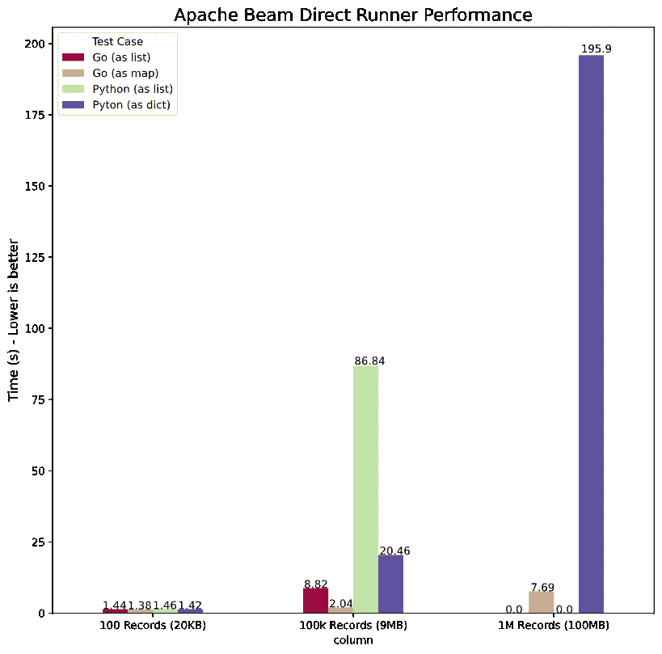*

*[https://CHOL linger . com/blog/2020/07/a-data-engineering-perspective-on-go-vs .-python-part-2-data flow/# direct runner-locally](https://chollinger.com/blog/2020/07/a-data-engineering-perspective-on-go-vs.-python-part-2-dataflow/#directrunner-locally)*

*这里的速度明显更快，但这是意料之中的，因为它本质上是单线程运行的。使用`lists`作为辅助输入要慢得多，以至于我已经放弃了在 1M 记录上运行`go`和`Python`的`as list`用例。*

*现在，对于`CoGroupByKey`:*

*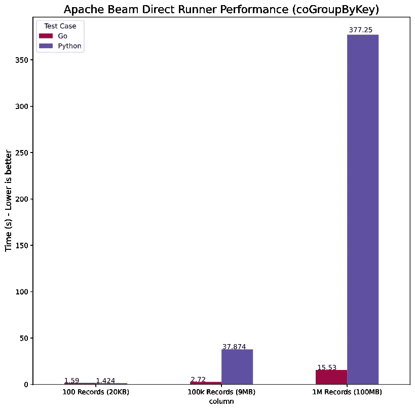*

*[https://CHOL linger . com/blog/2020/07/a-data-engineering-perspective-on-go-vs .-python-part-2-data flow/# direct runner-locally](https://chollinger.com/blog/2020/07/a-data-engineering-perspective-on-go-vs.-python-part-2-dataflow/#directrunner-locally)*

*我们看到一个非常相似的趋势，即`go`快了几个数量级。印象深刻！*

# *推荐工作*

*我还用`DirectRunner`上的`title.basics`数据对`wordcount`例子进行了基准测试，以确保我不会因为无意中编写了根本不同的代码而将苹果和橙子进行比较。*

*我在`go`中是这样做的:*

```
*go install github.com/apache/beam/sdks/go/examples/wordcount
time wordcount --input ~/workspace/beam-examples/data/title.basics.tsv --output countsgo.txt*
```

*和`python`:*

```
*time python3 -m apache_beam.examples.wordcount --input ~/workspace/beam-examples/data/title.basics.tsv --output wordcountpy.txt # without multiple workers*
```

*产生了:*

*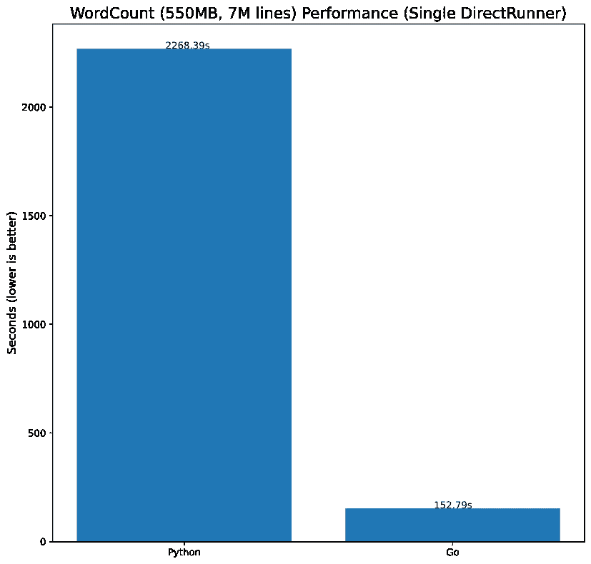*

*[https://CHOL linger . com/blog/2020/07/a-data-engineering-perspective-on-go-vs .-python-part-2-data flow/# a-reference-job](https://chollinger.com/blog/2020/07/a-data-engineering-perspective-on-go-vs.-python-part-2-dataflow/#a-reference-job)*

*这确实符合我们的观察，即`Beam`和`go`仍然比`Python`快一点。*

# *数据流(谷歌云)*

*现在，在外部运行程序上运行这个程序只给我们留下了一个选项(因为`go`不支持其他运行程序)，即`Google Cloud`的`Dataflow`。我应该补充一下，`go`的`Dataflow`仍然在版本`0.5`中，还没有得到官方支持。*

*确保您拥有:*

1.  *谷歌云项目*
2.  *启用计费(或自由级合格帐户)*
3.  *数据流 API 已启用*
4.  *`gcloud sdk`已安装，已运行`gcloud init`和`gcloud auth login`*
5.  *`GOOGLE_APPLICATION_CREDENTIALS`被设定*
6.  *如果你在谷歌上看到这篇文章，确保克里斯蒂安获得更多免费学分*(可选步骤)**

# *计算机编程语言*

*对于`Python`，我们需要使用经过认证的`gcloud sdk`来运行它:*

```
*pip3 install --upgrade "apache-beam[gcp]"
python3 movie_pipeline.py --input-basics "${BUCKET}/title.basics.tsv" \
    --input-ratings "${BUCKET}/title.ratings.tsv" \
    --output "${BUCKET}/out" \
    --runner dataflow \
    --project "${PROJECT}" \
    --region "${REGION}" \
    --temp_location "${BUCKET}/tmp/" \
    --staging_location "${BUCKET}/binaries/" #\
    #--num_workers 4*
```

*但是，它将在`Python 3.8`失败，原因是*

```
*Exception: Dataflow only supports Python versions 2 and 3.5+, got: (3, 8)*
```

*所以这里用一个旧版本的`Python`，`3.7`效果很好。*

*当作业运行时，它看起来像这样:*

*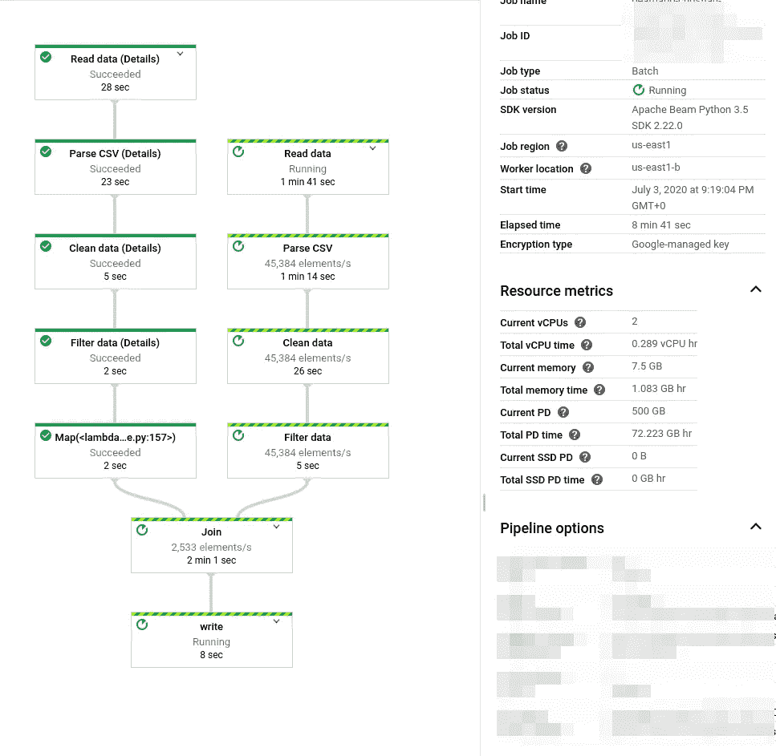*

*[https://CHOL linger . com/blog/2020/07/a-data-engineering-perspective-on-go-vs .-python-part-2-data flow/# data flow-Google-cloud](https://chollinger.com/blog/2020/07/a-data-engineering-perspective-on-go-vs.-python-part-2-dataflow/#dataflow-google-cloud)*

*一旦完成，就像这样:*

*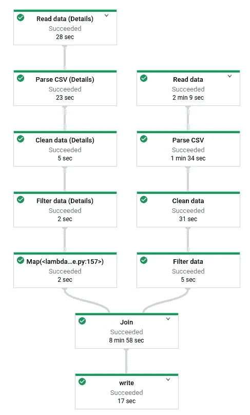*

*[https://CHOL linger . com/blog/2020/07/a-data-engineering-perspective-on-go-vs .-python-part-2-data flow/# data flow-Google-cloud](https://chollinger.com/blog/2020/07/a-data-engineering-perspective-on-go-vs.-python-part-2-dataflow/#dataflow-google-cloud)*

# *Go 数据流*

**本节将带您了解整个探索和开发过程，包括一些死胡同，以说明我所面临的一些挑战。如果你对解决方案感兴趣，跳到* [*最后一节*](https://chollinger.com/blog/2020/07/a-data-engineering-perspective-on-go-vs.-python-part-2-dataflow/#finally-running-on-dataflow) *。**

*对于`go`，我们需要使用经过认证的`gcloud sdk`来构建和运行它。*

*首先，确保所有的定制`structs`都在`init()`中注册，类似于你在`Spark`中用`Scala`处理`Kryo`的操作。*

```
*func init() {
	beam.RegisterType(reflect.TypeOf((*ratingFn)(nil)).Elem())
	beam.RegisterType(reflect.TypeOf((*movieFn)(nil)).Elem())
	beam.RegisterType(reflect.TypeOf((*targetMovie)(nil)).Elem())
}*
```

*构建并运行:*

```
*go build movie_pipeline.go
./movie_pipeline --input-basics "${BUCKET}/title.basics.tsv" \
    --input-ratings "${BUCKET}/title.ratings.tsv" \
    --output "${BUCKET}/out" \
    --runner dataflow \
    --project "${PROJECT}" \
    --region "${REGION}" \
    --temp_location "${BUCKET}/tmp/" \
    --staging_location "${BUCKET}/binaries/" \
    --worker_harness_container_image=apache/beam_go_sdk:latest #\
    #--num_workers 4*
```

*但是当试图使用 `**Side Input**` **和** `**map**` **路线**时，它不会运行**:***

```
*panic: Failed to encode custom coder for type json. Make sure the type was registered before calling beam.Init. For example: beam.RegisterType(reflect.TypeOf((*TypeName)(nil)).Elem())*
```

# *注册数据流的类型*

*这里显而易见的方法是简单地注册类型。然而，在 Beam 中注册类型时，我遇到了一些棘手的问题。*

> **RegisterType 将“外部”类型插入到全局类型注册表中，以绕过序列化并保留完整的方法信息。应该只在 init()中调用它。TODO(wcn):“外部”的规范定义在 v1.proto 中。我们需要这个重要概念的面向用户的副本。**
> 
> *[https://godoc . org/github . com/Apache/beam/sdks/go/pkg/beam # register type](https://godoc.org/github.com/apache/beam/sdks/go/pkg/beam#RegisterType)*

*我们可以尝试这样注册`map`:*

```
*func init() {
	// ..
	var m map[string]ratingFn
	beam.RegisterType(reflect.TypeOf(m).Elem())
}*
```

*产量:*

```
*panic: Failed to encode custom coder for type json. Make sure the type was registered before calling beam.Init. For example: beam.RegisterType(reflect.TypeOf((*TypeName)(nil)).Elem())
Full error:
        encoding custom coder map[string]main.ratingFn[json] for type map[string]main.ratingFn
unencodable type map[string]main.ratingFn*
```

*当然，我们可以试着注册一个`map`:*

```
*beam.RegisterType(reflect.MapOf(reflect.TypeOf(""), reflect.TypeOf((*ratingFn)(nil)).Elem()))*
```

*但这并没有达到预期的效果。为什么？*

*深入研究`go` SDK 源代码，我发现了以下函数:*

```
*// TypeKey returns the external key of a given type. Returns false if not a
// candidate for registration.
func TypeKey(t reflect.Type) (string, bool) {
	fmt.Printf("%v => PckPath: %v Name: %v Kind: %v\n", t, t.PkgPath(), t.Name(), t.Kind())
	if t.PkgPath() == "" || t.Name() == "" {
		return "", false // no pre-declared or unnamed types
	}
	return fmt.Sprintf("%v.%v", t.PkgPath(), t.Name()), true
}*
```

*我已经添加了`fmt.Printf`用于调试。*

```
*main.ratingFn => PckPath: main Name: ratingFn Kind: struct
main.movieFn => PckPath: main Name: movieFn Kind: struct
main.targetMovie => PckPath: main Name: targetMovie Kind: struct
map[string]main.ratingFn => PckPath:  Name:  Kind: map
panic: invalid registration type: map[string]main.ratingFn*
```

*此函数检查注册的类型是否实际上是自定义类型；一个`map`不是。`PckPath`和`Name`从未设置，因为`map`不是可以通过`reflection`注册的自定义类型。*

*通过[吉拉](https://issues.apache.org/jira/browse/BEAM-6652?jql=project%20%3D%20BEAM%20AND%20component%20%3D%20sdk-go%20AND%20text%20~%20%22map%22)，我找到这个 [PR](https://github.com/apache/beam/pull/7857) ，把我带到[这个](https://github.com/lostluck/beam/blob/master/sdks/go/pkg/beam/core/typex/class_test.go#L55)单元测试——让我相信`go` SDK 不允许`maps`使用定制类型。*

*我们能不能用一个`list`代替`Side Input`来让我们的生活更轻松？我想你知道答案——但是让我们来谈谈调试，因为我们已经在调试了。*

# *性能工具—性能分析`Go`*

*如果我们要使用`list`而不是`map`，让我们快速使用来描述一下引擎盖下发生了什么。*

*对于这个测试，我使用了一个有 5，000，000 行的文件，总时钟大约为 500MB。*

*首先，按照说明为 profiler 添加额外的`flags`后运行作业:*

```
*go run movie_pipeline.go --input-basics ../data/title.basics.5M.tsv --input-ratings ../data/title.ratings.5M.tsv --output ./test.txt  -cpuprofile ../profiler/cpu.out -memprofile ../profiler/mem.out*
```

*尽管配备了英特尔 i7–9750h、16GB DDR 4 内存和 M.2 NVMe 固态硬盘，这项工作还是在本地花费了 84 分钟。*

*听听你可怜的笔记本电脑像喷气发动机的声音，并打印结果:*

```
*go tool pprof --svg ./cpu.out > cpu.svg
go tool pprof --svg ./mem.out > mem.svg*
```

*这就是结果:*

*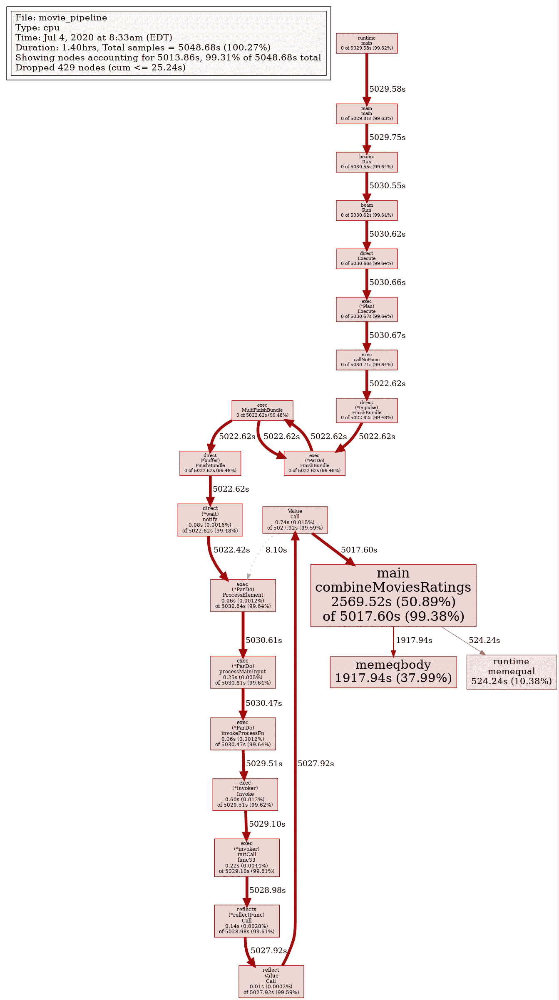*

*[https://CHOL linger . com/blog/2020/07/a-data-engineering-perspective-on-go-vs .-python-part-2-data flow/# perf-tools-profiling-go](https://chollinger.com/blog/2020/07/a-data-engineering-perspective-on-go-vs.-python-part-2-dataflow/#perf-tools---profiling-go)*

*我们可以看到`combineMovieRatings`，低效的列表迭代占用了大部分时间，通过监控`htop`，我可以告诉你这个任务一直使用一个线程。*

*现在，看到迭代一个列表效率非常低并不奇怪——但是结合单线程执行(我认为这是由`Splittable DoFn`问题引起的),正在导致大规模的运行时峰值。*

# *定制编码器之旅*

*在深入研究了吉拉和 GitHub 的 Pull 请求之后，我偶然发现了[自定义编码者](https://godoc.org/github.com/apache/beam/sdks/go/pkg/beam#Coder)和他们对内部类型的[用法。](https://github.com/apache/beam/blob/master/sdks/go/pkg/beam/core/runtime/coderx/string.go)*

*我有一个绝妙的主意，为我们的地图类型注册一个自定义编码器:*

```
*func NewCustomMap() (*coder.CustomCoder, error) {
	return coder.NewCustomCoder("customMap", reflect.MapOf(reflect.TypeOf(""), reflect.TypeOf((*ratingFn)(nil)).Elem()), encCustomMap, decCustomMap)
}

func encCustomMap(v typex.T) []byte {
	dat, _ := json.Marshal(v)
	return dat
}

func decCustomMap(data []byte) typex.T {
	return string(data)
}*
```

*不幸的是，`[RegisterCoder](https://github.com/apache/beam/blob/master/sdks/go/pkg/beam/forward.go#L95)`看起来是这样的:*

```
*func RegisterCoder(t reflect.Type, encoder, decoder interface{}) {
	runtime.RegisterType(t)
	runtime.RegisterFunction(encoder)
	runtime.RegisterFunction(decoder)
	coder.RegisterCoder(t, encoder, decoder)
}*
```

*因此，也调用`RegisterType(t)`，这将再次无法注册我们的类型或编码器。*

# *地图-> JSON ->地图*

*虽然我很有可能误解了上面所有的`go`代码和`Jira`标签，但我的下一个方法是自己做`json`解析。*

*首先，我们没有返回地图，而是返回了`[]byte`，它返回了一个`json`字符串:*

```
*func makeRatingsMap(rr int, ratings []ratingFn, emit func([]byte)) {
	m := make(map[string]ratingFn)
	for _, r := range ratings {
		m[r.tconst] = r
	}
	jsonMap, err := json.Marshal(m)
	if err != nil {
		log.Fatal(err)
	}
	emit(jsonMap)
}*
```

*然后，在我们的组合函数中，我们将数据`unmarshall`到一个`map[string]ratingFn`中。*

```
*func combineMoviesRatings(movie movieFn, ratings []byte, emit func(targetMovie)) {
	ratingsMap := make(map[string]ratingFn)
	err := json.Unmarshal(ratings, &ratingsMap)
	if err != nil {
		log.Fatal(err)
	}
	r, ok := ratingsMap[movie.tconst]
	if ok {
		emit(targetMovie{
			Id:             movie.tconst,
			TitleType:      movie.titleType,
			PrimaryTitle:   movie.primaryTitle,
			OriginalTitle:  movie.originalTitle,
			IsAdult:        movie.isAdult,
			StartYear:      movie.startYear,
			EndYear:        movie.endYear,
			RuntimeMinutes: movie.runtimeMinutes,
			Genres:         movie.genres,
			AverageRating:  r.averageRating,
			NumVotes:       r.numVotes,
		})
	}
}*
```

*不幸的是，现在每一步都需要执行`marshalling`，这极大地改变了本地性能数据:*

*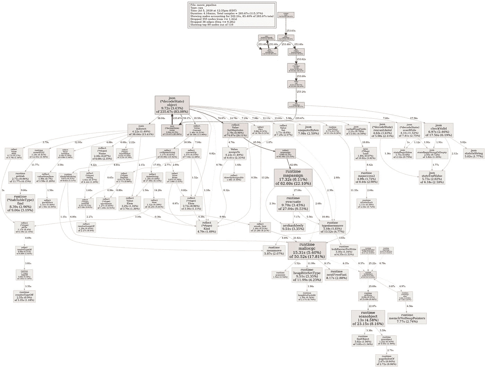*

*[https://CHOL linger . com/blog/2020/07/a-data-engineering-perspective-on-go-vs .-python-part-2-data flow/# map-JSON-map](https://chollinger.com/blog/2020/07/a-data-engineering-perspective-on-go-vs.-python-part-2-dataflow/#map---json---map)*

*如您所见，`json (*decodeState)`和`mapassign`导致了作业的巨大开销，至少在`DirectRunner`上，**不是一个可行的替代方案**。*

# *从头再来*

*此时，我们必须重新访问`CoGroupByKey`或其他选项；然而，这些问题确实显示了一些更奇怪的(我可以补充一下，完全没有记录的)问题和 SDK 的不足。*

*说一个`Side Input`是一个比`CoGroupByKey`更好的*解决方案是有争议的，但是在我的例子中，我一般不能使用一个`map`作为一个`Side Input`。**

# *最终在数据流上运行*

*在切换回`CoGroupByKey`之后，这些变化最终允许我将任务提交给`Dataflow`。请记住，`*go*` *SDK 还没有得到数据流*的官方支持。*

*这里，我们还可以通过向我们的`struct`添加元数据来为`BigQuery`添加另一个输出:*

```
*type targetMovie struct {
	Id             string `bigquery:"Id"`
	TitleType      string `bigquery:"TitleType"`
	PrimaryTitle   string `bigquery:"PrimaryTitle"`
	OriginalTitle  string `bigquery:"OriginalTitle"`
	IsAdult        bool   `bigquery:"IsAdult"`
	StartYear      int64  `bigquery:"StartYear"`
	EndYear        int64  `bigquery:"EndYear"`
	RuntimeMinutes int64  `bigquery:"RuntimeMinutes"`
	Genres         string `bigquery:"Genres"`
	// Ratings
	AverageRating float64 `bigquery:"AverageRating"`
	NumVotes      int64   `bigquery:"NumVotes"`
}*
```

*并写信给 BQ:*

```
*if *bq != "" {
		project := gcpopts.GetProject(ctx)
		bigqueryio.Write(s, project, *bq, combined)
	}*
```

*提交后，我们将看到我们的 DAG:*

*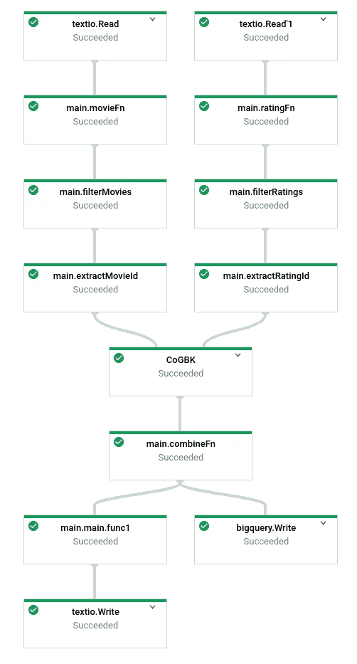*

*[https://CHOL linger . com/blog/2020/07/a-data-engineering-perspective-on-go-vs .-python-part-2-data flow/# finally-running-on-data flow](https://chollinger.com/blog/2020/07/a-data-engineering-perspective-on-go-vs.-python-part-2-dataflow/#finally-running-on-dataflow)*

# *可拆分 DoFns*

***免责声明**:在需要加载*大文件的用例中`go` SDK 的性能可能不如`Python`和`Java`。**

*这是因为**`**go**`**SDK 不支持** [**可拆分 DoFns**](https://beam.apache.org/blog/splittable-do-fn/) 。参考见 [BEAM-3301](https://issues.apache.org/jira/browse/BEAM-3301) 。***

# ***数据流性能***

***在比较性能时，我们将考察所有 3 种方法:***

1.  ***使用简单列表作为`Side Input`***
2.  ***使用`dict`作为`Side Input` *(仅限 Python)****
3.  ***使用`CoGroupByKey`***

***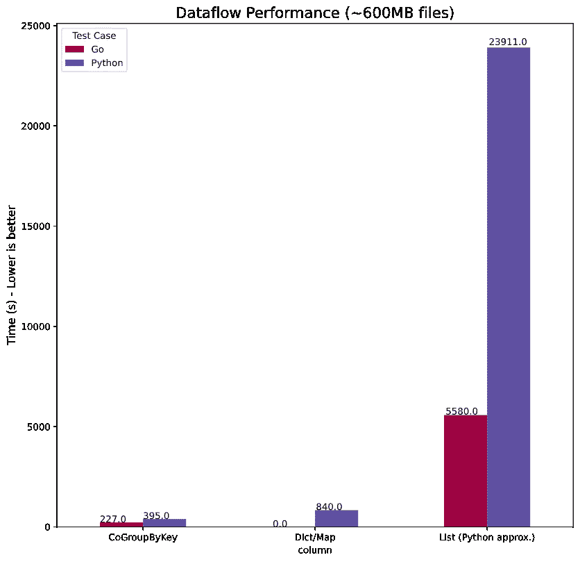***

***[https://CHOL linger . com/blog/2020/07/a-data-engineering-perspective-on-go-vs .-python-part-2-data flow/# data flow-performance](https://chollinger.com/blog/2020/07/a-data-engineering-perspective-on-go-vs.-python-part-2-dataflow/#dataflow-performance)***

***实际上，我必须计算 Python 上的`list`性能，因为作业在大约 2 小时后仍在运行，每秒大约 8-15 个元素。我通过查看`CoGroupByKey`运行的预期输出和运行时间来估算运行时间，因此实际数字可能会更差！***

***这符合我们在`DirectRunner` - `go`上看到的更快，尽管没有上一个 Mandelbrot 示例中的“常规”`go`与`Python`代码快。我们无法比较`dict` / `map`逻辑，因为它只在`DirectRunner`上运行。***

****[0]我不确定为什么* `*go*` *SDK 不产生“记录/秒”指标****

# ***绩效总结***

***上次，在我们的`Mandelbrot`基准测试中，`go`几乎比`Python`快了 45 倍。***

***这一次，总结是这样的:***

***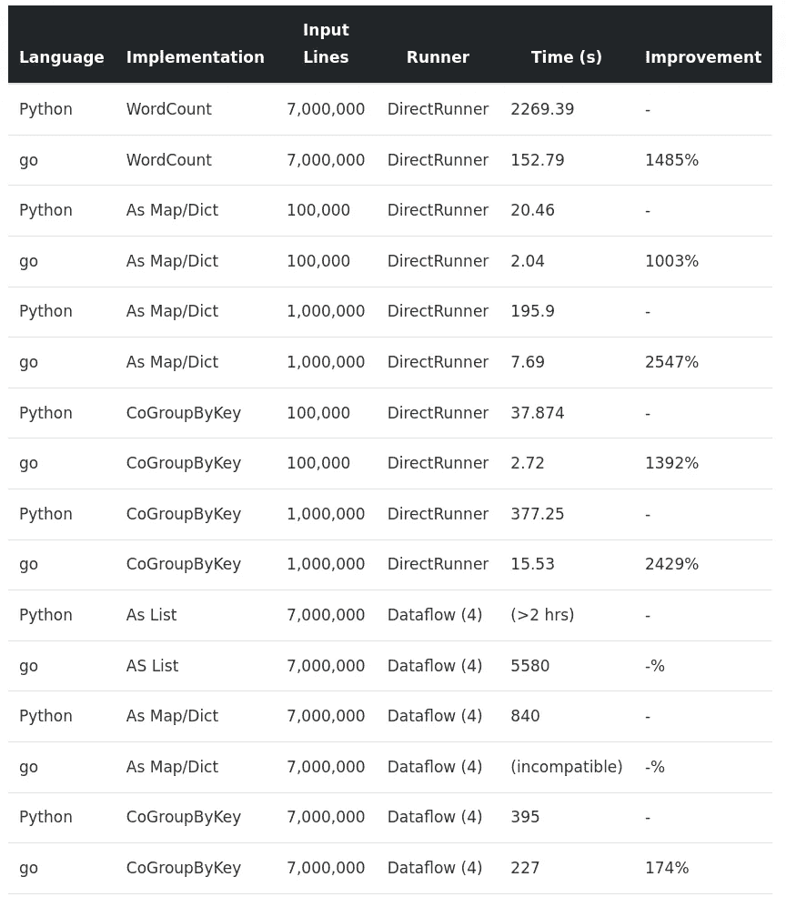***

***[https://CHOL linger . com/blog/2020/07/a-data-engineering-perspective-on-go-vs .-python-part-2-data flow/# data flow-performance](https://chollinger.com/blog/2020/07/a-data-engineering-perspective-on-go-vs.-python-part-2-dataflow/#dataflow-performance)***

***所有运行程序和用例的平均性能增益(由于开销和近似运行时间，不包括 100 条记录)是**1290.19%**——如果我们从`list`运行时间中取近似值，我们会看到 *1351.40%* ，尽管这并不真正公平。***

***无论如何，这确实令人印象深刻。***

# ***结论***

***我们学到了什么？***

# ***动态与静态类型& `dict`与`struct`***

***这部分虽然非常主观，但让我思考了很多。当我第一次开始深入研究第 1 部分时，对我来说很明显`Python`缺乏静态类型往往是一种诅咒，而不是一种祝福。我不得不花费大量的时间夜以继日地想弄明白为什么一项工作(无论是`Beam`、`Spark`、`Pandas`、`Dask`还是其他什么)不能完成我想要的工作，或者更迫切地说，当我从用户那里得到反馈说他们的数据看起来“不正常”时，这通常是由类型问题引起的。***

***我在第 1 部分中对此进行了阐述——Python 不强制类型化。我经常使用外部库，比如`numpy`，来编写在处理数据管道时使用外部配置强制输入的类。这可能遵循这样的逻辑“你的字典应该有属性`averageTemp` ( `if 'averageTemp' in dict`)，那就是一个`FLOAT64`。`FLOAT64`映射到 numpy 的`np.float64`；为了确保它确实是`FLOAT64`，我们将在作业的某一点尝试解析；如果失败，使用`except`静默捕捉并将其设置为`None`。***

***另一方面，在`go`中，我不能舒服地那样做。我被迫遵守结构和类型——我甚至不能设置一个`string`到`nil`,尽管我可能已经非常习惯了。***

***现在，什么更好？嗯，我认为这是风格和设计的角度问题。虽然我发现在 Python 中“生产”级的工作通常很困难，但是由于上面的边缘情况和解决方法(请记住:如果我的数据不符合数据库规定的格式，我就是问题的一方！)，可以是挑战。***

***与此同时，就我个人而言，在`go`写我的工作比在`Python`花的时间要长得多——因为我需要更多地思考我要做什么。经常像我对待`bash`或`zsh`一样对待`Python`——输入一些东西，希望它有用。引导我去…***

# ***编译程序***

***…编译器。编译器是我已经学会既讨厌又喜欢的东西。由于我没有提到它，让我用几个精选的例子告诉你编译器(或者更确切地说是`go`工具链)是做什么的:***

1.  ***不能有未使用的变量***
2.  ***您不能有未使用的导入***
3.  ***你不能使用错误的类型***

***我说的`cannot`是指:“无论是`go run`还是`go build`都不会产生二进制”。***

***似乎很合理，对吧？嗯——借用我的评论，我发现它既有帮助又乏味。编写`go`代码就像编写`Python`代码，而`pylint`处于高度戒备状态——它不会让你做任何可能让编译器不舒服的事情，同时，确保你所产生的东西将实际工作，而没有副作用。***

***同时，具体到`Dataflow`，它显然不会捕捉任何特定于工具的东西——例如，不在`init()`中注册类只会在您提交作业时成为一个问题。***

***`Python`，另一方面，让我写的代码得到 1/10 的分数`pyLint`，这可能是未来 me 的问题。***

# ***可读性***

***我喜欢`Python`中`Beam`的语法。一旦你克服了它看起来有多“奇怪”,用类似伪代码的东西来构建`DAG`确实是一个很好的方法。***

***`go`的方法更加学术化。它遵循标准的语言流程——每个函数返回一个`PCollection`。这更加直观，但是我发现它失去了`Python`的“DAG-as-code”逻辑的好处。***

***但是我会让你自己判断——在 [GitHub](https://github.com/chollinger93/beam-examples) 上查看`Python`和`go`的完整代码。***

# ***可拆分 DoFns 和性能***

***`go`中的性能提升是巨大的，老实说，出乎意料。平均而言， *1290.19%* 的提高是不可小觑的。***

***`Splittable DoFns`另一方面，一旦我们越过相对较小的数据集，开始谈论多个 GB 或 TB，这实际上是一件大事——即使不是交易的破坏者，也使这种练习本质上主要是学术性的。***

# ***证明文件***

***这是我对 SDK 最大的不满之一，抱怨让我感觉很糟糕，因为绝对没有什么能阻止我致力于此(除了时间)。***

***`go`的`Beam`文档非常乏味——许多功能和示例只适用于`Python`和`Java`。至少可以说，围绕`go`寻找例子、逻辑和整体架构细节是一项挑战。我主要依靠`godocs`和阅读相当多的源代码。***

***上面的报道应该可以证明这一点——我遇到了很多死胡同。***

***我使用`go` SDK 的过程看起来有点像这样:***

1.  ***在 Beam 的网站上吗？(通常没有)***
2.  ***有带注释的例子吗？我克隆了回购，用`grep`搜索关键字；没有很好的例子概述，提供的例子通常没有注释***
3.  ***难道是在`godocs`里？如果是，他们给出例子或者解释如何使用函数性吗？(参见上面的`coder`死胡同)***
4.  ***读取`go` SDK 源代码***

***不用说，Google / StackOverflow 的结果几乎为零。***

# ***和睦相处***

***我已经在第 1 部分提到过这一点，但是考虑到`go` SDK 的实验性质，与`Beam`特性和`Runners`的兼容性显然不如在`Python`或`Java`中那么好。然而，对于简单的管道和使用`Dataflow`作为流道，`go`确实涵盖了基本内容。然而，你确实失去了我在引言中提到的一些好处——更少的跑步者意味着更少的选择。***

# ***那又怎样？***

***`go`是一种有趣的语言，但是在花了很多时间写这些文章、摆弄代码、文档和环境之后，我现在不推荐使用`go`作为`Beam`管道——至少不推荐作为一个总括声明。***

***当然——它比`Python`有优势，语言本身清晰，有据可查，而且快速。***

***然而，一旦你超越了标准用例、`Splittable DoFns`问题、文档和兼容环境，功能性的缺乏使得使用`Python`(或`Java`)作为默认更加合理。虽然更熟悉`Beam`的`go` SDK 的人肯定可以解决我的一些问题——就像上面的`map`问题——但是仍然有很多事情使得在`Dataflow`管道的生产中使用`go`至少是有问题的。***

***然而，对于更简单的管道——我相信，如果你可以接受一个官方尚未支持的运行器(`Dataflow`)，那么性能提升是值得的。***

***也就是说，我肯定会密切关注`Beam` SDK 的进展，如果有机会，我希望在未来致力于它——因为`go`是一门非常有趣的语言，不能忽视。***

****所有的开发和基准测试都是在 GNU/Linux [PopOS！20.04 在内核 5.4 上]在 2019 System76 Gazelle 笔记本电脑上使用 12 个英特尔 i7–9750h v cores @ 4.5 GHz 和 16GB RAM，使用 0.5 版本的 data flows Go Runner****

> ***最初发表@[chollinger.com/blog](https://chollinger.com/blog/2020/07/a-data-engineering-perspective-on-go-vs.-python-part-2-dataflow/)***

****原载于 2020 年 7 月 6 日*[*https://chollinger.com*](https://chollinger.com/blog/2020/07/a-data-engineering-perspective-on-go-vs.-python-part-2-dataflow/)*。****