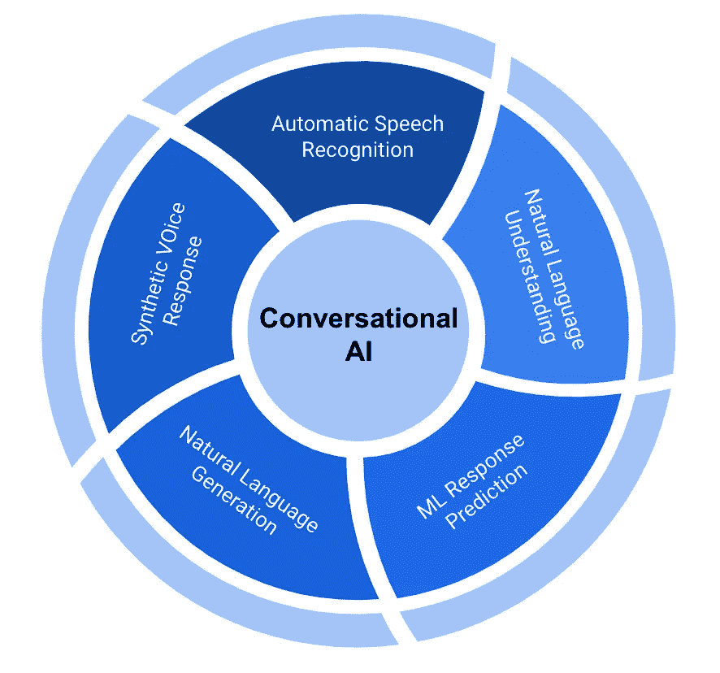

# 对话式人工智能的数据产品观

> 原文：<https://towardsdatascience.com/a-data-product-view-on-conversational-ai-80284efe5a15?source=collection_archive---------45----------------------->

来源:[伊利莎](https://giphy.com/iliza/)通过[吉菲](https://giphy.com/gifs/iliza-3og0IMVPaqrnGfBnZm)

***“喂，你起来了？”***

与人类不同，对话式人工智能(AI)目前最常通过聊天机器人部署，它在 100%的时间里都是“运行”的。

Smallbizgenius 很好地总结了聊天机器人的一些惊人统计数据:

*   聊天机器人可以削减高达 30%的运营成本。
*   到 2021 年，85%的客户交互将在没有人类代理的情况下处理。
*   50%的企业计划在聊天机器人上的支出超过在移动应用上的支出。
*   64%的互联网用户表示，24 小时服务是聊天机器人的最大特点。
*   37%的人在紧急情况下使用客服机器人获得快速回答。
*   2018 年，脸书有超过 30 万个聊天机器人。

除了聊天机器人，自动语音应答系统(尽管它们可能仍然很烦人)和虚拟语音助手都利用对话式人工智能来推动人机对话。

# **对话式人工智能概述**

对话式人工智能是一种允许用户向机器提问并获得自动响应的技术。这些机器中最值得注意的是 Alexa、Siri 和 Google Assistant 等虚拟助手。对话人工智能的核心是自然语言处理(NLP)的利用。

作者图片

任何对话式人工智能实现都需要三个主要的 NLP 组件:

1.  使用自然语言理解理解意图(NLU)
2.  使用机器学习算法预测响应
3.  通过自然语言生成的类似人类的反应(NLG)

作为人类，我们理解“你起来了吗？”可以有多种含义或意图。在高层次上，自然语言理解基于使用的单词和短语以及使用它的上下文将人类语言映射到意图。一旦确定了意图，就可以使用不同的机器学习技术来预测最佳响应。该响应很可能存储在数字表示中，同样根据上下文，自然语言生成可用于将响应映射回最合适的人类可理解的语言。

对于基于语音的系统，智能设备必须首先利用自动语音识别(ASR)将语音转换为文本，然后利用 NLP 处理意图并生成响应。在响应被预测并且 NLG 被用于生成类似人类的响应之后，语音合成被用于将响应从文本转换成声音。

人工智能，或者更具体地说，深度学习，是这些技术的核心，有助于人机对话和语音到文本的转换。此外，人工智能允许应用程序纠正错误，从经验中学习，并随着时间的推移进行改进，以便在未来不断使用时提供更好的响应。

作为一个快速题外话，随着深度学习应用的兴起，以及其阴暗面“深度假货”，语音克隆已经成为讨论的热点。[基于深度学习技术](https://www.speechandlanguagesolutions.com/voice-cloning/)，可以使用原始语音来训练模型，以生成具有相似语音的新音频。有一天，你甚至可以在你的虚拟助手上使用[名人](https://www.bbc.com/news/technology-49829391#:~:text=Amazon%20has%20announced%20that%20its,voice%20costing%20%240.99%20(80p).)的声音。就目前而言，声音克隆技术的应用仍然取决于人类。

# 使用对话人工智能的数据产品类型

照片由 [Cookie 在](https://unsplash.com/@cookiethepom?utm_source=medium&utm_medium=referral) [Unsplash](https://unsplash.com?utm_source=medium&utm_medium=referral) 上的 Pom 拍摄

如今，对话人工智能主要以三种方式出现在数据产品中。

1.  **聊天机器人**

聊天机器人是对话式人工智能中最常见的应用。它们是您在网站上找到的基本应用程序，用于常见问题解答和引导您浏览网站的各种功能，并充当服务提供商的客户支持。一般过程是传递关于用户的文本查询的响应。然而，聊天机器人是基本形式，不具备深度学习融合的能力，如在未来的交互中学习和改进。

**2。智能虚拟助理**

智能虚拟助理被认为是更高级的对话式人工智能。属于这一类别的最受欢迎的设备和应用程序是亚马逊的 Alexa、苹果的 Siri、三星的 Bixby 和谷歌助手。这些虚拟助理针对不同形式的服务，如家庭语音助理，包括 Alexa 等。另一方面，Siri、Bixby 属于可以执行各种操作的移动助手类别，即文本到语音、导航、快速回复、天气响应和快速地址搜索等功能。

**3。客服助理**

这些是针对特定的面向服务的问题而进一步开发的。主要目的是提供高效的客户支持。客户服务助理越来越受欢迎，并且通常在电信提供商或电子和教育组织中使用，用于处理客户请求的平稳运行。这种虚拟助理在打开网站或浏览某个产品时弹出，以帮助购买或以帮助台的形式出现。

# 拥有对话人工智能产品的样本公司

弗兰基·查马基在 [Unsplash](https://unsplash.com?utm_source=medium&utm_medium=referral) 上拍摄的照片

我们非常了解 Alexa、Siri 和 Google Assistant 等热门产品，因为这些公司是该领域的市场领导者。然而，一些创业公司已经成功地实施了这些技术，根据他们的目标市场构建了类似的产品。以下是一些对话式人工智能和/或语音克隆公司的例子:

**Kore.ai**

Kore.ai 是一家企业虚拟助理平台和解决方案公司，帮助企业自动化并增强与客户、员工和合作伙伴的数字互动。我们提供基于对话式人工智能的无/低代码企业平台，以创建具有对话式和数字用户体验的虚拟助手。Kore.ai 还为银行、保险、人力资源和 IT 支持提供领域培训的预建虚拟助理，并推出了一款名为 Kora 的企业数字助理，作为员工的通用/主/礼宾助理。此外，Kore.ai 还提供名为 SmartAssist.ai 的基于云的呼叫自动化和数字偏转服务。Kore.ai 得到了 Gartner、Forrester、IDC、Everest 等领先分析师的认可，受到了全球财富 2000 强公司和合作伙伴的信任。

**Houndify**

Houndify 是一个语音人工智能平台，允许任何人给任何有互联网连接的东西添加智能的对话界面。一旦您与 Houndify 集成，您的产品将立即理解各种各样的口头问题和命令。让我们与众不同的是，Houndify 不是技术链中的一环，而是实现任何产品语音功能所需的所有技术的一站式目的地。它包括大规模语音识别，结合强大的自然语言理解。Houndify 集成了许多最受欢迎的内容提供商(包括 Yelp、优步、Accuweather 等)，允许语音无缝访问信息。

**莉莉 by Vozy**

据该公司称，[礼来](https://www.vozy.co/lili-assistant/)旨在与客户进行更强大、更直观的互动。无论客户寻求自我管理还是个性化对话，礼来都能在整个渠道中提供高效的表现。人工智能、人类理解和语音技术的结合用于帮助与客户建立更有成效的对话，从而与客户建立更牢固的关系。虚拟助理能够为各种交易带来自动化，即从电话调查到复杂任务，从注册到领导资格，Lilly 能够处理各种不同的任务。

**MindMeld**

[MindMeld](https://www.mindmeld.com/) 对话式人工智能平台是最先进的人工智能平台之一，用于构建生产质量的对话式应用。它是一个基于 Python 的机器学习框架，包含了为此目的所需的所有算法和实用程序。MindMeld 经过数年的发展，构建和部署了数十种可实现的最高级对话体验，并针对构建高级对话助手进行了优化，这些助手展示了对特定用例或领域的深刻理解，同时提供了非常有用和多样化的对话体验。

**陆地机器人**

Landbot 管理和自动化主要消息渠道上的对话，以帮助您每次更智能地转换。从同一个地方设计、部署和分析您的对话策略，无需一行代码即可传递信息。

使用 Landbot，你可以为 WhatsApp、web 或 Facebook Messenger 设计强大的自动化对话，并将它们与你已经使用的工具集成。一切都是实时发生的，用户的选择决定了整个过程。加入与他们的对话，将他们的信息发送到您的 CRM，或使用他们的数据通过即时消息定制和触发活动。

**iSpeech**

[iSpeech](https://www.ispeech.org/voice-cloning) 专注于语音克隆技术，在接近客户寻求产品、应用和服务时，使用更加熟悉和愉快的声音来改善客户关系。这项技术的一些特点如下。

*   交互式培训和学习。
*   为导航添加熟悉的声音。
*   文本到语音应用程序的国际语言内容。
*   有声读物旁白。
*   名人声音克隆应用。
*   提供城市指南。
*   电影和动画。

**回答者**

reSpeecher 是另一种声音克隆技术，其简单的想法是克隆人类的语音并交换声音。该技术面向电影制作行业、电视制作人、游戏开发商、广告商、播客和一些类型的内容创作者，这些人的作品更具创造性。从演员配音到交换儿童的声音和表达不同的情感，reSpeecher 通过使用具有深度生成建模技术的经典数字信号处理算法涵盖了所有方面，结果是现场匹配。

# 构建您自己的聊天机器人

由 [Kelly Sikkema](https://unsplash.com/@kellysikkema?utm_source=medium&utm_medium=referral) 在 [Unsplash](https://unsplash.com?utm_source=medium&utm_medium=referral) 上拍摄的照片

如前所述，聊天机器人是最常见的对话人工智能产品。想尝试开发自己的聊天机器人吗？Chatbots Life 有一篇很棒的文章，里面有代码示例，告诉你如何按照五个简单的步骤开发你的第一个聊天机器人:

1.  准备依赖项
2.  导入类
3.  创建和训练聊天机器人
4.  与聊天机器人的通信
5.  聊天机器人的语料库数据训练

有关代码示例，请参考他们的原始文章:[https://chatbotslife . com/how-to-create-an-intelligent-chatbot-in-python-c 655 EB 39d 6 b 1](https://chatbotslife.com/how-to-create-an-intelligent-chatbot-in-python-c655eb39d6b1)

# **结论**

近年来，虚拟助手和聊天机器人的应用飞速发展。随着快节奏的技术发展，深度学习算法大大提升了这些智能系统的能力。各行各业对这种技术的需求越来越大，而且只会继续增长。然而，尽管这种技术具有各种优势，但仍有许多挑战和问题需要解决。此外，如何利用这些技术，如声音克隆，具有巨大的伦理影响。尽管取得了所有的进展，我仍然期待有一天我不再需要在与人工智能机器交谈时反复要求与人类代理说话。

Richard Sheng 是百威英博(Anheuser-Busch InBev)旗下 Z-Tech 的数据科学和分析全球总监，为全球小型企业带来数据驱动的技术解决方案。Richard 拥有 12 年以上为初创公司和财富 500 强公司开发数据产品的经验。