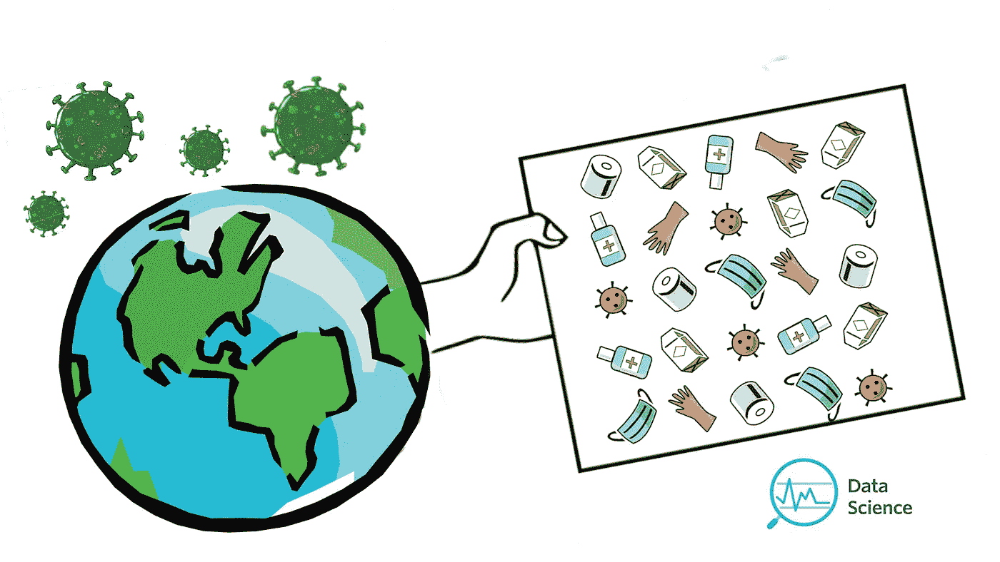
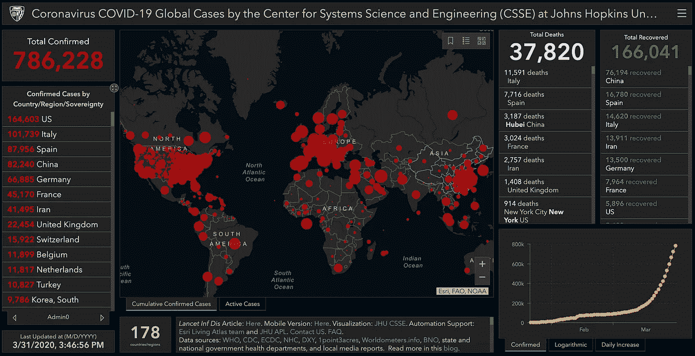
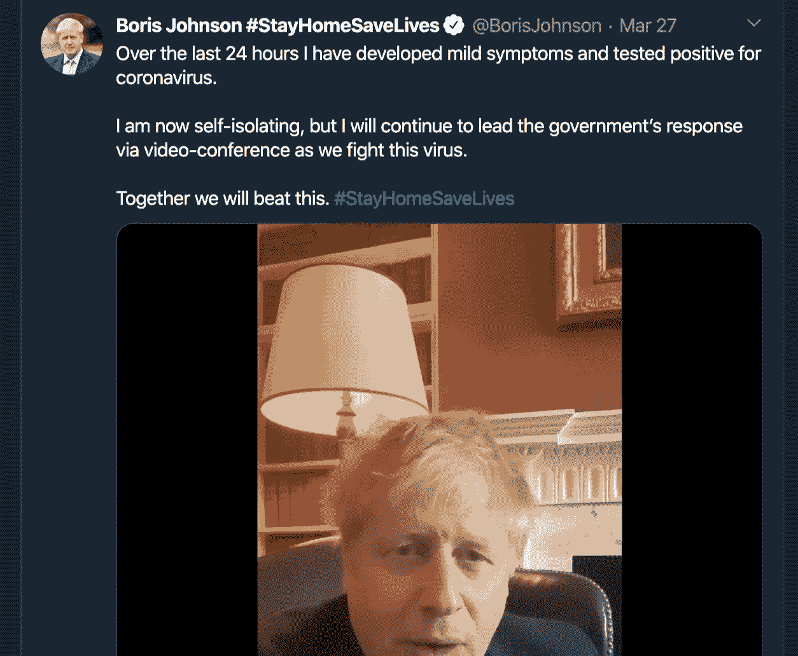
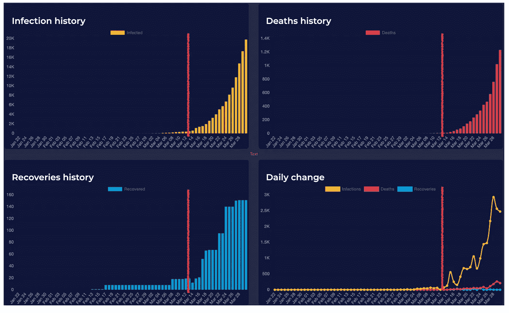
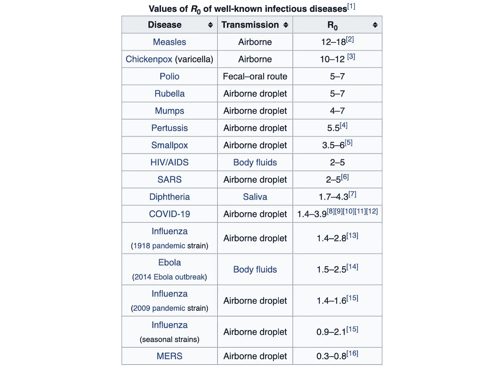
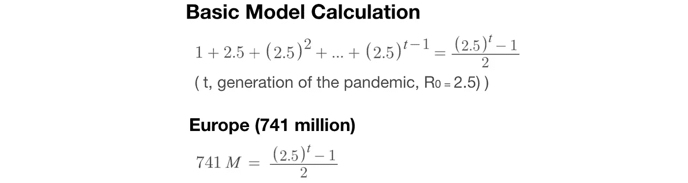
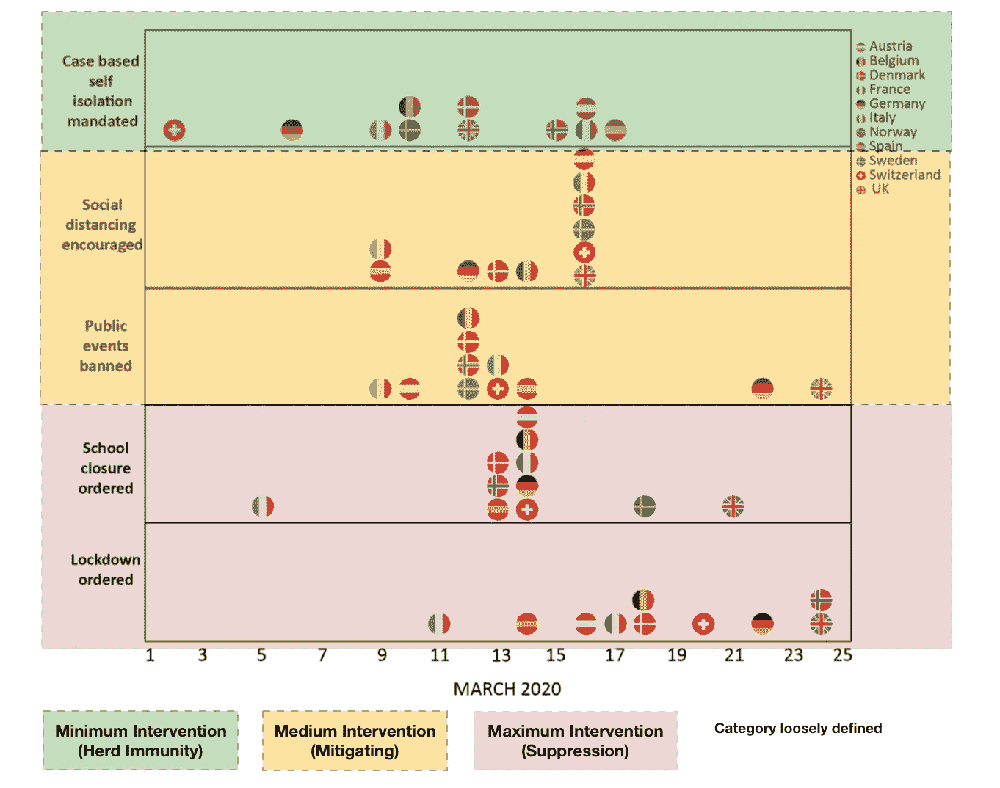
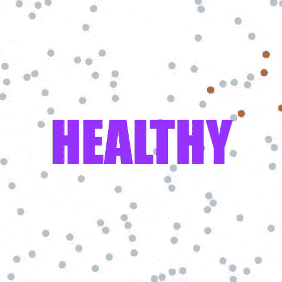
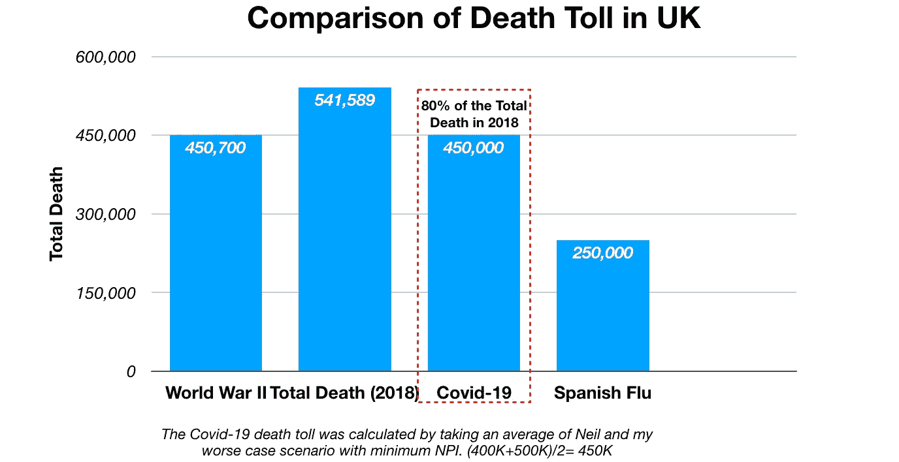

# 从数据科学的角度看群体免疫，我们需要付出什么来阻止病毒？

> 原文：<https://towardsdatascience.com/a-data-science-view-of-herd-immunity-what-do-we-have-to-pay-to-stop-the-virus-3a05fc2ce720?source=collection_archive---------17----------------------->

由凯瑟琳·王创作，版权所有

## 从数据科学家的角度看新冠肺炎疫情，没有废话，没有指责，没有政治化。让数据告诉你真相。群体免疫是对抗新冠肺炎疫情的好策略吗？

***编者按:*** [*走向数据科学*](http://towardsdatascience.com/) *是一份以数据科学和机器学习研究为主的中型刊物。我们不是健康专家或流行病学家，本文的观点不应被解释为专业建议。想了解更多关于疫情冠状病毒的信息，可以点击* [*这里*](https://www.who.int/emergencies/diseases/novel-coronavirus-2019/situation-reports) *。*

ovid-19 像野火一样蔓延。这种微生物粒子正在迅速改变世界。在不到四个月的时间里，它已经从武汉(中国)发展到世界上几乎每个国家。

2020 年 3 月 31 日来自约翰·霍普金斯 CSSE 的数据和仪表板

2020 年 3 月 13 日，英国首相鲍里斯·约翰逊向全国发布了最新的冠状病毒简报。当时他提到，英国将利用科学研究，根据现有的证据建立最佳策略模型，这种松散的控制策略后来被英国首席科学顾问帕特里克·瓦兰斯(Patrick Vallance)指控为**群体免疫。**

英国将保持正常运作，没有任何严格的控制或封锁，但与此同时，鲍里斯提出，每个英国家庭都应该准备好“提前失去亲人”。

在提出群体免疫建议 14 天后，据报道鲍里斯·约翰逊与新冠肺炎的检测呈阳性。

3 月 27 日，鲍里斯·约翰逊被检测出新冠肺炎阳性

在同样的 14 天里，英国已经确认了近 20，000 例感染病例，超过 1，200 例死亡。(数据来自 2020 年 3 月 30 日，英国政府后来实施了更严格的立法来抑制疫情)

2020 年 3 月 30 日来自[https://corona.help/](https://corona.help/)的报告，红线表示 2020 年 3 月 13 日之后群体免疫公告后的病例增长。

> 那么到底什么是群体免疫呢？这是我们对抗病毒的最好方法吗？

让我们通过数据科学的镜头来讨论今天的话题。

# 一.简单的病毒传播模型。

病毒传播过程本质上极其复杂。有各种流行病学模型来解释或模拟传染病的传播。但是为了一个基本的理解，我们从一个简单的模型开始。

在这个模型中，我们有两个基本的基础概念(基本再生数和世代间隔)

*   **基本 R *生产编号***

基本再生数(R0)定义为完全易感人群中单次(典型)感染产生的继发性病例的预期数量。

这将有助于我们理解传染病在人群中传播的速度。

如果 R0 小于 1，例如 0.5。那么一个人会产生 0.5 个新病例，继发的 0.5 个病例会把病毒传给下一个 0.25 个病例。因此，受感染的人口会越来越少。并且没有任何机会成为全球性流行病而消亡。

如果 R0 接近或等于 1，意味着一个人只会把病毒传给另一个人，然后传给下一个人。我们最终会得到一条感染病例的直线。因此我们称之为地方病(局部传播)，例如水痘。

最后一种情况是，当 R0 大于 1 时，例如 2，那么增长将是指数的，从 2 到 4，从 4 到 8，最终达到临界点，它不能被包含在局部区域中。我们现在称之为疫情。

一旦病毒爆发成为疫情，通常有两种结局，患者要么死亡(打破循环)，要么形成针对病毒的免疫系统。(停止蔓延)

总之，**R0 越大，传染性越强。**(有些科学家用 Rt 表示符号)

R0 的更现实的计算

来自斯坦福大学人类科学系

看一看一些众所周知的疾病的 R0。传染性最强的是麻疹，其基本繁殖率为 12-18，其次是白喉，R0 为 6-7。

来自[维基百科](https://en.wikipedia.org/wiki/Basic_reproduction_number) —基本复制数

世卫组织最初估计新冠肺炎 R0 为 1.4–2.5(平均值为 1.95)，然而最近对 12 项研究的审查估计**基本 R0 为 3.28，中值 R0 为 2.79。**

*   **生成*间隔*间隔**

什么是世代间隔？这是分隔连续感染的时间段。

简而言之，让我们假设一个新冠肺炎患者可以将疾病传染给另外两个人，那么这种传播需要多长时间？1 天、2 天或一周。这是数学模型中的另一个关键因素，**两代人之间的间隔越短，传染性越强。**

由凯瑟琳·王创作，版权所有

“A”感染病毒的时间用圆圈表示。过了一会儿，“A”显示了一些轻微的症状，用正方形表示。

圆圈和正方形之间的间隙是潜伏期。(从接触感染到出现第一批症状之间的时间)新冠肺炎的潜伏期变化很大，从 3 天到 20 天不等。我们来加权平均一下，8 天。

需要指出的是，患者“A”在整个潜伏期都具有传染性，因此可以在 8 天内的任何时间感染患者 B。那么 B 还需要 8 天才能出现症状(也标记为方形)。两个方块之间的时间间隔称为世代间隔。对于新冠肺炎来说，大约是 4 天。

> 就拿“Ro = 2.5”“世代间隔= 4”来说，如果没有干预，新冠肺炎要多久才能蔓延到整个欧洲？

到 2020 年 1 月 24 日，法国确诊首例新冠肺炎患者。不幸的是，当地政府没有给予足够的重视，从而给了病毒爆发的机会，但控制有限。

由凯瑟琳·王创作，版权所有

上述等式是基于几何级数求和推导出来的，它计算了冠状病毒在每一代中的累积预测病例数(R0=2.5)。欧洲的总人口是 7 . 41 亿，这是 23 代人的结果。

大多数人会对这个数字感到震惊，心想这怎么这么小。指数增长的魔力。

而当我们每代取 4 天时，最终结果对应的是 **92 天。**

从 2020 年 1 月 24 日算起，到 2020 年 4 月 25 日，新冠肺炎将在没有任何非药物干预(NPI)的情况下覆盖欧洲大陆的每个角落。

请记住，这是一个极其简单的模型，真实世界的情况要复杂得多，需要将更多变量的大小纳入动态流行病学模型。

这里有几个可以考虑模型，

*   SI 模型—[将人群分为易感人群 S(t)和传染性人群 I(t)。n 是总人口数量。那么我们有 S(t)+ I(t) = N.]
*   SIR 模型—[除了易感性和传染性，该模型假设从感染中恢复的人变得免疫，并且不能被第二次感染。S(t)+ I(t) +R(t)= N]
*   SIS 模型—[假设康复后的人仍然易患该疾病]
*   贝叶斯分层模型(London‌帝国理工学院在其最新报告中使用，该模型易于解释和推断)
*   等等。

# 二。群体免疫

最后，我们来看看群体免疫。

经济学家总结说，世界各国政府正在使用三种主要方法来对抗新冠肺炎。

*   **群体免疫** - >允许大多数被感染人群发展出免疫系统的情况。
*   **缓解** - >通常被称为“拉平曲线”，通过包括大规模检测、接触者追踪、隔离病例、隔离等手段降低疫情的强度。
*   **镇压** - >关闭城市，关闭公共活动，学校，大学以减少传播。

由 Catherine Wang 创建，数据来源于伦敦帝国理工学院报告，版权所有

如前所述，英国是第一个提出群体免疫方法来控制疾病的国家(如上图所示，英国是最后一个实施封锁的国家)**。**

## 群体免疫。

这个理论是一个世纪前提出的(和很多数据科学经典模型一样)

由凯瑟琳·王创作，版权所有

*   首先，让我们假设我们有一群人，他们正在爆发未知病毒
*   大多数人将从疾病中康复，并建立起针对病毒的免疫系统。这个比率表示为 P，无免疫率为(1-p)
*   取 R0 率，病毒只能传染给非免疫组。RO(1 名专业人员)
*   如果我们设法得到[R0(1-P)]< 1, the disease will go away in a short period of time. To satisfy, we need to have P>1–1/R0(简单计算)。
*   在这个等式中取新冠肺炎 R0 = 2.5，我们将有一个 **P > 60 %。**这意味着该群体中有 2/3 的人需要被感染并恢复免疫力才能阻止病毒。

来自其他颜色[图片](https://giphy.com/othercolors)

正如你在左边的图像中看到的。

患病病例在开始时呈指数增长，并迅速感染大多数节点。(橙色)

但是一段时间后，越来越多的节点发展出免疫系统(紫色)。

因此，整个群体正在恢复到健康状态。

由凯瑟琳·王创作。版权所有

比方说，如果英国政府继续实施这种方法，6640 万* 60%≈**4000 万人将被感染**。此外，新冠肺炎目前的病死率(CFR)为 4%,预计中国和意大利为 8%,假设英国拥有世界上最好的医疗保健系统，可以将病死率降至 1%,仍将有约 4000 万* 1% = **40 万人死亡。**

> 同样，领导新冠肺炎非药物研究 *[* [*论文*](https://www.imperial.ac.uk/media/imperial-college/medicine/sph/ide/gida-fellowships/Imperial-College-COVID19-Europe-estimates-and-NPI-impact-30-03-2020.pdf)*】*研究的伦敦帝国学院教授 [Neil Ferguson](https://www.imperial.ac.uk/people/neil.ferguson) 说，他最初的估计仍然正确，该估计显示冠状病毒将在英国杀死 **500，000** 人(有限的 NPI，非药物干预)，而一个反映封锁措施影响的新模型读数看到该估计缩小到 20，000 或

> 这个数字是什么意思？

2018 年，英国总死亡人数刚刚超过 50 万。通过群体免疫策略，新冠肺炎将在几个月内夺走几乎同样数量的人的生命。相比之下，第二次世界大战在英国只花费了超过 45 万人的生命，包括士兵，护士，市民等。这意味着新冠肺炎可能会比二战对英国产生更大的影响。

作者凯瑟琳·王，版权所有。

群体免疫方法的支持者认为，如果没有疫苗，这种流行病将在限制取消后的几周内卷土重来。每当这种疾病再次出现时，政府可能需要压制它。这种时断时续的循环必须重复，直到疾病在人群中传播，或者 6 个月后出现疫苗。

批评者辩称，没有科学证据支持新冠肺炎季节性爆发的理论，即使公众能够建立群体免疫力，当病毒变异时也不会有效。

# 三。群体免疫曾经阻止过流行病吗？

最好的例子是麻疹。

*前提:*

*   麻疹的 R0 值为 12-18，极具传染性。
*   人类是麻疹的唯一宿主。
*   病死率低，为 0.3%。
*   没有突变，人类可以对麻疹产生终身免疫。

对于所有这些特征，麻疹似乎是群体免疫的最佳候选者。

**那么这种病很快就灭绝了吗？**

麻疹的首次出现是在 10 世纪，直到 1980 年我们发现疫苗之前，它每年导致超过 260 万人死亡。

在接种 MMR 疫苗之前，90%(或者一些专家说 99%)的婴儿将会感染麻疹。典型的症状包括皮疹和肺炎，甚至小病例的脑损伤。

即使在我们发现 MMR 之后。麻疹仍然很难预防和控制。

使用前面的等式 P > 1-(1/R0)= 1-(1/15)= 93%。我们需要让 93%的人口建立起一个免疫系统来控制病毒。(世卫组织建议这个数字应该是 95%)。

但是，由于一些关于接种 MMR 疫苗后不良反应的负面评论，实际接种率仅为 86%。

> 1998 年，英国《柳叶刀》发表了一篇文章，谈到麻疹疫苗可能会导致儿童自闭症[参考文献]

我们已经消灭了天花，世卫组织接下来要消灭的是麻疹、脊髓灰质炎和新冠肺炎。

然而，为了抗击 R0=2.5、CER 为 1%的疫情，人们会愿意为了获得公众群体免疫而被感染吗？

缓解措施花费了太多的生命，抑制措施可能在经济上不可持续，群体免疫？我们能给人们的生活贴上价格标签吗？

由凯瑟琳王创作，版权所有。

当我看到英国首相和首席科学官的演讲时。我既震惊又失望。

长期以来，英国一直是伟大天才和艺术家的诞生地，他们是一些不朽的英雄。他们照亮了整个世界，牛顿、法拉第，是他们把人类带入了第三次工业革命；查尔斯·达尔文，他告诉我们我们的起源；莎士比亚和列侬，他们让我们笑出了眼泪；丘吉尔，他团结全国人民抵抗敌人入侵，捍卫国家主权。

一个最早创造出用于临床试验的疫苗的县，第一个进行流行病学研究的国家，拥有世界顶尖研究人员和最好医学期刊的国家。

有些人用第三次世界大战来比喻新冠肺炎，它将作为比西班牙流感和黑死病更大的事件被人类历史铭记和记录。

来自 [quotemaster](https://www.quotemaster.org/end+of+era#&gid=1&pid=7) 。

我希望有一天，当下一代回顾历史，看到世界团结一致，不分意识形态和宗教，不分贫富，共同抗击病毒。

现在不是安逸舒适的时候，不是互相推诿和指责并把它作为政治武器的时候。

> 没有人知道我们将在未来几周面临什么，但每个人都知道，新冠肺炎将考验我们的能力，考验我们是否善良、慷慨，是否超越自我和自身利益。我们现在的任务是把最好的我们和我们的所作所为带到一个比我们任何人希望的都更复杂、更困惑的世界。愿我们都带着智慧和优雅前进。

**参考**

*   [https://web.stanford.edu/~jhj1/teachingdocs/Jones-on-R0.pdf](https://web.stanford.edu/~jhj1/teachingdocs/Jones-on-R0.pdf)
*   [https://www . Imperial . AC . uk/media/Imperial-College/medicine/SPH/ide/gida-fellowships/Imperial-College-covid 19-Global-Impact-26-03-2020 . pdf](https://www.imperial.ac.uk/media/imperial-college/medicine/sph/ide/gida-fellowships/Imperial-College-COVID19-Global-Impact-26-03-2020.pdf)
*   [https://github . com/CSSEGISandData/新冠肺炎/tree/master/csse _ covid _ 19 _ data](https://github.com/CSSEGISandData/COVID-19/tree/master/csse_covid_19_data)
*   [https://www . ArcGIS . com/apps/ops dashboard/index . html #/BDA 7594740 FD 40299423467 b48e 9 ECF 6](https://www.arcgis.com/apps/opsdashboard/index.html#/bda7594740fd40299423467b48e9ecf6)
*   [https://corona.help/#countries-nav](https://corona.help/#countries-nav)
*   [https://www . Bloomberg . com/news/videos/2020-03-19/can-herd-immunity-help-stop-新冠肺炎-video](https://www.bloomberg.com/news/videos/2020-03-19/can-herd-immunity-help-stop-covid-19-video)

*关于我，我是*👧🏻*现居澳大利亚墨尔本。我学的是计算机科学和应用统计学。我对通用技术充满热情。在咨询公司做 AI 工程师*👩🏻‍🔬，帮助一个组织集成人工智能解决方案并利用其创新力量。在[**LinkedIn**](https://www.linkedin.com/in/catherine-wang-67547a53/)**上查看更多关于我的内容。**

来自吉菲