# 预测房地产价格的数据科学网络应用程序

> 原文：<https://towardsdatascience.com/a-data-science-web-app-to-predict-real-estate-price-d2366df2a4fd?source=collection_archive---------27----------------------->

## 数据科学+机器学习+ Web 开发

Web 开发和数据科学一直是我的激情所在。把这两个兴趣结合起来，融合在一起，做一个项目，一直是一个思路。最后，我通过构建一个 web 应用程序来完成这项任务，该应用程序可以预测印度 Bengaluru 市的房地产价格。这是一个巨大的项目，已经花了一段时间。我会确保带你走完我跟随的每一步。


斯蒂芬·道森在 [Unsplash](https://unsplash.com?utm_source=medium&utm_medium=referral) 上拍摄的照片

该项目主要有 4 个步骤:

*   [数据科学](https://medium.com/p/d2366df2a4fd#1149)
*   [机器学习](https://medium.com/p/d2366df2a4fd#2d31)
*   [后端](https://medium.com/p/d2366df2a4fd#03cc)
*   [前端](https://medium.com/p/d2366df2a4fd#502f)

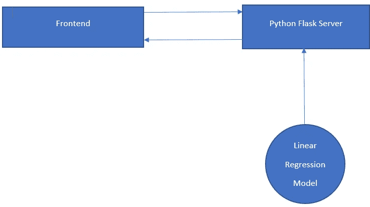

应用程序的架构

## 数据科学

第一步是典型的数据科学工作，我们从 Kaggle 获取一个名为“ [Bengaluru 房价数据](https://www.kaggle.com/amitabhajoy/bengaluru-house-price-data)”的数据集。我们将对它执行一些广泛的数据清理工作，以确保它在预测过程中给出准确的结果。

这个名为'[realestepricepredictor . ipynb](https://github.com/K-G-PRAJWAL/Data-Science-Projects/blob/master/Real%20Estate%20Price%20Prediction/model/RealEstatePricePredictor.ipynb)'的 jupyter 笔记本是我们执行所有数据科学相关工作的地方。因为 jupyter 笔记本是不言自明的，所以我将简要地谈一下我所实现的概念。我们的数据集需要大量的数据清理工作。事实上，笔记本 70%的内容都是关于数据清理的，我们删除空行，删除对预测没有帮助的不必要的列。

下一步是特征工程，即从数据集中提取对成功预测贡献最大的有用和重要信息的过程。

最后一步是处理异常值。异常值是对数据和预测造成巨大破坏的异常现象。从逻辑上来说，要从数据集中发现并去除这些异常值，需要了解很多东西。

同样，所有这些都已经在 jupyter 笔记本中解释过了。

最终，原始数据集从大约 13000 行和 9 列减少到大约 7000 行和 5 列。

## 机器学习

获得的最终数据服从于机器学习模型。我们将主要使用 K-fold 交叉验证和 GridSearchCV 技术来执行超参数调整，以获得模型的最佳算法和参数。

结果表明，线性回归模型为我们的数据提供了最好的结果，得分超过 80%，这还不错。

现在，我们的模型需要导出到一个 pickle 文件([Bengal uru _ House _ data . pickle](https://github.com/K-G-PRAJWAL/Data-Science-Projects/blob/master/Real%20Estate%20Price%20Prediction/model/Bengaluru_House_Data.pickle))中，该文件将 python 对象转换成字符流。此外，我们需要将位置(列)导出到一个 json( [列. json](https://github.com/K-G-PRAJWAL/Data-Science-Projects/blob/master/Real%20Estate%20Price%20Prediction/model/columns.json) )文件中，以便能够从前端与它进行交互。

## 计算机网络服务器

我们将使用 Flask 服务器作为我们的后端来本地托管应用程序。在服务器文件夹中，我们将建立两个文件:

*   [server.py](https://github.com/K-G-PRAJWAL/Data-Science-Projects/blob/master/Real%20Estate%20Price%20Prediction/server/server.py)

server.py 文件将负责处理获取位置名称和预测房价的路径。它还从前端获取表单数据，并将其馈送给 util.py。这些路线可以使用 [Postman](https://www.postman.com/) app 进行测试。

*   [util.py](https://github.com/K-G-PRAJWAL/Data-Science-Projects/blob/master/Real%20Estate%20Price%20Prediction/server/util.py)

util.py 文件是后端的主脑。它有一个加载 JSON 和 pickle 文件的函数。该文件采用来自 server.py 的表单数据，并使用该模型来预测房产的估计价格。

## 前端

前端由简单的 [HTML](https://github.com/K-G-PRAJWAL/Data-Science-Projects/blob/master/Real%20Estate%20Price%20Prediction/client/index.html) 、 [CSS](https://github.com/K-G-PRAJWAL/Data-Science-Projects/blob/master/Real%20Estate%20Price%20Prediction/client/styles.css) 和 [JavaScript](https://github.com/K-G-PRAJWAL/Data-Science-Projects/blob/master/Real%20Estate%20Price%20Prediction/client/script.js) 组成。用户可以在表格中选择平方英尺的面积，BHK，浴室和位置的数量，并点击“估计”按钮，以获得估计的价格。JavaScript 文件负责与后端 flask 服务器路由和前端 HTML 交互。它获取用户填写的表单数据，并调用使用预测模型的函数，以 10 万卢比(10 万卢比= 100000)来呈现估计价格。

# 结果

让我们看看我们的项目是如何运作的。在后台运行 server.py 文件，打开我们创建的 HTML 网页。输入房产的面积(平方英尺)、BHK 的数量、浴室的数量和位置，然后点击“估算”。😲耶！我们预测了某人梦想中的房子的价格。

# 奖励—部署

这一部分相当棘手，所以请务必跟着我做每一步。

到目前为止，该项目只是本地的，我们将学习如何使用 AWS EC2 实例将应用程序部署到 web。

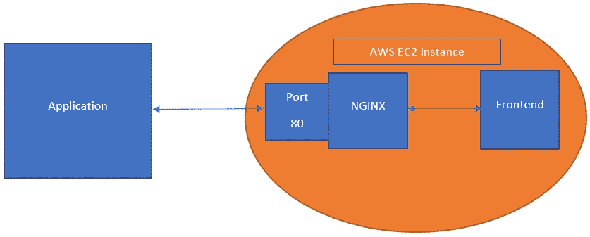

体系结构

我们将使用 nginx，它是一个可以服务 HTTP 请求的 web 服务器。nginx 可以与我们的 Flask 服务器交互。

从[这里](https://nginx.org/en/download.html)下载 nginx 并安装。

*   **步骤 1:** 为了进行估算，在 script.js 文件中，最初我们有这两行:

```
var url = "http://127.0.0.1:5000/predict_home_price";
var url = "http://127.0.0.1:5000/get_location_names";
```

这两行只是为了在本地运行我们的应用程序，现在我们必须将这两行改为:

```
*var url = "/api/predict_home_price";
var url = "/api/get_location_names";*
```

我们需要在 nginx 服务器上配置反向代理，以便所有对'/api '的请求只被路由到端口 5000。

*   **第二步:**登录您的 [AWS 控制台](https://aws.amazon.com/console/)。您需要知道如何免费启动 AWS EC2 实例[。在按照步骤 6 启动实例时，请确保添加 HTTP 和 HTTPS 请求类型，以确保人们可以访问您的网站。](https://aws.amazon.com/premiumsupport/knowledge-center/free-tier-windows-instance/)

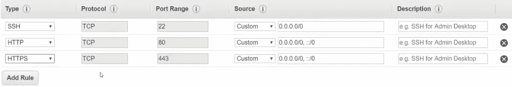

*   **第三步:**创建新的密钥对，输入名称，下载密钥(。pem 文件)并启动 EC2 实例。

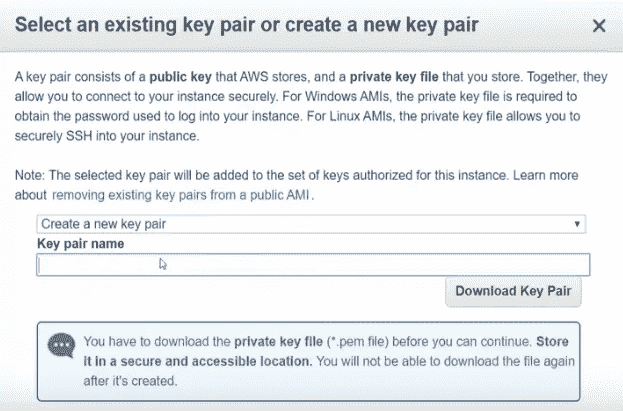

*   **步骤 4:** 点击“启动实例”旁边的“连接”选项，在“示例”下会有一个命令。

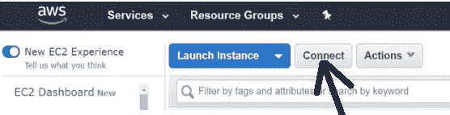

复制此命令。它看起来会像这样。

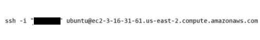

*   **步骤 5:** 打开 bash shell 并粘贴这个命令，但是用下载的 pem 文件的路径替换涂黑的区域。

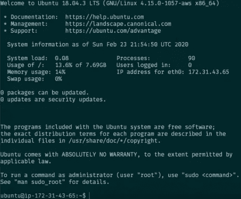

现在，您已经连接到 AWS cloud 上的 Linux 机器。

*   **步骤 6:** 现在你需要使用 [WinSCP](https://winscp.net/eng/index.php) 将你的项目复制到那个虚拟机上。下载并启动 WinSCP。

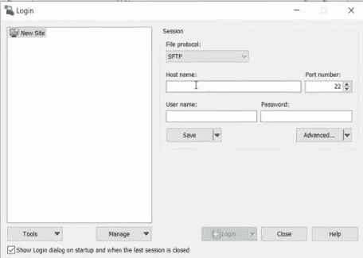

*   **第 7 步:**在您的 AWS 上，如果我们再次单击“连接”，在“示例”上方会出现一个命令，类似于:


将此复制到您的 WinSCP 主机名，因为这是您的虚拟机的主机名。

*   **第七步:**用户名为' **ubuntu** '。在输入密码之前，我们需要将。pem 文件放入。使用 PuTTYgen 的 ppk 文件。请从这个[链接](https://www.puttygen.com/)下载 PuTTYgen。
*   单击密码字段下的“高级”按钮。选择下载的。pem 文件，它将打开 PuTTYgen 来转换。pem 文件到。ppk 文件。选择新的。ppk，然后单击“确定”。

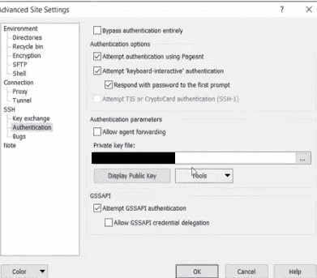

*   点击“登录”。
*   将您的整个根项目文件夹(RealEstatePricePrediction)从您的机器复制到云服务器。

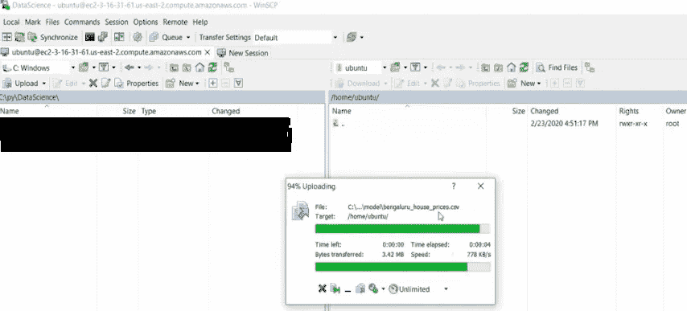

*   在服务器的 ubuntu shell 上执行以下命令:

```
sudo apt-get update
sudo apt-get install nginx
```

*   将我们之前看到的“连接”对话框中的主机名复制粘贴到浏览器中。

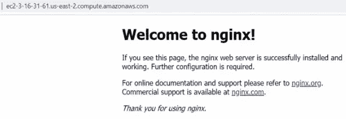

你应该会看到 nginx 运行的主页。

*   **步骤 8:** 执行以下命令:

```
cd /etc/nginx/sites-enabled/
sudo unlink default
cd ../sites-available/
sudo vim BengaluruHousePrediction.conf
```

将下面的代码复制粘贴到。会议文件。这是反向代理设置。

```
server {
    listen 80;
        server_name BegaluruHousePrediction;
        root /home/ubuntu/RealEstatePricePrediction/client;
        index index.html;
        location /api/ {
            rewrite ^/api(.*) $1 break;
            proxy_pass [http://127.0.0.1:5000;](http://127.0.0.1:5000;)
        }
}
```

*   退出 vim 并执行以下命令:

```
cd ../sites-enabled/
ln -v -s /etc/nginx/sites-available/BengaluruHousePrediction.conf inside /etc/nginx/sites-enabled
```

我们在上面的命令中所做的是建立一个符号链接。

*   使用以下命令重新启动服务器:

```
sudo service nginx restart
```

*   使用以下方式检查状态:

```
sudo service nginx status
```

*   转到您的浏览器，在 url 中输入主机名链接。您应该看到您的应用程序前端加载，但后端还没有工作。
*   **第 9 步:**返回终端，键入:

```
cd ~
cd RealEstatePricePrediction/server/
sudo apt-get python3-pip
sudo pip3 install Flask
sudo pip3 install scikit-learn
sudo pip3 install numpy
```

*   使用以下方式启动后端服务器:

```
 python server.py
```

您的应用程序现已在互联网上运行，可从世界任何地方访问。

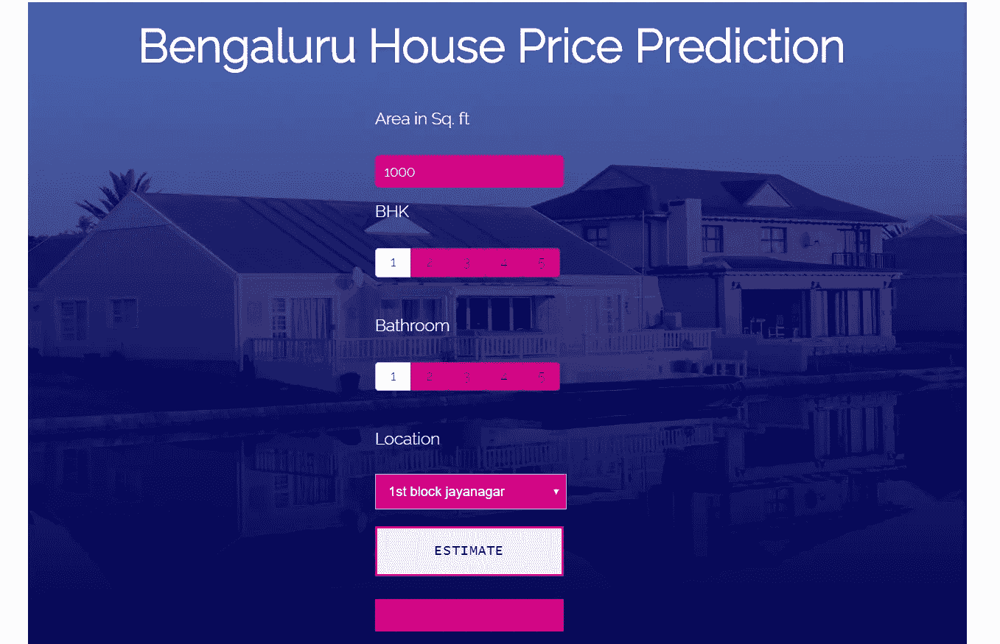

我知道部署阶段有点艰难。如果你遇到任何问题，可以通过我的 LinkedIn 联系我。在我的 [GitHub](https://github.com/K-G-PRAJWAL/Data-Science-Projects/tree/master/Real%20Estate%20Price%20Prediction) 上随意检查整个代码库。

我希望你们都明白并学到了很多东西。

**谢谢 ！**