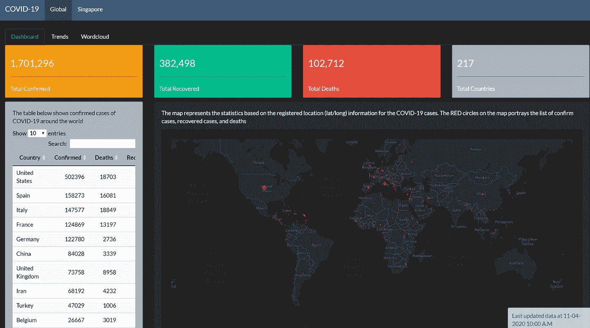

# 数据科学家的数据架构指南

> 原文：<https://towardsdatascience.com/a-data-scientists-guide-to-data-architecture-bac00b0913f?source=collection_archive---------23----------------------->

## 构建强大的数据流程需要了解的内容

# 第 1 部分—基于一家主要保险公司的案例研究

> 你应该总是准备你自己的数据。

这句话来自人工智能领域的一位高管，几年前我问他对数据的看法。

他不是唯一有这种想法的人。在我的第一份工作中，部门主管不信任另一个团队来构建数据管道，最终自己编写了很大一部分 ETL 代码，并让数据团队直接向他汇报。

为什么这些高管如此重视数据？

因为如果没有很好地掌握数据，你就不会(也不应该)对你从数据中得出的见解和建议有太多信心。

对于从原始形式一直到准备好进行分析的数据，它经历了许多过程。一名优秀的数据科学家必须坚持不懈地质疑流程的每一步，并提出如下问题:

*   是否收集了正确的数据？
*   数据质量怎么样？
*   端到端的数据流程是怎样的？

本文的目的是使用真实世界的例子来浏览一些与数据架构相关的主题，这样您就有了一些基本的背景知识，并且知道应该向您的数据团队提出什么问题。

照片由 [JJ 英](https://unsplash.com/@jjying?utm_source=unsplash&utm_medium=referral&utm_content=creditCopyText)在 [Unsplash](https://unsplash.com/s/photos/pipeline?utm_source=unsplash&utm_medium=referral&utm_content=creditCopyText)

# 生产与暂存

如前所述，我的职业生涯始于为一家大型保险公司工作，在一个所有数据处理都由我们自己完成的团队中。

每个月，我们都会从生产数据库中取出一长串表的副本，并将其放在我们的 SQL server 上，我们称之为临时数据库。

> **生产数据库**:各部门用于实时管理保单和理赔的交易数据库。
> 
> **暂存数据库**:这是用于各种分析工作的生产数据库的快照。通常情况下，快照每月拍摄一次，但有时会根据临时请求更频繁地拍摄。

临时数据库的目的是为了不干扰正常的业务运营。

这种情况不应该发生，但由于数据连接设置问题，确实发生过一次。我们每 5 分钟就接到 IT 部门的电话，因为每个人都在抱怨系统冻结了…

对于分析团队来说，暂存环境是安全的。此外，只要对临时数据库运行代码，就一定会得到相同的结果。

# 规范化与非规范化表

一旦所有的表都被复制到临时数据库中，我们就执行一系列的数据处理步骤，将这些表转换成一些非规范化的表。

生产系统中的原始表称为规范化表，这是关系数据库背后的核心概念。每个表包含不同事物的数据，可以通过主键和外键链接在一起。

一个关系数据库的例子。omnisi.com[礼貌](https://www.omnisci.com/technical-glossary/relational-database)

出于分析的目的，在获得有用的东西之前，需要大量的表连接。

例如，假设您想要预测在给定建筑物特征的情况下获得建筑物保险索赔的概率。理想情况下，你需要一个平的桌子

*   目标是一个“是/否”标志，表示是否有索赔
*   这些特征/预测因素包括保险金额、建筑年龄、郊区等。

要创建平面表，您需要将索赔表(告诉您是否有索赔)、保险单表(包含保险单信息)和风险表(包含建筑物信息)连接在一起。

这个过程叫做**反规格化**。结果是一个**反规格化的**或**平面表**，其中的数据被很好地组织起来并准备好进行分析。

雷蒙德·拉斯姆森在 [Unsplash](https://unsplash.com/s/photos/organised?utm_source=unsplash&utm_medium=referral&utm_content=creditCopyText) 上拍摄的照片

# 反规范化过程的陷阱

你可能认为这没什么大不了的。我们只需要执行一些连接就可以了，不是吗？什么会出错？

很多事情都会出错。您可能有重复的记录。您可能会无意中获得或丢失记录。

这是我开始第一份工作时被告知要做的，我相信我今天仍然受益于这些好习惯。

*   在每次连接之前，检查 by 变量的唯一性
*   我们在做什么样的加入？我们在做左连接、右连接、内连接还是外/笛卡尔连接？
*   我们从多少记录开始，每一步我们获得/失去了多少记录？

如果我们跳过这些步骤，我们可能会浪费更多的时间。这是我在许多不同的项目中反复学到的一课。

劳尔·纳杰拉在 [Unsplash](https://unsplash.com/s/photos/danger?utm_source=unsplash&utm_medium=referral&utm_content=creditCopyText) 上的照片

# 交付核心数据集

经过大量努力，我们最终得到了满足整个团队需求的几个核心表，包括:

*   策略标题:每个策略一行，显示关于该策略的最新信息
*   风险标题:每个风险占一行，显示关于该风险的最新信息(如建筑物或汽车)。每份保单下可能有多种风险。
*   索赔标题每份保单一行，显示保单的最新信息

这些都是平面表，每月生产一次，放在一个公共服务器上。无论谁需要做任何分析，只要复制这些平面表，就知道数据是可信的。

# 抽取、转换、加载至目的端（extract-transform-load 的缩写）

ETL 代表 **E** 提取， **T** 转换， **L** oad。这听起来可能有点不可思议，但是你已经看到了这个过程。“提取”是指我们将数据从生产数据库复制到临时数据库。“加载”是指我们交付最终核心数据集的时间。“转换”是介于两者之间的所有工作。

# 数据完整性检查

在整个过程中，我们每一步都进行了可靠的数据检查:

*   当将数据从生产数据库复制到临时数据库时，我们会对总记录数和金额进行调节。
*   在转换的每个阶段，我们跟踪有多少数据流入不同的桶(我们保留的和我们丢弃的，如果有的话)。
*   我们根据财务部门提供的总账核对核心数据集中的保费、索赔支付金额和案例估计。必须调查大的移动。
*   我们将本月的值与上月的值进行比较，以发现任何重大变化。
*   我们使用仪表板来检测任何异常的分布变化。

当时，大部分数据完整性检查，以及最初的 ETL 过程都是用 SAS 程序编写的。通常，添加这些检查后，SAS 程序的大小会增加 3 倍。

的确，检查比做更费力气！

这值得吗？绝对的。

团队中的每个人都可以拿起数据集，并立即自信地使用它，因为知道它已经被检查过了。

Joshua Hoehne 在 [Unsplash](https://unsplash.com/s/photos/confidence?utm_source=unsplash&utm_medium=referral&utm_content=creditCopyText) 上拍摄的照片

# 了解数据是如何创建的

除了强大的数据检查之外，我们还花了很多时间学习数据最初是如何生成的。

这是通过每天与输入数据的人坐在一起完成的。在我们的例子中，销售部门负责保单数据，理赔部门负责理赔数据。

我们坐在一线员工旁边，听他们回答客户的问题，将数据输入系统。我们尽力去理解他们是如何工作的，并积累了大量的领域专业知识。查看 [**这篇文章**](/domain-expertise-why-is-it-important-for-data-scientists-2d6a406d544d) 是我写的关于建立领域专业知识重要性的文章。

# 数据质量反馈回路

虽然上述过程可能有助于检测数据质量问题，但它并不能解决这些问题。这就是为什么需要一个反馈回路。

每个月，我们都会发布一组数据质量报告，并与管理团队分享。我们寻找的一些东西是

*   缺失或可疑的地址
*   出生日期

数据质量绩效与员工的 KPI 相关联，并构成驱动其薪酬的指标的一部分。这为每个人关心数据质量提供了强大的激励。

没有公司高级管理层的支持，这是不可能的。我认为，数据驱动的决策文化永远无法自下而上驱动。它需要自上而下。

# 第二部分——街区的新成员

到目前为止，我已经解释了传统的方法。我们当时用的是 SAS。人们没有使用数据工程师或数据科学家这个词。如今，很多事情都变了，但这些概念仍然适用。

接下来，我将讨论几个近年来变得越来越重要的话题。

# 内部与外部数据

从 IT 系统中提取的数据称为内部数据，因为它是内部生成的。

外部数据非常强大，可以极大地丰富和补充内部数据。外部数据的类型因上下文而异。

对于建筑保险，以下是一些可以使用的外部数据示例:

*   显示每个地区人口统计信息的普查数据
*   显示犯罪率的警方数据
*   建筑信息
*   卫星图像和高分辨率航空地图
*   国家洪水地图
*   气象资料

就汽车保险而言，以下是一些可以使用的额外外部数据示例:

*   车辆信息
*   驾驶行为/远程信息处理数据

# 结构化与非结构化数据

上面讨论的大多数数据都是结构化数据。非结构化数据的示例包括:

*   索赔描述——使用自然语言处理，我们可以得出客户情绪等特征
*   卫星图像——通过图像识别，我们可以推断出一些特征，比如游泳池的存在

如您所见，非结构化数据通常需要一些额外的处理才能对我们的任务有用，例如保险风险建模。

# 实时分析

到目前为止，我只讨论了批处理。ETL 过程至少需要 2-3 天。再加上几天的分析时间，至少在数据可用一周后，你才会有任何产出。

实时分析则不同。数据一进来，就被处理和分析。

你能想象你买一件商品的那一刻，亚马逊对你说:

> “尊敬的客户，感谢您的购买。请等一周，我们会推荐一些您感兴趣的产品。”

这从来没有发生过。他们会立即提供推荐。这使得他们从 Amazon.com 的推荐中获得 35%的收入。

实时分析通常属于数据工程师的领域。以新冠肺炎为例，这些是我创建的基于批处理的静态仪表板结果。更新结果是一件痛苦的事。当我发表这些文章时，这些数字已经过时了。

[*冠状病毒(新冠肺炎)疫情状态更新*](https://medium.com/@zemingyu/status-update-of-the-coronavirus-covid-19-outbreak-31da9389b04a)*—3 月 17 日发布*

[*冠状病毒(新冠肺炎)疫情状态更新*](https://medium.com/@zemingyu/state-of-the-coronavirus-outbreak-in-10-charts-and-key-findings-721f62c08a9e)*—2 月 29 日发布*

[*冠状病毒爆发—大数据五问*](/coronavirus-outbreak-5-questions-to-ask-big-data-3550794d2fe9)*—2 月 1 日发表*

将上述内容与[互动仪表盘](https://da-team-sg.shinyapps.io/covid-19/)进行比较，该仪表盘显示了自 1 月下旬以来新冠肺炎病毒在全球尤其是新加坡的传播情况。当新数据进来时，整个过程自动发生。

慕尼黑再保险 SG 分析团队制作的交互式仪表盘

真实世界的分析会在最需要的时候提供结果——谁会关心一周前的新冠肺炎数据呢？

让我们把同样的逻辑应用到保险领域。为什么保险公司的首席执行官要关心 3 个月前的销售额或损失率？然而，今天大多数保险公司仍然使用月度或季度报告。

除了实时欺诈分析等一些例外情况，保险业在采用这些新技术方面往往较为缓慢。随着像 R-Shiny 和 Dash 这样的工具使部署实时分析变得更加容易和经济实惠，我预计它在不久的将来会获得动力。

# 结论

在数据科学世界里，有很多性感的话题——人工智能、深度学习、大数据……

数据架构不是这些性感的话题之一。公司高管永远不会通过说“我们已经建立了世界级的数据完整性检查”来吸引任何媒体的注意。这是艰苦的工作。做好这件事需要很大的自律。然而，如果你真的成功了，它可能会比那些性感的话题更有价值。

作为一名数据科学家，花一些时间学习这些概念是值得的，这样您就可以与您的数据团队有效地沟通，并确保您拥有一个强大的数据流程，为您的所有分析工作奠定坚实的基础。