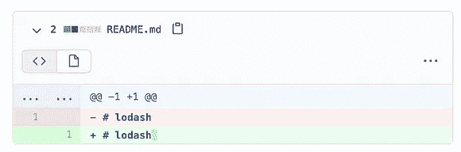
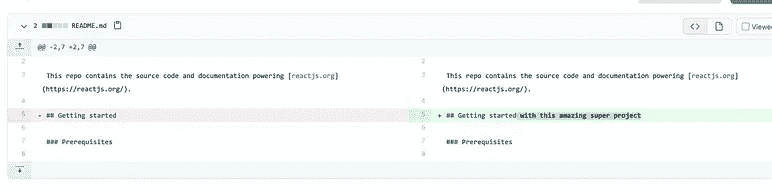
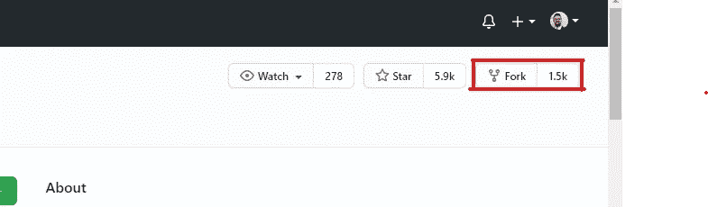
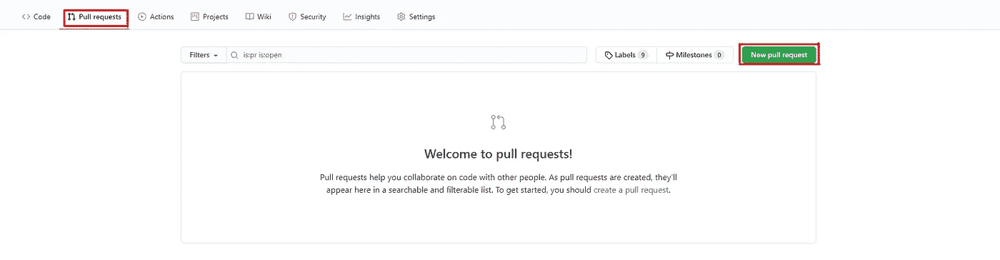
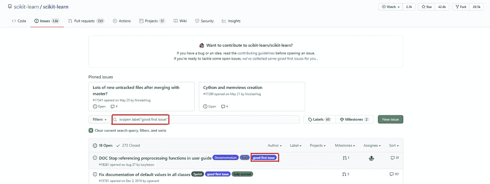

# 黑客啤酒节数据科学家指南

> 原文：<https://towardsdatascience.com/a-data-scientists-guide-to-hacktoberfest-8135b8bf2c01?source=collection_archive---------67----------------------->

## 如何对开源做出有意义的贡献

Justin Jairam 摄自 [@jusspreme](https://www.instagram.com/jusspreme/?hl=en) (经允许)

# 什么是 Hacktoberfest

开源项目是数据行业的支柱，没有它们，熊猫、Numpy Sci-kit Learn 和整个大数据 Apache 堆栈等项目就不会存在。Hacktoberfest 是一个为期一个月的活动，开发者可以在 Github 上贡献开源项目，并获得免费赠品。要有资格获得免费赠品，您必须提交四个成功的项目拉请求，这些项目都选择了 Hacktoberfest。为了尝试并轻松获得免费赠品，一些贡献者提交了无意义的贡献，导致项目维护者不高兴。

无意义的贡献示例

在本帖中，我们将讨论如何回馈社区，为开源项目做出有意义的贡献。

# 我是如何进入开源领域的

我第一次接触开源是在我参与两个项目的时候，[解释](https://github.com/interpretml/interpret)和[熊猫-总结](https://github.com/mouradmourafiq/pandas-summary)。在这两种情况下，项目的使用并没有完全覆盖我的用例，尽管它们非常小。

使用 interpret，我试图使用库来解释/解释 Sklearn 分类器。潜在的问题是`.predict`方法返回一个整数(0，1，等等。)用于分类器。当这些整数值用于计算 Morris 敏感度时，会抛出一个错误，指出数据必须是一个`float`。在这种情况下，[修复很简单](https://github.com/interpretml/interpret/pull/64)——将 Sklearn 分类器返回的整数转换为浮点数！在修复之前，任何试图解释 Sklearn 分类器的人都会得到一个错误，这个简单的贡献允许所有用户解释 Sklearn 分类模型。

对于 pandas-summary，我使用这个库来自动化列数据的描述和统计分析。唯一的问题是，每次我使用这个库时，总会绘制一个直方图，这很讨厌。作为对生活质量的修正，我[添加了一个简单的标志](https://github.com/mouradmourafiq/pandas-summary/pull/20)，用户可以指定他们是否想要绘制直方图。

我的前两个贡献没什么特别的，也很简单，但是从这两个贡献中，我学到了如何向远程项目发出拉请求、遵循贡献指南以及通过 Github、Slack 等与项目维护者互动和交流的基本知识。

从那以后，我成为了 [pandas-bokeh](https://github.com/PatrikHlobil/Pandas-Bokeh) 库的主要贡献者，为[interact](https://github.com/nteract/nteract)贡献了错误修复和 UI 改进，并为 [Prefect](https://github.com/PrefectHQ/prefect) 添加了主要的功能集成。

# 技巧

## 了解如何提出拉取请求

拉请求是将您的代码贡献给项目的一种方法。首先，找到一个你想参与的项目，点击项目页面右上角的`fork`按钮，开始这个项目。这将在您的存储库下创建一个当前状态的项目副本。

一旦您分叉了项目，导航到 Github 中您的项目下的存储库。在项目名称下应该显示`forked from ...`。

将分叉的项目克隆到您的本地计算机上。

为你的变更或 bug 修复创建新的分支:`git checkout -b your_branch_name`。

做出你的改变，按照项目的贡献指南提交它们。

将您的更改推送到分叉的项目存储库:`git push -u origin your_branch_name`。

导航到分叉存储库项目页面。您将看到创建拉取请求的提示。如果您没有导航到 pull requests 选项卡并从那里通过选择`New Pull Request`创建一个。

填写“拉”请求模板(如果有)，或者填写相关指南中概述的模板。一旦完成，你的拉动请求就可以开始了，等待反馈！

## 从你经常使用的图书馆开始，无论大小

第一个开源贡献的第一步是选择一个你想贡献的项目。我经历过的最好的方法是为你经常使用或正在积极使用的项目做贡献。如果你已经广泛地使用了一个项目，你可能会遇到一些会提高项目质量的 bug 或增强。这就是我如何开始我的开源之旅的，通过尝试改进我日常使用的项目。

## 看看现有的 Github 问题

如果你正在寻找一个问题或者为一个项目做贡献的方法，一个好的起点是 Github 的内置`Issues`标签。这是用户和项目维护人员可以记录错误和特性增强的地方。项目维护人员将仔细检查这些问题并标记它们，收集更多信息，添加元数据等。他们将添加的标签之一是“好的第一个问题”标签，以通知潜在的贡献者，这个问题对于第一次贡献者或项目的新贡献者是好的。

这些问题推荐给那些对开放源码或项目本身不熟悉的贡献者，以帮助他们开始并做出贡献。如果您找不到自己要修复的 bug 或要添加的增强功能，请利用这些工具。

## 阅读投稿指南

没有什么比投入所有这些寻找项目、隔离 bug 或开发新功能的工作更糟糕的了，因为你没有遵循编码、格式化或提交消息标准，它被拒绝或甚至没有被关注。好消息是所有这些都是可用的，通常在项目自述文件的贡献部分或项目的贡献指南部分。当您创建一个拉请求时，项目通常会运行自动格式检查，并且在这些基本检查通过之前，您的拉请求通常不会被查看。

如果你没有看到贡献部分或者一个项目没有贡献指南，不要想做什么就做什么。1)尽可能地遵循项目中的编码和文档风格。2)遵循编码和文档最佳实践。

## 每一份贡献都很重要

开源的每一项贡献都很重要，无论大小。无论是从可用性的角度还是从阅读文档的角度来看，如果你正在经历一个项目的 bug 或抱怨，其他人也会经历。文档是开源软件的重要组成部分，因为每个项目都需要它。当你开始了解一个项目是关于什么的时候，这通常是开始为一个项目做贡献的好地方。它提供了设计决策和项目考虑的背景信息，这反过来将帮助您理解代码。

文档是用户查找信息的第一个地方，一个项目的文档越完整，它的用户群就越多。开发人员喜欢文档化的项目，当一个项目没有文档，或者文档很差时，开发人员在将它添加到他们的工作流程之前会三思。添加文档或修复哪怕是最小的 bug 都可能影响成百上千每天使用该项目的用户，许多人会为此感谢你。

# 接下来会发生什么

你的贡献很少会马上被合并。几天之内，项目团队会有人对他们的反馈进行评论，或者通知你他们正在审查你的拉动式需求。处理评论，提出问题，澄清你不明白的地方，提出修改建议，如果有的话，你的修改很快就会被合并！

如果你在一周内没有收到任何关于你的拉请求的反馈，给项目维护者发信息，礼貌地询问他们状态如何。在较大的项目中，经常有大量的拉请求，他们可能已经忘记了拉请求，或者还没有抽出时间来检查它。

如果此时你还没有收到回复，这并不经常发生(在我身上从来没有发生过)，从这个项目中吸取技能和学习点，继续下一个项目。一旦你提出了拉取请求，并通知了项目维护人员，剩下的就不在你的掌控之中了。这是开源唯一真正令人遗憾的地方，也是你不应该放在心上的地方。

# 利益

## 成为更好的工程师或科学家

无论你是数据工程师、ML 工程师还是数据科学家，贡献开源都有助于你在自己的领域变得更好、进步。从了解项目是如何构建和组织的，到深入了解关键库，导航大型代码库，编写生产级代码，甚至是学习解决问题的新方法。所有这些技能将直接转化为你的职业或你的下一个项目。

## 结识新的工程师、开发人员和科学家

为开源做贡献的最大好处是有机会与那些创造了一个被全世界成千上万人使用的工具的人一起工作和互动。你可以直接看到他们是如何创造一个解决方案来解决一个普遍问题的。此外，你们最终可能会联系起来，互相交换想法，并在未来的项目上合作。就我个人而言，我已经和我参与过的项目的维护人员取得了联系，并在 Twitter 和 LinkedIn 上与他们保持联系。

# 结论

今天，你可能不能贡献一个新的特性，但是在项目周围，阅读代码，阅读文档，所有这些都会给你对项目的洞察力。从那里，对文档的一个小贡献，可能会导致一个被记录的 bug 修复，这导致对项目的更高理解，然后导致你的第一个特性。

这个故事的寓意是，尽你所能地做出贡献，最终你会达到开发新功能的目标，开始你自己的操作系统项目，甚至成为一个项目的关键贡献者。

# 反馈

我鼓励任何人对我的帖子提出反馈。你可以在推特上给我发信息，或者在 sidhuashton@gmail.com 给我发电子邮件。