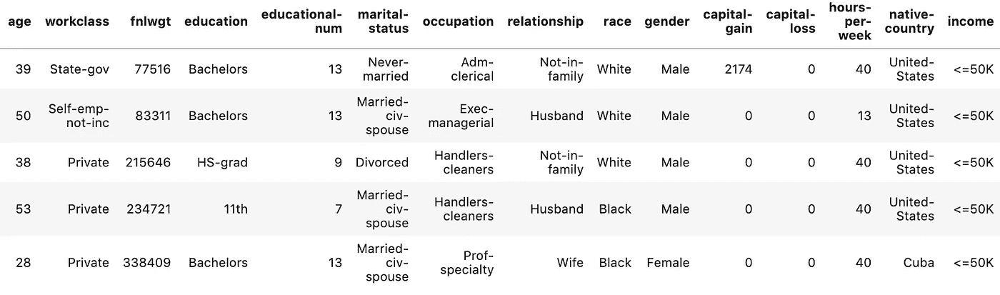
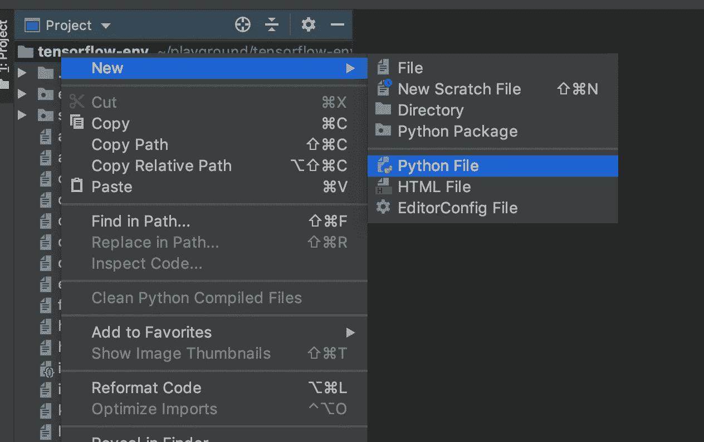
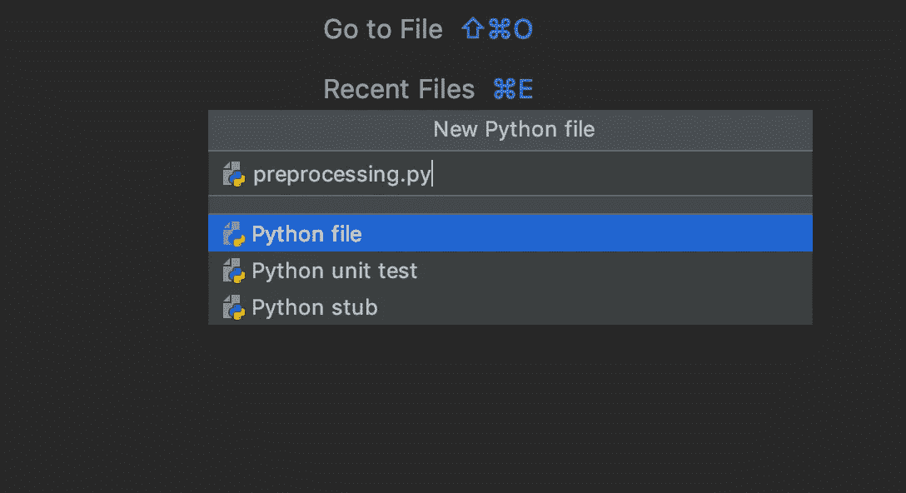
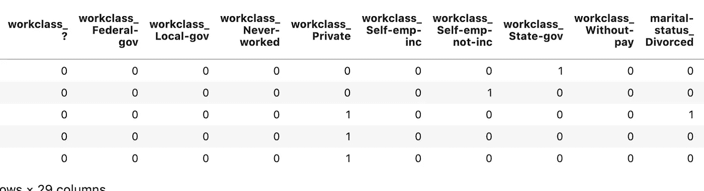
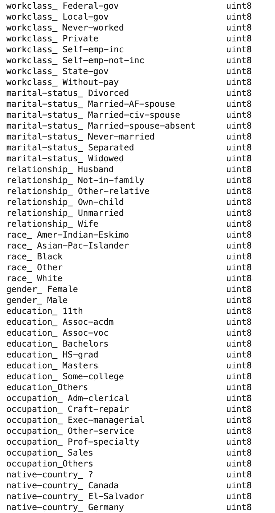
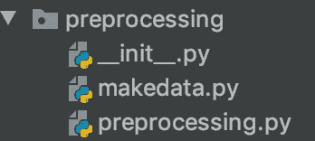
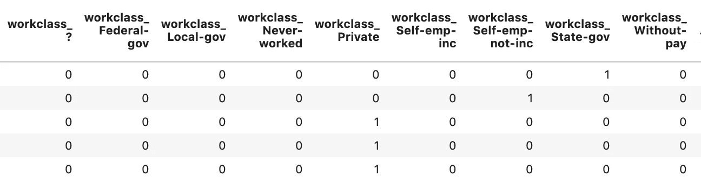

# Python 模块和包的数据科学家指南

> 原文：<https://towardsdatascience.com/a-data-scientists-guide-to-python-modules-and-packages-9193a861c26b?source=collection_archive---------14----------------------->


杰西·拉米雷斯在 Unsplash[拍摄的照片](https://unsplash.com/s/photos/package?utm_source=unsplash&utm_medium=referral&utm_content=creditCopyText)

## 如何创建、导入和使用您自己的 python 包

数据科学代码通常是非常线性的。从源中提取一些数据，应用一系列转换，然后执行一些分析、计算或训练模型。然而，为了可读性、效率和可重复性，模块化和打包代码对于重用和协作是有用的。

当我第一次开始学习数据科学编程时，我发现很难找到创建模块和包的简单解释和教程，特别是对于数据科学项目。在这篇文章中，我将给出一个非常简单的教程，介绍如何为数据科学和机器学习项目创建和使用自己的包和模块。

在整篇文章中，我将使用可以从 [UCI 机器学习库](https://archive.ics.uci.edu/ml/datasets/Adult)下载的成人数据集。这是一个通常用于建立分类机器学习模型的数据集，其目标是预测给定的成年人每年是否会赚超过 5 万美元。

## 模块的数据科学用例

python 模块只是一组 python 操作，通常是函数，放在一个带有`.py`扩展名的文件中。然后，这个文件可以导入到 Jupyter 笔记本、IPython shell 或其他模块中，以便在您的项目中使用。

让我们看一个例子。

在下面的代码中，我已经阅读了 CSV 文件，我将使用熊猫。

```
import pandas as pddata = pd.read_csv('adults_data.csv')
data.head()
```



该数据集包含大量分类特征。如果我们打算用它来训练一个机器学习模型，我们首先需要进行一些预处理。

分析完这些数据后，我决定在训练模型之前采取以下步骤对数据进行预处理。

*   一次性编码下列栏目:工作类，婚姻状况，关系，种族和性别。
*   取最常出现的值，将剩余的值分组为“其他”，并对结果特征进行一次性编码。这将需要为以下各列执行，因为它们具有大量的唯一值:教育、职业、本国。
*   缩放剩余的数值。

我们需要编写来执行这些任务的代码将会非常大。此外，这些都是我们可能希望多次执行的任务。为了使我们的代码更具可读性，并且能够轻松地重用它，我们可以将一系列函数编写到一个单独的文件中，该文件可以导入到我们的笔记本中使用——一个模块。

## 编写模块

要创建一个模块，你需要首先创建一个新的空白文本文件，并用扩展名`.py`保存。你可以使用一个普通的文本编辑器，但是很多人使用 IDE(集成开发环境)。IDE 为编写代码提供了许多额外的功能，包括编译代码、调试和与 Github 集成的工具。有许多不同类型的 IDE 可供使用，值得尝试几种，以找到最适合您的一种。我个人更喜欢 [PyCharm](https://www.jetbrains.com/pycharm/) ，所以我将在示例中使用它。

为了开始编写 python 模块，我将创建一个新的 python 文件。



我将它命名为`preprocessing.py`。



让我们在这个文件中编写我们的第一个预处理函数，并在 Jupyter 笔记本中测试导入和使用它。

我在`preprocessing.py`文件的顶部写了下面的代码。给代码添加注释是一个很好的做法，这样可以使代码更具可读性。我在下面的代码中添加了一些注释。

```
def one_hot_encoder(df, column_list):
    *"""Takes in a dataframe and a list of columns
    for pre-processing via one hot encoding"""* df_to_encode = df[column_list]
    df = pd.get_dummies(df_to_encode)
    return df
```

要将这个模块导入到 Jupyter 笔记本中，我们只需编写以下代码。

```
import preprocessing as pr
```

IPython 有一个方便的神奇扩展，叫做`autoreload`。如果您在导入之前添加了以下代码，那么如果您对模块文件进行了任何更改，这些更改将自动反映在笔记本中。

```
%load_ext autoreload
%autoreload 2import preprocessing as pr
```

让我们测试使用它来预处理一些数据。

```
cols = ['workclass', 'marital-status', 'relationship', 'race', 'gender']one_hot_df = pr.one_hot_encoder(data, cols)
```



现在我们将剩余的预处理函数添加到我们的`preprocessing.py`文件中。

```
def one_hot_encoder(df, column_list):
    *"""Takes in a dataframe and a list of columns
    for pre-processing via one hot encoding returns
    a dataframe of one hot encoded values"""* df_to_encode = df[column_list]
    df = pd.get_dummies(df_to_encode)
    return df

def reduce_uniques(df, column_threshold_dict):
    *"""Takes in a dataframe and a dictionary consisting
    of column name : value count threshold returns the original
    dataframe"""* for key, value in column_threshold_dict.items():
            counts = df[key].value_counts()
            others = set(counts[counts < value].index)
            df[key] = df[key].replace(list(others), 'Others')
            return df

def scale_data(df, column_list):
    *"""Takes in a dataframe and a list of column names to transform
     returns a dataframe of scaled values"""* df_to_scale = df[column_list]
    x = df_to_scale.values
    min_max_scaler = preprocessing.MinMaxScaler()
    x_scaled = min_max_scaler.fit_transform(x)
    df_to_scale = pd.DataFrame(x_scaled, columns=df_to_scale.columns)
    return df_to_scale
```

如果我们回到笔记本电脑，我们可以使用所有这些功能来转换数据。

```
import pandas as pd
from sklearn import preprocessing%load_ext autoreload
%autoreload 2import preprocessing as prone_hot_list = ['workclass', 'marital-status', 'relationship', 'race', 'gender']
reduce_uniques_dict = {'education' : 1000,'occupation' : 3000, 'native-country' : 100}
scale_data_list = data.select_dtypes(include=['int64', 'float64']).columnsone_hot_enc_df = pr.one_hot_encoder(data, one_hot_list)
reduce_uniques_df = pr.reduce_uniques(data, reduce_uniques_dict)
reduce_uniques_df = pr.one_hot_encoder(data, reduce_uniques_dict.keys())
scale_data_df = pr.scale_data(data, scale_data_list)final_data = pd.concat([one_hot_enc_df, reduce_uniques_df, scale_data_df], axis=1)final_data.dtypes
```

我们现在有了一个完全数值化的数据集，它适合于训练一个机器学习模型。



已转换列的快照

## 包装

在进行机器学习项目时，创建几个相关的模块并将它们打包以便一起安装和使用通常是理想的或者有时是必要的。

举个例子，在我的工作中，我目前正在使用一个名为 [AI 平台](https://cloud.google.com/ai-platform/)的机器学习模型的 Google Cloud 部署解决方案。该工具要求您将机器学习模型中的预处理、训练和预测步骤打包上传并安装在平台上，以部署最终模型。

python 包是包含模块、文件和子目录的目录。该目录需要包含一个名为`__init__.py`的文件。该文件表明它所在的目录应该被视为一个包，并指定应该导入的模块和函数。

我们将为预处理管道中的所有步骤创建一个包。__init__ 的内容。py 文件如下。

```
from .preprocessing import one_hot_encoder
from .preprocessing import reduce_uniques
from .preprocessing import scale_data
from .makedata import preprocess_data
```

同一个包中的模块可以导入到另一个模块中使用。我们将向我们的目录添加另一个名为 makedata.py 的模块，该模块使用 preprocessing.py 模块来执行数据转换，然后将最终数据集导出为 CSV 文件供以后使用。

```
import preprocessing as pr
import pandas as pd

def preprocess_data(df, one_hot_list, reduce_uniques_dict, scale_data_list, output_filename):
    one_hot_enc_df = pr.one_hot_encoder(data, one_hot_list)
    reduce_uniques_df = pr.reduce_uniques(data, reduce_uniques_dict)
    reduce_uniques_df = pr.one_hot_encoder(data, reduce_uniques_dict.keys())
    scale_data_df = pr.scale_data(data, scale_data_list)
    final_data = pd.concat([one_hot_enc_df, reduce_uniques_df, scale_data_df], axis=1)
    final_data.to_csv(output_filename)
```

新目录现在看起来像这样。



现在我们可以回到 Jupyter 笔记本，使用这个包来执行所有的预处理。我们的代码现在非常简单明了。

```
import pandas as pd%load_ext autoreload
%autoreload 2
import preprocessing as prdata = pd.read_csv('adults_data.csv')one_hot_list = ['workclass', 'marital-status', 'relationship', 'race', 'gender']
reduce_uniques_dict = {'education' : 1000,'occupation' : 3000, 'native-country' : 100}
scale_data_list = data.select_dtypes(include=['int64', 'float64']).columnspr.preprocess_data(data, one_hot_list, reduce_uniques_dict,scale_data_list, 'final_data.csv')
```

在我们当前的工作目录中，现在将有一个名为`final_data.csv`的新 CSV 文件，它包含预处理过的数据集。让我们回过头来检查几行，以确保我们的包按预期执行。

```
data_ = pd.read_csv('final_data.csv')
data.head()
```



在这篇文章中，我已经说明了在数据科学和机器学习项目中使用模块和包是如何提高代码的可读性和可重复性的。在我寻找这些过程的简单解释的过程中，我发现这个[博客帖子](https://timothybramlett.com/How_to_create_a_Python_Package_with___init__py.html)非常有用，并且很好地浏览了 [python 如你所愿](https://www.pythonlikeyoumeanit.com/Module5_OddsAndEnds/Modules_and_Packages.html)项目。

感谢阅读！