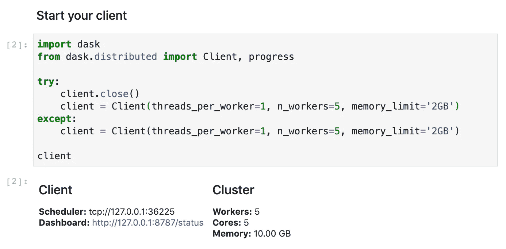
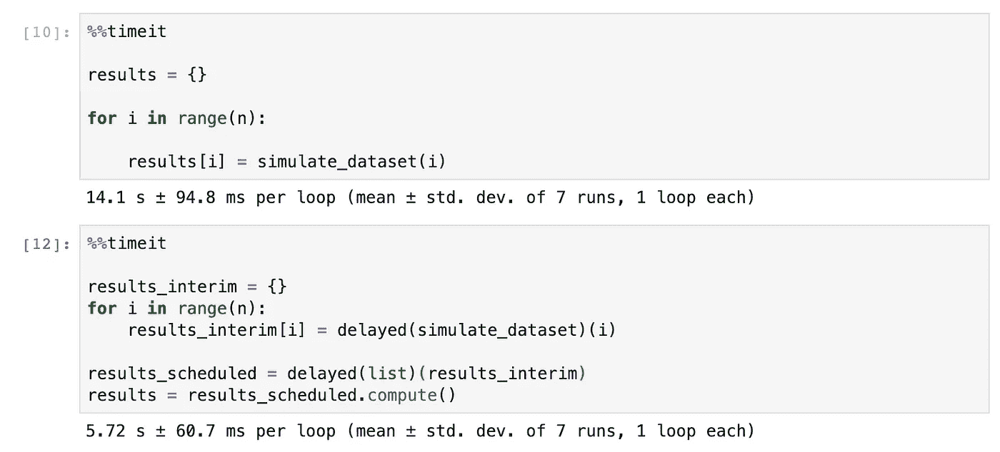
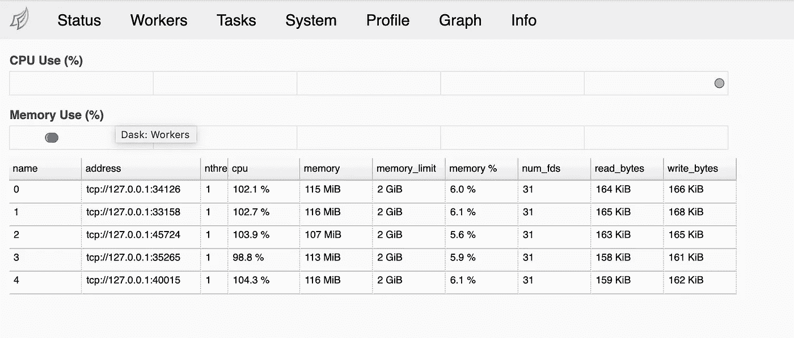
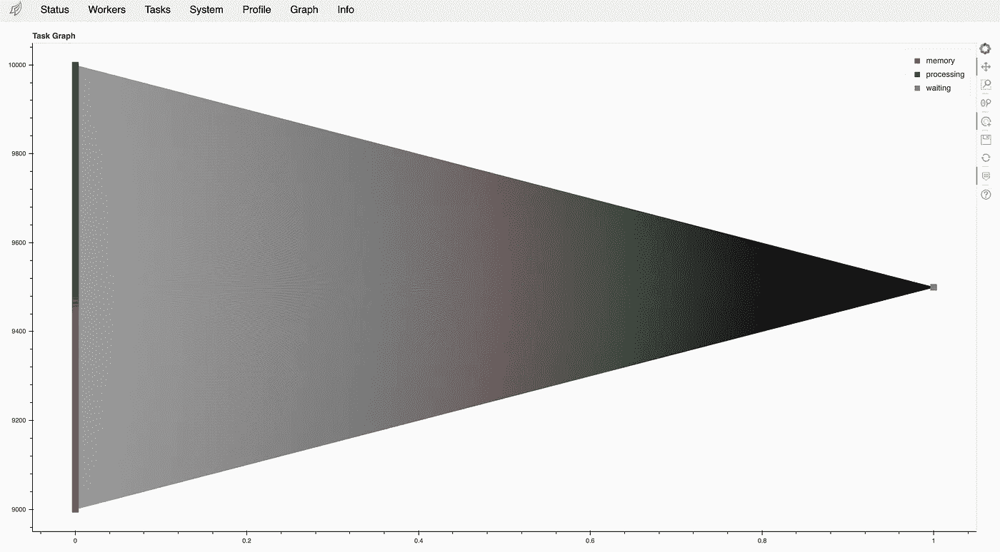
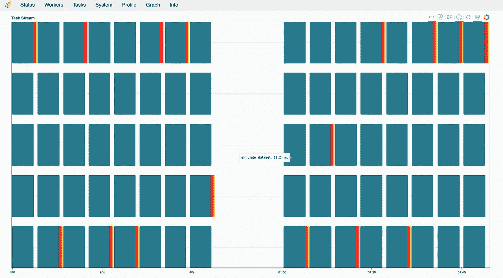

# 数据科学家对 Dask 并行计算的介绍

> 原文：<https://towardsdatascience.com/a-data-scientists-intro-to-parallel-computing-with-dask-4c1b4a464579?source=collection_archive---------11----------------------->

## 利用 Dask 并行化您的 Python 代码

在这篇文章中，我们讨论了利用 python 中的 [*Dask*](https://docs.dask.org) *的基础知识，使用它来执行一些简单的并行化任务(*令人尴尬的并行*)，了解一些最常见的可能用例(*数据管理、数据探索、机器学习*)，然后触及一些更复杂的工作流，这些工作流可以通过将不同的 ML 库与 *Dask* 相结合来构建。在这篇文章中，我们将重点关注运行一个令人尴尬的与 Dask* 并行的任务。

**什么是并行计算？**

你可能听说过这个短语，但是除了所有实际的复杂算法之外，它真正的核心含义是:你执行你想做的工作，这样多个步骤同时发生，而不是总是等待前一个任务完成。难度随着你实际想要完成的事情的性质而增加。

彼此独立的操作/任务，即除了每个任务的开始和结束之外，不存在任何数据依赖性——通常最容易并行化，并被称为*令人尴尬的并行* ***、*** ，而在开始和结束之间涉及大量数据传输/通信的任务则难以并行化。

> 作为一名数据科学家/分析师，您并不总是有足够的时间或所需的技能来思考如何并行化您的任务，并从头开始用其他语言实施解决方案，例如，花费数周、甚至数月时间来发现最佳的分组方式并不是您所期望的！

**什么是 *Dask* ？**

> Dask:在 Python 中并行化计算任务的框架

`Dask`是一个旨在帮助促进:

*   超大型数据集的数据管理，以及
*   跨大量内核(具有多个工作人员的本地集群)或物理计算机(具有多个节点的集群)的计算分布

它提供的功能类似于 Apache Spark 的[](https://spark.apache.org)*，但是它被紧密地集成到了`numpy`和`pandas`中，对于那些库的用户来说，它比 Spark 更容易学习和使用。*

*并行化一项任务，如果你是一个从头开始构建框架的人，那么任何任务都是困难的。有 python 模块(例如*多重处理*)可以帮助你跳过这一部分，执行和管理(在某种程度上)不同的线程。但是，从用户的角度来看，即使这样也需要大量的努力和特殊的技能。在这种情况下，监控、日志记录等通常也是次要的。*

****Dask*** 去掉了所有复杂的*(虽然重要)*内部抽象，给你一个干净的 api，让你在 python 中并行化你现有的代码。取决于你如何编写你的代码——你可能甚至不需要修改你现有的函数来使它们与 ***Dask*** 一起工作！*

*让我们从使用下面的 ***Dask*** 和接下来的几篇文章开始。*

**

***获取 *Dask* :***

*我会推荐以下选择之一:*

*   *为您的 python 环境安装 [Anaconda](https://www.anaconda.com/distribution) (我的首选，Dask 随基本设置一起安装。你也可以[创建一个新的环境](https://docs.conda.io/projects/conda/en/latest/user-guide/tasks/manage-environments.html)来保持你的 *Dask* 环境在你学习、安排工作等的时候是独立的*

```
*conda create --name dask python=3.7 anaconda dask*
```

*   *创建一个新的 [python 虚拟环境](https://docs.python-guide.org/dev/virtualenvs)并在其中安装 *Dask**
*   *在您当前的环境中安装 *Dask**

```
*# Anaconda environmentconda install dask# pip based installationpip install "dask[complete]"*
```

***创建你的 *Dask* 客户端:***

```
*import dask
from dask.distributed import Client, progresstry:
    client.close()
    client = Client(threads_per_worker=1, 
                    n_workers=5, 
                    memory_limit='2GB')
except:
    client = Client(threads_per_worker=1, 
                    n_workers=5, 
                    memory_limit='2GB')client*
```

*在这里，我们已经创建了一个**本地集群**，定义了要运行多少本地工作者以及要为每个工作者分配的资源。
这个客户端一次最多可以运行 5 个任务(*n _ workers*)*Dask*处理定义单个线程的所有细节，在一个任务完成时在不同线程之间进行协调，下一个任务开始时，从我们的环境向每个工作线程传输数据，等等*

**

## *您的第一个 Dask 示例:*

*任务:计算给定数据集中每个类别的平均值和标准偏差*

***步骤 01:创建一个样本模拟** 在我们的例子中，我模拟了一个包含 **k** 操作和 **g** 类别的数据集。该模拟的输出是每个模拟的平均值和标准偏差。*

```
*def simulate_dataset(i):

    g = 10
    k = 100000

    categories = np.random.choice(a = np.arange(g), size= k)
    values = [(j+1)*np.random.random(k//g) for j in range(g) ]
    values = np.concatenate(values)

    data     = pd.DataFrame({'category':categories,
                             'values':values})
    data_out = data.groupby('category').apply(lambda df: [
                                         df.loc[:,'values'].mean(),
                                         df.loc[:,'values'].std()
                                         ])return(data_out)*
```

***这个**函数可以是你想要的任何东西，任何复杂的分析/模拟任务——只要它是独立的。每次迭代都可以独立运行，不需要与其他线程进行任何通信，只需要在模拟开始时进行输入。*

***步骤 02:在 for 循环中运行 n 次模拟***

```
*%%timeitresults = {}for i in range(n):

    results[i] = simulate_dataset(i)*
```

***步骤 03:用 *Dask* 运行 n 次**模拟*

```
*%%timeitresults_interim = {}
for i in range(n):
    results_interim[i] = delayed(simulate_dataset)(i)results_scheduled = delayed(list)(results_interim)
results = results_scheduled.compute()*
```

# *比较:*

*在这个独立的例子中，我们看到了大约 3 倍的加速。当您增加计算/模拟的重量时，加速会更加明显(增加独特的**类别**或**总样本量**(在我们的例子中为 **)***

**

*For 循环 vs Dask*

*这种增长不是线性的，因为启动和管理不同的员工会产生管理费用。每个工人的计算量越大，这种开销的影响就越小。*

****Dask 仪表板上的进度可视化:****

**

*工人利用率*

**

*任务图*

**

*任务流*