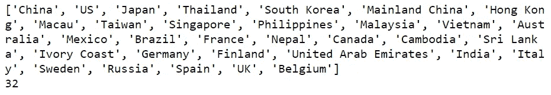

# 数据科学家对冠状病毒爆发的看法

> 原文：<https://towardsdatascience.com/a-data-scientists-perspective-on-the-wuhan-coronavirus-4d1110446478?source=collection_archive---------4----------------------->

## 约翰·霍普斯金大学对冠状病毒数据集的 EDA。


[疾控中心](https://unsplash.com/@cdc?utm_source=medium&utm_medium=referral)在 [Unsplash](https://unsplash.com?utm_source=medium&utm_medium=referral) 拍摄的照片

一种最初在中国武汉市报道的病毒，现在已经传播到世界上十几个国家，引发了前所未有的健康和经济危机。

世界卫生组织(世卫组织)宣布武汉冠状病毒*爆发为国际关注的突发公共卫生事件*。

在本文中，我们将简要了解当前的危机，然后深入研究 Kaggle 的“[小说电晕病毒 2019 数据集](https://www.kaggle.com/sudalairajkumar/novel-corona-virus-2019-dataset)”。我还创建了一个 [GitHub 知识库](https://github.com/kamahmad/EDA-Wuhan-Coronavirus-Dataset)，供任何想要重新创建步骤并添加自己见解的人使用。

# 什么是冠状病毒？

据世卫组织报道，冠状病毒(CoV)是一个大的病毒家族，可导致从普通感冒到更严重疾病的疾病，如中东呼吸综合征(MERS-CoV)和严重急性呼吸综合征(SARS-CoV)。

[一种新型冠状病毒(nCoV)](https://www.who.int/emergencies/diseases/novel-coronavirus-2019) 是一种新的毒株，此前未在人类中发现。被确定为最近爆发的原因的病毒被称为 2019-nCoV 或武汉冠状病毒。

# **危机，截至今日**

根据《纽约时报》的最新报道，中国确诊感染人数上升至 37198 人，死亡人数上升至 811 人，超过了非典造成的死亡人数。

中国的 16 个城市，总人口超过 5000 万，处于封锁状态。全球各地的航空公司都取消了往返中国的航班。一些国家正在用特别航班疏散他们的公民，并进一步对他们进行严格的隔离。

更糟糕的是，中国股市暴跌，全球市场都感受到了影响。一些分析师预测，疫情对全球经济构成威胁，并有可能引发深远的地缘政治后果。

# 数据集简介

在 [Kaggle](https://www.kaggle.com/) 上发布的“[小说电晕病毒 2019 数据集](https://www.kaggle.com/sudalairajkumar/novel-corona-virus-2019-dataset)，已被[约翰·霍普斯金大学](https://www.jhu.edu/)收藏。该小组从世卫组织、当地疾病预防控制中心和媒体等各种渠道收集了数据。他们还创建了一个实时仪表板来监控病毒的传播

**免责声明**:请注意，数据集没有更新，因此下面记录的观察结果可能不是当前场景的真实反映。

# 导入库和加载数据

```
import numpy as np
import pandas as pd
import matplotlib.pyplot as plt
import seaborn as sns*#reading data from the csv file*
data= pd.read_csv("/kaggle/input/novel-corona-virus-2019-dataset/2019_nCoV_data.csv")
```

# 了解数据集

让我们首先对数据集有一个基本的了解，并在必要时执行数据清理操作。

```
#checking the number of rows and columns
data.shape
```

输出:(770，8)。数据集中有 770 个观察值和 8 列。

```
#checking the top 5 rows
data.head()
```


列的名称是不言自明的。第一列' *Sno* '看起来像一个行号，并没有给分析增加任何值。第五列'*上次更新*'显示与'*日期*'列相同的值，除了一些后来更新数字的情况。让我们在继续之前删除这两列。

```
#dropping the 1st and 5th column
data.drop("Sno", axis=1, inplace=True)
data.drop("Last Update", axis=1, inplace=True)#getting a summary of the columns
data.info()
```


除了'*省/州*'之外，所有列都没有空值。进一步的分析显示，英国、法国和印度等国家缺少省份名称。在这种情况下，我们不能假设或填充任何主列表中的缺失值。让我们继续看数字列。

```
data.describe()
```


`describe()`方法返回数据帧中数字列的一般统计数据。

从输出中直接得出的结论是，数据是累积报告的，即任何特定一天报告的病例数包括以前报告的病例。死亡人数的“最大”值是 479 人，这与几天前媒体报道(该数据公布时)一致。

```
#checking for duplicate rows
duplicate_rows=data.duplicated(['Country','Province/State','Date'])
data[duplicate_rows]
```


`duplicated()`方法返回一个布尔序列，然后用作原始数据帧的掩码。输出显示没有两条记录具有相同的国家、州和日期。因此，我们可以得出结论，数据集中的所有观察值都是唯一的。

```
#listing all the countries where the virus has spread to
country_list=list(data['Country'].unique())
print(country_list)
print(len(country_list))
```



数据显示，该病毒已经传播到亚洲、欧洲和美洲的 32 个国家。出于分析目的，我们可以合并“中国”和“Mainland China”的数据。

```
#merging China and Mainland China
data.loc[data['Country']=='Mainland China','Country']='China'
```

在继续之前，让我们检查一下“*日期*栏中的日期。

```
print(list(data['Date'].unique()))
print(len(list(data['Date'].unique())))
```


看起来数据在每天不同的时间被更新。我们可以从时间戳中提取日期，并使用它们进行进一步的分析。这将有助于我们保持日期一致。

```
#converting 'Date' column to datetime object
data['Date'] = pd.to_datetime(data['Date'])#extracting dates from timestamps
data['Date_date']=data['Date'].apply(lambda x:x.date())
```

让我们了解一下疫情对每个国家的影响。

```
#getting the total number of confirmed cases for each countrydf_country=data.groupby(['Country']).max().reset_index(drop=None)
print(df_country[['Country','Confirmed','Deaths','Recovered']])
```


由于数据是累积的，我们需要将`max()` 函数与`groupby()` 一起使用，以便获得每个国家报告的最大病例数。如果我们使用`sum()`，我们会被重复计算。

该数据证实，中国是报告病例最多的国家，迄今为止几乎所有的 481 例死亡病例都发生在中国。从更积极的方面来看，中国也有 522 起复苏，其次是泰国，有 7 起。

```
#preparing data for a time-series analysisdf_by_date=data.groupby(['Date_date']).sum().reset_index(drop=None)df_by_date['daily_cases']=df_by_date.Confirmed.diff()
df_by_date['daily_deaths']=df_by_date.Deaths.diff()
df_by_date['daily_recoveries']=df_by_date.Recovered.diff()
print(df_by_date)
```


我们已经完成了数据准备步骤，因此让我们继续将数据可视化，以寻找任何正在出现的趋势和模式。

# 绘制数据

对于数据可视化，我们将使用两个强大的 python 库——Matplotlib 和 Seaborn。Matplotlib 是大多数数据科学家使用的默认 2D 可视化库。Seaborn 构建在 matplotlib 之上，有助于构建更好看和更复杂的可视化，如热图。

让我们根据数据的不同方面创建五个可视化。

1.  *一段时间内确诊病例数*

```
#plotting a bar chart of confirmed cases over timesns.axes_style("whitegrid")sns.barplot(
x="Date_date", 
y="Confirmed", data=data.groupby(['Date_date']).sum().reset_index(drop=None)
)plt.xticks(rotation=60)
plt.ylabel('Number of confirmed cases',fontsize=15)
plt.xlabel('Dates',fontsize=15)
```


2.*死亡率与恢复率*

```
#plotting two line plots for deaths and recoveries respectivelyplt.plot('date_updated', 'Deaths', data=data.groupby(['date_updated']).sum().reset_index(drop=None), color='red')plt.plot('date_updated', 'Recovered', data=data.groupby(['date_updated']).sum().reset_index(drop=None), color='green')plt.xticks(rotation=60)
plt.ylabel('Number of cases',fontsize=15)
plt.xlabel('Dates',fontsize=15)
plt.legend()
plt.show()
```


3.*除中国外的 10 个受影响最严重的国家*

```
#We know that China is the most affected country by a large margin, #so lets create a bar plot to compare countries other than China#increasing the figure size
plt.rcParams['figure.figsize']=(15,7)sns.barplot(
x="Country",
y="Confirmed",
data=df_country[df_country.Country!='China'].nlargest(10,'Confirmed'),
palette=sns.cubehelix_palette(15, reverse=True)
)plt.ylabel('Number of cases',fontsize=15)
plt.xlabel('Countries',fontsize=15)
plt.xticks(fontsize=13)
plt.yticks(fontsize=13)
```


4.*一段时间内的死亡率*

```
#The mortality rate, at any point in time, can be roughly calculated #by dividing the number of deaths by the number of confirmed casesdf_by_date['mrate']=df_by_date.apply(lambda x: x['Deaths']*100/(x['Confirmed']), axis=1)plt.plot('Date_date','mrate',data=df_by_date, color='red')
plt.show()
```


5.*深入了解中国 10 个受灾最严重的省份*

```
#creating a separate dataframe for provincesdf_province=data[data['Country']=='China'].groupby(['Province/State']).max().reset_index(drop=None)#selecting 10 most affected provinces
df_province=df_province.nlargest(10,'Confirmed')df_province=df_province[['Province/State','Deaths','Recovered']]#for multi-bar plots in seaborn, we need to melt the dataframe so #that the the deaths and recovered values are in the same column
df_province= df_province.melt(id_vars=['Province/State'])

sns.barplot(
x='Province/State', 
y='value', 
hue='variable', 
data=df_province
)plt.xlabel('Provinces',fontsize=15)
plt.ylabel('Number of cases',fontsize=15)
```


# 观察

1.  自 1 月 28 日以来，每天报告的病例数量增加了近 250%。2 月 4 日报告的病例数是 3915。这说明病毒传染性很强，传播速度很快。
2.  在第一周，死亡率高于康复率。自 1 月 31 日以来，恢复率迅速上升，并呈现积极趋势。2 月 4 日有 255 人康复，相比之下有 66 人死亡。随着越来越多的人了解症状并及时寻求药物治疗，治愈率将继续增加。
3.  在地理上靠近中国的国家，如泰国、日本和新加坡，比其他亚洲和欧洲国家报告了更多的病例。德国是一个例外，它是欧洲病例最多的国家。
4.  死亡率从未超过 3%,正在逐渐降低到 2%。未来几周更多的复苏可能会进一步减少这种情况。
5.  中国湖北省是疫情爆发的中心。该省报告的病例比所有其他省份加起来都多。有些省份没有出现死亡病例，所有受影响的患者都已康复。

# 结论

分析显示了武汉冠状病毒传播的惊人速度。至少有 811 人在当前的疫情中死亡，超过了七年前 SARS 爆发时报道的 774 人死亡。我祈祷并希望病毒尽快被控制住。

*编者按:*[*【towardsdatascience.com】*](https://slack-redir.net/link?url=http%3A%2F%2Ftowardsdatascience.com)*是一家以数据科学和机器学习研究为主的中型刊物。我们不是健康专家或流行病学家。想了解更多关于疫情冠状病毒的信息，可以点击* [*这里*](https://slack-redir.net/link?url=https%3A%2F%2Fwww.who.int%2Femergencies%2Fdiseases%2Fnovel-coronavirus-2019) *。*