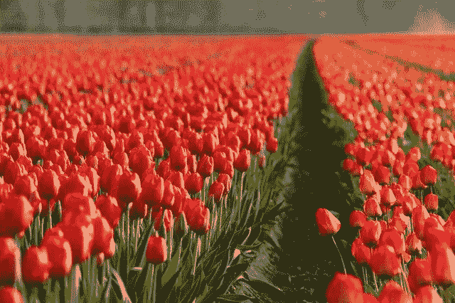
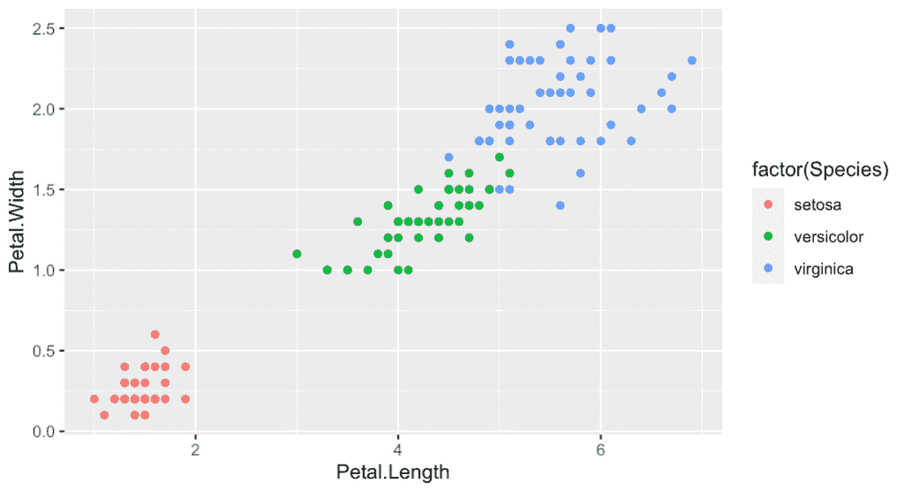
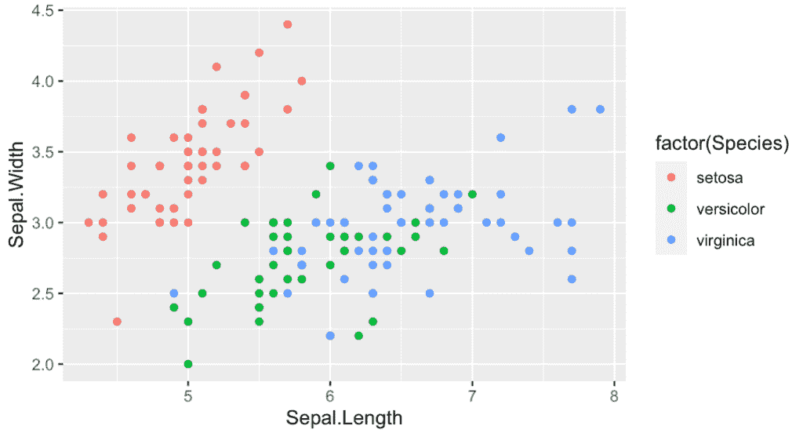
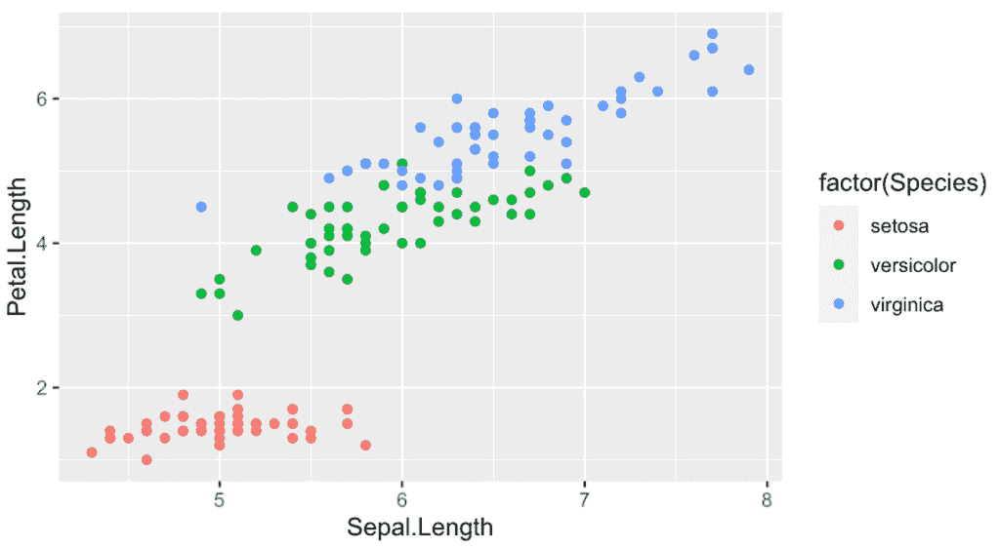
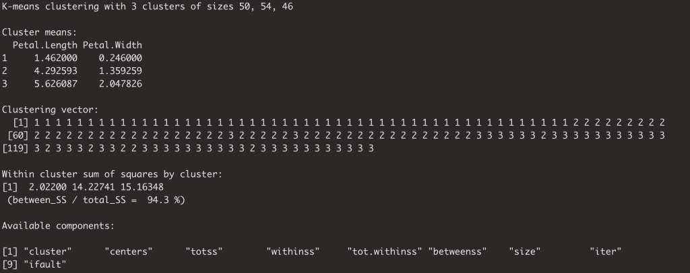
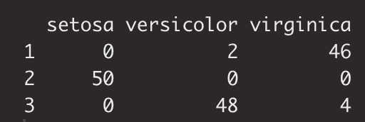
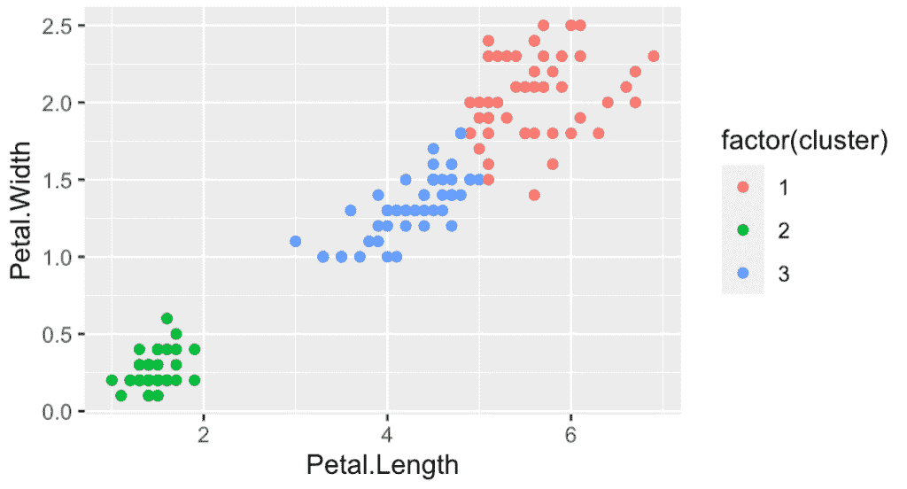

# 在 6 分钟内学会如何使用 KMeans

> 原文：<https://towardsdatascience.com/a-data-scientists-practical-guide-to-using-kmeans-ff180878e13b?source=collection_archive---------51----------------------->



图片来自 [Pixabay](https://pixabay.com/?utm_source=link-attribution&utm_medium=referral&utm_campaign=image&utm_content=2546)

# 介绍

聚类是一种属于无监督学习类别的机器学习技术。在不进入不同机器学习类别的大量细节的情况下，我将给出无监督学习的高级描述。

简而言之，我们不是预先决定我们希望我们的算法找到什么，而是提前给算法提供很少甚至没有指导。

换句话说，我们不是明确地告诉我们的算法我们想要预测或解释什么，而是踢回去，把接力棒交给算法来识别给定特征中的突出模式。

如果你想了解更多关于这个划分，你可以看看[这个帖子](/machine-learning-in-a-nut-shell-df251f480f77)。

聚类具有广泛的应用，是数据科学工具箱中非常有用的工具。

我们将讨论集群的一个非常具体的实现，Kmeans。也就是说，对集群的基本理解是实际应用的前提。我们不会在这里深入探讨，但是你可以通过[这篇文章](/what-every-data-scientist-needs-to-know-about-clustering-cf8f860a1883?source=your_stories_page---------------------------)从概念层面了解更多。

# Kmeans 入门

# 克曼语中的 K

k 代表您要识别的组或集群的数量。如果您正在执行聚类分析，而您已经知道有三个分组，您将使用该上下文通知算法您需要三个分组。你并不总是知道有多少自然分组，但是你可能知道你需要多少分组。在以下示例中，我们将使用 iris 数据集，它是与各种 Iris 物种相关的测量值的集合，但还有许多其他用例..基于用途、尺寸等的客户。或者基于购买可能性和可能的购买量等的前景。在商业、生物学和其他领域有广泛的应用。

# 了解质心

一旦我们确定了 k，算法将随机分配 k 个点；这些点将作为你的“质心”。你可能会问，什么是质心？质心指的是每个聚类的中心点。

一旦这些中心点或质心被随机分配…欧几里德距离被计算在每个点和每个质心之间。

一旦计算出距离，每个点被分配到最近的质心。

我们现在有了这些星团的第一个版本。但我们还没完。当我们到达第一个版本的聚类时，质心被移动到分配给每个质心的点组的绝对中心。发生欧几里德距离的重新计算，并且在给定点现在更接近备选质心的情况下，它被相应地分配。同样的过程发生，直到质心达到稳定，点不再被重新分配。分配给给定质心的点的组合构成了每个聚类。

# 让我们建立我们的第一个模型

# 开始一点探索

对于这个分析，我们将使用我前面提到的经典虹膜数据集。这个数据集被一次又一次地用来教授聚类的概念。埃德加·安德森收集了三种鸢尾的萼片和花瓣的长度/宽度数据。如果你对这方面的更多信息感兴趣，查看维基百科的解释([https://en.wikipedia.org/wiki/Iris_flower_data_set](https://en.wikipedia.org/wiki/Iris_flower_data_set))

# 快速 EDA

```
head(iris)
```


```
glimpse(iris)
```


我们将在散点图中显示花瓣的长度和宽度，并用颜色覆盖物种。

```
ggplot(iris, aes(x = Petal.Length, y = Petal.Width, color = factor(Species))) +
  geom_point()
```



为了好玩，我们再做几个不同的组合。

```
ggplot(iris, aes(x = Sepal.Length, y = Sepal.Width, color = factor(Species))) +
  geom_point()
```



```
ggplot(iris, aes(x = Sepal.Length, y = Petal.Length, color = factor(Species))) +
  geom_point()
```



为了简洁起见，我们可以对每一个变量组合详尽地进行同样的练习；我们会继续。

# 构建我们的第一个聚类模型

```
set.seed(3)
k_iris <- kmeans(iris[, 3:4], centers = 3)
```

当我们将种子设置为一个给定的数字时，我们确保可以重现我们的结果。

我们调用 kmeans 函数并传递相关的数据和列。在这种情况下，我们使用花瓣长度和宽度来构建我们的模型。我们宣布三个中心，因为我们知道有三个不同的物种。

如果你调用你的集群模型。您将得到类似如下的输出:



值得强调的几件事:

你会看到一些有用的信息:

*   簇的数量，先前由“中心”参数确定
*   跨自然确定的聚类的每个值的平均值。
*   “在聚类平方和内”-这表示每个点和聚类质心之间的绝对距离
*   可用组件——在这里，模型提供了一些其他的信息。我们将很快利用“集群”组件！

# 性能评价

在这里，我们允许一种无监督的机器学习方法来识别我们的数据中自然出现的群体，但我们也可以访问实际的物种；因此，让我们来评估算法的性能！

一个非常简单的方法是查看一个包含物种和指定集群的表格。在这里，您将看到我们将引用模型对象，并通过记录调用确定的集群。

```
table(k_iris$cluster, iris$Species)
```



在这里我们可以看到所有的刚毛藻都被归为一类，没有其他的物种加入到同一个类中。对于 versicolor，我们可以看到 kmeans 准确地捕获了簇 3 中 48/50 的 veriscolor 和簇 1 中 46/50 的 virginica。

我们可以很容易地使用来自`dplyr`库的`mutate`函数将这个分类分配给我们的 iris 数据集

```
iris <- mutate(iris, cluster = k_iris$cluster)
```

现在让我们重新创建我们的第一个散点图，把物种换成集群

```
ggplot(iris, aes(x = Petal.Length, y = Petal.Width, color = factor(cluster))) +
  geom_point()
```



上面我们可以看到这两个数据点基于其物种的自然分组的几乎相同的表示。

我们当然可以测试各种变量组合，以达到更好的近似每一种鸢尾，但现在你有基本的工具需要这样做！

# 结论

在短短的几分钟内，我们已经了解了 Kmeans 集群的工作原理以及如何实现它。

*   聚类是一种无监督的学习方法
*   Kmeans 是最流行的聚类技术之一
*   k 是簇的预定数量
*   该算法实际上是如何工作的
*   如何创建我们自己的集群模型

我希望这篇关于 Kmeans 实际应用的快速帖子对您应用该技术有所帮助。

祝数据科学快乐！