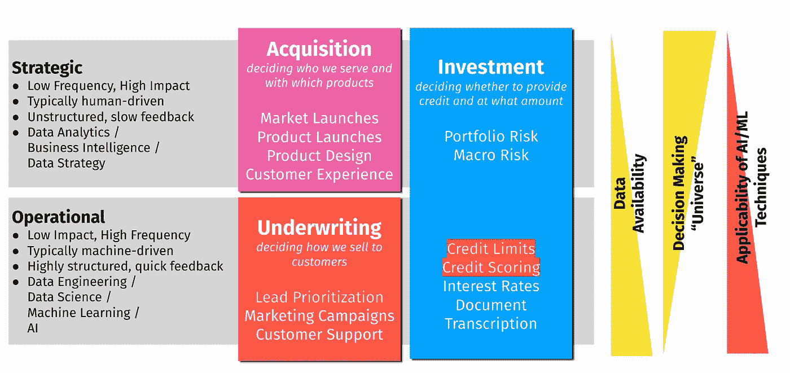

# 数据团队的产品是决策

> 原文：<https://towardsdatascience.com/a-data-teams-product-is-decisions-bbd7a6b4cfbe?source=collection_archive---------41----------------------->

弗兰基·查马基在 [Unsplash](https://unsplash.com?utm_source=medium&utm_medium=referral) 上拍摄的照片，经作者许可编辑

# 数据团队不是内置的

对于大多数不以数据为主要产品的公司来说，大多数数据团队都不是“内置”的。

通常会有一个团队负责销售和分销(销售、营销、增长、运营)，一个团队负责产品采购或开发(产品、工程)，以及一般行政管理(财务、领导、人力资源)。

当公司开始考虑数据团队的概念时，他们已经达到了一定的规模。

这并不意味着数据团队没有实际用途，只是意味着在初创公司或大公司中发现自己是数据第一人的人通常会遇到这样的问题，要么找到他们或他们的团队可以负责的领域，要么证明业务的相关性或附加值。

我发现非常有用的一件事是让你的数据团队的产品围绕**决策**。

# 数据团队的产品是决策

无论数据工作的类型在数据工程、分析、商业智能或建模之间的光谱中处于什么位置，数据团队的产品都不是上述内容，而是决策。

在 First Circle，我们团队的目标是确保**所有决策，无论是战略决策还是运营决策，都通过数据得到增强或自动化。**

# 决策的类型

有两种类型的决策通常是数据团队的目标:(a)定制的、奢侈的战略决策，以及(b)大规模生产的、可重复的、快速的运营决策。

作者照片

# 战略决策

战略决策是奢侈的、定制的和手工的决策；不常做出但影响很大的决策。有很大的不确定性，不太可能会有频繁的反馈循环。为了增强这些决策，人们将受益于商业思维、沟通技巧和从有限的数据中提取信息的能力(高度定制的线性模型，或贝叶斯技术)。

战略决策的例子包括产品/市场扩张、预算和人员规划、竞争分析、合并和收购。

# 运营决策

运营决策是大规模生产的、可重复的决策，一天要做成百上千次。它们单独来看可能没有那么大的影响力，但是庞大的数量也使得优化这类决策变得非常重要。为了节省成本，运营决策背后的决策系统通常是算法，需要机器学习、数据科学和强大的数据工程来生产系统。

运营决策的例子是任何每笔交易的决策，如银行的个人贷款授权算法、拼车公司的司机调度算法或电子商务公司的推荐算法。

进入数据科学领域的个人通常只考虑运营决策，但如果数据团队是唯一处理数据的团队，那么他们必须同时考虑这两种决策，这一点至关重要，因为成功运营企业需要两种决策都由数据驱动。

# 在数据团队的路线图中考虑这两种类型

在设计数据团队的路线图时，我发现意识到两种类型的“产品”之间的差异并确保组合适合业务非常重要。

在运营决策上花费太多可能意味着实现第一个价值需要漫长的努力，因为必须进行大量的数据收集和实验。

在战略决策上花费太多可能意味着你的公司实际上没有从数据中认识到真正的技术价值，然后你将像传统公司一样运营，只是对他们的信息稍微聪明一点。

更糟糕和更常见的是混淆两者；将战略决策视为运营决策，反之亦然。我见过很多这样的情况，人们使用随机森林变量重要性进行一次性决策(“洞察”)，或者人类在流程中的角色只是按按钮，并不实际应用任何判断(很容易自动化)。

我的建议是把这些放在一块板上，并在两个桶中突出高优先级的项目。这个练习应该与你的团队的计划周期一起完成。

在未来的新闻稿中，我将讲述如何组建一个团队，以整体的方式解决这些问题，并避免与许多新数据团队采用的[“pin factory”模型](https://multithreaded.stitchfix.com/blog/2019/03/11/FullStackDS-Generalists/)相关的常见陷阱。

*最初发表于*[T5【https://tjpalanca.com】](https://tjpalanca.com/posts/2020-10-11-data-team-value/)*。*