# AWS 上的数据仓库实现

> 原文：<https://towardsdatascience.com/a-data-warehouse-implementation-on-aws-a96d0e251abd?source=collection_archive---------8----------------------->

## 使用 AWS S3、AWS 胶水、DBT 和 AWS 红移的实现

亚历克斯·库利科夫在 [Unsplash](https://unsplash.com?utm_source=medium&utm_medium=referral) 上的照片

在过去的帖子中，我一直在谈论数据仓库，它们的基本架构，以及一些可以帮助您构建数据仓库的基本原则。今天，我想向您展示**基于几个月前进行的案例研究**在 AWS** 上实现数据仓库。**

这个实现使用 AWS S3 作为数据湖(DL)。AWS 粘合为数据目录。以及 AWS 红移和红移谱作为数据仓库(DW)。

> 注意:如果你不熟悉我在这里使用的一些术语和概念，这篇文章可能会令人困惑。关于这些术语和概念的更多信息，我建议你看一看其他涉及这些主题的帖子。

 [## 什么是数据仓库:基本架构

### 数据仓库主要概念介绍

towardsdatascience.com](/what-is-a-data-warehouse-basic-architecture-ea2cd12c9bb0)  [## 构建数据仓库:基本架构原则

### 一种简化数据仓库的方法

towardsdatascience.com](/building-a-data-warehouse-basic-architectural-principles-66bd7059ffd0)  [## 构建数据仓库管道:基本概念和路线图

### 提高数据管道可操作性和性能的五个过程

towardsdatascience.com](/building-a-data-warehouse-pipeline-basic-concepts-roadmap-d14032890ab6) 

# 体系结构

该实施中遵循的架构基于 ELT 流程。首先，从数据源中提取数据，然后加载到数据湖中，最后在数据仓库中进行转换。

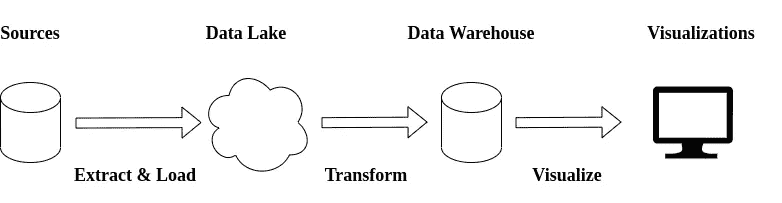

一个数据仓库体系结构的抽象——作者举例说明

这篇文章中提到的实现是基于几个月前的一个案例研究——更多信息请查看这篇[文章](/building-a-data-warehouse-basic-architectural-principles-66bd7059ffd0)。架构看起来是这样的:

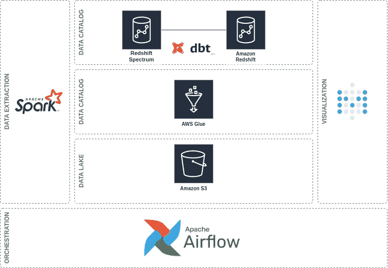

自动气象站中的数据仓库架构——作者举例说明

它使用 AWS S3 作为 DL。AWS 粘合为数据目录。而 AWS 的红移和红移谱作为 DW。

此外，它使用 Apache Spark 进行数据提取，使用 Airflow 作为编排器，使用 Metabase 作为 BI 工具。但是，特别是对于这个职位，范围仅限于**DL 和 DW** 的实施。

# 数据湖

这个案例研究的第一部分是数据湖。

> 数据湖是存储来自多个来源的数据的存储库。它允许处理结构化和非结构化数据。

在这个案例研究中，数据湖被用作允许集中所有不同数据源的临时区域。

来自这些来源的数据以其原始格式存储。在将数据加载到数据湖之前，不涉及任何转换过程。所以，可以认为是一个**不可改变的集结地**。

## 数据湖架构

数据湖架构可能会根据您的需求而有所不同。在这个案例研究中，使用了一个简单的架构。它由两个区域组成:T4 原始区域和沙盒区域。

如果您正在处理具有复杂格式的数据，*例如，*，某个创意开发人员决定编写的一些复杂嵌套的 JSON，**您可能需要在将数据加载到数据仓库之前对其进行处理**。因此，您可能需要实现另一个数据湖区域。这就是 Ben Sharma 在他的书[中所说的数据湖](https://www.oreilly.com/library/view/architecting-data-lakes/9781492033004/)精炼区。

但是，现在，我会保持简单。

*   **原始区**是以原始格式存储数据的地方。然后，通过在 [DBT](https://www.getdbt.com/) 上运行一些转换过程，将其加载到数据仓库中
*   沙盒区是数据分析师、数据工程师或数据科学家可以做一些疯狂实验的地方

在原始区域中，数据根据其来源和加载日期进行分区，*例如*，2020 年 9 月 15 日加载的名为“source”的源中的文件存储在/source/2020/09/15 中。

> 值得一提的是，您在数据湖中构建分区的方式应该根据您的特定需求。有关 S3 分区的信息，请参见本[帖子](https://docs.aws.amazon.com/glue/latest/dg/aws-glue-programming-etl-partitions.html)和本[帖子](https://docs.aws.amazon.com/athena/latest/ug/partitions.html)。

您可以在下图中找到数据湖的建议体系结构的图形表示。

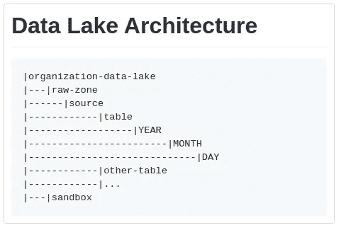

数据湖体系结构——作者制作的插图

这是它在 AWS S3 的实现方式。

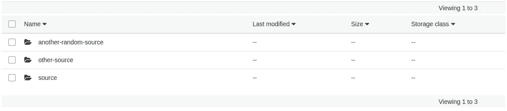

数据湖—0 级—作者制作的插图

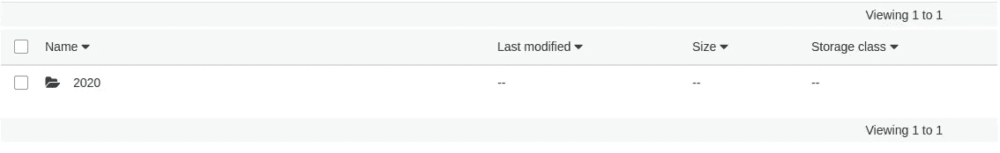

数据湖—1 级—作者制作的插图

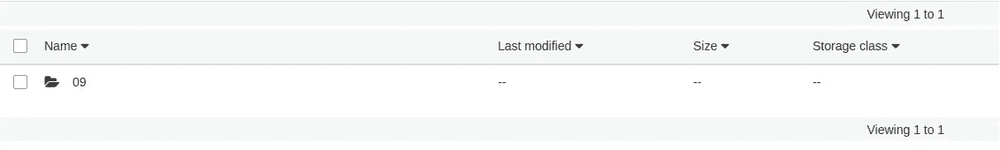

数据湖—2 级—作者制作的插图

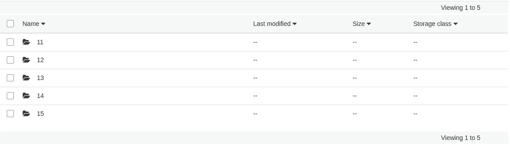

数据湖—级别 3 —作者制作的插图

最后，在最后一层，使用 parquet 文件存储数据。我使用了一个开源数据集来举例说明这个案例研究。

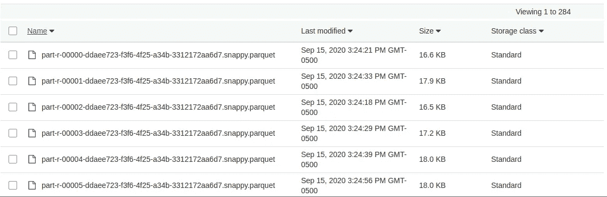

数据湖—级别 4 —作者制作的插图

## 数据目录

现在我们已经将数据存储在数据湖中，我们需要能够使用 SQL 查询数据。因此，我们可以使用 DBT 执行一些数据转换。

我们将使用 AWS Glue 数据目录数据库和爬虫来允许我们在 DL 之上运行 SQL 查询。

第一步是[在 AWS Glue 中创建一个数据库](https://docs.aws.amazon.com/glue/latest/dg/console-databases.html)。

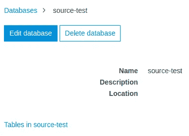

AWS 胶水数据目录中的数据库—作者制作的插图

然后，可以使用 AWS Glue 爬虫填充数据库。更多信息请看这个[帖子](https://docs.aws.amazon.com/glue/latest/dg/console-crawlers.html)。

创建并运行爬虫后的最终结果可能如下所示。

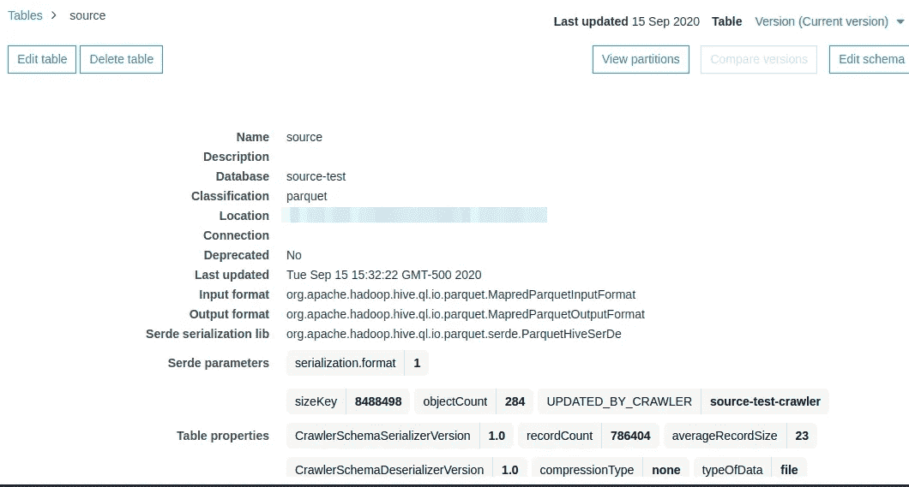

AWS 胶水目录中的一个表格—第一部分—作者制作的插图

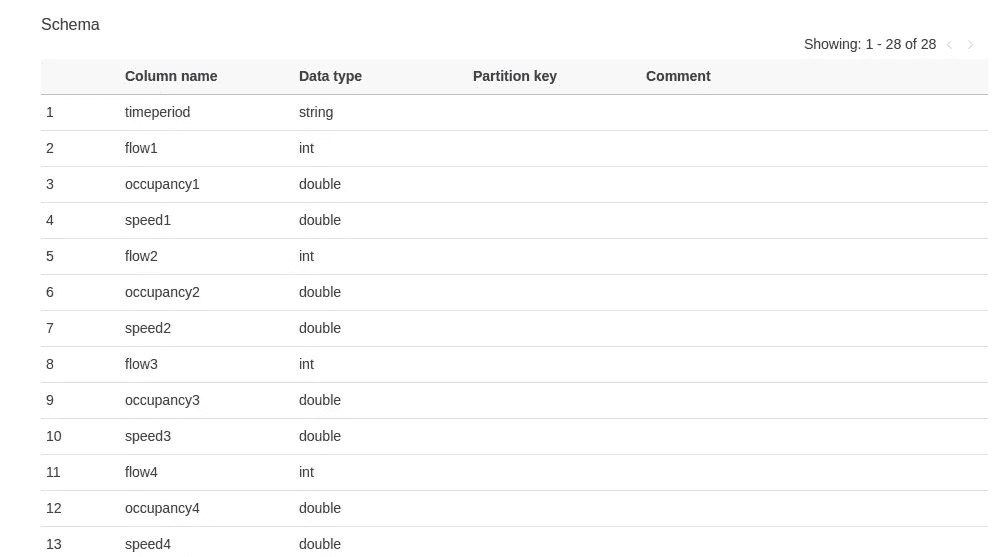

AWS 胶水目录中的表格—第二部分—作者制作的插图

现在，我们可以开始工作了。有了数据目录中映射的表，现在我们可以使用 AWS 红移光谱从 DW 中访问它们。因此，我们最终可以在数据仓库中具体化数据。

# 数据仓库

如前所述，DW 是使用 AWS 红移、红移光谱和 DBT 构建的。

[AWS 红移](https://docs.aws.amazon.com/redshift/latest/mgmt/welcome.html)是 AWS 提供的数据仓库服务。[红移光谱](https://docs.aws.amazon.com/redshift/latest/dg/c-getting-started-using-spectrum.html) 是一项服务，可以在红移集群内部使用，直接从亚马逊 S3 上的文件中查询数据。并且， [DBT](https://www.getdbt.com/) 是一个允许您使用 SQL 在数据仓库内部执行转换的工具。

DW 的关键组件之一是红移光谱，因为它允许您将粘合数据目录与红移联系起来。因此，您可以使用 DBT 查询红移星团中的 DL 数据。**这很重要，因为 DBT 不会移动数据。它只是转换数据仓库中的数据。**

将红移光谱与之前在 AWS 粘合目录中映射的数据连接起来的方法是通过在外部模式中创建**外部表。更多信息见[本](https://docs.aws.amazon.com/redshift/latest/dg/c-getting-started-using-spectrum-create-external-table.html)。**

这样做之后，外部模式应该如下所示:

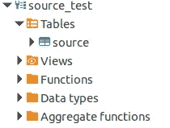

而且，如果您使用的是我在本案例研究中使用的相同的数据集，您的元数据应该是这样的:

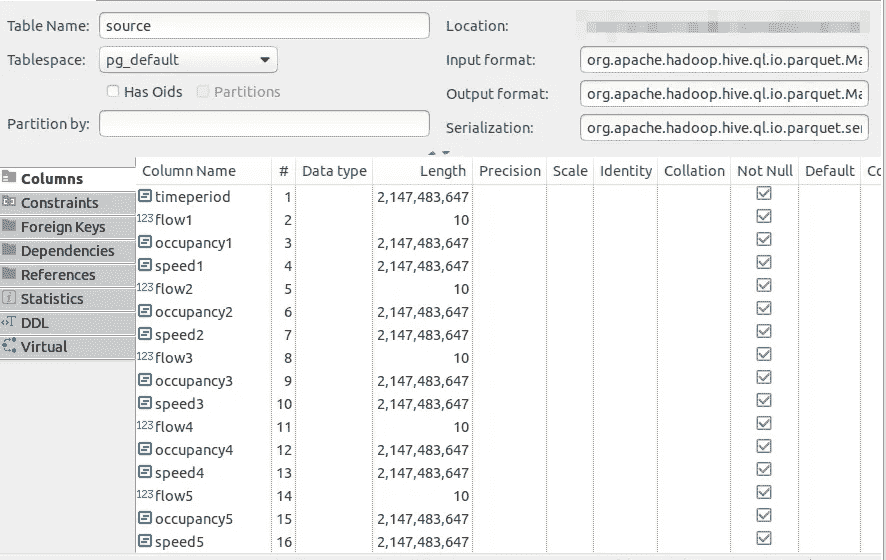

在 DBeaver 中可视化的源表—作者制作的插图

## 数据实体化

在用红移光谱映射数据之后，我们可以继续进行 AWS 红移中的数据具体化。

这种具体化允许您将数据放入红移表中。一个关键的区别是，当您查询红移表中的数据时，您不需要为查询付费，因为您已经为红移集群付费了。**而如果你查询外部表中的数据，*即*红移光谱，你将按查询中处理的数据**收费。更多信息见[本](https://aws.amazon.com/redshift/pricing/)。

另一个关键区别是 **AWS 红移在处理海量数据**时表现优于红移频谱。更多信息见[本](https://www.concurrencylabs.com/blog/starburst-presto-vs-aws-redshift/)。

因此，如果我们想对前面给出的表进行一些转换，我们可以编写一个 DBT 模型，并用红移来具体化数据。

这是本案例研究的一个简单的 DBT 模型:

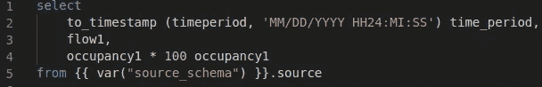

DBT 模型——作者创作的插图

这就是这个模型在红移表中的样子。

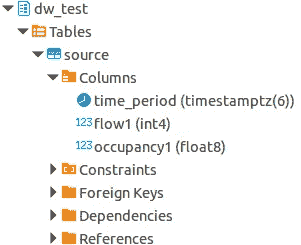

红移表——作者制作的插图

# 结论

在本文中，我们为 AWS 中的数据湖和数据仓库实现了一个简单的架构。

此外，我们还讨论了这样做所必需的一些关键步骤。一些要点如下:

*   该架构遵循 ELT 方法。因此，在将数据加载到数据湖之前，不涉及任何转换过程
*   数据湖被用作不可变的暂存区，用于将数据直接加载到数据仓库中
*   数据湖由两个区域组成:原始区域和沙盒区域。如果您需要在加载到数据仓库之前处理数据，您应该为数据湖设置另一个区域:精化区域
*   数据湖中的分区应该根据您的用例来定义
*   AWS 红移光谱是一项服务，可以在红移集群中直接从亚马逊 S3 上的文件中查询数据。这是对 AWS 红移的额外服务
*   AWS 红移光谱允许你连接胶水数据目录与红移
*   转换逻辑使用 DBT 模型
*   DBT 不移动数据。它只是转换数据仓库中的数据

我希望这些信息对你有用。

感谢阅读到最后。

下期帖子再见！

*如果您想随时更新我的作品，* ***请加入我的*** [***简讯***](https://metadatacommunity.substack.com/) ***！偶尔，我会和我的读者分享一些东西。如果你加入我会很感激的:)***

 [## 对数据仓库感兴趣？

### 我已经写了几篇关于它的文章。这就是如何阅读它们！

ajhenaor.medium.com](https://ajhenaor.medium.com/interested-in-data-warehousing-424b49ec97e4)