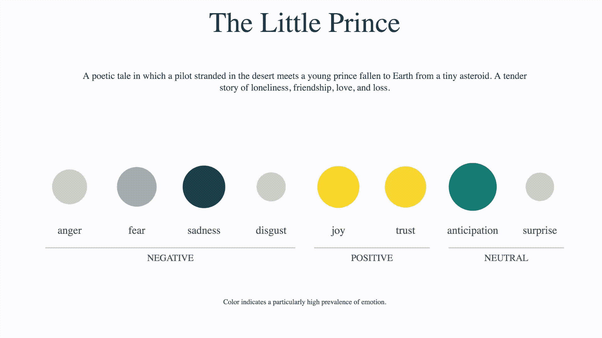
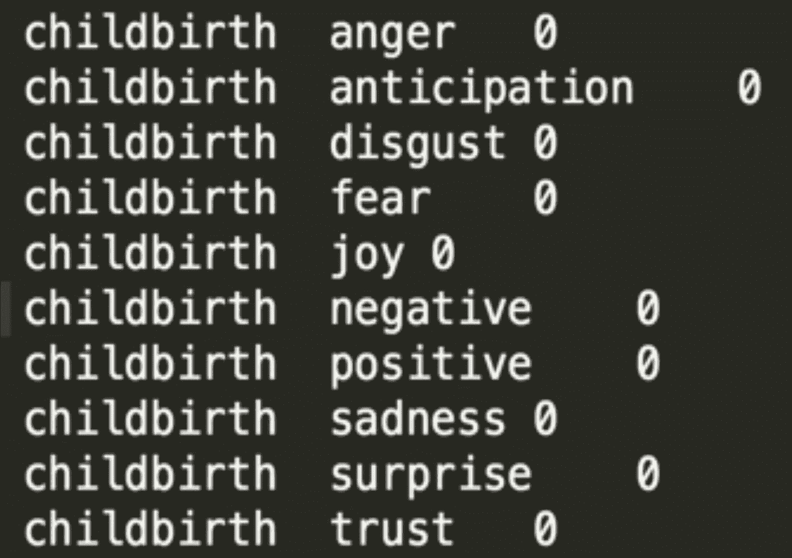

# 数据集是一种世界观

> 原文：<https://towardsdatascience.com/a-dataset-is-a-worldview-5328216dd44d?source=collection_archive---------23----------------------->

## 关于主观数据，为什么数据集应该过期，以及数据破坏。

*这是 2019 年 9 月在国会图书馆发表的一次演讲的略微扩展版本。*

# 数据集是一种世界观

我叫汉娜·戴维斯，是一名研究艺术家、生殖音乐家和从事机器学习的数据科学家。我的大部分工作都是围绕情感数据、算法组合和数据集创建的想法。

我的一个更大的项目是一个叫做 TransProse 的算法，它通过编程将书籍翻译成音乐。它的工作原理是找到潜在的情感内容，并利用这些内容创作出具有相同情感基调的音乐作品。

http://musicfromtext.com/

为了做到这一点，我使用了几种资源，包括本质上是一个带有各种情绪标签的单词数据集。

在深入研究这个数据集之前，我花了很长时间研究它，当我这样做的时候，我发现了这个:

“分娩”这个词被认为是完全不带感情色彩的。

我对此很感兴趣。这是怎么发生的？给这个贴标签的人是谁？我可以想到一个场景来检查任何一种情绪，但不能选择任何一种情绪。

我没有得到那些答案，但我确实了解到每个单词只被三个人标记过。这在数据集创建中很常见，因为标注很快就变得昂贵——甚至每个词三个人就可以变成数千美元。

但是因为**一个机器学习模型从它的输入数据**中学习它的世界的边界，只有三个人告知任何使用该数据集的模型将如何解释“分娩”是否是情绪化的。

这引出了一个贯穿我所有作品的观点:**数据集就是世界观**。它包含了搜集和收集数据的人的世界观，无论他们是研究人员、艺术家还是公司。它包含了贴标签者的世界观，无论他们是手动地、不知不觉地给数据贴标签，还是通过像 Mechanical Turk 这样的第三方服务贴标签，这本身就带有人口统计学偏见。它包括组织者创造的固有分类法的世界观，在许多情况下，组织者是其动机与高质量生活直接不相容的公司。

# 数据集应该过期

除了创建者的特定偏见，数据集还编码了创建时的一般文化价值观。过时的社会世界观是某些迪士尼电影被锁在地下室的原因——因为我们的社会已经改变和发展，这些电影中的思想(即种族主义和厌恶女性的思想)不再合适。

数据集不会发生这种过期。以 2008 年创建的 Wild 数据集中标记的人脸为例。这是第一批不受约束的面部识别数据集之一，由从互联网上搜集的 13，000 张主要是名人的图像组成。但是由于时间的原因，只有 3 个人占了这个数据的 7%，这意味着是可概括的:乔治·布什，科林·鲍威尔和托尼·布莱尔。

这种历史偏见存在于各种题材中。巨大而令人惊叹的数据集 ImageNet 于 2009 年创建，至今仍在使用，它改变了整个机器学习领域。如果您在原始数据集中搜索“手机”，它会返回一系列翻盖手机，因为这是在智能手机普及之前。

机器学习数据集被视为客观的。它们被机器学习算法和创造者视为基础真理。数据集的制作困难、耗时且昂贵，因此数据集一旦创建，通常会使用很长时间。但是，当我们作为一个社会向前发展时，没有理由坚持过去的价值观；同样，也没有理由让未来社会受制于我们当前的状况。我们的 **数据集可以也应该有截止日期。**考虑特朗普政府将收集的数据类型及其标注方式；我们有什么理由希望这能告诉我们的未来吗？

# “人工智能做到了”

这些问题中有许多是更广泛的分类和分类学中的问题。但这对于机器学习来说更重要也更可怕，原因有两个:首先，机器学习数据集影响现实世界中投入生产的模型——通常很快，没有任何检查——并对我们的日常生活产生重大而直接的影响。它们影响着一切，从我们的搜索结果到工作前景，再到信用评分，这些都是无形的，没有责任，没有上诉程序，也没有补救选项。

第二:机器学习研究人员、记者、政府、企业和其他相关方一直将人工智能作为一个黑匣子，完全无法解释，最重要的是，对自己负责。这使得所有这些偏见和世界观的问题都可以被认为是“只是人工智能”**对于那些利用机器学习进行伤害的人来说，这是一个非常方便的叙述。**

# 主观数据

为了解决这些问题，我提倡的一个想法是“主观数据”这意味着接受数据集有世界观这一事实，并明确该世界观包含什么。这也意味着有机会做得更好——创造我们自己的理想或实验性的世界观，并超越我们被迫继承的世界观。我们可以用数据和标签创建一个数据集，来模拟一个理想的或更健康的社会，而不仅仅是反映它的现状。我们可以创建独特的和实验性的分类法和标签，并把有害的排除在外。我们可以让数据集积极支持那些为更美好的未来而战的人，而不是成为战斗途中的另一个障碍。

这已经发生在机器学习艺术领域(见下文)，但我相信它也与其他领域相关；我相信我们在数据集上的影响力比我们想象的要大。我们应该考虑如何尽可能地包含细微差别——例如，通过腾出空间来包含每一条输入数据，而不是截断它以适应几个类别。我们应该优先考虑那些让我们远离单一世界观的实践。**我们不应该让人们独特的生活环境被算法平均值所评判，从而导致现实世界的后果**。我们应该考虑是谁的世界观在强加给我们。

# 数据破坏

我想以一个可能会让我们所有关心数据和归档的人感到不安的提示来结束这篇文章，但在这个时代，思考这个问题是很重要的:故意破坏数据的想法。你们中的许多人已经知道这个故事了，但是雷内·卡米利是一个早期的例子；第二次世界大战期间，他是一名秘密的法国抵抗战士，在法国维希的纳粹统治下管理国家统计局。他负责将纳粹人口普查数据转换成穿孔卡片，他决定删除第 11 列，即表示宗教的那一列。他拯救了许多人的生命，仅仅是因为他决定不收集关于他们的某些数据。

在当今时代，我们围绕数据做出决策的重要性是相似的。关于一个人的种族、性别、心理健康、移民身份和其他分类的数据很可能会被用于伤害，而现在还没有。对于那些与此相关的人来说，提前与你的团队(或你自己)讨论并决定你将在哪个点采取行动是很重要的，这样你就能够在那一刻到来时识别并采取行动。

在错误的手里，或者甚至在完全善意但欠考虑的手里，**归类为暴力**。如果没有对这个想法与您自己的机器学习工作的关系进行严格的思考，很容易通过收集和标记数据这样看似简单的事情意外地造成伤害。

许多例子中的几个！)使用和/或探索主观数据集的机器学习艺术项目:

[笑屋](http://www.hannahishere.com/project/the-laughing-room-with-jonny-sun/)，孙燕姿和汉娜·戴维斯

[分类. 01](http://mimionuoha.com/classification01) ，咪咪欧诺哈

[女权主义数据集](https://carolinesinders.com/feminist-data-set)，卡罗琳·辛德斯

[动物分类器](http://ssbkyh.com/works/animal_classifier/)，Shinseungback Kimyonghun

[丝芙兰提及“哭泣”的评论数据集](https://github.com/everestpipkin/datagardens/tree/master/students/khanniie/5_newDataSet)，康妮·叶

这就是问题、解决方案、过去和未来

*感谢* [*米科拉*](https://medium.com/u/cfa215f81d3f?source=post_page-----5328216dd44d--------------------------------)*[*萨拉·k·哈拉彻*](https://medium.com/u/6cff342b475e?source=post_page-----5328216dd44d--------------------------------)*[*路易斯·丹尼尔*](https://medium.com/u/64078905d77a?source=post_page-----5328216dd44d--------------------------------) *的反馈！***