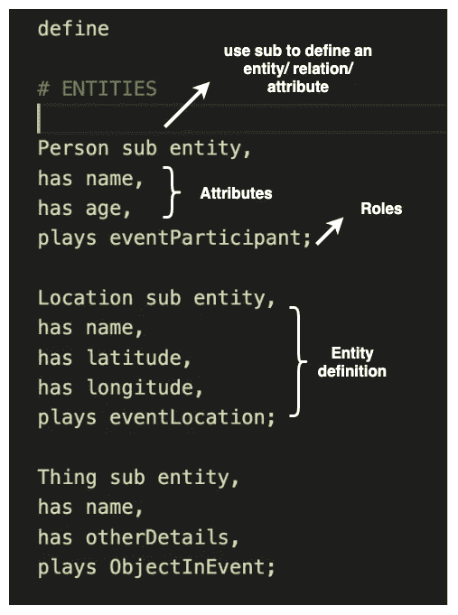
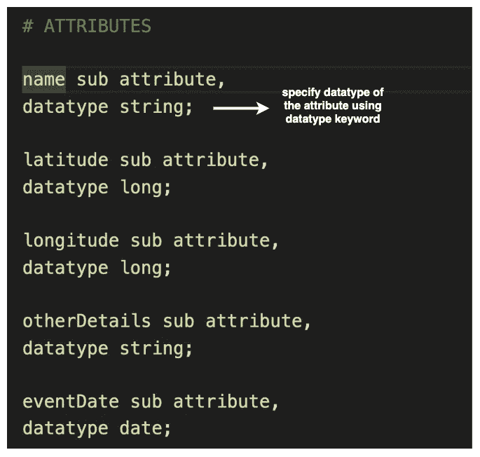
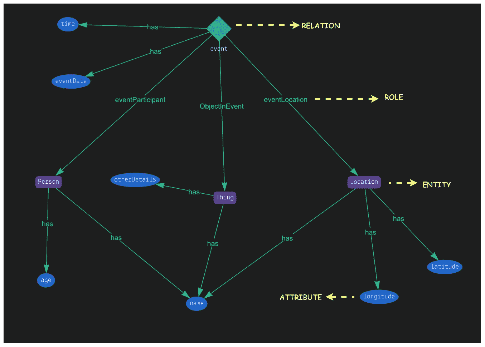
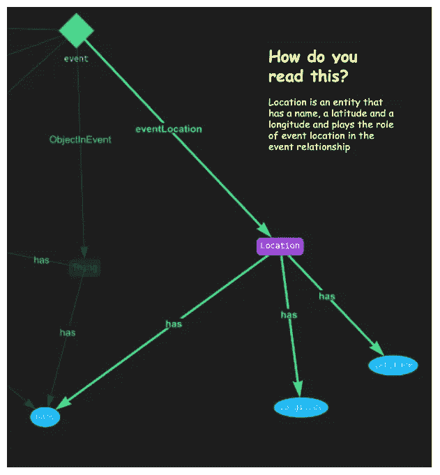

# 用格拉克描述的一天

> 原文：<https://towardsdatascience.com/a-day-described-in-grakn-part-i-46bb7e3cd82a?source=collection_archive---------31----------------------->

## Graphbits:一堆关于图形的 5 分钟文章

## Grakn 模式

先说超图！长话短说，超图可以有同时连接两个以上节点的边。所以一定有超图模型的数据库对吧？是的，有，而且是[**Grakn**](https://grakn.ai)……这就是这篇文章(以及其他一些文章)将要讨论的内容。

# Grakn


[来源](https://camo.githubusercontent.com/a4b2afa276e152da35ecbd6454755fc14182b891/68747470733a2f2f6772616b6e2e61692f6173736574732f696d672f6772616b6e2d6c6f676f2d6e616d652e706e67)

Grakn 被称为“智能数据库”,它允许您通过扩展实体关系方法(主要用于 SQL 数据库)来为不同领域建模知识库。由自动推理引擎驱动，它能够在大型数据集上执行逻辑推理。Grakn 有自己的声明式查询语言 Graql，同时也有自己的可视化工具**Grakn 工作库**。(稍后将详细介绍)

说得够多了…让我们言归正传。

## Grakn 模式

在将任何数据加载到数据库之前，应该创建一个模式。

可以将模式视为数据库的蓝图，它为您提供了一个关于如何构建数据的清晰思路。

请注意！模式设计是创建数据库的第一步，也是最关键的一步。几乎所有其他操作都取决于模式的定义方式。

让我们用一个例子创建一个简单的模式。

考虑这个场景

> Whatsville 市在新年前夕举办了一场 Gina Goodvoice 的音乐会，该市期待着来自邻近城市的游客激增。鲍比是其中之一。想要探索这个城市，博比决定提前到达。那天早上，他从 WhoTown 乘火车到达 Whatsville，和他的朋友 Tim 在附近的一家咖啡馆共进早餐。然后他决定去参观城市博物馆，并顺便买了一本书。午餐，他从食品车买了一个三明治，在湖边坐了一会儿。傍晚时分，他前往将举行音乐会的城市体育场。他在音乐会上玩得很开心，听着 Gina Goodvoice 的曲子。音乐会一直持续到深夜，之后，博比乘最后一班火车回家。

为什么我跑题这么多？原因很简单。

想象一下鲍比的世界。或者说，鲍比的一天。他遇到了一些人；他去过的地方；他买的东西等等。只是一整天发生的一系列事件。现在，我们要在同一天在格拉克做这个模型。

要创建模式，首先需要确定实体、属性、关系和角色。以下是对它们的简要描述

*   **实体**独立存在。它们是实际存在的东西。
*   **关系**通常代表实体之间某种形式的联系。
*   实体或关系的特征可以使用**属性**指定。
*   最后，在任何关系中，实体(或属性)总是扮演某种**角色**

迷茫？在我们的例子中，让我们来识别每一个。

可以称为实体的东西有哪些？一个简单的方法是识别人、地点和事物(如果有动物的话，还有动物)

所以我们有博比、蒂姆、吉娜·古德沃斯、Whatsville、WhoTown、博比乘坐的火车、他吃早餐的咖啡馆、举行音乐会的体育场、他买的三明治等等。那里！我们有基本的实体:人、地点和事物。

这些实体的特征是什么？所以一个人可以有一个**名字和一个年龄，比如**。一个城市(或任何地方)可以有一个**名字**，一个**母国家/州，一个纬度，一个经度**等等来标识它。同样，一个事物也可以有一个名称和其他某些特征。这些都可以成为你的属性。

接下来，如果你仔细想想，是什么把所有这些实体联系在一起？**一个**一个**事件**。

Gina Goodvoice 的演唱会是一个联系 Bobby，Tim，Gina 的活动，在新年前夕在体育场举行。那是一个事件，是你的图式中连接一个人、一个地方和一件事物的关系。

此外，一个人在事件中扮演**参与者**的**角色**，地点扮演事件地点的角色。在那里，我们为关系中的实体分配角色。

# 一直到代码

好了，是时候开始敲打了。我们将创建之前为 Grakn 定义的模式。

**但是首先！安装:**

确保您已经安装了 Grakn 服务器和工作库。如果没有，那就在这里绕道[再回来。](https://grakn.ai/download)

## 创建模式

该模式可以在带有“.”的文件中定义。 **gql** 扩展。

模式定义总是以关键字“ **define** ”开始。

接下来，我们定义实体。所以我们有一个**人、地点和事物**作为我们的实体。此外，我们可以定义实体的属性和角色。

比如一个**人有一个属性名，在一个事件中扮演参与者**的角色。

*   关键字**“sub”**用于指定一个**实体、关系或属性**。
*   **实体或关系的属性**使用“**has”**关键字定义。
*   使用关键字**“plays”**定义**角色**。



定义实体

接下来，我们需要定义模式中提到的所有**属性**。定义每个属性时，必须指定属性的数据类型。这可以使用“**数据类型**”关键字来完成。



定义属性

最后，说到人际关系。**关系**定义类似于实体定义。**关系可以有属性，甚至可以扮演角色**。

定义中使用了关键字“ **relates** ”来指定关系连接哪些角色。一个关系可以连接属性、实体甚至关系！

例如，事件关系与角色“ **eventParticipant** ”和“ **eventLocation** ”相关，这两个角色分别由实体 person 和 Location 扮演。

(注意，关系可以连接角色，而不是实体)


定义关系

既然我们已经定义了模式。我们需要把它载入 Grakn。

## **将模式加载到 Grakn 中**

前往您的终端并启动 Grakn 服务器:

```
grakn server start
```

现在使用以下命令加载模式:

```
grakn console -k grakn_example -f schema.gql
```

这里的 **-k** 自变量代表“**键槽**”。请将密钥空间视为数据库的名称。而这里的 **-f** 则是模式文件的**文件路径**。

## 最终检查

如果您得到如下输出

```
Successful commit: schema.gql
```

那么这意味着您的模式已经加载。现在您可以前往 Grakn Workbase 并查看您的模式。它看起来应该有点像这样:



Grakn 模式:(黄色箭头将告诉您每个形状的含义)



解读模式图的简单方法

搞定了。下一步是将数据加载到数据库中。这本身就值得一整篇文章。所以我只能说敬请期待！祝阅读愉快！

链接到以前的博客:

[](/the-graph-epiphany-4050e96ddcf6) [## 图形顿悟

### Graphbits:一堆 5 分钟的文章:都是关于图形的

towardsdatascience.com](/the-graph-epiphany-4050e96ddcf6) [](/the-graph-models-656a0005aa21) [## 图形模型

### Graphbits:一堆关于图形的 5 分钟文章

towardsdatascience.com](/the-graph-models-656a0005aa21)