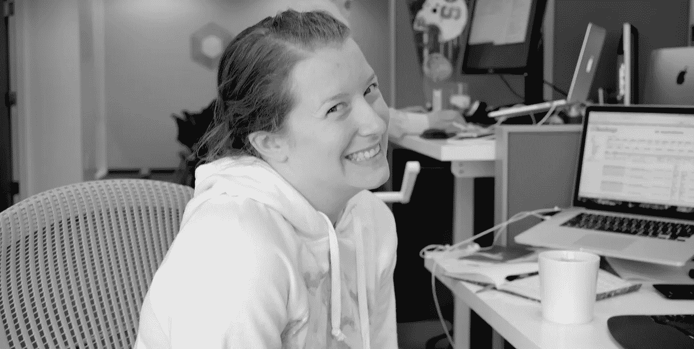
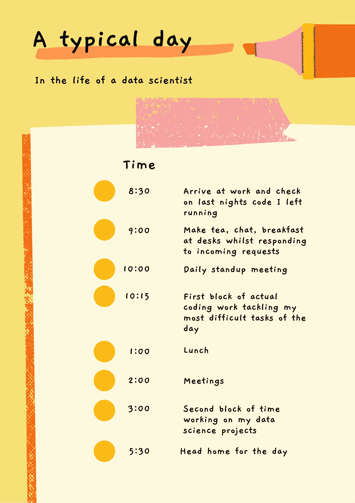

# 旧金山数据科学家的一天

> 原文：<https://towardsdatascience.com/a-day-in-the-life-of-a-data-scientist-in-san-francisco-ffe32ca52d20?source=collection_archive---------19----------------------->

## 数据科学家通常在工作中会做些什么？

我在办公桌前的一张有点尴尬的照片

有抱负的数据科学家经常问我两个问题:

*   数据科学家实际上是做什么的？
*   对于数据科学家来说，典型的一天是怎样的？

这些都不是特别容易回答的问题，因为我遇到的每个数据科学家都是不同的。他们喜欢的工作方式反映了这些差异。

此前，我在一家硅谷医疗保健初创公司担任了两年的数据科学家。在这篇文章中，我将特别关注那段经历，让你了解在旧金山做一名数据科学家是什么感觉。那段时间，我是一名医疗保健数据科学家。该公司正在处理一个大型健康保险索赔数据集(数十亿行数据)，以帮助人们做出更明智的医疗保健决策。数据科学团队正在创建数据集，用于我们网站上面向用户的产品。

我希望有抱负的数据科学家会发现这个故事很有用，可以让他们更好地了解数据科学家的实际工作。在整个故事中，我还将强调许多我认为对于在初创公司成为一名成功的数据科学家很重要的技能。

# 典型的一天是怎样的？

作为一名数据科学家，有些日子很突出:

*   开始一个新项目
*   推出数据产品
*   参加会议
*   截止日期紧迫的一天
*   新的数据科学团队成员开始工作的那一天

然而，在这两者之间有许多日子遵循着相似的模式，至少对我来说是这样。

这些日子里，我正在进行一个项目，或者可能是几个项目，我需要继续工作。通常，全天会召开会议，与项目负责人和数据科学团队的其他成员进行交流。

我制作了一张我每天时间表的信息图

# 早上 7:00 开始我的一天

我是一个早起的人，所以我通常在 7 点左右起床。我会冲个澡，穿好衣服，在早上 7:30 左右离开家。

当我住在旧金山时，我在米申湾巨人体育场附近有一套公寓。我真的很喜欢那个地方，因为它就在水边。它比旧金山的市区干净得多，闻起来也不像尿。办公室在金融区，离轮渡大楼不远。所以大多数时候我喜欢走路去上班。

# 上午 8:30 一天的第一项任务

当我到达办公室时，通常是早上 8:30 左右。通常有几个其他人已经在那里了，但我几乎总是数据科学团队的第一个人。我的大多数队友都不是早起者，但是我在早上更有效率。

公司允许我们有灵活的工作时间，只要我们参加任何需要我们参加的会议。我的许多同事会在上午 10 点左右进入办公室，然后加班完成工作。我喜欢我们被信任以最适合我们的方式完成任务。

当我打开电脑时，我通常会做的第一件事是检查我整夜运行的代码。我们有一个机器集群，可以用于我们共享的数据科学工作。我们中的许多人会等到晚上才运行计算密集型工作。这样我们就不会让更多的实验性代码在白天运行缓慢。

同时进行两三个项目是我的惯例。这样我就可以进行多任务处理，而不会在等待代码运行时陷入困境。我们必须等待分析完成的时间从几分钟到几天不等，但最常见的是几个小时。如果我改为线性工作，我将不得不花费大量时间闲荡拇指和等待。

[https://imgs.xkcd.com/comics/compiling.png](https://imgs.xkcd.com/comics/compiling.png)

如果我的通宵工作产生了结果，我通常会观察它，看看它是否合理。之后，我会去给自己泡一杯茶，从办公室里的健康零食中抓一些早餐。我从来不喝咖啡，这让我的许多同事很反感😆

一般来说，到那个时候，其他团队的一些人应该已经到了，我经常喜欢在他们喝咖啡的时候和他们聊他们的项目。这种非正式的交流对于了解其他团队的进展和他们正在积极进行的项目非常有帮助。

然后，我会把早餐和茶放在办公桌上，同时检查是否有新的空闲时间或电子邮件需要我立即开始工作或回复。如果没有什么紧急的事情，我会打开一天的工作准备开始。

# 每日站立

当我完成所有的晨间仪式时，通常是起立的时候了。站立会议是敏捷框架的一部分。对我们来说，他们包括简短的日常会议，数据科学团队会站成一圈，告诉小组我们前一天在做什么，我们当天计划做什么，以及我们是否有任何障碍。

有时，我们的站立会议将与其他工程团队结合在一起，特别是当我们一起工作来完成一个项目时。例如，当我们将要发布一个新的数据产品，它将成为网站上的一个功能时，我们需要与产品工程和数据工程团队密切协调，以使其顺利进行，没有延迟。

# 早上的工作

在站立会议之后，我通常会有一段时间可以投入到我当时正在做的事情中。我发现，如果我不在一天中划出大量的时间，人们会一直和我安排会议。这不利于我完成工作，因为我有时发现我需要相当多的时间来让我的头脑进入正确的流程，以便在特别具有挑战性的任务上取得进展。

在那段时间，我也经常戴上我的降噪耳机。耳机可以向你周围的人传递一个信息，那就是你正在集中注意力，不想被打扰。这可能看起来有点粗鲁，但我发现这很有帮助，因为人们知道什么时候可以打断你，什么时候你不希望他们打断你。即使它更多的是一个潜意识的信息。我们工作的办公室是开放式的，每个团队都有很多桌子，所以如果不小心的话，很容易被谈话分散注意力。

因为我是一个早起的人，我会一直计划在这段时间里处理最具挑战性的工作。我总觉得我在午饭前就完成了大部分工作，之后我的效率就大大降低了。所以我想充分利用我的大脑处于最佳工作状态的时间。

在此期间，我主要是写代码。我花了大量时间将数据转换成运行更复杂分析所需的格式。实际上，构建模型并对它们进行查询占用了我的一些时间，但是到目前为止，我工作中最耗时的部分是准备好数据。

幸运的是，我们有优秀的数据工程师，他们为我们的数据提供了高效的 ETL 管道。他们负责维护管道。然而，我们拥有的数据集包含数十亿行，因此找到我们需要的子集并对其进行操作以便运行算法仍然是一项耗时的工作。

因此，当人们说数据科学家的大部分时间都花在数据清理上时，我发现这是真的。尽管由于我们的数据工程师的巨大努力，我们的数据集已经相对干净，但总是有一些特定的方面需要修改。例如，我经常需要将多个诊断列合并成一个，然后为每个唯一值创建一个新的二进制变量。

在我们的办公室，我们有曲柄办公桌，让我们可以坐着或站着。一般来说，我会在早上精力最充沛、腿还不累的时候努力站起来。我发现这种练习对我的背部和颈部非常有益。符合人体工程学的工作站对于长时间使用电脑的人来说非常重要。如果你在工作时照顾好自己的身体，你可以有更长的数据科学家生涯。

# 午饭时间

一天中我最喜欢的时间之一总是午餐时间。我们有可爱的餐饮，全公司都会分享。我们会坐在长桌旁一起吃饭。我曾经有过的一些最好、最有趣的对话都是在午餐时间进行的。

我的许多同事来自技术和软件工程之外的不同背景。我发现听到他们在工作之外做些什么以及他们在过去的职业生涯中做了些什么非常有趣。我的一些同事甚至在业余时间创办了一本科技杂志。与如此有趣的人一起工作是一次有益的经历。

我们会在午餐时间谈论各种话题。我记得有一次关于未被发现的人的特别有趣的对话。我们都非常专注于这次谈话，以至于我们决定放一部关于它的纪录片，让全公司的人在我们的会议大屏幕上观看。

午餐时间是让我的大脑从思考工作中休息一下的好时机。当我不积极思考问题的时候，我经常会有很好的想法来解决问题。因此，我真的很高兴我们没有在办公桌前吃饭，并在午餐时间继续工作。

每周一次，我们会在午餐时间听取公司人员或特邀演讲者的报告。人们会展示他们一直在做的事情，或者他们提出的与我们正在做的工作相关的想法。我认为这是一次很好的实践，因为它让我接触到了其他团队正在使用的不同技术和技巧，否则我永远也不会知道。

当我们必须在会议上展示我们的作品时，这也是一个很好的练习。我认为首先在友好的观众面前测试演示总是一个好主意。

# 会议，会议和更多的会议

我会尽量把大部分会议安排在午饭后。这样我一天中就有了第二大块时间来做我的项目。

我们试图将会议减少到最低限度，但会议蠕变是一个真实的事情。然而，有时他们有必要让每个人都在同一页上，特别是当一个项目跨几个团队运行时。会议的数量有时确实开始增加。我会召开的会议类型包括:

*   与我的主管进行一对一会谈(每周一次)
*   与首席执行官一对一会谈(大约每季度一次)
*   项目启动会议(在项目开始时召开一次)
*   项目进度会议(根据项目需要，通常每周一次)
*   项目后评审(在项目结束时)
*   医疗审查会议(每个项目一次)
*   统计评审会议(每个项目一次)
*   数据科学团队会议(每周)

在这些会议中，我经常需要向不同的利益相关者交流我的分析方法或结果。我认为这对于任何数据科学家来说都是一项非常重要的技能。宣传你的项目，同时承认局限性并准确传达你的发现是很难做好的。然而，这可能是项目成功或失败的区别。

只要有可能，我会边走边谈。我发现走出办公室，在新鲜的空气中让我的血液循环起来是令人振奋的。我还认为，当人们不害怕被偷听时，他们可以更加开放。

我们很幸运，在我们位于金融区的办公地点附近，有许多可爱的地方可以步行。附近有一个公园，有时我们会去那里，在阳光下举行会议。或者再远一点是轮渡大楼，那里经常有市场和街头艺人。能够欣赏旧金山美丽的风景和声音真是太好了。

# 采访未来的数据科学家

在我的一天中，我经常会有面试潜在数据科学团队雇员的任务。我对何时安排面试没有多少发言权，因为面试必须与多个其他团队成员协调。

我喜欢采访。对我来说非常重要的一点是，在数据科学团队中，我们每个人都有发言权。即使我们没有雇用候选人，我通常会发现面试是一个非常积极的经历。我喜欢认识新的人，听他们讲述他们过去做过的项目。

只要有可能，我会向候选人提供反馈。我知道当我面试我的第一个数据科学职位时，我发现这是非常宝贵的。

参加面试小组非常有趣。我在公司工作期间，我们根据资历聘用了全方位的数据科学家。我们雇佣了非常早期的职业数据分析师，还雇佣了数据科学团队的新负责人。在雇佣我未来的老板时，我当然非常关注。我非常幸运地接触到了很多将数据科学作为职业的不同思考方式。

# 下午的工作

和早上一样，我会尽我所能在下午获得一大块不受打扰的时间。整个下午，我经常在办公室四处走动，在沙发上工作，或者在会议室工作，甚至在午餐区工作。

我有时发现，如果我不在座位上，我会少被打扰。风景的改变有时也会给我新的灵感来解决我正在处理的任何问题。

# 一天快结束的时候

接近下班时间时，我常常对我的工作感到非常沮丧，尤其是如果那天工作给我带来麻烦的话。有时我会在离开前和同事聊天，听取汇报，减压。这是我工作过程中的一个重要部分。这是一种非正式的获得反馈的方式，也许是一种用不同的方式看待问题的建议，这是我可能没有想到的。

对我来说，数据科学一直是一个非常协作的过程，尽管大多数实际工作都是你一个人完成的。尽管我们通常会为不同的团队成员准备不同的项目，但我总觉得整个数据科学团队都对我们完成的每个项目做出了贡献。即使只是充当一个传声筒或提供建设性的批评。

下午 5:30 左右，我会结束一天的工作，下班后可能会和朋友去喝一杯。我通常是当天最先离开的人之一，因为我也是最先到达的人之一。我从不担心比别人早离开，因为我们总是被鼓励要平衡工作和生活。

为一家真正重视员工的初创公司工作，而不是把他们嚼碎再吐出来，这种感觉真好。我听说过许多其他科技公司以这种方式利用员工的可怕故事，我非常感激那不是我的经历。

# 结论

我希望您已经发现了这个故事的信息，它让您对数据科学工作中可能涉及的不同类型的事情有了更好的了解。正如我所说的，我的经验绝不是普遍的，但它可以让您深入了解数据科学家除了进行数据分析和设计数据项目之外的一些职责。

除了数据，我的另一个爱好是绘画。你可以在 www.katemarielewis.com 找到我的野生动物艺术

 [## 我如何在 6 个月内从零编码技能成为数据科学家

### 我用来自学数据科学的 4 个工具没有花一美元

towardsdatascience.com](/how-i-went-from-zero-coding-skills-to-data-scientist-in-6-months-c2207b65f2f3)  [## 在开始任何数据科学项目之前，你应该问自己的 7 个问题

### 如何成为一名负责任的数据大师

towardsdatascience.com](/7-questions-you-should-ask-yourself-before-starting-any-data-science-project-51c29093c641)