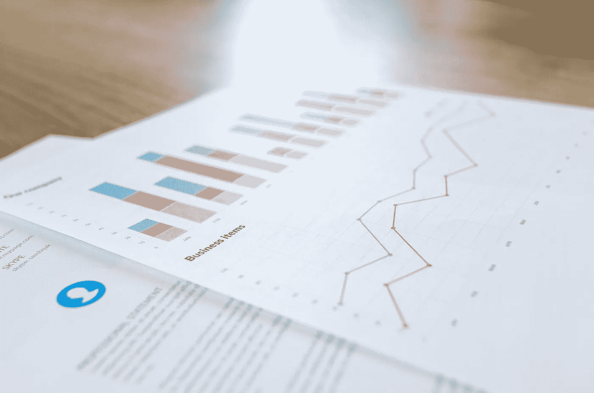

# 营销分析实习生的一天

> 原文：<https://towardsdatascience.com/a-day-in-the-life-of-a-marketing-analytics-intern-2bed4d11d30f?source=collection_archive---------37----------------------->

## 实习/营销分析

## 营销分析的日常观察

[来源](https://www.pexels.com/photo/analytics-blur-business-close-up-590045/)

“营销分析的日常工作到底是什么样的？”。作为达拉斯-沃斯堡地区一家公司的营销自动化和分析实习生，我的暑期实习已经过半。我有很多同事问我这到底是什么样的，因为他们中的许多人取消了实习或转向了在线形式。

我在这次实习中获得的技能令人惊叹！然而，我事先做了很多研究，老实说，我没有找到太多关于日常运营中营销分析的信息。我喜欢和我的同龄人谈论我的经历，然而，我想把我的经历放在一个平台上，让更多对它感兴趣的人可以亲眼看到，并展示从我一天的开始到结束是什么样子的。所以，让我们准备好醒来吧！

*免责声明:我不是全职营销分析专家，我只是简单地转述我的所见所闻。这并不意味着教你所有营销分析中使用的技巧和工具，因为我还在学习。如需了解此信息，请查看* [*走向数据科学*](https://towardsdatascience.com/) *。如果你对营销分析实习生或初级职位感兴趣，请继续阅读！*

# 早上 6:15:起床，准备好

我通常会在工作日之前的早上 6:15 左右醒来。这给了我大约一个小时的时间来阅读其他优秀作家的中型文章，并给了我一些小的、可管理的学习内容！除了我们都做的基本的早晨例行公事之外，我还泡了一杯咖啡，因为这是一个需要你在一天的大部分时间里进行批判性思考的角色，我保证你会在某个时候累的！喝了些咖啡后，我换好衣服，收拾好行李，去上班了！

# **上午 7:45:通过大门和清晨活动**

我走进门，找到我的办公桌，准备开始一天的工作！这是我在一天开始时做的几件事:

*   查看来自不同利益相关者和团队成员的电子邮件
*   查看我当天的日历，留意即将到来的会议和电话
*   检查我的团队研究项目的调查结果
*   花些时间向终身市场分析师学习

在新冠肺炎，电子邮件和视频通话现在是主要的沟通方式，即使是在办公室里。我们被要求戴上口罩，保持社交距离，但如果可能的话，我们也会尽最大努力坚持使用电子邮件和视频通话。在这个夏天，实习生们会有两个主要的项目，一个是团队项目，你可以针对高管团队给你的问题提出一个解决方案，另一个是你自己做一个项目，然后提交给你的部门，在我的案例中，这个部门就是市场部。我也总是试着花一些时间和市场分析师在一起，看他解决问题，以及他是如何解决问题的。

# **上午 9:00:Python 和分析实践**

在我为一天做好准备后，我通常会花一些时间练习我的 Python 和分析技能，将它们应用到营销分析师给我的数据集。这不是针对客户或利益相关者的，而是巩固我那天早上从营销分析师那里学到的东西的一种方式。我可能会使用 sklearn 构建一个线性回归模型，尝试使用 Pandas 提高我的数据清理效率，或者使用 matplotlib 创建快速可视化。我注意到的是，你如何完成工作并不重要。在我的左边屏幕打开 Stack Overflow，在我的右边打开 Jupyter 笔记本，这是完全可以接受的。我发现分析师总是在做许多不同的项目，知道如何在你的代码中变得高效是你在实习或初级职位中需要改进的技能。

# 上午 10:00:实习生活动

通常在上午，所有的实习生将通过一个 Zoom 电话会议，或者一个允许社交距离的非常大的会议室见面，并听取公司内部不同的发言者。这些演讲者通常是副总裁或高级副总裁，他们将讲述自己的经历，提供建议，并留出提问时间。对于一个入门级的职位，一天的下一部分通常会在这个时候开始！

# **上午 11 点:项目工作**

午饭前我要做的最后一件事是开始做我的项目。这是我珍惜的时间，因为我发现分析师有很多会议和其他业务要参加，当你坐下来分析你喜欢的项目时，这是一天中非常平静的一部分！今天这段时间，我开始使用 CRISP-DM 方法为我的部门演示整理项目计划。我研究了我的项目如何对组织有价值，我将如何与营销分析师合作从我们的自动化工具中提取数据，以及确保我按时完成项目的时间表。

# 中午 12:30:午餐！

我们赶上吃午饭了！我在这篇文章中包括了这一部分，因为午餐是一天中唯一可以休息的时间。作为一名营销分析实习生节奏非常快，因为我们在学习、倾听，同时也在做自己的项目。午餐也是在轻松的环境中与其他实习生见面的好时机。这个项目中的许多实习生变得很亲密，因为我们真的在午餐时间建立了关系！

# 下午 1:30:与实习生项目团队接触

当我吃完午饭回来时，有时我会做项目，但大多数时候，我会和我的实习生项目组的一个或多个成员接触。今天，我们完成了准备好调查数据供我分析的最后步骤。我们还讨论了我们希望如何展示我们的数据，我们一眼就发现了哪些有趣的东西，以及我们如何交流我们发现的数据。

# 下午 2:30:其他项目工作

我要做的下一件事是花更多的时间在我的个人项目上。在这个阶段，我花更多的时间在项目的后期，而不是早期。我尽量把上午的时间花在计划和执行前期任务上，比如提取和清理数据，把下午的时间花在后期任务上，比如分析和记录我的工作。我这样做是因为我个人在早上有更多的精力，可以在更长的时间里做更高层次的思考任务，比如计划和清洁，而不是在下午。作为一名实习生，我还将帮助完成营销自动化团队需要完成的任何其他浮动任务。这可能是任何事情，从拉基本报告，修复电子邮件活动，或采取一些工作，从营销分析师，让他们可以喘口气。

# 下午 3:30:营销自动化会议

营销自动化通常会在傍晚开会，所以这是我们召开战略或分析会议的时候。今天，我们开会讨论了活跃率非常低的用户，以及我们如何进一步吸引他们，让他们与我们的内容互动。我们通常会让营销自动化经理、营销分析师、营销策略师和我一起讨论解决问题的方法。

# 下午 4:30:一天任务结束

在一天工作结束时，我通常会检查最后一分钟的电子邮件，检查我的同事，并为第二天制定一个计划。作为一名营销分析实习生，或者实际上任何一名分析师，一个重要的细节是，你几乎不会有和前一天一样的一天。在我实习的公司，整个 60 人的部门只有一名营销分析师。他从事从内容分析、电子邮件性能、社交媒体参与或新产品战略的所有工作。在一天结束时花些时间来计划下一天是至关重要的！

# 下午 6:00:下班后任务

下班回来后，我通常会花一些额外的时间来提高自己的个人分析技能。这时，我将尝试学习不同语言和工具的新部分，例如学习新的 Python 包或 SQL 函数，阅读其他媒体作者的新建模工具，或者学习新的数学理论以帮助更好地理解我所做的工作。

# 晚上 7 点:自由活动时间！

在我完成我的个人工作后，我会在晚上的剩余时间放松或参加休闲活动。与普遍的看法相反，做一名营销分析师需要的创造力和分析能力一样多。让你的大脑休息一下对保持创造力流动很重要！

如果这有帮助，请让我知道！我真的很喜欢写关于数据的文章，我很想再写一篇文章，谈谈我从技术角度学到的一些关键知识，如果你想进入入门级营销分析职位或实习，你应该知道什么，如何抓住实习机会，等等！大家注意安全，祝你们有美好的一天！

若要联系我或接收更多内容，请在 Twitter 上关注我@[*BMNAnalytics*](https://twitter.com/BMNAnalytics)*！*