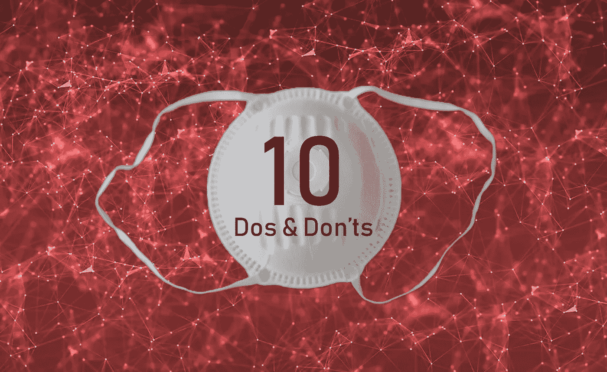

# 一位决策科学家给新冠肺炎的十大禁忌

> 原文：<https://towardsdatascience.com/a-decision-scientists-10-dos-don-ts-for-covid-19-805577bccd67?source=collection_archive---------25----------------------->

## 在疫情期间，照顾好你的大脑，聪明对待数据，做出更明智的决定

如果你最喜欢的新零食是新冠肺炎更新，这里有一些提示可以帮助你在大量错误信息中保持漂浮。(你在期待洗手的提示吗？这是一份非常不同的清单。)

> 提高你对新冠肺炎错误信息的抵抗力。

无论你是在分析病毒数据，制定战略决策，还是只是在社交媒体上大吃大喝，这都是为你准备的；我写的每一篇链接文章都是为了取悦初学者和专家。你可以把它想象成一次与这些天特别相关的主题之旅。

***作者简介:*** *By day，*[*Cassie Kozyrkov*](https://bit.ly/decisionleader)*leads*[*决策智能*](http://bit.ly/quaesita_di) *at Google。晚上，她写关于数据科学的博客供你娱乐。*

# 不要

1.  不要混淆数据和客观事实。[【更多】](http://bit.ly/quaesita_hist)
2.  别忘了你的大脑看到的都是假图案。【[更多】](http://bit.ly/quaesita_inkblot)
3.  不要成为确认偏见的受害者。[【更多】](http://bit.ly/quaesita_confirmation)
4.  不要忽视结论背后的假设。[【更多】](https://twitter.com/quaesita/status/1247888569386983426)
5.  不要指望人工智能能神奇地拯救世界。[【更多】](http://bit.ly/quaesita_fad)
6.  不要把分析性的“见解”看得太重。[【更多】](http://bit.ly/quaesita_versus)
7.  不要假设每个人衡量事物的方式都一样。【[更多](http://bit.ly/quaesita_dmguide2)】
8.  不要拿苹果和橘子比较。[【更多】](http://bit.ly/quaesita_tiger)
9.  不要盲目相信数据模型和预测。[【更多】](http://bit.ly/quaesita_fault)
10.  不要忽视领域知识的重要性。【[更多](http://bit.ly/quaesita_covidappendix)】

# 磁盘操作系统

1.  对于重要的决策，一定要遵循一个结构化的流程。【[更多](http://bit.ly/quaesita_covid)
2.  一定要考虑你的默认行为。[【更多】](http://bit.ly/quaesita_damnedlies)
3.  在查看数据之前，一定要设定决策标准。[【更多】](http://bit.ly/quaesita_inspired)
4.  一定要检查你是否理解统计学的基本逻辑。【[更多](http://bit.ly/quaesita_statistics)
5.  一定要仔细选择你的人口。[【更多】](http://bit.ly/quaesita_incompm2)
6.  一定要思考这些数据是从哪里来的。[【更多】](http://bit.ly/quaesita_provenance)
7.  在解释不是你自己收集的数据时一定要小心。[【更多】](http://bit.ly/quaesita_notyours)
8.  一定要坚持数据拆分。[【更多】](http://bit.ly/quaesita_sydd)
9.  一定要让自己了解偏见。[【更多】](http://bit.ly/quaesita_bias)
10.  一定要原谅自己觉得暧昧有压力。[【更多】](http://bit.ly/quaesita_ellsberg)

> 如果您发现此信息有帮助，请与其他人分享。

# 现在是完全不同的东西…

感谢阅读！如果你在这里玩得开心，并且对人工智能感兴趣，这里有一个初学者友好的介绍供你娱乐:

在这里欣赏整个课程播放列表:[bit.ly/machinefriend](http://bit.ly/machinefriend)

# 与凯西·科兹尔科夫联系

让我们做朋友吧！你可以在[推特](https://twitter.com/quaesita)、 [YouTube](https://www.youtube.com/channel/UCbOX--VOebPe-MMRkatFRxw) 和 [LinkedIn](https://www.linkedin.com/in/kozyrkov/) 上找到我。有兴趣让我在你的活动上发言吗？用[这个表格](http://bit.ly/makecassietalk)联系。